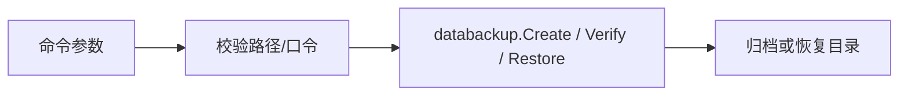

# 离线数据 CLI

[架构手册](../../docs/architecture/README.md) · [DataBackup](../../internal/databackup/README.md)

`main.go` 接受 backup、verify、restore 命令，把路径与口令文件传给 `internal/databackup`。它用于应用完全退出后的离线操作；备份与恢复可处理加密 `.age` 归档，旧 ZIP 路径用于兼容读取。

阅读 `main.go` 的参数分派，然后到 `databackup/encrypted.go` 与 `archive.go` 跟实际文件操作。恢复前必须验证归档并保留回退目录；CLI 不应在 Wails/Runtime 正运行时替换数据根。
