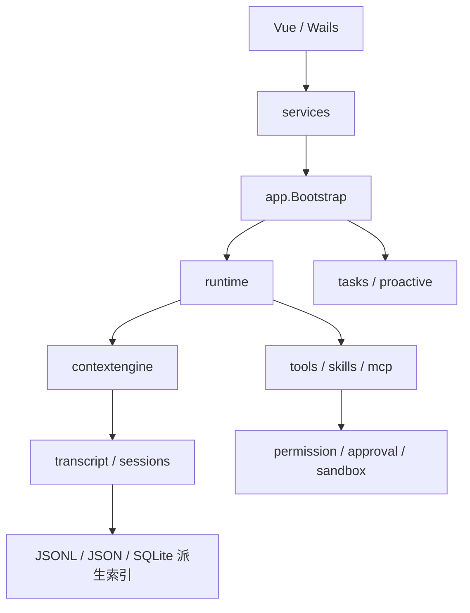

# Humbert 架构手册

这是一套按源码包编排的中文阅读手册。每章都放在对应目录的 `README.md`，包含职责、实现链路、Mermaid 图和关键代码入口。建议先读[代码阅读指南](code-reading-guide.md)，再沿下表逐章深入；[领域边界](domain-boundaries.md)记录持久化、并发和恢复约束。

## 推荐学习路线

1. **建立入口**：[桌面启动](../../cmd/desktop/README.md) → [依赖组装](../../internal/app/README.md) → [Wails 服务](../../internal/services/README.md) → [前端](../../frontend/src/README.md)。
2. **走通一轮聊天**：[Agent](../../internal/agents/README.md) → [Session](../../internal/sessions/README.md) → [Runtime](../../internal/runtime/README.md) → [Transcript](../../internal/transcript/README.md)。
3. **理解模型输入**：[Context 与压缩](../../internal/contextengine/README.md) → [Session Memory](../../internal/memory/README.md) → [个人记忆](../../internal/preferences/README.md) → [多模态](../../internal/multimodal/README.md)。
4. **理解动作边界**：[工具框架](../../internal/tools/README.md) → [内置工具](../../internal/tools/builtin/README.md) → [权限](../../internal/permission/README.md) → [审批](../../internal/approval/README.md) → [沙箱](../../internal/sandbox/README.md)。
5. **理解扩展和后台工作**：[Skills](../../internal/skills/README.md) → [MCP](../../internal/mcp/README.md) → [Tasks](../../internal/tasks/README.md) → [Proactive](../../internal/proactive/README.md)。

## 模块目录

### 应用入口与桌面层

| 章节 | 解决的问题 |
| --- | --- |
| [桌面入口](../../cmd/desktop/README.md) | 启动前备份/恢复、Wails 创建、关闭。 |
| [离线数据 CLI](../../cmd/data/README.md) | 备份、校验、恢复命令。 |
| [前端](../../frontend/src/README.md) | Vue、Pinia、API、实时事件与文件面板。 |
| [App](../../internal/app/README.md) | 依赖装配、工具注册、生命周期。 |
| [Services](../../internal/services/README.md) | Wails DTO 与事件桥。 |
| [Config](../../internal/config/README.md) | YAML、环境变量与数据路径。 |
| [Logging](../../internal/logging/README.md) | 结构化日志与脱敏。 |
| [EventBus](../../internal/eventbus/README.md) | 进程内同步事件。 |

### 对话、上下文与数据

| 章节 | 解决的问题 |
| --- | --- |
| [Agents](../../internal/agents/README.md) | Agent Profile、引用校验、删除恢复。 |
| [Models](../../internal/models/README.md) | Provider、模型角色、能力与凭据引用。 |
| [Sessions](../../internal/sessions/README.md) | 会话元数据、附件和消息 API。 |
| [Transcript](../../internal/transcript/README.md) | JSONL 消息树、分页、长会话位置索引。 |
| [Runtime](../../internal/runtime/README.md) | Turn 生命周期、Eino、取消与恢复。 |
| [ContextEngine](../../internal/contextengine/README.md) | Token 预算、消息投影、压缩与检查点。 |
| [Memory](../../internal/memory/README.md) | 自动会话记忆、Cursor 与分支校验。 |
| [Preferences](../../internal/preferences/README.md) | 用户资料、确认后保存的跨会话记忆。 |
| [Multimodal](../../internal/multimodal/README.md) | 图片回放与视觉辅助模型。 |
| [DocumentText](../../internal/documenttext/README.md) | PDF/Office 转 Markdown。 |
| [ContextArtifact](../../internal/contextartifact/README.md) | 大工具结果的 sidecar 和回查。 |

### 工具、扩展与安全

| 章节 | 解决的问题 |
| --- | --- |
| [Tools](../../internal/tools/README.md) | Registry、Scope、Guard、结果预算。 |
| [Builtins](../../internal/tools/builtin/README.md) | 文件、命令、网页、文档和历史工具。 |
| [Skills](../../internal/skills/README.md) | SKILL.md 安装、验证、冻结与按需读取。 |
| [MCP](../../internal/mcp/README.md) | Server 配置、发现缓存、工具选择。 |
| [MCP Eino Adapter](../../internal/mcp/einoadapter/README.md) | stdio/HTTP 连接、会话池、传输安全。 |
| [Collaboration](../../internal/collaboration/README.md) | `run_agent` 父子 Agent 工具链。 |
| [Permission](../../internal/permission/README.md) | 能力身份、风险与授权规则。 |
| [Approval](../../internal/approval/README.md) | 人类审批、Eino interrupt/checkpoint。 |
| [Sandbox](../../internal/sandbox/README.md) | 文件路径、网络与进程隔离。 |
| [Workspace](../../internal/workspace/README.md) | Managed/Custom 工作区、受控文件访问。 |
| [WorkspaceView](../../internal/workspaceview/README.md) | 右侧文件树和预览的只读适配。 |

### 后台功能与基础设施

| 章节 | 解决的问题 |
| --- | --- |
| [Tasks](../../internal/tasks/README.md) | 日程、Run 状态、重试与普通 Runtime 复用。 |
| [Proactive](../../internal/proactive/README.md) | 主动事件 Inbox、决策和执行。 |
| [Notifications](../../internal/notifications/README.md) | 通知协议、Provider 和事件投影。 |
| [SearchIndex](../../internal/searchindex/README.md) | SQLite WAL、FTS5 会话/文档索引。 |
| [DataBackup](../../internal/databackup/README.md) | 加密备份、校验、离线恢复。 |
| [Credential](../../internal/credential/README.md) | 系统凭据库、密钥迁移与备份导入导出。 |
| [AtomicFile](../../internal/atomicfile/README.md) | 小 JSON 文档的原子提交与严格读取。 |
| [Avatar](../../internal/avatar/README.md) | 头像格式与 Data URL 安全校验。 |

## 读源码时的共同规则

- 先找到调用入口，再顺着实际方法走；Mermaid 图标出边界，不能替代代码中的错误与取消路径。
- `session.jsonl` 是消息事实；`agents/session-metadata.sqlite` 是会话控制面的事实来源；`memory.json`、位置索引和 `cache/` 中的 SQLite 搜索库是派生数据。实时 EventBus 也不是持久化来源。
- 排查一次聊天以 `SessionID`、`RequestID`、`RunID` 关联；排查任务再加 `TaskID`，排查工具再加 `ToolCallID`。
- 修改磁盘格式、授权或并发时，同时阅读对应章节的恢复与安全边界，并运行相关包测试和 `go test ./...`。
