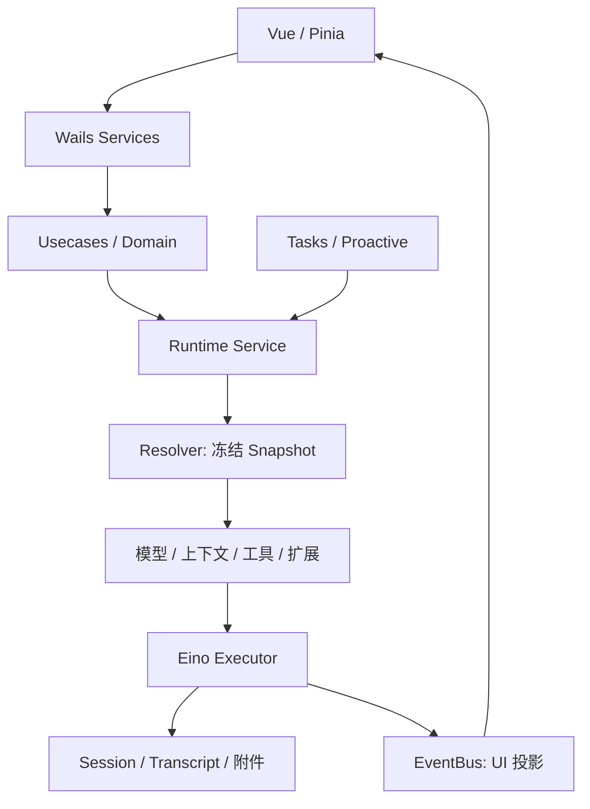

# 架构手册

本入口描述非 RAG 桌面 Agent 的现有边界。具体实现以包 README 和代码为准；数据事实见 [领域边界](domain-boundaries.md)，追踪运行见 [代码阅读导引](code-reading-guide.md)，框架适配见 [Eino 集成](eino-integration.md)。

```mermaid
flowchart TD
  UI[Vue / Pinia] --> API[Wails Services]
  API --> U[Usecases / Domain]
  U --> R[Runtime Service]
  R --> S[Resolver: 冻结 Snapshot]
  S --> C[模型 / 上下文 / 工具 / 扩展]
  C --> E[Eino Executor]
  E --> T[Session / Transcript / 附件]
  E --> B[EventBus: UI 投影]
  B --> UI
  Q[Tasks / Proactive] --> R
```

Application 是组合根，构造时显式注入依赖。领域不反查 App，不依赖 Vue 页面状态。普通聊天、计划任务和主动 Agent 动作共用 Runtime；权限、上下文预算和消息事实使用同一条链路。

| 范围 | 设计入口 |
| --- | --- |
| 启动、装配与关闭 | [App](../../internal/app/README.md)、[桌面](../../cmd/desktop/README.md)、[离线数据 CLI](../../cmd/data/README.md) |
| 桌面 DTO 与跨域规则 | [Services](../../internal/services/README.md)、[Usecases](../../internal/usecases/README.md) |
| 一轮执行与模型上下文 | [Runtime](../../internal/runtime/README.md)、[ContextEngine](../../internal/contextengine/README.md)、[Models](../../internal/models/README.md) |
| 用户事实与文件 | [Agents](../../internal/agents/README.md)、[Sessions](../../internal/sessions/README.md)、[Transcript](../../internal/transcript/README.md)、[Workspace](../../internal/workspace/README.md) |
| 工具与安全 | [Tools](../../internal/tools/README.md)、[Builtin](../../internal/tools/builtin/README.md)、[Permission](../../internal/permission/README.md)、[Approval](../../internal/approval/README.md)、[Sandbox](../../internal/sandbox/README.md) |
| 扩展与协作 | [Skills](../../internal/skills/README.md)、[MCP](../../internal/mcp/README.md)、[Collaboration](../../internal/collaboration/README.md) |
| 后台工作 | [Tasks](../../internal/tasks/README.md)、[Proactive](../../internal/proactive/README.md)、[Notifications](../../internal/notifications/README.md) |
| 数据服务与隐私 | [SearchIndex](../../internal/searchindex/README.md)、[DataBackup](../../internal/databackup/README.md)、[Credential](../../internal/credential/README.md)、[Logging](../../internal/logging/README.md) |
| 图像、文档和大结果 | [Multimodal](../../internal/multimodal/README.md)、[DocumentText](../../internal/documenttext/README.md)、[ContextArtifact](../../internal/contextartifact/README.md) |
| 前端与辅助配置 | [Frontend](../../frontend/src/README.md)、[Config](../../internal/config/README.md)、[Preferences](../../internal/preferences/README.md)、[WorkspaceView](../../internal/workspaceview/README.md) |

维护时先确定事实来源、运行 Owner 和故障出口，再修改局部。不要为小功能增加另一套 Runtime、配置中心或消息存储。
