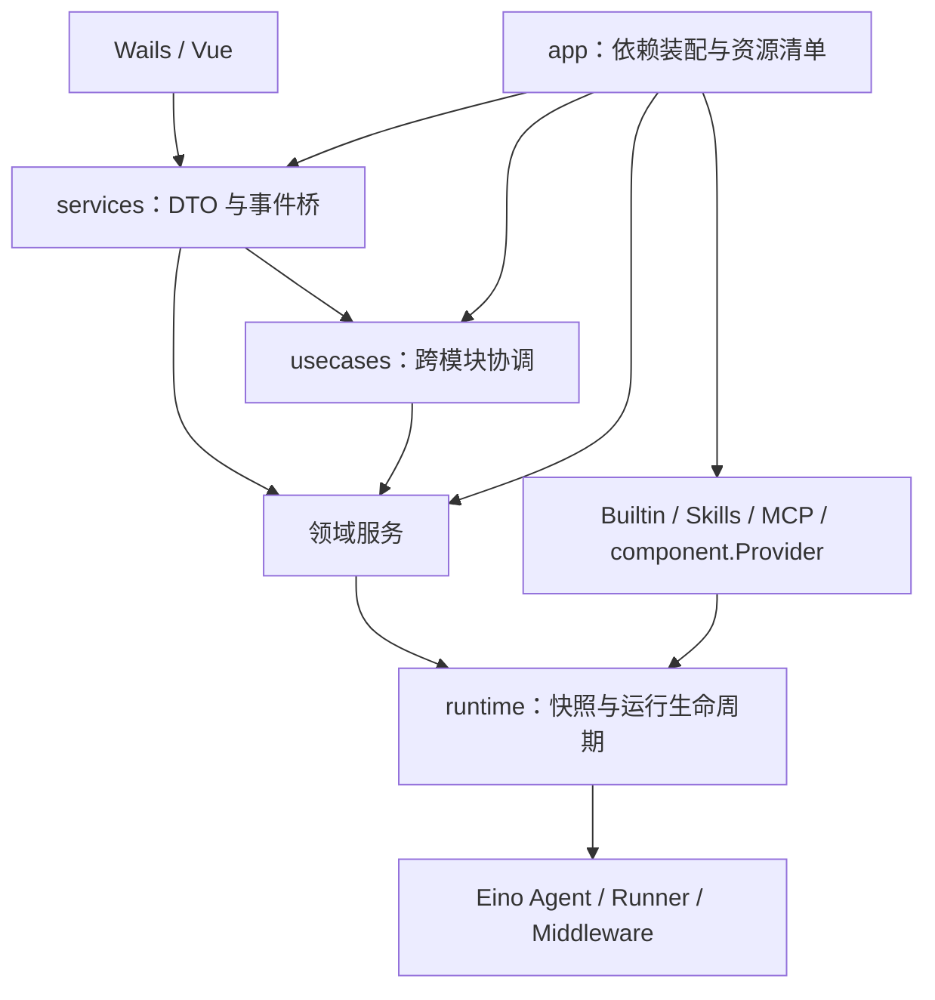

# Humbert 架构与扩展入口

当前结构按“桌面入口 → 应用用例 → 领域模块”组织，运行时统一装配能力。`internal/rag` 本次未审阅、未修改，暂不纳入这里的架构说明。

## 阅读入口

| 要了解的内容 | 入口 |
| --- | --- |
| 项目启动、依赖注入和资源所有权 | [App](../../internal/app/README.md) |
| 桌面 DTO、事件桥和服务注册 | [Services](../../internal/services/README.md) |
| 跨模块删除、凭据更新、视觉模型选择 | [Usecases](../../internal/usecases/README.md) |
| Turn、能力快照、Eino 执行和审批恢复 | [Runtime](../../internal/runtime/README.md) |
| Vue 页面注册和实时状态 | [前端](../../frontend/src/README.md) |
| 数据和权限边界 | [领域边界](domain-boundaries.md) |
| 一轮聊天的阅读路径 | [代码阅读导引](code-reading-guide.md) |
| 已复用的框架组件 | [Eino 集成](eino-integration.md) |

```mermaid
flowchart TD
  Desktop[Wails / Vue] --> API[services：DTO 与事件桥]
  API --> Usecases[usecases：跨模块协调]
  API --> Domains[领域服务]
  Usecases --> Domains
  Domains --> Runtime[runtime：快照与运行生命周期]
  Providers[Builtin / Skills / MCP / component.Provider] --> Runtime
  Runtime --> Eino[Eino Agent / Runner / Middleware]
  App[app：依赖装配与资源清单] --> API
  App --> Usecases
  App --> Domains
  App --> Providers
```

## 接入一个新功能

1. 在独立包内维护配置、Agent 绑定、SDK 连接和业务。普通业务函数不依赖 Wails，也不获取整个 `Application`。
2. 需要模型调用的能力实现 `component.Provider`。工具直接使用 Eino `InvokableTool`，优先用 `utils.InferTool` 等现成适配。
3. `Selection` 读取模块自己的显式绑定；没有选择就不提供任何工具。`Describe` 只构造本地 Schema；`Resolve` 返回捕获本轮配置的工具。
4. 通过 `app.WithModules(installer)` 装配。只有后台工作需要 `Start/Stop`，只有长期资源需要 `Close`。新模块不需要增加 `Application` getter 或修改 `Shutdown`。
5. 需要桌面 API 时，在桌面装配点把模块自己的 Wails Service 传给 `services.All(core, additional...)`。需要页面时，在 `frontend/src/features/` 的对应清单加入页面定义。

可编译的最小示例见 [textstats.go](../../examples/modules/textstats.go)。已有 Builtin、Skills、MCP 保留各自配置与选择语义，无需为了统一外观重新实现它们。

能力提供者只在启动时注册，不支持运行中热卸载。模块 `Stop` 停止新工作，`Close` 才释放正在被 Turn 使用的连接。工具名称使用 `<providerID>_` 前缀；宿主仍检查所有来源之间的名称冲突。`Revision` 必须随实现、Schema 或行为配置变化，不得包含秘密正文。

## 维护原则

数据只有一个所有者；跨模块规则放在小型用例中；接口由消费方的真实需求决定。Eino 负责执行和中间件，应用负责产品的状态、授权和持久化，不增加另一套 Agent 循环或通用依赖容器。
