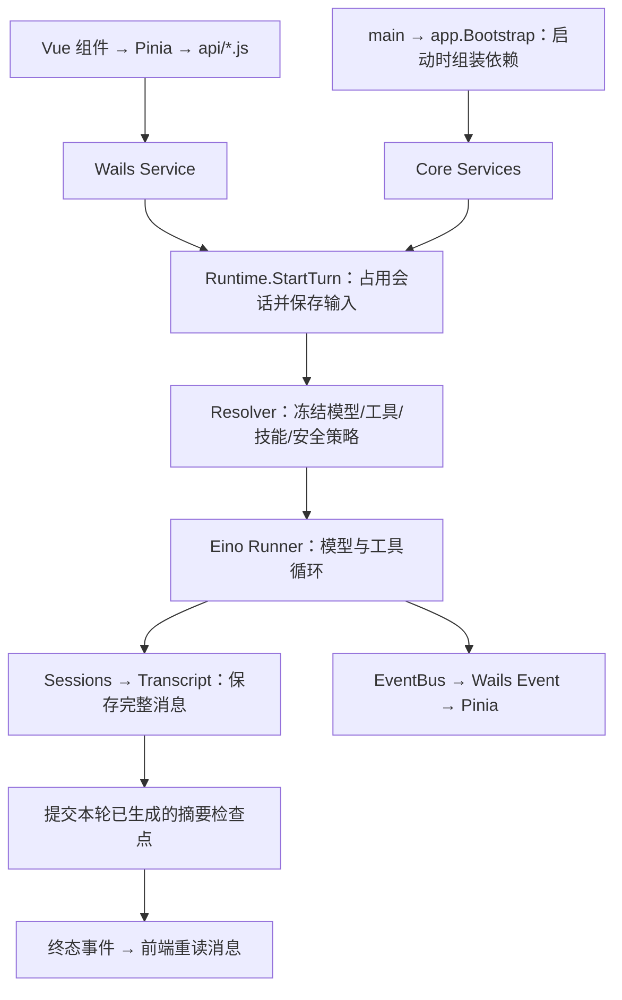

# Humbert 代码阅读指南

当前实现的完整讲解在 [项目实现详解与源码导航](implementation-walkthrough.md)：覆盖 25 个主题，按功能说明数据对象、真实调用顺序、存储、安全边界、Eino 与应用的分工，以及具体源码入口。

本页只保留入门路线。重构前后的变化和验证记录见 [Eino 集成记录](eino-integration.md)，各包章节见 [架构手册总目录](README.md)。

## 先建立三个认识

1. **Agent 是配置，Turn 才是执行。** `agents.Agent` 保存提示词、模型、工具和工作区；每轮由 Resolver 解析 Snapshot，再创建 Eino ChatModelAgent/Runner。不存在每个 Agent 永久占用一个模型线程的设计。
2. **完整历史、模型输入、前端状态是三个视图。** JSONL 保存消息事实；ContextEngine 从当前分支和摘要构建模型窗口；Pinia 保存临时流式输出，终态重新读取完整消息。
3. **Eino 负责 Agent 编排，应用负责产品边界。** 原生 filesystem、Skill、Reduction、Summarization、AgentTool 和 interrupt/checkpoint 被复用；存储、安装、权限 UI、沙箱和调度仍有应用职责。

## 启动和一次聊天

按顺序读这些文件中的指定函数，不必一开始读完整个包：

| 顺序 | 文件 / 方法 | 需要回答的问题 |
| --- | --- | --- |
| 1 | `cmd/desktop/main.go:main`、`internal/app/application.go:Bootstrap` | 应用如何启动、依赖在哪里创建？ |
| 2 | `frontend/src/api/chat.js:startTurn` | 前端具体提交什么参数？ |
| 3 | `internal/services/chatservice.go:StartTurn` | Wails 如何转换输入和启动失败收据？ |
| 4 | `internal/runtime/service.go:StartTurn` | 如何保存用户输入、占用 Session、启动异步运行？ |
| 5 | `internal/runtime/resolver.go:ResolveTurn` | 模型、工具、Skills/MCP 和上下文怎样组成 Snapshot？ |
| 6 | `internal/runtime/executor.go:buildRunner/consumeEvents` | Eino 怎样执行，消息什么时候落盘？ |
| 7 | `internal/transcript/store.go:appendEntry` | JSONL 追加、父节点、文件锁和 fsync 怎么处理？ |
| 8 | `frontend/src/stores/runtime.js:handleEvent/finalise` | 流式事件如何变成 UI，如何丢弃旧请求结果？ |

上述方法的可点击行号链接在 [实现详解第 4—8、21 节](implementation-walkthrough.md)。

## 再按功能展开

| 你关心的功能 | 阅读实现详解 |
| --- | --- |
| Agent 配置、模型缓存、凭据 | 第 5—6 节 |
| 消息持久化、附件、视觉辅助 | 第 8—9 节 |
| Token 预算、Reduction、自动/手动摘要 | 第 10 节 |
| 文件工具、命令、网页和浏览器 | 第 11—12 节 |
| 权限、审批、Sandbox | 第 13 节 |
| Skill、MCP、子 Agent | 第 14—16 节 |
| 工作区、任务、主动助手和通知 | 第 17—19 节 |
| 搜索、前端、个人记忆、备份和基础设施 | 第 20—22 节 |
| 数据目录、剩余复杂度、修改入口与测试 | 第 23—25 节 |

## 避免用旧设计理解当前代码

- 没有 `internal/memory` 自动 Session Memory 模块；只保留用户管理的个人记忆和 ContextEngine 管理的摘要。
- 自动与手动压缩走同一 Eino Summarization 实现；正常回合结束只提交已经生成的摘要，不再执行第二套生成流程。
- 文件读写、编辑、目录、glob、grep 统一由 Eino 原生工具加受限 Backend 实现；安全 I/O 仍在应用里。
- Skills 原本已用 Eino；此次主要去掉重复 ToolInfo，并统一上下文预算。
- Tasks 通过 Runtime 执行；Agent 型任务结果通知由 Proactive 处理，通知型任务保留直接提醒路径。
- 三个 SQLite 文件用途不同：`agents/session-metadata.sqlite` 是会话控制面的事实来源；`cache/conversation-search.sqlite` 和 `cache/document-search.sqlite` 是可重建的搜索投影。
- 前端 `runs[sessionID]` 聚合活动运行；Context 面板、错误收据等仍有独立状态，不要以为已经只剩一个 Map。

调试聊天用 SessionID → RequestID/RunID → ToolCallID 关联；调试定时任务再加 TaskID/TaskRun ID。看到字段同名时先确认它属于哪一层。

持久化与删除恢复约束见 [领域边界](domain-boundaries.md)。本轮梳理以源码为准，未删除用户数据，也未再次修改业务逻辑。
