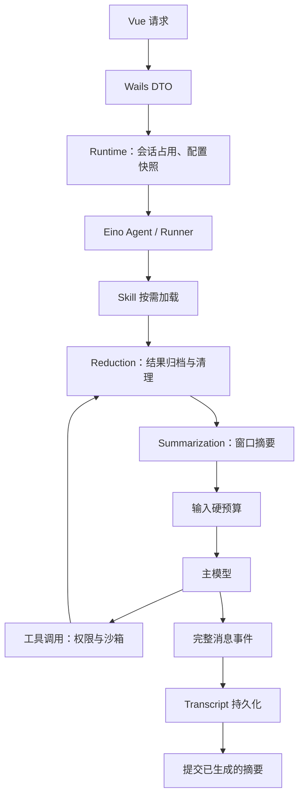

# Eino 集成与模块边界

本次实现以项目锁定的 Eino **v0.9.19**、officialmcp **v0.1.1** 为依据。没有升级框架或引入第二套 Agent 框架；新增和改动的关键边界使用中文注释。

## 已完成的取舍

| 模块 | 最终实现 | 清理的重复内容 |
| --- | --- | --- |
| Agent 执行 | Eino ChatModelAgent、Runner、interrupt/checkpoint；Runtime 管会话生命周期 | 不再单独维护 ToolCallID 注入 |
| 文件操作 | 六个原生 filesystem 工具 + 受限 Backend | 自写 read/write/edit/list 工具 schema、参数处理与结果格式 |
| Skill | 原生 Skill 中间件 + 冻结包 Backend | 手工复制 Skill ToolInfo，改为读取原生定义 |
| 上下文 | 原生 Summarization + 薄持久化适配 | Planner、分块/应急/修复摘要、回合结束二次生成 |
| 结果缩减 | 原生 Reduction + contextartifact 存储 | Guard 裁剪、整轮额度池、投影层再次裁剪、MCP 提前裁剪 |
| 中断历史 | 原生 PatchToolCalls + 应用工具事务校验 | 手写补齐算法 |
| 记忆 | 用户明确保存的跨会话个人偏好 | 自动 Session Memory、增量 cursor、额外模型角色与刷新流程 |
| Agent 配置 | Store.Mutate 锁内读改写；局部命令只更新目标字段 | 先读旧 Profile 再整体写回造成的覆盖 |
| 模型注册 | ResolveSnapshot 统一入口 | 未使用的另一条 Resolve 路径 |
| 搜索索引 | SearchIndex 负责构建和 Controller 生命周期 | 搜索生命周期由 Core 的 searchindex.Service 管理，Wails 只提供查询 DTO |
| 前端运行态 | 每个会话一个 runs 对象 | 七套平行 Map；旧请求收尾覆盖新请求的清理逻辑 |
| MCP 前端 | 两个页面共用 Pinia 目录、连接状态、工具缓存 | 重复查询与失效逻辑；过期配置的发现结果回写 |
| 任务通知 | Tasks 发布事件，Proactive 统一去重、静默时段、通知 | Tasks 与 Proactive 各发一次结果通知 |
| 历史消息 | 明确类型的 MessageDTO / MessageMetadataDTO | 临时兼容说明和逐字段动态 map 拼装；只供测试使用的 BuildContext |
| 网页搜索 | 一个搜索入口，匿名 AnySearch / Bing / DuckDuckGo | 没有配置入口的付费 Provider 和凭据分支 |

## 一轮请求



自动与手动摘要只有一个生成实现。回合结束仅提交已经生成的摘要；原始历史不会被删除。工具大结果在缩短前归档，`context_resource` 通过资源 ID 分页恢复，不向模型暴露任意本地资源路径。模型请求中保留当前用户原文、Skill 主定义和完整工具事务。

## 有意保留的产品代码

Eino 解决 Agent 编排，不负责桌面应用全部行为。以下边界继续由应用维护：

- JSONL 分支、附件、会话元数据库、原子提交、备份与恢复。
- 权限 UI、授权规则、命令隔离、PathGuard 和 os.Root；Eino filesystem Backend 本身不意味着具备这些隔离能力。
- Skill 来源、下载、安装、更新与快照冻结；原生 Skill 中间件负责运行时渐进披露。
- MCP 配置、凭据、连接生命周期和已选工具；officialmcp 负责协议到 Tool 的转换。
- 任务调度、主动事件决策、用户通知、浏览器与工作区 UI。
- `apply_patch` 的批量预检、文件复制/移动/删除、进程和网络约束。

这些功能有独立产品职责，不因框架有名称相似的组件就直接删除。

## 接口和配置变化

- `read_file/write_file/edit_file` 使用原生 `file_path`；编辑参数为 `old_string/new_string/replace_all`，读文件用 `offset/limit`。写入语义为创建或覆盖，权限呈现同步更新。
- `glob_files/grep_files` 使用原生 schema，grep 用 `pattern`。具体 schema 直接由 Eino 提供。
- 压缩操作只接收 Session ID，不再提供“压缩并更新 Memory”。模型角色保留 Chat、Utility 和视觉辅助配置。
- 删除 Memory 刷新配置、重复文件输出预算和 MCP 结果裁剪配置。文件物理大小、读取行数、目录项数量等 I/O 上限保留。
- Agent 更新的可选模型角色、Sandbox 和工具列表使用是否提交字段表达；不再用额外 configured 开关控制这些更新。
- 前端 Runtime 版本固定到锁文件版本；当前动态 `Call.ByName`/事件模式不要求生成 typed-event bindings。

未执行用户数据删除。新实现不提供旧自动 Memory 或旧 delegation 工具配置的兼容迁移；开发环境需要时可以自行清空应用数据重建。工作区文件不应与应用数据混同删除。

## 验证入口

```sh
GOCACHE=/tmp/humbert-go-cache go test ./...
GOCACHE=/tmp/humbert-go-cache go test -race ./internal/contextengine ./internal/tools/... ./internal/agents ./internal/runtime ./internal/searchindex ./internal/proactive ./internal/collaboration ./internal/mcp/...
npm --prefix frontend test
npm --prefix frontend run build
GOCACHE=/tmp/humbert-go-cache go vet ./...
GOCACHE=/tmp/humbert-go-cache go build -tags production -trimpath -buildvcs=false -ldflags='-w -s' -o bin/humbert-agent ./cmd/desktop
```

前端测试使用 Node 的模块模拟功能，需要支持 `--experimental-test-module-mocks` 的 Node 22.3+（Vite 还要求其支持的 Node 版本；建议 Node 22.12+ 或 24+）。测试覆盖原生文件协议与越界、摘要失败与硬预算、重复摘要保留当前请求/Skill、提交边界、工具结果归档/恢复、配置并发更新、搜索关闭等待、任务通知路由及前端异步竞态。模型和 MCP 集成使用模拟服务；真实云端模型、签名/公证和各平台安装包需要相应发布环境验证。

## 本地验证结果（2026-09-27）

- `go test -race ./...`：29 个包含测试的 Go 包通过，其余包完成编译；没有发现竞态。
- `go vet ./...`、`git diff --check`：通过。
- 前端 19 项测试和生产构建：通过。
- macOS arm64 production 构建完成：`bin/humbert-agent.app`，本地 ad-hoc 签名及 `codesign --verify --deep --strict` 校验通过。
- 未运行真实云端模型的收费调用，也未进行 Developer ID 分发签名、公证或其它操作系统验收。
- 按 Git 行数差异统计，含新文件、排除已有未跟踪示例，生产源码净减少约 5,700 行（含注释）；删除旧实现专属测试并补充对应新链路的回归测试。

## 统一装配入口

主 Agent 与子 Agent 使用 `runtime/capabilities.go` 解析能力，使用 `runtime/eino_builder.go` 构造 ChatModelAgent 和中间件。新增模块通过 `component.Provider` 提供原生 Eino 工具；`examples/modules/textstats.go` 用 InferTool 自动生成 Schema 与 JSON 编解码。模块注册只处理产品的选择、生命周期和来源身份，没有实现新的 Agent 循环、工具协议或通用插件容器。
