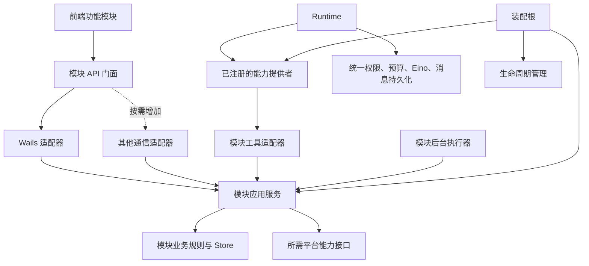

# Humbert Agent 通用模块化与可扩展性重构方案

分析日期：2026-09-28。代码基线：8852812（v0.1）。

本文以当前源码为依据。目标是整理现有架构，使后续任意新功能具有明确的接入方式。RAG、电商、语音只是用户用来说明扩展需求的例子，不作为本次建设任务。本版替换上一版按具体新功能展开的方案；目前只修改方案文档，没有重构业务代码或用户数据。

## 1. 重构目标与验收定义

建议演进为 **模块化单体：稳定内核 + 自包含功能模块 + 显式注册 + 可替换通信适配 + 按功能组织的前端**。

普通模块新增时，主要改动应限制在：

1. 模块自己的业务、数据、测试和文档。
2. 模块自己的桌面 API、工具、事件等适配器，按需实现。
3. 后端业务装配与桌面适配的明确注册位置。
4. 前端模块自己的页面、Store、API，以及统一模块导出列表。

普通模块不应要求修改 Runtime 执行循环、Transcript 格式、审批恢复逻辑、AppShell 的页面条件分支或多个全局 Store。

“容易扩展”不等于保证任何未来功能都零修改内核。当出现系统此前没有的执行方式、数据语义或实时通道时，需要增加一个经过设计的核心契约；之后同类型功能应能复用。重构目标是让修改范围可预测，而非提前发明覆盖所有未来需求的万能框架。

当前仍采用可信源码、编译时静态装配的模块。没有运行时安装、热卸载第三方 Go 代码的需求，不引入动态插件加载。

## 2. 当前项目为何显得乱

项目已经有很多包，问题主要是 **职责虽然分散，跨模块协调和接入规则仍然集中在少数位置，并且不够一致**。

重点检查了启动/关闭、Turn 解析/执行/审批、主子 Agent、模型、工具/Skills/MCP、Session/Transcript、搜索、Tasks/Proactive，以及前端 API/Store/布局/聊天输入。

| 当前位置 | 具体证据 | 扩展时的代价 |
| --- | --- | --- |
| internal/app/application.go | Bootstrap、具体组件 getter 和逐项 Shutdown | 新模块通常要给 Application 加字段、getter、构造和关闭分支 |
| internal/app/tools.go | 集中注册大量 Factory，包含视觉模型选择与观察逻辑 | 装配根同时知道工具构造和部分业务实现 |
| internal/runtime/resolver.go | 构造函数依赖多个具体 Manager，ResolveTurn 和 BuildChildAgent 重复组装能力 | 新能力容易变成 Runtime 的新字段、新参数和新条件分支 |
| internal/runtime/service.go | reservation、Turn、审批超时、取消、删除协调和错误文案 | 维护一个功能时需要理解多个并发与生命周期规则 |
| internal/services | 大量服务接收整个 Application；删除、配置、凭据等协调在入口完成 | 同一功能由 Tool/后台/CLI 调用时容易复制或遗漏规则 |
| frontend/src/stores/runtime.js | IPC、事件、流缓冲、审批、上下文与终态刷新 | 新运行能力要进入同一个复杂 Store |
| frontend/src/stores/sessions.js | 会话列表、选择、消息窗口、分页、草稿和请求失效 | 页面或输入扩展需要掌握多个不相关状态 |
| AppShell、Sidebar、SettingsView | 页面和设置通过明确 import、事件名称与 v-if 分支连接 | 新页面需要修改多个公共组件 |
| toolProtocol.js、toolEffects.js | 以工具名分支处理展示和产物 | 新工具需要修改通用聊天展示代码 |
| 前端 IPC 契约 | Call.ByName 字符串调用，checkJs=false | Go 字段/方法调整缺少静态同步检查 |

源码依据：

- [Application Bootstrap](../../internal/app/application.go#L156)、[Shutdown](../../internal/app/application.go#L693)。
- [Resolver 的依赖](../../internal/runtime/resolver.go#L232)、[主 Turn](../../internal/runtime/resolver.go#L299)、[子 Agent](../../internal/runtime/resolver.go#L43)。
- [Agent 删除协调](../../internal/services/agentservice.go#L761)、[安全配置更新](../../internal/services/agentservice.go#L534)、[Skill 删除引用检查](../../internal/services/skillservice.go#L715)。
- [Session 搜索 Controller](../../internal/services/sessionservice.go#L92)、[Workspace 搜索 Controller](../../internal/services/workspaceservice.go#L73)。
- [前端运行态](../../frontend/src/stores/runtime.js#L334)、[页面分支](../../frontend/src/layouts/AppShell.vue#L545)、[设置分支](../../frontend/src/components/settings/SettingsView.vue#L278)。

统计中 internal 有 36 个 Go 包目录、194 个非测试 Go 文件、约 60,410 行；frontend/src 的非测试 JS/Vue 约 31,178 行。行数包含注释、空行、模板和样式，仅用于定位，不作为复杂度评分。大量短表达式被拆多行也增加了阅读距离，但格式整理不能替代职责调整。

Application 作为装配根依赖很多模块是正常的；不合理的是普通入口也能取得整个装配根，并自行协调这些模块。

## 3. 保留现有有效设计

以下基础直接沿用：

- 每个 Turn 的模型、能力、工作区、安全和预算快照。
- JSONL 中完整消息/工具事务作为事实；UI 流式事件作为投影。
- Session 元数据 SQLite、Transcript 和附件的明确所有权。
- 可重建位置索引和搜索投影。
- Factory、Descriptor、Registry、Scope、Guard 的工具链。
- Eino ChatModelAgent、Runner、中间件、Interrupt/Resume。
- 原始 checkpoint 参数参与审批恢复，前端不重新拼执行参数。
- Agent 的局部更新、可恢复删除、Session reservation。
- 现有异步竞态、工具事务、权限、恢复与预算测试。

重构采用“提取已存在的规则 → 统一接入 → 替换调用者 → 删除旧实现”的顺序，不维护永久双实现。

## 4. 目标架构



业务流程存在于模块应用服务中。页面、工具、后台执行器使用同一套规则；适配器负责转换各自输入输出，不复制业务实现。

稳定内核维护公共运行约束，功能模块只贡献明确能力。通信仍可使用 Wails，不需要为模块化整体改 HTTP/WebSocket。

依赖规则：

1. 模块业务代码不 import Wails、不持有 Application、不直接操作前端状态。
2. Runtime 不 import 每个新功能模块；模块通过 Runtime 定义的消费接口接入。
3. 一个模块不直接调用另一个模块的 Store，不读取它的数据目录。
4. 跨模块调用通过消费方需要的小接口注入；确实复杂的跨模块流程由明确的应用用例协调。
5. 平台层不能反向依赖功能模块。模块可以依赖平台提供的日志、凭据、受控资源等能力。
6. 装配根允许知道所有已安装模块，但只构造、连接、注册和管理资源。
7. 接口只为真实替换、跨模块边界或外部 I/O 定义，不为每个 struct 配一个同名 interface。

## 5. 内核、平台与功能模块的划分

划分依据是“变更原因”，不是现有文件大小。

| 类别 | 职责 | 当前候选 |
| --- | --- | --- |
| Agent 执行内核 | Turn 生命周期、配置快照、工具组装、审批/取消、上下文预算和完整消息提交 | runtime、contextengine、tools 的公共执行部分 |
| 会话与配置核心 | Agent Profile、Session 身份、Transcript 协议与事实 | agents、sessions、transcript |
| 平台能力 | 本地持久化基础设施、凭据、日志、受控文件/进程、事件、文档/媒体适配 | credential、logging、atomicfile、sandbox、eventbus、documenttext 等 |
| 功能模块 | 自身业务状态、应用用例、设置、页面、可选 Agent 能力 | skills、mcp、tasks、proactive、搜索/工作区展示等 |
| 适配层 | 桌面 API、Eino 工具、Provider/SDK、前端通信 | services、mcp/einoadapter、各工具适配器、frontend API |
| 装配层 | 创建依赖、注入、注册、启动/停止 | app、桌面入口的服务装配 |

这里不是要求立刻把 Skills/MCP/Tasks 全部搬目录。先把实际依赖和接入边界理顺，再评估路径调整。

一个模块可以只有页面，只有后台服务，只有工具，或者同时有这些能力。不能规定每个模块都创建 Agent、Session、Tool、Store 和后台 goroutine。

## 6. 目录组织

第一阶段保留现有关键包路径和 Wails 服务类型名，降低协议变更。后续新增功能采用按模块聚合的结构：

```text
internal/
├── app/                         # 装配、模块注册、生命周期
├── usecases/                    # 少量真正跨模块的应用用例
├── runtime/                     # 稳定执行内核
├── contextengine/
├── agents/
├── sessions/
├── transcript/
├── tools/                       # 通用工具契约、选择、Guard
├── modules/
│   └── example/                 # 将来的一个普通功能模块
│       ├── types.go
│       ├── service.go           # 对外应用服务
│       ├── ports.go             # 模块所需依赖
│       ├── store.go             # 自己的数据实现，确有数据时才创建
│       ├── module.go            # 构造与资源所有权
│       ├── README.md
│       ├── desktop/             # Wails DTO/服务，按需
│       └── tooladapter/         # Eino Tool/Factory，按需
├── services/                    # 现有桌面适配器，逐步变薄
└── ...                          # 既有平台/支持包暂时保留
```

“平台”先作为职责分类，不急着搬成一个巨型 platform 包。不同包继续保持明确名字。小模块先用少量文件，出现真实复杂度后再拆子包。

前端采用：

```text
frontend/src/
├── app/
│   ├── bootstrap
│   ├── featureRegistry
│   ├── navigation
│   └── AppShell.vue
├── platform/
│   └── wails/                   # 调用、事件、原生桌面操作
├── features/
│   ├── chat/
│   ├── agents/
│   ├── skills/
│   ├── connectors/
│   ├── tasks/
│   └── example/
│       ├── index.ts             # 本模块的前端贡献声明
│       ├── api/
│       ├── stores/
│       ├── composables/
│       ├── components/
│       └── tests/
├── contracts/                   # 公共 DTO/事件类型
└── shared/                      # 通用 UI、i18n、经过验证的共用逻辑
```

JS 与 TS 可以混用；先给公共契约和新功能使用类型，不将全量语言迁移作为模块化的前置条件。

## 7. 模块接入面：只提供需要的能力

建议约定以下接入面，而不是一个带几十个方法的万能 Module：

| 接入面 | 模块贡献内容 | 宿主负责什么 |
| --- | --- | --- |
| 业务构造 | 明确的 Dependencies 和应用服务实例 | 显式注入、校验装配 |
| 生命周期 | 有资源时提供停止/关闭，运行时需要时提供启动 | 注册顺序、失败回滚、关闭顺序 |
| 桌面 API | DTO 与薄 Wails Service | 服务注册、统一错误边界 |
| Agent 工具 | Descriptor、Factory/本轮冻结能力 | 选择、名称冲突、Guard、预算、事件与结果归档 |
| 本轮上下文 | 确有需求时贡献有来源/预算的材料 | 优先级、窗口限制、可信级别和工具事务约束 |
| 模块事件 | 自己的事件类型和主题 | 桌面桥接与订阅生命周期 |
| 前端页面/设置 | 静态页面定义、懒加载组件、菜单元数据 | 导航、布局、加载失败反馈 |
| 结果展示 | 受控 ToolViewModel 的 renderer | 默认展示、历史/实时统一入口 |
| 数据管理 | 权威数据/缓存/迁移/恢复说明 | 备份、关闭和恢复协调 |

纯 UI 模块不必接 Runtime。纯后台模块不必提供页面或 Tool。工具模块不必向 AppShell 加页面。

第一期先标准化“构造、生命周期、工具、桌面 API、页面/设置”这些已经真实存在的接入面；Context、资源渲染等接口在迁移已有调用链时逐步收口。不要先创建一批无人使用的空注册表。

## 8. 后端模块契约与静态注册

### 8.1 业务依赖必须明确

拟议示例，省略完整类型/import；不是本次已经实现的 API：

```go
// 定义在模块中，仅包含它实际需要的依赖。
type Dependencies struct {
    Store    Repository
    Settings SettingsReader
    Logger   *slog.Logger
}

func New(deps Dependencies) (*Module, error) {
    // 校验依赖，构造自己的服务与资源。
}
```

不能把 Dependencies 变成装着全部 Manager 的另一个 Application。避免 map[string]any、GetService(name)、反射注入和全局单例。

模块业务服务的 CRUD 可直接由已有领域 Service 承担；只有跨模块协调或规则散落时才建立新的用例，不额外叠加纯转发层。

### 8.2 注册结构定义在装配边界

拟议结构：

```go
// 装配层知道 Runtime 和 Tool 契约；业务代码不需要知道这个结构。
type ModuleMount struct {
    ID           string
    Lifecycle    Lifecycle             // 没有长期资源可为空
    Tools        []tools.Factory        // 没有工具可为空
    Capabilities []runtime.Provider     // 没有本轮动态能力可为空
}
```

runtime.Provider 是待提炼的消费接口，见下一节，不是当前已存在类型。

Wails 的 application.Service 单独在桌面装配层注册，不放进模块业务结构或 Runtime 契约。因此同一模块业务服务可以被桌面、工具和未来其他入口复用。

明确保留两个后端装配位置：

- app 的模块构造/核心贡献列表。
- 桌面入口的 Service/事件桥接列表。

这两处是有意允许修改的注册点。模块实例通过明确构造结果/参数传给对应适配器；不为每个新模块给 Application 增加一个公开 getter，也不通过运行时查找服务。没有必要为了“只改一行”引入隐藏依赖容器。

随着注册代码重复，可提炼一个局部注册 helper；只合并机械性代码，不隐藏不同模块的依赖关系。

### 8.3 生命周期分阶段

构造所有依赖 → 注册工具/API/事件消费者 → 恢复状态 → 启动产生新工作的组件。

关闭分三类处理：

1. 停止产生新工作：调度、监听、主动触发。
2. 取消并等待活跃工作收敛：Turn 和模块自身 Worker。
3. 关闭依赖资源：模型/工具连接、数据库、文件与日志。

模块注册记录生命周期阶段；阶段内按实际依赖构造顺序逆序关闭。不能只按注册列表盲目 reverse 一切，例如 Runtime 必须先停止使用工具才能关闭工具连接。

构造失败通过资源清理栈回滚。可选模块失败可以记录 unavailable；执行内核或事实 Store 失败仍阻止启动。对依赖失败的模块要明确不可用状态。

第一版静态装配即可，不实现运行中任意卸载。若模块启停需要重启，应明确说明；不能关闭仍被冻结 Turn 引用的资源。

## 9. Runtime 的通用扩展边界

### 9.1 分离生命周期与能力组装

现有 Runtime 优先拆为职责清晰的私有单元：

| 单元 | 唯一负责的状态/工作 |
| --- | --- |
| OperationGate | Session reservation、Agent 删除门闩 |
| RunCoordinator | 新建运行、Worker、取消、终态与关闭 |
| ApprovalCoordinator | checkpoint、等待/恢复、超时 |
| SnapshotResolver | 读取配置并建立不可变运行输入 |
| CapabilityAssembler | 汇总已注册提供者的能力，统一选择与校验 |
| AgentFactory | 一处构造 Eino Agent 与固定中间件链 |
| EventConsumer | 消费输出、提交完整消息、投影 UI 事件 |
| ErrorPresenter | 稳定错误代码、脱敏诊断、可翻译文案 |

第一批可以只拆同包文件/私有 struct。不能给每个单元复制一份运行中 Map；OperationGate 保持唯一并发边界。

主/子 Agent 使用同一 AgentFactory，通过输入来源、执行身份、授权身份、持久化策略、禁用能力和父预算表达差异。保留子 Agent 的授权继承与父历史隔离。

### 9.2 由 Runtime 定义能力消费接口

目前 Resolver 直接认识 Builtin、Skills、MCP。将它们整理为已有能力来源，逐步提炼其真正公共部分：

```go
// 示意：具体字段需要从现有三类来源提炼。
type Provider interface {
    ID() string
    Resolve(ctx context.Context, request ResolveRequest) (Contribution, error)
}
```

ResolveRequest 只包含已经验证的身份、Scope、运行模式和预算约束；不能允许模块指定是否跳过审批，或用模型参数决定 Agent/Session 身份。

Contribution 表达当前 Turn 的冻结能力、来源身份和版本。模块自己的配置类型保留在模块内部；核心 Manifest 只需要安全可展示的身份/版本/能力摘要，不必知道每个模块的具体设置字段。

Assembly 必须统一完成：

选择校验 → 模块配置冻结 → 工具名称/来源冲突检查 → 统一 Guard → schema Token 估算 → 预算/计账 → Eino 执行。

模块返回未套 Guard 的能力，由宿主包装。Skills 的渐进披露中间件属于特殊能力，保留明确适配器，不强行把所有提供者变成普通 Tool。中间件顺序由内核负责，模块不能任意重排权限和预算环节。

工具-only 模块优先沿用已有 Factory，无需额外动态 Provider。只有需要每轮冻结模块绑定、配置或连接身份时才实现 Provider。

### 9.3 新工具必须显式选择

当前 Registry 对 EnabledBuiltinTools 为 nil 的旧配置会开放全部 Builtin。新增模块工具不能直接利用这种默认行为变成已有 Agent 自动可用的新能力。

保留通用工具的旧选择语义；为模块贡献增加来源身份和明确 opt-in 选择。具体配置由模块拥有，宿主仅持有通用能力引用：

- moduleID；
- capabilityID；
- 必要的配置引用/版本。

不在 Agent Profile 或 Tool Scope 中不断增加每个模块的专有字段，也不使用任意 JSON 参数让 Runtime 猜含义。绑定的有效性由模块服务校验，运行时使用冻结结果。

### 9.4 Context 与外部调用扩展

普通工具结果直接参与现有 Reduction/Summarization，不需要先修改上下文内核。

确有主动材料注入需求时，再提供带来源、信任级别和最大占用的 ContextContribution。外部内容不得自动变成系统指令；不能破坏 ToolCall/ToolResult 对应关系。

新的模型任务类别、媒体或其他外部调用在真实需求出现时增加窄适配器和明确计量单位。公共 Provider/凭据管理可以复用；不把所有未来客户端提前包装为 any，也不在此次重构里增加无人使用的 ASR/TTS/Embedding 设置。

### 9.5 Eino 的边界

Eino 类型保留在 Agent 执行、Context 和相关适配器中合理。无需重造一套 Message、Tool、Stream 和中间件。

业务规则、模块配置和桌面公开 DTO 应保持自己的有限契约。已有 Transcript Wire 格式与 Codec 继续作为长期持久化边界，不因为模块化重写聊天数据格式。

## 10. 应用用例与跨模块协调

优先抽出已经存在、目前位于 Wails 入口中的流程：

| 用例 | 当前位置 | 抽出后 |
| --- | --- | --- |
| DeleteAgent | AgentService | 同一用例协调任务、Gate、领域删除、元数据/授权清理 |
| RemoveSkill | SkillService | 引用检查和删除由应用服务完成 |
| SaveMCPServer | MCPService | 凭据、配置和补偿在同一用例 |
| UpdateSecuritySettings | AgentService | 持久化、Manager 更新和配置快照由设置服务拥有 |
| SearchSessions/SearchDocuments | Session/Workspace Service | Controller 生命周期与查询服务归 Core |

Wails Service 接收它需要的用例/Reader；不再接收完整 Application。

跨模块依赖的选择：

- 需要立即返回结果：消费方接口 + 显式注入。
- 只是通知或刷新 UI：已有进程内事件。
- 必须重启恢复的业务动作：持久状态机/事务记录，再通知；不能依赖一次内存事件。
- 涉及多个模块的删除：明确协调用例与可恢复进度，不用无序广播替代。

模块有 Agent 绑定时才加入相应解除引用流程。模块数据是否随 Agent 删除，由所有权决定，不统一强制级联。

SettingsService 提供不可变 Snapshot 和窄 Update；业务入口不直接修改 core.Config() 指针。落盘、运行态发布、失败补偿都由设置服务定义。

## 11. 前端模块注册：让公共组件停止认识每个功能

### 11.1 静态 Feature 定义

拟议前端贡献示例：

```ts
export const exampleFeature = {
  id: "example",
  pages: [{
    id: "example.home",
    titleKey: "example.navigation",
    load: () => import("./components/ExampleView.vue"),
  }],
  settings: [{
    id: "example.settings",
    titleKey: "example.settings.title",
    load: () => import("./components/ExampleSettings.vue"),
  }],
};
```

模块未提供页面/设置时对应列表为空即可。不需要运行时从后端获取 JS 组件名或动态代码。

app/features 导出一个可信、编译时的 Feature 列表。宿主从列表建立：

- 导航项；
- 页面查找；
- 设置导航与组件加载；
- 已知结果 renderer；
- 应用级事件初始化/释放。

增加普通页面主要修改新 feature 和这一导出列表。AppShell/Sidebar/SettingsView 不再为每个模块添加新事件、新 import 与 v-if。

Chat 等特殊布局通过显式布局选项和页面 props 表达，不为每个页面创造一套全局行为开关。

### 11.2 导航与运行状态独立

导航状态只管理 pageID 和导航参数，不拥有 Agent/Session 数据。公共跳转使用有类型的目标，例如“打开某会话”，由明确协调器完成选择与加载。

运行中聊天、模块后台状态和应用事件订阅不随页面切换销毁。页面只释放自己创建的监听器/资源。

第一版可用静态页面注册表；需要地址、嵌套路由和返回栈时再引入路由。不要把选择某个路由库作为模块化的核心目标。

### 11.3 拆现有 Store 与大组件

| 当前位置 | 目标职责 |
| --- | --- |
| runtime.js | runStore：运行/审批；contextStore：上下文；纯 eventReducer；streamBuffer；IPC/收尾 controller |
| sessions.js | sessionStore：列表/选择；messageStore：窗口/分页；draftStore：草稿 |
| ComposerBar | 输入视图；发送控制；附件选择；模型选择；上下文展示 |
| ConversationSidebar | 通用导航；Agent/会话列表；搜索；会话操作 |
| SkillDetailView | 页面控制；来源/更新；文件树/正文；Agent 绑定 |
| AppShell | 布局；启动/导航/订阅移到 app 层 |

保留请求序号、revision、终态保护与最近请求失效规则。纯 reducer 不进行网络请求；controller 处理刷新。公共函数提取来自已有重复，不新建一套过度抽象的 BaseStore。

### 11.4 工具结果展示由模块贡献

模块自己的工具结果展示规则放在自己的 feature 中，注册已知 renderer。公共聊天组件只接收稳定 ToolViewModel：身份、名称、状态、参数展示、结果/资源引用和错误。

renderer 只展示数据，不执行权限判断、持久化或业务动作。未知工具采用安全文本 fallback。实时与历史页面使用同一投影入口，不能只支持刚运行完的一次事件。

文件变化等旧工具可以先保留原有投影，并通过 adapter 接入；不批量改写 Eino 原生工具输出协议。需要长期回放的元数据必须可持久化或从完整结果重建。

## 12. 前后端契约与通信

保留 Wails bindings 和 Events。模块化需要的是业务不依赖通信协议，前端业务不散落通信细节。

推荐调用链：

前端 feature API → platform/wails → 薄桌面 Service → 模块应用服务。

窗口、对话框等原生操作由明确的桌面能力门面处理。新增 HTTP/其他客户端时加一个适配器，调用同一业务用例。

类型化顺序：

1. DTO、事件与错误契约。
2. API 门面及生成 bindings 的接入。
3. Runtime reducer/Store。
4. Session/Message Store。
5. 新模块与经常改动的组件。

JS/TS 混用可继续。关键路径加入真正执行的类型检查；Vite 构建不替代类型检查。Wails 支持生成 TypeScript bindings 和类型化事件，但具体 API 以当前 beta.24/前端锁定版本为准。[官方前端 Runtime 说明](https://v3.wails.io/reference/frontend-runtime/)

前端契约应使用稳定字段，不直接暴露任意 SDK 类型。跨 IPC 错误带 code、脱敏 message、必要参数和 requestID；底层错误链进入日志。

当前 EventBus 为同步、不持久化广播，继续用于 UI 状态通知。事件通用关联字段与模块 payload 分开，模块事件在自己适配器里注册。取消、终态、重复事件和初始化释放有明确规则。没有新需求时不增加复杂可靠队列或实时媒体协议。

## 13. 数据、后台工作与功能启用

每个有数据的模块必须说明：

- 哪些是权威用户事实，哪些是投影/缓存。
- 数据目录或 Store 所有者。
- 是否参与备份，如何关闭与一致地导出。
- schema 变更与恢复方式。
- 模块禁用、绑定解除、Agent 删除和模块数据删除各自的含义。

新增模块可以使用独立数据子目录；既有文件路径先保留。不要将所有数据统一写进 Transcript，也不把多个模块的数据塞进全局 config.yaml。

备份和缓存策略要核对现有 databackup 实现；不能仅根据路径名字推断可重建。可选模块缺失/不可用时保留它的用户数据。

后台工作优先由模块拥有 context、Worker 和退出过程。Task 是现有计划领域，不要求每个后台操作都创建聊天 Session。共享 Worker/Job 基础设施只有出现真实重复需求后才提炼。

区分三个状态：

- 模块已静态装配。
- 模块当前可用/启用。
- Agent 本轮明确选择该模块的某项能力。

前端隐藏不等于后端禁用；本轮选择固定在 Snapshot。第一阶段可以要求全局模块启停重启应用，避免提前实现复杂热卸载。

## 14. 对现有代码的具体调整清单

| 现有位置 | 调整 | 要保持的不变量 |
| --- | --- | --- |
| app/application.go | 构造/注册/恢复/启动分段；Lifecycle 清理；逐步取消普通入口获取整棵依赖树 | 资源所有权、失败回滚与关闭顺序 |
| app/tools.go | 工具按能力包返回 Factory；视觉观察逻辑移出装配根 | 名称校验、授权与辅助调用计账 |
| runtime/resolver.go | 提供者列表 + CapabilityAssembler；主/子共用 AgentFactory | 当前 Turn 配置冻结、子 Agent 范围 |
| runtime/service.go | 同包拆 Gate、运行、审批、错误呈现 | 唯一 reservation、checkpoint 与终态 |
| services/*.go | 窄依赖、DTO、错误边界、事件桥接 | 现有前端方法和字段先保留 |
| agentservice.go | 删除/安全设置/诊断抽到明确用例与服务 | 删除恢复、运行中不可扩大范围 |
| session/workspace Service | 搜索 Controller 的资源生命周期归 Core | 可重建索引与受控查询 |
| frontend API | 通信门面与业务调用分开；类型化 | 请求/事件/取消语义 |
| AppShell/Sidebar/SettingsView | 消费 featureRegistry | 页面切换不影响后台状态 |
| toolProtocol/toolEffects | 结果投影/renderer 逐步移到所属模块 | 从实际结果判断成功，历史可回放 |
| 大 Store/组件 | 按状态所有权和行为拆分 | 旧请求不覆盖新状态 |
| 项目文档/格式 | 当前事实一处维护；统一 formatter/lint | 不靠行数减少掩盖行为变化 |

有一个具体冻结边界需要在实施时核验：[browserVisionInspector](../../internal/app/tools.go#L431) 在截图时重新读取 Agent/模型配置。从源码调用链推断，运行中设置变化可能影响后续观察；本次未通过 GUI 并发操作复现。应改为模块服务提供绑定本轮模型的窄观察接口。

[documenttext.init](../../internal/documenttext/extract.go#L28) 通过环境变量切换为解析 Worker 并退出。若调整该包入口，应保留现有受控子进程和输入/输出/超时限制，再将分派显式化；不能只删除 init 就破坏解析测试与桌面行为。

现有架构历史报告有部分 Session 控制面和命令策略描述已经过时。历史报告保留为历史快照；当前模块 README 和领域边界需保持与源码一致。

## 15. 分阶段落地：用现有功能验证，不开发新产品功能

### P0：固定边界和基线

交付：当前依赖图、数据事实说明、模块分类、允许修改的注册点、现有行为基线。

不搬目录，不改消息格式。先决定同一操作的规则归属。

### P1：抽应用用例与窄依赖

交付：DeleteAgent、RemoveSkill、SaveMCPServer、安全设置和搜索生命周期的收口。

桌面服务只调用自己的服务/用例。至少一个用例在无 Wails 环境下可完整测试。

### P2：后端模块接入与生命周期

交付：静态 ModuleMount、工具来源/选择约束、资源清理与分阶段启动。

使用现有 Tasks 作为完整验证：自己的服务、工具、后台生命周期和桌面适配能通过显式注册接入。保留计划与恢复行为，不重新实现调度器。

### P3：Runtime 能力提供者与公共构造

交付：从现有 Builtin/Skills/MCP 提炼的提供者边界，CapabilityAssembler，主/子 AgentFactory。

现有功能通过新边界接入，删除旧组装分支；权限、预算和中间件顺序仍由内核拥有。

### P4：前端模块注册与状态拆分

交付：featureRegistry、页面/设置注册、应用生命周期、API/事件类型，以及运行态/消息窗口拆分。

先将现有 Skills、Connectors、Tasks 页面接入。新增一个已有页面的注册不能要求继续修改 AppShell 的功能分支。

### P5：整理目录、文档和工程门禁

交付：按功能聚合目录；删除临时转发；新增模块开发说明和可复用目录骨架；依赖约束检查。

不在代码中保留“旧方式也能接、新方式也能接”的两套长期路径。目录骨架按需生成业务、桌面/工具/页面文件，不制造无用空层。

每个阶段独立可评审、可运行。避免在一个巨大 diff 中混合目录重命名、格式化、行为变更和数据迁移。

## 16. 新增模块的固定开发流程

重构完成后，开发者按以下流程接入普通功能：

1. 明确该功能自己的规则、状态与数据所有权。
2. 在模块目录实现业务服务，写清 Dependencies。
3. 按需求选择 desktop、tooladapter、后台 Worker；它们共用业务服务。
4. 有 Agent 能力时定义选择/授权/冻结身份，并接入统一工具组装。
5. 在核心与桌面注册列表中装配实例。
6. 有 UI 时在自己的 feature 定义页面/设置/renderer/事件，并加入前端列表。
7. 核对备份、恢复、删除、启用与资源退出。
8. 完成模块测试与相关集成测试。

不需要创建占位 Agent，不需要修改通用聊天循环，也不需要把模块配置追加到所有全局 DTO。

模块开发 README 应提供：目录说明、公开接口、注入示例、如何注册、事件/结果约定、数据/生命周期、最低验证。

## 17. 重构验收与工程约束

### 17.1 架构验收

- 普通模块业务可以不启动 Wails 就调用和测试。
- 一个规则有一份实现，页面、工具、后台入口没有复制逻辑。
- 注册一个普通工具不要求改 Runtime 执行循环。
- 新模块不自动获得所有 Agent 的授权。
- 新页面/设置不要求改 AppShell、Sidebar 和 SettingsView 的功能分支。
- 模块不直接访问别的模块 Store，不靠全局实例查找。
- 初始化失败和关闭有明确资源收敛。
- 配置改变只影响之后的 Turn；历史结果仍可展示。
- 模块缺失/禁用不丢弃用户数据。

检验方式以迁移现有模块为主；不为证明架构先开发三个新功能。

### 17.2 测试验收

保留现有测试，并补充针对改动的行为验证：

| 改动 | 关键场景 |
| --- | --- |
| 删除/应用用例 | 占用、并发新建、部分失败、恢复、外部工作区保留 |
| 生命周期 | 构造中途失败、关闭顺序、后台退出、重复关闭 |
| 能力提供者 | 选择、重复命名、不可用、配置冻结、主/子 Agent、Guard |
| Runtime 拆分 | 取消、审批超时/恢复、预算、工具事务、终态 |
| 前端注册 | 重复 ID、未知页面、组件加载失败、事件初始化/释放 |
| Store 拆分 | 响应乱序、终态与 IPC 先后、快速切换、分页失效 |
| API 契约 | 类型检查、字段与事件映射、取消/错误语义 |

纯转发和简单 DTO 不写镜像测试。关键并发/持久化改动执行相关 race 与恢复测试。真实模型和桌面 GUI 测试与 Mock 测试结果分开记录。

### 17.3 工程门禁

- Go 格式与 vet、Go 单测、前端单测和构建。
- 契约/关键路径类型检查，前端统一 formatter/lint。
- 依赖检查：业务模块不 import Wails；Runtime 不 import 具体新模块；模块不访问他人 Store。
- 新模块说明数据所有权、生命周期和注册方式。
- 日志关联 RequestID/RunID，模块自己的后台 ID 在需要时加入，不记录凭据。
- 小接口来自消费方，限制巨型 Manager、万能 Repository、map[string]any 配置袋和 Service Locator。
- 维护现有四语言要求，原始模型/工具内容保持数据语义。

这些检查应针对当前迁移范围逐步启用，不把所有既有依赖一次性判为违规，也不把代码行数门槛作为重构目标。

## 18. 已完成的分析与尚未实施的工作

前一轮实际执行的基线：

- go test ./...：32 个含测试包通过，其余包完成编译；services 测试链接有 macOS 目标版本警告，未造成失败。
- npm test：69 项通过。
- 静态检查当前模块与前端调用链；本机源码核对锁定版本的相关 Eino/Wails 能力。

本轮只修订架构方案并核对注册/生命周期/页面接入位置，没有新增模块或重构业务代码；没有重新运行测试，也没有进行真实模型、桌面 GUI、设备或跨平台验收。

实施优先级：**应用用例与依赖方向 → 静态注册/生命周期 → Runtime 能力接口 → 前端 featureRegistry/状态 → 目录与工程门禁**。

最终目标是把“增加一个功能就到处改代码”变成“实现自己的模块，再经过几个明确的接入点注册”。先让现有功能遵循这套规则，之后的新模块才会自然容易接入。
