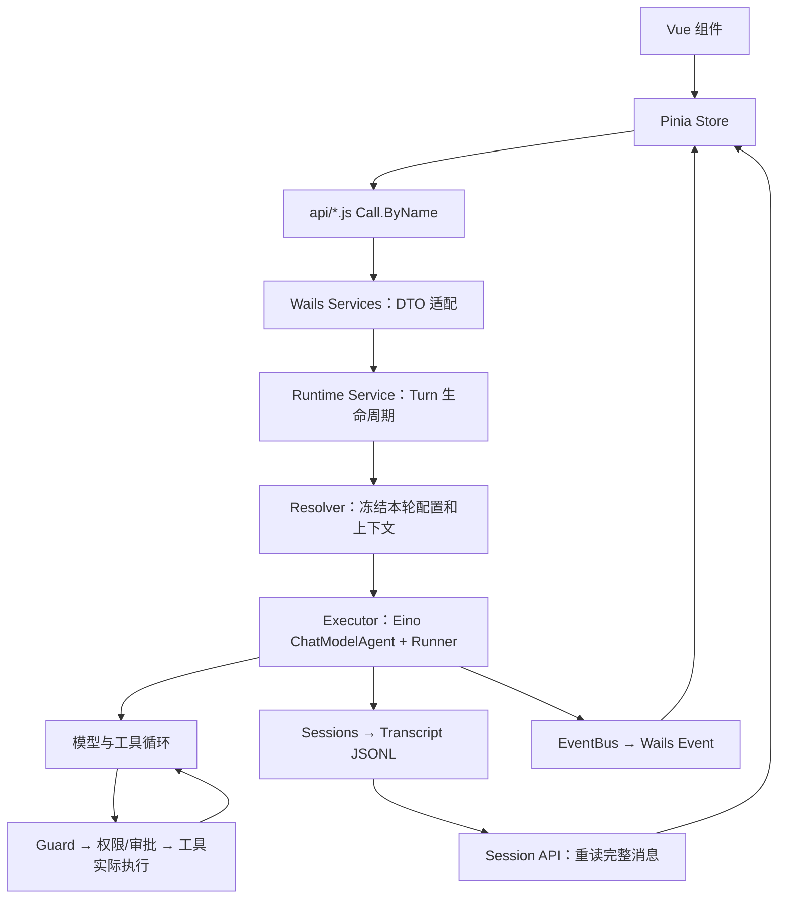

# Humbert 项目实现详解与源码导航

核对日期：2026-09-27。本文解释当前工作区的实现，而不是未来设计。上一轮重构的取舍和验证结果见 [Eino 集成记录](eino-integration.md)。本次梳理只更新文档，不修改业务代码。源码链接定位到核对时的函数或结构体，后续修改可能使行号移动。

## 1. 已经修改了什么

这次重构没有更换技术栈：仍是 Go + Eino + Wails 3 + Vue/Pinia。主要是把框架已经实现的编排、工具协议和上下文处理交还给 Eino，把应用代码保留在持久化、权限、桌面交互等产品边界。

| 模块 | 原先的问题 | 当前实现 |
| --- | --- | --- |
| 文件工具 | 自己维护读、写、编辑、目录工具的 schema 和参数协议 | 六个 Eino filesystem 工具，共用一个受限 Backend；删除旧 read/write/edit/list 实现 |
| 摘要 | Planner、分块生成、应急/修复摘要、回合维护形成多条生成路径 | 自动与手动都调用 Eino Summarization；回合结束只提交已生成摘要 |
| 工具结果 | Guard、MCP、投影等多处裁剪，还有整轮额度池 | Eino Reduction 统一处理，先归档再缩短，按资源 ID 回读 |
| 不完整工具历史 | 自己补缺失的 ToolResult | Eino PatchToolCalls 补齐，应用再校验事务完整性 |
| 自动会话记忆 | 摘要之外又有自动 Session Memory、cursor、刷新模型 | 删除 `internal/memory` 整套自动流程；保留用户明确保存的个人记忆 |
| Skills | 已使用原生 Skill，但又手工维护一份 ToolInfo | 从原生中间件取得真实工具定义，预算和执行使用同一份 schema |
| Agent 配置 | 局部修改先读整个对象、再写回，可能覆盖并发更新 | `Store.Mutate` 在锁内读最新值，只修改目标字段 |
| 模型解析 | 存在另一条未使用的 Resolve 入口 | 使用 `ResolveSnapshot` 同时冻结实例、配置和 revision |
| 搜索 | 两个 Wails Service 各自管扫描、锁、后台刷新和关闭 | `searchindex.Controller` 统一生命周期，领域包负责构建索引 |
| 前端运行态 | 七组平行 Map 难以保持一致，旧请求可能清理新请求 | 活动运行集中到 `runs[sessionID]`，按 RequestID 与事件修订判断结果是否过期 |
| MCP 前端 | 两个页面各自加载目录和维护连接状态 | 共用 `stores/mcp.js`，请求合并、配置变化后缓存失效 |
| 任务通知 | Tasks 与 Proactive 可能各发一遍结果通知 | Tasks 发运行事件；Proactive 处理结果通知、去重和静默时段 |
| 消息 DTO | 动态元数据 map、历史显示依赖当前配置 | 类型化元数据，历史模型名来自当时持久化响应 |
| 网页搜索 | 存在没有配置入口的付费 Provider 分支 | 保留匿名 AnySearch、Bing、DuckDuckGo 路径 |

上一轮统计生产源码净减少约 5,700 行，含中文注释、含新文件，排除原有未跟踪示例。关键改动增加了中文注释；并不是把整个仓库所有英文注释都翻译了。当前工作区还有图标、生成 bindings 等变化，不能仅凭 `git status` 把它们全部归因于本次重构。

已经使用 Eino 的 Runner、Skill、AgentTool、MCP 适配并非这次全部从零替换。最显著的新变化是 filesystem、Summarization、Reduction 的统一，以及删除重复状态与旧路径。

## 2. 先分清这些对象

| 名称 | 实际含义 | 生命周期 |
| --- | --- | --- |
| Agent Profile | 名称、提示词、模型、技能、工具、工作区和安全配置 | 持久化；不是常驻模型进程 |
| Eino ChatModelAgent | 根据 Profile 和本轮快照创建的执行对象 | 本次执行/审批恢复 |
| Session | 一个 Agent 下的会话，包含标题、归档状态和消息记录 | 持久化 |
| Turn | 一次用户输入及其引发的多次模型/工具交互 | 从 StartTurn 到完成、失败或取消 |
| RequestID / Runtime RunID | 本轮调用和执行的关联身份 | 跟踪事件、取消、审批、日志；不等于 TaskRun ID |
| ToolCallID | 一次工具调用身份 | 关联 assistant 的 tool_calls 与对应 tool result |
| Task / TaskRun | 一个计划及其某一次触发记录 | 分别保存配置和运行状态 |
| 子 Agent Run | 父工具调用内的同步委派 | 审计保存在父 Session；不是一个后台 Task |
| Runtime Snapshot | 本轮解析出的模型、工具、技能、上下文和安全策略 | 运行中保持本轮选择，不随设置页即时变化 |

对应类型：[Agent](/Users/sda1_hacker/Desktop/humbert/humbert-agent/internal/agents/types.go:23)、[Session / Message](/Users/sda1_hacker/Desktop/humbert/humbert-agent/internal/sessions/types.go:16)、[Runtime Snapshot](/Users/sda1_hacker/Desktop/humbert/humbert-agent/internal/runtime/types.go:253)、[Task / Run](/Users/sda1_hacker/Desktop/humbert/humbert-agent/internal/tasks/types.go:85)。

另外，文件名中的几个后缀是职责提示：`Store` 读写数据；`Service/Manager` 执行业务规则与生命周期；`Registry` 管注册、解析与缓存；`Resolver` 组装本轮依赖；`Executor` 消费 Eino 执行事件；`DTO` 是前后端传输结构；`Backend` 实现框架所需的底层能力。

## 3. 总体调用关系



`app.Bootstrap` 在启动时组装这些依赖，不是每次前端请求都重新调用。桌面主要走 Wails 方法和事件桥，没有为聊天另建一套 REST 业务入口。

## 4. 启动、配置和关闭

源码：[桌面 main](/Users/sda1_hacker/Desktop/humbert/humbert-agent/cmd/desktop/main.go:30) → [Bootstrap](/Users/sda1_hacker/Desktop/humbert/humbert-agent/internal/app/application.go:156) → [Services 注册](/Users/sda1_hacker/Desktop/humbert/humbert-agent/internal/services/enter.go:13)。

实际顺序：

1. 桌面入口在 Core 启动前处理已安排的备份/恢复。恢复包含凭据导入；不能在 Store 正在运行时直接替换数据根。
2. `config.Load` 解析默认目录、YAML、默认值及 `HUMBERT_` 环境变量，完成规范化与验证。`Paths.HomeDir` 指应用数据根 `~/.humbert-agent`，不是操作系统用户 Home。
3. `Bootstrap` 创建日志、凭据库、Transcript、Workspace、Sandbox、权限和审批、偏好、Skills、MCP、模型、Agent、Session、工具注册表与 ContextEngine。
4. 创建 Resolver、Executor、Runtime；注入 Collaboration；创建 Tasks、通知和 Proactive，启动受控后台循环。
5. Wails 注册 `services.All(core)`，加载 `frontend.Assets` 嵌入资源；前端 `main.js` 初始化 Wails runtime、Vue、Pinia、Arco 和国际化。

关闭按依赖反向进行：先停止 Proactive 产生新工作，再关闭 Tasks、Runtime，之后关闭 MCP/工具、会话元数据库、Workspace、EventBus、日志。这里使用明确的 Context、取消和等待，避免进程退出时还有业务协程写已经关闭的存储。

定位：[配置加载](/Users/sda1_hacker/Desktop/humbert/humbert-agent/internal/config/config.go:344)、[数据路径](/Users/sda1_hacker/Desktop/humbert/humbert-agent/internal/config/config.go:403)、[关闭顺序](/Users/sda1_hacker/Desktop/humbert/humbert-agent/internal/app/application.go:690)、[前端入口](/Users/sda1_hacker/Desktop/humbert/humbert-agent/frontend/src/main.js:28)。

## 5. Agent 配置管理

Agent 的主要字段为 `Instruction`、`ModelID`、`ModelRoles.UtilityModelID`、`EnabledSkills`、`EnabledMCPTools`、`EnabledBuiltinTools`、`WorkspaceMode/Path`、`Sandbox`、`SubagentEnabled`。Agent 只保存引用，Skill 包、MCP Server 和模型配置各有自己的所有者。

新增或修改走 `services.AgentService → agents.Service → agents.Store`。领域 Service 校验模型是否可用、Skill/MCP 选择是否合法、工作区与安全策略是否有效；Store 负责 `agents/<id>/config.json` 的读写。运行期间改设置只影响后续解析的 Turn。

这次并发更新的核心在 [Store.Mutate](/Users/sda1_hacker/Desktop/humbert/humbert-agent/internal/agents/store.go:143)。它在同一把锁内取最新 Profile，执行仅操作内存字段的 patch，再检查身份、更新时间并原子落盘。跨模块校验放在进入锁之前，避免锁内再调用其它领域形成死锁。

例如“切换模型”和“启用 Skill”同时发生时，两条命令各自修改对应字段，不再各拿一份旧 Profile 整体覆盖。`SetModel/SetSkills/UpdateSecurity/EnableSkillForAgent` 都是这种局部命令。可选更新字段用指针区分“没提交”和“明确清空”；Builtin 默认集合仍需要区分 nil 与显式空列表。

删除也不是简单 `RemoveAll`：写删除标记、停止/排除相关运行、清理领域引用，再完成物理删除；下次启动可以继续未完成的删除。自定义 Workspace 的用户文件不应当作 Agent 私有数据随意删除。

阅读：[局部配置命令](/Users/sda1_hacker/Desktop/humbert/humbert-agent/internal/agents/service.go:624)、[启用 Skill](/Users/sda1_hacker/Desktop/humbert/humbert-agent/internal/agents/service.go:1102)、[删除恢复](/Users/sda1_hacker/Desktop/humbert/humbert-agent/internal/agents/service.go:705)、[Wails Agent DTO](/Users/sda1_hacker/Desktop/humbert/humbert-agent/internal/services/agentservice.go:179)。

## 6. 模型和凭据

Provider 保存协议类型、地址、CredentialID；Model 保存实际模型名、上下文窗口、输出上限和能力声明。它们分别写 `config/providers.json` 与 `config/models.json`。API Key 正文保存在系统凭据库，普通配置只引用 ID。

`models.Registry.ResolveSnapshot` 在锁保护下拿到同一版本的模型实例和配置。先查缓存，未命中再持写锁二次检查并调用 Factory；配置修改使缓存失效、revision 增加。这样历史记录里的模型名与实际请求不会来自两个不同时刻。

`models.Factory.Create` 当前实际分派 OpenAI、OpenAI-compatible 和 Ollama 的 Eino adapter；不能因为 `go.mod` 有某个依赖，就认为产品已接通该厂商或协议。HTTP 客户端 `Timeout=0`，模型配置中的超时用于等待响应头；长时间流式输出由 Runtime 的 Context 控制，避免思考中途被固定总超时截断。

角色路由：Chat 完成回答和工具调用；Utility 未配置时回退 Chat，用于摘要；全局 Image 模型只在当前主模型不支持 Vision、但本轮确实要处理图片时辅助观察。已删除自动 Memory 模型角色。

阅读：[ResolveSnapshot](/Users/sda1_hacker/Desktop/humbert/humbert-agent/internal/models/runtime.go:44)、[模型 Factory](/Users/sda1_hacker/Desktop/humbert/humbert-agent/internal/models/factory.go:48)、[角色路由](/Users/sda1_hacker/Desktop/humbert/humbert-agent/internal/runtime/model_roles.go:68)、[系统凭据入口](/Users/sda1_hacker/Desktop/humbert/humbert-agent/internal/credential/system.go:33)。

## 7. 一条消息从发送到回答

按实际方法顺序读，能建立整个项目的主线：

1. `ComposerBar` 收集文字和附件，`runtimeStore.send` 调 `api/chat.startTurn`。前端通过 Wails `Call.ByName` 传 `sessionID/content/attachments/retryUserMessageID`。
2. `ChatService.StartTurn` 转为领域输入。它等待初始化完成，不等待整个模型回答。如果用户消息已经保存、但初始化失败，会返回带 `UserMessageID/StartError` 的收据，让同一内容重试复用原消息。
3. `runtime.Service.StartTurn` 分配 RequestID、RunID，取得 Session，并占用该 Session。同一 Session 同时只允许一个活动 Turn；失败时释放占用。
4. `sessions.PrepareUserMessage` 先保存用户消息/附件或验证重试引用。随后 `Resolver.ResolveTurn` 冻结 Agent、模型、工具、Skill/MCP、Workspace/Sandbox，构建模型上下文并补充需要的图片输入。
5. 创建 `activeRun` 和进程内审批 checkpoint store，在 goroutine 中执行；运行 Context 来自 Runtime 生命周期，不能绑定已经返回的 Wails 启动请求。
6. `Executor.buildRunner` 创建 Eino ChatModelAgent 和 Runner，启用 streaming；同次模型响应中的工具顺序执行。Eino 负责模型→工具→模型循环，应用没有另写一套 LLM while-loop。
7. `consumeEvents` 读取 Eino 事件：流式 assistant 内容发 delta；完整 assistant/tool 消息持久化；工具生命周期事件供界面展示；interrupt 交给审批流程。
8. 正常完成后 `MaintainAfterTurn` 提交本轮已生成的摘要并校准用量，不再调用模型生成第二份摘要。之后发布完成事件并释放运行占用。
9. 前端收到终态，刷新 Session 完整消息与 Context Overview，以落盘消息替换临时流式显示。

入口：[前端 startTurn](/Users/sda1_hacker/Desktop/humbert/humbert-agent/frontend/src/api/chat.js:13)、[ChatService.StartTurn](/Users/sda1_hacker/Desktop/humbert/humbert-agent/internal/services/chatservice.go:134)、[Runtime.StartTurn](/Users/sda1_hacker/Desktop/humbert/humbert-agent/internal/runtime/service.go:143)、[ResolveTurn](/Users/sda1_hacker/Desktop/humbert/humbert-agent/internal/runtime/resolver.go:290)、[consumeEvents](/Users/sda1_hacker/Desktop/humbert/humbert-agent/internal/runtime/executor.go:160)、[completeTurn](/Users/sda1_hacker/Desktop/humbert/humbert-agent/internal/runtime/service.go:869)。

Eino 接入处的实际配置摘录，省略其它字段：

```go
ToolsNodeConfig: compose.ToolsNodeConfig{
    Tools:               snapshot.Tools,
    ExecuteSequentially: true,
    ToolCallMiddlewares: []compose.ToolMiddleware{
        {Invokable: buildToolLifecycleMiddleware(snapshot)},
    },
},
```

[完整 buildRunner](/Users/sda1_hacker/Desktop/humbert/humbert-agent/internal/runtime/executor.go:122) 包含 `adk.NewChatModelAgent`、`adk.NewRunner`、`EnableStreaming: true` 与 `CheckPointStore`。

异常路径同样重要：流式中断时尽可能保存已经完成的部分内容并标注 error/aborted；供应商拒绝内容有单独处理；取消会传播到模型/工具；审批等待仍占用 Session。不能把任何“没有最终回答”的情况都视为“用户消息没有写入”。

## 8. Session 与 Transcript：数据究竟存在哪里

这两层职责不同。`sessions` 提供会话业务 API、元数据、附件和 Eino Message；`transcript` 提供稳定的磁盘消息协议、追加、分支、定位索引和恢复。

Session 标题、归档状态、所属 Agent、CWD、时间等保存在 `agents/session-metadata.sqlite`。它是会话控制面的事实来源，不是可随意删除的搜索缓存。当前代码不再依靠每会话 `config.json` 保存这些字段。

消息保存在 `agents/<agent-id>/sessions/<session-id>/session.jsonl`：首行是 SessionHeader；后续 Entry 带 ID、ParentID、type、timestamp。Assistant ToolCall 和 ToolResult 都在这份记录里。压缩也是新增 compaction Entry，不改写、删除早期原文。

Runtime 使用 `schema.Message`；磁盘使用 Transcript 自己的 `AgentMessage/ContentBlock`；`codec.EncodeMessage/DecodeMessage` 负责边界转换。保留稳定磁盘协议有实际价值，避免持久化直接跟随某个 Provider 的运行结构变化。它不意味着维护两套独立聊天历史。

`appendEntry` 按会话文件加锁，校验条目，将 ParentID 连接到当前 leaf，追加 JSON 行并 `Sync`。提交摘要时额外比较 ExpectedLeafID，历史期间变动就拒绝提交旧摘要。`session.locations.jsonl` 只存身份和字节位置；发现文件大小/mtime 不一致会重建，长会话分页不用每次读全部正文。

原始消息、工具结果和压缩记录用于回放与回查；ContextEngine 只投影当前分支的模型工作窗口。结构具备分支表达能力，不等于所有分支操作都已经有用户界面。

阅读：[SQLite catalog](/Users/sda1_hacker/Desktop/humbert/humbert-agent/internal/sessions/catalog.go:20)、[Sessions 消息追加](/Users/sda1_hacker/Desktop/humbert/humbert-agent/internal/sessions/store.go:254)、[JSONL 追加与同步](/Users/sda1_hacker/Desktop/humbert/humbert-agent/internal/transcript/store.go:589)、[编解码](/Users/sda1_hacker/Desktop/humbert/humbert-agent/internal/transcript/codec.go:55)、[位置索引](/Users/sda1_hacker/Desktop/humbert/humbert-agent/internal/transcript/location_index.go:19)。

## 9. 附件、文档与图片

附件从前端以 Base64 进入，Sessions 校验类型、大小及正文，写入当前 Session 的 `attachments/`。JSONL 保存 AttachmentID、文件名、MIME 等引用，不把完整二进制反复编码进每条历史消息。

普通 UTF-8 文本可以记录提取正文；PDF/DOCX/XLSX/PPTX 在上传时做格式和容器验证，保留原件并标记按需读取，模型通过 `extract_document` 再取正文。`documenttext.Extract` 使用 Tabula 转 Markdown；它以当前二进制启动一次性解析子进程，20 秒超时、输入/输出限制、Office ZIP 展开限制。它不是 OCR 服务，也不是另一个 Agent。

发给 Provider 前 `HydrateMessages` 读取附件引用，结合 `multimodal` 的回放窗口恢复需要的近期图片/文件。更早附件以占位文本保留 ID，避免每轮重传全部二进制。

Chat 模型支持视觉时直接发图；不支持时 `BridgeImagesForTextModel` 调辅助视觉模型，把受限观察文本放回用户轮次，然后仍由 Chat 模型完成推理、工具和回答。观察是模型产生的内容，不提升为系统指令。

阅读：[输入附件落盘](/Users/sda1_hacker/Desktop/humbert/humbert-agent/internal/sessions/attachments.go:33)、[HydrateMessages](/Users/sda1_hacker/Desktop/humbert/humbert-agent/internal/sessions/attachments.go:296)、[文档验证](/Users/sda1_hacker/Desktop/humbert/humbert-agent/internal/documenttext/extract.go:57)、[文档解析](/Users/sda1_hacker/Desktop/humbert/humbert-agent/internal/documenttext/extract.go:83)、[按需文档工具](/Users/sda1_hacker/Desktop/humbert/humbert-agent/internal/tools/builtin/extract_document.go:38)、[视觉桥接](/Users/sda1_hacker/Desktop/humbert/humbert-agent/internal/multimodal/vision_bridge.go:32)。

## 10. 上下文、Reduction 和 Summarization

最容易混淆的三个概念：完整历史保存在 JSONL；本轮模型输入是历史的投影；压缩检查点是用于下一轮投影的一条持久化摘要。压缩模型输入不会删除用户聊天记录。

`Engine.Build` 取当前分支、最近检查点和需要保留的消息，计算基础指令、工具 schema、检查点和消息的占用。预算使用估算值，再按真实 Provider usage 校准，界面百分比不是供应商精确 tokenizer 的逐 token 读数。

硬阈值是 `ContextWindow - ReserveTokens`；Reserve 至少覆盖 MaxOutputTokens，并考虑配置比例。基础软阈值先取硬阈值约 85%，知道系统/工具固定开销后，再由 `ResolveBudgetForFixedContext` 计算可压缩部分约 80% 的触发点，不能只把它理解为固定“85% 窗口”。最近消息和摘要分别有预算。

Handler 注册顺序是 Skill → Reduction → ContextHandler。Skill 在 BeforeAgent 注册按需工具，并不是每次模型调用前强制读取每个 SKILL.md。Reduction 缩减工具输出，ContextHandler 调原生 Summarization 并检查输入硬预算。

### 10.1 工具输出缩减

`Registry.Reduction` 为已注册工具配置 Eino `TruncHandler/ClearHandler`。超长文本结果先存 `context-artifacts/<id>.json`，再返回含 `resource_id/head/tail` 的短结果；压力增大时清理较旧结果，保留最近两个工具调用轮次。`skill` 与 `context_resource` 排除，避免技能正文丢失或回读结果再次递归归档。

当前自定义归档 handler 只处理单个文本 part 的 ToolResult，并非所有多模态结果都能被当作字符串裁剪。原始事件和 JSONL 也不应被中间件原地改写；配置 `ClearAtLeastTokens: 1` 让 Eino 在副本上尝试清理且确实减少占用才采用。

`context_resource` 使用当前 Session 和资源 ID 回读，offset 从 0 开始按 Unicode 字符计算，默认 8,000、最多 16,000 字符。文件工具的 offset 是行号；两者单位不能混用。命令输出的采集上限、文件读取上限仍存在，它们限制实际 I/O；归档只能保留工具实际返回的内容，不能恢复在采集前已被限额截掉的数据。

阅读：[Reduction](/Users/sda1_hacker/Desktop/humbert/humbert-agent/internal/tools/reduction.go:17)、[归档存储](/Users/sda1_hacker/Desktop/humbert/humbert-agent/internal/contextartifact/store.go:50)、[资源回读协议](/Users/sda1_hacker/Desktop/humbert/humbert-agent/internal/tools/builtin/context_artifact.go:49)。

### 10.2 自动与手动摘要

`NewMidRunCompactor` 用 `summarization.New`，提供 TokenCounter、GenModelInput 和 Finalize。应用的包装仍负责摘要边界与持久化，并不是“换成 Eino 后上下文模块可以整个删除”。

自动路径每次模型调用前检查是否达到软阈值；手动路径 `Engine.Compact → handler.Summarize → Commit` 使用同一个生成器。摘要输入由旧消息、已有摘要组成；最近窗口尽量保留完整用户轮次和完整工具事务。当前用户原文若进入被摘要范围，会另行原样保留；已加载 Skill 主定义也会保留，参考资源不当作主定义永久附加。

Finalize 校验摘要非空、确实降低占用、工具调用与结果对应，先记录 pendingSummary。Executor 将原始消息落盘后，正常回合维护才提交 compaction；不在消息尚未持久化时写一个找不到消息边界的检查点。

摘要失败时保留原文；若仍低于硬阈值可以继续，达到硬阈值则明确停止，不通过裁掉当前用户请求制造“可用空间”。摘要模型本身的窗口也检查，不再递归分块、回退到另一套摘要算法。

历史里有工具调用缺结果时，投影层用 Eino PatchToolCalls 补上“状态未知”的结果；这不意味着工具已成功执行。

阅读：[Engine.Build](/Users/sda1_hacker/Desktop/humbert/humbert-agent/internal/contextengine/engine.go:73)、[预算公式](/Users/sda1_hacker/Desktop/humbert/humbert-agent/internal/contextengine/budget.go:14)、[原生摘要配置](/Users/sda1_hacker/Desktop/humbert/humbert-agent/internal/contextengine/middleware.go:55)、[摘要前输入处理](/Users/sda1_hacker/Desktop/humbert/humbert-agent/internal/contextengine/middleware.go:100)、[检查点提交](/Users/sda1_hacker/Desktop/humbert/humbert-agent/internal/contextengine/compactor.go:42)、[历史投影](/Users/sda1_hacker/Desktop/humbert/humbert-agent/internal/contextengine/projection.go:40)。

## 11. 工具注册与六个文件工具

`app/tools.go` 是查“这个工具有没有注册”的第一入口。`Registry` 保存 Factory，不保存一个给所有 Session 共用的可变工具实例。Resolver 按 Agent 选择和本轮 Scope 构造工具，然后套 `GuardInvokableTool`。Scope 带 Session、Agent、Request、Workspace 和 Sandbox 等信息。

每个工具通常有三个关键点：Descriptor 声明名称、风险及内部属性；Build 固定本轮依赖并提供 Eino 工具；run/Backend 方法做输入验证和实际操作。JSON schema 原生工具直接复用 Eino，自定义工具通常通过 `utils.InferTool` 从输入结构推导。

六个文件工具现在统一使用 Eino filesystem：

| 工具 | 关键输入/行为 | 本项目仍负责的部分 |
| --- | --- | --- |
| list_files | 目录项列表 | 目录项数量、符号链接与受控根 |
| read_file | `file_path`、`offset/limit`；按行读取 | UTF-8、物理文件大小、最大行数 |
| write_file | `file_path`、`content`；创建或覆盖 | 写权限、大小、原子写和文件模式 |
| edit_file | `file_path`、`old_string/new_string/replace_all` | 精确匹配、重复匹配检查、写入约束 |
| glob_files | 文件名模式匹配 | 受限遍历、doublestar、结果数量 |
| grep_files | `pattern` 正则查内容 | 文本/文档读取、路径约束、结果数量 |

`FilesystemBackend` 实现 `einofs.Backend`。Factory 建 Eino filesystem middleware，只启用当前选中的工具，再通过 BeforeAgent 取出实际工具交给 Registry；没有在应用里复制六套 schema。

实际 I/O 经 `openSandboxTarget → PathGuard/CheckPath → os.Root`。这层不能删：Eino 的 Backend 是接口，并不自动提供应用的授权路径、受保护目录、符号链接及原子写语义。

阅读：[应用工具注册](/Users/sda1_hacker/Desktop/humbert/humbert-agent/internal/app/tools.go:65)、[Registry](/Users/sda1_hacker/Desktop/humbert/humbert-agent/internal/tools/registry.go:37)、[六个文件 Factory](/Users/sda1_hacker/Desktop/humbert/humbert-agent/internal/tools/builtin/filesystem.go:37)、[安全文件入口](/Users/sda1_hacker/Desktop/humbert/humbert-agent/internal/tools/builtin/sandbox_fs.go:26)、[原子文件操作](/Users/sda1_hacker/Desktop/humbert/humbert-agent/internal/tools/builtin/atomic_fs.go:1)。

## 12. 其它内置工具具体做什么

| 功能 | 实现方法与边界 | 源码 |
| --- | --- | --- |
| apply_patch | 接收结构化 changes（path、old_text/new_text、create），先预检全部精确替换，再写文件；不是 unified diff 文本协议 | [apply_patch](/Users/sda1_hacker/Desktop/humbert/humbert-agent/internal/tools/builtin/apply_patch.go:1) |
| copy/move/delete | 文件复制、移动、删除；copy 支持会话附件来源 | [file_ops](/Users/sda1_hacker/Desktop/humbert/humbert-agent/internal/tools/builtin/file_ops.go:1) |
| run_command | 解析独立 command/args，解析可执行路径、工作目录、超时与受限输出，经 Sandbox Runner 执行 | [run_command.run](/Users/sda1_hacker/Desktop/humbert/humbert-agent/internal/tools/builtin/run_command.go:229) |
| Git 查看 | 固定 git status/diff/log 的只读用途与环境设置 | [git_tools](/Users/sda1_hacker/Desktop/humbert/humbert-agent/internal/tools/builtin/git_tools.go:33) |
| web_search | 多个匿名搜索后端与回退，统一结果结构 | [搜索入口](/Users/sda1_hacker/Desktop/humbert/humbert-agent/internal/tools/builtin/websearch_tool.go:1)、[搜索后端](/Users/sda1_hacker/Desktop/humbert/humbert-agent/internal/tools/builtin/websearch_backends.go:1) |
| web_fetch | HTTP 获取网页，经目标校验、长度限制及 HTML→Markdown 转换 | [webfetch](/Users/sda1_hacker/Desktop/humbert/humbert-agent/internal/tools/builtin/webfetch_tool.go:1) |
| browser | 启动 Chrome，WebSocket/CDP 请求编号关联响应；支持页面浏览、控件操作、截图等 | [BrowserFactory.run](/Users/sda1_hacker/Desktop/humbert/humbert-agent/internal/tools/builtin/browser_tool.go:138) |
| session_history | 按当前允许的会话历史范围搜索、按 Entry 回读，使用活动分支索引 | [context_history](/Users/sda1_hacker/Desktop/humbert/humbert-agent/internal/tools/builtin/context_history.go:1) |
| context_resource | 分页回读归档工具文本或旧文本附件 | [context_resource](/Users/sda1_hacker/Desktop/humbert/humbert-agent/internal/tools/builtin/context_artifact.go:71) |
| extract_document | 通过附件 ID 或允许路径取得原件，转 Markdown 后分页 | [extract_document](/Users/sda1_hacker/Desktop/humbert/humbert-agent/internal/tools/builtin/extract_document.go:1) |
| install_skill / run_skill_script | 安装和可选启用 Skill；脚本单独 Stage、审批和执行 | [安装](/Users/sda1_hacker/Desktop/humbert/humbert-agent/internal/tools/builtin/install_skill.go:1)、[脚本](/Users/sda1_hacker/Desktop/humbert/humbert-agent/internal/tools/builtin/run_skill_script.go:1) |
| list_agents / run_agent | 列出可协作 Agent，同步 Agent-as-Tool | [协作工具](/Users/sda1_hacker/Desktop/humbert/humbert-agent/internal/tools/builtin/collaboration_tools.go:1) |
| schedule_task | 通过 Task Manager 保存计划，保留发起 Session 关联 | [计划工具](/Users/sda1_hacker/Desktop/humbert/humbert-agent/internal/tools/builtin/schedule_task.go:1) |
| get_current_time / update_plan | 时间与结构化步骤状态；计划作为工具结果显示，不是持久后台调度 | [system_tools](/Users/sda1_hacker/Desktop/humbert/humbert-agent/internal/tools/builtin/system_tools.go:1) |

`browser` 是项目自己实现的 Chrome CDP 客户端，不是 Eino 通用桌面控制器。Profile 在应用 cache 下按 Agent 隔离并跨重启保留；截图存到 Session 附件。遇到验证页返回 `needs_human_verification`，让用户在可见窗口中处理。不要把浏览器功能理解成操作任意桌面软件。

另一个值得知道的现状：`run_command` 与 Skill script 当前强制 `ReadOnlyWorkspace: true`，可写临时目录单独配置。修改工作区主要通过有授权边界的文件工具完成。npm install、会写构建产物的命令是否能执行，必须按这个策略判断；不能只因工具名是“运行命令”就假定拥有常见终端的所有写权限。

## 13. Permission、Approval、Sandbox 为什么分三层

三者分别回答：这次调用是否获准、需不需要等待人确认、实际执行能访问哪些资源。

`GuardInvokableTool` 是 Builtin 和 MCP 的共同授权入口。先从 Descriptor、Scope、真实参数构造 CapabilityIdentity，再调用 `permission.Engine.Evaluate`。显式 deny 优先；允许则调用真实工具；拒绝返回普通 ToolResult 让模型知晓；ask 则产生 Eino StatefulInterrupt。

Identity 将授权绑定到能力配置。命令长期授权还绑定可执行路径、完整 argv、工作目录、超时及策略的指纹，不把含密钥参数原文存进授权规则。Session 规则在内存，Agent 规则写 `permissions.json`。

审批 checkpoint 保存第一次调用的原始参数；前端只发 ApprovalID 和 Decision。Runtime 注册待审批请求并维持 Session 占用，`Executor.Resume` 携带恢复数据继续原工具。恢复时重验能力身份，实际执行保存的参数，而不是让前端重新提交一份动作。checkpoint 在内存，重启不自动重放未知副作用。

Sandbox 将全局配置、Agent 覆盖、Workspace 合成 EffectivePolicy。文件操作走路径判断与受控句柄；外部命令限制环境、超时、进程树和平台隔离。macOS 是 seatbelt/sandbox-exec；Linux 使用经探测可用的 bubblewrap；Windows 当前 restricted token + job object 的 Capability 不支持所需文件/网络隔离，因此 run_command 和 Skill script 会拒绝执行。不能泛称三平台提供相同能力，具体见 [Windows Capability](/Users/sda1_hacker/Desktop/humbert/humbert-agent/internal/sandbox/platform_windows.go:69)。

阅读：[统一 Guard](/Users/sda1_hacker/Desktop/humbert/humbert-agent/internal/tools/guarded_tool.go:99)、[审批恢复参数校验](/Users/sda1_hacker/Desktop/humbert/humbert-agent/internal/tools/guarded_tool.go:185)、[Evaluate](/Users/sda1_hacker/Desktop/humbert/humbert-agent/internal/permission/engine.go:64)、[Approval Manager](/Users/sda1_hacker/Desktop/humbert/humbert-agent/internal/approval/manager.go:22)、[Runtime 处理审批](/Users/sda1_hacker/Desktop/humbert/humbert-agent/internal/runtime/service.go:537)、[Sandbox Runner](/Users/sda1_hacker/Desktop/humbert/humbert-agent/internal/sandbox/runner.go:97)。

## 14. Skills：包管理与按需读取

一个 Skill 包由 `SKILL.md` 和可选 references/scripts 组成。Manager 负责 Frontmatter 解析、本地/远程发现、下载、安装、更新、删除与包验证；Agent Profile 只保存启用名称。

每轮 `ResolveRuntimeSnapshot` 复制启用包的内容、资源与身份到内存，生成 revision。原生 Eino Skill middleware 使用 `snapshotBackend`：List 给名称/描述，Get 在模型调用后给正文；应用扩展可选 `file` 参数读取包内相对文本资源，校验路径不能穿越包根。

因此设置页修改磁盘包不会突然改变已经开始的一轮执行。Skill 使用规则在基础提示词中注入一次；middleware 不再重复注入同一套系统规则。本次还移除了手工 ToolInfo 副本，预算直接读取原生工具定义。

安装 Skill 不执行脚本，也不自动获得其它工具权限。`run_skill_script` 将当前包快照 Stage 后通过命令 Runner 执行，仍受 Tool 选择、审批、工作区和沙箱约束。原生 Skill 解决运行时渐进披露，产品里的来源、安装/更新、身份与 UI 仍是应用代码。

阅读：[Skill 快照](/Users/sda1_hacker/Desktop/humbert/humbert-agent/internal/skills/snapshot.go:27)、[List](/Users/sda1_hacker/Desktop/humbert/humbert-agent/internal/skills/snapshot.go:135)、[Get](/Users/sda1_hacker/Desktop/humbert/humbert-agent/internal/skills/snapshot.go:156)、[内容/资源组装](/Users/sda1_hacker/Desktop/humbert/humbert-agent/internal/skills/snapshot.go:187)、[安装实现](/Users/sda1_hacker/Desktop/humbert/humbert-agent/internal/skills/installer.go:1)、[远程安装](/Users/sda1_hacker/Desktop/humbert/humbert-agent/internal/skills/remote_installer.go:1)、[更新实现](/Users/sda1_hacker/Desktop/humbert/humbert-agent/internal/skills/update.go:1)。

## 15. MCP：发现、选择与调用

MCP Server 配置存 `mcp/servers.json`，Agent 保存 Server/raw Tool 选择。Manager 管 CRUD、工具目录、TTL、revision 和选择校验；设置页发现了一个工具，不等于所有 Agent 自动获得它。

每轮解析 MCP Snapshot 时，Backend 按 Server 指纹和 Sandbox 策略取连接，stdio 或 Streamable HTTP 完成握手及 tools/list。SessionPool 复用连接、合并并发连接尝试，配置或策略改变后重新建立相应会话。stdio 使用受控环境/进程；HTTP 校验目标地址、实际拨号 IP、重定向和凭据头作用范围。

`Adapter.BuildTools` 用 Eino-Ext officialmcp 将远端 schema 转为 Eino 工具，再映射稳定的模型可见名称并套统一 Guard。多个 Server 的同名工具通过暴露名避免冲突；远端实际调用仍用原始名称。

这次移除了 Adapter 提前裁剪结果的逻辑：保留结构化返回，再进入统一 Reduction。不可用服务器在 Runtime Manifest 中明确记录；不会把连接失败表示为工具成功。Frontend 两个 MCP 页面共用一个 Pinia store，但各自保留表单/选择状态。

阅读：[MCP Manager](/Users/sda1_hacker/Desktop/humbert/humbert-agent/internal/mcp/manager.go:24)、[连接 Backend](/Users/sda1_hacker/Desktop/humbert/humbert-agent/internal/mcp/einoadapter/backend.go:27)、[officialmcp 适配](/Users/sda1_hacker/Desktop/humbert/humbert-agent/internal/mcp/einoadapter/adapter.go:37)、[HTTP 边界](/Users/sda1_hacker/Desktop/humbert/humbert-agent/internal/mcp/einoadapter/http_transport.go:1)、[前端共用 Store](/Users/sda1_hacker/Desktop/humbert/humbert-agent/frontend/src/stores/mcp.js:7)。

## 16. 子 Agent 协作

`list_agents` 只列允许作为子 Agent 的配置；`run_agent(child_agent_id, task)` 要求自包含任务、目标已允许被调用且不能调用自己。Manager 用父 RequestID + ToolCallID 生成稳定子 Run ID，记录在父 Session 的 `subagents/`。

`Resolver.BuildChildAgent` 使用子 Agent 自己的模型、指令和允许工具，但继承父运行的工作区与安全范围，过滤递归 run_agent 等内部能力。它也有 Skill/Reduction/Summarization，本地上下文独立，不复制父会话完整历史。

Manager 通过 `adk.NewAgentTool(ctx, built.Agent)` 包装并同步调用。子工具需审批时 Eino interrupt 沿嵌套工具返回；相同 ToolCall 恢复时核验身份和任务，已成功的审计记录可返回既有结果。最终文本成为父 ToolResult；不创建侧栏 Session，也不走后台 Task 调度。

阅读：[RunAgent](/Users/sda1_hacker/Desktop/humbert/humbert-agent/internal/collaboration/manager.go:63)、[BuildChildAgent](/Users/sda1_hacker/Desktop/humbert/humbert-agent/internal/runtime/resolver.go:43)、[审计存储](/Users/sda1_hacker/Desktop/humbert/humbert-agent/internal/collaboration/store.go:1)。

## 17. 工作区与右侧文件面板

Workspace 支持应用托管目录和用户指定目录。Manager 规范化根目录并提供受控 `os.Root` 访问；托管路径在应用 `workspaces/` 下。切换 Agent 的 Workspace 配置不会自动搬迁旧目录文件。

Agent 工具运行时使用本轮冻结的 Workspace + Sandbox；右侧面板通过 `WorkspaceService → workspaceview.Service → workspace.Manager.ListDirectory/PreviewFile` 读取当前 Agent 目录。面板可读取的内容与模型可执行的写动作是不同接口职责，不能把 UI 隐藏文件当作安全检查。

前端 `stores/workspace.js` 管根目录、文件树、预览与选择；`toolEffects` 从已完成 ToolResult 推导需要刷新/展示的文件变化。这只是视图投影，真正文件内容仍以文件系统为准。

阅读：[Workspace.Resolve](/Users/sda1_hacker/Desktop/humbert/humbert-agent/internal/workspace/manager.go:287)、[浏览/预览](/Users/sda1_hacker/Desktop/humbert/humbert-agent/internal/workspace/browser.go:86)、[WorkspaceView](/Users/sda1_hacker/Desktop/humbert/humbert-agent/internal/workspaceview/service.go:1)、[前端 Workspace Store](/Users/sda1_hacker/Desktop/humbert/humbert-agent/frontend/src/stores/workspace.js:1)、[工具文件效果](/Users/sda1_hacker/Desktop/humbert/humbert-agent/frontend/src/utils/toolEffects.js:7)。

## 18. 定时任务与运行记录

Task 保存计划、提示词、执行类型、限制、开关；Run 保存本次触发的状态、SessionID、Runtime RequestID、用量、审批和简短结果。分别写 `agents/<agent>/tasks/<task>/config.json` 和 `runs/<run>.json`；完整聊天仍写普通 Session JSONL。

调度支持 manual/once/interval/daily/weekly。`schedulerLoop → enqueueDue` 处理时区、错过执行和重叠规则；`dispatchLocked` 再检查任务是否启用及并发额度；`startRun` 按 isolated/continuous 创建或复用 Session，设定 deadline、模型/工具次数和 Token 等限制，调用同一个 `Runtime.StartTurn`。

`manager_events` 订阅 Runtime，更新 running/waiting_approval/succeeded/failed/cancelled/timed_out 等状态。允许重试时创建带 ParentRunID 的新 Run；启动时修复中断状态与重试落盘窗口，不盲目重放可能已经执行的外部操作。删除 Run 时还检查 Session 引用，避免删掉连续任务其它运行共用的会话。

通知型任务可以直接发提醒，不需要模型。Agent 型任务结果统一发事件到 Proactive。调度器只在应用进程运行时工作，退出后不是系统级常驻服务。

阅读：[计划时间计算](/Users/sda1_hacker/Desktop/humbert/humbert-agent/internal/tasks/schedule.go:1)、[入队与调度](/Users/sda1_hacker/Desktop/humbert/humbert-agent/internal/tasks/manager_schedule.go:163)、[启动 TaskRun](/Users/sda1_hacker/Desktop/humbert/humbert-agent/internal/tasks/manager_schedule.go:340)、[Runtime 事件映射](/Users/sda1_hacker/Desktop/humbert/humbert-agent/internal/tasks/manager_events.go:14)、[任务存储](/Users/sda1_hacker/Desktop/humbert/humbert-agent/internal/tasks/store.go:1)。

## 19. 主动助手与通知

Proactive 接收任务完成/失败/待审批、Heartbeat、工作区变化等事件。Store 先把事件放入 `config/proactive.json` 的 Inbox；Manager 消费事件、按 EventKey 去重，保存处理记录再确认 Inbox，减少崩溃窗口中的重复处理。

当前 `RuleDecisionEngine` 是确定性规则判断，不是另一个 LLM Planner：检查启用状态、事件规则、冷却时间，给 ignore/notify/run_agent。Manager 再检查 Quiet Hours，将需处理的动作延后。复杂工作通过 AgentExecutor 调 `TaskManager.RunAutomation`，继续复用 Tasks 和 Runtime。

本次统一了任务结果路由：Tasks 发布运行事件；Proactive 生成稳定 key 和通知。聊天发起的任务通知指向原发起 Session，执行 Run 仍保留自己的 SessionID。纯提醒任务已经直接发过通知，Proactive 跳过它的成功事件，避免双发。

`notifications.Service` 规范化通知、保存最近 100 条进程内缓存、调用 Provider；EventProvider 发 EventBus，桌面适配层显示。缓存不是永久通知数据库，运行是否成功仍看 TaskRun/Session。

阅读：[事件转换](/Users/sda1_hacker/Desktop/humbert/humbert-agent/internal/proactive/manager.go:323)、[事件处理](/Users/sda1_hacker/Desktop/humbert/humbert-agent/internal/proactive/manager.go:395)、[规则判断](/Users/sda1_hacker/Desktop/humbert/humbert-agent/internal/proactive/decision.go:17)、[动作执行器](/Users/sda1_hacker/Desktop/humbert/humbert-agent/internal/proactive/executors.go:1)、[通知服务](/Users/sda1_hacker/Desktop/humbert/humbert-agent/internal/notifications/service.go:1)。

## 20. 搜索：会话搜索和文档搜索

UI 调 `SessionService.Search` 或 `WorkspaceService.SearchDocuments`。Service 只负责验证查询和返回 DTO；Controller 延迟打开数据库，按 key 合并刷新，短 TTL 控制频率，后台构建有超时，Close 先取消并等待读写操作退出。

`RefreshSessions` 根据 Session 更新版本增量构建当前活动分支的用户/assistant 文本索引；`RefreshDocuments` 遍历受控 Workspace，按路径/大小/mtime 判断是否重建，抽取文档文本，有文件数、大小和扫描数量上限。扫描被截断时不会把未扫描部分当作删除而清空索引。

两个搜索库使用 SQLite WAL 与 FTS5 trigram，结果可从原数据重建。查询可能先返回已有索引结果和 updating 状态，前端再受控轮询。它是文本搜索，不是 embedding/vector RAG；短查询等具体匹配行为看 Index.Search。

阅读：[Controller](/Users/sda1_hacker/Desktop/humbert/humbert-agent/internal/searchindex/controller.go:40)、[会话索引](/Users/sda1_hacker/Desktop/humbert/humbert-agent/internal/searchindex/sessions.go:12)、[文档扫描](/Users/sda1_hacker/Desktop/humbert/humbert-agent/internal/searchindex/document_scan.go:14)、[FTS 建表](/Users/sda1_hacker/Desktop/humbert/humbert-agent/internal/searchindex/index.go:45)、[前端轮询](/Users/sda1_hacker/Desktop/humbert/humbert-agent/frontend/src/utils/searchPolling.js:5)。

## 21. 前端如何组织和防止竞态

`main.js → App.vue → layouts/AppShell.vue` 组织桌面；`api/*.js` 是 Wails 方法名/参数；Pinia Store 保存页面数据和异步动作；组件负责输入、展示和交互。这里没有生成 bindings 必须参与调用的前提，当前 API 实际使用动态 `Call.ByName`。

| 层 | 具体职责 | 入口 |
| --- | --- | --- |
| agents/models/skills/mcp stores | 控制面数据、选择与加载；MCP 共用缓存 | `frontend/src/stores/` |
| sessions store | Session 列表、消息分页、搜索定位 | [sessions Store](/Users/sda1_hacker/Desktop/humbert/humbert-agent/frontend/src/stores/sessions.js:1) |
| runtime store | 发送、取消、审批、流式内容、终态与上下文展示 | [runtime Store](/Users/sda1_hacker/Desktop/humbert/humbert-agent/frontend/src/stores/runtime.js:334) |
| ComposerBar | 文本、附件、发送操作 | [ComposerBar](/Users/sda1_hacker/Desktop/humbert/humbert-agent/frontend/src/components/chat/ComposerBar.vue:1) |
| MessageList / LiveAssistantTurn | 历史消息和正在输出的回答 | [MessageList](/Users/sda1_hacker/Desktop/humbert/humbert-agent/frontend/src/components/chat/MessageList.vue:1) |
| toolProtocol / toolTrace | 解析持久化 tool_calls/result，重建工具轨迹和计划 | [toolProtocol](/Users/sda1_hacker/Desktop/humbert/humbert-agent/frontend/src/utils/toolProtocol.js:14)、[toolTrace](/Users/sda1_hacker/Desktop/humbert/humbert-agent/frontend/src/utils/toolTrace.js:21) |
| tasks/proactive/preferences/layout stores | 各工作台、用户偏好和布局选择 | `frontend/src/stores/` |

本次把活动请求、模型、工具、活动、流式文字和审批聚合到 `runs[sessionID]`；上下文面板、失败收据等仍有独立 map，没有声称把所有状态都塞进 runs。

`queueStreamingDelta/flushStreamingDelta` 按帧合并内容，避免每个 token 都触发整页响应式更新。`handleEvent` 校验 RequestID，并利用 terminalRequests 处理“完成事件先于 StartTurn Promise 返回”的情况。`refreshContextUsage` 检查请求 token、运行身份和事件 revision，丢弃过期 IPC 结果。`finalise` 异步重读消息后，也只有仍属于旧请求时才清理，不能删除刚开始的新一轮。

历史消息模型标签从 MessageMetadata 的 response_model/model_name 读取；不能用当前 Agent 的 ModelID 回填旧回答，否则切换模型后会把以前的回答标错。

阅读：[发送](/Users/sda1_hacker/Desktop/humbert/humbert-agent/frontend/src/stores/runtime.js:998)、[事件处理](/Users/sda1_hacker/Desktop/humbert/humbert-agent/frontend/src/stores/runtime.js:1215)、[终态处理](/Users/sda1_hacker/Desktop/humbert/humbert-agent/frontend/src/stores/runtime.js:1417)、[Context 刷新](/Users/sda1_hacker/Desktop/humbert/humbert-agent/frontend/src/stores/runtime.js:829)、[类型化消息元数据](/Users/sda1_hacker/Desktop/humbert/humbert-agent/internal/services/sessionservice.go:53)。

## 22. 偏好、个人记忆、备份和基础设施

个人资料写 `preferences.json`，头像由 `avatar.NormalizeDataURL` 验证 MIME、大小并规范化。个人记忆独立存 `personal-memory.json`，添加、更新、删除由用户明确操作，可以记录来源消息。`Resolver.withPersonalMemory` 每轮读取并冻结到指令；没有后台自动从会话抽取另一份 Session Memory。

备份有 `cmd/data` 离线 CLI 和桌面下次启动计划。普通归档带清单并检查路径，加密归档可包含凭据导出；恢复先校验并暂存，再切换数据根并保留回退目录。自定义 Workspace 在数据根之外时不会自动包含；browser cache 也不应作为普通数据导出。安排操作不是立即热替换已打开的 Store。

`credential.NewSystem` 使用系统 keyring；索引只保存可枚举 ID。源码仍保留旧文件凭据迁移/测试入口，说明“本次不做自动 Memory 的兼容”不等于“所有领域的旧格式代码都已清零”。

`atomicfile` 统一小 JSON 文档的原子写和严格解码；`logging` 结构化记录 operation、RequestID/RunID/SessionID 等并处理敏感信息；`eventbus` 同步调用订阅者、释放总线锁后执行回调，自身不启动后台 worker，也不是可靠消息队列。慢订阅者会影响发布链路，因此 Tasks 过滤高频 delta，Proactive 将后续工作放入持久化 Inbox。

阅读：[个人记忆](/Users/sda1_hacker/Desktop/humbert/humbert-agent/internal/preferences/memory.go:1)、[记忆注入](/Users/sda1_hacker/Desktop/humbert/humbert-agent/internal/runtime/resolver.go:817)、[备份 CLI](/Users/sda1_hacker/Desktop/humbert/humbert-agent/cmd/data/main.go:17)、[加密归档](/Users/sda1_hacker/Desktop/humbert/humbert-agent/internal/databackup/encrypted.go:1)、[启动计划](/Users/sda1_hacker/Desktop/humbert/humbert-agent/internal/databackup/schedule.go:1)、[事件总线](/Users/sda1_hacker/Desktop/humbert/humbert-agent/internal/eventbus/bus.go:128)、[日志](/Users/sda1_hacker/Desktop/humbert/humbert-agent/internal/logging/logger.go:1)、[原子文件](/Users/sda1_hacker/Desktop/humbert/humbert-agent/internal/atomicfile/json.go:1)。

## 23. 数据目录地图

```text
~/.humbert-agent/
├── config.yaml                             应用设置
├── config/
│   ├── providers.json / models.json         模型控制面，无 API Key 正文
│   ├── preferences.json                    用户资料
│   ├── personal-memory.json                用户确认的个人记忆
│   ├── permissions.json                    长期权限规则
│   └── proactive.json                      设置、Inbox、处理记录和快照
├── agents/
│   ├── session-metadata.sqlite              会话标题/归档等控制面事实
│   └── <agent-id>/
│       ├── config.json                     Agent Profile
│       ├── sessions/<session-id>/
│       │   ├── session.jsonl               消息和压缩检查点事实
│       │   ├── session.locations.jsonl     可重建字节位置索引
│       │   ├── attachments/                附件原件
│       │   ├── context-artifacts/          工具文本归档
│       │   └── subagents/                  同步子 Agent 审计
│       └── tasks/<task-id>/
│           ├── config.json                 Task 配置
│           └── runs/<run-id>.json          各次运行控制面
├── skills/                                 Skill 包与来源信息
├── mcp/servers.json                         MCP 配置
├── secrets/keyring-index.json              凭据 ID 索引；密钥在系统凭据库
├── workspaces/                             托管工作区；Custom 可在外部
├── cache/
│   ├── conversation-search.sqlite          可重建会话搜索缓存
│   ├── document-search.sqlite              可重建文档搜索缓存
│   └── browser-profiles/                   按 Agent 隔离的浏览器配置
└── logs/humbert.log                         日志
```

**三类 SQLite 不可混淆**：session-metadata 保存控制面事实；另外两个只是搜索投影。EventBus 和前端流式状态都不能作为恢复聊天历史的数据源。

## 24. 目前仍然复杂的地方

这次消除了多套摘要、自动 Memory、多处结果裁剪和多页面 MCP 状态，但不能把“主要重复链路已合并”说成“所有模块都已经足够小”。当前几个明显的阅读热点（行数含注释、空行）：

| 文件 | 当前行数 | 仍需注意的职责 |
| --- | ---: | --- |
| `internal/runtime/service.go` | 1,332 | 启动、取消、审批、占用、终态和关闭；维护时按状态转换读 |
| `internal/runtime/resolver.go` | 969 | 主/子 Agent 都解析模型、工具和中间件；部分组装相似，但安全继承不同 |
| `frontend/src/stores/runtime.js` | 1,487 | 状态已聚合，仍包含规范化、发送、帧缓存、Context IPC 与事件状态机 |
| `internal/services/agentservice.go` | 977 | DTO 较多、映射较长；不能把传输 DTO 再变成另一套业务规则 |
| `internal/tools/builtin/browser_tool.go` | 815 | 工具动作、Chrome 生命周期、CDP 请求分发和页面投影集中一个文件 |

后续若继续整理，合理方向是按已有职责拆文件/私有辅助函数，保留唯一公开入口；不是再加通用层、状态管理器和插件抽象。主/子 Agent 组装可以提取完全相同部分，但不能抹平子 Agent 的权限限制。

还有少数源码注释保留了旧措辞，例如 Runtime ContextStatus 注释仍提到 Session Memory，而真实依赖已删除；理解行为应以当前调用链为准。本次以说明和文档纠偏为主，没有顺手修改业务源码。

## 25. 如何上手维护

建议先完整读通这一小条链，再展开其它模块：

1. `frontend/src/api/chat.js`：知道前端发了什么。
2. `internal/services/chatservice.go:StartTurn`：知道 Wails 和领域怎么转换。
3. `internal/runtime/service.go:StartTurn`：知道运行身份、占用和持久化顺序。
4. `internal/runtime/resolver.go:ResolveTurn`：知道最终给模型的配置从哪里来。
5. `internal/runtime/executor.go:buildRunner/consumeEvents`：知道 Eino 怎样接入、消息何时保存。
6. `internal/transcript/store.go:appendEntry`：知道磁盘事实如何提交。
7. `frontend/src/stores/runtime.js:handleEvent/finalise`：知道结果如何回到页面。

按修改目标查入口：

| 你要改什么 | 优先位置 | 应检查的测试 |
| --- | --- | --- |
| 基础提示词/回复语言 | `runtime/prompt.go`、Resolver | prompt/language tests |
| 模型协议/能力 | `models/factory.go`、`runtime/model_roles.go` | model_roles/reasoning_policy tests |
| 上下文策略 | `contextengine/middleware.go`、budget/projection | summarization/middleware/recovery tests |
| 大工具结果 | `tools/reduction.go`、contextartifact | reduction tests |
| 文件读写 | filesystem Backend、sandbox_fs | builtin search_files/file_ops、sandbox pathguard tests |
| Agent 某个设置 | agents.Service 局部命令、Store.Mutate、Wails DTO | service_contract tests |
| 新工具 | builtin Factory、app/tools.go、风险与安全检查 | 新工具实际行为、拒绝/审批与边界 |
| 工具展示/文件变化 | toolProtocol/toolTrace/toolEffects | toolTrace tests |
| MCP 配置/调用 | Manager、einoadapter、前端 mcp Store | adapter integration/sharedStateFlow tests |
| 任务与通知 | tasks manager_schedule/events、proactive | manager/schedule tests |
| 搜索 | searchindex Controller/扫描、Wails 查询 DTO | controller/index tests |

上一轮已记录：29 个有测试的 Go 包通过 `go test -race ./...`，前端 19 项测试通过，`go vet`、前端及 macOS arm64 production 构建通过。本次只更新说明文档，没有把这些历史结果说成重新验收。真实云端模型交互、发布签名和跨平台安装体验仍需对应环境的验收。

常用验证命令在 [Eino 集成记录](eino-integration.md)；领域所有权和恢复约束在 [domain-boundaries.md](domain-boundaries.md)；所有包章节见 [架构目录](README.md)。
