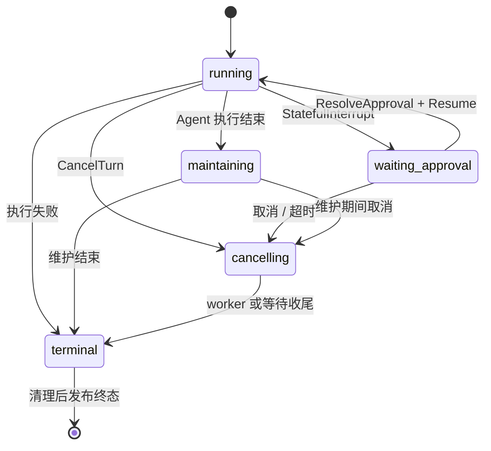

# 02 Runtime 与 Eino 执行

关键源码：[service.go](../../internal/runtime/service.go)、[resolver.go](../../internal/runtime/resolver.go)、[executor.go](../../internal/runtime/executor.go)、[eino_builder.go](../../internal/runtime/eino_builder.go)、[capabilities.go](../../internal/runtime/capabilities.go)、[types.go](../../internal/runtime/types.go)。

## Service：一次 Turn 的拥有者

Service 保存 `activeByRequest`、`activeBySession`、reservationAgents、根 Context、关闭标志和 WaitGroup。Session 预约限制同一会话一次只有一个 Turn；不同 Session 可并行。Context 检查、手动压缩和 Agent 删除等操作也沿 [operations.go](../../internal/runtime/operations.go) 的预约/关闭边界执行。

`StartTurn` 的顺序决定数据和 UI 的语义：

1. 校验输入、合并启动操作 Context/Deadline，读取 Session。
2. 生成 RequestID/RunID，预约所属 Agent/Session。
3. `PrepareUserMessage` 保存新用户输入，或校验 RetryUserMessageID 指向当前可重试输入。
4. 建立共享预算状态，Resolver 构造快照；初始化失败时消息可能已保存，因此返回带 UserMessageID/StartError 的收据。
5. 创建以 Service.rootCtx 为父的运行 Context，按任务 Deadline/MaxDuration 设置截止；桌面 IPC 返回不会取消已启动 Turn。
6. 登记 activeRun/WaitGroup，异步 executeTurn，返回 ContextUsage、Assembly 和已冻结 Manifest。

初始化失败通过 defer 通知生命周期观察者再归还 reservation；已注册的运行由唯一终态流程清理。Retry 不能简单再追加同一用户消息，否则会重复消息和附件。

## Resolver：冻结什么

Snapshot 包含模型实例/身份/revision、Provider 描述、Agent 指令、Workspace、Effective Sandbox、实际工具实例、Skill 内容身份、MCP 连接/工具身份、上下文消息/预算、SessionWriter、事件 Reporter 和执行限额。Manifest 是安全的 UI/日志投影，不代替执行对象。

`resolvedContextBase` 收拢 Agent/Model/Workspace/Tools 解析，供启动、ContextOverview 和手动压缩共用。能力装配区分 preview 与执行：设置页预览描述能力，不应靠访问远端服务取得“下一轮”的所有状态；真正执行使用 Resolve。已经运行的 Active.Manifest 与下一轮 Overview.Manifest 可不同，配置修改不改写旧快照。

模型角色由 [model_roles.go](../../internal/runtime/model_roles.go) 决定：Chat 使用 Agent.ModelID；Utility 为空时回退 Chat；Image 来自应用级多媒体设置，只有 Chat 无法直接看图且本轮需要视觉时才解析。Tools/Files/Vision 要求经能力校验，缺失时返回 ModelCapabilityError。摘要模型选择 Utility/Chat 中窗口足够的一方，不能用小 Utility 窗口承载任意大的 Chat 历史。

系统指令由 [prompt.go](../../internal/runtime/prompt.go) 结合 Agent 指令、工作区、当前时间和已选工具描述构建，并加入明确保存的个人记忆、回答语言和 Skill 导引。只在能力真实可用时添加相应指导；Prompt 不产生权限。

Resolver 先投影持久化上下文并按阈值处理压缩，再 Hydrate 会话附件。如果 Chat 无视觉能力，视觉模型只返回观察事实并把图片替换成不可信文本；主推理、工具调用和最终回答仍由 Chat 执行。

## Eino 的职责与项目自己的职责

`buildChatModelAgent` 使用 `adk.NewChatModelAgent`，配置 Instruction、tracked Model、Handlers、ToolsNode 和 MaxIterations。`ExecuteSequentially: true` 表示同一轮多个工具按顺序执行，避免文件/授权等动作隐式并行。`buildRunner` 使用 streaming Runner 和 Approval CheckPointStore。

Handlers 的顺序为 Skill（存在时）、工具结果 reduction、MidRunCompactor。Eino 管理模型/工具循环、流式输出、interrupt/resume；Humbert 管理模型/能力身份、权限、持久化、预算、实时事件和资源生命周期。这些层不能互相替代。

## 输出消费和持久化

`consumeEvents` 循环读取 AgentEvent：

| 输出 | 处理方式 |
| --- | --- |
| Assistant | materializeAssistantOutput 合并 stream chunks，同时发正文/思考 delta；完成后 AppendAssistantMessage |
| Assistant 带 ToolCalls | 保留调用 ID、参数、thinking 等事实，不把它误判为最终答案 |
| Tool | materializeMessageOutput 后 persistCompletedTool，对应前一个调用 ID |
| Interrupted | extractApprovalInterrupt 取得安全公开资料，返回等待信息，保留 Eino checkpoint |
| Event.Err / Context 取消 | 分类错误，结束当前执行，不伪造成功输出 |

流式读取失败时可保存已经产生的 partial Assistant；取消用 aborted，普通错误用 error。被供应商内容策略拦截的输出不作为有效回答保存。必要持久化使用 `context.WithoutCancel`，避免用户点击停止后丢失已经生成的事实；实时事件仍是可丢失的 UI 投影。

## 工具生命周期与可恢复错误

`buildToolLifecycleMiddleware` 在实际 Guard 前检查限额、发送 started，调用工具后发送 completed/failed。等待审批的 StatefulInterrupt 原样上抛，不转成普通错误；取消和硬预算错误也终止 Turn。

普通工具错误被转换成结构化可恢复 ToolOutput，模型可读取错误后调整策略，而不是让整轮因一个文件不存在立刻退出。错误展示经过脱敏；参数日志/实时资料也有限额。ToolStarted 表示进入调用链，并不证明已经产生外部副作用；后台重试据此保守停止重放。

## 限额与模型计账

[limits.go](../../internal/runtime/limits.go) 用原子计数器记录模型/工具调用与总 Token。CAS 预留调用次数，在执行前拒绝超过限制；Token 使用量来自已返回的供应商 Usage，因此 Token 上限在下一次调用前生效，不能撤回已经消耗的单次请求。

[model_accounting.go](../../internal/runtime/model_accounting.go) 包装 Generate/Stream/WithTools。流式 Usage 取累计最大值，只报告增量，避免多 chunk 重复计费；摘要、视觉和子 Agent 使用共享父预算。普通聊天零限额不启用计数限制。工具审批恢复识别已有 interrupt，不重复消费同一工具调用次数。

## 状态机、取消和终态

审批期间保留 Session 占用；CancelTurn 区分活动 worker 和等待 checkpoint 的运行。Service.Close 停止接收操作、取消根 Context并等待 worker，不由 UI 自行删除 active 状态冒充后端取消。

成功先 `MaintainAfterTurn` 提交必要上下文摘要，再 `finishRun`。该函数使用 active.finishOnce，按 cleanup → observer → 释放索引/reservation → publish terminal 的顺序统一完成、失败、取消。Executor 已保存消息，这里不二次写 JSONL。终态后订阅者可以立即预约同一 Session；旧清理保留 RequestID/指针校验，不能删掉新预约。

Provider 错误分类在 [provider_error.go](../../internal/runtime/provider_error.go)，用户文案在 [events.go](../../internal/runtime/events.go)。异常分类和日志细节用于诊断，不能把供应商原始认证错误直接传给 WebView。
