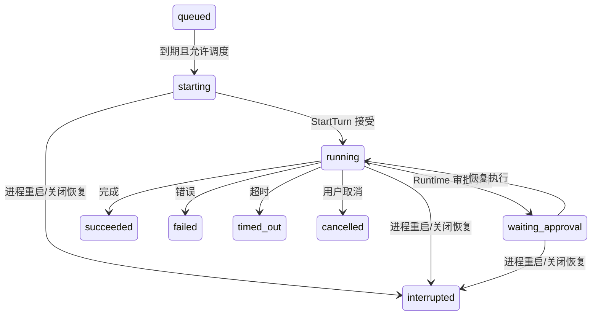

# 09 任务、主动助手与通知

后台能力分成三层：Task 保存计划和运行事实；Proactive 将事件按规则转为提醒或内部任务；Notification 负责向当前应用发布提醒。执行 Agent 的底层仍然是同一个 Runtime。

## Task 的对象与持久化

实现：[types.go](../../internal/tasks/types.go)、[store.go](../../internal/tasks/store.go)、[manager.go](../../internal/tasks/manager.go)。

Task 有 Agent/notification 两种类型，active/paused/archived 三种配置状态。Agent 类型还区分 isolated 与 continuous：前者为运行创建独立会话，后者复用任务关联的持久会话。Run 是一次尝试的事实，包含触发来源、计划时间、Session/Runtime request、次数、预算、统计、审批和结果摘要。

文件以 Agent 为所有者组织：`agents/<agent>/tasks/<task>/config.json` 和 `runs/<run>.json`。配置和运行文件都有 schema version，通过 atomicfile 写入。Store 中的 taskAgents/runTasks 是定位缓存；文件仍是事实来源。坏配置/运行文件会形成 Issue，不能简单按“没有任务”吞掉错误。

任务状态和运行状态不同。暂停任务限制后续调度，不会把已经成功的 Run 改成暂停；归档配置也不是删除历史。运行状态包括 queued、starting、running、waiting_approval 以及 succeeded、failed、cancelled、timed_out、interrupted、skipped 等终态。

## 计划算法与调度循环

[schedule.go](../../internal/tasks/schedule.go) 实现 manual、once、interval、daily、weekly 的校验和下次时间计算。日/周计划按时区处理本地时刻，interval 使用持续间隔；once 有独立一次性处理逻辑。misfire 的 skip/run_once 决定漏过时间后的补偿方式，overlap 的 skip/queue_one 决定上一轮还在执行时如何处理下一次触发。

[manager_schedule.go](../../internal/tasks/manager_schedule.go) 负责一个调度周期。默认每 5 秒检查，默认并发上限为 2。`cycleMu` 防止多个周期交错修改队列；活动 Run/Session/Agent 映射和删除中标记在 Manager 锁下更新。调度还检查同 Agent 活动占用及删除状态，避免和 Agent 删除交叉。

队列项先持久化，再经过 dispatch 进入 starting，准备会话和 StartTurn 参数后调用 Runtime。限制会传递给 Runtime：时长、模型调用、工具调用和 token 等并非仅在 UI 上显示。通知类型直接发送提醒，无需模型和聊天会话。

图表示主要路径；并不是每个失败都会先产生 running 事件。初始化失败也可从 starting 直接结束，queued 项还可能因规则变化跳过或中断。

## Runtime 事件与 Run 记录

[manager_events.go](../../internal/tasks/manager_events.go) 将 Runtime 事件投影为 TaskRun 状态。通过 request/session 映射找到对应 Run，更新状态、等待审批信息、输出摘要和使用统计，再发布 `tasks.event`。

上一轮修复使终态统计使用 Runtime 的最终累计工具调用数，避免流式事件缺失时将已发生工具调用误算成零。最终清理由 Runtime 先完成，再发布终态，因此 Task 调度收到终态后不会立即撞上仍未释放的上一轮资源。

自动重试只允许明确失败/超时且工具调用数为零的运行。即便文件中还保留旧版本建立的 retry 队列，dispatch 也重新检查父 Run。只要已经执行过工具，就不能把重跑默认当成安全操作；代码没有为任意外部服务实现业务幂等协议。

`max attempts` 和 retry delay 决定安全重试的次数与时间。手动触发、计划触发、重试和主动助手触发使用不同 Trigger，便于恢复和审计，不应该只靠提示文本判断来源。

## 重启、取消和删除

`Manager.Start` 先将遗留 starting/running/waiting_approval 等活动记录协调为 interrupted，再处理未启动的内部 automation 和安全重试队列，然后订阅 Runtime 并启动循环。磁盘中有 Run 不代表旧 Eino checkpoint 也存在；等待审批状态不能跨进程直接继续。

Close 先停止订阅和调度，标记尚在执行的任务中断，然后取消对应 Runtime request，并等待自身 goroutine。取消意图有专门 pending 状态，防止 request 尚未分配时错过取消。

[manager_task.go](../../internal/tasks/manager_task.go) 负责配置操作和关联会话维护。删除运行/任务前检查活动状态和会话引用；continuous 任务可能多轮引用同一会话，不能删除一条 Run 就无条件删除共享会话。Agent 删除通过 SuspendAgent 等机制与调度协调，见第 10 章。

## Proactive 是规则引擎

实现：[types.go](../../internal/proactive/types.go)、[decision.go](../../internal/proactive/decision.go)、[manager.go](../../internal/proactive/manager.go)、[executors.go](../../internal/proactive/executors.go)。

当前默认引擎是 `RuleDecisionEngine`，依据配置判断 ignore、notify 或 run_agent。并没有在每次心跳中先调用 LLM 评估一切。事件包含任务失败/超时/中断/成功/长任务完成、任务待审批、审批待处理以及工作区变化。

默认启用主动助手，心跳间隔 5 分钟；任务和审批事件默认通知，工作区变化规则默认关闭。规则可配置目标 Agent、任务提示和冷却时间。未识别动作会安全忽略。安静时段支持跨午夜和指定时区；起止相同表示全天，非法时间配置不会被解释成合法区间。

Manager 的短 tick 与业务心跳分开：tick 用于检查到期、完成内部运行和唤醒；心跳按 Settings 决定周期。heartbeatRunning 防止手动巡检与定时巡检重叠。

## 持久收件箱与内部任务

[store.go](../../internal/proactive/store.go) 保存设置、待处理事件、处理记录及工作区基线。事件先 Enqueue，处理后存在对应记录才移除待处理项，减少“收到事件但还没落处理记录就退出”的丢失窗口。

Record 保存原 Event、Decision、ignored/deferred/executing/succeeded/failed 状态，以及 automation Task/Run ID。安静时段或暂时条件不满足的事件可以保留为 deferred，后续心跳再处理。冷却、事件键和记录关联共同抑制重复提醒。

run_agent 动作通过 Tasks 的内部 automation 路径执行，并记录关联标识。内部任务终态由 `finalizeCompletedAutomations` 回填；它的成功/失败不会再次无限生成同类主动助手自动运行。启动恢复会重新协调执行中记录，不能把通知已发出和 Agent 已完成当成同一事实。

## 工作区监测

[workspace_monitor.go](../../internal/proactive/workspace_monitor.go) 读取文件路径、大小、修改时间和模式，排序后生成 fingerprint；排除常见依赖/构建目录，并设置遍历上限。第一次扫描建立基线，不把整棵目录当成新增文件提醒。

后续变化由新旧快照比较生成事件，快照带 Truncated 标志。因此它是有界的元数据巡检，不是实时 filesystem watcher，也不保证发现修改时间和大小均保持不变的内容变化。规则是否通知/执行仍交给决策层。

## 通知实现及限制

[notifications/service.go](../../internal/notifications/service.go) 定义 Sender/Provider、通知字段、发送和最近通知列表。Service 将通知交给已注册 Provider，并保存最多 100 条近期记录；这份列表在内存中，不能当永久通知数据库。

当前 Bootstrap 注册 EventProvider，将通知发布到 EventBus，再由桌面服务转为 Wails 事件。前端据此展示通知和会话/任务跳转，并在页面隐藏且浏览器 Notification 权限已授予时尝试浏览器通知。后端没有装配独立的原生系统通知 Provider，跨平台系统通知的实际效果依赖 WebView 能力和权限，详见第 11 章。

主动助手 Record、TaskRun 和近期通知分别回答“为何触发”“执行了什么”“界面收到什么”，持久性也不同。排查重复提醒或缺失提醒时，应先确定问题在哪一层，再查看对应事件键和运行 ID。
