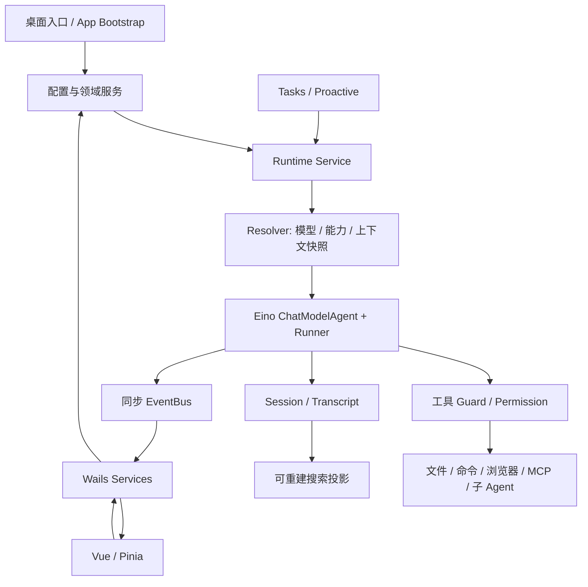

# Humbert Agent 源码实现剖析

这份文档依据 **2026-10-04 当前工作区源码**编写，包含上一轮修复。HEAD 为 `3d01afd`，工作区有未提交修改，因此不能只用提交号表示本文版本。源码清单和内容摘要见 [源码索引](source-index.md)。本文没有使用已有 README、架构文档或评审报告作为实现事实来源。

范围包括桌面/数据入口、全部非 RAG 内部模块、前端 API/Store/组件和示例。排除 `internal/rag/**`、生成 bindings、依赖源码与构建产物。包声明、类型、函数和调用方经过扫描，关键链路阅读实际函数体；这是一份实现说明，不是对全部源代码逐行完成的安全审计。

## 阅读目录

| 章节 | 覆盖的模块与问题 |
| --- | --- |
| [01 启动、配置与基础设施](01-bootstrap.md) | cmd、app、config、component、atomicfile、eventbus、logging、instancelock、commandenv |
| [02 Runtime 与 Eino 执行](02-runtime.md) | 一轮聊天如何启动、冻结能力、流式输出、调用工具、结束和取消 |
| [03 上下文、记忆与多模态](03-context.md) | contextengine、contextartifact、preferences、multimodal、documenttext、avatar |
| [04 Agent、Session 与 Transcript](04-data.md) | 配置、消息格式、分支、索引、附件、恢复与分页 |
| [05 工具实现](05-tools.md) | Registry/Guard 和各项内置工具的输入、执行方式、限制 |
| [06 权限、审批与沙箱](06-security.md) | permission、approval、sandbox 及 macOS/Linux/Windows 差异 |
| [07 模型与凭据](07-models.md) | models、credential、供应商适配、缓存和能力判定 |
| [08 Skills、MCP 与协作](08-extensions.md) | 安装/更新、按需加载、连接持有、子 Agent 权限继承 |
| [09 任务、主动助手与通知](09-background.md) | tasks、proactive、notifications、计划、重试与重启 |
| [10 工作区、搜索、备份与跨域用例](10-workspace-backup.md) | workspace、workspaceview、searchindex、databackup、usecases、websearch |
| [11 桌面服务与前端](11-frontend.md) | services、Vue 页面、Pinia、Wails 桥、事件和异步竞态 |
| [12 可选优化与验证边界](12-maintenance.md) | 值得做与暂不值得做的调整、触发条件、验证地图 |
| [源码索引](source-index.md) | 文件清单、主要声明、章节映射及源码 SHA-256 |
| [桌面服务接口索引](service-api.md) | 当前公开方法、参数、返回、前端调用对应关系和 DTO 原文 |
| [工具参数索引](tool-api.md) | 内置工具的本地输入/结果结构、JSON 字段和 Schema 来源 |

## 整体执行结构

四个容易混淆的对象需要先区分：

- **Agent**：可复用的配置与能力选择，不是正在执行的 goroutine。
- **Session**：归属于一个 Agent 的持久会话，保存消息、附件和压缩检查点。
- **Turn / Runtime Run**：当前进程中的一次执行，持有不可变快照、取消函数和审批 checkpoint。
- **Task / Task Run**：可恢复的后台计划与执行记录；Agent 类型任务通过 Runtime 驱动 Turn。

消息事实、执行控制和界面状态属于不同层。JSONL 的 `toolResult`、实时 `tool.completed` 和前端工具卡片不是三份等价数据库记录。阅读下面章节时应始终追问：谁拥有状态、谁写入、谁负责释放、哪些数据可以重建。

## 如何核对本文

每章链接的是 `.go`、`.js`、`.vue` 等实现文件，并标出关键符号。算法、默认值和限制以代码为准；“可以优化”属于工程判断，会与已经实现的行为分开表达。能力字段存在、供应商 SDK 可配置、页面可以展示，都不自动证明完整产品能力已经实现。例如 Audio 能力配置存在，不意味着项目已有音频录制/转写链路。

维护时先更新相关代码和测试，再核对对应章节。无需为小改动复制所有文档；源码索引用于定位，不代替章节中的实现解释。
