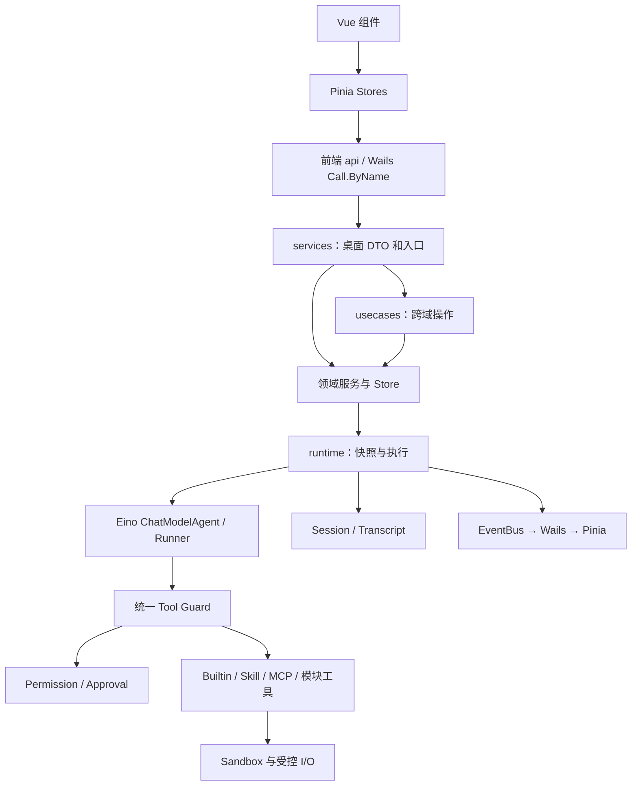
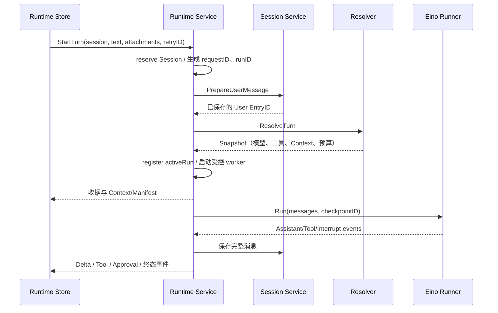
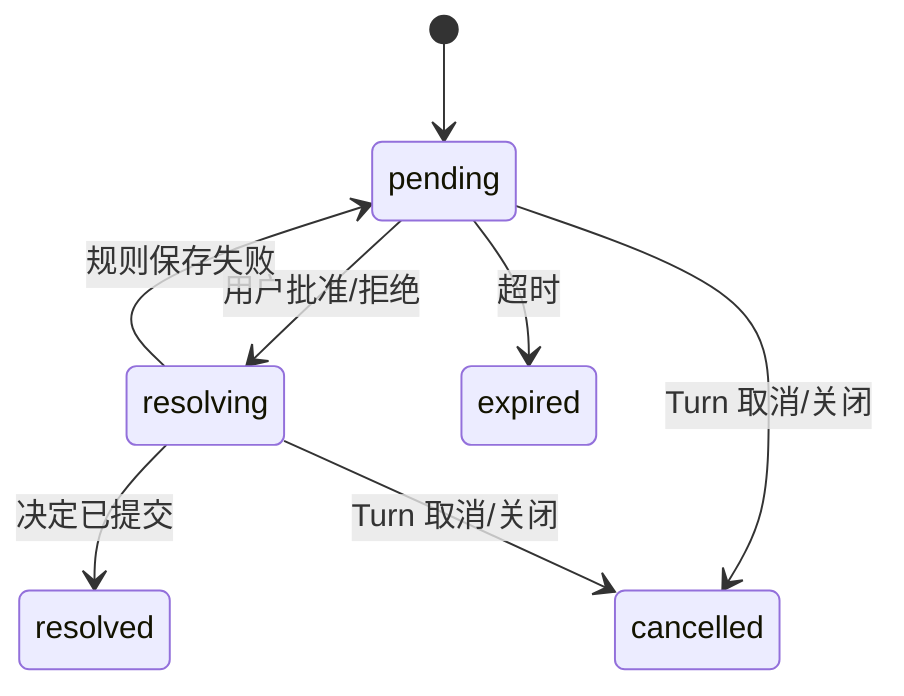

# Humbert Agent 项目源码详解（不含 RAG）

> 源码核对日期：2026-10-05。本文从当前工作区的实现出发，包含尚未提交的重构；没有把旧架构文档作为实现依据。阅读范围为桌面入口、数据维护命令、非 RAG 后端、前端及非 RAG 示例。`internal/rag`、`examples/5-rag` 和 `cmd/rag-migrate` 不在解析范围内。
>
> 文中“默认值”来自源码默认配置，“本轮”指一次用户请求及其模型—工具循环。模型配置、环境变量及设置页可以改变实际运行参数。本文解释代码保证的行为，不把注释中的未来计划或构建模板当成已完成的产品功能。

## 阅读导航

1. [项目整体设计与技术选择](#overview)
2. [入口、装配、生命周期](#bootstrap)
3. [配置与本地数据布局](#configuration)
4. [Agent 配置实体与删除流程](#agents)
5. [Provider、模型实例和能力判断](#models)
6. [Session、JSONL、缓存与索引](#persistence)
7. [Runtime：一轮请求的执行全过程](#runtime)
8. [消息的构建、转换与流式保存](#messages)
9. [Context 组装、预算、压缩和恢复](#context)
10. [图片、文本与文档附件](#multimodal)
11. [工具注册、选择、权限包装与大结果](#tools)
12. [文件、搜索、编辑和补丁工具](#file-tools)
13. [命令、Skill 脚本和只读 Git 工具](#command-tools)
14. [网页搜索、抓取与浏览器](#web-tools)
15. [Permission：授权策略与能力身份](#permission)
16. [Approval：暂停、批准、拒绝和恢复](#approval)
17. [Sandbox：文件、进程与网络边界](#sandbox)
18. [Skills：发现、安装、更新与运行](#skills)
19. [MCP：目录、连接、传输与工具适配](#mcp)
20. [多 Agent 协作](#collaboration)
21. [任务、调度、重试与运行记录](#tasks)
22. [主动助手、工作区监测与通知](#proactive)
23. [事件总线与桌面事件桥接](#events)
24. [工作区浏览和本地搜索索引](#workspace-search)
25. [偏好、凭据、头像、备份与恢复](#user-data)
26. [桌面 Services 和跨域 Usecases](#adapters)
27. [前端状态、组件与界面数据流](#frontend)
28. [构建、数据 CLI 和示例](#build)
29. [测试、设计边界与学习路线](#reading)
30. [桌面接口、数据结构与源码文件索引](#appendix)

<a id="overview"></a>
## 1. 项目整体设计与技术选择

### 1.1 项目真正运行的东西

Humbert 是一个本地优先的桌面 Agent 应用。用户保存 Agent 的模型、指令、技能、工具和工作区配置；每次发送消息时，后端创建本轮运行快照，交给 Eino 的 `ChatModelAgent` 执行推理与工具循环。运行结束后，快照、取消上下文和审批 checkpoint 等进程状态被回收。Agent 配置本身不代表一个永远驻留、持续思考的智能体。

可以把代码中的对象分成四类：

| 类别 | 代表对象 | 所有权和生命周期 |
| --- | --- | --- |
| 用户保存的配置 | Agent、Provider、Model、Skill/MCP 绑定、任务 | 由领域 Store 持久化，跨启动保存 |
| 会话事实 | 用户消息、回答、thinking、工具调用与结果、压缩记录 | Session JSONL 保存；会话元数据单独放 SQLite |
| 一次运行的状态 | Runtime Snapshot、执行预算、取消函数、审批 checkpoint | 从启动一轮到该轮完成/取消；不作为长期会话配置 |
| 可重建的派生内容 | 搜索索引、缓存、当前 Context、视觉观察输入 | 从配置、历史或原件重建；不冒充用户原始事实 |

### 1.2 分层不是简单按文件名分类



`internal/app` 是装配位置；`services` 适配桌面调用；`usecases` 协调多个领域；各领域 Store 负责自己的数据；`runtime` 解析模型与能力并协调 Eino。工具执行不会去全局 Application 中寻找任意服务，而是接收明确依赖和冻结的 Scope。

### 1.3 为什么使用这些依赖

版本依据 [go.mod](../go.mod) 和 [frontend/package.json](../frontend/package.json)。

| 依赖 | 当前代码承担的工作 |
| --- | --- |
| Go 1.27.1 | 后端语言及模块声明；`context`、锁、goroutine、`os.Root`、文件与 HTTP 等标准库是主要实现基础 |
| Wails v3 beta.24 | 桌面 WebView、Go 服务暴露、资产嵌入、事件及窗口 |
| Eino v0.9.19 | Agent 推理循环、工具调用、Runner、流式事件、Interrupt/Resume、Skill/Reduction/Summarization 中间件 |
| Eino OpenAI/Ollama adapters | 将统一模型接口映射到实际 Provider 请求 |
| Vue 3、Pinia、Arco、Vite、Tailwind | 组件、状态、桌面界面、构建与样式；前端应用自己的依赖以 package.json 为准 |
| modernc SQLite | 无需引入 Go CGO SQLite 驱动的会话控制面和本地全文索引 |
| Viper、yaml.v3 | 默认值、YAML、环境变量覆盖及局部配置保存 |
| Rod | Chrome/CDP 自动化；共享可见页面、快照、交互和截图 |
| MCP Go SDK / officialmcp | MCP 协议会话及向 Eino 工具适配 |
| Tabula | PDF/Office 文档转 Markdown，调用放在专门解析进程 |
| go-keyring | 正式桌面 API Key 保存到系统凭据库 |
| age | 加密备份和恢复解密 |
| doublestar | 文件 glob 匹配 |
| html-to-markdown | 网页正文转换为模型易读的 Markdown |

依赖表中有某个 SDK，不等于正式 Runtime 已使用它的全部能力。例如 AgenticMessage 的示例不代表主聊天入口已经改成 Responses/Agentic 模型；正式 Factory 只构造当前支持的三种 Provider 协议。

<a id="bootstrap"></a>
## 2. 入口、装配、生命周期

源码入口：[cmd/desktop/main.go](../cmd/desktop/main.go)、[application.go](../internal/app/application.go)、[lifecycle.go](../internal/app/lifecycle.go)、[modules.go](../internal/app/modules.go)。

### 2.1 桌面 main 的顺序

`main` 调用 `os.Exit(run())`。资源 defer 放在 `run` 内，因为 `os.Exit` 不执行 defer。

`run` 的顺序为：定位 `~/.humbert-agent` → 获取实例锁 → 应用待恢复数据 → 应用待备份请求 → Bootstrap Core → 创建并运行 Wails → 以限时 Context 关闭 Core → 释放实例锁。

实例锁必须早于恢复、备份和数据库打开，否则第二个进程可能修改仍被第一个进程使用的数据。恢复在启动前完成，避免打开的 SQLite、运行中的任务和文件缓存与恢复目录相互冲突。

`runDesktop` 创建主窗口，注册 `services.All(core)`，通过 `frontend.Assets` 提供生产资源。窗口初始 1100×750，最小 860×600；macOS 使用透明原生标题栏，最后一个窗口关闭后结束应用。界面错误经 `marshalFrontendError` 脱敏并限制长度后转成 JSON，不能把 Provider 返回的原始 Authorization 信息直接送进界面。

### 2.2 Bootstrap 的依赖顺序

`Bootstrap` 不通过隐式 Service Locator 让领域之间互相查找。核心顺序如下：

1. 加载 Config，创建 Logger、Credential Store、Transcript Store。
2. 创建 Workspace、Sandbox、Permission、Approval、Preferences。
3. 创建 Skills、MCP 配置和 Manager、Models Store/Registry、Agents Store/Service。
4. 恢复未完成的 Agent 删除，创建 MCP Runtime Backend。
5. 创建 Sessions Store/Service、工作区查询和本地搜索。
6. 创建默认工具 Registry，将 Session Service 同时注入历史、附件与大结果归档能力。
7. 创建 ContextEngine、EventBus、Runtime Resolver/Executor。
8. 创建 Collaboration，并注册协作工具；创建 Runtime Service 和生命周期观察者。
9. 创建 Tasks，注册 `schedule_task`；创建 Notifications 和 Proactive。
10. 安装可选组件，注册能力 Provider，启动组件、任务调度与主动助手。
11. 创建跨域 Usecases，发布 Application，最后标记 Ready。

Runtime Resolver 保存 Registry 引用，因此协作工具和任务工具在后续注册后仍会被下一轮 Resolve 看见。创建 Resolver 时没有提前复制一个永不更新的工具数组。

### 2.3 失败回滚与正常关闭共用清单

每个资源成功创建后立即登记到 `lifecycle.entries`。启动中途失败时，已接管资源按同一规则关闭；尚未移交的 Factory/Module 由创建或注册失败处立即释放。

关闭分三阶段：

| 阶段 | 目的 | 代表资源 |
| --- | --- | --- |
| `stopWork` | 停止继续产生新任务 | Proactive、Tasks、模块后台工作 |
| `finishRuns` | 取消/等待现有 Agent 运行 | Runtime |
| `closeResources` | 已无消费者后释放连接和基础设施 | 模块、工具、事件总线、搜索、Session Store、MCP、Logger |

阶段内逆构造顺序；`sync.Once` 防止重复关闭；一个关闭错误不会阻止其他资源释放，错误通过 `errors.Join` 合并。App 的 getter 是装配结果出口，不表示允许所有领域依赖整个 App。

### 2.4 可选组件接入契约

[component/module.go](../internal/component/module.go) 定义 `Host`、`Installer`、`Module`、`Provider`。Host 只给数据根、Logger、Credentials、Events、Sandbox 等平台资源。模块自己负责业务 Store、连接和配置。

Provider 有 `Selection`、`Describe`、`Resolve`：Selection 读取明确的 Agent 绑定；Describe 提供本地 Schema，不连接服务；Resolve 返回本轮冻结的可执行工具。Contribution 的 Revision 要随实现、配置或 Schema 变化，但不能包含 Secret 原文。

子 Agent 的 `Request.AgentID` 用来读取它自己的能力绑定，`Request.Scope.AgentID` 仍是父权限身份。Runtime 会验证名称、选择集合和工具契约，统一加 Guard、预算和结果归档。

<a id="configuration"></a>
## 3. 配置与本地数据布局

入口：[config.go](../internal/config/config.go)、[configwrite.go](../internal/config/configwrite.go)、[tools.go](../internal/config/tools.go)、[permission.go](../internal/config/permission.go)、[sandbox.go](../internal/config/sandbox.go)。

### 3.1 默认值、文件和环境变量

`Load` 从用户 Home 推导固定应用根。先确保目录和默认文件存在，再用新的 Viper 实例加载默认值、`config.yaml` 和 `HUMBERT_*` 环境覆盖，Unmarshal、Normalize、Validate 后返回 Config。点号和短横线映射为下划线，例如 `runtime.context.auto_compaction` 对应 `HUMBERT_RUNTIME_CONTEXT_AUTO_COMPACTION`。

路径由 `resolvePaths` 统一生成；领域 Store 决定具体文件 Schema。第一次启动创建目录使用 Unix 0700，配置类文件通常 0600。创建默认文件与读取现有文件分开，不能因为损坏就无声覆盖用户配置。

### 3.2 实际数据位置

```text
~/.humbert-agent/
  config.yaml
  config/
    providers.json
    models.json
    preferences.json
    permissions.json
    proactive.json
  secrets/                     系统凭据 ID 索引及旧凭据迁移入口
  mcp/servers.json
  skills/                      应用级 Skill 包
  agents/
    session-metadata.sqlite    全部 Session 控制面
    <agent-id>/
      config.json              Agent Profile
      sessions/<session-id>/
        session.jsonl          消息树与 compaction
        attachments/<id>       上传原件和工具截图
        context-artifacts/     大工具结果 JSON
        subagents/             子运行审计 JSON
      ...                      任务等领域自有记录，见对应章节
  workspaces/<agent-id>/        Managed 工作区
  cache/                       搜索索引、浏览器 Profile 等派生/私有状态
  logs/humbert.log
  tmp/
```

当前 Session 标题、归档状态和更新时间的事实来源是 SQLite，**不是每会话 config.json**。部分历史注释描述过旧布局，学习时应以 `sessions/catalog.go` 的实际实现为准。

### 3.3 局部更新不会覆盖其他配置域

设置页更新 Permission、Sandbox 或 Shell 开关时，通过各自保存入口更改 YAML 对应键。配置写入集中在 configwrite 中，避免各入口自行序列化整个默认模板、把别的配置清空。应用级 Manager 在保存后更新自己的运行配置，已有 Turn 仍使用已冻结策略。

ToolConfig 与主 Config 分开读取。文件、抓取、搜索、命令的启用和数量、字节、超时上限在工具装配处生效。`shell_enabled` 控制本地执行能力是否存在；Approval 控制存在的工具本次能否执行；Sandbox 控制实际访问范围。这三项不是同一开关。

<a id="agents"></a>
## 4. Agent 配置实体与删除流程

源码：[types.go](../internal/agents/types.go)、[validation.go](../internal/agents/validation.go)、[service.go](../internal/agents/service.go)、[store.go](../internal/agents/store.go)、[agent_lifecycle.go](../internal/usecases/agent_lifecycle.go)。

### 4.1 Profile 字段的含义

| 字段 | 设计作用 |
| --- | --- |
| ID、Name、Avatar | 稳定身份、展示名称、经校验的头像 |
| Instruction | 用户保存的 Agent 指令，运行时还会组合平台规则 |
| ModelID | 主聊天模型配置 ID |
| ModelRoles.UtilityModelID | 可选摘要辅助模型，留空回退 Chat |
| SubagentEnabled | 是否允许其他 Agent 通过 run_agent 调用，默认 false |
| EnabledBuiltinTools | 普通内置工具选择，nil 和显式空集合有不同意义 |
| EnabledSkills | 应用级 Skill 包名称引用 |
| EnabledMCPTools | Server ID + 原始工具名引用 |
| WorkspaceMode、WorkspacePath | 托管或用户自选目录 |
| Sandbox | 覆盖应用默认策略；零值继承全局设置 |

AgentInfo 中模型展示名称由 Service 批量投影。Store 不直接打开另一个领域的 models.json。

### 4.2 创建与校验

统一校验名称、头像、Instruction、模型引用、Skill/MCP 引用、工具名和目录策略。名称最多 100 个字符；Instruction 最多 64 KiB；头像交给 avatar.NormalizeDataURL。允许暂未配置模型的 Agent 被保存，但指定模型时必须存在且启用，真正运行时还会要求 Chat Model 已设置。

Create 生成 UUID，保存 Profile 后准备 Workspace。工作区准备失败会用独立且限时的 Context 补偿删除已创建 Profile，避免原请求取消使回滚也立即失败。Custom 目录只验证和引用；Managed 目录由 Agent ID 推导。

### 4.3 更新与并发

完整 Update 使用 Store.Mutate 在锁内合并未提交字段；局部入口 `UpdateProfile`、`SetModel`、`SetModelRoles`、`SetSkills`、`UpdateSecurity` 也进入统一 mutate。这样两个设置页先后保存时，不会拿各自读取的旧 Profile 覆盖对方刚改的字段。

指针或 nil 切片承担“未提交”的语义：例如 `EnabledMCPTools == nil` 保留现状，非 nil 空集合明确清空；Builtin 选择类似。保存时先规范化并校验，不在每个入口各写一套长度限制。

改变 Workspace 配置只影响后续运行，不自动迁移、复制或删除原目录。当前 Turn 的模型和能力同样不会在设置变更后中途更换。

### 4.4 删除是可恢复的 Aggregate 操作

领域 Delete 写入删除状态，Agent 随即从可用 Get/List 隐藏；随后删除 Managed 工作区和 Agent 自有数据。Custom 工作区属于用户，不递归删除。失败保留 deleting 状态，Bootstrap 的 RecoverDeletions 或用户重试继续清理。

Service 的生命周期读写锁阻止删除快照后又创建新 Session。桌面删除入口使用 AgentLifecycle，先停止/排除运行与任务，协调 Session 元数据、权限规则等外部引用，再删除 Profile Aggregate。直接删除一个目录无法替代这个用例。

<a id="models"></a>
## 5. Provider、模型实例和能力判断

源码：[registry.go](../internal/models/registry.go)、[store.go](../internal/models/store.go)、[factory.go](../internal/models/factory.go)、[runtime.go](../internal/models/runtime.go)、[capabilities.go](../internal/models/capabilities.go)、[reasoning_replay.go](../internal/models/reasoning_replay.go)。

### 5.1 Provider 和 Model 为什么分开

Provider 保存类型、BaseURL 和 CredentialID；Model 保存具体模型名、展示名、启用状态、响应头超时、窗口、最大输出和能力覆盖。同一 Provider 可以服务多个模型；Key 不重复保存在每个 Model 中。

Registry 协调 Provider/Model 修改、凭据补偿和实例缓存。保存配置失败时恢复此前凭据；删除 Provider 需要检查它的模型引用。删除 Model 需要检查当前 Agent 的 Chat/Utility 以及全局 Image 路由引用。历史 Assistant 已保存当时 Provider/Model 元数据，不依赖配置仍存在。

### 5.2 模型快照与缓存

ResolveSnapshot 在 Registry 锁下同时获取实例、配置和 Revision。读缓存使用 RLock；首次构造用写锁再次检查，只生成一个基础实例。修改配置会清缓存并增加 Revision；已启动 Turn 仍持有旧实例和元数据。

RuntimeSnapshot 的 ContextWindow/MaxOutputTokens 与真实 Instance 来自同一版本，不能稍后再读文件估算另一版窗口。基础实例不是每轮带工具的实例；Eino 的 WithTools 会构造工具绑定视图。

### 5.3 三种 Provider 的请求差异

| Provider | 当前 Factory |
| --- | --- |
| openai | Eino OpenAI ChatModel；要求凭据；输出限制用 MaxCompletionTokens |
| openai_compatible | 同一 ChatModel；Key 可选；输出限制用 MaxTokens |
| ollama | Eino Ollama ChatModel；输出限制用 NumPredict |

HTTP Transport 克隆 Go 默认 Transport，保留代理、TLS、连接复用和 HTTP/2；配置的是 `ResponseHeaderTimeout`，Client.Timeout 为 0。收到响应头后较长的 thinking/流式正文不会因为一个固定总 HTTP 时长被截断；真正整轮取消和任务时限由上层 Context 控制。

### 5.4 能力是推断加显式覆盖

每项 Capability 支持 `auto/enabled/disabled`。auto 根据 Provider 和模型名保守推断，例如识别常见 Vision/Reasoning 名称，任意 Files 默认关闭。它不是自动向模型发探测请求的能力数据库。用户显式声明会覆盖推断，但真实 Provider 仍可能拒绝错误声明。

Chat 始终负责 Agent 执行；Utility 用于摘要；Image 只在需要图片且 Chat 不支持时用于观察。Vision 辅助不要求 Tools，也不能补足任意 Files。原生音频能力字段存在，不表示当前上传和播放链路已实现。

OpenAI 和兼容模型外面还有 reasoningOmittingModel：Generate、Stream、WithTools 都保留这个最终出站包装，在消息副本上移除 Reasoning，防止同轮新产生的 thinking 绕过历史投影而被发送给不支持的协议。

### 5.5 设置页怎样验证模型

Registry.TestModel 不复用模型实例缓存，而是按当前 Provider/Model 配置重新构造实例，再发送只有一句 `Reply with exactly OK.` 的 User 消息，记录耗时和最多 200 字节的回答预览。桌面入口给操作最多五分钟，内部再应用模型配置的 TimeoutMS；返回非 nil 响应即表明请求完成，并不要求回答必须严格等于 OK。

ModelService.DiagnoseModel 先检查启用状态和必要凭据，再复用这个最小文本请求，把常见错误归为可处理的诊断。返回的 ToolsSupported 来自 Capability 配置推断；这个入口没有实际绑定工具，也没有上传图片测试 Vision。因此“连接成功”只能证明这次文本请求通过，不能证明所有工具协议、多模态能力和长上下文均可用。

<a id="persistence"></a>
## 6. Session、JSONL、缓存与索引

源码：[sessions/store.go](../internal/sessions/store.go)、[catalog.go](../internal/sessions/catalog.go)、[transcript/store.go](../internal/transcript/store.go)、[journal.go](../internal/transcript/journal.go)、[cache.go](../internal/transcript/cache.go)、[location_index.go](../internal/transcript/location_index.go)、[history_index.go](../internal/transcript/history_index.go)。

### 6.1 控制面与对话事实

session-metadata.sqlite 位于 agents 根下。sessions 表保存 id、agent_id、title、archived、cwd、created_at、updated_at，按 Agent/更新时间索引；WAL，busy_timeout=5000，连接池最多两条连接，user_version 当前为 1。

消息不在这个表里。Session JSONL v3 第一行是 Header，记录 ID、时间和创建时 CWD；之后每条 Entry 有身份、父节点和类型。消息 Entry 可包含 User/Assistant/ToolResult；模型变化、标签、compaction 是控制记录。ActiveBranch 是从当前叶节点沿父关系恢复的有效路径。

创建 Session 在 Agent 生命周期读锁内完成，先确认 Agent 和 Workspace 有效。更名、归档是 SQLite 控制操作；追加消息后更新元数据时间。删除 Session 会同时处理 Transcript 与 sidecar，权限/任务等跨域条件交给用例协调。

### 6.2 追加式日志和并发

Transcript Store 按会话文件加锁，单个 Session 内追加串行；不同 Session 不共享一个全局消息写锁。Header、Entry、父节点、Role 和内容块均有验证。单条 JSONL Entry 上限 8 MiB，是持久化最后边界，不能代替各工具更小的输出上限。

追加不是重写整段会话，因此保留历史事实和分支关系。compaction 也追加新控制记录，不把旧消息删除。最新 firstKeptEntryId 改变的是模型工作窗口。

### 6.3 损坏恢复

journal 只修复未完成的尾行，例如写入时进程退出留下的截断 JSON。完整历史中的坏 JSON、非法角色、重复 ID 或错误父节点不能被“忽略”伪装成正常；Session Store 在启动扫描时隔离损坏项并报告 Issues，使其他会话仍可使用。

对于配置等小文档，atomicfile 使用同目录临时文件、完整写入、Sync、关闭、替换，并拒绝目标/直接父目录的符号链接；ReadJSON 拒绝未知字段和多个顶层 JSON。原子写不负责读—改—写互斥，业务 Store 仍需要自己的锁。

### 6.4 普通历史和 Context 的读取不同

UI MessagePage 分页返回消息；Context 读取当前窗口只读视图。小文件缓存避免重复解码；大文件的 location index 保存行位置、树元数据与窗口边界，读取时只打开所需记录。history index 帮助定位工具调用/消息与历史搜索。

documentCache 是有界 LRU：最多 32 个 Session，并按对应 JSONL 文件字节数计费，总额 64 MiB；这不是解码后 Go 对象占用内存的精确测量。命中前必须同时确认文件身份、大小和修改时间。成功追加并完成同步/关闭后可以推进已有缓存；文件被外部替换、前置状态不一致或超过容量时，失效重建，不能猜测历史仍然相同。

Context 的缓存返回值不能被调用方修改。投影给模型时复制必要的 Message、Extra 和内容切片，再加 EntryID 或处理 thinking/附件。这是避免界面、执行状态和磁盘缓存互相污染的关键。

<a id="runtime"></a>
## 7. Runtime：一轮请求的执行全过程

入口：[service.go](../internal/runtime/service.go)、[resolver.go](../internal/runtime/resolver.go)、[executor.go](../internal/runtime/executor.go)、[runs.go](../internal/runtime/runs.go)、[operations.go](../internal/runtime/operations.go)、[events.go](../internal/runtime/events.go)。

### 7.1 Service、Resolver、Executor 的分工

| 对象 | 负责 | 不在它内部重新实现 |
| --- | --- | --- |
| Service | 运行登记、会话预留、取消、审批、后台 worker、终态与关闭 | 模型协议、领域文件格式 |
| Resolver | 读取配置、冻结模型/能力/指令、构造 Context、附件路由 | Eino 推理循环 |
| Executor | 构造 Runner、消费流、保存 Assistant/Tool、识别 Interrupt | 审批策略、配置修改 |
| Eino ChatModelAgent | 模型—工具迭代和状态流转 | Humbert 的文件、权限和备份规则 |

### 7.2 StartTurn 的固定顺序



同一 Session 只能运行一个 Turn。预留发生在用户消息追加之前，避免重复点击把两个输入同时推进历史。不同 Session 可以有各自的运行。

用户消息先落盘，所以 Resolve 失败不能假装从未提交。ChatService 将这种错误包装成 StartError 收据，前端记录已保存 UserMessageID；相同输入重试会验证最后一条未回复 User 的内容和附件并复用。

### 7.3 Snapshot 如何组成

Resolver 解析 Session → Agent → Chat/Utility/Image → Workspace → Sandbox → Builtin/Skills/MCP/模块贡献。Capability assembler 检查重复名称，统计 Schema，冻结 Skill revision 和 MCP 身份。构建 System Instruction 和 Context，按最终可见图片需求重新对齐模型角色，再 Hydrate 附件和必要的 Vision Bridge。

Snapshot 同时保存 request/run/session/agent 身份、模型元数据、工具/技能/MCP revision、Context Usage/Assembly、模型实例、工具实例、Message、SessionWriter 和 EventReporter。Manifest 供界面观察“本轮真正使用了什么”，不是从多个设置页请求猜出来的拼接结果。

### 7.4 Agent 构造与迭代

主/子 Agent 共用 buildChatModelAgent：绑定跟踪模型、Handlers、工具生命周期 middleware；工具按顺序执行，默认最大迭代 200，实际使用 Config 的值。

每次模型调用前顺序为 Skills → Reduction → Context Compaction。局部工具错误转换成标准失败结果交回模型，使它可以修正参数或选择替代能力；审批 Interrupt 和整轮取消原样向上，不可被普通失败字符串吞掉。

### 7.5 取消、终态与关闭

activeRun 的身份来自嵌入 Snapshot，不再复制另一份 request/run/session 字段。Service 的两个运行索引、会话预留和 phase 共同协调 running、waiting approval、resuming、maintaining、cancelling 等状态。

完成、失败、取消都经过统一终态出口，清理 checkpoint、通知观察者、释放预留并发布终态事件。正常完成才进入维护阶段提交待保存摘要；维护提交失败记录告警，不把已经生成的回答改成模型失败。

Close 先禁止新工作，取消 root Context/正在执行的运行，等待受控 worker；操作计数和 closeDone 防止启动、删除或手动压缩与关闭互相穿插。运行事件只用于实时投影，Assistant/Tool 的 JSONL 才是聊天事实。

### 7.6 预算和错误分类

limits.go 管理任务可带入的模型调用次数、工具次数、Token、时长和 deadline；子 Agent 与辅助 Vision/Utility 调用共享父运行 limitState。审批恢复不重复扣已经预留的工具次数。

model_accounting.go 用包装模型统计调用、流式 Usage 与模型角色；provider_error.go 区分上下文溢出、内容阻止、取消、超时等；events.go 生成可读错误并统一发布终态。日志和 UI 的工具参数限长/脱敏，真实执行参数留在内部 Scope/Checkpoint，不能拿展示文本执行。

<a id="messages"></a>
## 8. 消息的构建、转换与流式保存

唯一转换位置：[codec.go](../internal/transcript/codec.go)。运行时是 Eino schema.Message，磁盘是 Transcript AgentMessage，UI 是 Services DTO。不同表示有不同稳定性，不应让前端直接解释 SDK 内部结构。

### 8.1 User 的构建

纯文字使用 schema.UserMessage(Content)。带附件使用有序 UserInputMultiContent：用户文字在前，之后是各个 image/file part。上传原件经校验保存后，消息中的 URL 是内部 sidecar 引用，不是对外 HTTP 地址，也不是 Base64 长字符串。

Encode 转为 text/image/file 内容块；Decode 将块恢复为 Content 或多模态 part。文本附件的 ExtractedText 和文档的 DocumentOnDemand 保留；真正给模型时再转成文字或图片输入。

### 8.2 Assistant 的构建

回答文字、Reasoning 和 ToolCalls 在同一 Assistant Step。结构化输出内容存在时，Codec 保留其顺序，避免把同一 Content 和结构化 Text 保存两次；工具调用追加在生成内容之后。每个调用保存 ID、名称和真实 JSON 参数，而不是把对象再次 JSON 编成一个双重字符串。

Assistant 同时保存实际 API 家族、Provider、Model、ResponseModel/ID、Usage 和 stop reason。历史即使模型配置被删除仍可解释。正常 stop、length、toolUse 和本地 error/aborted 等分开记录，不从一个字符串猜全部结果。

### 8.3 ToolResult 与事务完整性

ToolResult 必须包含 ToolCallID 和 ToolName。顺序是 Assistant 发调用 → 各 ToolResult → 下一次 Assistant。Context 投影会校验重复、孤立和未闭合事务；上次中断留下缺结果时，在模型投影中补 unknown 提示，不编造“成功”，也不在持久化历史里伪造工具执行。

权限拒绝是可以供模型阅读的工具结果，真实工具不执行；IsError 及兼容拒绝文案共同帮助历史/界面识别它。大结果可能保存摘录和资源引用，完整正文在 context-artifacts。

### 8.4 Stream 与事实保存

materializeOutput 是流读取与关闭的共同入口。每个 chunk 经回调更新界面，最终用 schema.ConcatMessages 合并；delta 不逐条写 JSONL。结束时保存完整 Assistant，工具只保存完整结果。

流被取消时尽量保留已生成文字和 Reasoning，移除半截 ToolCall；未完成 ToolResult 不记作完成。工具已经返回而用户同时取消时，用独立的五秒 Context 尽力保存实际结果，减少下次“结果未知”。

### 8.5 Thinking 保存和回放分开

磁盘保留 thinking 和签名等信息；Context 的 Provider 策略决定是否送回模型。OpenAI/兼容协议默认 omit；Ollama Auto 保留当前 User 轮次之后的进行中推理，已完成旧轮次省略。出站模型包装再次过滤，避免本轮工具循环新 Reasoning 被无意发出。

<a id="context"></a>
## 9. Context 组装、预算、压缩和恢复

源码：[engine.go](../internal/contextengine/engine.go)、[projection.go](../internal/contextengine/projection.go)、[budget.go](../internal/contextengine/budget.go)、[estimator.go](../internal/contextengine/estimator.go)、[middleware.go](../internal/contextengine/middleware.go)、[compactor.go](../internal/contextengine/compactor.go)、[summary_input.go](../internal/contextengine/summary_input.go)、[serializer.go](../internal/contextengine/serializer.go)。

### 9.1 Build 是可重建的投影

Build 验证请求、计算模型基础预算、读取只读 Context Transcript、投影 ActiveBranch、校验工具事务、统计 System/Tools/Checkpoint/Recent。它不调用模型，不因显示 Context 面板就自动摘要。

若存在多个 compaction，只取当前分支最新一条；最新摘要应递归包含此前摘要。从 latest.firstKeptEntryId 恢复原始消息并跳过控制 Entry。检查点作为特殊 User 参考消息注入，提示它不是新指令，旧信息冲突以新原始消息为准。

### 9.2 Token 估算与分类

`Used = System + ToolSchema + Checkpoint + RecentMessages`。ToolCalls/ToolResults 属于 MessageTokens，不属于 ToolTokens。System 指令由 Runtime 明确传入；摘要模型自身的 Prompt 与主模型指令分开。

默认 ApproxEstimator 对 ASCII 约四字符一个 Token，非 ASCII rune 约一个 Token，另加消息/工具协议开销；图片每张预留 1024，不计 Base64 字符长度。文本附件按正文、文档按引用估算；与真正附件恢复共用 AttachmentReplayMask。

Provider 首次实际 Prompt Usage 与中间件处理后首次输入估算比较，用有界移动平均调整估算因子；不是每家模型的精确 tokenizer。显示百分比始终除以模型整个 ContextWindow。

### 9.3 预算公式和例子

设 W 为窗口，O 为最大输出：默认 W<65536 时 Reserve=max(ceil(W×20%),O)；较大窗口 Reserve=max(ceil(W×10%),16384,O)。硬阈值 H=W−Reserve。

F=System+ToolSchema 不可通过历史摘要消除；HistoryBudget=max(0,H−F)。期望 Recent 为 ceil(W×20%)，默认限于 8192～32768，必要时缩小；下一检查点建议预算为窗口约 4%，通常 2048～8192，并按小硬阈值再约束。TargetRecent 从实际剩余容量中扣检查点预留后确定。

最终软阈值大致是 F+floor((H−F)×80%)，还要覆盖已有检查点基础占用，且低于 H。基础预算先算的 85% 会被固定上下文预算解析替换，因此不能把实际自动摘要写成“永远窗口 85%”。

例：W=131072、O=8192、F=10000，默认 Reserve=16384，H=114688，HistoryBudget=104688，软阈值约 93750（没有异常大旧检查点时）。工具定义越多，历史容量越少；设置窗口不会自动改变远端实际窗口。

### 9.4 每次调用前的两个保护层

第一层 Reduction 不调用模型：超长单结果完整归档后用首尾摘录替换；较早工具结果在约 75% 软阈值时清理，保留最近两轮工具调用。

第二层 Summarization 达到软阈值后调用摘要模型。自动开关仅禁用这一摘要触发；即使关闭自动摘要，硬阈值检查仍然生效。Count 使用本次实际 ToolInfos，动态 Skill 和 MCP Schema 也要计入。

### 9.5 摘要边界怎么选

summaryBoundary 跳过 System，从末尾向前累加近期消息，达到 TargetRecent 后得到候选切点。可以向前对齐最近 User，容许尾部预算约 25% 弹性；切在 ToolResult 时必须回退到拥有对应调用的 Assistant，避免把一个事务拆开。

只有一条 User 或没有足够旧历史时 ErrNothingToCompact；不裁掉巨大用户输入来伪造空间。长工具循环可以把本轮 User 移到被摘要区，程序因此另行捕获当前请求可见文字，在 finalize 时原样追加到检查点。

### 9.6 摘要输入与模型选择

旧检查点和切点以前消息序列化为 User/Assistant/Tool 文本；图像写身份和“不可见，不能猜测”提示；文本文件可写提取正文。参数省略 content/old/new text/password/token/api_key/cookie 等敏感或大字段；默认 4000 字符限制作用于工具参数，不是把所有消息正文都截成 4000。

System Prompt 要求按 Goal、Constraints & Preferences、Progress、Key Decisions、Next Steps、Critical Context 交接。依据可见回复，不补写内部推理，不调用工具。

Utility 窗口足够时优先使用它，否则回退 Chat。生成输出按 CheckpointBudget 和模型输出限制约束。输入本身超出摘要模型可用窗口会报错，当前实现不维护递归分块、多次改写或假摘要兜底。

### 9.7 finalize 和提交分开

finalize 拒绝空摘要、未缩小的上下文和不完整工具事务；保留当前请求原文与已加载 Skill 主定义。内存消息立即变成 System + 新检查点 + 保留尾部；pendingSummary 记录摘要和 FirstKept 身份。

原始 Assistant/Tool 事件全部保存且回合正常结束后，MaintainAfterTurn 调用 Commit，不再发第二次摘要请求。已有消息用 EntryID 定位边界，本轮新消息用 ToolCallID 身份定位；提交使用 ExpectedLeaf 校验分支没有变化，再追加 compaction 和来源范围。多次运行内摘要时最后一个 pending 已包含前面摘要。

手动压缩共用同一 Summarize/finalize/Commit，Force 允许提前尝试，但不绕过“有旧历史可压”的限制。它先串行预留 Session，不能和同一会话的 Turn 同时修改窗口。

### 9.8 失败和历史回查

摘要失败保留原输入，低于硬阈值可以继续；达到硬阈值停止。固定 System/Tools 太大、必要近期工具事务太大、单条输入太大等情形不能靠旧历史摘要解决。提交失败不删除原历史，后续可重新建立窗口。

完整旧 Entry 始终保留；检查点带来源范围，session_history 可搜索/定位并回查精确内容。大结果用 context_resource，文档用 extract_document。检查点帮助继续任务，但并不保证保存每一句原文。

<a id="multimodal"></a>
## 10. 图片、文本与文档附件

源码：[composerAttachments.js](../frontend/src/utils/composerAttachments.js)、[attachments.go](../internal/sessions/attachments.go)、[replay.go](../internal/multimodal/replay.go)、[vision_bridge.go](../internal/multimodal/vision_bridge.go)、[extract.go](../internal/documenttext/extract.go)、[parser.go](../internal/documentparse/parser.go)。

### 10.1 接收和保存

前端选择、拖入/粘贴共用附件读取，冻结目标 Session 后异步 FileReader；整批成功才合并，重新校验并发批次总量。发送清空草稿增加版本，阻止迟到读取恢复已提交附件。传输 name、mimeType、Base64，原件不压缩或转格式。

限制：每消息最多 8 个、每个 12 MiB、总共 24 MiB；普通文本 512 KiB，User 文字 256 KiB。后端再校验非空、UTF-8、MIME/实际图片签名、PDF 和 Office ZIP 结构。成功保存原件和消息；追加失败清理本次新建附件。

附件读取检查 ID、当前 Session 私有目录、普通文件、大小与符号链接；打开后再核实文件身份。一次 Runtime 图片恢复总字节上限 32 MiB；恢复只是本次内存请求，JSONL 保留内部引用。

### 10.2 近期重放窗口

AttachmentReplayMask 按 User 轮次数反向计数：当前和紧邻前一条 User 保留图片/提取文本，再早变文字占位。纯文字追问也推进窗口，Assistant/Tool 消息不推进。

上传图 A → 第一次追问仍带 A → 第二次追问原图不再自动发送。旧图保留身份和周围观察；旧文本可通过 context_resource 读取；PDF/Office 不论新旧都提示 extract_document 按需读取。停止重放不会删除原件。

### 10.3 Vision 路由和失败

主 Chat 支持 Vision 时直接接收图片。否则配置的 Image 模型接收近期图片和最新请求，一次生成可确认观察，主请求中的图片替换为占位，最新 User 追加不可信观察块。最终回答和工具调用仍由 Chat 完成。

Image 观察限长、计入父任务预算；无模型、无 Vision、返回空内容或辅助调用失败会阻止本轮启动。前端在附件加入和发送两处预检；后端还有能力检查。仅文字输入也可能因为上一条图片仍需重放而需要 Vision。

浏览器 screenshot 是另一入口：先保存 PNG；通过 VisionInspector 优先选主 Vision，否则辅助模型；无配置返回“截图已保存，无法读取像素”，不会删除截图。需要人工验证的网页不会交给视觉分析自动识别挑战内容。

### 10.4 PDF 和 Office 的按需 Markdown

PDF/DOCX/XLSX/PPTX 上传时只做格式结构验证，原件保存，全文不提前塞进 Context。extract_document 可以用当前会话附件 ID，或文件工具启用时用 Sandbox 允许路径，二选一。

提取限时 20 秒，原件 12 MiB，Markdown 512 KiB；Office 展开 64 MiB、2048 条目，拒绝路径逃逸和符号链接。结果按 Unicode offset/limit 分页，默认 12000、最多 20000 字符；内容+MIME hash 缓存最近八份，权限检查和原件读取在缓存命中前完成。

documentparse 是共享解析基础包：复制授权输入到一次性快照，使用当前可执行文件启动隔离的 worker 协议，限制输出/超时并清理临时数据，通过 Tabula 提取。独立进程能隔离崩溃和超时，不应写成所有平台均有额外 OS 文件/网络沙箱。当前附件读取没有扫描 PDF 自动 OCR/视觉兜底链路，无正文会明确提示需要 OCR。

Audio、Video、原生任意 file_url 接入没有正式完整链路；Provider 能力字段不等于产品已经支持它。

<a id="tools"></a>
## 11. 工具注册、选择、权限包装与大结果

### 11.1 工具从定义到执行的四层

入口是 [app/tools.go](../internal/app/tools.go)，统一读取 ToolConfig，构造 Registry 并注册 Factory。工具的业务代码在 builtin，注册表、权限包装和结果归档在 tools。文件、命令、搜索可以由配置关闭；浏览器、安装 Skill、附件提取和系统工具有各自的装配规则。协作工具和 schedule_task 在对应 Manager 就绪后补充注册。

Factory 是应用级对象；Build(ctx, scope) 的结果是本轮对象。Scope 冻结 Agent/Session/Request/Run 身份、Workspace、Sandbox、Builtin/MCP/Skill 选择、Skill 文件身份及单个结果长度上限。Factory 可以持有线程安全的长期依赖，不能把上一次会话的 Scope 当成下一次的 Scope。

Descriptor 和 Eino ToolInfo 有不同用途：前者记录内部名字、风险、MCP/模块来源和 Internal 标记；后者提供模型看到的描述及 JSON Schema。Guard 会检查两者的 Name 一致，防止“展示工具 A，执行工具 B”。名称采用小写字母、数字和下划线，不能以数字开头，最多 64 字符。

Registry.Register 拒绝重名并递增 Revision，不会静默覆盖旧工具。Resolve 先锁内复制 Factory 列表和版本，再锁外读取描述并 Build，避免扩展工具的慢初始化阻塞整个注册表。结果排序稳定，当前 Turn 使用已经冻结的工具集合。

### 11.2 显式能力选择和内部能力

EnabledBuiltinTools 为 nil 时沿用旧 Agent 的“使用当前全部 Builtin”语义；非 nil 时只暴露显式选择。Internal 工具可以越过普通选择，但 DisabledBuiltinTools 仍是更高一层的上限。后者用于子 Agent 禁用递归委派、历史读取、安装和调度等能力。

内部 session_history 与 context_resource 分别恢复旧历史和读取大结果/文本附件。extract_document 也是附件可靠性链路的一部分；它是否能读任意文件路径还取决于文件工具总开关。设置页隐藏内部工具不意味着运行时没有这些能力。

工具进入执行链后，权限 Guard 决定 Allow/Deny/Ask；结果归档控制上下文体积；运行时生命周期包装记录开始/结束、消费工具预算并把可恢复错误转换成模型可理解的工具结果。这些层不会代替 builtin 自身的参数验证和沙箱 I/O 检查。

### 11.3 当前工具能力表

| 工具 | 业务职责 | 核心限制或实现 |
|---|---|---|
| list_files/read_file/glob_files/grep_files | 枚举、阅读、路径和内容搜索 | Eino 文件 Middleware + Humbert FilesystemBackend |
| write_file/edit_file | 写入或精确文本替换 | UTF-8、大小限制、文件锁、版本冲突检测、原子提交 |
| apply_patch | 多文件精确替换或新建 | JSON changes，先全部验证再逐文件写入 |
| copy_file/move_file/delete_file | 文件复制、移动、删除 | 源/目标分别授权，移动和删除要求 FULL 路径访问级别 |
| run_command | 直接启动本地程序 | command+args，不隐式启动 Shell |
| run_skill_script | 执行启用 Skill 的脚本 | 冻结包身份、Stage、识别解释器、只读工作区进程策略 |
| git_status/git_diff/git_log | 固定只读 Git 操作 | 禁用已知外部执行入口、禁止可写降级 |
| web_search | 搜索实时公开网页 | 有序后端降级、质量判断、域名过滤 |
| web_fetch | 获取公开网页正文 | DNS/IP 检查、重定向逐跳验证、大小限制、HTML 转 Markdown |
| browser | 操作共享可见 Chrome | Agent 独立持久 Profile、CDP、公开网络代理、截图附件 |
| skill | 加载已启用 Skill 指令/资源 | Eino Middleware 按需展开，资源读取复核哈希 |
| install_skill | 安装并按输入启用 Skill | 来源和包验证，当前 Turn 能力仍不改变 |
| extract_document | PDF/Office 提取 | 授权原件、worker、Markdown 分页 |
| session_history | 历史 search/read | 当前会话范围，按索引和 EntryID 恢复 |
| context_resource | 大结果/文本附件读取 | 当前会话资源 ID，分页，不接受任意磁盘路径 |
| get_current_time | 当前日期时区 | IANA 时区，返回 RFC3339 和可读文本 |
| update_plan | 当前计划展示 | 校验状态和条目，返回完整计划；不是任务调度器 |
| list_agents/run_agent | 同步专业 Agent 委派 | 目标显式允许，父安全范围，独立子上下文 |
| schedule_task | 安排提醒或 Agent 任务 | 结构化日程、权限审批、持久化 Task |
| mcp_* | 用户选中的远程/本地 MCP 能力 | 命名空间、Server 身份、独立风险配置、连接池 |

### 11.4 大结果不是直接丢弃

[tools/reduction.go](../internal/tools/reduction.go) 使用 Session 的 Archive 能力保存超限原文，返回首尾摘录和 resource_id。归档失败不能伪装成“原文已保存”。截断 JSON 中的 humbert_context_result_truncated、resource_type、resource_id 是模型恢复原文的协议。

工具返回前的归档与上下文构建时清理旧 ToolResult 是两种机制：前者影响持久化结果本身，完整内容另存在 context-artifacts；后者只改变 Provider 投影。判断一个结果是否“完整”，应检查归档标记，而非只看 JSONL 中有一条 ToolResult。

<a id="file-tools"></a>
## 12. 文件、搜索、编辑和补丁工具

### 12.1 共享 Backend，避免重复实现六套工具

[builtin/filesystem.go](../internal/tools/builtin/filesystem.go) 实现 Eino filesystem.Backend 的 LsInfo、Read、Write、Edit、GlobInfo、GrepRaw 等方法。六个 Factory 分别启用 Eino Middleware 中的一个工具；Schema、JSON 参数解析和模型侧格式交给 Eino，项目保留真实安全 I/O。

每次操作先通过 openSandboxTarget 对具体 OpRead/Modify/Search 等行为裁决，再用命中的路径根打开 os.Root。后续访问通过这个 Root 和相对路径完成，不能仅靠字符串前缀判断“路径在工作区里”。遍历每个后代时再次检查 PathGuard，父目录可读并不自动代表其中受保护目录可读。

list_files 限制目录项数，忽略符号链接；read_file 只读取普通文件，读取前检查大小、读取时用 LimitReader 再检查，要求 UTF-8，按行分页，默认 Eino limit 也不能超过应用 MaxReadLines。超长结果由归档机制处理，不默默把单行截成看似完整的内容。

glob_files 使用 doublestar 模式；grep_files 使用 Go regexp，并支持文件类型、上下文行和大小写等筛选。共同遍历器跳过 .git 和符号链接，稳定排序，最多扫描 20000 个目录项。grep 返回行内容过长时缩短，超过 500 行明确要求缩小范围。扫描限制、文件大小限制和模型上下文限制属于不同层。

### 12.2 写入和编辑如何避免互相覆盖

[file_transactions.go](../internal/tools/builtin/file_transactions.go) 为所有 Factory、Agent 和会话共用一张短生命周期文件锁表。键是规范化绝对路径；macOS/Windows 按不区分大小写处理。多目标操作按排序后的键取锁，释放时逆序，防止复制 A→B 与 B→A 形成死锁；等待锁可被 context 取消，引用归零后锁项删除。

外部编辑器不会持有这把进程内锁，因此还有 fileVersion：记录 os.SameFile 身份、Size、Mode、ModTime，读改写时也记录原文，提交前重新校验。检测到变化返回“重新读取后重试”。普通文件系统无法把与外部进程的比较和 Rename 组合成真正的 compare-and-swap；这是一种提交前冲突检测，不能宣称绝无极短竞态。

[atomic_fs.go](../internal/tools/builtin/atomic_fs.go) 在目标同目录创建随机临时文件，完整写入、同步、复核目标、Rename 并处理目录同步和失败清理。已有文件保留权限，新文件默认 0600；父目录在 Root 范围内逐层建立。write_file 可以覆盖完整内容；edit_file 要求 old_string 非空且与新文本不同，默认恰好一次匹配，replace_all 才允许多个匹配。

### 12.3 apply_patch 的真实事务边界

项目 apply_patch 不是终端补丁工具的通用 diff 语法，而是 JSON changes 数组：path、old_text、new_text、create。一次最多 32 个 change，路径不能重复，普通替换要求 old_text 非空且恰好一次匹配，新建要求旧文本为空且文件不存在。

流程为：解析全部目标 → 获取全部锁 → 读取并预计算全部新内容 → 校验全部版本 → 顺序逐文件原子写入。每个文件写入具有原子提交，但多文件整体没有文件系统事务和自动回滚；写到第二个文件失败时，第一个可能已经成功。模型应根据错误和重新读取结果判断实际状态。

### 12.4 copy/move/delete 的失败语义

copy_file 支持 source 或当前会话 attachment_id 二选一，便于保存截图和原始附件；move_file 只接受文件路径。目标已有内容时必须 overwrite=true，拒绝特殊文件和符号链接。附件复制上限兼容截图最大大小，普通磁盘源仍遵守文件配置上限。

移动采用“读取源 → 原子写目标 → 再检查源版本 → 删除源”，可以跨 Root，代价是目标写入后删除失败可能两边都保留。代码明确返回该情况，不把它伪装成完全未发生。delete_file 只做受控文件删除，不能把目录递归删除当作该工具默认行为。

<a id="command-tools"></a>
## 13. 命令、Skill 脚本和只读 Git

### 13.1 命令参数与环境

[run_command.go](../internal/tools/builtin/run_command.go) 接受 command、args、working_directory、timeout_seconds。参数逐项传入 argv，`echo a && rm b` 这样的文本不会被项目自动解释为 Shell；若显式选 Shell 程序及参数，仍是一个需授权的执行能力。

[commandenv](../internal/commandenv/command.go) 统一审批身份和执行路径解析：补齐桌面启动缺失的 Homebrew、Go、Cargo 等常见目录，忽略相对 PATH；支持名称、绝对路径和基于工作目录的相对程序路径，最终解析符号链接得到绝对可执行路径。它不读取用户 Shell 配置。

环境由 config.SafeCommandEnvironment 白名单构造，而不是继承 os.Environ。Runner 给每次执行建立私有临时目录，覆盖 TMPDIR/TMP/TEMP 及常见构建缓存变量，让运行时缓存进入允许区域。程序可能读取的其它用户资源仍由沙箱策略控制。

模型设置的超时至少 5 秒，最多配置 MaxTimeout。stdout/stderr 共用线程安全的有界采集器，超限继续消费但标记截断，防止子进程因为没人读管道而挂起。非零退出码是结构化结果，模型可以分析测试失败继续修复；无法启动、无权限及父 context 取消才属于执行错误。

exit_code=-1 不足以判断失败原因，应读取 timed_out、termination_reason 和 message。超时被表达为 timeout；Unix 信号终止表达为 signaled；DurationMS 和 NativeSandbox 帮助诊断真实环境。

### 13.2 Skill 脚本的 Stage

[run_skill_script.go](../internal/tools/builtin/run_skill_script.go) 要求本轮启用该 Skill，并且当前磁盘包 Identity 与冻结值一致。script 必须是包内规范相对路径、在 ScriptRuntimes 中被识别且受支持；解释器通过同一 commandenv.Resolve 找到。

包先复制到工作区 `.humbert/skill-runs/<UUID>`，复制后复核身份；执行 Stage 中的脚本，结束后清理。真实安装目录无需对通用文件工具放开。ProcessSpec.ReadOnlyWorkspace=true，脚本默认只读业务工作区，允许的临时写入由 Runner 提供。脚本的其它进程/网络限制仍来自冻结策略。

读取 scripts 文件与执行脚本是不同工具：skill(file=...) 只返回文本，只有 run_skill_script 才启动进程。安装/读取/Stage 都不能凭 Skill 文档中的声明自动获得权限。

### 13.3 三个 Git 工具为何保留

[git_tools.go](../internal/tools/builtin/git_tools.go) 固定生成 status --short --branch、diff、log argv，限制 log 最多 100 条，30 秒超时并共用有界输出。diff 可选择 staged 和单个仓库相对文件；禁止危险相对路径形式。

Git 仓库配置可以触发辅助程序，因此这些工具禁用 pager、fsmonitor、外部 diff/textconv、submoduleSummary，设置 GIT_OPTIONAL_LOCKS=0，并要求真正的 OS 只读约束。即使普通执行使用 full_access，也不能把 RiskRead 的 Git 工具悄悄降级成随意写文件。它们提供的是受控只读能力，不能直接等同于任意 run_command git。

<a id="web-tools"></a>
## 14. 网页搜索、抓取与浏览器

### 14.1 搜索组件与工具适配

[websearch/service.go](../internal/websearch/service.go) 是可独立使用的搜索组件；不依赖 Agent、会话或桌面。builtin/websearch_tool 负责把它接到工具和当前网络策略。Backend 接口可替换供应商，默认有序链为 AnySearch → Bing → DuckDuckGo。

Search 清理空白、检查 query 字节数、数量和域名筛选条件。带筛选时适当增加候选数量，再标准化 URL、去重、执行允许/阻止域名规则。auto 模式在一次 ToolCall 内尝试多个后端：错误/空结果继续，低质量结果暂存，合格结果返回；Diagnostics 保存各次尝试。这里的降级不会让 UI 出现三次独立模型工具调用。

backends.go 包含各站点的请求及 HTML/JSON 解析、反爬/错误分类和结果标准化。搜索摘要适合发现页面，不保证等同于正文；发布时读到的网页布局可能变化，因此代码保留空结果/低质量诊断。

### 14.2 web_fetch 的公开网络检查

[webfetch_tool.go](../internal/tools/builtin/webfetch_tool.go) 只接受可用 HTTP/HTTPS 页面地址，拒绝携带身份信息等不合格 URL。每一次请求和重定向都重新检查目标；publicWebDialer 解析 DNS 并检查全部地址，拒绝本机、私有、链路本地等禁止范围，再连接选中的实际 IP，减小 DNS 重绑定风险。

响应体按字节上限读取，HTML 通过 htmlmarkdown 转成 Markdown；普通文本也受返回字符上限。输出包含最终 URL、标题/正文、截断标记等信息。工具超时、远程错误由运行时转换为局部工具错误，主 Agent 可以选择搜索或浏览器继续。

### 14.3 browser 不只是截图函数

[browser_tool.go](../internal/tools/builtin/browser_tool.go) 管理真实 Chrome 进程和 CDP WebSocket。用户可以看到 Agent 操作的窗口，页面状态是双方共享的。Profile 按 Agent 隔离并持久化；同 Agent 的操作串行，避免同时导航和截图混淆。当前策略指纹影响会话复用，关闭/闲置回收和应用退出清理由 Factory 管理。

支持 open、页面可见信息读取、点击、输入、滚动、按键、历史导航、刷新、显示、截图和关闭等 action。输入结构和操作分发集中在该文件；点击/输入最终由 CDP 与页面脚本执行。网页文本视为不可信数据，不自动升级为用户指令。

Chrome 使用本机随机调试端口、独立 user-data-dir，禁用扩展/同步/部分后台请求；HTTP 出站通过 [browser_proxy.go](../internal/tools/builtin/browser_proxy.go) 的受限代理，CONNECT 也检查目标，移除 localhost bypass 并限制 QUIC/WebRTC 绕过。代理跟踪普通和 hijack 连接，关闭时收敛两边，最多接受有限活跃连接。不能把 Chrome 启动参数描述为所有网络协议均被完整 OS 隔离。

截图原件保存为会话附件，返回 screenshot_attachment_id；需要落到工作区时调用 copy_file。像素观察可借助 VisionInspector，输出限长。检测到人工验证页面时返回 needs_human_verification，正常流程让用户在可见 Chrome 中完成挑战。browser 所有 action 统一按 write 能力对待，因为浏览器会保留状态，也可能在外站产生操作。

<a id="permission"></a>
## 15. 授权策略与能力身份

### 15.1 为什么权限与沙箱分开

[permission/engine.go](../internal/permission/engine.go) 回答“用户是否允许本次能力执行”；Sandbox 回答“这次执行能触及哪些文件/网络/进程”。Allow 不等于忽略路径检查；但应用当前有一条明确耦合：**Permission Mode 为 full 时，Sandbox Manager 的 FullAccessProvider 也会选择 full_access**。理解 full 时必须结合两处配置，不能写成永远保留 standard 路径隔离。

请求含 ToolName、Risk、AgentID、SessionID、原始参数和 CapabilityIdentity。Presentation 是安全展示投影，经过长度限制/敏感信息处理；原始参数和审批身份保留在内部，不直接成为桌面事件。

### 15.2 Evaluate 的顺序

核心优先级为：显式 Deny → always 模式 Ask → full 模式 Allow → 当前 Session Allow → Agent 持久 Allow → risk 模式的 routine 判断/风险默认动作。显式拒绝优先级最高。配置规范化保证非空 mode 对应启用权限引擎。

risk 下，Builtin 只读能力、工作区内部分文件写入和可证明安全的固定命令可自动允许。删除、移动、安装、调度、未知脚本不自动作为 routine。MCP 的服务端 readOnly annotation 只是提示，不直接获得 Builtin 的只读信任。install_skill/schedule_task 在 risk 的特殊检查中需要本次确认，不能靠普通可复用 Allow 绕过；full 的提前返回仍有其明确语义。

routineCommand 不是简单检查命令名字：它要求真实原生文件系统约束、受信解释后的可执行路径、特定 argv 子集，检查危险选项和超出工作区的路径。`go test` 的允许也依赖这些条件；程序位于当前项目里的同名路径不会自动被当成系统程序。

### 15.3 为什么授权不只绑定 tool_name

[identity.go](../internal/permission/identity.go) 的 CapabilityIdentity 用版本化字段区分能力的真实执行对象：命令可执行路径、调用指纹、CWD/argv/timeout、Sandbox 指纹；Skill 包身份和脚本；MCP Server 配置指纹与原始工具名；模块 ID 和 Revision。

长期 Allow 精确匹配这些字段，变更脚本内容、MCP endpoint、命令或安全策略后旧许可失效。Deny 使用更稳定的范围身份，去掉部分易变化字段，防止用户拒绝一次后仅变更小参数就再次弹审批。名字相同不代表授权身份相同。

批准 once 只用于当前恢复；session 规则在内存中，退出后消失；agent 规则由 Store 写入版本化 JSON。规则的 ID、创建时间、Scope 和来源用于列表/撤销。撤销影响后续裁决；已经执行的外部副作用不能通过删规则撤销。

<a id="approval"></a>
## 16. 审批：暂停、决定与恢复

### 16.1 从 Ask 到 Eino 中断

[tools/guarded_tool.go](../internal/tools/guarded_tool.go) 在真正调用工具前建立身份并 Evaluate。Deny 返回明确工具结果；Ask 创建 StatefulInterrupt，安全 Presentation 交给 UI，恢复状态保留原始 JSON 参数和冻结身份。当前工具还未执行。

Eino Runner 保存执行检查点；Runtime 解析中断后创建 Approval，发布 waiting_approval 事件，让活动 Run 停在可恢复状态。审批不是启动另一个模型 Turn，也不是重新让模型生成一次工具参数。



### 16.2 恢复时不能换参数

Manager 将 Pending 原子切换成 Resolving，竞争中的第二次点击不能重复提交。需要写入持久规则时先保存；保存失败恢复 Pending，用户可重试。Runtime 使用 Resolution 恢复原 Runner 检查点，Guard 从中断状态取原参数，再建立当前能力身份并与原身份比较。

参数、脚本、策略或 Server 安全身份发生变化时恢复被拒绝，不能借审批恢复执行一个从未展示的新能力。批准后仍执行沙箱/工具检查；拒绝和过期恢复为明确失败结果，让模型知道操作没有被批准。

多工具/子 Agent 的嵌套中断依靠执行地址定位恢复目标。不是目标的调用会继续中断，属于其它工具的中断状态交给真实工具处理。生命周期预算识别 wasInterrupted，审批恢复不重复扣工具调用次数。

### 16.3 生命周期和持久性边界

[approval/checkpoint_store.go](../internal/approval/checkpoint_store.go) 是线程安全内存字节存储，复制 Get/Set 的 byte slice，结束时 Delete。codec/gob 注册用于 Eino 状态序列化。它没有把可执行恢复状态写入磁盘。

Approval 超时由 Runtime 工作线程完成状态收敛并恢复拒绝；Cancel/Close 取消未终结审批，清理 checkpoint、活动映射和观察器。Task 的 ApprovalSnapshot 只保存可展示信息；程序重启时旧 Run 标为 interrupted，不能把快照当成能直接 Resume 的 checkpoint。

<a id="sandbox"></a>
## 17. 沙箱：路径、原生进程和网络

### 17.1 冻结 EffectivePolicy

[sandbox/manager.go](../internal/sandbox/manager.go) 结合全局配置、Agent 覆盖、工作区和平台能力生成 EffectivePolicy。工具 Scope 持有该值，运行中修改设置影响下一 Turn；fingerprint.go 生成稳定摘要供命令/MCP/审批复核。

Profile 有 workspace_only、standard、full_access。workspace_only 限于工作区和明确附加路径；standard 还包含受控用户目录读取等规则，并阻止受保护配置/凭据；full_access 使用 OS 本身权限。Agent 的 additional paths 需要规范化和验证，不能以符号链接根规避裁决。

路径访问级别 BLOCKED、READ_ONLY、READ_WRITE、FULL 按操作区分：Read/List/Search 需要读取；Create/Modify 需要读写；Delete/MoveSource/MoveTarget 需要 FULL。因此“能修改”不自动等于“能删除”。BLOCKED 对其它授权优先，多个允许规则选择可用的访问级别并结合具体根。

### 17.2 PathGuard 与受保护路径

[pathguard.go](../internal/sandbox/pathguard.go) 将工作区相对路径或绝对路径变成规范真实路径；现存段解析符号链接，创建时沿真实父目录解析；最后检查匹配规则和业务操作。缺失/拒绝错误仍须保持真实含义，不能把拒绝当作“文件不存在”。

standard 等受限策略阻止应用 secrets、config、agents、mcp、logs/cache 等敏感位置，以及用户的 .ssh/.gnupg/.aws/.kube 和云工具配置等。普通附加授权不能覆盖 BLOCKED；full_access 有独立语义，不承诺继续使用这份受限规则。

Builtin 文件工具用 os.Root 再兜底根范围；进程和 MCP 不能只靠 Root 文件 API，需要 OS 隔离。UI Workspace 浏览器是用户控制面，由自己所属模块检查路径，也不能直接当成模型安全工具。

### 17.3 真实平台能力与降级

macOS 使用 sandbox-exec/Seatbelt 策略；Linux 探测 bubblewrap，区分文件系统和网络能力；Windows 使用 Restricted Token 与 Job Object 管理进程树，但当前实现没有等价的路径/网络隔离。Capability 反映实际能力，不是仅按 GOOS 假定支持。

Runner.validateProcessIsolationPolicy 检查 native off、required/preferred、受限 Profile 与 network none。preferred 下受限文件策略无法被 OS 强制执行时，普通本地程序不能静默无约束运行；full_access 有明确降级语义。**native=off 是显式关闭 OS 进程隔离的入口**：只要不是 network none，普通进程可以启动，此时 PathGuard 仍检查启动目录，但无法约束程序内部的任意文件访问。RiskRead 的 Git/Skill 脚本另要求只读执行策略，不能用 native=off 绕过。

Runner 显式设置非 nil Env；为命令准备私有临时目录；Unix 管理进程组、Windows 通过 Job 管理子树。context 结束先终止整棵树，等待配置 grace，再强制收敛。NativeUsed 只说明本次是否使用原生方式，不代表所有平台限制完全一致。

### 17.4 网络策略不能一概而论

network none 拒绝需要网络的工具，并要求进程网络隔离能力。public 对 web_fetch/browser 使用专门的公开 IP 检查；MCP HTTP 结合其显式 endpoint 和网络策略处理。public 对任意原生进程的 OS 表达，与应用 HTTP Dialer 的精细 IP 分类不是同一个机制，文档不能把二者写成同样严格。

HTTP MCP 明确本机 endpoint 可以有本机连接语义，远程凭据仅绑定原 origin；网页抓取没有这样的本机例外。判断一次出站访问必须看调用的是哪个适配器。

<a id="skills"></a>
## 18. Skill：发现、安装、更新、按需加载和执行

### 18.1 包格式与三类状态

[skills/parser.go](../internal/skills/parser.go) 扫描 SKILL.md 及 resources，拒绝 symlink、特殊文件、超限和路径逃逸，按文件 SHA256 生成包 Identity。SKILL.md 必须是 UTF-8，解析 YAML frontmatter 和正文；已安装目录名必须等于 name。扫描定义文件后读取正文再次验证哈希，避免版本混杂。

Info 同时表达 Valid、SpecStatus 和 RuntimeStatus：Valid 表示包能否正确解析；SpecStatus 标识标准/旧兼容格式；RuntimeStatus 表示 ready、needs_setup、unsupported。坏包可展示在列表里，不会使所有 Skill 消失。标准名称/描述和旧兼容限制是两种校验，不能只看到安装成功就认定完全符合标准。

context/agent/model 等 Eino 扩展保留在元数据中，但当前运行时不支持对应覆盖，激活时拒绝；allowed-tools 只是兼容提示，不绕过 Agent 能力选择和权限。scripts 诊断基于扩展名/Shebang 识别解释器及 PATH 可用性；普通数据文件不会因为在 scripts 目录下就被误判为可执行脚本。

### 18.2 来源解析与下载分离

[remote_source.go](../internal/skills/remote_source.go) 的 Registry 用有序 Resolver 把展示/仓库 URL 变成统一 RemoteSkillSource。默认识别 skills.sh、GitHub、GitLab.com、Gitee 和公开 HTTPS ZIP；同优先级多 Resolver 命中明确报冲突。Resolver 只解析地址，不自行下载或运行程序。

统一 Downloader 执行 SSRF、重定向、压缩包大小、解压路径/条目/展开体积检查。远程 Git 地址分支也走受控获取和包检查。来源记录写在 Skills Root 的 `.humbert-skill-sources.json`，位于第三方包外，不改变包 Identity；保存原始定位信息、来源类别和安装身份，支持后续 Update/Reinstall。

### 18.3 发现与提交

Discovery 只扫描来源并返回 candidates，不修改安装目录。仓库里可以有多个 Skill，用户选择 paths 后统一验证再安装。单包安装在 Root 内建立 `.humbert-install-UUID`，复制并重算 Identity，Rename 到正式 name，再写来源信息；来源提交失败回收刚安装的目录。

更新先读取来源和当前身份，检测本地修改冲突；替换使用临时目录、旧包备份/回滚步骤保持可恢复。Reinstall 是显式重新取来源并替换的入口。SkillMaintenance 删除前查询 Agent 引用，仍被使用时直接拒绝，并要求用户先关闭对应 Agent 的 Skill 选择；它不自动改写 Agent Profile。安装工具可追加启用，但已经冻结的 Turn 不会立即拥有新 Skill。

### 18.4 Progressive disclosure 的实现

[snapshot.go](../internal/skills/snapshot.go) 按 Agent.EnabledSkills 在 Turn 开始时冻结每个 Package，Revision 由排序后的选择和包身份生成。初始工具描述只列 name/description；Eino skill 工具第一次调用返回 SKILL.md 正文与资源清单，file 参数才读取具体资源。

SKILL.md 正文存在内存 snapshotBackend；其它文本文件按冻结的大小和 SHA256 复核。运行中外部编辑资源会触发 ErrSkillSnapshotStale，不悄悄读取新版本。二进制 assets 可以留在包里，但不能假装作为普通参考文本读取。

Skill 使用规则提前进入 BaseInstruction，Eino CustomSystemPrompt 返回空以避免重复注入，也让 ContextEngine 估算它。加载正文/资源的返回值带信任边界；上下文压缩记录已加载 Skill 名称，防止摘要后完全忘记其使用状态。run_skill_script 的执行机制见第 13 章。

### 18.5 展示别名与只读文件查看

[aliases.go](../internal/skills/aliases.go) 把用户别名写入 Skills Root 的 `.humbert-skill-overrides.json`，不修改第三方包。别名最长 80 个 Unicode 字符，不能含换行/控制字符；设置非空别名要求已安装且有效的包，清除别名只要求 canonical name 合法，便于清理损坏包的展示配置。Alias 只用于 UI 展示和搜索，不改变 EnabledSkills、工具引用、Package Identity 或运行时 Revision。

[browser.go](../internal/skills/browser.go) 的 ReadTextFile 用于详情页只读查看：先确认 canonical name、包内相对路径和扫描清单，再核对普通文本、大小、路径组件、SHA256 与 UTF-8。读取 scripts 下的文件也不会执行它。SkillService 暴露 ReadSkillFile 和别名/来源维护入口，没有任意编辑并保存包内文件的桌面 API；用户外部修改包时，后续扫描、冻结和更新冲突检查按真实内容重新判断。

<a id="mcp"></a>
## 19. MCP：目录、连接池、传输和工具适配

### 19.1 控制面与运行面

[mcp/types.go](../internal/mcp/types.go) 定义 Server、StdioConfig、HTTPConfig、ToolSelection 和 RuntimeSnapshot。Server Key 是模型命名空间，创建后不可改；Name 可改。Agent 只持久化 ServerID+raw tool names，最终 mcp_* 名字运行时派生。

servers.json 不保存秘密值；stdio env 和 HTTP Bearer/custom header 只保存 CredentialID。端点限制 scheme、userinfo/query/fragment，非本机 HTTP 必须 HTTPS；环境变量和 Header 名称/数量有验证。旧 Server 未写 enabled 字段时按启用处理，避免升级关闭已有能力。

Manager 管理配置 Revision、目录缓存和启用状态；发现、测试连接与真实 Turn 有不同路径。暂停 Server 保留配置、秘密引用和 Agent 选择；删除前检查 Agent 引用。修改连接配置回收旧连接、失效目录缓存并递增版本。

### 19.2 工具命名、Schema 与风险

[naming.go](../internal/mcp/naming.go) 将合法 raw 名映射为 mcp_<key>_<name>；规范化或长度截断时追加稳定短哈希，避免 foo-bar 与 foo_bar 冲突，最终不超过 64 字符。

ToolCatalogItem 包含 raw/exposed name、描述、Schema、Annotations 和用户 Risk Override。默认风险是 write；服务端 annotation 只提示，不自动取得只读许可。ServerFingerprint 包含真实连接字段及 Credential 引用，不包括展示名。

Context Usage 预览调用 schema-only 投影：缓存有 Schema 时估算它，没有时仍保留选中的身份；不建立连接，也不能执行。真实 Resolve 才通过 einoadapter 创建 InvokableTool 并统一 Guard。预览和真实运行可能因目录/连接可用性存在差异，运行快照记录最终能力清单和降级诊断。

### 19.3 SessionPool 的生命周期

[einoadapter/backend.go](../internal/mcp/einoadapter/backend.go) 使用 Eino officialmcp/session 建连和执行；项目维护连接复用、相同身份并发建连合并、generation、重试退避、连接状态和每个 Request 对 Session 的引用。

复用键同时考虑 ServerFingerprint 与运行策略。正在运行的 Turn 保持对旧 Session 的引用；配置更新使其 retired，新请求取得新连接，旧引用释放后 closeOnce 关闭。ReleaseRun 是 Runtime 生命周期观察器的一部分，避免一个 Turn 结束后连接永久占用。

调用成功更新 LastSuccess/LastUsed；连接类错误失效特定连接，普通工具业务失败保留连接并记录错误。是否降级可用取决于工具解析路径和 Manager 对单个 Server 故障的处理，不能把“一个连接失败”笼统描述成每次必然杀死全部聊天。

### 19.4 stdio 与 HTTP 安全适配

stdio 将 command 和 args 分开解析，显式环境白名单加 Credential 注入，不隐式启动 Shell。已知 npx/uv 等 launcher 和 filesystem Server 有诊断/路径检查；运行策略可能加入启动所需的受控运行时目录，但不能靠任意参数扩展权限。stderr 有界采集，连接错误补充可读原因且脱敏。

HTTP Transport 检查实际 DNS/IP，按 endpoint 和策略区分公网/显式本机/允许私网，逐跳重定向验证，凭据 Header 只发给原 origin。它没有把相同 Bearer 发送到任意重定向站点。网络 none 下真实 HTTP MCP Resolve 被拒绝。

Adapter 使用官方 Eino MCP 工具转换 Schema/CallTool，校验选择工具都存在，改为 namespaced name，限制工具结果长度，并保留服务端错误/内容的可靠表达。观察包装只记录状态，不在这里重写模型主循环。

### 19.5 可移植配置的导入与导出

MCPService.ExportServersConfig 输出 version=1 的 JSON，保存 key/name、transport、command/args/CWD 或 endpoint，以及工具风险覆盖。Secret 的值和 CredentialID 不导出，只用 CredentialHints 提示需要哪些 env、Bearer 或 Header 凭据。

ImportServersConfig 一次最多处理 100 个 Server，逐项创建并恢复风险配置；失败尝试删除本次已创建的项。所有导入 Server 默认 disabled，提示用户重新填写凭据并显式启用，避免缺失秘密的配置立即进入 Runtime。这个导入不恢复旧 ServerID，也不自动绑定任何 Agent 的工具选择。

<a id="collaboration"></a>
## 20. 多 Agent：同步委派、隔离上下文与审计

### 20.1 当前模型是 Agent-as-Tool

[collaboration/manager.go](../internal/collaboration/manager.go) 提供 list_agents/run_agent。list_agents 只返回其它明确 SubagentEnabled 的 Profile，描述取 Instruction 的短摘要。run_agent 输入 child_agent_id 和自包含 task，不能调用自身，task 最多 32000 个 Unicode 字符。

它不是自动启动多个并行聊天服务：父 Agent 调用一个工具，工具通过 Eino adk.NewAgentTool 同步运行子 ChatModelAgent，返回结果后父模型评价并组织最终回答。父 Runtime 的顺序工具执行也决定当前委派不会形成默认并发团队。

### 20.2 能力来自子 Agent，安全身份来自父范围

[runtime/eino_builder.go](../internal/runtime/eino_builder.go) 的 BuildChildAgent 使用子 Profile 的 Chat/Utility、Instruction、Builtin/MCP/Skill/模块选择；Workspace、Sandbox、Request/Run/Session 和审批 AgentID 受父 Scope 约束。子 Agent 不直接改用自己 Profile 工作目录去扩大父任务访问范围。

禁用 list_agents、run_agent、session_history、install_skill、schedule_task，防止递归委派、父历史读取和配置/调度副作用；其它内部资源仍按同一会话范围。模块选择通过 child AgentID 读取，模块执行 Guard 仍绑定父 Scope。子调用共享父 limitState，模型/工具/Token 预算不会每委派一次就重置。

子上下文只有自己的 System 指令和工具传来的 request，不复制父聊天历史、附件或摘要。父模型必须在 task 内写清背景、约束、预期输出。子也复用 Skill、结果 reduction、压缩和模型事件机制；其上下文 ID 与父主上下文区分。

### 20.3 审批和重复执行保护

稳定子 RunID 由 ParentRequestID+ToolCallID 的 SHA256 派生。Store 在父 Session/subagents 保存审计 JSON，记录 task、子身份、状态、结果和错误，**不保存完整子逐步消息**。父 ToolCall/ToolResult 才是对话权威记录。

审批恢复时加载相同记录并验证父身份、子 ID 和 task；已经 succeeded 的调用返回旧结果，不重复子副作用；failed 的相同调用不会当成全新请求再执行。Eino 嵌套 InterruptSignal 向父传递，子记录变成 waiting_approval，恢复沿原执行地址继续。

父取消/超时/关闭后 ParentRunFinished 将仍活动的子审计收敛为 interrupted。文件审计不等于可重启的子执行 checkpoint，应用重启不能靠 subagents JSON 自动恢复全部子步骤。

<a id="tasks"></a>
## 21. 任务、调度、重试与运行记录

### 21.1 Task 和 Run 分开保存

[tasks/types.go](../internal/tasks/types.go) 的 Task 表示计划：所属 Agent、名称、Prompt、执行类型、会话模式、日程、限制、状态及 NextRunAt。Run 表示计划的一次发生：触发来源、scheduled_for、attempt、Session/Request/RuntimeRun 关联、开始/截止/完成时间、审批展示、用量、结果摘要及错误。

TaskStatus 为 active/paused/archived；Run 从 queued、starting、running、waiting_approval 到 succeeded/failed/cancelled/timed_out/interrupted/skipped。计划被暂停不等于删除历史，运行完成也不等于计划停止。execution=notification 只发送原 Prompt；execution=agent 才创建/复用会话并调用 Runtime。

Store 位于 Agent 所属数据范围，用锁内 MutateRun/Task 原子更新当前值，避免读出旧对象再保存覆盖终态。CreateRun 对 scheduled occurrence 和 ParentRunID 等身份做幂等处理，历史检索及启动恢复都从这些事实出发。

### 21.2 日程不是原始 Cron 字符串

[schedule.go](../internal/tasks/schedule.go) 支持 manual、once、interval、daily、weekly。daily/weekly 使用 IANA 时区、钟点和星期集合；once 保存具体时间；interval 用分钟间隔。规范化后清除与当前类型无关字段，验证时区和数值范围。

默认 misfire=run_once、overlap=skip。missed slot 只补一次，再直接推进到未来，避免应用睡眠后逐个执行所有历史槽位。skip 对明显错过的时刻记录可审计 skipped Run。queue_one 至多保留一个候补，当前运行占用期间不会每个周期无限排队。

DST 春季跳时可能不存在某个 wall-clock：代码检测归一化后的钟点，跳过该天；不会把用户选择的 02:30 悄悄换成其它时间。各类日程用 nextOccurrence/advanceOccurrence 统一计算，前端不自行推导 UTC 调度。

### 21.3 调度与用户取消如何竞争

Manager 默认每 5 秒扫描一次，应用进程存在时才工作。全局最多两个活动 Agent Run，同一个 Agent 自动任务串行；不同普通聊天 Session 的 Runtime 并发规则仍属于 Runtime，不由任务队列全部取代。

cycleMu 序列化计划修改、到期入队、派发和 Agent 删除门闩。dispatch 读取队列，核对 Task 是否仍可执行、是否暂停/归档、是否安全重试、是否有 Agent 占用，然后启动。自动运行在暂停时从队列取消，手工 RunNow 有独立触发语义。

启动先创建 Session、把 Run 标为 starting 并建立活动映射，再调用 StartTurn。极短 Turn 可能在 StartTurn 返回前已经完成，因此回填 RequestID 只合并字段，不把终态写回 running。用户在启动中点击取消时记录 cancelPending，取得 RequestID 后立刻取消；不能持有慢启动锁让用户一直无法取消。

### 21.4 独立与连续会话

isolated 每次新建 Session。continuous 复用 Task.PersistentSessionID，并检查归属；这是弱引用，用户删除后下一次自然创建新会话，真正损坏/读取错误仍上抛。先保存 Task→Session 引用，再向会话写消息；保存失败回收刚建空会话。

从 continuous 切到 isolated 只解除计划的引用，不在保存设置时删除用户历史。删单条 Run 或清空历史会计算剩余引用，仍被其它 Run 或 PersistentSessionID 使用的 Session 保留；删整个 Task 收集唯一 Session 一起清理。会话侧删除则统一移除所有明确关联 Run 并清空弱引用。

### 21.5 限额、重试和重启

默认限制为 30 分钟、20 次模型调用、50 次工具调用、100000 Token、一次尝试、30 秒重试间隔。Task Limits 映射到 Runtime.ExecutionLimits；子 Agent、辅助 Vision 和压缩模型调用共用预算，用量通过 Runtime 事件汇总。Provider 没有 Token Usage 时不能假定真实消耗为零。

只对 failed/timed_out 且 ToolCalls==0 的 Run 自动重试。tool.started 包含等待审批等情况，保守阻止整轮重放，防止工具副作用不确定时重复操作。达到 MaxAttempts、计划不 active 或其它终态不重试；ParentRunID 幂等修复“失败已保存但重试还没创建”的崩溃窗口。

应用退出/重启时仍在运行的记录标为 interrupted，清掉不可恢复审批；内部 automation 不自动重放。调度是本地进程能力，用户关闭应用期间没有云端服务继续执行，missed 由下次启动处理。

<a id="proactive"></a>
## 22. 主动助手、工作区监测与通知

### 22.1 确定性事件决策

[proactive/manager.go](../internal/proactive/manager.go) 订阅任务和 Runtime 事件，把失败、超时、中断、完成、长时间运行结束和待审批等事实转成统一 Event。设置包含 Enabled、HeartbeatIntervalMinutes、QuietHours 和按 EventKind 的规则。

[decision.go](../internal/proactive/decision.go) 当前使用 RuleDecisionEngine，不先询问 LLM 决定是否通知。动作是 ignore、notify、run_agent；Event.Key 精确去重，CooldownSeconds 抑制同类高频事件。AgentID 为空可使用事件自身 Agent，用户配置的 AgentPrompt 与事件上下文组合成输入。

默认启用任务/审批通知，心跳间隔 5 分钟；工作区变化默认规则 disabled/ignore。内部循环约每 10 秒检查唤醒/心跳状态，和真正的心跳间隔是不同参数。

### 22.2 Inbox、Record 和静默时段

事件先进入持久化 Inbox，后台 drain 处理；执行任何动作前创建 Record，再确认 Inbox，避免进程崩溃把事件凭空吞掉。Record 保存 Event、Decision、状态、关联 AutomationTask/Run、错误和时间。

静默时段支持跨午夜，start==end 表示全天；时区无效的处理遵循设置验证/运行时回退。可执行事件变成 deferred，离开静默时段再处理；已经失效的审批提醒不能无限留在等待队列。相同事件不再生成第二条记录。

动作执行前标为 executing，通知完成后 succeeded；AgentExecutor 通过 Tasks.RunAutomation 创建隐藏内部 Task，沿正常 Runtime、安全和限制运行，不另写一套模型循环。该内部来源 origin=proactive，originRef=Event.Key，用于重启幂等关联修复。

若崩溃发生在“内部 Task 已创建、Record 关联还没写回”窗口，启动 reconcile 根据 origin/originRef 或 Session 反查已有运行；无法确认的动作不会无条件重复。通知投递与状态落盘不是外部事务，代码不能保证跨崩溃恰好一次用户展示。

### 22.3 工作区监测是元数据指纹

[workspace_monitor.go](../internal/proactive/workspace_monitor.go) 扫描 Agent 当前工作区，跳过 .git、依赖/构建目录，最多 3000 个文件。Stamp 是 size、mtime 纳秒和 mode，按路径排序生成 SHA256；不是每次读取全部文件内容的内容哈希。

首次扫描或 Root 变化只建立基线；之后指纹变化形成新增/修改/删除摘要。扫描错误或达到上限时 Truncated=true；只有完整新快照才能证明旧文件已删除，只有完整旧快照才能可靠判断新增。指纹把完整性也算进去，避免不完整扫描被误当作稳定完整结果。

### 22.4 通知的真实实现

[notifications/service.go](../internal/notifications/service.go) 提供 Sender/Provider，生成 ID、规范化文本和级别，当前进程保留最近 100 条，并向 Provider 发送。默认 EventProvider 转成进程总线事件；核心不直接依赖 OS 通知 SDK。

ProactiveService 桥接到 Wails，前端以 ID 去重，显示应用内 Message；页面隐藏且用户已授权 Notification API 时尝试系统通知，失败仍保留应用内通知。Recent 补齐桌面适配器启动前产生的提醒，不是跨重启的永久通知数据库。

<a id="events"></a>
## 23. 事件总线与桌面事件桥接

### 23.1 Bus 没有隐藏线程池

[eventbus/bus.go](../internal/eventbus/bus.go) 是同步进程内总线。Subscribe 分配递增 ID，取消用 sync.Once；Publish 在锁内复制 Handler，锁外逐个调用，所以 Handler 可以取消自己订阅而不死锁。map 的遍历不承诺订阅执行顺序，业务不能依赖某个消费者必然先于另一个。

Handler panic 被转换为 error，其它 Handler 继续得到机会；多个错误用 errors.Join 合并。Bus 自身不创建 goroutine、不持久化事件、不提供可靠队列或重试。慢 Handler 会阻塞 Publisher，因此需要异步的领域自己创建受 context 控制的 worker；Proactive 用持久 Inbox 接住事件就是例子。

### 23.2 Runtime 事件与会话事实

[runtime/events.go](../internal/runtime/events.go) 定义 turn.started、assistant.delta、assistant.reasoning.delta、tool.started/completed/failed、审批、模型调用及终态等协议。携带 RequestID/RunID/SessionID/AgentID，使桌面消费者能识别归属和排除旧请求。

[app/runtime_event_reporter.go](../internal/app/runtime_event_reporter.go) 立即发布实时工具生命周期，不另外保存一份重复 Tool 审计。历史由 assistant(tool_calls)+tool(result) 重建；实时事件供流式 UI，不能当作 JSONL 权威替代。

ChatService/TaskService/ProactiveService 的 ServiceStartup 保存桌面 context 并订阅总线，ServiceShutdown 取消订阅。Wails 事件命名 humbert:runtime:event、humbert:tasks:event、humbert:proactive:event、humbert:notifications:event；前端单个 Store 负责对应订阅。

事件丢失不应导致永久“正在运行”：GetContextOverview 返回后端 ActiveRun，任务/主动记录有查询补偿，终态重新读取 Session。事件流解决实时体验，查询接口解决重挂载和遗漏恢复。

<a id="workspace-search"></a>
## 24. 工作区浏览和本地搜索索引

### 24.1 Workspace 的所有权

[workspace/manager.go](../internal/workspace/manager.go) 支持 managed/custom。managed 由应用在 workspaces/<agentID> 建立并拥有；custom 指向用户选择的已有目录，Agent 删除不能顺便删除它。Resolve/OpenRoot 检查目录身份、规范根和安全相对路径。

Agent Profile 是目录绑定配置；Runtime 冻结当前 Root；UI 每次查询重新读取 Profile，所以切换目录后看板立即查询新目录，正在运行的工具保持原 Scope。不要把这两个观察时间混为“所有功能共享一个可变工作目录”。

### 24.2 看板读当前文件系统

[usecases/workspace_query.go](../internal/usecases/workspace_query.go) 收拢 Overview/ListDirectory/PreviewFile，只有 Agents 和 Workspace 依赖，没有扫描 Session 生成产物列表。顶部统计最多 5000 文件，跳过常见依赖/构建目录，StatsTruncated 明确提示不完整；文件树按目录懒加载，不受顶部统计数量限制。

[workspace/browser.go](../internal/workspace/browser.go) 只列一层，默认 500 项，硬上限 2000，目录先于文件排序。符号链接可以展示为 symlink，但不能跟随预览。文本预览最多 512 KiB；白名单图片最多 8 MiB 转 DataURL；其它二进制仅给元数据。文档预览由前端展示类型处理，不能假定 PreviewFile 自动做 PDF/Office 全文提取。

前端 WorkspaceStore 刷新完整父目录后删除缺失子树、展开状态、选中项和预览；截断列表中的缺项不能证明删除。预览失败尝试通过父目录确认是否已删除，真实权限/读取错误仍保留。面板可见时定时刷新，窗口 focus/visibilitychange、Turn 终态和工作区事件也触发刷新。因此外部删除不再依赖历史 ToolCall 的记录才能同步。

### 24.3 搜索索引是可丢弃缓存

[searchindex/service.go](../internal/searchindex/service.go) 分别管理 cache/conversation-search.sqlite 与 document-search.sqlite。首次查询才打开并异步刷新，立即返回已提交视图和 Updating 状态；Controller 合并同 key 刷新，关闭时取消并等待刷新/查询退出后 Close 数据库。

Session 索引按 transcript revision 重建变更会话，同时更新标题/归档元数据并 prune 已删除会话；全文仍在 JSONL。文档索引以 AgentID+实际 Root+path 隔离，size/mtime 判断是否变化，提取正文按行保存；目录切换不会混入旧根结果。

document_scan 跳过依赖/构建目录和 symlink，最多扫描 5000 文件、1000 个候选文档。通过 documenttext.MIMEForName 和 Extract 同时处理支持的文本、PDF 与 Office，原件最多 12 MiB。文件仍存在但变空、超限或提取失败时，用空正文替换旧投影，防止继续命中过期内容；仅在扫描没有被数量上限截断时 prune 缺失文件。权限/遍历读取失败仍可能让该文件的更新延后；索引不是实时且绝对完整的文件系统快照。

SQLite FTS5 使用 trigram，较长文字走 MATCH；过短查询走转义 LIKE。查询词最长 200 个 Unicode 字符，返回限制和片段长度避免大结果拖垮 UI。它是关键词索引，不是 RAG 检索/向量库，也不主动注入每次模型上下文。

前端 searchPolling 在 Updating 时短期轮询，并使用 latest request 令旧词/旧 Agent 查询失效。索引结果随后打开真实 Session 消息窗口或 Workspace 文件，缓存命中不能代替读取真实文件的安全检查。

<a id="user-data"></a>
## 25. 用户偏好、凭据、头像、备份与恢复

### 25.1 用户资料与显式个人记忆

[preferences/store.go](../internal/preferences/store.go) 保存用户名称、头像和界面语言，默认“你”/zh-CN，支持 zh-CN、en-US、ja-JP、ko-KR。名称限制 100 字符；旧调用没有 Language 时保留现值；JSON 有 schema version，坏值明确报错。

[memory.go](../internal/preferences/memory.go) 保存 personal-memory.json，最多 20 条，每条最多 300 字符，规范空白、UUID、来源和时间。manual 表示手动；conversation 附来源 Session/Entry。PreferenceService 从真实用户选择的消息建立来源，不能靠任意模型生成内容悄悄形成记忆。

Runtime 在本轮 System 指令中注入用户名称、默认回答语言和这组显式事实，已计入 Context。它不是自动从全历史挖掘记忆，不与 Session 摘要或搜索索引混为同一系统。

### 25.2 头像与 Markdown 图片边界

[avatar/avatar.go](../internal/avatar/avatar.go) 验证白名单图片 DataURL、Base64 和字节上限，拒绝任意 URL/脚本格式；前端 avatar 工具处理裁剪/编码及展示。用户头像和 Agent 头像使用统一校验，避免持久化任意 HTML/SVG 当作安全图片。

头像是 UI 资料；消息上传图片是 Session 附件；Markdown 内联图片又有单独白名单。三个入口不能通过复用一个 URL 字段绕过彼此的约束。

### 25.3 系统凭据库与迁移

[credential/system.go](../internal/credential/system.go) 的 NewSystem 使用 go-keyring，service 名 com.sda1hacker.humbertagent.credentials。模型/MCP 配置只存 ID，真实值在 OS 凭据库；secrets/keyring-index.json 维护 ID 列表供枚举/导出，不保存值。

旧 .secret 文件逐个迁移：系统库读/写成功并更新索引后才删除旧文件；失败明确停止，没有静默回退明文。Put 先记旧系统值，索引保存失败回滚；ImportAll/ExportAll 用于加密备份，遇到读坏凭据不能把缺失当作成功空集合。

Store.New 的文件形式仍可供局部测试/其它入口使用，桌面明确选择 NewSystem。BackupVault 使用独立 keyring service，暂存下一次启动备份/恢复口令，计划 JSON 不写入口令。

### 25.4 ZIP 完整性与 age 加密

[databackup/archive.go](../internal/databackup/archive.go) 生成带 manifest 的 ZIP，记录路径、大小、SHA256；检查普通文件、相对安全路径、条目和总大小。备份不包含计划自身和内部错误记录，防止恢复后自动重复计划。

[encrypted.go](../internal/databackup/encrypted.go) 将 ZIP 流直接写给 age ScryptRecipient，再提交目标 .age，磁盘不出现额外明文 ZIP。敏感 Credential 导出是加密归档内部项，解密后只导入系统凭据库，不把秘密导出文件留在恢复数据目录。

校验读取解密的 ReaderAt 并核对 manifest。恢复先在同父目录 Stage 解压并校验，旧 Root Rename 为 `.before-restore-时间`，Stage 切成 Root；目录切换失败尝试回滚。凭据导入失败也尝试恢复旧目录。原目录保留便于恢复，不是覆盖之后无痕删除。

### 25.5 为什么桌面备份安排在下次启动

[schedule.go](../internal/databackup/schedule.go) 保存 pending-backup/pending-restore，Restore 计划记录归档 SHA256，启动执行时防止文件被替换。BackupVault 保存口令；成功后删除计划/口令，失败保留可查询错误和重试状态。

桌面主入口先取得实例锁，在 Bootstrap 前应用 Restore，再执行 Backup；此时 Session SQLite/JSONL 等还未打开，避免复制正在写入的 WAL 或切换使用中的目录。备份失败可记录后继续启动，恢复失败则停止启动，避免用户在不确定数据上继续工作。

[instancelock](../internal/instancelock/lock.go) 通过平台文件锁控制同一个数据根的所有者，文件存在不等于进程占用；桌面和 data CLI 使用同一约定。日志由 logging 管理，脱敏错误、关联 RequestID 等字段帮助排查，不能把 API key 或原始 Secret 直接写到 UI/日志。

<a id="adapters"></a>
## 26. 桌面 Services 和跨领域 Usecases

### 26.1 桌面适配器的职责

[services/enter.go](../internal/services/enter.go) 是唯一知道 Core.Application 整体装配的桌面注册点，返回十二个 Wails Service；每个 Service 只接收 dependencies.go 中自己的显式依赖。核心运行时不反向导入 Wails。

Service 将 JSON/桌面输入转成领域 Input，将领域对象投影成 camelCase DTO、可读时间、错误和能力摘要；需要对用户打开系统目录/文件选择框等桌面行为也位于入口。它不是第二份 Store，也不重新实现 Agent 推理循环。

| Service | 主要入口与持有领域 |
|---|---|
| AgentService | Agent CRUD、可用工具、工作区和安全配置；删除走 Lifecycle |
| AppService | 状态、数据路径、备份/恢复安排和取消、桌面基础行为 |
| ChatService | StartTurn/CancelTurn、审批决定、Context Overview、手动压缩、Runtime 事件 |
| ModelService | Provider/Model CRUD、启用、能力、辅助 Image 配置 |
| MCPService | Server 配置、连接/发现/状态、工具风险和 Agent 选择 |
| PermissionService | 模式、默认动作、规则查询/移除、安全展示 |
| PreferenceService | 用户资料、语言、显式记忆和来源消息校验 |
| ProactiveService | 设置、状态、记录、手工心跳、通知/主动事件 |
| SessionService | 会话 CRUD、归档、分页/消息窗口、会话全文搜索 |
| SkillService | 发现/安装/更新/重装/删除、包只读浏览、展示别名及 Agent 选择 |
| TaskService | 任务/Run CRUD、运行/取消、关联会话、任务事件 |
| WorkspaceService | 当前工作区总览、目录/预览、本地文档搜索 |

完整公开方法签名见附录。多数业务方法接受纯 DTO，在 Service 内用 context.Background 加相应操作超时；ServiceStartup/Shutdown 等生命周期方法接收框架 context。前端 Call.ByName 传业务参数，不能假定丢弃旧 Promise 响应就取消后端正在执行的操作。

### 26.2 为什么有 Usecases

跨模块操作不能让每个 Service 或 Tool 各写一套。当前五个 Usecase 是明确组合，不是通用服务定位器：

| Usecase | 协调的实际流程 |
|---|---|
| AgentLifecycle | Suspend 任务派发 → Runtime 删除门闩 → Agent 可恢复删除 → purge 会话目录索引/元数据 → 清临时授权；Session 删除走 Task 引用协调 |
| SkillMaintenance | 删除前检查 Agent 引用；仍被使用时拒绝，实际包删除交给 Skills |
| MCPConfiguration | 连接配置和敏感凭据写入/回滚的组合，域 Manager 不直接持有整个应用 |
| WorkspaceQuery | 当前 Agent Profile → 真实目录 → 总览/目录/预览，无独立产物缓存 |
| VisionInspector | 浏览器截图 → 当前模型能力/辅助模型 → 有界观察，复用模型和预算边界 |

单领域验证留在领域中，跨域顺序留在 Usecase；服务入口只做 DTO 转换和调用。模块扩展可以在桌面 All 的 additional Services 追加自己的入口，无需把业务方法加到每个现有 Service。

<a id="frontend"></a>
## 27. 前端状态、组件与界面数据流

### 27.1 启动、页面装配和请求边界

[frontend/src/main.js](../frontend/src/main.js) 初始化 Wails Runtime side effect、Vue、Pinia、Arco 组件、全局翻译函数和 CSS。App.vue 挂载 AppShell；AppShell 启动配置/Agent/会话资料读取，挂载 Runtime/Task/Proactive/Workspace 四个事件 Store，卸载时取消订阅及窗口监听。

聊天是高频主视图，Settings、Skills、Connectors、Tasks 和右面板按需加载。features/registry.js 用冻结的静态 key/load 定义消除导航和模板分支重复；workspaces.js 定义三种工作区及设置事件，settings.js 定义分组、关键词搜索和页面事件。Registry 不查找 Store，也不接管后台生命周期。

api 目录十二个文件封装 Wails Call.ByName，服务名含完整 Go 包路径。调用返回启动收据/查询结果，流式字符通过 Events 返回；前端不会把 StartTurn Promise 当成完整模型回答。generated bindings 即使存在，也不是当前主调用方式。

### 27.2 Pinia Store 的职责表

| Store | 权威状态/缓存 | 与其它状态的区别 |
|---|---|---|
| agents | Agent 列表、当前选择、表单保存及能力数据 | 不是当前 Turn 的冻结 Profile |
| sessions | 会话列表、历史消息分页/窗口、选择、按会话草稿 | 历史来自后端 JSONL；localStorage 只保存 UI 草稿 |
| runtime | 每 Session 实时 Run、文本/Reasoning、工具、审批、Context 使用和收据 | 终态从 Session 重新读取并清理实时状态 |
| models | Provider/Model/多媒体配置和能力 | 不在前端推断替代后端 Capability 规则 |
| skills/mcp | 已安装包/Server 目录、详情与按 Agent 选择 | 运行中修改不会改后端当前快照 |
| permissions | 全局模式、默认动作和规则 | 审批 pending 状态属于 Runtime |
| tasks | 计划、Run 历史、选中项和实时变更 | 与 Session 通过引用 ID 关联 |
| proactive | 设置、记录、状态和去重通知 | 通知不直接变成新的用户聊天输入 |
| workspace | 当前 Agent 目录、选中预览、展开和刷新版本 | 当前文件系统查询，不从历史推导产物 |
| preferences | 用户资料、语言和个人记忆 | 显式跨会话用户事实 |
| layout/contextPanel | 视图、侧栏和右面板尺寸/可见性 | localStorage 可丢失，不影响领域数据 |

### 27.3 请求竞态保护

[utils/latestRequest.js](../frontend/src/utils/latestRequest.js) 用 owner+key 的代次判断异步响应是否仍最新；切换对象或 invalidate 后旧 IPC 结果不能覆盖新选择。A→B→A 也不是相同的一次请求，代次会使第一次 A 失效。

目录、Agent、会话详情和搜索各有自己的 key，避免不相关请求互相取消。Runtime Context Overview 另外比较本次 request token、观察的 Run 对象、revision 和 RequestID；查询发出后实时事件变更了 Run 时，旧 Overview 不得反向覆盖。

这主要丢弃过期响应，不代表已经发出的 Wails 请求全部在后端真正取消；后端自己的 context/锁仍负责执行安全。

### 27.4 消息发送、收据与流式状态

ComposerBar/SkillComposerInput 维护文字、Skill 引用、文件队列和当前 Session；读附件前冻结会话，重置代次拒绝迟到读取。发送时前后端均检查附件类型、总大小及 Vision 能力，重复发送/正在开始状态有 UX 上限。

[utils/skillCommand.js](../frontend/src/utils/skillCommand.js) 只识别光标前独立词边界上的 `/skill`，按名称、Alias、描述筛选当前 Agent 已启用且 valid、非 unsupported 的包。选中后插入 `$canonical-name `，不会用展示别名替换真正身份；needs_setup 仍可加载指令。标签渲染仅识别已知技能的完整引用，避开代码、路径及普通美元文字。它是输入/展示辅助，后端仍依据冻结的 EnabledSkills 判断能力。

RuntimeStore 对文字+附件做输入签名。后端初始化失败但 User 已保存时记录 failedStarts 收据；用户用相同输入重试复用 retryUserMessageID，避免把同一条上传再次追加。不是所有错误都允许无条件复用旧消息。

assistant.delta 和 reasoning.delta 分别放进 Map 缓冲，同一动画帧合并一次 Pinia 更新；不能把 thinking 混到最终正文。工具按 ToolCallID 建立一项并更新开始/完成/错误和时长；ActivityTimeline 组织 thinking/tool 顺序。

terminalRequests 处理终态事件先于 StartTurn Promise 返回的竞态；finalise 先 flush Delta，记录错误，刷新真实历史和 Context，确认当前 Request 没被新请求替换后清理直播状态。UI 重挂载使用 Overview.Active 恢复正在运行/待审批标识；无法重建已错过的全部字符时仍依赖后续持久消息。

### 27.5 历史消息的展示组合

SessionService 返回用户、Assistant、Tool、附件及结构化 parts。MessageList/AssistantTurn 将一次用户输入后的多个 Assistant 工具步骤、thinking 和最终文字组合展示；工具原始消息仍在历史中，不为美观改变后端消息角色。

utils/toolProtocol 区分大结果协议、工具错误、计划等结构；toolTrace 负责参数/结果格式化、名称和摘要；toolEffects 提取对工作区的影响用于展示；它们不能在前端重新执行工具或推导真实权限。BrowserScreenshotCard 根据附件 ID 请求实际图片，MessageAttachments 支持消息附件查看和下载类展示。

ApprovalCard 展示 Presentation 和可用决定，RuntimeStore 用 approvalID 控制提交中/错误；被拒、过期或取消后根据后端事件清理。ApprovalModeSelect 变更全局策略，不能把本地按钮隐藏当成安全 enforcement。

### 27.6 工作区面板和搜索

ContextPanel 现在组合能力/Context 使用说明和真实文件浏览：WorkspaceFileTree 按展开目录加载，WorkspacePreview 按 Kind 显示文本/图片/元数据；拖动宽度由 contextPanel Store 保存，限制最小最大宽度并兼容旧 localStorage key。

面板可见时定时刷新、重新获得焦点时刷新；目录结果会 reconciliation 清失效项。后台刷新不覆盖用户刚换的新选择；预览失败查父目录，防止外部删除后一直留下可点击的旧文件。searchPolling 管理索引 Updating 轮询，快速换关键词让旧任务失效。

ConversationSidebar 管理 Agent、会话和一级导航，归档会话有独立设置入口；侧栏搜索返回 EntryID 后加载围绕匹配项的消息窗口，而不是强行一次取全会话。

### 27.7 表单、国际化与安全 Markdown

AgentModal/agentForm/AgentSecurityEditor 组合模型角色、显式 Builtin、Skills、MCP 和 Sandbox 覆盖；模型/供应商/多媒体页面分别保存对应对象，权限/沙箱页面保存各自配置，DataSettings 安排下次启动备份而非直接复制活跃目录。

i18n 以中文源文字和多语言字典组织，语言从 Preference 持久化；localize-vue.mjs 在 Vite 转换模板，动态消息通过 uiMessage 和翻译工具处理。翻译是展示层，不改变 JSON 枚举/工具协议里的稳定值。

[utils/markdown.js](../frontend/src/utils/markdown.js) 是项目自己的有限 Markdown parser：段落、标题、代码块、列表、引用、表格、分隔线和常见 inline 标记，返回结构化节点交给 Vue 渲染。没有把任意模型 HTML 当作可信 DOM 注入；safeUrl 限制 HTTP/HTTPS/mailto 和白名单图片 DataURL，inline image 更严格只允许白名单 DataURL，拒绝 javascript 等地址。它不保证支持所有 CommonMark 扩展，不能因为页面出现 Markdown 组件就假定支持 Mermaid/数学/任意 HTML。

<a id="build"></a>
## 28. 构建、数据 CLI 与示例

### 28.1 桌面资源构建

根 [Taskfile.yml](../Taskfile.yml) 按 GOOS 分发 darwin/windows/linux 等平台任务；build/Taskfile.yml 管理 Go 模块整理、前端依赖、前端构建和显式 bindings 生成。build/config.yml 保存应用标识/版本、开发监测与前后端启动步骤。

frontend/package.json 只有 dev、build:dev、build、preview，没有前端测试脚本。Vite 开发服务器绑定 127.0.0.1:9245（可环境覆盖）并 strictPort；plugins 包括 Vue、Tailwind 和模板本地化。build 后 ensure-embed.mjs 重建 dist/.gitkeep，避免构建删除跟踪占位文件。

frontend/assets.go 通过 embed 提供 dist，桌面入口交给 Wails AssetServer；因此修改 Vue 后要走资源构建才进入正式二进制。常规构建使用 Call.ByName，不强制重新生成 typed-event bindings。

macOS 包装应用 bundle，Windows 有 manifest/NSIS/MSIX 模板，Linux 有包元数据/AppImage 脚本。android/ios 有 Wails 平台桥接、Java/Objective-C/Go 入口和依赖安装脚本。这些是平台构建支架；当前核心包含系统凭据库、真实 Chrome、原生 Sandbox 等桌面依赖，存在模板不等于全部功能在手机/纯 server/docker 已验证。

### 28.2 离线数据命令

[cmd/data/main.go](../cmd/data/main.go) 提供 backup/verify/restore。backup 要求 output、passphrase-file、offline，使用系统凭据库导出并创建 age 备份；verify 按扩展识别加密归档，不占应用数据锁；restore 要求 offline 并取得同一实例锁，校验后恢复并导入秘密。

口令从普通文件读取，最多 1024 字节，至少 12 个字符，Unix 权限要求 0600 或更严；备份时不能位于数据根内。CLI 不把口令当作命令行参数打印；offline 标志表示操作意图，系统锁验证应用是否真的占用目录。

### 28.3 示例和生产代码的关系

| 示例 | 展示的主题 | 阅读时应区分 |
|---|---|---|
| examples/1-tools | Eino 基础工具调用 | 不包含生产权限/会话/生命周期全部链路 |
| examples/2-AgenticMessage | Agent 消息与模型交互示范 | 不能代替生产 transcript.Codec 规范 |
| examples/3-subAgent | Eino 子 Agent 使用 | 生产额外有父 Scope 限制、预算和审计 |
| examples/4-rod | 浏览器自动化试验 | 生产 browser_tool 的 CDP/公开代理/附件方案独立 |
| examples/modules/textstats.go | component.Provider 扩展 | 默认不装入桌面，Bootstrap WithModules 才接入 |

textstats 模块显式绑定一个 Agent；Describe/Resolve 都返回本地 Schema/新工具实例，Revision=textstats-v1，输出 utf8.RuneCountInString。新增生产模块沿同一 Provider 合约实现选择/预览/执行/版本及 Close/Start，宿主负责 Guard、预算和生命周期，不必复制 Runtime。

<a id="reading"></a>
## 29. 测试、设计边界与学习路线

### 29.1 后端测试主要保护什么

当前非 RAG 测试覆盖 Store 原子读写、损坏/截断 JSONL、分支/检查点、消息转换、工具事务、权限身份、审批恢复/超时、沙箱平台策略、模型角色/Reasoning、执行预算、取消并发、MCP Session 回收、Skill 安装/快照、任务时区/重试/共享会话和主动 Inbox 等行为。附录列出各包实际测试函数主题。

外部模型/MCP/Chrome 的测试需要特定环境，平台 build tag 和 fixture 决定哪些会执行；源码中有测试不等于当前机器所有真实供应商都通过。本次是文档任务，不改业务代码，也未重新做外部服务端到端验证。

日常修改运行目标包测试，变更跨领域/并发时扩大到非 RAG 后端 go test/go vet，必要时 race；前端验证采用正常构建和针对性手工操作，按项目当前偏好不新增前端测试。

### 29.2 已明确保留的实现边界

| 容易产生的误解 | 源码的实际边界 |
|---|---|
| Agent 是永远运行的实体 | Profile 是配置，每个 Turn 才创建执行实例 |
| Context 就是全部聊天记录 | JSONL 是历史，Provider Context 是有限窗口投影 |
| 压缩删除了历史 | 保留 JSONL，追加 checkpoint；旧事实可按需恢复 |
| 所有 ToolResult 原文都在消息里 | 超限结果归档，消息可能只有摘录/引用 |
| 子 Agent 看到父全部上下文 | 只接收自包含 task，并受父安全/预算范围约束 |
| 审批 JSON 可以重启续跑 | 可展示审批与内存 checkpoint 不同，重启标 interrupted |
| Allow 一定保留标准沙箱 | full 模式当前会选择 full_access；native off 另有显式关闭语义 |
| 多文件补丁是整体事务 | 先验证全部，但逐文件提交，失败可能部分已写 |
| 移动永远是一条 Rename | 当前可复制后删除，删除失败保留源并报告 |
| 目录缺项证明删除 | 只有完整目录/扫描结果能证明缺失 |
| 搜索是向量/RAG | 本文搜索是本地 SQLite FTS5 关键词索引 |
| 本地任务在退出后继续 | 应用进程退出期间不执行，下次启动处理 misfire |
| Skill allowed-tools 自动授权 | 仅提示，实际能力/审批仍由宿主决定 |
| 支持能力字段就支持所有多媒体 | 产品链路当前是图片/文本/PDF/Office；Audio/Video 无完整接入 |
| 备份口令在计划文件 | 口令在 OS Vault，计划仅存路径/摘要等 |

### 29.3 建议按一次真实调用阅读

1. **理解对象**：agents/types → models/types → sessions/types → runtime/types → transcript/types，分清 AgentID、SessionID、RequestID、RunID、EntryID、ToolCallID。
2. **理解启动**：cmd/desktop/main → app/application → lifecycle/tools/modules → services/enter。画出资源所有权和关闭顺序。
3. **理解发送**：ComposerBar → api/chat → ChatService → Runtime.StartTurn → Session.PrepareUserMessage → Resolver → Executor。跟踪同一个 User EntryID 的收据和重试。
4. **理解模型输入**：runtime/prompt/model_roles/capabilities → contextengine.Build/project/budget → sessions.Hydrate → multimodal.Bridge → Eino handlers。比较保存消息和真实 Provider 消息。
5. **理解工具**：选择一次 edit_file，从 Registry 到 Guard、Permission、Sandbox、Backend、fileVersion、atomic commit、ToolResult/归档、流式事件一路追踪。
6. **理解中断**：让一个 write/exec 操作 Ask，检查 Approval 状态、原始冻结参数、Eino checkpoint、Resume 地址及 Cancel/Timeout。
7. **理解压缩**：小窗口长历史，跟踪软/硬阈值、边界对齐、Utility 选择、pending/Commit 和旧历史恢复。
8. **理解扩展**：读 textstats 模块，再读 MCP/Skill/子 Agent；确认每种能力如何进入同一个 Guard/预算生命周期。
9. **理解后台工作**：Tasks Store/Manager → Runtime 事件 → Proactive Inbox/Record → Notification；区分自动重试与潜在副作用。
10. **理解 UI 一致性**：Runtime.finalise、Session 分页、latestRequest、Workspace.reconcileDirectory；模拟快速切换、外部删除和 UI 重挂载。

每条路线都应同时观察“源事实在哪里”“当前副本何时冻结”“谁可以修改”“失败后保留什么”。这四个问题比单独记忆文件名更能理解整个项目。

<a id="appendix"></a>
## 30. 桌面接口、数据结构与源码索引

以下附录按当前文件语法提取方法、结构字段和函数定位，再结合前面实际调用链解释阅读用途。索引不把每个私有 helper 当成新的业务模块；带平台标签的实现和包占位文件分别标记。路径均相对本 Markdown 所在 docs 目录，可直接跳转到源码。

### 30.1 常见 ID 与引用的对应关系

| 标识 | 产生/拥有者 | 引用意义 |
|---|---|---|
| AgentID | Agent Profile | 配置实体和数据目录归属；不是每轮实例 ID |
| SessionID | Session Service | 一棵持续对话消息树；属于一个 Agent |
| RequestID | Runtime.StartTurn | 一次前端/后台请求的事件、取消、生命周期关联 |
| RunID | Runtime / Eino Runner | 本轮执行与内存 checkpoint 关联；区别于 TaskRun ID |
| EntryID / MessageID | Transcript Entry | 磁盘事实节点；分页、引用、检查点边界定位 |
| ToolCallID | 模型 Assistant ToolCalls | 匹配 ToolResult、实时工具状态和审批调用地址 |
| ApprovalID / InterruptID | Approval / Eino | 用户决定标识与实际 Eino 恢复位置 |
| AttachmentID | Session 附件存储 | 当前会话原件，不是模型可读取的任意路径 |
| ArtifactID | Session 大结果归档 | 工具完整结果引用，通过 context_resource 分页恢复 |
| TaskID / TaskRunID | Tasks Store | 长期计划与一次调度发生，Run 另关联 Runtime IDs |
| SubrunID | Collaboration | ParentRequestID+ToolCallID 派生的幂等审计身份 |
| CredentialID | Credential Store | OS 秘密引用，配置和日志中不保存真实值 |
| Revision / Fingerprint | 各 Registry/快照 | 配置版本和安全内容身份；不是 Git commit |

### 30.2 默认资源限制速查

这些数值属于不同边界，不能把“允许读取的文件字节数”当作“模型可容纳的 Token 数”。参数 Schema 与字段定义继续见下一节。

| 位置/能力 | 默认值或固定上限 |
|---|---|
| tools.files | 读/写各 2 MiB；一次 read 最多 1000 行；list 最多 1000 项 |
| tools.web_search | auto；HTTP 超时 15 秒；默认 10、最多 20 条 |
| tools.web_fetch | 超时 15 秒；body 5 MiB；默认 12000、最多 50000 字符；5 次重定向 |
| security.shell_enabled | 默认 false；开启后注册命令、Skill 脚本和 Git 工具 |
| tools.command | 默认 120 秒、最大 600 秒；输出 128 KiB；128 个参数；每参数 16 KiB |
| 文件遍历/补丁 | 扫描 20000 项；grep 500 行；patch 32 个 change |
| Composer 附件 | 8 个；单个 12 MiB；总原件 24 MiB；文本单个 512 KiB |
| 文档提取 | 输入 12 MiB；结果 512 KiB；20 秒；默认分页 12000、最大 20000 字符 |
| Workspace 浏览 | 默认目录 500 项、硬上限 2000；文本预览 512 KiB、图片预览 8 MiB |
| Workspace 元数据 | 总览 5000 文件；主动指纹 3000 文件；索引扫描 5000 文件/1000 文档 |
| Workspace UI | 面板可见时约 2 秒刷新可见目录；事件失效合并延迟 180ms |
| 上下文输出预留 | 小窗口 20%；大窗口 max(10%,16384)；均不能小于模型 MaxOutputTokens |
| Context近期/摘要 | 近期期望 20%，限制 8192–32768 Token；摘要约 4%，通常 2048–8192 Token |
| runtime.max_iterations | 200；模型/工具预算还可被 Task Limits 更严格限制 |
| Approval | 默认 30 分钟；一个 Pending 对应受控超时 worker |
| Task 默认 | 30 分钟、20 模型调用、50 工具调用、100000 Token、1 次尝试 |
| Task Scheduler | 5 秒扫描；最多 2 个活动 Agent Run；同 Agent 自动运行串行 |
| Proactive | 默认心跳 5 分钟；管理循环约 10 秒；工作区变更默认 ignore |
| 资料/记忆 | 名称 100 字符；头像 2 MiB；记忆 20 条×300 字符 |
| JSONL | 单 Entry 8 MiB；不因此自动扩大更小的上传/工具边界 |
| 备份归档 | 100000 条目、20 GiB 规模边界；加密文件额外容纳加密开销 |
| 前端草稿 | 最多保留 32 个会话；每个文字 256 Ki 字符；180ms 合并保存 |

### 30.3 十二个桌面 Service 的公开接口

签名由 Go AST 提取。ServiceName/Startup/Shutdown 属于框架接入；业务接口以其它方法为主。类型字段在 30.4，入口实现和私有转换函数在 30.5。

#### AgentService

实现：[internal/services/agentservice.go](../internal/services/agentservice.go)。

| 方法与参数/返回类型 | 行号 | 源码说明 |
|---|---:|---|
| `ServiceName() string` | 180 | ServiceName 返回 Wails Service Name。 |
| `ListAgents() ([]AgentDTO, error)` | 185 | ListAgents 返回全部 Agent。 |
| `GetAgent(id string) (AgentDTO, error)` | 219 | GetAgent 返回指定 Agent。 |
| `CreateAgent(request CreateAgentRequest) (AgentDTO, error)` | 234 | CreateAgent 创建 Agent。 |
| `UpdateAgent(id string, request UpdateAgentRequest) (AgentDTO, error)` | 282 | UpdateAgent 修改 Agent。 |
| `UpdateAgentProfile(id string, request AgentProfileRequest) (AgentDTO, error)` | 343 | UpdateAgentProfile 只修改 Agent 名称与 Instruction。 |
| `SetAgentModel(id string, request AgentModelRequest) (AgentDTO, error)` | 354 | SetAgentModel 只修改 Agent 默认模型。 |
| `SetAgentModelRoles(id string, request AgentModelRolesRequest) (AgentDTO, error)` | 365 | SetAgentModelRoles 只修改 Utility 模型角色。 |
| `SetAgentSkills(id string, request AgentSkillsRequest) (AgentDTO, error)` | 376 | SetAgentSkills 只修改 Agent Skill 选择。 |
| `ListBuiltinTools() []BuiltinToolDTO` | 387 | ListBuiltinTools 返回当前 Registry 中可供 Agent 选择的 Builtin Tool。 |
| `GetSandboxStatus() SandboxStatusDTO` | 409 | GetSandboxStatus 返回当前平台能力探测结果，不触发任何子进程。 |
| `UpdateSandboxSettings(request SandboxSettingsRequest) (SandboxStatusDTO, error)` | 433 | UpdateSandboxSettings 持久化应用级 Sandbox 默认策略，并立即更新当前进程中的 Manager。 已经开始的 Runtime Turn 使用冻结的 EffectivePolicy，不会被设置页中途改变。 |
| `RunSandboxDiagnostics() (SandboxDiagnosticsDTO, error)` | 477 | RunSandboxDiagnostics 在临时目录中验证 PathGuard，并在平台支持时实际验证原生文件系统隔离。 自检不会读取用户文件，也不会修改 Workspace；所有探针文件都位于 OS 临时目录。 |
| `UpdateAgentSecurity(id string, request AgentSecurityRequest) (AgentDTO, error)` | 484 | UpdateAgentSecurity 显式替换 Agent Builtin Tool 与 Sandbox 配置。 |
| `SelectSandboxDirectory(currentPath string) (string, error)` | 505 | SelectSandboxDirectory 打开原生目录选择器，用于配置额外写入目录。 |
| `DeleteAgent(id string) error` | 513 | DeleteAgent 删除完整 Agent Aggregate。 删除 Agent 会一并删除它的全部 Session、附件、Profile 与 Managed Workspace；Custom Workspace 只解除引用。 |
| `SelectWorkspaceDirectory(currentPath string) (string, error)` | 529 | SelectWorkspaceDirectory 打开系统原生目录选择器。 currentPath 只用于指定 Dialog 初始目录。 即使该参数来自前端，也绝不会被直接当作 Agent Workspace 保存； 真正保存前仍然会经过 WorkspaceManager.Validate。 用户取… |
#### AppService

实现：[internal/services/appservice.go](../internal/services/appservice.go)。

| 方法与参数/返回类型 | 行号 | 源码说明 |
|---|---:|---|
| `ServiceName() string` | 42 | ServiceName 为 Wails 生命周期日志提供稳定服务名称。 |
| `ServiceStartup(ctx context.Context, options application.ServiceOptions) error` | 50 | ServiceStartup 在 Wails 启动阶段执行最后一次 Core 文件存储健康检查。 如果 Provider/Model/Agent 配置在窗口真正启动前已经损坏，则直接返回错误，避免 打开一个表面可用但无法正确持久化状态的桌面窗口。 |
| `ServiceShutdown() error` | 68 | ServiceShutdown 是 Wails Service 的生命周期结束通知。 Core 资源所有权属于 main -> core.Application，因此这里只记录生命周期。 |
| `Status() (AppStatus, error)` | 74 | Status 返回 Humbert 当前运行状态。 |
| `ExportBackup(passphrase string) (string, error)` | 98 | ExportBackup 仅安排下次启动前的离线加密备份，确保跨文件快照一致。 |
| `PendingBackupStatus() (databackup.BackupStatus, error)` | 119 |  |
| `CancelPendingBackup() error` | 123 |  |
| `PendingRestoreStatus() (databackup.RestoreStatus, error)` | 127 |  |
| `CancelPendingRestore() error` | 131 |  |
| `ScheduleRestore(passphrase string) (string, error)` | 136 | ScheduleRestore 验证用户选择的备份，下次启动时在 Core 初始化前恢复。 |
#### ChatService

实现：[internal/services/chatservice.go](../internal/services/chatservice.go)。

| 方法与参数/返回类型 | 行号 | 源码说明 |
|---|---:|---|
| `ServiceName() string` | 84 | ServiceName 返回 Wails Service 名称。 |
| `ServiceStartup(ctx context.Context, _ application.ServiceOptions) error` | 89 | ServiceStartup 建立 Runtime EventBus → Wails Event Bridge。 |
| `ServiceShutdown() error` | 111 | ServiceShutdown 清理 EventBus subscription。 |
| `StartTurn(request StartTurnRequest) (agentruntime.StartTurnResult, error)` | 126 | StartTurn 发起一个新的异步 User Turn。 方法只等待 Runtime 完成 Snapshot/Message/Run 初始化， 不等待模型完整回复。 |
| `ContextStatus(sessionID string) (contextengine.Usage, error)` | 149 | ContextStatus 返回 Composer 展示所需的 Context Usage。 该方法不触发模型调用或压缩，只读取当前 Session、Model、Tool Schema 与 Transcript。 返回值中的 UsedTokens 是本地保守估算，ContextWindow 来自用户… |
| `ContextOverview(sessionID string) (agentruntime.ContextOverview, error)` | 164 | ContextOverview 返回 Context Usage 与统一 Runtime Manifest。 前端使用该接口展示“下一 Turn 实际会加载什么”，避免分别读取 Agent、Skill、MCP、Sandbox 后自行拼接状态。该调用不会发起 Provider 请求，也不会连接 MCP… |
| `CompactContext(sessionID string) (agentruntime.ManualCompactionResult, error)` | 178 | CompactContext 执行用户主动压缩。 运行中的会话由 Runtime reservation 拒绝，摘要提交与普通聊天共享一致性边界。 |
| `ResolveApproval(request ResolveApprovalRequest) (agentruntime.ResolveApprovalResult, error)` | 194 | ResolveApproval 处理当前等待中的 Human Approval，并异步恢复原 User Turn。 该 Wails 调用只等待 Permission Rule（如果选择了 Session/Agent 授权）提交完成，不等待 Tool 或后续模型回复。真实执行结果继续通过 humber… |
| `CancelTurn(requestID string) error` | 227 | CancelTurn 请求取消指定 Turn。 |
#### MCPService

实现：[internal/services/mcpservice.go](../internal/services/mcpservice.go)。

| 方法与参数/返回类型 | 行号 | 源码说明 |
|---|---:|---|
| `ServiceName() string` | 140 |  |
| `ListServers() ([]MCPServerDTO, error)` | 144 |  |
| `CreateServer(request MCPServerRequest) (MCPServerDTO, error)` | 162 |  |
| `UpdateServer(id string, request MCPServerRequest) (MCPServerDTO, error)` | 172 |  |
| `ExportServersConfig() (string, error)` | 183 | ExportServersConfig 导出不包含 Secret 的可移植 MCP 配置 JSON。 |
| `ImportServersConfig(payload string) ([]MCPServerDTO, error)` | 234 | ImportServersConfig 导入 Humbert 非敏感 MCP 配置。为防止缺失 Secret 的配置立即进入 Runtime，所有导入 Server 都默认 disabled；CredentialHints 仅用于提醒用户重新填写。 |
| `RefreshTools(serverID string) ([]MCPToolDTO, error)` | 298 | RefreshTools 强制跳过控制面 Catalog 缓存执行真实 tools/list。 |
| `SetServerEnabled(id string, enabled bool) (MCPServerDTO, error)` | 313 | SetServerEnabled 只切换 MCP Server 控制面状态；Agent Tool Selection 与 Credential 保留。 |
| `DisconnectServer(id string) error` | 328 | DisconnectServer 主动释放 MCP Session，不修改任何持久化配置。 |
| `DeleteServer(id string) error` | 337 |  |
| `TestConnection(serverID string) (MCPConnectionTestDTO, error)` | 344 | TestConnection 使用与 Runtime 完全相同的 Session Backend 测试连接。 |
| `DiscoverTools(serverID string) ([]MCPToolDTO, error)` | 356 | DiscoverTools 返回 Server 当前真实 tools/list；它不会自动修改任何 Agent 配置。 |
| `SetToolRisk(serverID string, rawToolName string, risk string) error` | 380 | SetToolRisk 保存用户对一个 MCP Tool 的 Humbert Risk Override。 Server annotation 只是参考；真正进入 PermissionEngine 的 Risk 只来自这里的显式用户选择。 |
| `GetAgentTools(agentID string) ([]MCPToolSelectionDTO, error)` | 392 | GetAgentTools 返回指定 Agent 当前持久化的 MCP Tool Selection。 连接器 UI 只读取 Agent Profile 这一份事实来源，不在 MCP Server 侧维护反向引用。 |
| `SetAgentTools(agentID string, selections []MCPToolSelectionDTO) error` | 407 | SetAgentTools 是“连接器”页面保存 Tool 开关的唯一入口。 |
#### ModelService

实现：[internal/services/modelservice.go](../internal/services/modelservice.go)。

| 方法与参数/返回类型 | 行号 | 源码说明 |
|---|---:|---|
| `State() (ModelSettingsState, error)` | 139 | State 返回 Provider + Model 完整状态。 |
| `UpdateMultimediaConfig(request MultimediaConfigDTO) (MultimediaConfigDTO, error)` | 170 | UpdateMultimediaConfig 修改应用级多媒体模型路由。 |
| `CreateProvider(request CreateProviderRequest) (ProviderDTO, error)` | 182 | CreateProvider 创建 Provider。 |
| `UpdateProvider(id string, request UpdateProviderRequest) (ProviderDTO, error)` | 208 | UpdateProvider 修改 Provider。 |
| `DeleteProvider(id string) error` | 237 | DeleteProvider 删除 Provider。 |
| `CreateModel(request SaveModelRequest) (ModelDTO, error)` | 250 | CreateModel 创建 Model。 |
| `UpdateModel(id string, request SaveModelRequest) (ModelDTO, error)` | 284 | UpdateModel 修改 Model。 |
| `DeleteModel(id string) error` | 320 | DeleteModel 删除不再被当前 Agent 任一模型角色引用的模型。 历史 Session 不阻止删除模型配置。 |
| `TestModel(id string) (TestModelResponse, error)` | 333 | TestModel 发起一次真实模型 API 请求。 |
| `DiagnoseModel(id string) (ModelDiagnostic, error)` | 348 | DiagnoseModel 发送最小请求，并把常见连接故障转换成可处理的提示。 |
#### PermissionService

实现：[internal/services/permissionservice.go](../internal/services/permissionservice.go)。

| 方法与参数/返回类型 | 行号 | 源码说明 |
|---|---:|---|
| `Mode() (string, error)` | 17 | Mode 是聊天输入区的轻量入口，不需要加载全部历史授权规则。 |
| `SetMode(mode string) (string, error)` | 25 | SetMode 只变更审批模式，保留等待时间；与设置页复用同一持久化和运行时更新入口。 |
| `ServiceName() string` | 116 | ServiceName 返回稳定的 Wails Service 名称。 |
| `State(sessionID string) (PermissionStateDTO, error)` | 124 | State 返回当前默认 Policy、持久化 Agent Rule 以及指定 Session 的临时 Rule。 sessionID 可以为空，此时 SessionRules 返回空列表。这样设置页即使没有打开会话，也仍然 可以管理应用默认策略与长期规则，而不会泄露其他 Session 的临时授权… |
| `UpdateSettings(request UpdatePermissionSettingsRequest) error` | 173 | UpdateSettings 使用 Viper 更新 config.yaml，并让 PermissionEngine 与 ApprovalManager 在当前 进程立即采用新配置。 已经 Pending 的 Approval 保留创建时的 ExpiresAt；新超时只作用于后续审批。已有长期或 S… |
| `DeleteRule(ruleID string) error` | 221 | DeleteRule 撤销一个 Agent Scope 长期 Rule。 删除只影响后续 Tool 调用；已经获批并开始 Resume 的调用仍使用 checkpoint 中被冻结的 决策，不会在 Tool 执行一半时被设置页撤销。 |
| `DeleteSessionRule(sessionID string, ruleID string) error` | 239 | DeleteSessionRule 撤销当前进程中指定 Session 的一条临时 Rule。 |
| `ClearSessionRules(sessionID string) error` | 257 | ClearSessionRules 清除当前 Session 的全部临时授权。 |
| `ClearPersistentAllows() (int, error)` | 279 | ClearPersistentAllows 撤销所有 Agent Scope 长期 Allow Rule，但保留显式 Deny。 这是设置页的“恢复谨慎模式”入口。保留 Deny 可以避免用户为了收紧权限创建的安全规则 被一次批量撤销操作意外删除。 |
#### PreferenceService

实现：[internal/services/preferenceservice.go](../internal/services/preferenceservice.go)。

| 方法与参数/返回类型 | 行号 | 源码说明 |
|---|---:|---|
| `ServiceName() string` | 25 |  |
| `GetUserProfile() (UserProfileDTO, error)` | 27 |  |
| `UpdateUserProfile(request UserProfileDTO) (UserProfileDTO, error)` | 37 |  |
| `SetLanguage(language string) (UserProfileDTO, error)` | 47 |  |
| `ListPersonalMemories() ([]preferences.PersonalMemory, error)` | 62 | ListPersonalMemories 返回用户可查看、修订和遗忘的跨会话事实。 |
| `AddPersonalMemory(text string) (preferences.PersonalMemory, error)` | 68 |  |
| `AddPersonalMemoryFromMessage(text, sessionID, entryID string) (preferences.PersonalMemory, error)` | 74 |  |
| `UpdatePersonalMemory(id string, text string) (preferences.PersonalMemory, error)` | 90 |  |
| `DeletePersonalMemory(id string) error` | 96 |  |
#### ProactiveService

实现：[internal/services/proactiveservice.go](../internal/services/proactiveservice.go)。

| 方法与参数/返回类型 | 行号 | 源码说明 |
|---|---:|---|
| `ServiceName() string` | 65 |  |
| `ServiceStartup(ctx context.Context, options application.ServiceOptions) error` | 67 |  |
| `ServiceShutdown() error` | 101 |  |
| `GetSettings() (ProactiveSettingsDTO, error)` | 114 |  |
| `UpdateSettings(value ProactiveSettingsDTO) (ProactiveSettingsDTO, error)` | 121 |  |
| `Status() (ProactiveStatusDTO, error)` | 140 |  |
| `Notifications(limit int) ([]notifications.Notification, error)` | 147 |  |
| `Records(limit int) ([]proactive.Record, error)` | 157 |  |
| `RunHeartbeat() error` | 167 |  |
#### SessionService

实现：[internal/services/sessionservice.go](../internal/services/sessionservice.go)。

| 方法与参数/返回类型 | 行号 | 源码说明 |
|---|---:|---|
| `Search(query string) (SessionSearchDTO, error)` | 92 | Search 先读可丢弃的 SQLite 投影；过期检查在后台执行。前端按 updating 轮询， 因此首轮建索引不会把一次搜索请求挂起到两分钟。 |
| `List(agentID string) ([]SessionDTO, error)` | 103 | List 返回 Agent 的 Sessions。 |
| `Create(agentID string, title string) (SessionDTO, error)` | 120 | Create 创建新 Session。 |
| `Rename(id string, title string) (SessionDTO, error)` | 132 | Rename 修改 Session 名称。 |
| `SetArchived(id string, archived bool) (SessionDTO, error)` | 143 |  |
| `Delete(id string) error` | 154 | Delete 删除 Session 与完整消息历史。 |
| `Messages(sessionID string, limit int) ([]MessageDTO, error)` | 167 | Messages 返回 Session 当前 Active Branch 的最近消息。 SessionManager 返回的 Runtime Message 已经是 Eino *schema.Message。这里仅投影成旧 Vue DTO，不再从 JSONL metadata 猜测 ToolCall… |
| `MessagePage(sessionID string, beforeEntryID string, limit int) (MessagePageDTO, error)` | 188 | MessagePage 返回 beforeEntryID 之前的一页消息，不依赖生成的 Wails Binding。 |
| `MessageWindow(sessionID, entryID string) (MessagePageDTO, error)` | 210 | MessageWindow locates a search hit through the transcript location index and reads only its nearby active-branch entries. |
| `ReadAttachment(sessionID string, attachmentID string) (AttachmentContentDTO, error)` | 249 | ReadAttachment 按需读取 Session sidecar。前端只在图片进入历史视图时调用。 |
#### SkillService

实现：[internal/services/skillservice.go](../internal/services/skillservice.go)。

| 方法与参数/返回类型 | 行号 | 源码说明 |
|---|---:|---|
| `ServiceName() string` | 213 | ServiceName 返回 Wails Service Name。 |
| `State() (SkillStateDTO, error)` | 218 | State 返回当前已安装 Skill 与受控安装目录。 |
| `SkillDetail(name string) (SkillDetailDTO, error)` | 272 | SkillDetail 按需返回一个有效 Skill 的文件树与稳定元数据。 该方法不会返回任何文件正文；这样普通 Catalog 浏览不会把完整 Skill Package 常驻 WebView。 |
| `ReadSkillFile(name string, relativePath string) (SkillFileContentDTO, error)` | 302 | ReadSkillFile 为 Skill 详情页按需读取一个包内 UTF-8 文本文件。 相对路径、symlink、哈希、大小和二进制检查都在 skills.Manager 内完成。scripts/ 文件在这里 也只是文本预览，绝不会因为用户点击而执行。 |
| `SelectSkillDirectory(currentPath string) (string, error)` | 320 | SelectSkillDirectory 打开原生目录选择器，选择一个包含 SKILL.md 的本地目录。 返回值仍被视为不可信输入，InstallSkill 会重新执行绝对路径、symlink、大小与包结构校验。 用户取消时返回空字符串。 |
| `InstallSkill(sourceDirectory string) (SkillDTO, error)` | 328 | InstallSkill 从用户明确选择的本地目录安装 Skill。 |
| `InstallSkillFromURL(sourceURL string, skillPath string) (SkillDTO, error)` | 348 | InstallSkillFromURL 从公开 HTTPS Skill 来源安装 Skill。 该 Desktop API 与 Agent 的 install_skill Tool 复用同一个 skills.Manager 远程安装实现，因此 设置页不会拥有另一套网络/ZIP 安全规则。来源先经过可… |
| `DiscoverSkillSource(sourceURL string, skillPath string) (SkillDiscoveryDTO, error)` | 365 | DiscoverSkillSource 扫描公开 HTTPS 仓库/归档中的 Skill，不修改本地 Catalog。 |
| `DiscoverLocalSkillSource(sourceDirectory string) (SkillDiscoveryDTO, error)` | 379 | DiscoverLocalSkillSource 扫描用户选择的本地 Skill/仓库目录，不执行安装。 |
| `InstallDiscoveredSkillsFromURL(sourceURL string, paths []string) ([]SkillDTO, error)` | 393 | InstallDiscoveredSkillsFromURL 从同一次远程 Source 选择中原子安装多个 Skill。 |
| `InstallDiscoveredSkillsFromDirectory(sourceDirectory string, paths []string) ([]SkillDTO, error)` | 411 | InstallDiscoveredSkillsFromDirectory 从本地仓库选择中原子安装多个 Skill。 |
| `CheckSkillUpdate(name string) (SkillUpdateCheckDTO, error)` | 429 | CheckSkillUpdate 从记录的来源重新读取候选 Package，但不修改当前安装。 |
| `UpdateSkill(name string) (SkillUpdateResultDTO, error)` | 451 | UpdateSkill 从已记录来源更新 Skill；内容没有变化时不会做无意义的目录替换。 |
| `ReinstallSkill(name string) (SkillUpdateResultDTO, error)` | 466 | ReinstallSkill 从已记录来源强制重新安装 Skill。 |
| `ReinstallSkillFromURL(name string, sourceURL string, skillPath string) (SkillUpdateResultDTO, error)` | 481 | ReinstallSkillFromURL 为旧版本/手工安装的 Skill 建立远程来源，或显式更换来源。 |
| `ReinstallSkillFromDirectory(name string, sourceDirectory string) (SkillUpdateResultDTO, error)` | 496 | ReinstallSkillFromDirectory 为旧版本/手工安装的 Skill 建立本地来源，或显式更换来源。 |
| `SetSkillAlias(name string, alias string) error` | 513 | SetSkillAlias 设置或清除一个 Skill 的本地展示别名。 Alias 不写入第三方 SKILL.md，也不会进入 Agent enabled_skills 或 Runtime Snapshot。 |
| `EnableSkillForAgent(skillName string, agentID string) error` | 530 | EnableSkillForAgent 让指定 Agent 从下一 Turn 开始启用 Skill。 关系的唯一事实来源仍然是 Agent.config.json 的 enabled_skills；SkillService 只提供从 Settings → Skills 方向操作同一份数据的 Desk… |
| `DisableSkillForAgent(skillName string, agentID string) error` | 546 | DisableSkillForAgent 从指定 Agent Profile 移除 Skill 引用。 Disable 允许清理已经 missing/invalid 的 stale 引用；当前 Turn 的冻结 Snapshot 不受影响。 |
| `DeleteSkill(name string) error` | 563 | DeleteSkill 删除一个未被任何 Agent 引用的 Skill。 不自动修改 Agent Profile 是刻意设计：删除 Skill 与修改 Agent 能力是两个控制面操作。 如果仍被引用，用户必须先在“技能”工作区切换对应 Agent 并关闭 Skill，避免后台静默改变 Agent… |
#### TaskService

实现：[internal/services/taskservice.go](../internal/services/taskservice.go)。

| 方法与参数/返回类型 | 行号 | 源码说明 |
|---|---:|---|
| `ServiceName() string` | 123 |  |
| `ServiceStartup(ctx context.Context, options application.ServiceOptions) error` | 125 |  |
| `ServiceShutdown() error` | 146 |  |
| `List() ([]TaskDTO, error)` | 157 |  |
| `Runs(taskID string) ([]TaskRunDTO, error)` | 171 |  |
| `Create(request SaveTaskRequest) (TaskDTO, error)` | 198 |  |
| `Update(id string, request SaveTaskRequest) (TaskDTO, error)` | 212 |  |
| `SetStatus(id string, request TaskStatusRequest) (TaskDTO, error)` | 227 | SetStatus 立即暂停或恢复任务计划，不会覆盖其它尚未保存的编辑字段。 |
| `Archive(id string) error` | 237 |  |
| `Delete(id string) ([]string, error)` | 246 |  |
| `DeleteRun(id string) ([]string, error)` | 257 |  |
| `ClearRuns(taskID string) ([]string, error)` | 268 |  |
| `RunNow(id string) (TaskRunDTO, error)` | 292 |  |
| `CancelRun(id string) (TaskRunDTO, error)` | 302 |  |
#### WorkspaceService

实现：[internal/services/workspaceservice.go](../internal/services/workspaceservice.go)。

| 方法与参数/返回类型 | 行号 | 源码说明 |
|---|---:|---|
| `ServiceName() string` | 84 |  |
| `Overview(agentID string) (WorkspaceOverviewDTO, error)` | 87 | Overview 返回指定 Agent Workspace 的总览。 |
| `ListDirectory(agentID, path string) (WorkspaceDirectoryDTO, error)` | 98 | ListDirectory 懒加载工作区中的一个目录。 |
| `PreviewFile(agentID, path string) (WorkspacePreviewDTO, error)` | 109 | PreviewFile 返回安全受限的文件预览。 |
| `SearchDocuments(agentID, query string) (DocumentSearchDTO, error)` | 120 | SearchDocuments 立即检索已提交索引，后台同步当前工作区文件。工作区位置每次重新解析。 |

### 30.4 数据结构、输入输出和持久化字段

这一节完整列出公开业务结构的公开字段，包含领域 Input/Output、运行快照和桌面 DTO。仅有私有资源成员的 Manager/Store/Service 不重复展示空结构；它们的锁和资源职责已经在对应章节说明。JSON/YAML tag 是协议字段名，omitempty、指针和 slice 的语义应结合正文的 nil/空选择、部分更新规则理解。说明栏是同一字段的源码注释摘录，截短处可到源码读取完整说明。

<details>
<summary>internal/agents：6 个结构</summary>

#### agents.ModelRoles

[internal/agents/types.go（第 13 行）](../internal/agents/types.go)。 ModelRoles 保存 Agent 的可选模型角色。Chat Model 继续使用 Agent.ModelID， 以兼容已有 Profile 与 Composer 快速切换；其它角色为空时由 Runtime 按回退链解析。

| Go 字段 | 类型 | JSON/YAML 字段 | 字段说明 |
|---|---|---|---|
| `UtilityModelID` | `string` | json=utility_model_id,omitempty |  |

#### agents.Agent

[internal/agents/types.go（第 23 行）](../internal/agents/types.go)。 Agent 是 Humbert Agent 的稳定 Profile。 Agent 本身只是持久化配置实体，不代表一个长期驻留的 Eino Runtime。 Runtime 会在每个 User Turn 开始时读取 Agent Profile， 构造不可变 Runtime Snapshot，然后在 T…

| Go 字段 | 类型 | JSON/YAML 字段 | 字段说明 |
|---|---|---|---|
| `ID` | `string` | json=id |  |
| `Name` | `string` | json=name |  |
| `Avatar` | `string` | json=avatar,omitempty |  |
| `SubagentEnabled` | `bool` | json=subagent_enabled | SubagentEnabled 表示该 Agent 可以被其它 Agent 通过 run_agent 调用。 默认 false，避免新建 Agent 在用户未确认前自动成为协作能力。 |
| `Instruction` | `string` | json=instruction |  |
| `ModelID` | `string` | json=model_id,omitempty |  |
| `ModelRoles` | `ModelRoles` | json=model_roles,omitempty |  |
| `EnabledSkills` | `[]string` | json=enabled_skills,omitempty | EnabledSkills 保存这个 Agent 明确启用的 Skill 名称。Skill 包本身位于应用级 ~/.humbert-agent/skills；Profile 只保存引用，不复制 Skill 内容。 |
| `EnabledMCPTools` | `[]humbertmcp.ToolSelection` | json=enabled_mcp_tools,omitempty | EnabledMCPTools 保存这个 Agent 明确启用的 MCP Server/raw Tool 选择。 Server 配置位于应用级 mcp/servers.json；Agent Profile 只保存引用。 |
| `EnabledBuiltinTools` | `[]string` | json=enabled_builtin_tools | EnabledBuiltinTools 保存 Agent 显式启用的内置 Tool。nil 表示升级前 Profile， Runtime 使用 Registry 默认集合；非 nil（包括空 slice）表示用户已经明确选择。 |
| `Sandbox` | `sandbox.AgentPolicy` | json=sandbox,omitempty | Sandbox 保存 Agent 的文件、进程与网络边界。零值表示继承应用级默认安全策略。 |
| `WorkspaceMode` | `workspace.Mode` | json=workspace_mode | WorkspaceMode/WorkspacePath 是 Agent 自己的 Workspace 配置。 |
| `WorkspacePath` | `string` | json=workspace_path,omitempty |  |
| `CreatedAt` | `time.Time` | json=created_at |  |
| `UpdatedAt` | `time.Time` | json=updated_at |  |

#### agents.AgentInfo

[internal/agents/types.go（第 68 行）](../internal/agents/types.go)。 AgentInfo 是供 Application/Adapter 使用的完整 Agent 信息。 ModelDisplayName 由 Agent Service 从 ModelRegistry 投影得到。 Agent Store 本身不跨领域读取 models.json。

| Go 字段 | 类型 | JSON/YAML 字段 | 字段说明 |
|---|---|---|---|
| `Agent` | `Agent` |  |  |
| `ModelDisplayName` | `string` |  |  |

#### agents.DeletionState

[internal/agents/types.go（第 78 行）](../internal/agents/types.go)。 DeletionState 是 Agent 删除状态机的持久化检查点。 标记写入后 Agent 会立即从 Get/List 中隐藏。应用异常退出时，Bootstrap 会依据 这里冻结的 Workspace 所有权继续删除，而不需要重新读取可能已被部分清理的 Profile。

| Go 字段 | 类型 | JSON/YAML 字段 | 字段说明 |
|---|---|---|---|
| `AgentID` | `string` | json=agent_id |  |
| `WorkspaceMode` | `workspace.Mode` | json=workspace_mode |  |
| `WorkspacePath` | `string` | json=workspace_path,omitempty |  |
| `StartedAt` | `time.Time` | json=started_at |  |

#### agents.CreateInput

[internal/agents/types.go（第 89 行）](../internal/agents/types.go)。 CreateInput 是创建 Agent 的领域输入。

| Go 字段 | 类型 | JSON/YAML 字段 | 字段说明 |
|---|---|---|---|
| `Name` | `string` |  |  |
| `Avatar` | `string` |  |  |
| `SubagentEnabled` | `bool` |  |  |
| `Instruction` | `string` |  |  |
| `ModelID` | `string` |  |  |
| `ModelRoles` | `ModelRoles` |  |  |
| `EnabledSkills` | `[]string` |  |  |
| `EnabledMCPTools` | `[]humbertmcp.ToolSelection` |  |  |
| `EnabledBuiltinTools` | `[]string` |  |  |
| `Sandbox` | `sandbox.AgentPolicy` |  |  |
| `WorkspaceMode` | `workspace.Mode` | json=workspace_mode |  |
| `WorkspacePath` | `string` | json=workspace_path,omitempty |  |

#### agents.UpdateInput

[internal/agents/types.go（第 119 行）](../internal/agents/types.go)。 UpdateInput 是修改 Agent 的领域输入。 Workspace 修改只改变后续 Turn 的配置， 不会搬迁、删除或者复制原 Workspace 中的任何文件。

| Go 字段 | 类型 | JSON/YAML 字段 | 字段说明 |
|---|---|---|---|
| `Name` | `string` |  |  |
| `Avatar` | `string` |  |  |
| `SubagentEnabled` | `*bool` |  |  |
| `Instruction` | `string` |  |  |
| `ModelID` | `string` |  |  |
| `ModelRoles` | `*ModelRoles` |  | nil 保留现有角色；非 nil 显式替换 Utility。 |
| `EnabledSkills` | `[]string` |  |  |
| `EnabledMCPTools` | `*[]humbertmcp.ToolSelection` |  | nil 表示普通 Agent Update 保留现有 MCP Tool Selection；非 nil（包括空 slice） 表示调用方显式替换。这避免尚未感知 MCP 的旧前端表单保存时清空配置。 |
| `EnabledBuiltinTools` | `*[]string` |  | nil 保留现有选择；非 nil（包括空 slice）显式替换。 |
| `Sandbox` | `*sandbox.AgentPolicy` |  | nil 保留现有 Sandbox；非 nil 显式替换。 |
| `WorkspaceMode` | `workspace.Mode` | json=workspace_mode |  |
| `WorkspacePath` | `string` | json=workspace_path,omitempty |  |

</details>

<details>
<summary>internal/app：1 个结构</summary>

#### app.Status

[internal/app/application.go（第 47 行）](../internal/app/application.go)。 Status 表示 Humbert Core 当前健康状态。 StorageReady 表示配置、Agent Profile 与会话元数据可以正常读取。 会话索引使用 SQLite，消息事实使用 JSONL；状态对象不暴露存储实现细节。

| Go 字段 | 类型 | JSON/YAML 字段 | 字段说明 |
|---|---|---|---|
| `Name` | `string` |  |  |
| `Version` | `string` |  |  |
| `Ready` | `bool` |  |  |
| `DataDir` | `string` |  |  |
| `ConfigFile` | `string` |  |  |
| `ConfigDir` | `string` |  |  |
| `AgentsDir` | `string` |  |  |
| `StorageReady` | `bool` |  |  |
| `ModelRevision` | `uint64` |  |  |
| `ToolRevision` | `uint64` |  |  |
| `MCPRevision` | `uint64` |  |  |
| `StartedAt` | `time.Time` |  |  |
| `Uptime` | `time.Duration` |  |  |

</details>

<details>
<summary>internal/approval：5 个结构</summary>

#### approval.InterruptInfo

[internal/approval/types.go（第 70 行）](../internal/approval/types.go)。 InterruptInfo 是 guarded Tool 写入 Eino Interrupt 的“用户可见状态”。 该结构只包含稳定身份、风险等级、脱敏 Presentation 和最小参数条件。绝不包含原始 Arguments，因此 Runtime Event 和 Vue Approval Car…

| Go 字段 | 类型 | JSON/YAML 字段 | 字段说明 |
|---|---|---|---|
| `ApprovalID` | `string` | json=approvalId |  |
| `RequestID` | `string` | json=requestId |  |
| `RunID` | `string` | json=runId |  |
| `SessionID` | `string` | json=sessionId |  |
| `AgentID` | `string` | json=agentId |  |
| `ToolName` | `string` | json=toolName |  |
| `Risk` | `permission.RiskLevel` | json=risk |  |
| `Identity` | `permission.CapabilityIdentity` | json=identity |  |
| `Presentation` | `permission.Presentation` | json=presentation |  |

#### approval.InterruptState

[internal/approval/types.go（第 120 行）](../internal/approval/types.go)。 InterruptState 是只有 Eino checkpoint 可以读取的内部恢复状态。 Arguments 保存第一次被审批打断时的原始 JSON。恢复时必须执行这里的值，而不能相信 Resume 调用重新传入的参数，从而保证用户批准的正是当时展示的 Tool Invocation。

| Go 字段 | 类型 | JSON/YAML 字段 | 字段说明 |
|---|---|---|---|
| `InfoJSON` | `string` | json=info |  |
| `Arguments` | `string` | json=arguments |  |

#### approval.ResumeData

[internal/approval/types.go（第 127 行）](../internal/approval/types.go)。 ResumeData 是 Runtime 定向恢复某一个 Eino Interrupt 时传给 Tool 的最小结果。 使用 JSON 字符串跨 checkpoint 边界，避免为自定义结构增加 gob 全局注册。

| Go 字段 | 类型 | JSON/YAML 字段 | 字段说明 |
|---|---|---|---|
| `Approved` | `bool` | json=approved |  |

#### approval.Request

[internal/approval/types.go（第 135 行）](../internal/approval/types.go)。 Request 是 Runtime/Frontend 可观察的一次待审批请求。 Request 不保存 raw Tool Arguments；用户可见内容只能来自已经脱敏的 Presentation。 InterruptID 对前端 JSON 隐藏；checkpoint 由 Runtime 使用同一…

| Go 字段 | 类型 | JSON/YAML 字段 | 字段说明 |
|---|---|---|---|
| `ID` | `string` | json=id |  |
| `RequestID` | `string` | json=requestId |  |
| `RunID` | `string` | json=runId |  |
| `SessionID` | `string` | json=sessionId |  |
| `AgentID` | `string` | json=agentId |  |
| `ToolName` | `string` | json=toolName |  |
| `Risk` | `permission.RiskLevel` | json=risk |  |
| `Presentation` | `permission.Presentation` | json=presentation |  |
| `Status` | `Status` | json=status |  |
| `CreatedAt` | `time.Time` | json=createdAt |  |
| `ExpiresAt` | `time.Time` | json=expiresAt |  |

#### approval.Resolution

[internal/approval/types.go（第 160 行）](../internal/approval/types.go)。 Resolution 是 Manager 成功进入 Resolving 状态后的不可变结果。Runtime 只有取得该对象 才允许调用 Eino Resume，避免同一个审批被重复点击后执行两次 Tool。

| Go 字段 | 类型 | JSON/YAML 字段 | 字段说明 |
|---|---|---|---|
| `Request` | `Request` |  |  |
| `Approved` | `bool` |  |  |
| `ResumeJSON` | `string` |  |  |

</details>

<details>
<summary>internal/collaboration：6 个结构</summary>

#### collaboration.Run

[internal/collaboration/types.go（第 29 行）](../internal/collaboration/types.go)。 Run 是一次子 Agent 调用的轻量审计记录。它不是 Session，也不保存子 Agent 的逐步 对话；父 Session 中的 ToolCall/ToolResult 才是用户对话的持久化事实来源。

| Go 字段 | 类型 | JSON/YAML 字段 | 字段说明 |
|---|---|---|---|
| `SchemaVersion` | `int` | json=schema_version |  |
| `ID` | `string` | json=id |  |
| `ParentAgentID` | `string` | json=parent_agent_id |  |
| `ParentSessionID` | `string` | json=parent_session_id |  |
| `ParentRequestID` | `string` | json=parent_request_id |  |
| `ParentRunID` | `string` | json=parent_run_id |  |
| `ToolCallID` | `string` | json=tool_call_id |  |
| `ChildAgentID` | `string` | json=child_agent_id |  |
| `ChildAgentName` | `string` | json=child_agent_name |  |
| `Task` | `string` | json=task |  |
| `Status` | `Status` | json=status |  |
| `Result` | `string` | json=result,omitempty |  |
| `Error` | `string` | json=error,omitempty |  |
| `StartedAt` | `time.Time` | json=started_at |  |
| `UpdatedAt` | `time.Time` | json=updated_at |  |
| `FinishedAt` | `*time.Time` | json=finished_at,omitempty |  |

#### collaboration.AgentSummary

[internal/collaboration/types.go（第 51 行）](../internal/collaboration/types.go)。

| Go 字段 | 类型 | JSON/YAML 字段 | 字段说明 |
|---|---|---|---|
| `ID` | `string` | json=id |  |
| `Name` | `string` | json=name |  |
| `Description` | `string` | json=description |  |

#### collaboration.BuildAgentInput

[internal/collaboration/types.go（第 57 行）](../internal/collaboration/types.go)。

| Go 字段 | 类型 | JSON/YAML 字段 | 字段说明 |
|---|---|---|---|
| `ChildAgentID` | `string` |  |  |
| `ParentScope` | `humberttools.Scope` |  |  |

#### collaboration.BuiltAgent

[internal/collaboration/types.go（第 62 行）](../internal/collaboration/types.go)。

| Go 字段 | 类型 | JSON/YAML 字段 | 字段说明 |
|---|---|---|---|
| `Agent` | `adk.Agent` |  |  |
| `AgentID` | `string` |  |  |
| `AgentName` | `string` |  |  |

#### collaboration.RunInput

[internal/collaboration/types.go（第 78 行）](../internal/collaboration/types.go)。

| Go 字段 | 类型 | JSON/YAML 字段 | 字段说明 |
|---|---|---|---|
| `ChildAgentID` | `string` |  |  |
| `Task` | `string` |  |  |
| `ParentScope` | `humberttools.Scope` |  |  |

#### collaboration.RunOutput

[internal/collaboration/types.go（第 84 行）](../internal/collaboration/types.go)。

| Go 字段 | 类型 | JSON/YAML 字段 | 字段说明 |
|---|---|---|---|
| `RunID` | `string` | json=run_id |  |
| `ChildAgentID` | `string` | json=child_agent_id |  |
| `ChildAgentName` | `string` | json=child_agent_name |  |
| `Status` | `Status` | json=status |  |
| `Result` | `string` | json=result |  |

</details>

<details>
<summary>internal/component：5 个结构</summary>

#### component.Host

[internal/component/module.go（第 17 行）](../internal/component/module.go)。 Host 只提供公共平台资源。业务依赖由组件自己的构造函数显式接收，不能反查 Application。 模块在 DataDir 下拥有自己的目录；凭证复用公共存储，秘密不进入业务配置。

| Go 字段 | 类型 | JSON/YAML 字段 | 字段说明 |
|---|---|---|---|
| `DataDir` | `string` |  |  |
| `Logger` | `*logging.Logger` |  |  |
| `Credentials` | `*credential.Store` |  |  |
| `Events` | `*eventbus.Bus` |  |  |
| `Sandbox` | `*sandbox.Manager` |  |  |

#### component.Module

[internal/component/module.go（第 28 行）](../internal/component/module.go)。 Module 是构造完成后交给宿主的静态装配结果。工具直接使用 Eino 契约，UI 服务另行装配。 生命周期顺序：Stop 停止生产新工作，宿主等待已有 Turn 后再 Close 释放连接。 Start 创建部分资源后即使失败也会执行 Stop；没有后台工作时可省略 Start/Stop。

| Go 字段 | 类型 | JSON/YAML 字段 | 字段说明 |
|---|---|---|---|
| `ID` | `string` |  |  |
| `Capabilities` | `[]Provider` |  |  |
| `Start` | `func(context.Context) error` |  |  |
| `Stop` | `func(context.Context) error` |  |  |
| `Close` | `func(context.Context) error` |  |  |

#### component.Request

[internal/component/module.go（第 53 行）](../internal/component/module.go)。 Request 区分能力所属 Agent 与授权 Scope：子 Agent 读取自己的能力绑定， 但 Scope.AgentID/Workspace/Sandbox 仍继承父运行，模块不能扩大授权范围。 ToolNames 已由宿主冻结，模块应返回这些名称的工具，不得改写传入 Scope。

| Go 字段 | 类型 | JSON/YAML 字段 | 字段说明 |
|---|---|---|---|
| `AgentID` | `string` |  |  |
| `Scope` | `humberttools.Scope` |  |  |
| `ToolNames` | `[]string` |  |  |

#### component.Tool

[internal/component/module.go（第 61 行）](../internal/component/module.go)。 Tool 保留 Eino 原生工具契约。Describe 可返回仅实现 Info 的 Schema 投影； Resolve 必须返回 InvokableTool，宿主在执行前统一套上已有 Permission Guard。

| Go 字段 | 类型 | JSON/YAML 字段 | 字段说明 |
|---|---|---|---|
| `Descriptor` | `humberttools.Descriptor` |  |  |
| `Tool` | `einotool.BaseTool` |  |  |

#### component.Contribution

[internal/component/module.go（第 69 行）](../internal/component/module.go)。 Contribution.Revision 应是实现、配置及 Schema 的内容版本/摘要。 影响工具行为的内容变化必须更改它；不得写入 Secret 正文。Resolve 的对象必须捕获 本轮配置，而不是在 InvokableRun 时再读取会改变行为的全局设置。

| Go 字段 | 类型 | JSON/YAML 字段 | 字段说明 |
|---|---|---|---|
| `Revision` | `string` |  |  |
| `Tools` | `[]Tool` |  |  |

</details>

<details>
<summary>internal/config：16 个结构</summary>

#### config.Config

[internal/config/config.go（第 119 行）](../internal/config/config.go)。 Config 保存 Humbert 启动阶段使用的应用级配置。 Config 只承载启动时需要且相对稳定的运行参数，例如日志级别、Runtime 限制和基础安全策略。Provider、Model、Agent、Session 等动态业务状态不进入 config.yaml，而是分别由 config/*.…

| Go 字段 | 类型 | JSON/YAML 字段 | 字段说明 |
|---|---|---|---|
| `App` | `AppConfig` | mapstructure=app |  |
| `Logging` | `LoggingConfig` | mapstructure=logging |  |
| `Runtime` | `RuntimeConfig` | mapstructure=runtime |  |
| `Security` | `SecurityConfig` | mapstructure=security |  |
| `Paths` | `Paths` | mapstructure=- | Paths 是根据当前用户 Home 目录推导出的固定路径。 用户不能通过 config.yaml 修改这些路径，避免内部状态被重定向到任意目录。 |

#### config.AppConfig

[internal/config/config.go（第 131 行）](../internal/config/config.go)。 AppConfig 保存应用自身配置。

| Go 字段 | 类型 | JSON/YAML 字段 | 字段说明 |
|---|---|---|---|
| `Name` | `string` | mapstructure=name |  |

#### config.LoggingConfig

[internal/config/config.go（第 136 行）](../internal/config/config.go)。 LoggingConfig 保存统一日志配置。

| Go 字段 | 类型 | JSON/YAML 字段 | 字段说明 |
|---|---|---|---|
| `Level` | `string` | mapstructure=level |  |
| `Format` | `string` | mapstructure=format |  |

#### config.RuntimeConfig

[internal/config/config.go（第 142 行）](../internal/config/config.go)。 RuntimeConfig 保存 Agent Runtime 的基础限制。

| Go 字段 | 类型 | JSON/YAML 字段 | 字段说明 |
|---|---|---|---|
| `MaxIterations` | `int` | mapstructure=max_iterations | 显式设置 Eino 上限，避免长任务被其默认 20 次迭代截断。 |
| `Context` | `ContextConfig` | mapstructure=context |  |
| `Skills` | `SkillConfig` | mapstructure=skills | Skills 描述本地 Skill Package 的文件安全上限。动态的已安装 Skill 与 Agent 启用关系 不属于应用配置，分别保存在 skills/ 目录和 Agent Profile 中。 |
| `MCP` | `MCPConfig` | mapstructure=mcp | MCP 描述 Eino officialmcp Adapter 的控制面限制。Server/Agent 动态配置不进入 config.yaml，分别保存在 mcp/servers.json 与 Agent Profile。 |

#### config.ContextConfig

[internal/config/config.go（第 158 行）](../internal/config/config.go)。 ContextConfig 描述压缩阈值、保留窗口和单次摘要限制。 配置来自 YAML 或 HUMBERT_RUNTIME_CONTEXT_*，模型能力来自每个模型自己的配置。

| Go 字段 | 类型 | JSON/YAML 字段 | 字段说明 |
|---|---|---|---|
| `AutoCompaction` | `bool` | mapstructure=auto_compaction | AutoCompaction 控制是否在下一次模型调用前自动执行压缩。手动压缩不受此开关影响。 |
| `SmallWindowThreshold` | `int` | mapstructure=small_window_threshold | SmallWindowThreshold 区分小上下文模型与大上下文模型。小窗口使用更高百分比的 安全余量，避免固定 16k reserve 对 16k/32k 模型过于激进。 |
| `MinReserveTokens` | `int` | mapstructure=min_reserve_tokens | MinReserveTokens 是大窗口模型至少保留的输入/输出安全空间。 |
| `LargeReserveRatio` | `float64` | mapstructure=large_reserve_ratio |  |
| `SmallReserveRatio` | `float64` | mapstructure=small_reserve_ratio |  |
| `KeepRecentRatio` | `float64` | mapstructure=keep_recent_ratio | KeepRecent* 决定每次 Compaction 后仍以原始消息形式保留的近期历史预算。 |
| `KeepRecentMinTokens` | `int` | mapstructure=keep_recent_min_tokens |  |
| `KeepRecentMaxTokens` | `int` | mapstructure=keep_recent_max_tokens |  |
| `SerializerMaxChars` | `int` | mapstructure=serializer_max_chars | SerializerMaxChars 控制摘要输入中单个字段的长度；原始历史始终保留。 |
| `OperationTimeoutMS` | `int` | mapstructure=operation_timeout_ms | OperationTimeoutMS 是手动和自动压缩的单次上限。所有调用仍 继承上层 Context，因此应用关闭或 Turn 取消时能够及时退出。 |

#### config.SkillConfig

[internal/config/config.go（第 189 行）](../internal/config/config.go)。 SkillConfig 保存本地 Skill Package 的应用级安全限制。 这些值只控制 Humbert 读取/安装 Skill 时允许的文件规模，不决定某个 Agent 启用哪些 Skill。 所有配置统一经 Viper 加载，可使用 HUMBERT_RUNTIME_SKILLS_* 环境变…

| Go 字段 | 类型 | JSON/YAML 字段 | 字段说明 |
|---|---|---|---|
| `MaxDefinitionBytes` | `int64` | mapstructure=max_definition_bytes | MaxDefinitionBytes 限制单个 SKILL.md。Skill 指令会进入模型 Context，过大的入口文件既 浪费 Token，也容易让单个包挤占全部上下文。 |
| `MaxAssetBytes` | `int64` | mapstructure=max_asset_bytes | MaxAssetBytes 限制 references/scripts 等单个资源文件。Skill Tool 当前只把 UTF-8 文本 返回给模型，二进制资源即使存在也不会直接注入 Context。 |
| `MaxPackageBytes` | `int64` | mapstructure=max_package_bytes | MaxPackageBytes 与 MaxFiles 限制最终安装后的单个 Skill Package，防止用户误选大型 仓库或恶意目录导致扫描/哈希耗尽本地资源。 |
| `MaxFiles` | `int` | mapstructure=max_files |  |
| `MaxDownloadBytes` | `int64` | mapstructure=max_download_bytes | MaxDownloadBytes 限制远程 ZIP 的压缩体积。远程 Skill 属于不可信输入，下载阶段必须 在解压前先做硬上限，避免一个超大响应占满内存或磁盘。 |
| `DownloadTimeoutMS` | `int` | mapstructure=download_timeout_ms | DownloadTimeoutMS 是远程 Skill 下载的总超时。Tool 调用仍继承上层 Turn Context，因此 用户取消 Turn 或应用关闭时会比该超时更早退出。 |
| `MaxRedirects` | `int` | mapstructure=max_redirects | MaxRedirects 限制远程 Skill 下载重定向次数；每一跳都会重新执行 HTTPS 与公网地址 校验，避免重定向绕过 SSRF 边界。 |

#### config.MCPConfig

[internal/config/config.go（第 219 行）](../internal/config/config.go)。 MCPConfig 保存 Eino officialmcp Adapter 的应用级安全/上下文上限。 MCP Server、Agent Tool Selection 与 Credential 都属于动态状态，不进入本结构。

| Go 字段 | 类型 | JSON/YAML 字段 | 字段说明 |
|---|---|---|---|
| `ConnectTimeoutMS` | `int` | mapstructure=connect_timeout_ms | ConnectTimeoutMS 限制 stdio / Streamable HTTP MCP Server 初始化握手等待时间。 |
| `MaxToolsPerServer` | `int` | mapstructure=max_tools_per_server | MaxToolsPerServer 限制单个 Agent 从同一 MCP Server 显式启用的 Tool 数量。 |
| `MaxToolPages` | `int` | mapstructure=max_tool_pages | MaxToolPages 限制 officialmcp tools/list 自动翻页次数。 |
| `MaxToolDescriptionChars` | `int` | mapstructure=max_tool_description_chars | MaxToolDescriptionChars 防止异常长 Tool 描述大量占用模型输入。 |
| `CatalogTTLMS` | `int` | mapstructure=catalog_ttl_ms | CatalogTTLMS 控制 Desktop 控制面 tools/list Catalog 缓存时间。Runtime 在真正构建 Agent Tool 时仍由 Eino officialmcp 校验当前 Server Catalog，不依赖该缓存。 |

#### config.SecurityConfig

[internal/config/config.go（第 242 行）](../internal/config/config.go)。 SecurityConfig 保存本地 Tool 的基础安全策略。 Shell 默认关闭。启用后，本地命令仍受审批模式与实际 Sandbox 目录范围约束。 后续 Permission/Approval 模块仍应在本配置之上增加运行时授权，而不是把这里 当成最终安全边界。

| Go 字段 | 类型 | JSON/YAML 字段 | 字段说明 |
|---|---|---|---|
| `MaxFileBytes` | `int64` | mapstructure=max_file_bytes |  |
| `ShellEnabled` | `bool` | mapstructure=shell_enabled |  |
| `Sandbox` | `SandboxConfig` | mapstructure=sandbox | Sandbox 描述 Permission 之下的强制执行边界。Permission Allow 永远不能扩大它。 |
| `Permissions` | `PermissionConfig` | mapstructure=permissions | Permissions 描述 Tool/Capability 的运行时授权策略。它与 ShellEnabled 的职责不同： ShellEnabled 决定 run_command 能力是否存在；Permissions 决定一个已经存在的能力 在具体 Agent/Session 中是否允许立即执行、… |

#### config.SandboxConfig

[internal/config/config.go（第 258 行）](../internal/config/config.go)。 SandboxConfig 保存跨平台 Sandbox 的应用级默认策略。 Agent 可以进一步收紧或显式增加额外目录，但 Permission Approval 不能修改本配置。

| Go 字段 | 类型 | JSON/YAML 字段 | 字段说明 |
|---|---|---|---|
| `DefaultProfile` | `string` | mapstructure=default_profile |  |
| `DefaultNetworkMode` | `string` | mapstructure=default_network_mode |  |
| `NativeMode` | `string` | mapstructure=native_mode |  |
| `CommandGracePeriodMS` | `int` | mapstructure=command_grace_period_ms |  |

#### config.PermissionConfig

[internal/config/config.go（第 273 行）](../internal/config/config.go)。 PermissionConfig 保存 Permission + Approval 的应用级策略。 该配置只定义“没有用户规则命中时”的默认风险动作以及人工审批超时，不保存任何用户 授权结果。用户选择“Agent 始终允许”产生的规则单独写入 config/permissions.json， Ses…

| Go 字段 | 类型 | JSON/YAML 字段 | 字段说明 |
|---|---|---|---|
| `Mode` | `string` | mapstructure=mode | Mode 是产品级审批策略：full/risk/always；空值仅用于旧调用方的细粒度策略。 |
| `Enabled` | `bool` | mapstructure=enabled |  |
| `ReadAction` | `string` | mapstructure=read_action |  |
| `WriteAction` | `string` | mapstructure=write_action |  |
| `ExecAction` | `string` | mapstructure=exec_action |  |
| `ApprovalTimeoutMS` | `int` | mapstructure=approval_timeout_ms | ApprovalTimeoutMS 是一次待审批请求允许保持暂停状态的最长时间。Runtime 使用受 rootCtx 控制的 Timer 实现超时，应用关闭或用户取消 Turn 时会提前回收，不创建 无法控制生命周期的后台任务。 |

#### config.Paths

[internal/config/config.go（第 307 行）](../internal/config/config.go)。 Paths 描述 Humbert Local-first 数据目录布局。 所有持久化数据统一位于 ~/.humbert-agent。动态状态按领域拆分： ~/.humbert-agent/ ├── config.yaml ├── config/ │ ├── providers.json │ ├── …

| Go 字段 | 类型 | JSON/YAML 字段 | 字段说明 |
|---|---|---|---|
| `HomeDir` | `string` |  |  |
| `ConfigFile` | `string` |  |  |
| `ConfigDir` | `string` |  |  |
| `ProvidersFile` | `string` |  |  |
| `ModelsFile` | `string` |  |  |
| `PreferencesFile` | `string` |  |  |
| `PermissionsFile` | `string` |  |  |
| `MCPServersFile` | `string` |  |  |
| `LogsDir` | `string` |  |  |
| `LogFile` | `string` |  |  |
| `SecretsDir` | `string` |  |  |
| `AgentsDir` | `string` |  |  |
| `WorkspacesDir` | `string` |  |  |
| `SkillsDir` | `string` |  |  |
| `MCPDir` | `string` |  |  |
| `CacheDir` | `string` |  |  |
| `TempDir` | `string` |  |  |

#### config.ToolConfig

[internal/config/tools.go（第 73 行）](../internal/config/tools.go)。 ToolConfig 是 Humbert Tool Runtime 的集中配置。 本结构只描述“Tool 如何运行”，不保存动态业务数据，也不保存 API Key、Token 等敏感信息。所有配置都由 config package 使用 Viper 集中加载；Builtin Tool 不允许自行读取…

| Go 字段 | 类型 | JSON/YAML 字段 | 字段说明 |
|---|---|---|---|
| `Files` | `FileToolConfig` |  |  |
| `WebSearch` | `WebSearchToolConfig` |  |  |
| `WebFetch` | `WebFetchToolConfig` |  |  |
| `Command` | `CommandToolConfig` |  |  |

#### config.FileToolConfig

[internal/config/tools.go（第 81 行）](../internal/config/tools.go)。 FileToolConfig 是 Workspace Builtin File Tool 的配置。

| Go 字段 | 类型 | JSON/YAML 字段 | 字段说明 |
|---|---|---|---|
| `Enabled` | `bool` |  | Enabled 决定是否注册 list_files、read_file、write_file、edit_file。 |
| `MaxReadableFileBytes` | `int64` |  | MaxReadableFileBytes 是 read_file 允许读取的最大物理文件大小。 |
| `MaxWritableFileBytes` | `int64` |  | MaxWritableFileBytes 是 write_file / edit_file 允许生成的最大文件大小。 |
| `MaxReadLines` | `int` |  | MaxReadLines 是模型单次 read_file 可以请求的最大行数。 |
| `MaxListEntries` | `int` |  | MaxListEntries 是 list_files 一次最多返回的目录项数量。 |

#### config.WebSearchToolConfig

[internal/config/tools.go（第 105 行）](../internal/config/tools.go)。 WebSearchToolConfig 是 web_search 的运行参数。 Provider 默认使用 auto。auto 会把“搜索 Provider 选择与fallback” 封装在一次 Tool 调用内部：依次尝试 AnySearch 匿名 API、Bing 和 DuckDuckGo。 这…

| Go 字段 | 类型 | JSON/YAML 字段 | 字段说明 |
|---|---|---|---|
| `Enabled` | `bool` |  |  |
| `Provider` | `string` |  | Provider 支持 auto、anysearch_free、bing、duckduckgo。 |
| `TimeoutSeconds` | `int` |  |  |
| `DefaultResults` | `int` |  |  |
| `MaxResults` | `int` |  |  |

#### config.WebFetchToolConfig

[internal/config/tools.go（第 123 行）](../internal/config/tools.go)。 WebFetchToolConfig 是 web_fetch 的运行参数。 web_fetch 专门负责“已经知道 URL 后读取原页面”。它与 web_search 职责分离： web_search 用于发现页面；web_fetch 用于读取并核对页面正文。对于排行榜、公告、 官方文档等需要精确原…

| Go 字段 | 类型 | JSON/YAML 字段 | 字段说明 |
|---|---|---|---|
| `Enabled` | `bool` |  |  |
| `TimeoutSeconds` | `int` |  |  |
| `MaxBodyBytes` | `int64` |  | MaxBodyBytes 是 HTTP 原始响应体允许读取的最大字节数。 |
| `DefaultMaxChars` | `int` |  | DefaultMaxChars 是模型没有指定 max_chars 时默认返回的文本字符预算。 |
| `MaxChars` | `int` |  | MaxChars 是单次调用允许模型请求的最大字符数。 |
| `MaxRedirects` | `int` |  | MaxRedirects 是逐跳校验 SSRF 后允许跟随的最大重定向次数。 |

#### config.CommandToolConfig

[internal/config/tools.go（第 148 行）](../internal/config/tools.go)。 CommandToolConfig 是 run_command 的安全和资源配置。 run_command 不执行 shell command string，而是通过 exec.CommandContext 直接 传递 executable + argv，因此不会解释 &&、\|、$() 等 Shel…

| Go 字段 | 类型 | JSON/YAML 字段 | 字段说明 |
|---|---|---|---|
| `Enabled` | `bool` |  |  |
| `DefaultTimeoutSeconds` | `int` |  |  |
| `MaxTimeoutSeconds` | `int` |  |  |
| `MaxOutputBytes` | `int` |  |  |
| `MaxArgs` | `int` |  |  |
| `MaxArgBytes` | `int` |  |  |

</details>

<details>
<summary>internal/contextengine：9 个结构</summary>

#### contextengine.ContextMiddlewareConfig

[internal/contextengine/middleware.go（第 40 行）](../internal/contextengine/middleware.go)。

| Go 字段 | 类型 | JSON/YAML 字段 | 字段说明 |
|---|---|---|---|
| `SessionID` | `string` |  |  |
| `Instruction` | `string` |  |  |
| `Model` | `einomodel.BaseChatModel` |  |  |
| `CompactionContextWindow` | `int` |  |  |
| `CompactionMaxOutputTokens` | `int` |  |  |
| `Budget` | `Budget` |  |  |
| `ToolTokenEstimate` | `int` |  |  |
| `ReasoningPolicy` | `ReasoningReplayPolicy` |  |  |
| `SerializerMaxChars` | `int` |  |  |
| `OperationTimeout` | `time.Duration` |  |  |
| `Estimator` | `Estimator` |  |  |
| `Logger` | `*logging.Logger` |  |  |
| `Disabled` | `bool` |  |  |

#### contextengine.Budget

[internal/contextengine/types.go（第 41 行）](../internal/contextengine/types.go)。 Budget 是针对一个具体模型计算出的 Context Token 预算。 ThresholdTokens = ContextWindow - ReserveTokens。UsedTokens 达到阈值时自动压缩； Percent 始终以 ContextWindow 为分母，和 UI 中“已用 x…

| Go 字段 | 类型 | JSON/YAML 字段 | 字段说明 |
|---|---|---|---|
| `ContextWindow` | `int` | json=contextWindow |  |
| `MaxOutputTokens` | `int` | json=maxOutputTokens |  |
| `ReserveTokens` | `int` | json=reserveTokens |  |
| `ThresholdTokens` | `int` | json=thresholdTokens | ThresholdTokens 是模型输入的硬安全线。达到该值后，下一次模型调用前必须完成压缩。 |
| `SoftThresholdTokens` | `int` | json=softThresholdTokens | SoftThresholdTokens 在每次模型调用前触发 Eino Summarization。 |
| `KeepRecentTokens` | `int` | json=keepRecentTokens | KeepRecentTokens 保留旧字段语义，等于当前轮次最终计算出的 TargetRecentTokens。 |
| `PreferredRecentTokens` | `int` | json=preferredRecentTokens | PreferredRecentTokens 是配置希望保留的最近原始历史；TargetRecentTokens 则会根据本轮 System/Tool 等固定占用动态收缩。 |
| `TargetRecentTokens` | `int` | json=targetRecentTokens |  |
| `FixedTokens` | `int` | json=fixedTokens | FixedTokens 是不能通过压缩对话历史释放的占用。HistoryBudgetTokens 是硬阈值扣除 FixedTokens 后真正留给“检查点 + 最近原始消息”的容量。 |
| `HistoryBudgetTokens` | `int` | json=historyBudgetTokens |  |
| `CheckpointBudgetTokens` | `int` | json=checkpointBudgetTokens | CheckpointBudgetTokens 是压缩器为交接检查点预留的建议预算。它不是强制输出长度， 但会参与 TargetRecentTokens 计算，避免最近历史把检查点空间全部吃掉。 |

#### contextengine.Usage

[internal/contextengine/types.go（第 77 行）](../internal/contextengine/types.go)。 Usage 描述某个 Session 在当前模型下的上下文使用情况。 UsedTokens 是 Humbert 的本地估算值。Provider 最近一次真实 prompt usage 会继续保存在 AssistantMessage 中，但 UI/压缩规划不能只依赖它，因为最新 ToolResult、…

| Go 字段 | 类型 | JSON/YAML 字段 | 字段说明 |
|---|---|---|---|
| `ContextWindow` | `int` | json=contextWindow |  |
| `UsedTokens` | `int` | json=usedTokens | UsedTokens 是下一次模型请求预计占用的总 Context Token。它必须始终等于下面 System/Tool/Checkpoint/Message 四类占用之和，前端据此展示环形进度。 |
| `SystemTokens` | `int` | json=systemTokens | SystemTokens 是稳定 Agent/Runtime Instruction 的估算占用。新 Session 即使没有 Message，也会因为这部分以及 Tool Schema 存在基础 Context 开销。 |
| `ToolTokens` | `int` | json=toolTokens | ToolTokens 是本 Turn 冻结 Tool Definitions/JSON Schema 的估算占用。这里不包含 ToolCall/ToolResult 历史；后者属于 MessageTokens。 |
| `CheckpointTokens` | `int` | json=checkpointTokens | CheckpointTokens 是最新持久化 Compaction Checkpoint 的模型可见占用。没有发生过 durable compaction 时为 0。旧 checkpoint 已被最新 checkpoint 递归吸收，不重复计。 |
| `MessageTokens` | `int` | json=messageTokens | MessageTokens 是当前 firstKeptEntryId 之后 Recent ActiveBranch 原始消息的占用， 包括 User/Assistant、按策略回放的 Thinking、ToolCall 与 ToolResult。 |
| `ReserveTokens` | `int` | json=reserveTokens |  |
| `ThresholdTokens` | `int` | json=thresholdTokens | ThresholdTokens 是模型输入的硬安全线。达到该值后，下一次模型调用前必须完成压缩。 |
| `SoftThresholdTokens` | `int` | json=softThresholdTokens | SoftThresholdTokens 在每次模型调用前触发 Eino Summarization。 |
| `KeepRecentTokens` | `int` | json=keepRecentTokens | KeepRecentTokens 保留旧字段语义，等于当前轮次最终计算出的 TargetRecentTokens。 |
| `PreferredRecentTokens` | `int` | json=preferredRecentTokens | PreferredRecentTokens 是配置希望保留的最近原始历史；TargetRecentTokens 则会根据本轮 System/Tool 等固定占用动态收缩。 |
| `TargetRecentTokens` | `int` | json=targetRecentTokens |  |
| `FixedTokens` | `int` | json=fixedTokens | FixedTokens 是不能通过压缩对话历史释放的占用。HistoryBudgetTokens 是硬阈值扣除 FixedTokens 后真正留给“检查点 + 最近原始消息”的容量。 |
| `HistoryBudgetTokens` | `int` | json=historyBudgetTokens |  |
| `CheckpointBudgetTokens` | `int` | json=checkpointBudgetTokens | CheckpointBudgetTokens 是压缩器为交接检查点预留的建议预算。它不是强制输出长度， 但会参与 TargetRecentTokens 计算，避免最近历史把检查点空间全部吃掉。 |
| `Percent` | `float64` | json=percent |  |
| `NeedsCompaction` | `bool` | json=needsCompaction |  |
| `NeedsSoftCompaction` | `bool` | json=needsSoftCompaction |  |
| `LatestCompactionID` | `string` | json=latestCompactionID,omitempty |  |
| `UpdatedAt` | `time.Time` | json=updatedAt |  |

#### contextengine.WindowState

[internal/contextengine/types.go（第 139 行）](../internal/contextengine/types.go)。 WindowState 描述当前模型工作窗口。工作窗口不是另一份历史文件，而是完整会话记录上 的一个逻辑阶段：每次 durable compaction 完成后 generation +1，并由最新检查点与 firstKeptEntryId 确定新窗口的起点。

| Go 字段 | 类型 | JSON/YAML 字段 | 字段说明 |
|---|---|---|---|
| `Generation` | `int` | json=generation |  |
| `StartEntryID` | `string` | json=startEntryID,omitempty |  |
| `CheckpointID` | `string` | json=checkpointID,omitempty |  |
| `SourceFirstEntryID` | `string` | json=sourceFirstEntryID,omitempty |  |
| `SourceLastEntryID` | `string` | json=sourceLastEntryID,omitempty |  |
| `SourceEntryCount` | `int` | json=sourceEntryCount,omitempty |  |

#### contextengine.Assembly

[internal/contextengine/types.go（第 151 行）](../internal/contextengine/types.go)。 Assembly 描述下一次模型调用实际装配出来的 Context 结构，但不暴露 Prompt、 Message 正文或 Tool Arguments。它用于 Runtime/UI 检查“Context 由什么组成”，并与 Usage 来自同一次 Engine.Build 投影，避免前端依据 Tr…

| Go 字段 | 类型 | JSON/YAML 字段 | 字段说明 |
|---|---|---|---|
| `VisibleMessageCount` | `int` | json=visibleMessageCount |  |
| `RecentMessageCount` | `int` | json=recentMessageCount |  |
| `UserMessageCount` | `int` | json=userMessageCount |  |
| `AssistantMessageCount` | `int` | json=assistantMessageCount |  |
| `ToolResultCount` | `int` | json=toolResultCount |  |
| `ToolCallCount` | `int` | json=toolCallCount |  |
| `CheckpointInjected` | `bool` | json=checkpointInjected |  |
| `LatestCompactionID` | `string` | json=latestCompactionID,omitempty |  |
| `Window` | `WindowState` | json=window |  |

#### contextengine.Snapshot

[internal/contextengine/types.go（第 175 行）](../internal/contextengine/types.go)。 Snapshot 是一次模型调用所需的 Context 投影。 Instruction 包含本轮系统指令；Messages 由最新持久化检查点和原始消息尾部构成。 Snapshot 不持久化，始终可从 Transcript 重建。个人偏好由 Prompt 模块显式注入。

| Go 字段 | 类型 | JSON/YAML 字段 | 字段说明 |
|---|---|---|---|
| `Instruction` | `string` |  |  |
| `Messages` | `[]*schema.Message` |  |  |
| `Budget` | `Budget` |  | Budget 是结合本轮固定上下文开销后得到的真实工作窗口预算，而不是仅按模型窗口 计算的基础预算。MidRun 压缩必须复用它，不能重新退回静态 KeepRecent。 |
| `Window` | `WindowState` |  |  |
| `Usage` | `Usage` |  |  |
| `Assembly` | `Assembly` |  |  |

#### contextengine.BuildRequest

[internal/contextengine/types.go（第 192 行）](../internal/contextengine/types.go)。 BuildRequest 是 Engine.Build 的输入。

| Go 字段 | 类型 | JSON/YAML 字段 | 字段说明 |
|---|---|---|---|
| `SessionID` | `string` |  |  |
| `Instruction` | `string` |  |  |
| `ContextWindow` | `int` |  |  |
| `MaxOutputTokens` | `int` |  |  |
| `ToolTokenEstimate` | `int` |  |  |
| `ReasoningPolicy` | `ReasoningReplayPolicy` |  |  |

#### contextengine.CompactRequest

[internal/contextengine/types.go（第 207 行）](../internal/contextengine/types.go)。 CompactRequest 描述一次持久化 Compaction。

| Go 字段 | 类型 | JSON/YAML 字段 | 字段说明 |
|---|---|---|---|
| `SessionID` | `string` |  |  |
| `ReasoningPolicy` | `ReasoningReplayPolicy` |  | 与 Build 使用相同的投影策略，压缩规划和压缩后估算才能反映真实请求。 |
| `Model` | `einomodel.BaseChatModel` |  | Model 使用当前 Turn 已冻结的基础模型实例生成内部 Checkpoint。调用时不绑定 Tool，因此摘要模型无法在压缩过程中触发副作用。 |
| `Instruction` | `string` |  |  |
| `ContextWindow` | `int` |  |  |
| `MaxOutputTokens` | `int` |  |  |
| `ToolTokenEstimate` | `int` |  |  |
| `CompactionContextWindow` | `int` |  | CompactionContextWindow/CompactionMaxOutputTokens 描述真正执行压缩的模型能力。 调用方传入当前选定摘要模型的真实窗口与输出上限。 |
| `CompactionMaxOutputTokens` | `int` |  |  |
| `Reason` | `CompactionReason` |  |  |
| `Force` | `bool` |  |  |

#### contextengine.CompactResult

[internal/contextengine/types.go（第 236 行）](../internal/contextengine/types.go)。 CompactResult 是压缩完成后的稳定结果。

| Go 字段 | 类型 | JSON/YAML 字段 | 字段说明 |
|---|---|---|---|
| `Compacted` | `bool` | json=compacted |  |
| `CompactionID` | `string` | json=compactionID,omitempty |  |
| `FirstKeptEntryID` | `string` | json=firstKeptEntryID,omitempty |  |
| `Before` | `Usage` | json=before |  |
| `After` | `Usage` | json=after |  |

</details>

<details>
<summary>internal/databackup：3 个结构</summary>

#### databackup.BackupStatus

[internal/databackup/schedule.go（第 28 行）](../internal/databackup/schedule.go)。

| Go 字段 | 类型 | JSON/YAML 字段 | 字段说明 |
|---|---|---|---|
| `Destination` | `string` | json=destination |  |
| `LastError` | `string` | json=lastError |  |

#### databackup.RestoreStatus

[internal/databackup/schedule.go（第 34 行）](../internal/databackup/schedule.go)。 RestoreStatus 只暴露待执行计划的非敏感信息，口令始终留在系统凭据库。

| Go 字段 | 类型 | JSON/YAML 字段 | 字段说明 |
|---|---|---|---|
| `Archive` | `string` | json=archive |  |
| `Encrypted` | `bool` | json=encrypted |  |
| `ScheduledAt` | `string` | json=scheduledAt,omitempty |  |

#### databackup.RestoreOptions

[internal/databackup/schedule.go（第 220 行）](../internal/databackup/schedule.go)。

| Go 字段 | 类型 | JSON/YAML 字段 | 字段说明 |
|---|---|---|---|
| `Vault` | `PassphraseVault` |  |  |
| `ImportCredentials` | `func(context.Context, string, map[string]string) error` |  |  |

</details>

<details>
<summary>internal/documentparse：2 个结构</summary>

#### documentparse.Options

[internal/documentparse/parser.go（第 29 行）](../internal/documentparse/parser.go)。

| Go 字段 | 类型 | JSON/YAML 字段 | 字段说明 |
|---|---|---|---|
| `MaxInputBytes` | `int64` |  |  |
| `MaxOutputBytes` | `int` |  |  |
| `MaxExpandedBytes` | `uint64` |  |  |
| `MaxArchiveEntries` | `int` |  |  |
| `Timeout` | `time.Duration` |  |  |
| `ExcludeHeadersAndFooters` | `bool` |  |  |
| `OCRLanguage` | `string` |  |  |
| `IncludePageNumbers` | `bool` |  |  |

#### documentparse.Result

[internal/documentparse/parser.go（第 74 行）](../internal/documentparse/parser.go)。

| Go 字段 | 类型 | JSON/YAML 字段 | 字段说明 |
|---|---|---|---|
| `Markdown` | `string` |  |  |
| `Warnings` | `[]tabula.Warning` |  |  |
| `ContentHash` | `string` |  |  |

</details>

<details>
<summary>internal/mcp：15 个结构</summary>

#### mcp.ToolCatalogItem

[internal/mcp/catalog.go（第 19 行）](../internal/mcp/catalog.go)。 ToolCatalogItem 是 MCP Server 对外暴露 Tool 的 Humbert 投影。 RawName 是 Agent Profile 中持久化的稳定引用；ExposedName 是进入 Eino/LLM 的 namespaced 名称。Annotations 只用于 UI 提示，…

| Go 字段 | 类型 | JSON/YAML 字段 | 字段说明 |
|---|---|---|---|
| `RawName` | `string` | json=raw_name |  |
| `ExposedName` | `string` | json=exposed_name |  |
| `Description` | `string` | json=description |  |
| `InputSchema` | `map[string]any` | json=input_schema,omitempty |  |
| `Annotations` | `map[string]any` | json=annotations,omitempty |  |
| `Risk` | `humberttools.RiskLevel` | json=risk |  |
| `RiskOverridden` | `bool` | json=risk_overridden |  |

#### mcp.RuntimeStatus

[internal/mcp/catalog.go（第 43 行）](../internal/mcp/catalog.go)。 RuntimeStatus 是 SessionPool 当前对一个 Server 的非敏感运行态投影。 它不会触发连接；Disabled 状态由 Manager 根据持久化 Server 配置覆盖。

| Go 字段 | 类型 | JSON/YAML 字段 | 字段说明 |
|---|---|---|---|
| `State` | `ConnectionState` | json=state |  |
| `Connected` | `bool` | json=connected |  |
| `ConnectedAt` | `time.Time` | json=connected_at,omitempty |  |
| `LastUsedAt` | `time.Time` | json=last_used_at,omitempty |  |
| `LastSuccessAt` | `time.Time` | json=last_success_at,omitempty |  |
| `LastError` | `string` | json=last_error,omitempty |  |
| `LastErrorAt` | `time.Time` | json=last_error_at,omitempty |  |

#### mcp.StdioConfig

[internal/mcp/types.go（第 42 行）](../internal/mcp/types.go)。 StdioConfig 保存本地 MCP Server 的进程启动配置。 Command 与 Args 永远分开保存。后续 Transport 必须使用 exec.CommandContext(command, args...) 启动，禁止拼接成 shell 字符串。

| Go 字段 | 类型 | JSON/YAML 字段 | 字段说明 |
|---|---|---|---|
| `Command` | `string` | json=command |  |
| `Args` | `[]string` | json=args,omitempty |  |
| `WorkingDirectory` | `string` | json=working_directory,omitempty |  |
| `Env` | `[]StdioEnvCredential` | json=env,omitempty |  |

#### mcp.StdioEnvCredential

[internal/mcp/types.go（第 51 行）](../internal/mcp/types.go)。 StdioEnvCredential 保存 stdio 子进程环境变量名与 CredentialStore 引用。 Value 永远不进入 servers.json。

| Go 字段 | 类型 | JSON/YAML 字段 | 字段说明 |
|---|---|---|---|
| `Name` | `string` | json=name |  |
| `CredentialID` | `string` | json=credential_id |  |

#### mcp.HTTPConfig

[internal/mcp/types.go（第 59 行）](../internal/mcp/types.go)。 HTTPConfig 保存远程 Streamable HTTP MCP Endpoint。 这里只保存 CredentialStore 引用与非敏感 Header 名称；Bearer Token / Header Value 永远不进入 servers.json。

| Go 字段 | 类型 | JSON/YAML 字段 | 字段说明 |
|---|---|---|---|
| `Endpoint` | `string` | json=endpoint |  |
| `BearerCredentialID` | `string` | json=bearer_credential_id,omitempty |  |
| `Headers` | `[]HTTPHeaderCredential` | json=headers,omitempty |  |

#### mcp.HTTPHeaderCredential

[internal/mcp/types.go（第 67 行）](../internal/mcp/types.go)。 HTTPHeaderCredential 保存一个自定义 HTTP Header 的名称与 CredentialStore 引用。 Header Value 永远不进入 servers.json。

| Go 字段 | 类型 | JSON/YAML 字段 | 字段说明 |
|---|---|---|---|
| `Name` | `string` | json=name |  |
| `CredentialID` | `string` | json=credential_id |  |

#### mcp.Server

[internal/mcp/types.go（第 81 行）](../internal/mcp/types.go)。 Server 是 Humbert 持久化的 MCP Server 配置。 Key 是模型侧 Tool Namespace 的稳定前缀，因此创建后不可修改；Name 只是 UI 展示名称。

| Go 字段 | 类型 | JSON/YAML 字段 | 字段说明 |
|---|---|---|---|
| `ID` | `string` | json=id |  |
| `Key` | `string` | json=key |  |
| `Name` | `string` | json=name |  |
| `Enabled` | `bool` | json=enabled |  |
| `Transport` | `Transport` | json=transport |  |
| `Stdio` | `*StdioConfig` | json=stdio,omitempty |  |
| `HTTP` | `*HTTPConfig` | json=http,omitempty |  |
| `ToolRisks` | `map[string]humberttools.RiskLevel` | json=tool_risks,omitempty | ToolRisks 保存用户对 raw MCP Tool 的 Humbert Risk Override。 缺省值永远是 write；Server annotation 只作为 UI hint，绝不自动改变本字段。 |
| `CreatedAt` | `time.Time` | json=created_at |  |
| `UpdatedAt` | `time.Time` | json=updated_at |  |

#### mcp.CreateServerInput

[internal/mcp/types.go（第 111 行）](../internal/mcp/types.go)。 CreateServerInput 创建一个 MCP Server。

| Go 字段 | 类型 | JSON/YAML 字段 | 字段说明 |
|---|---|---|---|
| `Key` | `string` |  |  |
| `Name` | `string` |  |  |
| `Transport` | `Transport` |  |  |
| `Stdio` | `*StdioConfig` |  |  |
| `HTTP` | `*HTTPConfig` |  |  |

#### mcp.UpdateServerInput

[internal/mcp/types.go（第 122 行）](../internal/mcp/types.go)。 UpdateServerInput 修改 MCP Server 的展示信息与连接配置。 Key 不在 UpdateInput 中，确保已经写入 Agent / Permission / Snapshot 的 Tool Namespace 稳定。

| Go 字段 | 类型 | JSON/YAML 字段 | 字段说明 |
|---|---|---|---|
| `Name` | `string` |  |  |
| `Transport` | `Transport` |  |  |
| `Stdio` | `*StdioConfig` |  |  |
| `HTTP` | `*HTTPConfig` |  |  |

#### mcp.ToolSelection

[internal/mcp/types.go（第 133 行）](../internal/mcp/types.go)。 ToolSelection 是 Agent 对一个 MCP Server 的显式 Tool 选择。 Agent Profile 只保存 ServerID + raw MCP tool names。模型真正看到的 exposed name 由 NameExposedTool 在 Runtime Res…

| Go 字段 | 类型 | JSON/YAML 字段 | 字段说明 |
|---|---|---|---|
| `ServerID` | `string` | json=server_id |  |
| `Tools` | `[]string` | json=tools |  |

#### mcp.RuntimeServerSnapshot

[internal/mcp/types.go（第 142 行）](../internal/mcp/types.go)。 RuntimeSnapshot 是一次 User Turn 冻结的 MCP ToolSet。 Revision 来自 MCP Manager 控制面版本。当前 Turn 创建后，即使 Server 配置或 Agent 选择 发生变化，本 Snapshot 也不会改变。

| Go 字段 | 类型 | JSON/YAML 字段 | 字段说明 |
|---|---|---|---|
| `ServerID` | `string` | json=serverID |  |
| `ServerKey` | `string` | json=serverKey |  |
| `ServerName` | `string` | json=serverName |  |
| `Fingerprint` | `string` | json=fingerprint |  |
| `Transport` | `string` | json=transport |  |

#### mcp.RuntimeToolSnapshot

[internal/mcp/types.go（第 151 行）](../internal/mcp/types.go)。 RuntimeToolSnapshot 是 Runtime Audit 使用的最小 MCP Tool 身份，不包含参数或结果。

| Go 字段 | 类型 | JSON/YAML 字段 | 字段说明 |
|---|---|---|---|
| `ServerID` | `string` | json=serverID |  |
| `RawName` | `string` | json=rawName |  |
| `ExposedName` | `string` | json=exposedName |  |
| `Risk` | `humberttools.RiskLevel` | json=risk |  |

#### mcp.RuntimeServerFailure

[internal/mcp/types.go（第 163 行）](../internal/mcp/types.go)。 RuntimeServerFailure 表示某个已启用 MCP Server 在当前 Turn 构建真实 Tool 时不可用。 Failure 只属于本 Turn 的能力降级诊断，不会被当成 Runtime 失败终态。Error 已经过 logging.RedactText 处理，允许安全暴露给 …

| Go 字段 | 类型 | JSON/YAML 字段 | 字段说明 |
|---|---|---|---|
| `ServerID` | `string` | json=serverID |  |
| `ServerKey` | `string` | json=serverKey |  |
| `ServerName` | `string` | json=serverName |  |
| `Transport` | `string` | json=transport |  |
| `Error` | `string` | json=error |  |

#### mcp.RuntimeSnapshot

[internal/mcp/types.go（第 172 行）](../internal/mcp/types.go)。 RuntimeSnapshot 是一次 User Turn 冻结的 MCP ToolSet 与安全身份快照。

| Go 字段 | 类型 | JSON/YAML 字段 | 字段说明 |
|---|---|---|---|
| `Revision` | `uint64` |  |  |
| `Servers` | `[]RuntimeServerSnapshot` |  |  |
| `Failures` | `[]RuntimeServerFailure` |  |  |
| `AuditTools` | `[]RuntimeToolSnapshot` |  |  |
| `Tools` | `[]einotool.BaseTool` |  |  |
| `Descriptors` | `[]humberttools.Descriptor` |  |  |
| `ToolNames` | `[]string` |  |  |

#### mcp.ResolveRequest

[internal/mcp/types.go（第 190 行）](../internal/mcp/types.go)。

| Go 字段 | 类型 | JSON/YAML 字段 | 字段说明 |
|---|---|---|---|
| `Revision` | `uint64` |  |  |
| `Servers` | `[]Server` |  |  |
| `Selections` | `[]ToolSelection` |  |  |
| `Scope` | `humberttools.Scope` |  |  |

</details>

<details>
<summary>internal/models：14 个结构</summary>

#### models.CapabilityConfig

[internal/models/capabilities.go（第 20 行）](../internal/models/capabilities.go)。 CapabilityConfig 是持久化到 models.json 的能力覆盖配置。 空字符串兼容旧配置，语义等同 auto。

| Go 字段 | 类型 | JSON/YAML 字段 | 字段说明 |
|---|---|---|---|
| `Tools` | `CapabilityMode` | json=tools,omitempty |  |
| `Vision` | `CapabilityMode` | json=vision,omitempty |  |
| `Files` | `CapabilityMode` | json=files,omitempty |  |
| `Reasoning` | `CapabilityMode` | json=reasoning,omitempty |  |
| `JSON` | `CapabilityMode` | json=json,omitempty |  |
| `Audio` | `CapabilityMode` | json=audio,omitempty |  |

#### models.Capabilities

[internal/models/capabilities.go（第 30 行）](../internal/models/capabilities.go)。 Capabilities 是 Runtime 真正使用的有效能力集合。

| Go 字段 | 类型 | JSON/YAML 字段 | 字段说明 |
|---|---|---|---|
| `Tools` | `bool` | json=tools |  |
| `Vision` | `bool` | json=vision |  |
| `Files` | `bool` | json=files |  |
| `Reasoning` | `bool` | json=reasoning |  |
| `JSON` | `bool` | json=json |  |
| `Audio` | `bool` | json=audio |  |

#### models.InvalidCapabilityModeError

[internal/models/errors.go（第 34 行）](../internal/models/errors.go)。 InvalidCapabilityModeError 让上层可以稳定识别错误，同时保留具体非法值。

| Go 字段 | 类型 | JSON/YAML 字段 | 字段说明 |
|---|---|---|---|
| `Value` | `string` |  |  |

#### models.RuntimeSnapshot

[internal/models/runtime.go（第 15 行）](../internal/models/runtime.go)。 RuntimeSnapshot 是 ModelRegistry 在一个配置 Revision 下冻结的完整模型运行信息。 Runtime 不应该只拿到 Eino Model Instance，因为 Session JSONL 的 AssistantMessage 还 需要记录当时真正使用的 Prov…

| Go 字段 | 类型 | JSON/YAML 字段 | 字段说明 |
|---|---|---|---|
| `Instance` | `einomodel.ToolCallingChatModel` |  |  |
| `Revision` | `uint64` |  |  |
| `ModelConfigID` | `string` |  |  |
| `ProviderID` | `string` |  |  |
| `ProviderName` | `string` |  |  |
| `ProviderType` | `ProviderType` |  |  |
| `API` | `string` |  |  |
| `ModelName` | `string` |  |  |
| `ModelDisplayName` | `string` |  |  |
| `ContextWindow` | `int` |  | ContextWindow/MaxOutputTokens 来自模型配置快照，与模型实例使用同一 Revision。 Runtime 依赖这两个值计算上下文预算，因此不能在 Resolver 中再次读取 models.json。 |
| `MaxOutputTokens` | `int` |  |  |
| `Capabilities` | `Capabilities` |  |  |

#### models.Provider

[internal/models/types.go（第 29 行）](../internal/models/types.go)。 Provider 描述一个模型服务提供方。 CredentialID 只保存对 CredentialStore 的引用， API Key 本身永远不会进入 providers.json。

| Go 字段 | 类型 | JSON/YAML 字段 | 字段说明 |
|---|---|---|---|
| `ID` | `string` | json=id |  |
| `Name` | `string` | json=name |  |
| `Type` | `ProviderType` | json=type |  |
| `BaseURL` | `string` | json=base_url |  |
| `CredentialID` | `string` | json=credential_id,omitempty |  |
| `CreatedAt` | `time.Time` | json=created_at |  |
| `UpdatedAt` | `time.Time` | json=updated_at |  |

#### models.Model

[internal/models/types.go（第 55 行）](../internal/models/types.go)。 Model 描述一个可以被 Agent 使用的具体模型。 Provider 和 Model 分离的原因是一个 Provider 通常可以提供多个模型，例如： OpenAI Provider ├── gpt-5 ├── gpt-5-mini └── gpt-4.1 API Key 和 BaseURL …

| Go 字段 | 类型 | JSON/YAML 字段 | 字段说明 |
|---|---|---|---|
| `ID` | `string` | json=id |  |
| `ProviderID` | `string` | json=provider_id |  |
| `ModelName` | `string` | json=model_name |  |
| `DisplayName` | `string` | json=display_name |  |
| `TimeoutMS` | `int` | json=timeout_ms |  |
| `ContextWindow` | `int` | json=context_window | ContextWindow 是该模型实例允许的最大上下文 Token 数。 Humbert 不根据模型名称猜测该值，因为 OpenAI-Compatible/Ollama 的同名模型 可能以不同上下文窗口启动。该值由用户在模型配置中明确维护，是 ContextEngine 计算自动压缩阈值和 UI … |
| `MaxOutputTokens` | `int` | json=max_output_tokens | MaxOutputTokens 是单次模型响应预留的最大输出 Token 数。 ContextEngine 会把它纳入安全余量，避免输入上下文已经占满窗口后 Provider 无法为 Assistant 输出保留空间；Factory 也会把同一值映射为 Provider 的 max_tokens/m… |
| `Capabilities` | `CapabilityConfig` | json=capabilities,omitempty |  |
| `Enabled` | `bool` | json=enabled |  |
| `CreatedAt` | `time.Time` | json=created_at |  |
| `UpdatedAt` | `time.Time` | json=updated_at |  |

#### models.MultimediaConfig

[internal/models/types.go（第 94 行）](../internal/models/types.go)。 MultimediaConfig 保存应用级的多媒体模型路由。 当前 Humbert 只实现图片输入，因此这里只暴露 ImageModelID。PDF、音频和视频在 拥有可靠的解析/Provider 适配之前不会以“可配置但不可用”的字段进入持久化协议。 ImageModelID 是 Chat Mo…

| Go 字段 | 类型 | JSON/YAML 字段 | 字段说明 |
|---|---|---|---|
| `ImageModelID` | `string` | json=image_model_id,omitempty |  |

#### models.ModelInfo

[internal/models/types.go（第 101 行）](../internal/models/types.go)。 ModelInfo 是 UI 和 Registry 查询列表时使用的完整模型信息。 它额外包含 Provider 信息，但不会暴露 CredentialID。

| Go 字段 | 类型 | JSON/YAML 字段 | 字段说明 |
|---|---|---|---|
| `Model` | `Model` |  |  |
| `ProviderName` | `string` |  |  |
| `ProviderType` | `ProviderType` |  |  |

#### models.ResolvedModel

[internal/models/types.go（第 113 行）](../internal/models/types.go)。 ResolvedModel 是 ModelFactory 创建真实 Eino ChatModel 时需要的不可变配置。 Registry 在一次 Resolve 操作中读取完整 Provider + Model， 避免 Factory 自己再次读取文件配置。

| Go 字段 | 类型 | JSON/YAML 字段 | 字段说明 |
|---|---|---|---|
| `Provider` | `Provider` |  |  |
| `Model` | `Model` |  |  |

#### models.CreateProviderInput

[internal/models/types.go（第 123 行）](../internal/models/types.go)。 CreateProviderInput 是创建 Provider 时的业务输入。 APIKey 只在调用期间存在于内存中， Registry 保存完成后不会继续持有该字符串。

| Go 字段 | 类型 | JSON/YAML 字段 | 字段说明 |
|---|---|---|---|
| `Name` | `string` |  |  |
| `Type` | `ProviderType` |  |  |
| `BaseURL` | `string` |  |  |
| `APIKey` | `string` |  |  |

#### models.UpdateProviderInput

[internal/models/types.go（第 147 行）](../internal/models/types.go)。 UpdateProviderInput 描述 Provider 修改请求。 UpdateAPIKey 用于区分： APIKey == "" + UpdateAPIKey == false → 保留已有 API Key APIKey == "" + UpdateAPIKey == true → 删除已…

| Go 字段 | 类型 | JSON/YAML 字段 | 字段说明 |
|---|---|---|---|
| `Name` | `string` |  |  |
| `Type` | `ProviderType` |  |  |
| `BaseURL` | `string` |  |  |
| `APIKey` | `string` |  |  |
| `UpdateAPIKey` | `bool` |  |  |

#### models.CreateModelInput

[internal/models/types.go（第 160 行）](../internal/models/types.go)。 CreateModelInput 描述创建模型所需的业务参数。

| Go 字段 | 类型 | JSON/YAML 字段 | 字段说明 |
|---|---|---|---|
| `ProviderID` | `string` |  |  |
| `ModelName` | `string` |  |  |
| `DisplayName` | `string` |  |  |
| `TimeoutMS` | `int` |  |  |
| `ContextWindow` | `int` |  |  |
| `MaxOutputTokens` | `int` |  |  |
| `Capabilities` | `CapabilityConfig` |  |  |
| `Enabled` | `bool` |  |  |

#### models.UpdateModelInput

[internal/models/types.go（第 179 行）](../internal/models/types.go)。 UpdateModelInput 描述修改模型所需的业务参数。

| Go 字段 | 类型 | JSON/YAML 字段 | 字段说明 |
|---|---|---|---|
| `ProviderID` | `string` |  |  |
| `ModelName` | `string` |  |  |
| `DisplayName` | `string` |  |  |
| `TimeoutMS` | `int` |  |  |
| `ContextWindow` | `int` |  |  |
| `MaxOutputTokens` | `int` |  |  |
| `Capabilities` | `CapabilityConfig` |  |  |
| `Enabled` | `bool` |  |  |

#### models.TestResult

[internal/models/types.go（第 200 行）](../internal/models/types.go)。 TestResult 是一次真实模型连通性测试的结果。 测试会真正发送一次最小模型请求，因此可能产生极少量 Token 消耗。

| Go 字段 | 类型 | JSON/YAML 字段 | 字段说明 |
|---|---|---|---|
| `Success` | `bool` |  |  |
| `DurationMS` | `int64` |  |  |
| `ResponsePreview` | `string` |  |  |

</details>

<details>
<summary>internal/notifications：1 个结构</summary>

#### notifications.Notification

[internal/notifications/service.go（第 29 行）](../internal/notifications/service.go)。 Notification 是主动助手向宿主桌面发送的统一通知协议。 Core 不直接依赖某个操作系统通知 SDK；Desktop Adapter 可以把它投影成 Wails 事件、系统通知或应用内 Toast。

| Go 字段 | 类型 | JSON/YAML 字段 | 字段说明 |
|---|---|---|---|
| `ID` | `string` | json=id |  |
| `Level` | `Level` | json=level |  |
| `Title` | `string` | json=title |  |
| `Body` | `string` | json=body |  |
| `AgentID` | `string` | json=agentID,omitempty |  |
| `SessionID` | `string` | json=sessionID,omitempty |  |
| `TaskID` | `string` | json=taskID,omitempty |  |
| `RunID` | `string` | json=runID,omitempty |  |
| `CreatedAt` | `string` | json=createdAt |  |

</details>

<details>
<summary>internal/permission：7 个结构</summary>

#### permission.CapabilityIdentity

[internal/permission/identity.go（第 31 行）](../internal/permission/identity.go)。 CapabilityIdentity 是 Permission v2 的可复用授权身份。 Allow Rule 必须精确绑定完整 Identity。这样 Workspace/Sandbox、可执行文件、Skill 内容或 MCP Server 安全身份发生变化时，旧 Allow 不会继续自动命中。 …

| Go 字段 | 类型 | JSON/YAML 字段 | 字段说明 |
|---|---|---|---|
| `Version` | `int` | json=version,omitempty |  |
| `Kind` | `CapabilityKind` | json=kind,omitempty |  |
| `Tool` | `string` | json=tool,omitempty |  |
| `Risk` | `RiskLevel` | json=risk,omitempty |  |
| `SandboxFingerprint` | `string` | json=sandboxFingerprint,omitempty |  |
| `Command` | `string` | json=command,omitempty |  |
| `Executable` | `string` | json=executable,omitempty |  |
| `InvocationFingerprint` | `string` | json=invocationFingerprint,omitempty | InvocationFingerprint 绑定完整 argv、实际工作目录及超时，不保存可能含密钥的原始参数。 |
| `SkillName` | `string` | json=skillName,omitempty |  |
| `SkillIdentity` | `string` | json=skillIdentity,omitempty |  |
| `Script` | `string` | json=script,omitempty |  |
| `MCPServerID` | `string` | json=mcpServerId,omitempty |  |
| `MCPServerFingerprint` | `string` | json=mcpServerFingerprint,omitempty |  |
| `MCPTool` | `string` | json=mcpTool,omitempty |  |
| `ModuleID` | `string` | json=moduleId,omitempty | 模块身份不含配置正文，Allow 绑定版本，Deny 只绑定稳定模块/工具。 |
| `ModuleRevision` | `string` | json=moduleRevision,omitempty |  |

#### permission.Request

[internal/permission/types.go（第 42 行）](../internal/permission/types.go)。 Request 描述一次真实 Capability 调用的 Permission 输入。 Arguments 只用于当前调用的 Approval Presentation，不会持久化到 Rule。可复用授权身份由 Identity 单独承载；Identity 必须在进入 PermissionEngi…

| Go 字段 | 类型 | JSON/YAML 字段 | 字段说明 |
|---|---|---|---|
| `RequestID` | `string` |  |  |
| `RunID` | `string` |  |  |
| `SessionID` | `string` |  |  |
| `AgentID` | `string` |  |  |
| `ToolName` | `string` |  |  |
| `Risk` | `RiskLevel` |  |  |
| `Arguments` | `string` |  |  |
| `WorkspaceRoot` | `string` |  | WorkspaceRoot 由 Tool Guard 注入，用于判断操作是否越出当前项目。 |
| `NativeSandbox` | `bool` |  |  |
| `Identity` | `CapabilityIdentity` |  |  |
| `MCPServerName` | `string` |  | 以下字段只用于 MCP Approval 展示，不参与规则匹配；真正匹配使用 Identity。 |
| `MCPRawToolName` | `string` |  |  |

#### permission.PresentationField

[internal/permission/types.go（第 92 行）](../internal/permission/types.go)。 PresentationField 是 Approval UI 可以安全展示的一项参数摘要。

| Go 字段 | 类型 | JSON/YAML 字段 | 字段说明 |
|---|---|---|---|
| `Label` | `string` | json=label |  |
| `Value` | `string` | json=value |  |

#### permission.Presentation

[internal/permission/types.go（第 98 行）](../internal/permission/types.go)。 Presentation 是一次 Ask 请求的用户可见描述。

| Go 字段 | 类型 | JSON/YAML 字段 | 字段说明 |
|---|---|---|---|
| `Title` | `string` | json=title |  |
| `Description` | `string` | json=description |  |
| `Fields` | `[]PresentationField` | json=fields,omitempty |  |

#### permission.Decision

[internal/permission/types.go（第 105 行）](../internal/permission/types.go)。 Decision 是 PermissionEngine 对单次调用的不可变判断结果。

| Go 字段 | 类型 | JSON/YAML 字段 | 字段说明 |
|---|---|---|---|
| `Action` | `Action` |  |  |
| `Reason` | `string` |  |  |
| `RuleID` | `string` |  |  |
| `ApprovalID` | `string` |  |  |
| `Identity` | `CapabilityIdentity` |  |  |
| `Presentation` | `Presentation` |  |  |

#### permission.Rule

[internal/permission/types.go（第 118 行）](../internal/permission/types.go)。 Rule 是可复用 Permission Policy。 Allow Rule 保存完整 CapabilityIdentity；Deny Rule 保存 DenyScope() 后的稳定限制身份。 因此 Allow 会在安全边界变化时自动失效，而 Deny 不会因为 Workspace/Runtim…

| Go 字段 | 类型 | JSON/YAML 字段 | 字段说明 |
|---|---|---|---|
| `ID` | `string` | json=id |  |
| `AgentID` | `string` | json=agentId |  |
| `SessionID` | `string` | json=sessionId,omitempty |  |
| `ToolName` | `string` | json=tool |  |
| `Action` | `Action` | json=action |  |
| `Scope` | `GrantScope` | json=scope |  |
| `Identity` | `CapabilityIdentity` | json=identity |  |
| `CreatedAt` | `time.Time` | json=createdAt |  |

#### permission.ApprovalGrant

[internal/permission/types.go（第 177 行）](../internal/permission/types.go)。 ApprovalGrant 是用户批准 Ask 请求后交给 PermissionEngine 的授权指令。

| Go 字段 | 类型 | JSON/YAML 字段 | 字段说明 |
|---|---|---|---|
| `Scope` | `GrantScope` |  |  |
| `Request` | `Request` |  |  |

</details>

<details>
<summary>internal/preferences：2 个结构</summary>

#### preferences.PersonalMemory

[internal/preferences/memory.go（第 21 行）](../internal/preferences/memory.go)。 PersonalMemory 是由用户明确保存并可随时编辑/删除的跨会话事实。

| Go 字段 | 类型 | JSON/YAML 字段 | 字段说明 |
|---|---|---|---|
| `ID` | `string` | json=id |  |
| `Text` | `string` | json=text |  |
| `Source` | `string` | json=source |  |
| `SourceSessionID` | `string` | json=source_session_id,omitempty |  |
| `SourceEntryID` | `string` | json=source_entry_id,omitempty |  |
| `CreatedAt` | `time.Time` | json=created_at |  |
| `UpdatedAt` | `time.Time` | json=updated_at |  |

#### preferences.UserProfile

[internal/preferences/store.go（第 17 行）](../internal/preferences/store.go)。

| Go 字段 | 类型 | JSON/YAML 字段 | 字段说明 |
|---|---|---|---|
| `Name` | `string` | json=name |  |
| `Avatar` | `string` | json=avatar,omitempty |  |
| `Language` | `string` | json=language,omitempty |  |

</details>

<details>
<summary>internal/proactive：11 个结构</summary>

#### proactive.ExecutionResult

[internal/proactive/executors.go（第 13 行）](../internal/proactive/executors.go)。

| Go 字段 | 类型 | JSON/YAML 字段 | 字段说明 |
|---|---|---|---|
| `AutomationTaskID` | `string` |  |  |
| `AutomationRunID` | `string` |  |  |

#### proactive.QuietHours

[internal/proactive/types.go（第 28 行）](../internal/proactive/types.go)。

| Go 字段 | 类型 | JSON/YAML 字段 | 字段说明 |
|---|---|---|---|
| `Enabled` | `bool` | json=enabled |  |
| `Start` | `string` | json=start |  |
| `End` | `string` | json=end |  |
| `TimeZone` | `string` | json=time_zone |  |

#### proactive.EventRule

[internal/proactive/types.go（第 35 行）](../internal/proactive/types.go)。

| Go 字段 | 类型 | JSON/YAML 字段 | 字段说明 |
|---|---|---|---|
| `Enabled` | `bool` | json=enabled |  |
| `Action` | `Action` | json=action |  |
| `AgentID` | `string` | json=agent_id,omitempty | AgentID 为空时优先使用事件自身 AgentID。 |
| `AgentPrompt` | `string` | json=agent_prompt,omitempty | AgentPrompt 仅用于 run_agent。事件上下文会由执行器自动追加，用户不需要 在这里手工拼 TaskID/RunID 等内部字段。 |
| `CooldownSeconds` | `int` | json=cooldown_seconds,omitempty | CooldownSeconds 用于同类型高频事件的去抖。事件本身仍按 EventKey 做精确去重。 |

#### proactive.Settings

[internal/proactive/types.go（第 51 行）](../internal/proactive/types.go)。

| Go 字段 | 类型 | JSON/YAML 字段 | 字段说明 |
|---|---|---|---|
| `Enabled` | `bool` | json=enabled |  |
| `HeartbeatIntervalMinutes` | `int` | json=heartbeat_interval_minutes |  |
| `QuietHours` | `QuietHours` | json=quiet_hours |  |
| `Rules` | `map[EventKind]EventRule` | json=rules |  |

#### proactive.Event

[internal/proactive/types.go（第 85 行）](../internal/proactive/types.go)。

| Go 字段 | 类型 | JSON/YAML 字段 | 字段说明 |
|---|---|---|---|
| `Key` | `string` | json=key |  |
| `Kind` | `EventKind` | json=kind |  |
| `Title` | `string` | json=title |  |
| `Summary` | `string` | json=summary |  |
| `Level` | `string` | json=level,omitempty |  |
| `AgentID` | `string` | json=agent_id,omitempty |  |
| `SessionID` | `string` | json=session_id,omitempty |  |
| `TaskID` | `string` | json=task_id,omitempty |  |
| `RunID` | `string` | json=run_id,omitempty |  |
| `ApprovalID` | `string` | json=approval_id,omitempty |  |
| `OccurredAt` | `time.Time` | json=occurred_at |  |
| `Metadata` | `map[string]string` | json=metadata,omitempty |  |

#### proactive.Decision

[internal/proactive/types.go（第 104 行）](../internal/proactive/types.go)。

| Go 字段 | 类型 | JSON/YAML 字段 | 字段说明 |
|---|---|---|---|
| `Action` | `Action` | json=action |  |
| `Reason` | `string` | json=reason |  |
| `AgentID` | `string` | json=agent_id,omitempty |  |
| `Prompt` | `string` | json=prompt,omitempty |  |

#### proactive.Record

[internal/proactive/types.go（第 122 行）](../internal/proactive/types.go)。

| Go 字段 | 类型 | JSON/YAML 字段 | 字段说明 |
|---|---|---|---|
| `ID` | `string` | json=id |  |
| `Event` | `Event` | json=event |  |
| `Decision` | `Decision` | json=decision |  |
| `Status` | `RecordStatus` | json=status |  |
| `AutomationTaskID` | `string` | json=automation_task_id,omitempty |  |
| `AutomationRunID` | `string` | json=automation_run_id,omitempty |  |
| `Error` | `string` | json=error,omitempty |  |
| `CreatedAt` | `time.Time` | json=created_at |  |
| `UpdatedAt` | `time.Time` | json=updated_at |  |
| `HandledAt` | `*time.Time` | json=handled_at,omitempty |  |

#### proactive.WorkspaceFileStamp

[internal/proactive/types.go（第 138 行）](../internal/proactive/types.go)。

| Go 字段 | 类型 | JSON/YAML 字段 | 字段说明 |
|---|---|---|---|
| `Size` | `int64` | json=size |  |
| `ModUnix` | `int64` | json=mod_unix |  |
| `Mode` | `uint32` | json=mode |  |

#### proactive.WorkspaceSnapshot

[internal/proactive/types.go（第 144 行）](../internal/proactive/types.go)。

| Go 字段 | 类型 | JSON/YAML 字段 | 字段说明 |
|---|---|---|---|
| `AgentID` | `string` | json=agent_id |  |
| `RootDir` | `string` | json=root_dir |  |
| `Files` | `map[string]WorkspaceFileStamp` | json=files |  |
| `Fingerprint` | `string` | json=fingerprint |  |
| `ScannedAt` | `time.Time` | json=scanned_at |  |
| `Truncated` | `bool` | json=truncated,omitempty |  |

#### proactive.Status

[internal/proactive/types.go（第 155 行）](../internal/proactive/types.go)。

| Go 字段 | 类型 | JSON/YAML 字段 | 字段说明 |
|---|---|---|---|
| `Running` | `bool` | json=running |  |
| `LastHeartbeatAt` | `*time.Time` | json=last_heartbeat_at,omitempty |  |
| `NextHeartbeatAt` | `*time.Time` | json=next_heartbeat_at,omitempty |  |
| `QueuedEvents` | `int` | json=queued_events |  |

#### proactive.PublicEvent

[internal/proactive/types.go（第 164 行）](../internal/proactive/types.go)。

| Go 字段 | 类型 | JSON/YAML 字段 | 字段说明 |
|---|---|---|---|
| `Type` | `string` | json=type |  |
| `Record` | `*Record` | json=record,omitempty |  |
| `Status` | `*Status` | json=status,omitempty |  |
| `OccurredAt` | `string` | json=occurredAt |  |

</details>

<details>
<summary>internal/runtime：18 个结构</summary>

#### runtime.CapabilitySummary

[internal/runtime/extensions.go（第 20 行）](../internal/runtime/extensions.go)。 CapabilitySummary 是公共能力面板的稳定投影，不含模块配置、秘密或可执行对象。

| Go 字段 | 类型 | JSON/YAML 字段 | 字段说明 |
|---|---|---|---|
| `ID` | `string` | json=id |  |
| `Revision` | `string` | json=revision,omitempty |  |
| `ToolNames` | `[]string` | json=toolNames |  |

#### runtime.ModelCapabilityError

[internal/runtime/model_roles.go（第 38 行）](../internal/runtime/model_roles.go)。 ModelCapabilityError 是 Runtime 在 Provider 调用前返回的稳定能力错误。 UI 可以直接展示 Error()，同时 errors.Is(..., ErrModelCapabilityUnsupported) 仍然成立。

| Go 字段 | 类型 | JSON/YAML 字段 | 字段说明 |
|---|---|---|---|
| `ModelID` | `string` |  |  |
| `DisplayName` | `string` |  |  |
| `Role` | `string` |  |  |
| `Capabilities` | `[]string` |  |  |

#### runtime.Event

[internal/runtime/types.go（第 58 行）](../internal/runtime/types.go)。 Event 是 Runtime -> Desktop Adapter 的统一实时协议。

| Go 字段 | 类型 | JSON/YAML 字段 | 字段说明 |
|---|---|---|---|
| `Type` | `EventType` | json=type |  |
| `RequestID` | `string` | json=requestID |  |
| `RunID` | `string` | json=runID |  |
| `SessionID` | `string` | json=sessionID |  |
| `AgentID` | `string` | json=agentID |  |
| `ModelID` | `string` | json=modelID |  |
| `ModelRole` | `string` | json=modelRole,omitempty |  |
| `ModelRevision` | `uint64` | json=modelRevision |  |
| `ToolRevision` | `uint64` | json=toolRevision |  |
| `BuiltinToolNames` | `[]string` | json=builtinToolNames,omitempty |  |
| `SandboxProfile` | `string` | json=sandboxProfile,omitempty |  |
| `SandboxNetworkMode` | `string` | json=sandboxNetworkMode,omitempty |  |
| `SandboxNativeBackend` | `string` | json=sandboxNativeBackend,omitempty |  |
| `SkillRevision` | `string` | json=skillRevision,omitempty |  |
| `SkillNames` | `[]string` | json=skillNames,omitempty |  |
| `MCPRevision` | `uint64` | json=mcpRevision,omitempty |  |
| `MCPServers` | `[]humbertmcp.RuntimeServerSnapshot` | json=mcpServers,omitempty |  |
| `MCPTools` | `[]humbertmcp.RuntimeToolSnapshot` | json=mcpTools,omitempty |  |
| `MCPToolNames` | `[]string` | json=mcpToolNames,omitempty |  |
| `Runtime` | `*RuntimeManifest` | json=runtime,omitempty | Runtime 只在 turn.started 中提供，表示该 Turn 已经冻结的统一 Runtime Manifest。 上面的扁平字段继续保留兼容现有前端/日志消费者。 |
| `Delta` | `string` | json=delta,omitempty |  |
| `MessageID` | `string` | json=messageID,omitempty |  |
| `ToolCallID` | `string` | json=toolCallID,omitempty |  |
| `ToolName` | `string` | json=toolName,omitempty |  |
| `ToolArguments` | `string` | json=toolArguments,omitempty |  |
| `DurationMS` | `int64` | json=durationMS,omitempty |  |
| `InputTokens` | `int` | json=inputTokens,omitempty |  |
| `OutputTokens` | `int` | json=outputTokens,omitempty |  |
| `TotalTokens` | `int` | json=totalTokens,omitempty |  |
| `ToolCalls` | `int` | json=toolCalls,omitempty | 终态携带预算计数，覆盖中途事件持久化失败。 |
| `Error` | `string` | json=error,omitempty |  |
| `Approval` | `*approval.Request` | json=approval,omitempty | Approval 只在 approval.* Runtime Event 中存在。Request 本身不包含 raw Tool Arguments，只包含 Permission 层已经脱敏的 Presentation。 |
| `ApprovalDecision` | `approval.Decision` | json=approvalDecision,omitempty | ApprovalDecision 只在 approval.resolved 中存在，用于前端把卡片切换到终态。 |
| `OccurredAt` | `string` | json=occurredAt,omitempty |  |

#### runtime.RuntimeManifest

[internal/runtime/types.go（第 123 行）](../internal/runtime/types.go)。 RuntimeManifest 是一次 Runtime Resolve 后对“这个 Agent 下一次请求会携带什么能力”的 稳定只读描述。它不包含可执行 Model/Tool 实例，也不包含 Prompt 正文，因此可以安全地 暴露给 Desktop UI 做 Context/Capability…

| Go 字段 | 类型 | JSON/YAML 字段 | 字段说明 |
|---|---|---|---|
| `Extensions` | `[]CapabilitySummary` | json=extensions,omitempty | Extensions 描述已显式选择的模块能力，新增功能不再增加模块专属字段。 |
| `AgentID` | `string` | json=agentID |  |
| `AgentName` | `string` | json=agentName |  |
| `ModelID` | `string` | json=modelID |  |
| `ModelDisplayName` | `string` | json=modelDisplayName |  |
| `ModelRevision` | `uint64` | json=modelRevision |  |
| `ModelRole` | `string` | json=modelRole |  |
| `ModelCapabilities` | `models.Capabilities` | json=modelCapabilities |  |
| `ModelRoles` | `RuntimeModelRolesManifest` | json=modelRoles |  |
| `ToolRevision` | `uint64` | json=toolRevision |  |
| `BuiltinToolNames` | `[]string` | json=builtinToolNames |  |
| `SkillRevision` | `string` | json=skillRevision,omitempty |  |
| `SkillNames` | `[]string` | json=skillNames |  |
| `MCPRevision` | `uint64` | json=mcpRevision |  |
| `MCPServers` | `[]humbertmcp.RuntimeServerSnapshot` | json=mcpServers |  |
| `MCPUnavailable` | `[]humbertmcp.RuntimeServerFailure` | json=mcpUnavailable,omitempty |  |
| `MCPTools` | `[]humbertmcp.RuntimeToolSnapshot` | json=mcpTools |  |
| `MCPToolNames` | `[]string` | json=mcpToolNames |  |
| `ExposedToolNames` | `[]string` | json=exposedToolNames | ExposedToolNames 是模型侧最终可见 Tool 名称的稳定并集：Builtin + MCP + Skill。 该字段只用于检查/展示，不代替真正的 []tool.BaseTool。 |
| `Workspace` | `RuntimeWorkspaceManifest` | json=workspace |  |
| `Sandbox` | `RuntimeSandboxManifest` | json=sandbox |  |

#### runtime.RuntimeModelRolesManifest

[internal/runtime/types.go（第 154 行）](../internal/runtime/types.go)。 RuntimeModelRolesManifest 描述本次 Resolve 后各角色实际使用的模型。 Utility 字段已经应用回退链；ImageModelID 来自应用级多媒体设置并仅作为视觉辅助。 ActiveModelID/ActiveRole 为兼容现有 UI 保留；视觉桥接后它们始终指…

| Go 字段 | 类型 | JSON/YAML 字段 | 字段说明 |
|---|---|---|---|
| `ChatModelID` | `string` | json=chatModelID |  |
| `UtilityModelID` | `string` | json=utilityModelID |  |
| `ImageModelID` | `string` | json=imageModelID,omitempty |  |
| `ActiveModelID` | `string` | json=activeModelID |  |
| `ActiveRole` | `string` | json=activeRole |  |

#### runtime.RuntimeWorkspaceManifest

[internal/runtime/types.go（第 163 行）](../internal/runtime/types.go)。 RuntimeWorkspaceManifest 是 Runtime Snapshot 中 Workspace 的安全只读投影。

| Go 字段 | 类型 | JSON/YAML 字段 | 字段说明 |
|---|---|---|---|
| `Mode` | `string` | json=mode |  |
| `RootDir` | `string` | json=rootDir |  |

#### runtime.RuntimeSandboxManifest

[internal/runtime/types.go（第 169 行）](../internal/runtime/types.go)。 RuntimeSandboxManifest 描述本 Turn 真正生效的 Sandbox，而不是 Agent Profile 中的原始覆盖值。

| Go 字段 | 类型 | JSON/YAML 字段 | 字段说明 |
|---|---|---|---|
| `Profile` | `string` | json=profile |  |
| `NetworkMode` | `string` | json=networkMode |  |
| `NativeMode` | `string` | json=nativeMode |  |
| `NativeBackend` | `string` | json=nativeBackend,omitempty |  |
| `NativeReady` | `bool` | json=nativeReady |  |

#### runtime.ActiveRunStatus

[internal/runtime/types.go（第 191 行）](../internal/runtime/types.go)。 ActiveRunStatus 是当前 Session 活动 Turn 的安全只读投影。

| Go 字段 | 类型 | JSON/YAML 字段 | 字段说明 |
|---|---|---|---|
| `RequestID` | `string` | json=requestID |  |
| `RunID` | `string` | json=runID |  |
| `SessionID` | `string` | json=sessionID |  |
| `Phase` | `RunPhase` | json=phase |  |
| `StartedAt` | `string` | json=startedAt |  |
| `WaitingApprovalID` | `string` | json=waitingApprovalID,omitempty |  |
| `Approval` | `*approval.Request` | json=approval,omitempty | Approval 仅在 waiting_approval 阶段提供 Permission 层已经脱敏的安全请求，便于 UI 在重新挂载后恢复审批卡片；raw Tool Arguments 仍不会通过该状态接口暴露。 |
| `Runtime` | `RuntimeManifest` | json=runtime | Runtime 是活动 Turn 已经冻结的 Manifest。它可能与 ContextOverview.Runtime（下一 Turn） 不同，因此 UI 能明确区分“正在执行什么”和“下一次会执行什么”。 |

#### runtime.ContextOverview

[internal/runtime/types.go（第 210 行）](../internal/runtime/types.go)。 ContextOverview 把 Context Usage、Context Assembly、下一 Turn Runtime Manifest 与当前活动 Turn 状态放在一个只读快照中。UI 因此不需要跨多个 Store 自行推导 Runtime 生命周期。

| Go 字段 | 类型 | JSON/YAML 字段 | 字段说明 |
|---|---|---|---|
| `Usage` | `contextengine.Usage` | json=usage |  |
| `Assembly` | `contextengine.Assembly` | json=assembly |  |
| `Runtime` | `RuntimeManifest` | json=runtime |  |
| `Active` | `*ActiveRunStatus` | json=active,omitempty |  |

#### runtime.Snapshot

[internal/runtime/types.go（第 218 行）](../internal/runtime/types.go)。 Snapshot 是一次 User Turn 的不可变 Runtime Snapshot。

| Go 字段 | 类型 | JSON/YAML 字段 | 字段说明 |
|---|---|---|---|
| `MaxIterations` | `int` |  |  |
| `Manifest` | `RuntimeManifest` |  | Manifest 是本 Turn 已冻结的统一能力身份。执行所需的 Model/Tools 仍保存在下方专用字段； Manifest 只负责审计、事件和 UI 检查，避免这些消费者各自重新拼装。 |
| `RequestID` | `string` |  |  |
| `RunID` | `string` |  |  |
| `SessionID` | `string` |  |  |
| `AgentID` | `string` |  |  |
| `AgentName` | `string` |  |  |
| `Instruction` | `string` |  | Instruction 是本轮冻结的系统指令，包含用户明确保存的个人偏好。 |
| `ModelID` | `string` |  | ModelID 是 Humbert models.json 中的配置 ID，只用于 Runtime Event/日志。 |
| `ModelRevision` | `uint64` |  |  |
| `ModelRole` | `string` |  |  |
| `ModelCapabilities` | `models.Capabilities` |  |  |
| `ToolRevision` | `uint64` |  |  |
| `BuiltinToolNames` | `[]string` |  |  |
| `SkillRevision` | `string` |  |  |
| `SkillNames` | `[]string` |  | SkillNames 是本 Turn 真正启用的 Skill 名称副本。Runtime 创建后不会再读取 Agent Profile，因此设置页中的修改只会影响下一 Turn。 |
| `MCPRevision` | `uint64` |  | MCPRevision 是本 Turn 冻结的 MCP 控制面版本。 |
| `MCPServers` | `[]humbertmcp.RuntimeServerSnapshot` |  | MCPServers 保存当前 Turn 真正参与 Runtime 的 Server 安全身份；Disabled Server 不进入。 |
| `MCPUnavailable` | `[]humbertmcp.RuntimeServerFailure` |  | MCPUnavailable 保存本 Turn 因连接/initialize 等问题被跳过的 MCP Server。 它只用于诊断和 UI 提示；失败 Server 的 Tool 不会进入 Tools。 |
| `MCPTools` | `[]humbertmcp.RuntimeToolSnapshot` |  | MCPTools 保存当前 Turn 的 raw/exposed 名称与有效 Risk，用于审计 Permission 语义。 |
| `MCPToolNames` | `[]string` |  | MCPToolNames 是真正暴露给模型的 MCP exposed tool names。 |
| `ProviderID` | `string` |  | 以下字段用于给 JSONL AssistantMessage 补充实际 Provider/Model 描述。 |
| `ProviderAPI` | `string` |  |  |
| `ProviderName` | `string` |  |  |
| `ModelName` | `string` |  |  |
| `ModelDisplayName` | `string` |  |  |
| `Model` | `einomodel.ToolCallingChatModel` |  |  |
| `ContextWindow` | `int` |  |  |
| `MaxOutputTokens` | `int` |  |  |
| `ToolTokenEstimate` | `int` |  |  |
| `ContextBudget` | `contextengine.Budget` |  |  |
| `ContextUsage` | `contextengine.Usage` |  |  |
| `ContextAssembly` | `contextengine.Assembly` |  |  |
| `ContextHandler` | `*contextengine.MidRunCompactor` |  |  |
| `AgentHandlers` | `[]adk.ChatModelAgentMiddleware` |  | AgentHandlers 只包含本 Turn 冻结的 Eino ChatModelAgent Handler。当前 Context Handler 使用 BeforeModelRewriteState 保护同一个 ReAct tool loop 的 Context，不直接写 JSONL。 |
| `Tools` | `[]einotool.BaseTool` |  |  |
| `Messages` | `[]*schema.Message` |  |  |
| `Workspace` | `workspace.Workspace` |  |  |
| `Sandbox` | `sandbox.EffectivePolicy` |  |  |
| `SessionWriter` | `SessionWriter` |  |  |
| `EventReporter` | `EventReporter` |  |  |
| `ExecutionLimits` | `ExecutionLimits` |  |  |

#### runtime.StartTurnInput

[internal/runtime/types.go（第 293 行）](../internal/runtime/types.go)。 StartTurnInput 描述新的 User Turn。

| Go 字段 | 类型 | JSON/YAML 字段 | 字段说明 |
|---|---|---|---|
| `SessionID` | `string` |  |  |
| `Input` | `sessions.UserInput` |  |  |
| `RetryUserMessageID` | `string` |  |  |
| `Limits` | `ExecutionLimits` |  |  |

#### runtime.ExecutionLimits

[internal/runtime/types.go（第 302 行）](../internal/runtime/types.go)。 ExecutionLimits 是后台 Task 对单次 Runtime Turn 施加的硬边界。普通聊天使用零值， 保持现有交互语义；TaskRunner 会显式设置这些值。

| Go 字段 | 类型 | JSON/YAML 字段 | 字段说明 |
|---|---|---|---|
| `MaxDuration` | `time.Duration` |  |  |
| `Deadline` | `time.Time` |  |  |
| `MaxModelCalls` | `int` |  |  |
| `MaxToolCalls` | `int` |  |  |
| `MaxTotalTokens` | `int` |  |  |

#### runtime.StartTurnResult

[internal/runtime/types.go（第 316 行）](../internal/runtime/types.go)。 StartTurnResult 是异步 Turn 启动结果。

| Go 字段 | 类型 | JSON/YAML 字段 | 字段说明 |
|---|---|---|---|
| `RequestID` | `string` | json=requestID |  |
| `RunID` | `string` | json=runID |  |
| `SessionID` | `string` | json=sessionID |  |
| `UserMessageID` | `string` | json=userMessageID |  |
| `StartError` | `string` | json=startError,omitempty | StartError 表示用户消息已保存，但运行初始化失败；Desktop 仍须返回收据用于安全重试。 |
| `ContextUsage` | `contextengine.Usage` | json=contextUsage |  |
| `ContextAssembly` | `contextengine.Assembly` | json=contextAssembly |  |
| `Runtime` | `RuntimeManifest` | json=runtime | Runtime 是这个已经启动的 Turn 真正冻结的 Manifest；它可能与发送前最后一次 ContextOverview 不同（例如用户刚修改过 Agent 设置），因此由 StartTurnResult 回传。 |

#### runtime.ManualCompactionResult

[internal/runtime/types.go（第 332 行）](../internal/runtime/types.go)。 ManualCompactionResult 是手动压缩后的持久化结果和预算。

| Go 字段 | 类型 | JSON/YAML 字段 | 字段说明 |
|---|---|---|---|
| `Compaction` | `contextengine.CompactResult` | json=compaction |  |
| `ContextUsage` | `contextengine.Usage` | json=contextUsage |  |

#### runtime.ExecutionResult

[internal/runtime/types.go（第 341 行）](../internal/runtime/types.go)。 ExecutionResult 是 Executor 最终结果。 MessageID 指向最后一个已持久化的 AssistantMessage；如果模型尚未形成任何完整 Assistant Step 就失败，则为空。

| Go 字段 | 类型 | JSON/YAML 字段 | 字段说明 |
|---|---|---|---|
| `Content` | `string` |  |  |
| `MessageID` | `string` |  |  |
| `Interrupted` | `*InterruptedExecution` |  | Interrupted 非空表示 Eino 已保存 Checkpoint，当前 Turn 正等待 Human Approval。 这不是失败终态；RuntimeService 必须保留 Session reservation，直到用户决定、超时、 取消或应用关闭。 |

#### runtime.InterruptedExecution

[internal/runtime/types.go（第 352 行）](../internal/runtime/types.go)。 InterruptedExecution 是 Executor 从 Eino root-cause Interrupt 提取出的安全审批信息。

| Go 字段 | 类型 | JSON/YAML 字段 | 字段说明 |
|---|---|---|---|
| `InterruptID` | `string` |  |  |
| `Info` | `approval.InterruptInfo` |  |  |

#### runtime.ResolveApprovalInput

[internal/runtime/types.go（第 358 行）](../internal/runtime/types.go)。 ResolveApprovalInput 是 Desktop Adapter 恢复待审批 Turn 的输入。

| Go 字段 | 类型 | JSON/YAML 字段 | 字段说明 |
|---|---|---|---|
| `ApprovalID` | `string` |  |  |
| `Decision` | `approval.Decision` |  |  |

#### runtime.ResolveApprovalResult

[internal/runtime/types.go（第 365 行）](../internal/runtime/types.go)。 ResolveApprovalResult 告诉前端审批已被 Runtime 接受。真正 Tool 执行和后续 Assistant 继续通过原有 runtime events 异步返回。

| Go 字段 | 类型 | JSON/YAML 字段 | 字段说明 |
|---|---|---|---|
| `Approval` | `approval.Request` | json=approval |  |

</details>

<details>
<summary>internal/sandbox：11 个结构</summary>

#### sandbox.PathRule

[internal/sandbox/access.go（第 124 行）](../internal/sandbox/access.go)。 PathRule 是 PathGuard 的唯一持久化运行期路径规则。 默认情况下 Root 作用于自身及所有后代路径；RuleSourceProtectedFile 是精确单文件规则。

| Go 字段 | 类型 | JSON/YAML 字段 | 字段说明 |
|---|---|---|---|
| `Root` | `string` | json=root |  |
| `Access` | `AccessLevel` | json=access |  |
| `Source` | `RuleSource` | json=source |  |

#### sandbox.PathDecision

[internal/sandbox/access.go（第 147 行）](../internal/sandbox/access.go)。 PathDecision 是 PathGuard 对一次文件系统动作的完整裁决。

| Go 字段 | 类型 | JSON/YAML 字段 | 字段说明 |
|---|---|---|---|
| `CanonicalPath` | `string` | json=canonical_path |  |
| `Operation` | `PathOperation` | json=operation |  |
| `Required` | `AccessLevel` | json=required_access |  |
| `Access` | `AccessLevel` | json=access |  |
| `MatchedRoot` | `string` | json=matched_root,omitempty |  |
| `Source` | `RuleSource` | json=source,omitempty |  |
| `Allowed` | `bool` | json=allowed |  |
| `Reason` | `string` | json=reason,omitempty |  |

#### sandbox.NativeFilesystemView

[internal/sandbox/access.go（第 160 行）](../internal/sandbox/access.go)。 NativeFilesystemView 是由 PathRules 临时编译出的 OS Sandbox 视图。 它不是第二份安全状态，只是 Seatbelt/Bubblewrap 这类后端所需的 RO/RW 表达。

| Go 字段 | 类型 | JSON/YAML 字段 | 字段说明 |
|---|---|---|---|
| `ReadOnlyRoots` | `[]string` |  |  |
| `WritableRoots` | `[]string` |  |  |
| `BlockedRoots` | `[]string` |  |  |
| `BlockedFiles` | `[]string` |  |  |

#### sandbox.ProcessSpec

[internal/sandbox/runner.go（第 16 行）](../internal/sandbox/runner.go)。 ProcessSpec 描述一个不经过 shell 的本地进程。

| Go 字段 | 类型 | JSON/YAML 字段 | 字段说明 |
|---|---|---|---|
| `Executable` | `string` |  |  |
| `Args` | `[]string` |  |  |
| `Dir` | `string` |  |  |
| `Env` | `[]string` |  |  |
| `Stdin` | `io.Reader` |  |  |
| `Stdout` | `io.Writer` |  |  |
| `Stderr` | `io.Writer` |  |  |
| `ReadOnlyWorkspace` | `bool` |  | ReadOnlyWorkspace 为 Git 查询和 Skill 脚本派生只读策略； run_command 则使用用户当前模式对应的实际目录权限。 |

#### sandbox.ProcessResult

[internal/sandbox/runner.go（第 30 行）](../internal/sandbox/runner.go)。 ProcessResult 是统一 ProcessRunner 的终态。

| Go 字段 | 类型 | JSON/YAML 字段 | 字段说明 |
|---|---|---|---|
| `ExitCode` | `int` |  |  |
| `TimedOut` | `bool` |  |  |
| `TerminationReason` | `string` |  | TerminationReason 只描述 Runner 实际观察到的进程终态，不由上层根据 ExitCode 猜测。 当前可能值：exited、timeout、signaled。 |
| `TerminationDetail` | `string` |  |  |
| `Duration` | `time.Duration` |  |  |
| `NativeUsed` | `bool` |  |  |

#### sandbox.AgentPolicy

[internal/sandbox/types.go（第 41 行）](../internal/sandbox/types.go)。 AgentPolicy 是持久化在 Agent Profile 中的 Sandbox 覆盖配置。 Standard Profile 已允许读取用户 Home 下的普通文件，因此 Agent 不再维护额外只读目录。 AdditionalWritePaths 仅用于用户显式授予 Workspace 外的…

| Go 字段 | 类型 | JSON/YAML 字段 | 字段说明 |
|---|---|---|---|
| `Profile` | `Profile` | json=profile,omitempty |  |
| `AdditionalWritePaths` | `[]string` | json=additional_write_paths,omitempty |  |
| `NetworkMode` | `NetworkMode` | json=network_mode,omitempty |  |
| `NativeMode` | `NativeMode` | json=native_mode,omitempty |  |

#### sandbox.Config

[internal/sandbox/types.go（第 51 行）](../internal/sandbox/types.go)。 Config 是应用级 Sandbox 默认配置。

| Go 字段 | 类型 | JSON/YAML 字段 | 字段说明 |
|---|---|---|---|
| `DefaultProfile` | `Profile` |  |  |
| `DefaultNetworkMode` | `NetworkMode` |  |  |
| `DefaultNativeMode` | `NativeMode` |  |  |
| `CommandGracePeriod` | `time.Duration` |  |  |

#### sandbox.Capability

[internal/sandbox/types.go（第 60 行）](../internal/sandbox/types.go)。 Capability 表示当前平台原生隔离能力探测结果。

| Go 字段 | 类型 | JSON/YAML 字段 | 字段说明 |
|---|---|---|---|
| `Platform` | `string` | json=platform |  |
| `Backend` | `string` | json=backend |  |
| `Available` | `bool` | json=available |  |
| `Reason` | `string` | json=reason,omitempty |  |
| `Filesystem` | `bool` | json=filesystem |  |
| `ProcessTree` | `bool` | json=processTree |  |
| `Network` | `bool` | json=network |  |

#### sandbox.DiagnosticCheck

[internal/sandbox/types.go（第 73 行）](../internal/sandbox/types.go)。 DiagnosticCheck 描述一项实测结果；Status 使用 pass、warning 或 fail。 平台缺少隔离能力属于 warning，不应伪装成已经验证了原生隔离。

| Go 字段 | 类型 | JSON/YAML 字段 | 字段说明 |
|---|---|---|---|
| `Key` | `string` | json=key |  |
| `Label` | `string` | json=label |  |
| `Status` | `string` | json=status |  |
| `Detail` | `string` | json=detail |  |

#### sandbox.Diagnostics

[internal/sandbox/types.go（第 81 行）](../internal/sandbox/types.go)。 Diagnostics 汇总自检结果，fail 优先于 warning，全部检查通过才为 pass。

| Go 字段 | 类型 | JSON/YAML 字段 | 字段说明 |
|---|---|---|---|
| `Summary` | `string` | json=summary |  |
| `Checks` | `[]DiagnosticCheck` | json=checks |  |

#### sandbox.EffectivePolicy

[internal/sandbox/types.go（第 89 行）](../internal/sandbox/types.go)。 EffectivePolicy 是一次 Runtime Turn 冻结后的安全边界。 PathRules 是文件系统权限的唯一事实来源；OS Sandbox 需要的 RO/RW roots 必须通过 NativeFilesystem() 临时编译，禁止再保存第二份目录权限状态。

| Go 字段 | 类型 | JSON/YAML 字段 | 字段说明 |
|---|---|---|---|
| `Profile` | `Profile` |  |  |
| `NetworkMode` | `NetworkMode` |  |  |
| `NativeMode` | `NativeMode` |  |  |
| `WorkspaceRoot` | `string` |  |  |
| `PathRules` | `[]PathRule` |  |  |
| `Capability` | `Capability` |  |  |
| `ReadOnlyProcess` | `bool` |  | ReadOnlyProcess marks a command-only view. Its workspace is read-only and only the per-invocation scratch directory may be writable. |
| `ProcessTempRoot` | `string` |  |  |

</details>

<details>
<summary>internal/searchindex：5 个结构</summary>

#### searchindex.Status

[internal/searchindex/controller.go（第 24 行）](../internal/searchindex/controller.go)。

| Go 字段 | 类型 | JSON/YAML 字段 | 字段说明 |
|---|---|---|---|
| `Updating` | `bool` |  |  |
| `Error` | `string` |  |  |

#### searchindex.DocumentResult

[internal/searchindex/documents.go（第 11 行）](../internal/searchindex/documents.go)。

| Go 字段 | 类型 | JSON/YAML 字段 | 字段说明 |
|---|---|---|---|
| `Path` | `string` | json=path |  |
| `Line` | `int` | json=line |  |
| `Snippet` | `string` | json=snippet |  |

#### searchindex.Session

[internal/searchindex/index.go（第 24 行）](../internal/searchindex/index.go)。

| Go 字段 | 类型 | JSON/YAML 字段 | 字段说明 |
|---|---|---|---|
| `ID` | `string` |  |  |
| `AgentID` | `string` |  |  |
| `Title` | `string` |  |  |
| `Archived` | `bool` |  |  |
| `Revision` | `int64` |  |  |

#### searchindex.Message

[internal/searchindex/index.go（第 30 行）](../internal/searchindex/index.go)。

| Go 字段 | 类型 | JSON/YAML 字段 | 字段说明 |
|---|---|---|---|
| `EntryID` | `string` |  |  |
| `Role` | `string` |  |  |
| `Timestamp` | `string` |  |  |
| `Content` | `string` |  |  |

#### searchindex.Result

[internal/searchindex/index.go（第 34 行）](../internal/searchindex/index.go)。

| Go 字段 | 类型 | JSON/YAML 字段 | 字段说明 |
|---|---|---|---|
| `SessionID` | `string` | json=sessionID |  |
| `AgentID` | `string` | json=agentID |  |
| `Title` | `string` | json=title |  |
| `Archived` | `bool` | json=archived |  |
| `EntryID` | `string` | json=entryID |  |
| `Role` | `string` | json=role |  |
| `Timestamp` | `string` | json=timestamp |  |
| `Snippet` | `string` | json=snippet |  |

</details>

<details>
<summary>internal/services：80 个结构</summary>

#### services.AgentDTO

[internal/services/agentservice.go（第 32 行）](../internal/services/agentservice.go)。 AgentDTO 是 Wails 暴露给 Vue 的 Agent 数据。 workspacePath: - managed 时为空； - custom 时为用户选择路径。 workspaceDisplayPath: - managed 时返回真正的 ~/.humbert-agent/workspac…

| Go 字段 | 类型 | JSON/YAML 字段 | 字段说明 |
|---|---|---|---|
| `ID` | `string` | json=id |  |
| `Name` | `string` | json=name |  |
| `Avatar` | `string` | json=avatar |  |
| `SubagentEnabled` | `bool` | json=subagentEnabled |  |
| `Instruction` | `string` | json=instruction |  |
| `ModelID` | `string` | json=modelID |  |
| `ModelDisplayName` | `string` | json=modelDisplayName |  |
| `ModelRoles` | `AgentModelRolesDTO` | json=modelRoles |  |
| `EnabledSkills` | `[]string` | json=enabledSkills |  |
| `EnabledBuiltinTools` | `[]string` | json=enabledBuiltinTools |  |
| `BuiltinToolsConfigured` | `bool` | json=builtinToolsConfigured |  |
| `AvailableBuiltinTools` | `[]BuiltinToolDTO` | json=availableBuiltinTools |  |
| `Sandbox` | `SandboxPolicyDTO` | json=sandbox |  |
| `SandboxStatus` | `SandboxStatusDTO` | json=sandboxStatus |  |
| `WorkspaceMode` | `string` | json=workspaceMode |  |
| `WorkspacePath` | `string` | json=workspacePath |  |
| `WorkspaceDisplayPath` | `string` | json=workspaceDisplayPath |  |
| `CreatedAt` | `string` | json=createdAt |  |
| `UpdatedAt` | `string` | json=updatedAt |  |

#### services.SandboxPolicyDTO

[internal/services/agentservice.go（第 55 行）](../internal/services/agentservice.go)。 SandboxPolicyDTO 是 Agent Profile 中可编辑的 Sandbox 覆盖配置。

| Go 字段 | 类型 | JSON/YAML 字段 | 字段说明 |
|---|---|---|---|
| `Profile` | `string` | json=profile |  |
| `AdditionalWritePaths` | `[]string` | json=additionalWritePaths |  |
| `NetworkMode` | `string` | json=networkMode |  |
| `NativeMode` | `string` | json=nativeMode |  |

#### services.AgentSecurityRequest

[internal/services/agentservice.go（第 63 行）](../internal/services/agentservice.go)。 AgentSecurityRequest 只更新 Agent 的 Capability/Sandbox，不影响 Model、Workspace 或 Skills。

| Go 字段 | 类型 | JSON/YAML 字段 | 字段说明 |
|---|---|---|---|
| `EnabledBuiltinTools` | `[]string` | json=enabledBuiltinTools |  |
| `Sandbox` | `SandboxPolicyDTO` | json=sandbox |  |

#### services.AgentProfileRequest

[internal/services/agentservice.go（第 69 行）](../internal/services/agentservice.go)。 AgentProfileRequest 只修改 Agent 身份/系统指令。

| Go 字段 | 类型 | JSON/YAML 字段 | 字段说明 |
|---|---|---|---|
| `Name` | `string` | json=name |  |
| `Avatar` | `string` | json=avatar |  |
| `Instruction` | `string` | json=instruction |  |

#### services.AgentModelRequest

[internal/services/agentservice.go（第 76 行）](../internal/services/agentservice.go)。 AgentModelRequest 只修改默认模型。

| Go 字段 | 类型 | JSON/YAML 字段 | 字段说明 |
|---|---|---|---|
| `ModelID` | `string` | json=modelID |  |

#### services.AgentModelRolesDTO

[internal/services/agentservice.go（第 81 行）](../internal/services/agentservice.go)。 AgentModelRolesDTO 是 Agent 的可选辅助模型角色。Chat Model 仍由 ModelID 表示。

| Go 字段 | 类型 | JSON/YAML 字段 | 字段说明 |
|---|---|---|---|
| `UtilityModelID` | `string` | json=utilityModelID |  |

#### services.AgentModelRolesRequest

[internal/services/agentservice.go（第 86 行）](../internal/services/agentservice.go)。 AgentModelRolesRequest 只更新辅助模型角色。空字符串表示使用 Runtime 回退链。

| Go 字段 | 类型 | JSON/YAML 字段 | 字段说明 |
|---|---|---|---|
| `UtilityModelID` | `string` | json=utilityModelID |  |

#### services.AgentSkillsRequest

[internal/services/agentservice.go（第 91 行）](../internal/services/agentservice.go)。 AgentSkillsRequest 只修改启用的 Skill 引用。

| Go 字段 | 类型 | JSON/YAML 字段 | 字段说明 |
|---|---|---|---|
| `EnabledSkills` | `[]string` | json=enabledSkills |  |

#### services.BuiltinToolDTO

[internal/services/agentservice.go（第 96 行）](../internal/services/agentservice.go)。 BuiltinToolDTO 是 Settings/Agent UI 可选择的内置 Capability。

| Go 字段 | 类型 | JSON/YAML 字段 | 字段说明 |
|---|---|---|---|
| `Name` | `string` | json=name |  |
| `Risk` | `string` | json=risk |  |
| `Category` | `string` | json=category |  |
| `Label` | `string` | json=label |  |

#### services.SandboxStatusDTO

[internal/services/agentservice.go（第 104 行）](../internal/services/agentservice.go)。 SandboxStatusDTO 描述当前平台实际可用的原生隔离能力及全局默认值。

| Go 字段 | 类型 | JSON/YAML 字段 | 字段说明 |
|---|---|---|---|
| `Platform` | `string` | json=platform |  |
| `Backend` | `string` | json=backend |  |
| `Available` | `bool` | json=available |  |
| `Reason` | `string` | json=reason |  |
| `Filesystem` | `bool` | json=filesystem |  |
| `ProcessTree` | `bool` | json=processTree |  |
| `Network` | `bool` | json=network |  |
| `DefaultProfile` | `string` | json=defaultProfile |  |
| `DefaultNetworkMode` | `string` | json=defaultNetworkMode |  |
| `DefaultNativeMode` | `string` | json=defaultNativeMode |  |
| `CommandGracePeriodMS` | `int` | json=commandGracePeriodMS |  |
| `ShellEnabled` | `bool` | json=shellEnabled |  |
| `ShellRuntimeActive` | `bool` | json=shellRuntimeActive |  |

#### services.SandboxSettingsRequest

[internal/services/agentservice.go（第 121 行）](../internal/services/agentservice.go)。 SandboxSettingsRequest 是 Settings/Sandbox 可修改的应用级默认策略。

| Go 字段 | 类型 | JSON/YAML 字段 | 字段说明 |
|---|---|---|---|
| `DefaultProfile` | `string` | json=defaultProfile |  |
| `DefaultNetworkMode` | `string` | json=defaultNetworkMode |  |
| `DefaultNativeMode` | `string` | json=defaultNativeMode |  |
| `CommandGracePeriodMS` | `int` | json=commandGracePeriodMS |  |
| `ShellEnabled` | `bool` | json=shellEnabled |  |

#### services.CreateAgentRequest

[internal/services/agentservice.go（第 136 行）](../internal/services/agentservice.go)。 CreateAgentRequest 是创建 Agent 的 Desktop DTO。

| Go 字段 | 类型 | JSON/YAML 字段 | 字段说明 |
|---|---|---|---|
| `Name` | `string` | json=name |  |
| `Avatar` | `string` | json=avatar |  |
| `SubagentEnabled` | `bool` | json=subagentEnabled |  |
| `Instruction` | `string` | json=instruction |  |
| `ModelID` | `string` | json=modelID |  |
| `ModelRoles` | `AgentModelRolesDTO` | json=modelRoles |  |
| `EnabledSkills` | `[]string` | json=enabledSkills |  |
| `WorkspaceMode` | `string` | json=workspaceMode |  |
| `WorkspacePath` | `string` | json=workspacePath |  |
| `BuiltinToolsConfigured` | `bool` | json=builtinToolsConfigured |  |
| `EnabledBuiltinTools` | `[]string` | json=enabledBuiltinTools |  |
| `Sandbox` | `SandboxPolicyDTO` | json=sandbox |  |

#### services.UpdateAgentRequest

[internal/services/agentservice.go（第 152 行）](../internal/services/agentservice.go)。 UpdateAgentRequest 是修改 Agent 的 Desktop DTO。

| Go 字段 | 类型 | JSON/YAML 字段 | 字段说明 |
|---|---|---|---|
| `Name` | `string` | json=name |  |
| `Avatar` | `string` | json=avatar |  |
| `SubagentEnabled` | `bool` | json=subagentEnabled |  |
| `Instruction` | `string` | json=instruction |  |
| `ModelID` | `string` | json=modelID |  |
| `ModelRoles` | `*AgentModelRolesDTO` | json=modelRoles |  |
| `EnabledSkills` | `[]string` | json=enabledSkills |  |
| `WorkspaceMode` | `string` | json=workspaceMode |  |
| `WorkspacePath` | `string` | json=workspacePath |  |
| `EnabledBuiltinTools` | `*[]string` | json=enabledBuiltinTools |  |
| `Sandbox` | `*SandboxPolicyDTO` | json=sandbox | nil 表示未提交；空对象表示恢复应用默认策略。 |

#### services.AppStatus

[internal/services/appservice.go（第 20 行）](../internal/services/appservice.go)。

| Go 字段 | 类型 | JSON/YAML 字段 | 字段说明 |
|---|---|---|---|
| `Name` | `string` | json=name |  |
| `Version` | `string` | json=version |  |
| `Ready` | `bool` | json=ready |  |
| `StorageReady` | `bool` | json=storageReady |  |
| `DataDir` | `string` | json=dataDir |  |
| `ConfigFile` | `string` | json=configFile |  |
| `ConfigDir` | `string` | json=configDir |  |
| `AgentsDir` | `string` | json=agentsDir |  |
| `StartedAt` | `string` | json=startedAt |  |
| `UptimeSeconds` | `int64` | json=uptimeSeconds |  |

#### services.StartTurnRequest

[internal/services/chatservice.go（第 28 行）](../internal/services/chatservice.go)。 StartTurnRequest 是 Vue 发起聊天请求时的 DTO。

| Go 字段 | 类型 | JSON/YAML 字段 | 字段说明 |
|---|---|---|---|
| `SessionID` | `string` | json=sessionID |  |
| `Content` | `string` | json=content |  |
| `Attachments` | `[]AttachmentRequest` | json=attachments,omitempty |  |
| `RetryUserMessageID` | `string` | json=retryUserMessageID,omitempty |  |

#### services.AttachmentRequest

[internal/services/chatservice.go（第 36 行）](../internal/services/chatservice.go)。 AttachmentRequest 使用 Base64 穿过 Wails 边界；后端立即写入 Session sidecar。

| Go 字段 | 类型 | JSON/YAML 字段 | 字段说明 |
|---|---|---|---|
| `Name` | `string` | json=name |  |
| `MIMEType` | `string` | json=mimeType |  |
| `Base64Data` | `string` | json=base64Data |  |

#### services.ResolveApprovalRequest

[internal/services/chatservice.go（第 46 行）](../internal/services/chatservice.go)。 ResolveApprovalRequest 是 Vue 对一次待审批 Tool 的明确决策。 Decision 只允许 approval.Decision 定义的 deny/deny_agent/allow_once/allow_session/allow_agent； 原始 Tool Argum…

| Go 字段 | 类型 | JSON/YAML 字段 | 字段说明 |
|---|---|---|---|
| `ApprovalID` | `string` | json=approvalID |  |
| `Decision` | `approval.Decision` | json=decision |  |

#### services.MCPHTTPHeaderDTO

[internal/services/mcpservice.go（第 20 行）](../internal/services/mcpservice.go)。 MCPHTTPHeaderDTO 是返回给前端的非敏感 Header 配置投影。 Header Value 与 CredentialID 都不会离开后端。

| Go 字段 | 类型 | JSON/YAML 字段 | 字段说明 |
|---|---|---|---|
| `Name` | `string` | json=name |  |
| `HasCredential` | `bool` | json=hasCredential |  |

#### services.MCPStdioEnvDTO

[internal/services/mcpservice.go（第 27 行）](../internal/services/mcpservice.go)。 MCPStdioEnvDTO 是返回给前端的非敏感 stdio 环境变量投影。 Value 与 CredentialID 都不会离开后端。

| Go 字段 | 类型 | JSON/YAML 字段 | 字段说明 |
|---|---|---|---|
| `Name` | `string` | json=name |  |
| `HasCredential` | `bool` | json=hasCredential |  |

#### services.MCPServerDTO

[internal/services/mcpservice.go（第 34 行）](../internal/services/mcpservice.go)。 MCPServerDTO 是 Desktop 层的 MCP Server 配置投影。 任何 Secret 都不会通过该 DTO 回显。

| Go 字段 | 类型 | JSON/YAML 字段 | 字段说明 |
|---|---|---|---|
| `ID` | `string` | json=id |  |
| `Key` | `string` | json=key |  |
| `Name` | `string` | json=name |  |
| `Enabled` | `bool` | json=enabled |  |
| `Transport` | `string` | json=transport |  |
| `Command` | `string` | json=command,omitempty |  |
| `Args` | `[]string` | json=args,omitempty |  |
| `WorkingDirectory` | `string` | json=workingDirectory,omitempty |  |
| `Env` | `[]MCPStdioEnvDTO` | json=env,omitempty |  |
| `Endpoint` | `string` | json=endpoint,omitempty |  |
| `HasBearerCredential` | `bool` | json=hasBearerCredential |  |
| `Headers` | `[]MCPHTTPHeaderDTO` | json=headers,omitempty |  |
| `Fingerprint` | `string` | json=fingerprint |  |
| `ConnectionState` | `string` | json=connectionState |  |
| `Connected` | `bool` | json=connected |  |
| `ConnectedAt` | `string` | json=connectedAt,omitempty |  |
| `LastUsedAt` | `string` | json=lastUsedAt,omitempty |  |
| `LastSuccessAt` | `string` | json=lastSuccessAt,omitempty |  |
| `LastError` | `string` | json=lastError,omitempty |  |
| `LastErrorAt` | `string` | json=lastErrorAt,omitempty |  |
| `CreatedAt` | `string` | json=createdAt |  |
| `UpdatedAt` | `string` | json=updatedAt |  |

#### services.MCPHTTPHeaderRequest

[internal/services/mcpservice.go（第 61 行）](../internal/services/mcpservice.go)。 MCPHTTPHeaderRequest 是前端提交的自定义 Header。 Secret 只存在于本次 Wails 调用内存中；保存后进入 CredentialStore。

| Go 字段 | 类型 | JSON/YAML 字段 | 字段说明 |
|---|---|---|---|
| `Name` | `string` | json=name |  |
| `Secret` | `string` | json=secret |  |

#### services.MCPStdioEnvRequest

[internal/services/mcpservice.go（第 68 行）](../internal/services/mcpservice.go)。 MCPStdioEnvRequest 是前端提交的 stdio 子进程环境变量。 Value 只存在于本次 Wails 调用内存中；保存后进入 CredentialStore。

| Go 字段 | 类型 | JSON/YAML 字段 | 字段说明 |
|---|---|---|---|
| `Name` | `string` | json=name |  |
| `Secret` | `string` | json=secret |  |

#### services.MCPServerRequest

[internal/services/mcpservice.go（第 75 行）](../internal/services/mcpservice.go)。 MCPServerRequest 是创建/更新 Server 的 Desktop 输入。 Update 时 Key 会被忽略；Server Key 一旦创建即保持稳定。

| Go 字段 | 类型 | JSON/YAML 字段 | 字段说明 |
|---|---|---|---|
| `Key` | `string` | json=key |  |
| `Name` | `string` | json=name |  |
| `Transport` | `string` | json=transport |  |
| `Command` | `string` | json=command |  |
| `Args` | `[]string` | json=args |  |
| `WorkingDirectory` | `string` | json=workingDirectory |  |
| `Env` | `[]MCPStdioEnvRequest` | json=env |  |
| `Endpoint` | `string` | json=endpoint |  |
| `BearerEnabled` | `bool` | json=bearerEnabled |  |
| `BearerToken` | `string` | json=bearerToken |  |
| `Headers` | `[]MCPHTTPHeaderRequest` | json=headers |  |

#### services.MCPToolSelectionDTO

[internal/services/mcpservice.go（第 90 行）](../internal/services/mcpservice.go)。 MCPToolSelectionDTO 是 Agent enabled_mcp_tools 的 Desktop 表示。

| Go 字段 | 类型 | JSON/YAML 字段 | 字段说明 |
|---|---|---|---|
| `ServerID` | `string` | json=serverID |  |
| `Tools` | `[]string` | json=tools |  |

#### services.MCPToolDTO

[internal/services/mcpservice.go（第 96 行）](../internal/services/mcpservice.go)。 MCPToolDTO 是连接器页面使用的 MCP Tool Catalog 投影。

| Go 字段 | 类型 | JSON/YAML 字段 | 字段说明 |
|---|---|---|---|
| `RawName` | `string` | json=rawName |  |
| `ExposedName` | `string` | json=exposedName |  |
| `Description` | `string` | json=description |  |
| `InputSchema` | `map[string]any` | json=inputSchema,omitempty |  |
| `Annotations` | `map[string]any` | json=annotations,omitempty |  |
| `Risk` | `string` | json=risk |  |
| `RiskOverridden` | `bool` | json=riskOverridden |  |

#### services.MCPPortableServerDTO

[internal/services/mcpservice.go（第 109 行）](../internal/services/mcpservice.go)。 MCPPortableServerDTO 是可导出/导入的非敏感 MCP 配置。Credential Value、CredentialID、 Runtime 状态与内部 ID 均不会进入导出文件。导入后 Server 默认保持停用，用户需要重新 填写认证信息并显式启用。

| Go 字段 | 类型 | JSON/YAML 字段 | 字段说明 |
|---|---|---|---|
| `Key` | `string` | json=key |  |
| `Name` | `string` | json=name |  |
| `Transport` | `string` | json=transport |  |
| `Command` | `string` | json=command,omitempty |  |
| `Args` | `[]string` | json=args,omitempty |  |
| `WorkingDirectory` | `string` | json=workingDirectory,omitempty |  |
| `Endpoint` | `string` | json=endpoint,omitempty |  |
| `ToolRisks` | `map[string]string` | json=toolRisks,omitempty |  |
| `CredentialHints` | `[]string` | json=credentialHints,omitempty |  |

#### services.MCPPortableBundleDTO

[internal/services/mcpservice.go（第 121 行）](../internal/services/mcpservice.go)。

| Go 字段 | 类型 | JSON/YAML 字段 | 字段说明 |
|---|---|---|---|
| `Version` | `int` | json=version |  |
| `Servers` | `[]MCPPortableServerDTO` | json=servers |  |

#### services.MCPConnectionTestDTO

[internal/services/mcpservice.go（第 127 行）](../internal/services/mcpservice.go)。 MCPConnectionTestDTO 表示一次真实 MCP 连接 + tools/list 的结果。

| Go 字段 | 类型 | JSON/YAML 字段 | 字段说明 |
|---|---|---|---|
| `OK` | `bool` | json=ok |  |
| `ToolCount` | `int` | json=toolCount |  |
| `DurationMS` | `int64` | json=durationMS |  |

#### services.ProviderDTO

[internal/services/modelservice.go（第 18 行）](../internal/services/modelservice.go)。 ProviderDTO 是返回给 Vue 的 Provider 数据。 不包含 credential_id，也绝不会返回 API Key。

| Go 字段 | 类型 | JSON/YAML 字段 | 字段说明 |
|---|---|---|---|
| `ID` | `string` | json=id |  |
| `Name` | `string` | json=name |  |
| `Type` | `string` | json=type |  |
| `BaseURL` | `string` | json=baseURL |  |
| `HasCredential` | `bool` | json=hasCredential |  |
| `CreatedAt` | `string` | json=createdAt |  |
| `UpdatedAt` | `string` | json=updatedAt |  |

#### services.ModelCapabilityConfigDTO

[internal/services/modelservice.go（第 30 行）](../internal/services/modelservice.go)。 ModelCapabilityConfigDTO 是用户对模型能力的三态覆盖配置。 空值在领域层按 auto 处理；Desktop 始终返回规范化后的 auto/enabled/disabled。

| Go 字段 | 类型 | JSON/YAML 字段 | 字段说明 |
|---|---|---|---|
| `Tools` | `string` | json=tools |  |
| `Vision` | `string` | json=vision |  |
| `Files` | `string` | json=files |  |
| `Reasoning` | `string` | json=reasoning |  |
| `JSON` | `string` | json=json |  |
| `Audio` | `string` | json=audio |  |

#### services.ModelCapabilitiesDTO

[internal/services/modelservice.go（第 40 行）](../internal/services/modelservice.go)。 ModelCapabilitiesDTO 是 Runtime 经过 Auto 推断 + Override 后的有效能力。

| Go 字段 | 类型 | JSON/YAML 字段 | 字段说明 |
|---|---|---|---|
| `Tools` | `bool` | json=tools |  |
| `Vision` | `bool` | json=vision |  |
| `Files` | `bool` | json=files |  |
| `Reasoning` | `bool` | json=reasoning |  |
| `JSON` | `bool` | json=json |  |
| `Audio` | `bool` | json=audio |  |

#### services.ModelDTO

[internal/services/modelservice.go（第 50 行）](../internal/services/modelservice.go)。 ModelDTO 是返回给 Vue 的 Model 数据。

| Go 字段 | 类型 | JSON/YAML 字段 | 字段说明 |
|---|---|---|---|
| `ID` | `string` | json=id |  |
| `ProviderID` | `string` | json=providerID |  |
| `ProviderName` | `string` | json=providerName |  |
| `ProviderType` | `string` | json=providerType |  |
| `ModelName` | `string` | json=modelName |  |
| `DisplayName` | `string` | json=displayName |  |
| `TimeoutMS` | `int` | json=timeoutMS |  |
| `ContextWindow` | `int` | json=contextWindow |  |
| `MaxOutputTokens` | `int` | json=maxOutputTokens |  |
| `CapabilityConfig` | `ModelCapabilityConfigDTO` | json=capabilityConfig |  |
| `Capabilities` | `ModelCapabilitiesDTO` | json=capabilities |  |
| `Enabled` | `bool` | json=enabled |  |
| `CreatedAt` | `string` | json=createdAt |  |
| `UpdatedAt` | `string` | json=updatedAt |  |

#### services.MultimediaConfigDTO

[internal/services/modelservice.go（第 68 行）](../internal/services/modelservice.go)。 MultimediaConfigDTO 是设置页维护的应用级多媒体模型路由。

| Go 字段 | 类型 | JSON/YAML 字段 | 字段说明 |
|---|---|---|---|
| `ImageModelID` | `string` | json=imageModelID |  |

#### services.ModelSettingsState

[internal/services/modelservice.go（第 73 行）](../internal/services/modelservice.go)。 ModelSettingsState 用一次 Bridge 调用返回完整模型设置状态。

| Go 字段 | 类型 | JSON/YAML 字段 | 字段说明 |
|---|---|---|---|
| `Revision` | `uint64` | json=revision |  |
| `Providers` | `[]ProviderDTO` | json=providers |  |
| `Models` | `[]ModelDTO` | json=models |  |
| `Multimedia` | `MultimediaConfigDTO` | json=multimedia |  |

#### services.CreateProviderRequest

[internal/services/modelservice.go（第 81 行）](../internal/services/modelservice.go)。 CreateProviderRequest 描述前端创建 Provider 请求。

| Go 字段 | 类型 | JSON/YAML 字段 | 字段说明 |
|---|---|---|---|
| `Name` | `string` | json=name |  |
| `Type` | `string` | json=type |  |
| `BaseURL` | `string` | json=baseURL |  |
| `APIKey` | `string` | json=apiKey |  |

#### services.UpdateProviderRequest

[internal/services/modelservice.go（第 89 行）](../internal/services/modelservice.go)。 UpdateProviderRequest 描述前端编辑 Provider 请求。

| Go 字段 | 类型 | JSON/YAML 字段 | 字段说明 |
|---|---|---|---|
| `Name` | `string` | json=name |  |
| `Type` | `string` | json=type |  |
| `BaseURL` | `string` | json=baseURL |  |
| `APIKey` | `string` | json=apiKey |  |
| `UpdateAPIKey` | `bool` | json=updateAPIKey |  |

#### services.SaveModelRequest

[internal/services/modelservice.go（第 98 行）](../internal/services/modelservice.go)。 SaveModelRequest 同时用于新增和编辑 Model。

| Go 字段 | 类型 | JSON/YAML 字段 | 字段说明 |
|---|---|---|---|
| `ProviderID` | `string` | json=providerID |  |
| `ModelName` | `string` | json=modelName |  |
| `DisplayName` | `string` | json=displayName |  |
| `TimeoutMS` | `int` | json=timeoutMS |  |
| `ContextWindow` | `int` | json=contextWindow |  |
| `MaxOutputTokens` | `int` | json=maxOutputTokens |  |
| `CapabilityConfig` | `ModelCapabilityConfigDTO` | json=capabilityConfig |  |
| `Enabled` | `bool` | json=enabled |  |

#### services.TestModelResponse

[internal/services/modelservice.go（第 110 行）](../internal/services/modelservice.go)。 TestModelResponse 返回真实连接测试结果。

| Go 字段 | 类型 | JSON/YAML 字段 | 字段说明 |
|---|---|---|---|
| `Success` | `bool` | json=success |  |
| `DurationMS` | `int64` | json=durationMS |  |
| `ResponsePreview` | `string` | json=responsePreview |  |

#### services.ModelDiagnostic

[internal/services/modelservice.go（第 118 行）](../internal/services/modelservice.go)。 ModelDiagnostic 是供首次引导和设置页展示的可操作诊断结果。 不包含底层响应正文或错误原文，避免把服务端回显的凭据带入 UI。

| Go 字段 | 类型 | JSON/YAML 字段 | 字段说明 |
|---|---|---|---|
| `Success` | `bool` | json=success |  |
| `Category` | `string` | json=category |  |
| `Summary` | `string` | json=summary |  |
| `Action` | `string` | json=action |  |
| `DurationMS` | `int64` | json=durationMS |  |
| `ToolsSupported` | `bool` | json=toolsSupported |  |

#### services.PermissionRuleDTO

[internal/services/permissionservice.go（第 48 行）](../internal/services/permissionservice.go)。 PermissionRuleDTO 是设置页可以安全展示的一条 Permission Rule。 DTO 不包含原始 Tool Arguments，只暴露 CapabilityIdentity 中可安全展示的身份摘要。 后续扩展 Browser Host 等能力时，也必须坚持只暴露规则本身，而不是某…

| Go 字段 | 类型 | JSON/YAML 字段 | 字段说明 |
|---|---|---|---|
| `ID` | `string` | json=id |  |
| `AgentID` | `string` | json=agentID |  |
| `AgentName` | `string` | json=agentName |  |
| `SessionID` | `string` | json=sessionID,omitempty |  |
| `ToolName` | `string` | json=toolName |  |
| `Action` | `string` | json=action |  |
| `Scope` | `string` | json=scope |  |
| `CapabilityKind` | `string` | json=capabilityKind,omitempty |  |
| `Command` | `string` | json=command,omitempty |  |
| `Executable` | `string` | json=executable,omitempty |  |
| `InvocationFingerprint` | `string` | json=invocationFingerprint,omitempty |  |
| `SkillName` | `string` | json=skillName,omitempty |  |
| `SkillIdentity` | `string` | json=skillIdentity,omitempty |  |
| `Script` | `string` | json=script,omitempty |  |
| `MCPServerID` | `string` | json=mcpServerID,omitempty |  |
| `MCPServerName` | `string` | json=mcpServerName,omitempty |  |
| `MCPServerFingerprint` | `string` | json=mcpServerFingerprint,omitempty |  |
| `MCPTool` | `string` | json=mcpTool,omitempty |  |
| `ModuleID` | `string` | json=moduleID,omitempty |  |
| `ModuleRevision` | `string` | json=moduleRevision,omitempty |  |
| `SandboxFingerprint` | `string` | json=sandboxFingerprint,omitempty |  |
| `CreatedAt` | `string` | json=createdAt |  |

#### services.PermissionStateDTO

[internal/services/permissionservice.go（第 78 行）](../internal/services/permissionservice.go)。 PermissionStateDTO 是“权限与审批”设置页的完整可管理状态。 PersistentRules 来自 config/permissions.json；SessionRules 只来自当前进程内指定 Session， 应用重启后自然消失。默认策略来自 PermissionEngine …

| Go 字段 | 类型 | JSON/YAML 字段 | 字段说明 |
|---|---|---|---|
| `Mode` | `string` | json=mode |  |
| `Enabled` | `bool` | json=enabled |  |
| `ReadAction` | `string` | json=readAction |  |
| `WriteAction` | `string` | json=writeAction |  |
| `ExecAction` | `string` | json=execAction |  |
| `ApprovalTimeoutMS` | `int` | json=approvalTimeoutMS |  |
| `PersistentRules` | `[]PermissionRuleDTO` | json=persistentRules |  |
| `SessionRules` | `[]PermissionRuleDTO` | json=sessionRules |  |

#### services.UpdatePermissionSettingsRequest

[internal/services/permissionservice.go（第 93 行）](../internal/services/permissionservice.go)。 UpdatePermissionSettingsRequest 是设置页允许修改的 Permission 应用级配置。 Action 使用 allow/ask/deny；ApprovalTimeoutMS 使用毫秒。后端会再次规范化和校验，前端 表单约束不能被视作安全边界。

| Go 字段 | 类型 | JSON/YAML 字段 | 字段说明 |
|---|---|---|---|
| `Mode` | `string` | json=mode |  |
| `Enabled` | `bool` | json=enabled |  |
| `ReadAction` | `string` | json=readAction |  |
| `WriteAction` | `string` | json=writeAction |  |
| `ExecAction` | `string` | json=execAction |  |
| `ApprovalTimeoutMS` | `int` | json=approvalTimeoutMS |  |

#### services.UserProfileDTO

[internal/services/preferenceservice.go（第 11 行）](../internal/services/preferenceservice.go)。

| Go 字段 | 类型 | JSON/YAML 字段 | 字段说明 |
|---|---|---|---|
| `Name` | `string` | json=name |  |
| `Avatar` | `string` | json=avatar |  |
| `Language` | `string` | json=language |  |

#### services.ProactiveQuietHoursDTO

[internal/services/proactiveservice.go（第 26 行）](../internal/services/proactiveservice.go)。

| Go 字段 | 类型 | JSON/YAML 字段 | 字段说明 |
|---|---|---|---|
| `Enabled` | `bool` | json=enabled |  |
| `Start` | `string` | json=start |  |
| `End` | `string` | json=end |  |
| `TimeZone` | `string` | json=timeZone |  |

#### services.ProactiveRuleDTO

[internal/services/proactiveservice.go（第 33 行）](../internal/services/proactiveservice.go)。

| Go 字段 | 类型 | JSON/YAML 字段 | 字段说明 |
|---|---|---|---|
| `Enabled` | `bool` | json=enabled |  |
| `Action` | `string` | json=action |  |
| `AgentID` | `string` | json=agentID,omitempty |  |
| `AgentPrompt` | `string` | json=agentPrompt,omitempty |  |
| `CooldownSeconds` | `int` | json=cooldownSeconds,omitempty |  |

#### services.ProactiveSettingsDTO

[internal/services/proactiveservice.go（第 41 行）](../internal/services/proactiveservice.go)。

| Go 字段 | 类型 | JSON/YAML 字段 | 字段说明 |
|---|---|---|---|
| `Enabled` | `bool` | json=enabled |  |
| `HeartbeatIntervalMinutes` | `int` | json=heartbeatIntervalMinutes |  |
| `QuietHours` | `ProactiveQuietHoursDTO` | json=quietHours |  |
| `Rules` | `map[string]ProactiveRuleDTO` | json=rules |  |

#### services.ProactiveStatusDTO

[internal/services/proactiveservice.go（第 48 行）](../internal/services/proactiveservice.go)。

| Go 字段 | 类型 | JSON/YAML 字段 | 字段说明 |
|---|---|---|---|
| `Running` | `bool` | json=running |  |
| `LastHeartbeatAt` | `string` | json=lastHeartbeatAt,omitempty |  |
| `NextHeartbeatAt` | `string` | json=nextHeartbeatAt,omitempty |  |
| `QueuedEvents` | `int` | json=queuedEvents |  |

#### services.SessionDTO

[internal/services/sessionservice.go（第 18 行）](../internal/services/sessionservice.go)。 SessionDTO 是返回给 Vue 的 Session。

| Go 字段 | 类型 | JSON/YAML 字段 | 字段说明 |
|---|---|---|---|
| `ID` | `string` | json=id |  |
| `AgentID` | `string` | json=agentID |  |
| `Title` | `string` | json=title |  |
| `Archived` | `bool` | json=archived |  |
| `CreatedAt` | `string` | json=createdAt |  |
| `UpdatedAt` | `string` | json=updatedAt |  |

#### services.MessageDTO

[internal/services/sessionservice.go（第 28 行）](../internal/services/sessionservice.go)。 MessageDTO 是聊天界面的唯一只读协议，由持久化消息投影得到，不写回历史。

| Go 字段 | 类型 | JSON/YAML 字段 | 字段说明 |
|---|---|---|---|
| `MessageNo` | `int64` | json=messageNo |  |
| `ID` | `string` | json=id |  |
| `SessionID` | `string` | json=sessionID |  |
| `Role` | `string` | json=role |  |
| `Content` | `string` | json=content |  |
| `Metadata` | `MessageMetadataDTO` | json=metadata |  |
| `Attachments` | `[]AttachmentDTO` | json=attachments,omitempty |  |
| `CreatedAt` | `string` | json=createdAt |  |

#### services.MessageMetadataDTO

[internal/services/sessionservice.go（第 40 行）](../internal/services/sessionservice.go)。 MessageMetadataDTO 显式约束 UI 需要的字段，避免各入口自行拼接无类型 metadata。

| Go 字段 | 类型 | JSON/YAML 字段 | 字段说明 |
|---|---|---|---|
| `Reasoning` | `string` | json=reasoning_content,omitempty |  |
| `ToolCalls` | `[]schema.ToolCall` | json=tool_calls,omitempty |  |
| `ProviderID` | `string` | json=provider_id,omitempty |  |
| `ModelName` | `string` | json=model_name,omitempty |  |
| `ResponseModel` | `string` | json=response_model,omitempty |  |
| `ResponseID` | `string` | json=response_id,omitempty |  |
| `StopReason` | `string` | json=stop_reason,omitempty |  |
| `Incomplete` | `bool` | json=incomplete,omitempty |  |
| `ToolCallID` | `string` | json=tool_call_id,omitempty |  |
| `ToolName` | `string` | json=tool_name,omitempty |  |
| `IsError` | `bool` | json=is_error,omitempty |  |

#### services.MessagePageDTO

[internal/services/sessionservice.go（第 55 行）](../internal/services/sessionservice.go)。 MessagePageDTO 是聊天界面的游标分页结果。

| Go 字段 | 类型 | JSON/YAML 字段 | 字段说明 |
|---|---|---|---|
| `Messages` | `[]MessageDTO` | json=messages |  |
| `HasMore` | `bool` | json=hasMore |  |
| `NextBeforeID` | `string` | json=nextBeforeID |  |

#### services.AttachmentDTO

[internal/services/sessionservice.go（第 62 行）](../internal/services/sessionservice.go)。 AttachmentDTO 是 UserMessage 附件的安全元数据；二进制通过 ReadAttachment 按需读取。

| Go 字段 | 类型 | JSON/YAML 字段 | 字段说明 |
|---|---|---|---|
| `ID` | `string` | json=id |  |
| `Name` | `string` | json=name |  |
| `MIMEType` | `string` | json=mimeType |  |
| `SizeBytes` | `int64` | json=sizeBytes |  |
| `Kind` | `string` | json=kind |  |

#### services.AttachmentContentDTO

[internal/services/sessionservice.go（第 71 行）](../internal/services/sessionservice.go)。 AttachmentContentDTO 是历史附件按需读取结果。

| Go 字段 | 类型 | JSON/YAML 字段 | 字段说明 |
|---|---|---|---|
| `ID` | `string` | json=id |  |
| `Base64Data` | `string` | json=base64Data |  |

#### services.SessionSearchDTO

[internal/services/sessionservice.go（第 81 行）](../internal/services/sessionservice.go)。

| Go 字段 | 类型 | JSON/YAML 字段 | 字段说明 |
|---|---|---|---|
| `Results` | `[]searchindex.Result` | json=results |  |
| `Updating` | `bool` | json=updating |  |
| `Error` | `string` | json=error,omitempty |  |

#### services.SkillAgentDTO

[internal/services/skillservice.go（第 25 行）](../internal/services/skillservice.go)。 SkillAgentDTO 是 Skills 控制面需要的最小 Agent 身份投影。 它既用于 State.Agents 驱动“先选 Agent，再开关 Skill”，也用于 SkillDTO.UsedByAgents 展示 当前启用情况。真正关系仍只存在 Agent Profile.enable…

| Go 字段 | 类型 | JSON/YAML 字段 | 字段说明 |
|---|---|---|---|
| `ID` | `string` | json=id |  |
| `Name` | `string` | json=name |  |
| `EnabledSkills` | `[]string` | json=enabledSkills | EnabledSkills 是该 Agent Profile 当前保存的 canonical Skill 名称副本。 Settings → Skills 用它驱动“先选 Agent，再开关 Skill”的唯一控制面；它不是第二份关系存储。 |

#### services.SkillFileDTO

[internal/services/skillservice.go（第 38 行）](../internal/services/skillservice.go)。 SkillFileDTO 是 Skill 详情页使用的只读包内文件元数据。 Path 始终是已经过 skills.Manager 校验的 `/` 分隔相对路径；Text=false 的文件只展示在树中， 不允许通过 ReadSkillFile 把二进制内容送入 WebView。

| Go 字段 | 类型 | JSON/YAML 字段 | 字段说明 |
|---|---|---|---|
| `Path` | `string` | json=path |  |
| `SizeBytes` | `int64` | json=sizeBytes |  |
| `Text` | `bool` | json=text |  |

#### services.SkillSourceDTO

[internal/services/skillservice.go（第 48 行）](../internal/services/skillservice.go)。 SkillSourceDTO 是详情页可展示的来源投影。 DisplayURL 会去掉 query/fragment，避免 Direct ZIP 的短期签名参数进入 WebView；真正的完整 OriginalURL 只保存在 0600 的 Humbert 来源文件中，并由 Go Update/Re…

| Go 字段 | 类型 | JSON/YAML 字段 | 字段说明 |
|---|---|---|---|
| `Known` | `bool` | json=known |  |
| `Kind` | `string` | json=kind,omitempty |  |
| `Provider` | `string` | json=provider,omitempty |  |
| `DisplayURL` | `string` | json=displayUrl,omitempty |  |
| `LocalDirectory` | `string` | json=localDirectory,omitempty |  |
| `SkillPath` | `string` | json=skillPath,omitempty |  |
| `Repository` | `string` | json=repository,omitempty |  |
| `Ref` | `string` | json=ref,omitempty |  |
| `InstalledAt` | `string` | json=installedAt,omitempty |  |
| `UpdatedAt` | `string` | json=updatedAt,omitempty |  |
| `RecordedIdentity` | `string` | json=recordedIdentity,omitempty |  |
| `Drifted` | `bool` | json=drifted |  |

#### services.SkillUpdateCheckDTO

[internal/services/skillservice.go（第 64 行）](../internal/services/skillservice.go)。 SkillUpdateCheckDTO 是用户显式点击“检查更新”后的结果。

| Go 字段 | 类型 | JSON/YAML 字段 | 字段说明 |
|---|---|---|---|
| `Name` | `string` | json=name |  |
| `CurrentIdentity` | `string` | json=currentIdentity |  |
| `CandidateIdentity` | `string` | json=candidateIdentity |  |
| `UpdateAvailable` | `bool` | json=updateAvailable |  |
| `SourceDrifted` | `bool` | json=sourceDrifted |  |
| `CheckedAt` | `string` | json=checkedAt |  |

#### services.SkillUpdateResultDTO

[internal/services/skillservice.go（第 74 行）](../internal/services/skillservice.go)。 SkillUpdateResultDTO 是 Update/Reinstall 的提交结果。

| Go 字段 | 类型 | JSON/YAML 字段 | 字段说明 |
|---|---|---|---|
| `Name` | `string` | json=name |  |
| `Identity` | `string` | json=identity |  |
| `PreviousIdentity` | `string` | json=previousIdentity |  |
| `Changed` | `bool` | json=changed |  |
| `Source` | `SkillSourceDTO` | json=source |  |

#### services.SkillDiagnosticDTO

[internal/services/skillservice.go（第 83 行）](../internal/services/skillservice.go)。 SkillDiagnosticDTO 是前端展示的兼容诊断。

| Go 字段 | 类型 | JSON/YAML 字段 | 字段说明 |
|---|---|---|---|
| `Code` | `string` | json=code |  |
| `Level` | `string` | json=level |  |
| `Message` | `string` | json=message |  |

#### services.SkillScriptRuntimeDTO

[internal/services/skillservice.go（第 90 行）](../internal/services/skillservice.go)。 SkillScriptRuntimeDTO 描述 scripts/ 文件的解释器探测状态。

| Go 字段 | 类型 | JSON/YAML 字段 | 字段说明 |
|---|---|---|---|
| `Path` | `string` | json=path |  |
| `Language` | `string` | json=language,omitempty |  |
| `Command` | `string` | json=command,omitempty |  |
| `Available` | `bool` | json=available |  |
| `Supported` | `bool` | json=supported |  |
| `Message` | `string` | json=message,omitempty |  |

#### services.SkillDiscoveryCandidateDTO

[internal/services/skillservice.go（第 100 行）](../internal/services/skillservice.go)。 SkillDiscoveryCandidateDTO 是一次 Repository Discovery 中可选择安装的 Skill。

| Go 字段 | 类型 | JSON/YAML 字段 | 字段说明 |
|---|---|---|---|
| `Path` | `string` | json=path |  |
| `Name` | `string` | json=name |  |
| `Description` | `string` | json=description |  |
| `SpecStatus` | `string` | json=specStatus |  |
| `SpecMessage` | `string` | json=specMessage,omitempty |  |
| `RuntimeStatus` | `string` | json=runtimeStatus |  |
| `RuntimeMessage` | `string` | json=runtimeMessage,omitempty |  |
| `Valid` | `bool` | json=valid |  |
| `Error` | `string` | json=error,omitempty |  |
| `Installed` | `bool` | json=installed |  |
| `FileCount` | `int` | json=fileCount |  |
| `SizeBytes` | `int64` | json=sizeBytes |  |
| `HasScripts` | `bool` | json=hasScripts |  |
| `HasReferences` | `bool` | json=hasReferences |  |
| `HasAssets` | `bool` | json=hasAssets |  |
| `Diagnostics` | `[]SkillDiagnosticDTO` | json=diagnostics,omitempty |  |
| `ScriptRuntimes` | `[]SkillScriptRuntimeDTO` | json=scriptRuntimes,omitempty |  |

#### services.SkillDiscoveryDTO

[internal/services/skillservice.go（第 121 行）](../internal/services/skillservice.go)。 SkillDiscoveryDTO 是本地目录或远程仓库的 Skill 发现结果。

| Go 字段 | 类型 | JSON/YAML 字段 | 字段说明 |
|---|---|---|---|
| `SourceKind` | `string` | json=sourceKind |  |
| `Provider` | `string` | json=provider,omitempty |  |
| `DisplaySource` | `string` | json=displaySource,omitempty |  |
| `Candidates` | `[]SkillDiscoveryCandidateDTO` | json=candidates |  |

#### services.SkillMetadataDTO

[internal/services/skillservice.go（第 131 行）](../internal/services/skillservice.go)。 SkillMetadataDTO 是列表和详情共用的安全元数据投影。 匿名嵌入使 JSON 字段仍位于顶层，新增公共字段只需在此定义并在一个入口转换。 Metadata、诊断与解释器状态都复制后返回，WebView 不持有领域快照中的可变集合。

| Go 字段 | 类型 | JSON/YAML 字段 | 字段说明 |
|---|---|---|---|
| `Name` | `string` | json=name |  |
| `Alias` | `string` | json=alias,omitempty | Alias 仅用于本地展示，不参与 Skill 身份或 Agent 引用。 |
| `Description` | `string` | json=description |  |
| `SpecStatus` | `string` | json=specStatus |  |
| `SpecMessage` | `string` | json=specMessage,omitempty |  |
| `License` | `string` | json=license,omitempty |  |
| `Compatibility` | `string` | json=compatibility,omitempty |  |
| `Metadata` | `map[string]string` | json=metadata,omitempty |  |
| `AllowedTools` | `string` | json=allowedTools,omitempty |  |
| `RuntimeStatus` | `string` | json=runtimeStatus |  |
| `RuntimeMessage` | `string` | json=runtimeMessage,omitempty |  |
| `Diagnostics` | `[]SkillDiagnosticDTO` | json=diagnostics,omitempty |  |
| `ScriptRuntimes` | `[]SkillScriptRuntimeDTO` | json=scriptRuntimes,omitempty |  |
| `HasAssets` | `bool` | json=hasAssets |  |
| `RootDir` | `string` | json=rootDir |  |
| `Identity` | `string` | json=identity |  |
| `FileCount` | `int` | json=fileCount |  |
| `SizeBytes` | `int64` | json=sizeBytes |  |
| `UpdatedAt` | `string` | json=updatedAt |  |
| `Source` | `SkillSourceDTO` | json=source | Source 也用于 invalid Skill 的来源修复；原始 URL 不进入 WebView。 |

#### services.SkillDetailDTO

[internal/services/skillservice.go（第 160 行）](../internal/services/skillservice.go)。 SkillDetailDTO 是用户点击一个 Skill 后按需加载的详情。 State 不再长期把 SKILL.md/脚本正文放进 WebView；详情页只加载文件树，具体文本文件仍在用户 点击时通过 ReadSkillFile 单独读取。

| Go 字段 | 类型 | JSON/YAML 字段 | 字段说明 |
|---|---|---|---|
| `SkillMetadataDTO` | `SkillMetadataDTO` |  |  |
| `Files` | `[]SkillFileDTO` | json=files |  |

#### services.SkillFileContentDTO

[internal/services/skillservice.go（第 166 行）](../internal/services/skillservice.go)。 SkillFileContentDTO 是详情页一次文本预览的返回值。

| Go 字段 | 类型 | JSON/YAML 字段 | 字段说明 |
|---|---|---|---|
| `Path` | `string` | json=path |  |
| `SizeBytes` | `int64` | json=sizeBytes |  |
| `Content` | `string` | json=content |  |

#### services.SkillDTO

[internal/services/skillservice.go（第 176 行）](../internal/services/skillservice.go)。 SkillDTO 是设置页与 Agent Skill Selector 使用的安全 Skill 元数据。 SKILL.md 正文不会通过 Desktop Service 全量暴露给 WebView。Agent Runtime 直接从受控 skills.Manager Snapshot 读取内容，设置…

| Go 字段 | 类型 | JSON/YAML 字段 | 字段说明 |
|---|---|---|---|
| `SkillMetadataDTO` | `SkillMetadataDTO` |  |  |
| `DirectoryName` | `string` | json=directoryName |  |
| `Valid` | `bool` | json=valid |  |
| `Error` | `string` | json=error,omitempty |  |
| `HasReferences` | `bool` | json=hasReferences |  |
| `HasScripts` | `bool` | json=hasScripts |  |
| `UsedByAgents` | `[]SkillAgentDTO` | json=usedByAgents |  |

#### services.SkillStateDTO

[internal/services/skillservice.go（第 187 行）](../internal/services/skillservice.go)。 SkillStateDTO 是 Skills 设置页一次加载需要的完整状态。

| Go 字段 | 类型 | JSON/YAML 字段 | 字段说明 |
|---|---|---|---|
| `RootDir` | `string` | json=rootDir |  |
| `SourceError` | `string` | json=sourceError,omitempty | SourceError 只表示来源元数据不可用，不应让整个 Catalog 失效。Skill 安装、启停和删除 仍然可以继续；更新/修复来源需要用户先处理该警告。 |
| `SourceResolvers` | `[]string` | json=sourceResolvers |  |
| `Agents` | `[]SkillAgentDTO` | json=agents | Agents 是 Skills 设置页顶部可选择的 Agent 列表，并携带 enabled_skills 只读投影。 开关操作最终仍然只修改 Agent.config.json，不创建第二份 Skill 关系存储。 |
| `Skills` | `[]SkillDTO` | json=skills |  |

#### services.TaskScheduleDTO

[internal/services/taskservice.go（第 22 行）](../internal/services/taskservice.go)。

| Go 字段 | 类型 | JSON/YAML 字段 | 字段说明 |
|---|---|---|---|
| `Type` | `string` | json=type |  |
| `TimeZone` | `string` | json=timeZone |  |
| `RunAt` | `string` | json=runAt,omitempty |  |
| `IntervalMinutes` | `int` | json=intervalMinutes,omitempty |  |
| `TimeOfDay` | `string` | json=timeOfDay,omitempty |  |
| `Weekdays` | `[]int` | json=weekdays,omitempty |  |
| `MisfirePolicy` | `string` | json=misfirePolicy |  |
| `OverlapPolicy` | `string` | json=overlapPolicy |  |

#### services.TaskLimitsDTO

[internal/services/taskservice.go（第 33 行）](../internal/services/taskservice.go)。

| Go 字段 | 类型 | JSON/YAML 字段 | 字段说明 |
|---|---|---|---|
| `MaxDurationSeconds` | `int` | json=maxDurationSeconds |  |
| `MaxModelCalls` | `int` | json=maxModelCalls |  |
| `MaxToolCalls` | `int` | json=maxToolCalls |  |
| `MaxTotalTokens` | `int` | json=maxTotalTokens |  |
| `MaxAttempts` | `int` | json=maxAttempts |  |
| `RetryDelaySeconds` | `int` | json=retryDelaySeconds |  |

#### services.TaskDTO

[internal/services/taskservice.go（第 42 行）](../internal/services/taskservice.go)。

| Go 字段 | 类型 | JSON/YAML 字段 | 字段说明 |
|---|---|---|---|
| `ID` | `string` | json=id |  |
| `AgentID` | `string` | json=agentID |  |
| `Origin` | `string` | json=origin,omitempty |  |
| `OriginRef` | `string` | json=originRef,omitempty |  |
| `Name` | `string` | json=name |  |
| `Prompt` | `string` | json=prompt |  |
| `Execution` | `string` | json=execution |  |
| `ConversationMode` | `string` | json=conversationMode | ConversationMode / PersistentSessionID 让桌面端明确展示任务的会话策略。 PersistentSessionID 只用于状态展示，不要求前端直接操作 Session 生命周期。 |
| `PersistentSessionID` | `string` | json=persistentSessionID,omitempty |  |
| `Status` | `string` | json=status |  |
| `Schedule` | `TaskScheduleDTO` | json=schedule |  |
| `Limits` | `TaskLimitsDTO` | json=limits |  |
| `NextRunAt` | `string` | json=nextRunAt,omitempty |  |
| `CreatedAt` | `string` | json=createdAt |  |
| `UpdatedAt` | `string` | json=updatedAt |  |

#### services.TaskApprovalDTO

[internal/services/taskservice.go（第 63 行）](../internal/services/taskservice.go)。

| Go 字段 | 类型 | JSON/YAML 字段 | 字段说明 |
|---|---|---|---|
| `ID` | `string` | json=id |  |
| `ToolName` | `string` | json=toolName |  |
| `Risk` | `string` | json=risk |  |
| `Presentation` | `any` | json=presentation |  |
| `CreatedAt` | `string` | json=createdAt |  |
| `ExpiresAt` | `string` | json=expiresAt |  |

#### services.TaskRunDTO

[internal/services/taskservice.go（第 72 行）](../internal/services/taskservice.go)。

| Go 字段 | 类型 | JSON/YAML 字段 | 字段说明 |
|---|---|---|---|
| `ID` | `string` | json=id |  |
| `TaskID` | `string` | json=taskID |  |
| `AgentID` | `string` | json=agentID |  |
| `SessionID` | `string` | json=sessionID |  |
| `SessionAvailable` | `bool` | json=sessionAvailable |  |
| `RequestID` | `string` | json=requestID,omitempty |  |
| `RuntimeRunID` | `string` | json=runtimeRunID,omitempty |  |
| `Trigger` | `string` | json=trigger |  |
| `Execution` | `string` | json=execution |  |
| `ParentRunID` | `string` | json=parentRunID,omitempty |  |
| `ScheduledFor` | `string` | json=scheduledFor |  |
| `Attempt` | `int` | json=attempt |  |
| `Status` | `string` | json=status |  |
| `ToolCalls` | `int` | json=toolCalls |  |
| `ModelCalls` | `int` | json=modelCalls |  |
| `InputTokens` | `int` | json=inputTokens |  |
| `OutputTokens` | `int` | json=outputTokens |  |
| `TotalTokens` | `int` | json=totalTokens |  |
| `Approval` | `*TaskApprovalDTO` | json=approval,omitempty |  |
| `ResultMessageID` | `string` | json=resultMessageID,omitempty |  |
| `ResultPreview` | `string` | json=resultPreview,omitempty |  |
| `Error` | `string` | json=error,omitempty |  |
| `CreatedAt` | `string` | json=createdAt |  |
| `StartedAt` | `string` | json=startedAt,omitempty |  |
| `FinishedAt` | `string` | json=finishedAt,omitempty |  |
| `DeadlineAt` | `string` | json=deadlineAt,omitempty |  |

#### services.SaveTaskRequest

[internal/services/taskservice.go（第 101 行）](../internal/services/taskservice.go)。

| Go 字段 | 类型 | JSON/YAML 字段 | 字段说明 |
|---|---|---|---|
| `AgentID` | `string` | json=agentID |  |
| `Name` | `string` | json=name |  |
| `Prompt` | `string` | json=prompt |  |
| `Execution` | `string` | json=execution |  |
| `ConversationMode` | `string` | json=conversationMode |  |
| `Status` | `string` | json=status |  |
| `Schedule` | `TaskScheduleDTO` | json=schedule |  |
| `Limits` | `TaskLimitsDTO` | json=limits |  |

#### services.TaskStatusRequest

[internal/services/taskservice.go（第 112 行）](../internal/services/taskservice.go)。

| Go 字段 | 类型 | JSON/YAML 字段 | 字段说明 |
|---|---|---|---|
| `Status` | `string` | json=status |  |

#### services.WorkspaceOverviewDTO

[internal/services/workspaceservice.go（第 19 行）](../internal/services/workspaceservice.go)。 WorkspaceOverviewDTO 是工作区页面顶部总览的 Desktop DTO。 后端领域模型继续使用 time.Time / workspace.Mode；Wails 边界把它们转换成稳定字符串， 避免 Vue 需要理解 Go 时间类型或内部枚举实现。

| Go 字段 | 类型 | JSON/YAML 字段 | 字段说明 |
|---|---|---|---|
| `AgentID` | `string` | json=agentID |  |
| `AgentName` | `string` | json=agentName |  |
| `Mode` | `string` | json=mode |  |
| `RootDir` | `string` | json=rootDir |  |
| `FileCount` | `int` | json=fileCount |  |
| `DirectoryCount` | `int` | json=directoryCount |  |
| `TotalBytes` | `int64` | json=totalBytes |  |
| `StatsTruncated` | `bool` | json=statsTruncated |  |
| `ScannedAt` | `string` | json=scannedAt |  |

#### services.WorkspaceEntryDTO

[internal/services/workspaceservice.go（第 32 行）](../internal/services/workspaceservice.go)。 WorkspaceEntryDTO 是文件树中一个直接子项。

| Go 字段 | 类型 | JSON/YAML 字段 | 字段说明 |
|---|---|---|---|
| `Name` | `string` | json=name |  |
| `Path` | `string` | json=path |  |
| `Type` | `string` | json=type |  |
| `Size` | `int64` | json=size |  |
| `ModifiedAt` | `string` | json=modifiedAt,omitempty |  |
| `Hidden` | `bool` | json=hidden |  |

#### services.WorkspaceDirectoryDTO

[internal/services/workspaceservice.go（第 42 行）](../internal/services/workspaceservice.go)。 WorkspaceDirectoryDTO 是文件树一次懒加载请求的结果。

| Go 字段 | 类型 | JSON/YAML 字段 | 字段说明 |
|---|---|---|---|
| `Path` | `string` | json=path |  |
| `Entries` | `[]WorkspaceEntryDTO` | json=entries |  |
| `Truncated` | `bool` | json=truncated |  |

#### services.WorkspacePreviewDTO

[internal/services/workspaceservice.go（第 51 行）](../internal/services/workspaceservice.go)。 WorkspacePreviewDTO 是中间预览区使用的受限内容。 只有白名单图片会包含 DataURL；普通文本只包含受限 Content；其它二进制只返回元数据。

| Go 字段 | 类型 | JSON/YAML 字段 | 字段说明 |
|---|---|---|---|
| `Path` | `string` | json=path |  |
| `Name` | `string` | json=name |  |
| `Kind` | `string` | json=kind |  |
| `MIMEType` | `string` | json=mimeType |  |
| `Size` | `int64` | json=size |  |
| `ModifiedAt` | `string` | json=modifiedAt |  |
| `Content` | `string` | json=content,omitempty |  |
| `DataURL` | `string` | json=dataURL,omitempty |  |
| `Truncated` | `bool` | json=truncated |  |

#### services.DocumentSearchDTO

[internal/services/workspaceservice.go（第 74 行）](../internal/services/workspaceservice.go)。

| Go 字段 | 类型 | JSON/YAML 字段 | 字段说明 |
|---|---|---|---|
| `Results` | `[]searchindex.DocumentResult` | json=results |  |
| `Updating` | `bool` | json=updating |  |
| `Error` | `string` | json=error,omitempty |  |

</details>

<details>
<summary>internal/sessions：10 个结构</summary>

#### sessions.Session

[internal/sessions/types.go（第 16 行）](../internal/sessions/types.go)。

| Go 字段 | 类型 | JSON/YAML 字段 | 字段说明 |
|---|---|---|---|
| `ID` | `string` |  |  |
| `AgentID` | `string` |  |  |
| `Title` | `string` |  |  |
| `Archived` | `bool` |  |  |
| `CWD` | `string` |  |  |
| `CreatedAt` | `time.Time` |  |  |
| `UpdatedAt` | `time.Time` |  |  |

#### sessions.SessionIssue

[internal/sessions/types.go（第 33 行）](../internal/sessions/types.go)。 SessionIssue 描述一个被 Store 隔离的损坏 Session。 Error 是面向诊断的稳定文本；Store 不会自动覆盖对应文件。

| Go 字段 | 类型 | JSON/YAML 字段 | 字段说明 |
|---|---|---|---|
| `SessionID` | `string` |  |  |
| `AgentID` | `string` |  |  |
| `Error` | `string` |  |  |

#### sessions.Message

[internal/sessions/types.go（第 46 行）](../internal/sessions/types.go)。 Message 是 Active Branch 上一条已经持久化的 Runtime Message。 Message 本体直接复用 Eino *schema.Message；Humbert 不再定义 sessions.AgentMessage 或 sessions.ContentBlock。Entr…

| Go 字段 | 类型 | JSON/YAML 字段 | 字段说明 |
|---|---|---|---|
| `EntryID` | `string` |  |  |
| `ParentID` | `*string` |  |  |
| `SessionID` | `string` |  |  |
| `AgentID` | `string` |  |  |
| `Message` | `*schema.Message` |  |  |
| `Persistence` | `transcript.EncodeOptions` |  |  |
| `StopReason` | `transcript.StopReason` |  |  |
| `CreatedAt` | `time.Time` |  |  |

#### sessions.MessagePage

[internal/sessions/types.go（第 68 行）](../internal/sessions/types.go)。 MessagePage 是当前 Active Branch 上一页稳定的消息窗口。 NextBeforeID 指向本页第一条消息；下一页使用它作为 before 游标。StartIndex 是本页 第一条消息在 Active Branch 消息序列中的零基序号，用来生成跨页稳定的展示编号。

| Go 字段 | 类型 | JSON/YAML 字段 | 字段说明 |
|---|---|---|---|
| `Messages` | `[]Message` |  |  |
| `StartIndex` | `int` |  |  |
| `HasMore` | `bool` |  |  |
| `NextBeforeID` | `string` |  |  |

#### sessions.CreateSessionInput

[internal/sessions/types.go（第 79 行）](../internal/sessions/types.go)。 CreateSessionInput 描述创建 Session 所需参数。

| Go 字段 | 类型 | JSON/YAML 字段 | 字段说明 |
|---|---|---|---|
| `AgentID` | `string` |  |  |
| `Title` | `string` |  |  |

#### sessions.AssistantPersistence

[internal/sessions/types.go（第 89 行）](../internal/sessions/types.go)。 AssistantPersistence 是保存 Assistant Step 时补充的持久化上下文。 Content、Reasoning、ToolCalls、ResponseMeta/Usage 全部直接来自 Eino schema.Message， 不在这里重复定义。

| Go 字段 | 类型 | JSON/YAML 字段 | 字段说明 |
|---|---|---|---|
| `API` | `string` |  |  |
| `Provider` | `string` |  |  |
| `Model` | `string` |  |  |
| `ResponseModel` | `string` |  |  |
| `ResponseID` | `string` |  |  |
| `ForcedFinishReason` | `string` |  |  |
| `Cost` | `transcript.UsageCost` |  |  |

#### sessions.ToolResultPersistence

[internal/sessions/types.go（第 108 行）](../internal/sessions/types.go)。 ToolResultPersistence 是 ToolResult 在 Eino Message 之外需要保存的附加信息。 Details 只用于后续 Process UI 展示结构化 Tool 信息，不是模型上下文的第二份文本。

| Go 字段 | 类型 | JSON/YAML 字段 | 字段说明 |
|---|---|---|---|
| `Details` | `json.RawMessage` |  |  |
| `IsError` | `bool` |  |  |

#### sessions.UserInput

[internal/sessions/types.go（第 115 行）](../internal/sessions/types.go)。 UserInput 是一次用户输入。Text 与 Attachments 至少一个非空。

| Go 字段 | 类型 | JSON/YAML 字段 | 字段说明 |
|---|---|---|---|
| `Text` | `string` |  |  |
| `Attachments` | `[]AttachmentInput` |  |  |

#### sessions.AttachmentInput

[internal/sessions/types.go（第 121 行）](../internal/sessions/types.go)。 AttachmentInput 是 Desktop 边界解码前的附件内容。

| Go 字段 | 类型 | JSON/YAML 字段 | 字段说明 |
|---|---|---|---|
| `Name` | `string` |  |  |
| `MIMEType` | `string` |  |  |
| `Base64Data` | `string` |  |  |

#### sessions.Attachment

[internal/sessions/types.go（第 128 行）](../internal/sessions/types.go)。 Attachment 是已经写入 Session sidecar 的稳定引用。

| Go 字段 | 类型 | JSON/YAML 字段 | 字段说明 |
|---|---|---|---|
| `ID` | `string` |  |  |
| `Name` | `string` |  |  |
| `MIMEType` | `string` |  |  |
| `SizeBytes` | `int64` |  |  |
| `Kind` | `string` |  |  |

</details>

<details>
<summary>internal/skills：12 个结构</summary>

#### skills.RemoteSkillSource

[internal/skills/remote_source.go（第 24 行）](../internal/skills/remote_source.go)。 RemoteSkillSource 是来源解析完成后的统一远程 Skill 描述。 Resolver 只负责把“展示页 / 仓库页 / 直接归档地址”规范化为一个最终下载地址和可选的 Skill 定位提示，不负责发起网络请求。DownloadURL 后续仍必须经过 Humbert 的 SSRF、 R…

| Go 字段 | 类型 | JSON/YAML 字段 | 字段说明 |
|---|---|---|---|
| `DownloadURL` | `*url.URL` |  |  |
| `OriginalURL` | `string` |  |  |
| `SkillPath` | `string` |  |  |
| `SkillName` | `string` |  |  |
| `Provider` | `string` |  |  |
| `Metadata` | `map[string]string` |  |  |

#### skills.SourceInfo

[internal/skills/sources.go（第 34 行）](../internal/skills/sources.go)。 SourceInfo 是一个已安装 Skill 的 Humbert 来源记录。 Identity 表示最后一次由 Humbert 从该来源成功安装/更新时的 Package Identity。当前磁盘 Package 如果与它不同，控制面可以提示“本地内容已变化”，但 Runtime 永远以当前磁盘…

| Go 字段 | 类型 | JSON/YAML 字段 | 字段说明 |
|---|---|---|---|
| `Kind` | `string` | json=kind |  |
| `Provider` | `string` | json=provider,omitempty |  |
| `OriginalURL` | `string` | json=original_url,omitempty |  |
| `LocalDirectory` | `string` | json=local_directory,omitempty |  |
| `SkillPath` | `string` | json=skill_path,omitempty |  |
| `SkillName` | `string` | json=skill_name,omitempty |  |
| `Metadata` | `map[string]string` | json=metadata,omitempty |  |
| `InstalledAt` | `time.Time` | json=installed_at |  |
| `UpdatedAt` | `time.Time` | json=updated_at |  |
| `Identity` | `string` | json=identity |  |

#### skills.Diagnostic

[internal/skills/types.go（第 60 行）](../internal/skills/types.go)。 Diagnostic 是安装后可重复计算的 Skill 环境/兼容提示。 Diagnostic 只做说明和启用前判断，不会自动安装系统依赖、修改 PATH、下载运行时或绕过 Permission/Sandbox。

| Go 字段 | 类型 | JSON/YAML 字段 | 字段说明 |
|---|---|---|---|
| `Code` | `string` | json=code |  |
| `Level` | `DiagnosticLevel` | json=level |  |
| `Message` | `string` | json=message |  |

#### skills.ScriptRuntime

[internal/skills/types.go（第 70 行）](../internal/skills/types.go)。 ScriptRuntime 描述 scripts/ 下一个脚本的宿主运行时探测结果。 Available 只表示 Humbert 进程当前 PATH 能找到对应解释器，不代表脚本依赖已经齐全。

| Go 字段 | 类型 | JSON/YAML 字段 | 字段说明 |
|---|---|---|---|
| `Path` | `string` | json=path |  |
| `Language` | `string` | json=language,omitempty |  |
| `Command` | `string` | json=command,omitempty |  |
| `Available` | `bool` | json=available |  |
| `Supported` | `bool` | json=supported |  |
| `Message` | `string` | json=message,omitempty |  |

#### skills.DiscoveryCandidate

[internal/skills/types.go（第 86 行）](../internal/skills/types.go)。 DiscoveryCandidate 是从本地仓库或远程归档中发现的一个 Skill Package。 Path 使用来源根目录内的 `/` 分隔相对路径；单 Skill 根目录用 "."。

| Go 字段 | 类型 | JSON/YAML 字段 | 字段说明 |
|---|---|---|---|
| `Path` | `string` | json=path |  |
| `Info` | `Info` | json=info |  |
| `Installed` | `bool` | json=installed |  |

#### skills.DiscoveryResult

[internal/skills/types.go（第 95 行）](../internal/skills/types.go)。 DiscoveryResult 是一次 Skill Source 扫描结果。扫描不会修改 Skills Root。

| Go 字段 | 类型 | JSON/YAML 字段 | 字段说明 |
|---|---|---|---|
| `SourceKind` | `string` | json=sourceKind |  |
| `Provider` | `string` | json=provider,omitempty |  |
| `DisplaySource` | `string` | json=displaySource,omitempty |  |
| `Candidates` | `[]DiscoveryCandidate` | json=candidates |  |

#### skills.FileInfo

[internal/skills/types.go（第 110 行）](../internal/skills/types.go)。 FileInfo 是安装时冻结的 Skill 包文件身份。 SHA256 不用于安全认证，而用于保证 Runtime Snapshot 一致性：如果用户在 Agent 正在运行 时修改了 references/foo.md，当前 Turn 再读取该文件会得到 ErrSkillSnapshotStal…

| Go 字段 | 类型 | JSON/YAML 字段 | 字段说明 |
|---|---|---|---|
| `Path` | `string` | json=path |  |
| `SizeBytes` | `int64` | json=sizeBytes |  |
| `SHA256` | `string` | json=sha256 |  |
| `Text` | `bool` | json=text |  |

#### skills.Info

[internal/skills/types.go（第 124 行）](../internal/skills/types.go)。 Info 是 Skill 设置页与 Agent Skill Selector 需要的稳定元数据。 Valid=false 的条目通常来自用户手工复制到 ~/.humbert-agent/skills 的非法目录。List 不会 因一个坏包让整个设置页失败，而是把错误作为条目展示；Runtime 只允…

| Go 字段 | 类型 | JSON/YAML 字段 | 字段说明 |
|---|---|---|---|
| `Name` | `string` | json=name |  |
| `Description` | `string` | json=description |  |
| `SpecStatus` | `SpecStatus` | json=specStatus |  |
| `SpecMessage` | `string` | json=specMessage,omitempty |  |
| `License` | `string` | json=license,omitempty |  |
| `Compatibility` | `string` | json=compatibility,omitempty |  |
| `Metadata` | `map[string]string` | json=metadata,omitempty |  |
| `AllowedTools` | `string` | json=allowedTools,omitempty |  |
| `EinoContext` | `string` | json=einoContext,omitempty | EinoContext/EinoAgent/EinoModel 是社区 Skill 可声明的 Eino 扩展。它们不会在 安装阶段被拒绝；RuntimeStatus 决定当前 Humbert 是否允许激活。 |
| `EinoAgent` | `string` | json=einoAgent,omitempty |  |
| `EinoModel` | `string` | json=einoModel,omitempty |  |
| `RuntimeStatus` | `RuntimeStatus` | json=runtimeStatus |  |
| `RuntimeMessage` | `string` | json=runtimeMessage,omitempty |  |
| `Diagnostics` | `[]Diagnostic` | json=diagnostics,omitempty |  |
| `ScriptRuntimes` | `[]ScriptRuntime` | json=scriptRuntimes,omitempty |  |
| `DirectoryName` | `string` | json=directoryName |  |
| `RootDir` | `string` | json=rootDir |  |
| `Identity` | `string` | json=identity |  |
| `Valid` | `bool` | json=valid |  |
| `Error` | `string` | json=error,omitempty |  |
| `FileCount` | `int` | json=fileCount |  |
| `SizeBytes` | `int64` | json=sizeBytes |  |
| `HasReferences` | `bool` | json=hasReferences |  |
| `HasScripts` | `bool` | json=hasScripts |  |
| `HasAssets` | `bool` | json=hasAssets |  |
| `UpdatedAt` | `time.Time` | json=updatedAt |  |

#### skills.Package

[internal/skills/types.go（第 185 行）](../internal/skills/types.go)。 Package 是一个已经完整验证的 Skill Package。 Content 只保存 SKILL.md frontmatter 之后的正文。包内 reference/script 等文件不在这里 预加载，避免每个 Turn 都复制数 MB 资源；Snapshot 只冻结它们的 FileInfo…

| Go 字段 | 类型 | JSON/YAML 字段 | 字段说明 |
|---|---|---|---|
| `Info` | `Info` |  |  |
| `Content` | `string` |  |  |
| `Files` | `[]FileInfo` |  |  |

#### skills.RuntimeSnapshot

[internal/skills/types.go（第 198 行）](../internal/skills/types.go)。 RuntimeSnapshot 是一次 Agent Turn 冻结的 Skill 能力集合。 Snapshot 的生命周期与 runtime.Snapshot 相同。创建后不再读取 Agent Profile；即使用户在 Settings 中修改启用 Skill，也只影响下一 Turn。SKILL.…

| Go 字段 | 类型 | JSON/YAML 字段 | 字段说明 |
|---|---|---|---|
| `Revision` | `string` |  |  |
| `Names` | `[]string` |  |  |
| `Instruction` | `string` |  |  |
| `ToolDescription` | `string` |  |  |

#### skills.UpdateCheck

[internal/skills/update.go（第 19 行）](../internal/skills/update.go)。 UpdateCheck 是一次显式来源检查的结果。 UpdateAvailable 只比较 Package Identity，不依赖第三方 Registry 的版本号。这样没有 semver、 tag 或 manifest 的普通 Git 仓库 Skill 也能可靠判断内容是否变化。

| Go 字段 | 类型 | JSON/YAML 字段 | 字段说明 |
|---|---|---|---|
| `Name` | `string` |  |  |
| `CurrentIdentity` | `string` |  |  |
| `CandidateIdentity` | `string` |  |  |
| `UpdateAvailable` | `bool` |  |  |
| `SourceDrifted` | `bool` |  |  |
| `CheckedAt` | `time.Time` |  |  |
| `Source` | `SourceInfo` |  |  |

#### skills.UpdateResult

[internal/skills/update.go（第 36 行）](../internal/skills/update.go)。 UpdateResult 是 Update/Reinstall 原子替换结果。

| Go 字段 | 类型 | JSON/YAML 字段 | 字段说明 |
|---|---|---|---|
| `Info` | `Info` |  |  |
| `PreviousIdentity` | `string` |  |  |
| `Changed` | `bool` |  |  |
| `Source` | `SourceInfo` |  |  |

</details>

<details>
<summary>internal/tasks：10 个结构</summary>

#### tasks.Event

[internal/tasks/manager.go（第 21 行）](../internal/tasks/manager.go)。

| Go 字段 | 类型 | JSON/YAML 字段 | 字段说明 |
|---|---|---|---|
| `Type` | `string` | json=type |  |
| `TaskID` | `string` | json=taskID |  |
| `RunID` | `string` | json=runID,omitempty |  |
| `Task` | `*Task` | json=task,omitempty |  |
| `Run` | `*Run` | json=run,omitempty |  |
| `OccurredAt` | `string` | json=occurredAt |  |

#### tasks.Schedule

[internal/tasks/types.go（第 62 行）](../internal/tasks/types.go)。 Schedule 是用户可编辑的结构化日程。第一版刻意不暴露原始 Cron，避免时区、DST 和 错过执行语义散落到 UI 字符串中。

| Go 字段 | 类型 | JSON/YAML 字段 | 字段说明 |
|---|---|---|---|
| `Type` | `ScheduleType` | json=type |  |
| `TimeZone` | `string` | json=time_zone,omitempty |  |
| `RunAt` | `*time.Time` | json=run_at,omitempty |  |
| `IntervalMinutes` | `int` | json=interval_minutes,omitempty |  |
| `TimeOfDay` | `string` | json=time_of_day,omitempty |  |
| `Weekdays` | `[]int` | json=weekdays,omitempty |  |
| `MisfirePolicy` | `MisfirePolicy` | json=misfire_policy |  |
| `OverlapPolicy` | `OverlapPolicy` | json=overlap_policy |  |

#### tasks.Limits

[internal/tasks/types.go（第 76 行）](../internal/tasks/types.go)。

| Go 字段 | 类型 | JSON/YAML 字段 | 字段说明 |
|---|---|---|---|
| `MaxDurationSeconds` | `int` | json=max_duration_seconds |  |
| `MaxModelCalls` | `int` | json=max_model_calls |  |
| `MaxToolCalls` | `int` | json=max_tool_calls |  |
| `MaxTotalTokens` | `int` | json=max_total_tokens |  |
| `MaxAttempts` | `int` | json=max_attempts |  |
| `RetryDelaySeconds` | `int` | json=retry_delay_seconds |  |

#### tasks.Task

[internal/tasks/types.go（第 85 行）](../internal/tasks/types.go)。

| Go 字段 | 类型 | JSON/YAML 字段 | 字段说明 |
|---|---|---|---|
| `ID` | `string` | json=id |  |
| `AgentID` | `string` | json=agent_id |  |
| `Internal` | `bool` | json=internal,omitempty | Internal 标识由 Humbert 子系统创建的隐藏任务。它仍然完整持久化并复用 Task Runtime，但不会出现在普通用户任务列表中。 |
| `Origin` | `string` | json=origin,omitempty |  |
| `OriginRef` | `string` | json=origin_ref,omitempty |  |
| `Name` | `string` | json=name |  |
| `Prompt` | `string` | json=prompt |  |
| `Execution` | `ExecutionType` | json=execution,omitempty |  |
| `ConversationMode` | `ConversationMode` | json=conversation_mode,omitempty | ConversationMode 只对 Agent 执行生效。旧任务没有该字段时按 isolated 处理， 保持升级前“每次运行创建新 Session”的行为不变。 |
| `PersistentSessionID` | `string` | json=persistent_session_id,omitempty | PersistentSessionID 是连续对话当前正在使用的 Session 引用。它是弱引用： Session 可以被用户从会话侧栏独立删除；运行时发现引用失效后会自动创建新会话。 |
| `Status` | `TaskStatus` | json=status |  |
| `Schedule` | `Schedule` | json=schedule |  |
| `Limits` | `Limits` | json=limits |  |
| `NextRunAt` | `*time.Time` | json=next_run_at,omitempty |  |
| `CreatedAt` | `time.Time` | json=created_at |  |
| `UpdatedAt` | `time.Time` | json=updated_at |  |
| `ArchivedAt` | `*time.Time` | json=archived_at,omitempty |  |

#### tasks.ApprovalSnapshot

[internal/tasks/types.go（第 145 行）](../internal/tasks/types.go)。 ApprovalSnapshot 只持久化可安全展示的审批投影，不含 checkpoint、原始 Tool 参数或 capability identity。应用重启后对应 Run 会转为 interrupted 并清除此字段。

| Go 字段 | 类型 | JSON/YAML 字段 | 字段说明 |
|---|---|---|---|
| `ID` | `string` | json=id |  |
| `ToolName` | `string` | json=tool_name |  |
| `Risk` | `string` | json=risk |  |
| `Presentation` | `permission.Presentation` | json=presentation |  |
| `CreatedAt` | `time.Time` | json=created_at |  |
| `ExpiresAt` | `time.Time` | json=expires_at |  |

#### tasks.Run

[internal/tasks/types.go（第 154 行）](../internal/tasks/types.go)。

| Go 字段 | 类型 | JSON/YAML 字段 | 字段说明 |
|---|---|---|---|
| `ID` | `string` | json=id |  |
| `TaskID` | `string` | json=task_id |  |
| `AgentID` | `string` | json=agent_id |  |
| `SessionID` | `string` | json=session_id |  |
| `RequestID` | `string` | json=request_id,omitempty |  |
| `RuntimeRunID` | `string` | json=runtime_run_id,omitempty |  |
| `Trigger` | `RunTrigger` | json=trigger |  |
| `Execution` | `ExecutionType` | json=execution,omitempty |  |
| `ParentRunID` | `string` | json=parent_run_id,omitempty |  |
| `ScheduledFor` | `time.Time` | json=scheduled_for |  |
| `Attempt` | `int` | json=attempt |  |
| `Status` | `RunStatus` | json=status |  |
| `ToolCalls` | `int` | json=tool_calls |  |
| `ModelCalls` | `int` | json=model_calls |  |
| `InputTokens` | `int` | json=input_tokens |  |
| `OutputTokens` | `int` | json=output_tokens |  |
| `TotalTokens` | `int` | json=total_tokens |  |
| `Approval` | `*ApprovalSnapshot` | json=approval,omitempty |  |
| `ResultMessageID` | `string` | json=result_message_id,omitempty |  |
| `ResultPreview` | `string` | json=result_preview,omitempty |  |
| `Error` | `string` | json=error,omitempty |  |
| `CreatedAt` | `time.Time` | json=created_at |  |
| `StartedAt` | `*time.Time` | json=started_at,omitempty |  |
| `FinishedAt` | `*time.Time` | json=finished_at,omitempty |  |
| `DeadlineAt` | `*time.Time` | json=deadline_at,omitempty |  |

#### tasks.CreateInput

[internal/tasks/types.go（第 187 行）](../internal/tasks/types.go)。

| Go 字段 | 类型 | JSON/YAML 字段 | 字段说明 |
|---|---|---|---|
| `AgentID` | `string` |  |  |
| `Origin` | `string` |  |  |
| `OriginRef` | `string` |  |  |
| `Name` | `string` |  |  |
| `Prompt` | `string` |  |  |
| `Execution` | `ExecutionType` |  |  |
| `ConversationMode` | `ConversationMode` |  |  |
| `Status` | `TaskStatus` |  |  |
| `Schedule` | `Schedule` |  |  |
| `Limits` | `Limits` |  |  |

#### tasks.UpdateInput

[internal/tasks/types.go（第 200 行）](../internal/tasks/types.go)。

| Go 字段 | 类型 | JSON/YAML 字段 | 字段说明 |
|---|---|---|---|
| `Name` | `string` |  |  |
| `Prompt` | `string` |  |  |
| `Execution` | `ExecutionType` |  |  |
| `ConversationMode` | `ConversationMode` |  |  |
| `Status` | `TaskStatus` |  |  |
| `Schedule` | `Schedule` |  |  |
| `Limits` | `Limits` |  |  |

#### tasks.Issue

[internal/tasks/types.go（第 210 行）](../internal/tasks/types.go)。

| Go 字段 | 类型 | JSON/YAML 字段 | 字段说明 |
|---|---|---|---|
| `AgentID` | `string` | json=agent_id |  |
| `TaskID` | `string` | json=task_id |  |
| `RunID` | `string` | json=run_id,omitempty |  |
| `Error` | `string` | json=error |  |

#### tasks.AutomationInput

[internal/tasks/types.go（第 252 行）](../internal/tasks/types.go)。 AutomationInput 是 Humbert 内部子系统复用 Task Runtime 的入口。 这类任务不会进入普通 Task 列表，也不会自动重试，避免应用重启后重放副作用。

| Go 字段 | 类型 | JSON/YAML 字段 | 字段说明 |
|---|---|---|---|
| `AgentID` | `string` |  |  |
| `Name` | `string` |  |  |
| `Prompt` | `string` |  |  |
| `Origin` | `string` |  |  |
| `OriginRef` | `string` |  |  |
| `Limits` | `Limits` |  |  |

</details>

<details>
<summary>internal/tools：5 个结构</summary>

#### tools.Descriptor

[internal/tools/types.go（第 76 行）](../internal/tools/types.go)。 Descriptor 是 Humbert 对 Tool 的稳定描述。 Eino 的 schema.ToolInfo 负责告诉模型： - Tool Name； - Description； - JSON Schema。 Descriptor 则负责 Humbert 自己的： - Registry 身份…

| Go 字段 | 类型 | JSON/YAML 字段 | 字段说明 |
|---|---|---|---|
| `Name` | `string` |  |  |
| `Risk` | `RiskLevel` |  |  |
| `MCPOrigin` | `*MCPOrigin` |  | MCPOrigin 仅在 Tool 来自 MCP Server 时提供。它不会暴露给模型；Guard 会把 ServerID/Fingerprint 传给 PermissionEngine，用于 Approval 展示和长期 Rule 绑定。 |
| `ModuleOrigin` | `*ModuleOrigin` |  | ModuleOrigin 由宿主装配器注入，绑定模块及冻结版本。 |
| `Internal` | `bool` |  | Internal 表示 Humbert 为运行时可靠性提供的内部只读能力（例如历史检索）。 Internal Tool 不受 Agent 的 enabled_builtin_tools 选择影响，也不在普通能力设置中展示。 |

#### tools.ModuleOrigin

[internal/tools/types.go（第 93 行）](../internal/tools/types.go)。 ModuleOrigin 是模块工具的稳定来源；不是 SDK 配置或凭据。

| Go 字段 | 类型 | JSON/YAML 字段 | 字段说明 |
|---|---|---|---|
| `ID` | `string` |  |  |
| `Revision` | `string` |  |  |

#### tools.MCPOrigin

[internal/tools/types.go（第 102 行）](../internal/tools/types.go)。 MCPOrigin 描述一个 MCP Tool 的稳定来源身份。 RawToolName 是 Server 原始 Tool 名；ServerFingerprint 来自会改变连接安全身份的配置， 因此 endpoint/command/credential 引用变化后旧长期授权不会继续命中。

| Go 字段 | 类型 | JSON/YAML 字段 | 字段说明 |
|---|---|---|---|
| `ServerID` | `string` |  |  |
| `ServerName` | `string` |  |  |
| `ServerFingerprint` | `string` |  |  |
| `RawToolName` | `string` |  |  |

#### tools.Scope

[internal/tools/types.go（第 177 行）](../internal/tools/types.go)。 Scope 描述一次 ToolSet Resolve 所属的不可变 Runtime 范围。 ToolFactory 会捕获这个 Scope，因此创建出来的 Tool 与当前 RuntimeSnapshot 绑定。 当前 Turn 运行期间即使用户切换 Agent Workspace，已经 Resol…

| Go 字段 | 类型 | JSON/YAML 字段 | 字段说明 |
|---|---|---|---|
| `RequestID` | `string` |  |  |
| `RunID` | `string` |  |  |
| `SessionID` | `string` |  |  |
| `AgentID` | `string` |  |  |
| `Workspace` | `workspace.Workspace` |  |  |
| `Sandbox` | `sandbox.EffectivePolicy` |  | Sandbox 是本 Turn 冻结的强制安全边界。真实 Runtime 由 Sandbox Manager 注入； SandboxPolicy() 对纯 Tool 测试/局部作用域提供安全的 Workspace-only 默认值。 |
| `EnabledBuiltinTools` | `[]string` |  | EnabledBuiltinTools nil 表示升级前 Agent，使用 Registry 当前全部 Builtin； 非 nil（包括空 slice）表示 Agent 的显式选择。 |
| `DisabledBuiltinTools` | `[]string` |  | DisabledBuiltinTools 是当前 Runtime 在 Agent Profile 选择之上施加的能力上限。 子 Agent 使用它移除会读取父会话、修改 Agent 配置或继续递归创建子 Agent 的工具。 |
| `EnabledMCPTools` | `map[string][]string` |  | EnabledMCPTools 冻结 Agent 在本 Turn 选择的 ServerID -> raw tool names。 使用基础类型避免 Tool Domain 反向依赖 MCP Domain。 |
| `EnabledSkills` | `[]string` |  | EnabledSkills/SkillRevision 是本 Turn 已冻结的 Skill 身份摘要。只有依赖 Skill Snapshot 的 Builtin（例如 run_skill_script）会读取它们；普通 Tool 不需要知道 Skill。 |
| `SkillRevision` | `string` |  |  |
| `SkillIdentities` | `map[string]string` |  | SkillIdentities 是当前 Turn 冻结的 Skill Name -> Package Identity。Permission v2 用它绑定 run_skill_script 的长期授权；它必须与 SkillRevision 来自同一 Snapshot。 |
| `SkillScriptCommands` | `map[string]map[string]string` |  | SkillScriptCommands 是当前 Turn 冻结的 Skill -> Script -> Interpreter Command。 与 SkillIdentities 一起用于构建 run_skill_script 的 Permission CapabilityIdentity。 |
| `ToolResultMaxChars` | `int` |  | ToolResultMaxChars 是当前模型工作窗口允许单个 ToolResult 直接进入上下文的字符上限。 超过上限的完整结果由 ResultArchiver 保存，模型只收到首尾摘录和引用编号。 |

#### tools.ResolvedTools

[internal/tools/types.go（第 270 行）](../internal/tools/types.go)。 ResolvedTools 是一次 RuntimeSnapshot 真正冻结的 ToolSet。

| Go 字段 | 类型 | JSON/YAML 字段 | 字段说明 |
|---|---|---|---|
| `Tools` | `[]einotool.BaseTool` |  | Tools 可以直接交给 Eino ChatModelAgent ToolsConfig。 |
| `Descriptors` | `[]Descriptor` |  | Descriptors/ToolNames 是本 Turn 真正暴露的 Builtin Capability Audit Snapshot。 |
| `ToolNames` | `[]string` |  |  |
| `Revision` | `uint64` |  | Revision 是 Resolve 时 Registry 的配置版本。 当前 Turn 创建以后，即使 Registry revision 继续增加， 本对象中的 Tools 和 Revision 都保持不变。 |

</details>

<details>
<summary>internal/tools/builtin：41 个结构</summary>

#### builtin.PatchChange

[internal/tools/builtin/apply_patch.go（第 20 行）](../internal/tools/builtin/apply_patch.go)。

| Go 字段 | 类型 | JSON/YAML 字段 | 字段说明 |
|---|---|---|---|
| `Path` | `string` | json=path |  |
| `OldText` | `string` | json=old_text |  |
| `NewText` | `string` | json=new_text |  |
| `Create` | `bool` | json=create,omitempty |  |

#### builtin.ApplyPatchInput

[internal/tools/builtin/apply_patch.go（第 26 行）](../internal/tools/builtin/apply_patch.go)。

| Go 字段 | 类型 | JSON/YAML 字段 | 字段说明 |
|---|---|---|---|
| `Changes` | `[]PatchChange` | json=changes |  |

#### builtin.ApplyPatchOutput

[internal/tools/builtin/apply_patch.go（第 29 行）](../internal/tools/builtin/apply_patch.go)。

| Go 字段 | 类型 | JSON/YAML 字段 | 字段说明 |
|---|---|---|---|
| `Files` | `[]string` | json=files |  |
| `Changes` | `int` | json=changes |  |

#### builtin.BrowserInput

[internal/tools/builtin/browser_tool.go（第 36 行）](../internal/tools/builtin/browser_tool.go)。

| Go 字段 | 类型 | JSON/YAML 字段 | 字段说明 |
|---|---|---|---|
| `Action` | `string` | json=action |  |
| `URL` | `string` | json=url,omitempty |  |
| `Selector` | `string` | json=selector,omitempty |  |
| `Text` | `string` | json=text,omitempty |  |
| `Key` | `string` | json=key,omitempty |  |
| `ScrollY` | `int` | json=scroll_y,omitempty |  |

#### builtin.BrowserOutput

[internal/tools/builtin/browser_tool.go（第 45 行）](../internal/tools/builtin/browser_tool.go)。

| Go 字段 | 类型 | JSON/YAML 字段 | 字段说明 |
|---|---|---|---|
| `URL` | `string` | json=url,omitempty |  |
| `Title` | `string` | json=title,omitempty |  |
| `Text` | `string` | json=text,omitempty |  |
| `Links` | `[]BrowserElement` | json=links,omitempty |  |
| `Controls` | `[]BrowserElement` | json=controls,omitempty |  |
| `ScreenshotAttachmentID` | `string` | json=screenshot_attachment_id,omitempty |  |
| `ScreenshotName` | `string` | json=screenshot_name,omitempty |  |
| `VisualObservation` | `string` | json=visual_observation,omitempty |  |
| `NeedsHumanVerification` | `bool` | json=needs_human_verification,omitempty |  |
| `VerificationMessage` | `string` | json=verification_message,omitempty |  |
| `Closed` | `bool` | json=closed,omitempty |  |

#### builtin.BrowserElement

[internal/tools/builtin/browser_tool.go（第 59 行）](../internal/tools/builtin/browser_tool.go)。

| Go 字段 | 类型 | JSON/YAML 字段 | 字段说明 |
|---|---|---|---|
| `Selector` | `string` | json=selector |  |
| `Label` | `string` | json=label |  |
| `URL` | `string` | json=url,omitempty |  |

#### builtin.ListAgentsOutput

[internal/tools/builtin/collaboration_tools.go（第 20 行）](../internal/tools/builtin/collaboration_tools.go)。

| Go 字段 | 类型 | JSON/YAML 字段 | 字段说明 |
|---|---|---|---|
| `Agents` | `[]collaboration.AgentSummary` | json=agents |  |

#### builtin.RunAgentInput

[internal/tools/builtin/collaboration_tools.go（第 23 行）](../internal/tools/builtin/collaboration_tools.go)。

| Go 字段 | 类型 | JSON/YAML 字段 | 字段说明 |
|---|---|---|---|
| `ChildAgentID` | `string` | json=child_agent_id |  |
| `Task` | `string` | json=task |  |

#### builtin.ContextResourceInput

[internal/tools/builtin/context_artifact.go（第 49 行）](../internal/tools/builtin/context_artifact.go)。

| Go 字段 | 类型 | JSON/YAML 字段 | 字段说明 |
|---|---|---|---|
| `ResourceType` | `string` | json=resource_type |  |
| `ResourceID` | `string` | json=resource_id |  |
| `Offset` | `int` | json=offset,omitempty |  |
| `Limit` | `int` | json=limit,omitempty |  |

#### builtin.ContextResourceOutput

[internal/tools/builtin/context_artifact.go（第 56 行）](../internal/tools/builtin/context_artifact.go)。

| Go 字段 | 类型 | JSON/YAML 字段 | 字段说明 |
|---|---|---|---|
| `Status` | `string` | json=status,omitempty |  |
| `Message` | `string` | json=message,omitempty |  |
| `ResourceType` | `string` | json=resource_type,omitempty |  |
| `ResourceID` | `string` | json=resource_id,omitempty |  |
| `ToolName` | `string` | json=tool_name,omitempty |  |
| `Name` | `string` | json=name,omitempty |  |
| `MIMEType` | `string` | json=mime_type,omitempty |  |
| `Offset` | `int` | json=offset,omitempty |  |
| `End` | `int` | json=end,omitempty |  |
| `TotalChars` | `int` | json=total_chars,omitempty |  |
| `More` | `bool` | json=more,omitempty |  |
| `Content` | `string` | json=content,omitempty |  |

#### builtin.SessionHistoryInput

[internal/tools/builtin/context_history.go（第 56 行）](../internal/tools/builtin/context_history.go)。 SessionHistoryInput 使用 action 区分搜索和读取，避免为两个高度相关的只读动作暴露两份 Tool Definition。不同 action 只读取各自需要的字段，其余字段会被忽略。

| Go 字段 | 类型 | JSON/YAML 字段 | 字段说明 |
|---|---|---|---|
| `Action` | `string` | json=action |  |
| `Query` | `string` | json=query,omitempty |  |
| `MaxResults` | `int` | json=max_results,omitempty |  |
| `EntryID` | `string` | json=entry_id,omitempty |  |
| `Before` | `int` | json=before,omitempty |  |
| `After` | `int` | json=after,omitempty |  |
| `Offset` | `int` | json=offset,omitempty |  |
| `Limit` | `int` | json=limit,omitempty |  |

#### builtin.SessionHistoryMatch

[internal/tools/builtin/context_history.go（第 69 行）](../internal/tools/builtin/context_history.go)。

| Go 字段 | 类型 | JSON/YAML 字段 | 字段说明 |
|---|---|---|---|
| `EntryID` | `string` | json=entry_id |  |
| `Role` | `string` | json=role |  |
| `Timestamp` | `string` | json=timestamp |  |
| `Snippet` | `string` | json=snippet |  |

#### builtin.SessionHistoryEntry

[internal/tools/builtin/context_history.go（第 76 行）](../internal/tools/builtin/context_history.go)。

| Go 字段 | 类型 | JSON/YAML 字段 | 字段说明 |
|---|---|---|---|
| `EntryID` | `string` | json=entry_id |  |
| `Type` | `string` | json=type |  |
| `Role` | `string` | json=role,omitempty |  |
| `Timestamp` | `string` | json=timestamp |  |
| `Offset` | `int` | json=offset,omitempty |  |
| `End` | `int` | json=end,omitempty |  |
| `TotalChars` | `int` | json=total_chars,omitempty |  |
| `More` | `bool` | json=more,omitempty |  |
| `Content` | `string` | json=content |  |

#### builtin.SessionHistoryOutput

[internal/tools/builtin/context_history.go（第 88 行）](../internal/tools/builtin/context_history.go)。

| Go 字段 | 类型 | JSON/YAML 字段 | 字段说明 |
|---|---|---|---|
| `Action` | `string` | json=action |  |
| `Matches` | `[]SessionHistoryMatch` | json=matches,omitempty |  |
| `Entries` | `[]SessionHistoryEntry` | json=entries,omitempty |  |

#### builtin.ExtractDocumentInput

[internal/tools/builtin/extract_document.go（第 50 行）](../internal/tools/builtin/extract_document.go)。 ExtractDocumentInput 二选一指定文档；offset/limit 按 Unicode 字符分段返回 Markdown。

| Go 字段 | 类型 | JSON/YAML 字段 | 字段说明 |
|---|---|---|---|
| `Path` | `string` | json=path,omitempty |  |
| `AttachmentID` | `string` | json=attachment_id,omitempty |  |
| `Offset` | `int` | json=offset,omitempty |  |
| `Limit` | `int` | json=limit,omitempty |  |

#### builtin.ExtractDocumentOutput

[internal/tools/builtin/extract_document.go（第 57 行）](../internal/tools/builtin/extract_document.go)。

| Go 字段 | 类型 | JSON/YAML 字段 | 字段说明 |
|---|---|---|---|
| `Path` | `string` | json=path,omitempty |  |
| `AttachmentID` | `string` | json=attachment_id,omitempty |  |
| `Name` | `string` | json=name |  |
| `MIMEType` | `string` | json=mime_type |  |
| `Format` | `string` | json=format |  |
| `Offset` | `int` | json=offset |  |
| `End` | `int` | json=end |  |
| `TotalChars` | `int` | json=total_chars |  |
| `More` | `bool` | json=more |  |
| `Content` | `string` | json=content |  |

#### builtin.CopyFileInput

[internal/tools/builtin/file_ops.go（第 26 行）](../internal/tools/builtin/file_ops.go)。

| Go 字段 | 类型 | JSON/YAML 字段 | 字段说明 |
|---|---|---|---|
| `Source` | `string` | json=source,omitempty |  |
| `AttachmentID` | `string` | json=attachment_id,omitempty |  |
| `Destination` | `string` | json=destination |  |
| `Overwrite` | `bool` | json=overwrite,omitempty |  |

#### builtin.MoveFileInput

[internal/tools/builtin/file_ops.go（第 33 行）](../internal/tools/builtin/file_ops.go)。

| Go 字段 | 类型 | JSON/YAML 字段 | 字段说明 |
|---|---|---|---|
| `Source` | `string` | json=source |  |
| `Destination` | `string` | json=destination |  |
| `Overwrite` | `bool` | json=overwrite,omitempty |  |

#### builtin.FileOperationOutput

[internal/tools/builtin/file_ops.go（第 38 行）](../internal/tools/builtin/file_ops.go)。

| Go 字段 | 类型 | JSON/YAML 字段 | 字段说明 |
|---|---|---|---|
| `Source` | `string` | json=source,omitempty |  |
| `AttachmentID` | `string` | json=attachment_id,omitempty |  |
| `Destination` | `string` | json=destination,omitempty |  |
| `Path` | `string` | json=path,omitempty |  |
| `Bytes` | `int64` | json=bytes,omitempty |  |

#### builtin.DeleteFileInput

[internal/tools/builtin/file_ops.go（第 211 行）](../internal/tools/builtin/file_ops.go)。

| Go 字段 | 类型 | JSON/YAML 字段 | 字段说明 |
|---|---|---|---|
| `Path` | `string` | json=path |  |

#### builtin.GitStatusInput

[internal/tools/builtin/git_tools.go（第 55 行）](../internal/tools/builtin/git_tools.go)。

| Go 字段 | 类型 | JSON/YAML 字段 | 字段说明 |
|---|---|---|---|
| `Path` | `string` | json=path,omitempty |  |

#### builtin.GitDiffInput

[internal/tools/builtin/git_tools.go（第 58 行）](../internal/tools/builtin/git_tools.go)。

| Go 字段 | 类型 | JSON/YAML 字段 | 字段说明 |
|---|---|---|---|
| `Path` | `string` | json=path,omitempty |  |
| `Staged` | `bool` | json=staged,omitempty |  |
| `File` | `string` | json=file,omitempty |  |

#### builtin.GitLogInput

[internal/tools/builtin/git_tools.go（第 63 行）](../internal/tools/builtin/git_tools.go)。

| Go 字段 | 类型 | JSON/YAML 字段 | 字段说明 |
|---|---|---|---|
| `Path` | `string` | json=path,omitempty |  |
| `Limit` | `int` | json=limit,omitempty |  |

#### builtin.GitReadOutput

[internal/tools/builtin/git_tools.go（第 67 行）](../internal/tools/builtin/git_tools.go)。

| Go 字段 | 类型 | JSON/YAML 字段 | 字段说明 |
|---|---|---|---|
| `Output` | `string` | json=output |  |
| `ExitCode` | `int` | json=exit_code |  |
| `Truncated` | `bool` | json=truncated |  |
| `NativeSandbox` | `bool` | json=native_sandbox |  |

#### builtin.InstallSkillInput

[internal/tools/builtin/install_skill.go（第 23 行）](../internal/tools/builtin/install_skill.go)。 InstallSkillInput 是 Agent 通过对话安装 Skill 的输入。

| Go 字段 | 类型 | JSON/YAML 字段 | 字段说明 |
|---|---|---|---|
| `SourceURL` | `string` | json=source_url | SourceURL 是用户明确提供的公开 HTTPS Skill 地址。 |
| `SkillPath` | `string` | json=skill_path,omitempty | SkillPath 是 ZIP 内 Skill 目录的相对路径。单 Skill ZIP 可以省略。 |
| `EnableForCurrentAgent` | `bool` | json=enable_for_current_agent,omitempty | EnableForCurrentAgent 控制安装成功后是否写入当前 Agent Profile。 |

#### builtin.InstallSkillOutput

[internal/tools/builtin/install_skill.go（第 36 行）](../internal/tools/builtin/install_skill.go)。 InstallSkillOutput 返回安装结果。EnableWarning 非空表示 Skill 已安装，但自动启用 Agent Profile 失败；这种部分成功状态不应该被伪装成“整个安装失败”，否则模型可能重复安装同名包。

| Go 字段 | 类型 | JSON/YAML 字段 | 字段说明 |
|---|---|---|---|
| `Name` | `string` | json=name |  |
| `Description` | `string` | json=description |  |
| `Installed` | `bool` | json=installed |  |
| `EnabledForCurrentAgent` | `bool` | json=enabled_for_current_agent |  |
| `EffectiveFrom` | `string` | json=effective_from,omitempty |  |
| `EnableWarning` | `string` | json=enable_warning,omitempty |  |

#### builtin.FileLimits

[internal/tools/builtin/limits.go（第 22 行）](../internal/tools/builtin/limits.go)。 FileLimits 描述 Builtin File Tool 的资源限制。 这个结构本身不读取配置。 Application 启动时由以下链路注入： Viper Config ↓ config.ToolConfig ↓ FileLimits 注入。 这样 Tool Package 不依赖 Vipe…

| Go 字段 | 类型 | JSON/YAML 字段 | 字段说明 |
|---|---|---|---|
| `MaxReadableFileBytes` | `int64` |  | MaxReadableFileBytes 是 read_file 允许读取的最大文件大小。 超过后直接拒绝，不尝试把大型日志或数据库文件塞进 LLM Context。 |
| `MaxReadLines` | `int` |  | MaxReadLines 是一次 read_file 最多返回的行数。 |
| `MaxListEntries` | `int` |  | MaxListEntries 是一次 list_files 最多返回的目录项数量。 |

#### builtin.CommandLimits

[internal/tools/builtin/run_command.go（第 35 行）](../internal/tools/builtin/run_command.go)。 CommandLimits 描述 run_command 的资源边界。

| Go 字段 | 类型 | JSON/YAML 字段 | 字段说明 |
|---|---|---|---|
| `DefaultTimeout` | `time.Duration` |  |  |
| `MaxTimeout` | `time.Duration` |  |  |
| `MaxOutputBytes` | `int` |  |  |
| `MaxArgs` | `int` |  |  |
| `MaxArgBytes` | `int` |  |  |

#### builtin.RunCommandInput

[internal/tools/builtin/run_command.go（第 84 行）](../internal/tools/builtin/run_command.go)。 RunCommandInput 是 run_command 的模型输入。

| Go 字段 | 类型 | JSON/YAML 字段 | 字段说明 |
|---|---|---|---|
| `Command` | `string` | json=command | Command 支持程序名或路径；参数单独传入，不解析 Shell 命令字符串。 |
| `Args` | `[]string` | json=args,omitempty | Args 会逐项作为 argv 传递，不经过 Shell 解析。 |
| `WorkingDirectory` | `string` | json=working_directory,omitempty | WorkingDirectory 支持沙盒允许的绝对目录或工作区相对目录，默认 "."。 |
| `TimeoutSeconds` | `int` | json=timeout_seconds,omitempty | TimeoutSeconds 允许模型缩短或适度延长单次命令时间，但不能突破配置硬上限。 |

#### builtin.RunCommandOutput

[internal/tools/builtin/run_command.go（第 103 行）](../internal/tools/builtin/run_command.go)。 RunCommandOutput 是本地程序执行结果。 非零 ExitCode 是正常的命令结果而不是 Tool Transport Error，因此仍返回结构化 Output，让模型可以根据编译错误、测试失败等内容继续修复。只有无法启动程序、 权限/路径校验失败或父 Context 被取消时才返回…

| Go 字段 | 类型 | JSON/YAML 字段 | 字段说明 |
|---|---|---|---|
| `Command` | `string` | json=command |  |
| `Args` | `[]string` | json=args,omitempty |  |
| `WorkingDirectory` | `string` | json=working_directory |  |
| `ExitCode` | `int` | json=exit_code |  |
| `TimedOut` | `bool` | json=timed_out |  |
| `TerminationReason` | `string` | json=termination_reason | TerminationReason 明确告诉模型进程为什么结束，避免仅凭 exit_code=-1 猜测配置问题。 |
| `Message` | `string` | json=message,omitempty |  |
| `Output` | `string` | json=output,omitempty |  |
| `OutputTruncated` | `bool` | json=output_truncated |  |
| `DurationMS` | `int64` | json=duration_ms |  |
| `NativeSandbox` | `bool` | json=native_sandbox |  |

#### builtin.RunSkillScriptInput

[internal/tools/builtin/run_skill_script.go（第 38 行）](../internal/tools/builtin/run_skill_script.go)。 RunSkillScriptInput 是 run_skill_script 的模型输入。

| Go 字段 | 类型 | JSON/YAML 字段 | 字段说明 |
|---|---|---|---|
| `Skill` | `string` | json=skill |  |
| `Script` | `string` | json=script |  |
| `Args` | `[]string` | json=args,omitempty |  |
| `WorkingDirectory` | `string` | json=working_directory,omitempty |  |
| `TimeoutSeconds` | `int` | json=timeout_seconds,omitempty |  |

#### builtin.RunSkillScriptOutput

[internal/tools/builtin/run_skill_script.go（第 51 行）](../internal/tools/builtin/run_skill_script.go)。 RunSkillScriptOutput 是受控 Skill 脚本执行结果。

| Go 字段 | 类型 | JSON/YAML 字段 | 字段说明 |
|---|---|---|---|
| `Skill` | `string` | json=skill |  |
| `Script` | `string` | json=script |  |
| `Runtime` | `string` | json=runtime |  |
| `Command` | `string` | json=command |  |
| `Args` | `[]string` | json=args,omitempty |  |
| `WorkingDirectory` | `string` | json=working_directory |  |
| `ExitCode` | `int` | json=exit_code |  |
| `TimedOut` | `bool` | json=timed_out |  |
| `TerminationReason` | `string` | json=termination_reason |  |
| `Message` | `string` | json=message,omitempty |  |
| `Output` | `string` | json=output,omitempty |  |
| `OutputTruncated` | `bool` | json=output_truncated |  |
| `DurationMS` | `int64` | json=duration_ms |  |
| `NativeSandbox` | `bool` | json=native_sandbox |  |

#### builtin.ScheduleTaskInput

[internal/tools/builtin/schedule_task.go（第 21 行）](../internal/tools/builtin/schedule_task.go)。

| Go 字段 | 类型 | JSON/YAML 字段 | 字段说明 |
|---|---|---|---|
| `Name` | `string` | json=name |  |
| `Prompt` | `string` | json=prompt |  |
| `Execution` | `string` | json=execution |  |
| `ScheduleType` | `string` | json=schedule_type |  |
| `TimeZone` | `string` | json=time_zone |  |
| `RunAt` | `string` | json=run_at,omitempty |  |
| `TimeOfDay` | `string` | json=time_of_day,omitempty |  |
| `Weekdays` | `[]int` | json=weekdays,omitempty |  |
| `IntervalMinutes` | `int` | json=interval_minutes,omitempty |  |

#### builtin.ScheduleTaskOutput

[internal/tools/builtin/schedule_task.go（第 33 行）](../internal/tools/builtin/schedule_task.go)。

| Go 字段 | 类型 | JSON/YAML 字段 | 字段说明 |
|---|---|---|---|
| `TaskID` | `string` | json=task_id |  |
| `Name` | `string` | json=name |  |
| `NextRunAt` | `string` | json=next_run_at,omitempty |  |
| `Status` | `string` | json=status |  |

#### builtin.CurrentTimeInput

[internal/tools/builtin/system_tools.go（第 21 行）](../internal/tools/builtin/system_tools.go)。

| Go 字段 | 类型 | JSON/YAML 字段 | 字段说明 |
|---|---|---|---|
| `TimeZone` | `string` | json=time_zone,omitempty |  |

#### builtin.CurrentTimeOutput

[internal/tools/builtin/system_tools.go（第 24 行）](../internal/tools/builtin/system_tools.go)。

| Go 字段 | 类型 | JSON/YAML 字段 | 字段说明 |
|---|---|---|---|
| `TimeZone` | `string` | json=time_zone |  |
| `RFC3339` | `string` | json=rfc3339 |  |
| `Display` | `string` | json=display |  |

#### builtin.PlanItem

[internal/tools/builtin/system_tools.go（第 50 行）](../internal/tools/builtin/system_tools.go)。

| Go 字段 | 类型 | JSON/YAML 字段 | 字段说明 |
|---|---|---|---|
| `Content` | `string` | json=content |  |
| `Status` | `string` | json=status |  |

#### builtin.UpdatePlanInput

[internal/tools/builtin/system_tools.go（第 54 行）](../internal/tools/builtin/system_tools.go)。

| Go 字段 | 类型 | JSON/YAML 字段 | 字段说明 |
|---|---|---|---|
| `Items` | `[]PlanItem` | json=items |  |

#### builtin.UpdatePlanOutput

[internal/tools/builtin/system_tools.go（第 57 行）](../internal/tools/builtin/system_tools.go)。

| Go 字段 | 类型 | JSON/YAML 字段 | 字段说明 |
|---|---|---|---|
| `Items` | `[]PlanItem` | json=items |  |
| `Summary` | `string` | json=summary |  |
| `Adjusted` | `bool` | json=adjusted,omitempty |  |
| `Notice` | `string` | json=notice,omitempty |  |

#### builtin.WebFetchInput

[internal/tools/builtin/webfetch_tool.go（第 27 行）](../internal/tools/builtin/webfetch_tool.go)。

| Go 字段 | 类型 | JSON/YAML 字段 | 字段说明 |
|---|---|---|---|
| `URL` | `string` | json=url |  |
| `MaxChars` | `int` | json=max_chars,omitempty |  |

#### builtin.WebFetchOutput

[internal/tools/builtin/webfetch_tool.go（第 32 行）](../internal/tools/builtin/webfetch_tool.go)。

| Go 字段 | 类型 | JSON/YAML 字段 | 字段说明 |
|---|---|---|---|
| `URL` | `string` | json=url |  |
| `FinalURL` | `string` | json=final_url |  |
| `StatusCode` | `int` | json=status_code |  |
| `ContentType` | `string` | json=content_type,omitempty |  |
| `Format` | `string` | json=format |  |
| `Truncated` | `bool` | json=truncated |  |
| `Content` | `string` | json=content |  |

</details>

<details>
<summary>internal/transcript：18 个结构</summary>

#### transcript.EncodeOptions

[internal/transcript/codec.go（第 19 行）](../internal/transcript/codec.go)。 EncodeOptions 是 Eino Runtime Message 写入 Session 时需要补充的持久化上下文。 Content、Reasoning、ToolCalls、FinishReason、TokenUsage 都由 schema.Message 表达， 不在这里重复定义。这里只保存…

| Go 字段 | 类型 | JSON/YAML 字段 | 字段说明 |
|---|---|---|---|
| `API` | `string` |  |  |
| `Provider` | `string` |  |  |
| `Model` | `string` |  |  |
| `ResponseModel` | `string` |  |  |
| `ResponseID` | `string` |  |  |
| `ForcedFinishReason` | `string` |  | ForcedFinishReason 仅用于 Runtime 已经明确知道的本地异常终态，例如 cancelled。 正常模型响应必须留空，直接使用 message.ResponseMeta.FinishReason。 |
| `Details` | `json.RawMessage` |  |  |
| `IsError` | `bool` |  |  |
| `Cost` | `UsageCost` |  |  |
| `Timestamp` | `time.Time` |  |  |

#### transcript.DecodedMessage

[internal/transcript/codec.go（第 44 行）](../internal/transcript/codec.go)。 DecodedMessage 是磁盘 Wire Message 恢复后的 Runtime 结果。

| Go 字段 | 类型 | JSON/YAML 字段 | 字段说明 |
|---|---|---|---|
| `Message` | `*schema.Message` |  |  |
| `Options` | `EncodeOptions` |  |  |
| `StopReason` | `StopReason` |  |  |

#### transcript.SessionHeader

[internal/transcript/types.go（第 78 行）](../internal/transcript/types.go)。 SessionHeader 是 JSONL 第一行。 Header 不参与 Conversation Tree，因此没有 id/parentId 之外的 Tree Node 身份。 Agent 归属由目录路径 agents/<agent-id>/sessions/<session-id>/ 确定，不…

| Go 字段 | 类型 | JSON/YAML 字段 | 字段说明 |
|---|---|---|---|
| `Type` | `string` | json=type |  |
| `Version` | `int` | json=version |  |
| `ID` | `string` | json=id |  |
| `Timestamp` | `string` | json=timestamp |  |
| `CWD` | `string` | json=cwd |  |
| `ParentSession` | `string` | json=parentSession,omitempty |  |

#### transcript.ContentBlock

[internal/transcript/types.go（第 101 行）](../internal/transcript/types.go)。 ContentBlock 是 JSONL v3 的有序消息内容块。 不同 Type 使用不同字段： - text：Text / TextSignature； - thinking：Thinking / ThinkingSignature / Redacted； - toolCall：ID / Nam…

| Go 字段 | 类型 | JSON/YAML 字段 | 字段说明 |
|---|---|---|---|
| `Type` | `ContentType` | json=type |  |
| `Text` | `string` | json=text,omitempty |  |
| `TextSignature` | `string` | json=textSignature,omitempty |  |
| `Thinking` | `string` | json=thinking,omitempty |  |
| `ThinkingSignature` | `string` | json=thinkingSignature,omitempty |  |
| `Redacted` | `bool` | json=redacted,omitempty |  |
| `ID` | `string` | json=id,omitempty |  |
| `Name` | `string` | json=name,omitempty |  |
| `Arguments` | `json.RawMessage` | json=arguments,omitempty |  |
| `ThoughtSignature` | `string` | json=thoughtSignature,omitempty |  |
| `Namespace` | `string` | json=namespace,omitempty |  |
| `AttachmentID` | `string` | json=attachmentId,omitempty | AttachmentID 引用 Session sidecar attachments/<id>，JSONL 不保存二进制/Base64。 |
| `MIMEType` | `string` | json=mimeType,omitempty |  |
| `SizeBytes` | `int64` | json=sizeBytes,omitempty |  |
| `ExtractedText` | `string` | json=extractedText,omitempty | ExtractedText 是 Humbert 在接收文本类文件时确定性提取的 UTF-8 内容。 原始文件仍保存在 sidecar；Runtime 使用该字段构造普通文本输入，不把 Eino Adapter 当前不支持的 file_url 发送给 Provider。图片保持为空。 |
| `DocumentOnDemand` | `bool` | json=documentOnDemand,omitempty | DocumentOnDemand 表示原件按需转换成 Markdown，正文不写入 Transcript。 |

#### transcript.UsageCost

[internal/transcript/types.go（第 142 行）](../internal/transcript/types.go)。 UsageCost 保存 Provider 明确返回的货币成本。 Eino schema.Message 当前没有统一 Cost 字段，所以没有真实成本数据时保持零值； Humbert 不根据价格表自行估算后写入历史。

| Go 字段 | 类型 | JSON/YAML 字段 | 字段说明 |
|---|---|---|---|
| `Input` | `float64` | json=input |  |
| `Output` | `float64` | json=output |  |
| `CacheRead` | `float64` | json=cacheRead |  |
| `CacheWrite` | `float64` | json=cacheWrite |  |
| `Total` | `float64` | json=total |  |

#### transcript.Usage

[internal/transcript/types.go（第 158 行）](../internal/transcript/types.go)。 Usage 保存一次 Assistant Completion 的 Token 使用量。 字段命名与 Pi 风格 Session 保持接近。Codec 负责与 Eino schema.TokenUsage 双向映射。

| Go 字段 | 类型 | JSON/YAML 字段 | 字段说明 |
|---|---|---|---|
| `Input` | `int` | json=input |  |
| `Output` | `int` | json=output |  |
| `CacheRead` | `int` | json=cacheRead |  |
| `CacheWrite` | `int` | json=cacheWrite |  |
| `Reasoning` | `int` | json=reasoning,omitempty |  |
| `TotalTokens` | `int` | json=totalTokens |  |
| `Cost` | `UsageCost` | json=cost |  |

#### transcript.AgentMessage

[internal/transcript/types.go（第 185 行）](../internal/transcript/types.go)。 AgentMessage 是 JSONL v3 的 Wire Message，而不是 Humbert Runtime Message。 Runtime 中的唯一消息模型是 Eino *schema.Message。只有 transcript.Codec 会把 schema.Message 编码成这里…

| Go 字段 | 类型 | JSON/YAML 字段 | 字段说明 |
|---|---|---|---|
| `Role` | `MessageRole` | json=role |  |
| `Content` | `[]ContentBlock` | json=content |  |
| `API` | `string` | json=api,omitempty |  |
| `Provider` | `string` | json=provider,omitempty |  |
| `Model` | `string` | json=model,omitempty |  |
| `ResponseModel` | `string` | json=responseModel,omitempty |  |
| `Usage` | `*Usage` | json=usage,omitempty |  |
| `StopReason` | `StopReason` | json=stopReason,omitempty |  |
| `Timestamp` | `int64` | json=timestamp |  |
| `ResponseID` | `string` | json=responseId,omitempty |  |
| `ToolCallID` | `string` | json=toolCallId,omitempty |  |
| `ToolName` | `string` | json=toolName,omitempty |  |
| `Details` | `json.RawMessage` | json=details,omitempty |  |
| `IsError` | `bool` | json=isError,omitempty |  |

#### transcript.CompactionDetails

[internal/transcript/types.go（第 220 行）](../internal/transcript/types.go)。 CompactionDetails 保存一次上下文压缩的确定性元数据。 Summary 负责语义恢复，而 Details 负责记录“为什么压缩、是否在单个 User Turn 内 分割、压缩区域涉及哪些文件”等可验证事实。文件列表由 ToolCall 参数提取，不能完全 依赖 LLM 摘要，避免摘要…

| Go 字段 | 类型 | JSON/YAML 字段 | 字段说明 |
|---|---|---|---|
| `Reason` | `string` | json=reason |  |
| `SplitTurn` | `bool` | json=splitTurn,omitempty |  |
| `Degraded` | `bool` | json=degraded,omitempty | Degraded marks a local emergency checkpoint. The next maintenance pass must summarize its original source again before treating it as recovered. |
| `ReadFiles` | `[]string` | json=readFiles,omitempty |  |
| `ModifiedFiles` | `[]string` | json=modifiedFiles,omitempty |  |
| `WindowGeneration` | `int` | json=windowGeneration,omitempty | WindowGeneration 表示提交此检查点后进入的工作窗口编号。0 是初始窗口， 第一次持久化压缩产生 generation=1。 |
| `SourceFirstEntryID` | `string` | json=sourceFirstEntryId,omitempty | Source* 是被该检查点吸收的原始历史范围。摘要只是导航与交接信息，真正事实仍可 通过 session_history 的 read 动作从这些 Entry 中追回。 |
| `SourceLastEntryID` | `string` | json=sourceLastEntryId,omitempty |  |
| `SourceEntryCount` | `int` | json=sourceEntryCount,omitempty |  |

#### transcript.AppendCompactionInput

[internal/transcript/types.go（第 249 行）](../internal/transcript/types.go)。 AppendCompactionInput 描述向 Session Tree 追加 CompactionEntry 所需的数据。 FirstKeptEntryID 指向压缩完成后第一个仍以原始 Entry 形式进入模型上下文的节点。 ExpectedLeafID 则是 Prepare 阶段观察到的 …

| Go 字段 | 类型 | JSON/YAML 字段 | 字段说明 |
|---|---|---|---|
| `ExpectedLeafID` | `string` |  | ExpectedLeafID 是摘要开始生成时观察到的 Session Leaf。Compaction 的模型调用可能 持续数秒甚至更久，提交时必须要求 Leaf 仍完全一致；只验证 firstKeptEntryId 仍在 ActiveBranch 不足以发现“同一分支已经追加了新消息”的陈旧摘要。 |
| `Summary` | `string` |  |  |
| `FirstKeptEntryID` | `string` |  |  |
| `TokensBefore` | `int` |  |  |
| `TokensAfter` | `int` |  |  |
| `Details` | `CompactionDetails` |  |  |

#### transcript.Entry

[internal/transcript/types.go（第 271 行）](../internal/transcript/types.go)。

| Go 字段 | 类型 | JSON/YAML 字段 | 字段说明 |
|---|---|---|---|
| `Type` | `EntryType` | json=type |  |
| `ID` | `string` | json=id |  |
| `ParentID` | `*string` | json=parentId |  |
| `Timestamp` | `string` | json=timestamp |  |
| `Message` | `*AgentMessage` | json=message,omitempty |  |
| `Provider` | `string` | json=provider,omitempty |  |
| `ModelID` | `string` | json=modelId,omitempty |  |
| `ThinkingLevel` | `string` | json=thinkingLevel,omitempty |  |
| `Summary` | `string` | json=summary,omitempty |  |
| `FirstKeptEntryID` | `string` | json=firstKeptEntryId,omitempty |  |
| `TokensBefore` | `int` | json=tokensBefore,omitempty |  |
| `TokensAfter` | `int` | json=tokensAfter,omitempty |  |
| `Details` | `*CompactionDetails` | json=details,omitempty |  |
| `FromID` | `*string` | json=fromId,omitempty |  |
| `TargetID` | `string` | json=targetId,omitempty |  |
| `Label` | `*string` | json=label,omitempty |  |
| `CustomType` | `string` | json=customType,omitempty |  |
| `Data` | `json.RawMessage` | json=data,omitempty |  |
| `Display` | `bool` | json=display,omitempty |  |

#### transcript.CreateSessionInput

[internal/transcript/types.go（第 315 行）](../internal/transcript/types.go)。 CreateSessionInput 描述创建 Transcript JSONL Header 所需的不可变信息。 Session 的可变控制面配置（例如 title）不属于 Transcript 协议，由 sessions 包写入 SQLite 元数据库。Transcript 只保存 Agent …

| Go 字段 | 类型 | JSON/YAML 字段 | 字段说明 |
|---|---|---|---|
| `ID` | `string` |  |  |
| `AgentID` | `string` |  |  |
| `CWD` | `string` |  |  |
| `CreatedAt` | `time.Time` |  |  |

#### transcript.SessionRef

[internal/transcript/types.go（第 329 行）](../internal/transcript/types.go)。 SessionRef 是 TranscriptStore 扫描到的物理 Session 引用。 它只包含定位 JSONL 所需的 AgentID/SessionID，不携带 title 等 Session 配置，避免 Transcript 再次拥有 Session Control Plane。

| Go 字段 | 类型 | JSON/YAML 字段 | 字段说明 |
|---|---|---|---|
| `ID` | `string` |  |  |
| `AgentID` | `string` |  |  |

#### transcript.RepairResult

[internal/transcript/types.go（第 336 行）](../internal/transcript/types.go)。 RepairResult 描述 Transcript Tail Repair 结果。

| Go 字段 | 类型 | JSON/YAML 字段 | 字段说明 |
|---|---|---|---|
| `Repaired` | `bool` |  |  |
| `TruncatedBytes` | `int64` |  |  |
| `AddedFinalNewline` | `bool` |  |  |

#### transcript.MessageEntryPage

[internal/transcript/types.go（第 346 行）](../internal/transcript/types.go)。 MessageEntryPage 是 Active Branch 上的一页 Wire Message Entry。 Entries 只包含当前页，StartIndex 是它在完整 Message 序列中的零基位置。

| Go 字段 | 类型 | JSON/YAML 字段 | 字段说明 |
|---|---|---|---|
| `Entries` | `[]Entry` |  |  |
| `StartIndex` | `int` |  |  |
| `HasMore` | `bool` |  |  |
| `NextBeforeID` | `string` |  |  |

#### transcript.Document

[internal/transcript/types.go（第 362 行）](../internal/transcript/types.go)。 Document 是 Session JSONL 的内存投影。LoadSession 返回完整历史；大文件的 LoadContextSession 只解码最新压缩窗口，并用 Lineage 保留轻量分支身份。 Entries 保存全部 Tree Node；ActiveBranch 保存从当前 Lea…

| Go 字段 | 类型 | JSON/YAML 字段 | 字段说明 |
|---|---|---|---|
| `Header` | `SessionHeader` |  |  |
| `Entries` | `[]Entry` |  |  |
| `ActiveBranch` | `[]Entry` |  |  |
| `Lineage` | `[]Entry` |  | Lineage is a lightweight full branch used to validate derived memory cursors when ActiveBranch contains only the decoded compaction window of a large … |
| `ReadStats` | `ReadStats` |  |  |
| `LeafID` | `string` |  |  |
| `Repair` | `RepairResult` |  |  |
| `ContextWindow` | `ContextWindowIndex` |  | ContextWindow 是从当前 ActiveBranch 预先计算的投影边界。缓存命中时， ContextEngine 可直接从 FirstKeptIndex 开始解码，无需每轮重新扫描旧历史。 |

#### transcript.ReadStats

[internal/transcript/types.go（第 385 行）](../internal/transcript/types.go)。 ReadStats measures one context read without exposing message content.

| Go 字段 | 类型 | JSON/YAML 字段 | 字段说明 |
|---|---|---|---|
| `CacheHit` | `bool` |  |  |
| `BytesRead` | `int64` |  |  |
| `IndexRebuilt` | `bool` |  |  |

#### transcript.ContextWindowIndex

[internal/transcript/types.go（第 393 行）](../internal/transcript/types.go)。 ContextWindowIndex 只记录当前分支上的位置，不持有消息正文。 LatestCompactionIndex 为 -1 时，FirstKeptIndex 为 0。

| Go 字段 | 类型 | JSON/YAML 字段 | 字段说明 |
|---|---|---|---|
| `Valid` | `bool` |  |  |
| `LatestCompactionIndex` | `int` |  |  |
| `FirstKeptIndex` | `int` |  |  |
| `Generation` | `int` |  |  |

#### transcript.CorruptionError

[internal/transcript/types.go（第 429 行）](../internal/transcript/types.go)。 CorruptionError 描述 Transcript 中无法安全恢复的具体损坏位置。 Reason 只描述结构问题，不包含原始 JSON。原始内容可能包含用户消息、Tool 参数或 Tool Result，不允许进入普通日志。

| Go 字段 | 类型 | JSON/YAML 字段 | 字段说明 |
|---|---|---|---|
| `Line` | `int` |  |  |
| `Offset` | `int64` |  |  |
| `Reason` | `string` |  |  |

</details>

<details>
<summary>internal/usecases：3 个结构</summary>

#### usecases.MCPCredentialInput

[internal/usecases/mcp_configuration.go（第 19 行）](../internal/usecases/mcp_configuration.go)。 MCPConfigurationRequest 是应用用例输入；Wails DTO 在入口显式转换。 Secret 只用于本次写入，返回值仍是领域 Server 的非敏感凭据引用。

| Go 字段 | 类型 | JSON/YAML 字段 | 字段说明 |
|---|---|---|---|
| `Name` | `string` |  |  |
| `Secret` | `string` |  |  |

#### usecases.MCPConfigurationRequest

[internal/usecases/mcp_configuration.go（第 23 行）](../internal/usecases/mcp_configuration.go)。

| Go 字段 | 类型 | JSON/YAML 字段 | 字段说明 |
|---|---|---|---|
| `Key` | `string` |  |  |
| `Name` | `string` |  |  |
| `Transport` | `string` |  |  |
| `Command` | `string` |  |  |
| `Args` | `[]string` |  |  |
| `WorkingDirectory` | `string` |  |  |
| `Env` | `[]MCPCredentialInput` |  |  |
| `Endpoint` | `string` |  |  |
| `BearerEnabled` | `bool` |  |  |
| `BearerToken` | `string` |  |  |
| `Headers` | `[]MCPCredentialInput` |  |  |

#### usecases.WorkspaceOverview

[internal/usecases/workspace_query.go（第 41 行）](../internal/usecases/workspace_query.go)。 WorkspaceOverview 描述工作区页面顶部需要的轻量总览。

| Go 字段 | 类型 | JSON/YAML 字段 | 字段说明 |
|---|---|---|---|
| `AgentID` | `string` |  |  |
| `AgentName` | `string` |  |  |
| `Mode` | `workspace.Mode` |  |  |
| `RootDir` | `string` |  |  |
| `FileCount` | `int` |  |  |
| `DirectoryCount` | `int` |  |  |
| `TotalBytes` | `int64` |  |  |
| `StatsTruncated` | `bool` |  |  |
| `ScannedAt` | `time.Time` |  |  |

</details>

<details>
<summary>internal/websearch：5 个结构</summary>

#### websearch.Input

[internal/websearch/service.go（第 29 行）](../internal/websearch/service.go)。 Input 是 web_search 的模型输入。

| Go 字段 | 类型 | JSON/YAML 字段 | 字段说明 |
|---|---|---|---|
| `Query` | `string` | json=query |  |
| `Count` | `int` | json=count,omitempty |  |
| `AllowedDomains` | `[]string` | json=allowed_domains,omitempty |  |
| `BlockedDomains` | `[]string` | json=blocked_domains,omitempty |  |

#### websearch.Result

[internal/websearch/service.go（第 37 行）](../internal/websearch/service.go)。 Result 是一个规范化搜索结果。

| Go 字段 | 类型 | JSON/YAML 字段 | 字段说明 |
|---|---|---|---|
| `Title` | `string` | json=title |  |
| `URL` | `string` | json=url |  |
| `Snippet` | `string` | json=snippet,omitempty |  |
| `PublishedAt` | `string` | json=published_at,omitempty |  |

#### websearch.Attempt

[internal/websearch/service.go（第 49 行）](../internal/websearch/service.go)。 Attempt 描述 auto Provider Chain 中一次内部尝试。 一次模型 ToolCall 内部可能自动尝试多个 Provider，但 UI 仍然只显示一次 web_search。Provider fallback 是 Tool 内部可靠性职责， 而不是让模型不断重复调用搜索工具。

| Go 字段 | 类型 | JSON/YAML 字段 | 字段说明 |
|---|---|---|---|
| `Provider` | `string` | json=provider |  |
| `Status` | `string` | json=status |  |
| `ResultCount` | `int` | json=result_count,omitempty |  |
| `ErrorType` | `string` | json=error_type,omitempty |  |

#### websearch.Diagnostics

[internal/websearch/service.go（第 57 行）](../internal/websearch/service.go)。 Diagnostics 是供模型和开发调试使用的非敏感诊断信息。

| Go 字段 | 类型 | JSON/YAML 字段 | 字段说明 |
|---|---|---|---|
| `Strategy` | `string` | json=strategy |  |
| `SelectedStatus` | `string` | json=selected_status,omitempty |  |
| `Attempts` | `[]Attempt` | json=attempts,omitempty |  |

#### websearch.Output

[internal/websearch/service.go（第 64 行）](../internal/websearch/service.go)。 Output 是 web_search 的结构化返回。

| Go 字段 | 类型 | JSON/YAML 字段 | 字段说明 |
|---|---|---|---|
| `Query` | `string` | json=query |  |
| `Provider` | `string` | json=provider |  |
| `Results` | `[]Result` | json=results |  |
| `Diagnostics` | `Diagnostics` | json=diagnostics |  |

</details>

<details>
<summary>internal/workspace：4 个结构</summary>

#### workspace.BrowseEntry

[internal/workspace/browser.go（第 40 行）](../internal/workspace/browser.go)。 BrowseEntry 是工作区文件浏览器的一条目录项。 Path 始终使用相对于 Workspace 根目录的 slash 路径。UI 永远不需要自己拼物理路径， 从而避免把桌面展示逻辑变成第二套路径安全实现。

| Go 字段 | 类型 | JSON/YAML 字段 | 字段说明 |
|---|---|---|---|
| `Name` | `string` |  |  |
| `Path` | `string` |  |  |
| `Type` | `string` |  |  |
| `Size` | `int64` |  |  |
| `ModifiedAt` | `time.Time` |  |  |
| `Hidden` | `bool` |  |  |

#### workspace.DirectoryListing

[internal/workspace/browser.go（第 53 行）](../internal/workspace/browser.go)。 DirectoryListing 是一次“只列一层”的安全目录浏览结果。 Humbert 不在后端递归生成整棵树。前端展开哪个目录，就只读取哪个目录， 这样即使 Workspace 很大，首屏也不会扫描所有文件。

| Go 字段 | 类型 | JSON/YAML 字段 | 字段说明 |
|---|---|---|---|
| `Path` | `string` |  |  |
| `Entries` | `[]BrowseEntry` |  |  |
| `Truncated` | `bool` |  |  |

#### workspace.FilePreview

[internal/workspace/browser.go（第 67 行）](../internal/workspace/browser.go)。 FilePreview 是桌面工作区预览区使用的受控文件内容。 Kind 目前只有 text / image / binary： - text：Content 是 UTF-8 文本； - image：DataURL 是安全白名单图片生成的 data: URL； - binary：只返回文件元数据，不…

| Go 字段 | 类型 | JSON/YAML 字段 | 字段说明 |
|---|---|---|---|
| `Path` | `string` |  |  |
| `Name` | `string` |  |  |
| `Kind` | `string` |  |  |
| `MIMEType` | `string` |  |  |
| `Size` | `int64` |  |  |
| `ModifiedAt` | `time.Time` |  |  |
| `Content` | `string` |  |  |
| `DataURL` | `string` |  |  |
| `Truncated` | `bool` |  |  |

#### workspace.Workspace

[internal/workspace/types.go（第 41 行）](../internal/workspace/types.go)。 Workspace 是一次 Runtime Snapshot 中冻结的 Workspace 描述。 ConfiguredPath： - managed 模式为空； - custom 模式保存用户配置路径。 RootDir: - 当前 Turn 真正使用的物理根目录； - 已经转换为绝对路径； - c…

| Go 字段 | 类型 | JSON/YAML 字段 | 字段说明 |
|---|---|---|---|
| `AgentID` | `string` |  |  |
| `Mode` | `Mode` |  |  |
| `ConfiguredPath` | `string` |  |  |
| `RootDir` | `string` |  |  |

</details>


### 30.5 全部非 RAG Go 实现文件与函数定位

函数后 `@数字` 是当前源码行号，方法附 receiver 以区分同名方法；行号供阅读快照定位，后续改代码可能变化。类型列也列出私有运行状态，便于理解缓存、锁和中间结果的所有权。包占位文件没有业务实现。

<details>
<summary>build/android：1 个实现文件</summary>

入口、平台支架或独立示例，见第 28 章。

**[build/android/main_android.go](../build/android/main_android.go)**

函数：`init`@7。

</details>

<details>
<summary>build/android/scripts/deps：1 个实现文件</summary>

入口、平台支架或独立示例，见第 28 章。

**[build/android/scripts/deps/install_deps.go](../build/android/scripts/deps/install_deps.go)**

函数：`main`@14；`checkCommand`@150；`offerCreateAVD`@161；`findAVDManager`@224；`promptUser`@253。

</details>

<details>
<summary>build/ios：3 个实现文件</summary>

入口、平台支架或独立示例，见第 28 章。

**[build/ios/app_options_default.go](../build/ios/app_options_default.go)**

函数：`modifyOptionsForIOS`@8。

**[build/ios/app_options_ios.go](../build/ios/app_options_ios.go)**

函数：`modifyOptionsForIOS`@8。

**[build/ios/main_ios.go](../build/ios/main_ios.go)**

函数：`WailsIOSMain`@21。

</details>

<details>
<summary>build/ios/scripts/deps：1 个实现文件</summary>

入口、平台支架或独立示例，见第 28 章。

**[build/ios/scripts/deps/install_deps.go](../build/ios/scripts/deps/install_deps.go)**

类型：`Dependency`@20。

函数：`main`@30；`checkCommand`@291；`promptUser`@302。

</details>

<details>
<summary>cmd/data：1 个实现文件</summary>

入口、平台支架或独立示例，见第 28 章。

**[cmd/data/main.go](../cmd/data/main.go)**

函数：`main`@18；`acquireDataLock`@121；`usage`@129；`readPassphrase`@134；`fail`@175。

</details>

<details>
<summary>cmd/desktop：1 个实现文件</summary>

入口、平台支架或独立示例，见第 28 章。

**[cmd/desktop/main.go](../cmd/desktop/main.go)**

函数：`main`@31；`run`@36；`runDesktop`@144；`marshalFrontendError`@226。

</details>

<details>
<summary>examples/1-tools：1 个实现文件</summary>

入口、平台支架或独立示例，见第 28 章。

**[examples/1-tools/main.go](../examples/1-tools/main.go)**

函数：`main`@16。

</details>

<details>
<summary>examples/2-AgenticMessage：1 个实现文件</summary>

入口、平台支架或独立示例，见第 28 章。

**[examples/2-AgenticMessage/main.go](../examples/2-AgenticMessage/main.go)**

类型：`WeatherInput`@20、`WeatherOutput`@24。

函数：`newWeatherTool`@34；`printAgenticMessage`@65；`main`@156。

</details>

<details>
<summary>examples/3-subAgent：1 个实现文件</summary>

入口、平台支架或独立示例，见第 28 章。

**[examples/3-subAgent/main.go](../examples/3-subAgent/main.go)**

函数：`main`@25。

</details>

<details>
<summary>examples/4-rod：1 个实现文件</summary>

入口、平台支架或独立示例，见第 28 章。

**[examples/4-rod/main.go](../examples/4-rod/main.go)**

函数：`main`@11。

</details>

<details>
<summary>examples/modules：1 个实现文件</summary>

入口、平台支架或独立示例，见第 28 章。

**[examples/modules/textstats.go](../examples/modules/textstats.go)**

类型：`textStatsProvider`@25、`textStatsInput`@26、`textStatsOutput`@29。

函数：`InstallTextStats`@18；`textStatsProvider.ID`@33；`textStatsProvider.Selection`@34；`textStatsProvider.Describe`@43；`textStatsProvider.Resolve`@48；`textStatsProvider.contribution`@51。

</details>

<details>
<summary>frontend：1 个实现文件</summary>

入口、平台支架或独立示例，见第 28 章。

**[frontend/assets.go](../frontend/assets.go)**

只有 package 声明，没有实际逻辑；属于先前重构保留的待手工删除占位。

</details>

<details>
<summary>internal/agents：5 个实现文件</summary>

Agent 配置验证、存储和生命周期。

**[internal/agents/errors.go](../internal/agents/errors.go)**

只有 package 声明，没有实际逻辑；属于先前重构保留的待手工删除占位。

**[internal/agents/service.go](../internal/agents/service.go)**

类型：`ServiceOption`@27、`SkillSelectionValidator`@30、`MCPSelectionValidator`@35、`Service`@56。

函数：`WithWorkspaceManager`@40；`WithSkillCatalog`@45；`WithMCPCatalog`@50；`NewService`@70；`Service.List`@81；`Service.Get`@90；`Service.WithActiveAgent`@108；`Service.Create`@124；`Service.Update`@191；`Service.logProfileChange`@272；`Service.mutateProfile`@281；`Service.UpdateProfile`@290；`Service.SetModel`@302；`Service.SetModelRoles`@311；`Service.SetSkills`@320；`Service.UpdateSecurity`@329；`Service.Delete`@350；`Service.RecoverDeletions`@364；`Service.resumeDeletion`@377；`Service.enrichModelDisplayNames`@399；`cloneMCPSelections`@425；`cloneStringsPreserveNil`@433；`Service.SetMCPToolsForAgent`@441；`Service.CountAgentsUsingMCPServer`@451；`Service.EnableSkillForAgent`@473；`Service.DisableSkillForAgent`@495；`Service.rollbackCreatedAgent`@514；`Service.AgentsUsingSkill`@525。

**[internal/agents/store.go](../internal/agents/store.go)**

类型：`agentDocument`@26、`agentDeletionDocument`@32、`Store`@51。

函数：`NewStore`@60；`Store.Create`@100；`Store.Mutate`@143；`Store.updateLocked`@169；`Store.Get`@209；`Store.List`@234；`Store.BeginDelete`@295；`Store.ListDeleting`@338；`Store.DeleteMarked`@374；`Store.CountAgentsByModel`@407；`Store.readAgentLocked`@429；`Store.readDeletionLocked`@461；`deletionMarkerExists`@481；`Store.configPath`@495；`ensureRealDirectory`@518；`validateRealDirectory`@543；`validateStoreContext`@561；`validateAgentID`@571。

**[internal/agents/types.go](../internal/agents/types.go)**

类型：`ModelRoles`@13、`Agent`@23、`AgentInfo`@68、`DeletionState`@78、`CreateInput`@89、`UpdateInput`@119。

**[internal/agents/validation.go](../internal/agents/validation.go)**

类型：`profileFields`@20、`normalizedInput`@43。

函数：`normalizeProfile`@24；`normalizeInput`@53；`Service.normalizeEnabledSkills`@79；`Service.normalizeEnabledMCPTools`@94；`normalizeBuiltinToolSelection`@110；`normalizeSandboxPolicy`@141；`normalizeSandboxPaths`@162；`Service.normalizeAndValidateModelRoles`@190；`Service.ensureModelUsable`@199。

</details>

<details>
<summary>internal/app：5 个实现文件</summary>

依赖装配、工具组合、模块接入和分阶段资源清理。

**[internal/app/application.go](../internal/app/application.go)**

类型：`Status`@47、`Application`@73。

函数：`Bootstrap`@125；`Application.Search`@406；`Application.Lifecycle`@409；`Application.Maintenance`@412；`Application.Config`@415；`Application.Logger`@420；`Application.Credentials`@425；`Application.Events`@430；`Application.Workspaces`@435；`Application.WorkspaceView`@442；`Application.Sandbox`@447；`Application.Permissions`@453；`Application.Preferences`@458；`Application.Approvals`@464；`Application.Tools`@469；`Application.Skills`@475；`Application.MCP`@480；`Application.Models`@485；`Application.Agents`@490；`Application.Sessions`@495；`Application.Runtime`@500；`Application.Tasks`@505；`Application.Collaboration`@510；`Application.Proactive`@515；`Application.Notifications`@520；`Application.Status`@525；`Application.Shutdown`@567；`Application.MCPConfiguration`@577。

**[internal/app/lifecycle.go](../internal/app/lifecycle.go)**

类型：`cleanupEntry`@18、`lifecycle`@24。

函数：`lifecycle.add`@31；`lifecycle.close`@36。

**[internal/app/modules.go](../internal/app/modules.go)**

类型：`BootstrapOption`@14、`bootstrapOptions`@15、`mountedModule`@24、`moduleManager`@28。

函数：`WithModules`@20；`moduleManager.install`@30；`moduleManager.start`@65；`moduleManager.stop`@79；`moduleManager.close`@92。

**[internal/app/runtime_event_reporter.go](../internal/app/runtime_event_reporter.go)**

类型：`runtimeEventPublisher`@12、`runtimeEventReporter`@19。

函数：`newRuntimeEventReporter`@24；`runtimeEventReporter.Report`@33。

**[internal/app/tools.go](../internal/app/tools.go)**

类型：`toolDependencies`@43。

函数：`registerCollaborationTools`@24；`buildToolRegistry`@56。

</details>

<details>
<summary>internal/approval：5 个实现文件</summary>

审批状态和 Eino 内存恢复数据。

**[internal/approval/checkpoint_store.go](../internal/approval/checkpoint_store.go)**

类型：`CheckpointStore`@19。

函数：`NewCheckpointStore`@25；`CheckpointStore.Get`@30；`CheckpointStore.Has`@53；`CheckpointStore.Set`@71；`CheckpointStore.Delete`@94。

**[internal/approval/codec.go](../internal/approval/codec.go)**

函数：`init`@10；`registerCheckpointGobType`@22；`EncodeInterrupt`@39；`DecodeInterruptInfo`@56；`DecodeInterruptState`@72；`EncodeResumeData`@85；`DecodeResumeData`@93。

**[internal/approval/errors.go](../internal/approval/errors.go)**

只有 package 声明，没有实际逻辑；属于先前重构保留的待手工删除占位。

**[internal/approval/manager.go](../internal/approval/manager.go)**

类型：`Manager`@21。

函数：`NewManager`@31；`Manager.UpdateTimeout`@53；`Manager.Register`@64；`Manager.Resolve`@132；`Manager.Complete`@215；`Manager.Cancel`@230；`Manager.Forget`@246；`Manager.Expire`@260；`Manager.Get`@276；`Manager.restorePending`@283。

**[internal/approval/types.go](../internal/approval/types.go)**

类型：`Status`@17、`Decision`@44、`InterruptInfo`@70、`InterruptState`@120、`ResumeData`@127、`Request`@135、`Resolution`@160。

函数：`Decision.Validate`@56；`InterruptInfo.Validate`@85；`InterruptInfo.PermissionRequest`@104；`Request.InterruptID`@156。

</details>

<details>
<summary>internal/atomicfile：1 个实现文件</summary>

小 JSON 的严格读取和原子提交。

**[internal/atomicfile/json.go](../internal/atomicfile/json.go)**

函数：`WriteJSON`@27；`ReadJSON`@112；`ensureRealDirectory`@172；`validateRealDirectory`@194；`writeFull`@208；`replaceFile`@222。

</details>

<details>
<summary>internal/avatar：1 个实现文件</summary>

受限图片资料校验。

**[internal/avatar/avatar.go](../internal/avatar/avatar.go)**

函数：`NormalizeDataURL`@23。

</details>

<details>
<summary>internal/collaboration：3 个实现文件</summary>

同步子 Agent 与父会话下审计。

**[internal/collaboration/manager.go](../internal/collaboration/manager.go)**

类型：`AgentCatalog`@24、`Manager`@29。

函数：`NewManager`@37；`Manager.ListAgents`@44；`Manager.RunAgent`@63；`Manager.fail`@167；`Manager.track`@184；`Manager.untrack`@190；`Manager.ParentRunFinished`@197；`stableRunID`@218。

**[internal/collaboration/store.go](../internal/collaboration/store.go)**

类型：`Store`@17。

函数：`NewStore`@22；`Store.Load`@29；`Store.Save`@49；`Store.runPath`@63。

**[internal/collaboration/types.go](../internal/collaboration/types.go)**

类型：`Status`@17、`Run`@29、`AgentSummary`@51、`BuildAgentInput`@57、`BuiltAgent`@62、`AgentBuilder`@70、`SessionDirectoryResolver`@74、`RunInput`@78、`RunOutput`@84。

</details>

<details>
<summary>internal/commandenv：1 个实现文件</summary>

统一程序查找和解释后的执行身份。

**[internal/commandenv/command.go](../internal/commandenv/command.go)**

函数：`Path`@16；`Validate`@47；`Resolve`@59；`Name`@91。

</details>

<details>
<summary>internal/component：1 个实现文件</summary>

模块扩展最小接口。

**[internal/component/module.go](../internal/component/module.go)**

类型：`Host`@17、`Module`@28、`Installer`@37、`Provider`@43、`Request`@53、`Tool`@61、`Contribution`@69。

</details>

<details>
<summary>internal/config：5 个实现文件</summary>

Viper 读取、默认值、校验和局部持久更新。

**[internal/config/config.go](../internal/config/config.go)**

类型：`Config`@119、`AppConfig`@131、`LoggingConfig`@136、`RuntimeConfig`@142、`ContextConfig`@158、`SkillConfig`@189、`MCPConfig`@219、`SecurityConfig`@242、`SandboxConfig`@258、`PermissionConfig`@273、`Paths`@307。

函数：`Load`@348；`loadFromHome`@359；`resolvePaths`@407；`ensureLayout`@452；`ensurePrivateDirectory`@483；`ensureDefaultConfig`@510；`ensureDefaultTextFile`@518；`setDefaults`@565；`normalize`@606；`validate`@616。

**[internal/config/configwrite.go](../internal/config/configwrite.go)** — 串行局部 YAML 更新、临时文件提交和 Windows 回退

函数：`saveConfigMutation`@21；`validateWritableConfigFile`@111；`replaceConfigFile`@134。

**[internal/config/permission.go](../internal/config/permission.go)**

函数：`NormalizePermissionConfig`@19；`ValidatePermissionConfig`@32；`SavePermissionConfig`@57。

**[internal/config/sandbox.go](../internal/config/sandbox.go)**

函数：`NormalizeSandboxConfig`@13；`ValidateSandboxConfig`@21；`SaveSandboxConfig`@46；`SaveSandboxAndShellConfig`@62。

**[internal/config/tools.go](../internal/config/tools.go)**

类型：`ToolConfig`@73、`FileToolConfig`@81、`WebSearchToolConfig`@105、`WebFetchToolConfig`@123、`CommandToolConfig`@148。

函数：`LoadToolConfig`@171；`ToolConfig.Validate`@301；`FileToolConfig.Validate`@322；`WebSearchToolConfig.Validate`@383；`WebFetchToolConfig.Validate`@443；`CommandToolConfig.Validate`@500；`SafeCommandEnvironment`@557；`setToolDefaults`@636。

</details>

<details>
<summary>internal/contextartifact：1 个实现文件</summary>

旧归档包占位；当前归档归 Session 所有。

**[internal/contextartifact/store.go](../internal/contextartifact/store.go)**

只有 package 声明，没有实际逻辑；属于先前重构保留的待手工删除占位。

</details>

<details>
<summary>internal/contextengine：9 个实现文件</summary>

模型输入投影、Token 预算和压缩检查点。

**[internal/contextengine/budget.go](../internal/contextengine/budget.go)**

函数：`CalculateBudget`@14；`ResolveBudgetForFixedContext`@71；`maxInt`@104；`minInt`@111。

**[internal/contextengine/compactor.go](../internal/contextengine/compactor.go)**

函数：`Engine.Compact`@13；`Engine.commitSummary`@42；`sameMessageIdentity`@97。

**[internal/contextengine/engine.go](../internal/contextengine/engine.go)**

类型：`SessionRepository`@23、`Engine`@38、`usageBreakdown`@188。

函数：`NewEngine`@49；`Engine.Build`@73；`Engine.buildFromDocument`@111；`assemblyFromProjection`@157；`usageFromBudget`@195；`Engine.Config`@234；`Engine.EstimateTools`@242；`Engine.EstimateMessages`@248；`Engine.ObservePromptUsage`@258；`Engine.ObserveSessionPromptUsage`@268；`Engine.BudgetForModel`@280；`Engine.NewMidRunHandler`@288。

**[internal/contextengine/estimator.go](../internal/contextengine/estimator.go)**

类型：`Estimator`@23、`ApproxEstimator`@38、`UsageCalibrator`@45。

函数：`NewApproxEstimator`@50；`ApproxEstimator.calibrationFactor`@54；`ApproxEstimator.ObservePromptUsage`@66；`ApproxEstimator.EstimateText`@96；`ApproxEstimator.EstimateMessage`@129；`ApproxEstimator.estimateMessageWithAttachments`@133；`extraStringValue`@197；`ApproxEstimator.EstimateMessages`@206；`ApproxEstimator.EstimateMessageCosts`@216；`ApproxEstimator.EstimateTools`@230。

**[internal/contextengine/middleware.go](../internal/contextengine/middleware.go)**

类型：`MidRunCompactor`@22、`pendingSummary`@34、`ContextMiddlewareConfig`@40。

函数：`NewMidRunCompactor`@55；`MidRunCompactor.Count`@82；`MidRunCompactor.BeforeModelRewriteState`@100；`MidRunCompactor.operationContext`@148；`MidRunCompactor.Summarize`@157；`MidRunCompactor.FirstInputTokens`@165；`MidRunCompactor.captureRequest`@171；`MidRunCompactor.summaryBoundary`@189；`MidRunCompactor.modelInput`@235；`MidRunCompactor.finalize`@252；`preserveSkillDefinitions`@300；`MidRunCompactor.Commit`@337；`isCompactionCheckpointMessage`@350；`runtimeToolTransactionStart`@354；`messageVisibleText`@377。

**[internal/contextengine/projection.go](../internal/contextengine/projection.go)**

类型：`projectionResult`@23。

函数：`projectActiveBranch`@40；`compactionCheckpointText`@161；`latestUserMessageIndex`@175；`reasoningPolicyForIndex`@185；`compactionGeneration`@195；`latestCompaction`@208；`findEntryIndex`@219；`applyReasoningReplayPolicy`@233；`validateProjectedToolTransactions`@262；`cloneExtra`@302。

**[internal/contextengine/serializer.go](../internal/contextengine/serializer.go)**

函数：`truncateText`@23；`summarizeToolArguments`@34；`sanitizeCompactionArgument`@47；`compactionArgumentShouldOmit`@70。

**[internal/contextengine/summary_input.go](../internal/contextengine/summary_input.go)**

函数：`serializeMessagesForCheckpoint`@10。

**[internal/contextengine/types.go](../internal/contextengine/types.go)**

类型：`ReasoningReplayPolicy`@15、`CompactionReason`@27、`Budget`@41、`Usage`@77、`WindowState`@139、`Assembly`@151、`Snapshot`@175、`BuildRequest`@192、`CompactRequest`@207、`CompactResult`@236。

</details>

<details>
<summary>internal/credential：3 个实现文件</summary>

凭据库、迁移、秘密备份口令库。

**[internal/credential/store.go](../internal/credential/store.go)**

类型：`Store`@33。

函数：`New`@42；`Store.Put`@111；`Store.Get`@229；`Store.Delete`@298；`Store.pathFor`@331；`validateCredentialTarget`@380；`replaceFile`@397。

**[internal/credential/system.go](../internal/credential/system.go)**

类型：`systemKeyring`@19、`osKeyring`@25。

函数：`osKeyring.Set`@27；`osKeyring.Get`@28；`osKeyring.Delete`@29；`NewSystem`@33；`newSystemWithBackend`@35；`Store.MigrateLegacy`@47；`Store.putSystem`@64；`Store.getSystem`@100；`Store.deleteSystem`@146；`removeLegacy`@172；`Store.readIndex`@182；`Store.addIndex`@198；`Store.ExportAll`@214；`Store.ImportAll`@255。

**[internal/credential/vault.go](../internal/credential/vault.go)**

类型：`BackupVault`@10。

函数：`BackupVault.Set`@14；`BackupVault.Get`@15；`BackupVault.Delete`@16。

</details>

<details>
<summary>internal/databackup：3 个实现文件</summary>

归档校验、加密及离线切换。

**[internal/databackup/archive.go](../internal/databackup/archive.go)**

类型：`fileRecord`@26、`manifest`@32。

函数：`Create`@40；`Verify`@183；`Restore`@189；`restoreReader`@198；`inspect`@247；`inspectReader`@256；`safeArchivePath`@356；`within`@364；`realDirectory`@369。

**[internal/databackup/encrypted.go](../internal/databackup/encrypted.go)**

函数：`CreateEncrypted`@23；`writeEncryptedArchive`@82；`openEncryptedArchive`@191；`VerifyEncrypted`@226；`RestoreEncrypted`@236；`RestoreEncryptedAndImport`@279；`IsEncrypted`@305。

**[internal/databackup/schedule.go](../internal/databackup/schedule.go)**

类型：`restorePlan`@17、`backupPlan`@24、`BackupStatus`@28、`RestoreStatus`@34、`PassphraseVault`@42、`RestoreOptions`@220。

函数：`ScheduleEncryptedBackup`@51；`PendingBackupStatus`@96；`RecordBackupFailure`@116；`CancelPendingBackup`@125；`ApplyPendingBackup`@142；`ScheduleEncryptedRestore`@183；`ScheduleRestore`@226；`PendingRestoreStatus`@253；`CancelPendingRestore`@265；`ApplyPendingRestore`@279；`fileSHA256`@332。

</details>

<details>
<summary>internal/documentparse：1 个实现文件</summary>

有界独立解析进程协议。

**[internal/documentparse/parser.go](../internal/documentparse/parser.go)**

类型：`Options`@29、`Result`@74、`workerRequest`@79、`workerResponse`@83、`contextReader`@292、`boundedWriter`@304。

函数：`DefaultOptions`@40；`Options.Validate`@44；`Options.effective`@54；`init`@89；`ExtractFile`@112；`convert`@209；`preflight`@252；`contextReader.Read`@297；`boundedWriter.Write`@310。

</details>

<details>
<summary>internal/documenttext：1 个实现文件</summary>

附件/工作区文档格式检查与 Markdown 提取。

**[internal/documenttext/extract.go](../internal/documenttext/extract.go)**

函数：`MIMEForName`@31；`Validate`@34；`Extract`@60；`parseInWorker`@100；`preflightOffice`@109。

</details>

<details>
<summary>internal/eventbus：1 个实现文件</summary>

同步进程内事件订阅和分发。

**[internal/eventbus/bus.go](../internal/eventbus/bus.go)**

类型：`Handler`@22、`Bus`@37。

函数：`New`@48；`Bus.Subscribe`@59；`Bus.Publish`@128；`callHandler`@198；`Bus.Close`@221。

</details>

<details>
<summary>internal/instancelock：3 个实现文件</summary>

数据目录平台锁。

**[internal/instancelock/lock.go](../internal/instancelock/lock.go)**

类型：`Lock`@15。

函数：`Acquire`@23；`Lock.Close`@59。

**[internal/instancelock/lock_unix.go](../internal/instancelock/lock_unix.go)**

函数：`tryLock`@12。

**[internal/instancelock/lock_windows.go](../internal/instancelock/lock_windows.go)**

函数：`tryLock`@10。

</details>

<details>
<summary>internal/logging：1 个实现文件</summary>

结构化日志和脱敏。

**[internal/logging/logger.go](../internal/logging/logger.go)**

类型：`Logger`@39。

函数：`NewBootstrap`@52；`New`@72；`parseLevel`@162；`Logger.Slog`@190；`Logger.Level`@195；`Logger.Debug`@200；`Logger.Info`@213；`Logger.Warn`@226；`Logger.Error`@239；`Duration`@252；`SafeErrorText`@260；`RedactText`@278；`sanitizeAttrs`@311；`sanitizeAttr`@347；`Logger.Close`@366。

</details>

<details>
<summary>internal/mcp：7 个实现文件</summary>

Server 配置、目录、命名和 Runtime 合约。

**[internal/mcp/catalog.go](../internal/mcp/catalog.go)**

类型：`ToolCatalogItem`@19、`ConnectionState`@30、`RuntimeStatus`@43、`RuntimeControlBackend`@54、`projectedMCPTool`@138。

函数：`Manager.resolveRuntimeProjection`@64；`Manager.cachedCatalogForProjection`@120；`projectedMCPTool.Info`@144；`Manager.invalidateCatalog`@154；`cloneCatalog`@160；`cloneJSONMap`@174；`cloneJSONValue`@185。

**[internal/mcp/errors.go](../internal/mcp/errors.go)**

只有 package 声明，没有实际逻辑；属于先前重构保留的待手工删除占位。

**[internal/mcp/fingerprint.go](../internal/mcp/fingerprint.go)**

函数：`ServerFingerprint`@14。

**[internal/mcp/manager.go](../internal/mcp/manager.go)**

类型：`Manager`@22、`catalogCacheEntry`@34。

函数：`NewManager`@40；`Manager.SetRuntimeBackend`@56；`Manager.DiscoverTools`@67；`Manager.DiscoverToolsFresh`@72；`Manager.TestConnection`@120；`Manager.Close`@129；`Manager.SetReferenceChecker`@140；`Manager.Revision`@146；`Manager.List`@152；`Manager.Get`@156；`Manager.RuntimeStatus`@161；`Manager.SetEnabled`@192；`Manager.Disconnect`@217；`Manager.SetToolRisk`@232；`Manager.Create`@273；`Manager.Update`@300；`Manager.ParentRunFinished`@338；`Manager.Delete`@347；`Manager.NormalizeAndValidateSelection`@378；`Manager.runtimeRequest`@445；`runtimeServerSnapshot`@478；`runtimeServerSnapshots`@483；`Manager.ResolveRuntimeSnapshot`@495；`Manager.ResolveRuntimeSnapshotAvailable`@508；`runtimeServerFailure`@568；`Manager.ResolveRuntimeSnapshotBestEffort`@591；`Manager.resolveRuntimeSnapshot`@595；`finalizeRuntimeSnapshot`@614；`Manager.bumpRevision`@632；`cloneStdio`@638；`cloneHTTP`@657；`Manager.invalidateRuntimeSession`@675。

**[internal/mcp/naming.go](../internal/mcp/naming.go)**

函数：`NameExposedTool`@20；`toSnakeSlug`@57；`isSimpleSnakeName`@81；`shortNameHash`@94。

**[internal/mcp/store.go](../internal/mcp/store.go)**

类型：`serversDocument`@17、`Store`@26。

函数：`NewStore`@31；`Store.List`@61；`Store.Get`@80；`Store.Create`@102；`Store.Update`@124；`Store.Delete`@154；`Store.listLocked`@183；`Store.writeLocked`@211；`validateContext`@222。

**[internal/mcp/types.go](../internal/mcp/types.go)**

类型：`Transport`@31、`StdioConfig`@42、`StdioEnvCredential`@51、`HTTPConfig`@59、`HTTPHeaderCredential`@67、`CredentialReader`@74、`Server`@81、`CreateServerInput`@111、`UpdateServerInput`@122、`ToolSelection`@133、`RuntimeServerSnapshot`@142、`RuntimeToolSnapshot`@151、`RuntimeServerFailure`@163、`RuntimeSnapshot`@172、`ResolveRequest`@190、`RuntimeBackend`@198、`ServerReferenceChecker`@205。

函数：`Server.UnmarshalJSON`@100；`RuntimeSnapshot.Enabled`@183；`validateServer`@209；`validateServerKey`@236；`validateTransportConfig`@256；`validStdioEnvName`@362；`isLoopbackHost`@378；`isReservedMCPHeader`@387；`normalizeRawToolName`@407；`cloneServer`@423；`cloneSelections`@445；`ToolRisk`@458；`ValidateStdioConfig`@472；`ValidateHTTPConfig`@477；`ValidateHTTPHeaderName`@484；`ValidateServerForRuntime`@497；`NormalizeRawToolName`@503。

</details>

<details>
<summary>internal/mcp/einoadapter：5 个实现文件</summary>

Server 配置、目录、命名和 Runtime 合约。

**[internal/mcp/einoadapter/adapter.go](../internal/mcp/einoadapter/adapter.go)**

类型：`Adapter`@23、`observedInvokableTool`@185。

函数：`New`@28；`Adapter.BuildTools`@37；`observedInvokableTool.Info`@190；`observedInvokableTool.InvokableRun`@194；`Adapter.DiscoverTools`@204；`projectInputSchema`@276。

**[internal/mcp/einoadapter/backend.go](../internal/mcp/einoadapter/backend.go)**

类型：`Backend`@26、`sessionEntry`@44、`runtimeStatusEntry`@57、`runtimeRetryState`@62、`connectionAttempt`@70。

函数：`NewBackend`@78；`Backend.Resolve`@111；`Backend.DiscoverTools`@178；`Backend.retainRunSession`@196；`Backend.ReleaseRun`@219；`Backend.RuntimeStatus`@236；`Backend.Invalidate`@258；`Backend.Retire`@264；`Backend.resetServer`@268；`Backend.invalidateSession`@289；`Backend.removeSessions`@293；`Backend.latestLiveSessionLocked`@396；`closeSessionEntry`@412；`Backend.Close`@427；`Backend.session`@460；`Backend.runtimeSession`@464；`runtimeSessionTarget`@484；`Backend.sessionWithPolicy`@495；`Backend.sessionAfterAttempt`@649；`Backend.markConnectingLocked`@684；`Backend.finishConnectionAttempt`@708；`Backend.recordRuntimeRetryFailure`@727；`sandboxPolicyKey`@762；`Backend.recordConnectError`@771；`Backend.findExpectedSessionLocked`@804；`Backend.markOperationSuccess`@814；`Backend.recordOperationError`@837。

**[internal/mcp/einoadapter/http_transport.go](../internal/mcp/einoadapter/http_transport.go)**

类型：`ipResolver`@33、`credentialHeaderRoundTripper`@40、`secureMCPDialer`@73。

函数：`credentialHeaderRoundTripper.RoundTrip`@46；`secureMCPDialer.DialContext`@81；`secureMCPDialer.lookup`@125；`newStreamableHTTPClient`@146；`newStreamableHTTPClientWithAccess`@153；`validateMCPDialIP`@200；`mustParsePrefixes`@235；`explicitLoopbackHost`@243；`canonicalHost`@252；`normalizedOrigin`@256；`resolveCredentialHeaders`@278；`Backend.connectHTTP`@325。

**[internal/mcp/einoadapter/stdio_diagnostics.go](../internal/mcp/einoadapter/stdio_diagnostics.go)**

类型：`stdioStderrCapture`@184。

函数：`validateStdioLaunch`@24；`resolveStdioExecutable`@42；`validateKnownStdioArgs`@83；`expandKnownStdioSandboxPolicy`@141；`prepareStdioStderrCapture`@196；`stdioStderrCapture.Read`@231；`stdioStderrCapture.Cleanup`@254；`expandStdioLauncherSandboxPolicy`@268；`isKnownStdioPackageManager`@288；`stdioLauncherRuntimeRoots`@299；`enrichStdioConnectError`@378。

**[internal/mcp/einoadapter/stdio_environment.go](../internal/mcp/einoadapter/stdio_environment.go)**

函数：`resolveStdioEnvironment`@30；`isolatedStdioEnvironmentOverrides`@54；`baseStdioEnvironmentNames`@86；`safeInheritedStdioEnvironmentValue`@108；`canonicalEnvName`@133；`applySandboxedStdioLauncherDefaults`@150；`ensureResolvedStdioCommandOnPath`@200；`Backend.connectStdio`@249。

</details>

<details>
<summary>internal/models：9 个实现文件</summary>

Provider/Model 注册、能力、实例缓存。

**[internal/models/capabilities.go](../internal/models/capabilities.go)**

类型：`CapabilityMode`@10、`CapabilityConfig`@20、`Capabilities`@30。

函数：`EffectiveCapabilities`@41；`normalizeCapabilityConfig`@53；`normalizeCapabilityMode`@82；`resolveCapability`@95；`inferCapabilities`@112；`containsAny`@155。

**[internal/models/errors.go](../internal/models/errors.go)**

类型：`InvalidCapabilityModeError`@34。

函数：`InvalidCapabilityModeError.Error`@38。

**[internal/models/factory.go](../internal/models/factory.go)**

类型：`Factory`@35。

函数：`NewFactory`@39；`Factory.Create`@45；`newStreamingHTTPClient`@103；`Factory.requiredCredential`@121。

**[internal/models/reasoning_replay.go](../internal/models/reasoning_replay.go)**

类型：`reasoningOmittingModel`@13。

函数：`reasoningOmittingModel.Generate`@19；`reasoningOmittingModel.Stream`@23；`reasoningOmittingModel.WithTools`@27；`withoutReasoning`@36。

**[internal/models/registry.go](../internal/models/registry.go)**

类型：`Registry`@38、`ModelReferenceChecker`@62、`RegistryOption`@67、`credentialBackup`@464。

函数：`WithModelReferenceChecker`@70；`NewRegistry`@82；`Registry.Revision`@97；`Registry.ListProviders`@102；`Registry.ListModels`@109；`Registry.MultimediaConfig`@116；`Registry.SetMultimediaConfig`@126；`Registry.CreateProvider`@142；`Registry.UpdateProvider`@178；`Registry.DeleteProvider`@243；`Registry.CreateModel`@276；`Registry.UpdateModel`@309；`Registry.DeleteModel`@354；`Registry.TestModel`@390；`Registry.configurationChangedLocked`@425；`Registry.validateImageModelLocked`@430；`Registry.backupCredential`@470；`Registry.rollbackCredential`@484；`Registry.restoreCredential`@491。

**[internal/models/runtime.go](../internal/models/runtime.go)**

类型：`RuntimeSnapshot`@15。

函数：`Registry.ResolveSnapshot`@44；`runtimeSnapshotFromResolved`@96；`providerRuntimeAPI`@120。

**[internal/models/store.go](../internal/models/store.go)**

类型：`providersDocument`@17、`modelsDocument`@22、`Store`@45。

函数：`NewStore`@56；`Store.ListProviders`@97；`Store.GetProvider`@116；`Store.CreateProvider`@123；`Store.UpdateProvider`@143；`Store.DeleteProvider`@172；`Store.CountModelsByProvider`@198；`Store.ListModels`@217；`Store.GetModel`@263；`Store.MultimediaConfig`@270；`Store.SetMultimediaConfig`@282；`Store.ResolveModel`@298；`Store.CreateModel`@315；`Store.UpdateModel`@346；`Store.DeleteModel`@386；`Store.ensureDocuments`@411；`Store.listProvidersLocked`@439；`Store.listModelsRawLocked`@456；`Store.readModelsDocumentLocked`@464；`applyModelDefaults`@494；`Store.getProviderLocked`@504；`Store.getModelLocked`@518；`Store.writeProvidersLocked`@532；`Store.writeModelsLocked`@548；`Store.writeModelsDocumentLocked`@557；`providerExists`@575。

**[internal/models/types.go](../internal/models/types.go)**

类型：`ProviderType`@15、`Provider`@29、`Model`@55、`MultimediaConfig`@94、`ModelInfo`@101、`ResolvedModel`@113、`CreateProviderInput`@123、`UpdateProviderInput`@147、`CreateModelInput`@160、`UpdateModelInput`@179、`TestResult`@200。

**[internal/models/validation.go](../internal/models/validation.go)**

函数：`normalizeCreateProviderInput`@37；`normalizeUpdateProviderInput`@70；`normalizeCreateModelInput`@102；`normalizeUpdateModelInput`@212；`normalizeProviderBaseURL`@228；`normalizeRemoteURL`@282；`isLoopbackHost`@376；`normalizeRequiredText`@394。

</details>

<details>
<summary>internal/multimodal：2 个实现文件</summary>

图片重放和非视觉模型桥接。

**[internal/multimodal/replay.go](../internal/multimodal/replay.go)**

函数：`AttachmentReplayMask`@15；`HistoricalImagePlaceholder`@31；`extraString`@48；`HistoricalFilePlaceholder`@56。

**[internal/multimodal/vision_bridge.go](../internal/multimodal/vision_bridge.go)**

函数：`BridgeImagesForTextModel`@32；`buildVisionRequestParts`@104；`latestUserText`@136；`assistantVisibleText`@156；`cloneMessages`@172；`appendTextToUserMessage`@188；`visionImagePlaceholder`@210；`formatVisionObservation`@222；`truncateRunes`@231。

</details>

<details>
<summary>internal/notifications：1 个实现文件</summary>

统一通知协议和 Provider。

**[internal/notifications/service.go](../internal/notifications/service.go)**

类型：`Level`@17、`Notification`@29、`Provider`@46、`Sender`@51、`Service`@55、`EventProvider`@130。

函数：`New`@61；`Service.AddProvider`@71；`Service.Send`@80；`Service.Recent`@118；`NewEventProvider`@134；`EventProvider.Send`@138。

</details>

<details>
<summary>internal/permission：7 个实现文件</summary>

Allow/Deny/Ask 策略、身份、风险和规则。

**[internal/permission/engine.go](../internal/permission/engine.go)**

类型：`Authorizer`@21、`Engine`@29。

函数：`NewEngine`@39；`Engine.Evaluate`@58；`Engine.Grant`@163；`Engine.DenyAgent`@197；`Engine.createRule`@202；`Engine.ListPersistentRules`@283；`Engine.DeletePersistentRule`@288；`Engine.ClearPersistentAllows`@301；`Engine.ListSessionRules`@319；`Engine.DeleteSessionRule`@331；`Engine.ClearSessionRules`@362；`Engine.UpdateConfig`@372；`Engine.Config`@384；`Engine.matchingSessionRules`@391；`matchingRules`@398；`newestRuleWithAction`@408；`ruleMatches`@430；`sameRuleTarget`@447；`capabilityLogicalTarget`@454；`Engine.defaultActionWithConfig`@470。

**[internal/permission/errors.go](../internal/permission/errors.go)**

只有 package 声明，没有实际逻辑；属于先前重构保留的待手工删除占位。

**[internal/permission/identity.go](../internal/permission/identity.go)**

类型：`CapabilityKind`@14、`CapabilityIdentity`@31。

函数：`CapabilityIdentity.Empty`@52；`CapabilityIdentity.Normalize`@63；`CapabilityIdentity.Validate`@83；`CapabilityIdentity.EqualExact`@131；`CapabilityIdentity.DenyScope`@141；`CapabilityIdentity.MatchesDeny`@160；`normalizeIdentityPath`@190。

**[internal/permission/presenter.go](../internal/permission/presenter.go)**

函数：`BuildPresentation`@23；`buildSafeArgumentPreview`@289；`safePreviewValue`@323；`sensitiveArgumentKey`@381；`safeField`@395。

**[internal/permission/risk.go](../internal/permission/risk.go)**

函数：`routineOperation`@14；`pathsInside`@45；`insideWorkspace`@70；`routineCommand`@97。

**[internal/permission/store.go](../internal/permission/store.go)**

类型：`policyDocument`@21、`legacyPolicyDocumentV1`@29、`legacyRuleV1`@34、`legacyConditionV1`@45、`Store`@57。

函数：`NewStore`@63；`Store.List`@98；`Store.Upsert`@127；`Store.Delete`@167；`Store.DeleteByAction`@211；`samePersistentTarget`@248；`Store.loadLocked`@255；`decodeStrictJSON`@296；`validatePolicyDocument`@311；`migratePolicyV1`@326；`inferLegacyCapabilityKind`@368。

**[internal/permission/types.go](../internal/permission/types.go)**

类型：`RiskLevel`@11、`Action`@20、`GrantScope`@29、`Request`@42、`PresentationField`@92、`Presentation`@98、`Decision`@105、`Rule`@118、`ApprovalGrant`@177。

函数：`Request.Validate`@62；`Rule.Validate`@130。

</details>

<details>
<summary>internal/preferences：2 个实现文件</summary>

用户资料、语言和显式记忆。

**[internal/preferences/memory.go](../internal/preferences/memory.go)**

类型：`PersonalMemory`@21、`memoryDocument`@31。

函数：`Store.memoryPath`@36；`Store.ListMemories`@41；`Store.AddMemory`@51；`Store.AddMemoryWithSource`@57；`Store.UpdateMemory`@84；`Store.DeleteMemory`@109；`Store.readMemories`@126；`normalizeMemoryText`@153。

**[internal/preferences/store.go](../internal/preferences/store.go)**

类型：`UserProfile`@17、`document`@34、`Store`@39。

函数：`SupportedLanguage`@25；`NewStore`@44；`Store.Get`@59；`Store.Update`@69；`Store.SetLanguage`@101；`Store.readLocked`@118。

</details>

<details>
<summary>internal/proactive：6 个实现文件</summary>

事件规则、Inbox/Record、心跳及动作执行。

**[internal/proactive/decision.go](../internal/proactive/decision.go)**

类型：`DecisionEngine`@11、`RuleDecisionEngine`@15。

函数：`RuleDecisionEngine.Decide`@17；`InQuietHours`@42。

**[internal/proactive/executors.go](../internal/proactive/executors.go)**

类型：`ExecutionResult`@13、`Executor`@18、`NotificationExecutor`@23、`AgentExecutor`@57。

函数：`NewNotificationExecutor`@27；`NotificationExecutor.Action`@31；`NotificationExecutor.Execute`@33；`NewAgentExecutor`@61；`AgentExecutor.Action`@65；`AgentExecutor.Execute`@67；`buildAgentPrompt`@99。

**[internal/proactive/manager.go](../internal/proactive/manager.go)**

类型：`ApprovalReader`@24、`AutomationRunner`@29、`AutomationTasks`@35、`WorkspaceScanner`@43、`Manager`@47。

函数：`NewManager`@72；`Manager.registerExecutor`@104；`Manager.Start`@110；`Manager.Close`@149；`Manager.Settings`@176；`Manager.UpdateSettings`@178；`Manager.Records`@194；`Manager.Status`@196；`Manager.RunHeartbeat`@208；`Manager.loop`@222；`Manager.enqueue`@253；`Manager.signalWake`@269；`Manager.drainPendingEvents`@276；`Manager.beginHeartbeat`@295；`Manager.endHeartbeat`@305；`Manager.handleTaskPayload`@311；`Manager.handleRuntimePayload`@331；`proactiveEventFromTask`@372；`Manager.processEvent`@445；`Manager.executeRecord`@460；`Manager.heartbeat`@536；`Manager.finalizeCompletedAutomations`@595；`Manager.finalizeAutomationRun`@615；`Manager.reconcileRecords`@644；`isApprovalReminder`@704；`Manager.reminderStillPending`@708；`Manager.publishRecord`@719；`Manager.publishStatus`@724；`Manager.publish`@729。

**[internal/proactive/store.go](../internal/proactive/store.go)**

类型：`storeDocument`@22、`Store`@34。

函数：`NewStore`@41；`normalizeDocument`@79；`Store.EnqueueEvent`@106；`Store.PendingEvents`@134；`Store.PendingEventCount`@140；`Store.RemovePendingEvent`@146；`Store.DismissApproval`@163；`NormalizeSettings`@199；`Store.Settings`@249；`Store.UpdateSettings`@255；`Store.Records`@270；`Store.FindByEventKey`@282；`Store.FindByAutomationRunID`@293；`Store.LastHandledKind`@304；`Store.PutRecord`@322；`retainRecords`@340；`Store.DeferredRecords`@360；`Store.WorkspaceSnapshot`@372；`Store.PutWorkspaceSnapshot`@383；`Store.SetHeartbeat`@396；`Store.LastHeartbeat`@405；`Store.persistLocked`@416；`cloneSettings`@427；`cloneRules`@432；`cloneFileMap`@440；`parseClock`@448。

**[internal/proactive/types.go](../internal/proactive/types.go)**

类型：`EventKind`@7、`Action`@20、`QuietHours`@28、`EventRule`@35、`Settings`@51、`Event`@85、`Decision`@104、`RecordStatus`@112、`Record`@122、`WorkspaceFileStamp`@138、`WorkspaceSnapshot`@144、`Status`@155、`PublicEvent`@164。

函数：`DefaultSettings`@61。

**[internal/proactive/workspace_monitor.go](../internal/proactive/workspace_monitor.go)**

类型：`WorkspaceMonitor`@20。

函数：`NewWorkspaceMonitor`@25；`WorkspaceMonitor.Scan`@29；`scanWorkspace`@53；`workspaceChangeSummary`@124。

</details>

<details>
<summary>internal/runtime：17 个实现文件</summary>

快照解析、Eino 执行、事件、审批和并发控制。

**[internal/runtime/approvals.go](../internal/runtime/approvals.go)** — 审批恢复、等待超时、取消收敛

函数：`Service.ResolveApproval`@19；`Service.resolveApproval`@40；`Service.registerInterruptedRun`@102；`Service.awaitApproval`@156；`signalApprovalDoneLocked`@236；`Service.finalizeWaitingCancellation`@245。

**[internal/runtime/capabilities.go](../internal/runtime/capabilities.go)** — 统一 Builtin/Skill/MCP/模块能力组合和选择

类型：`SkillSource`@20、`MCPSource`@26、`capabilitySet`@33、`capabilityAssembler`@46。

函数：`capabilityAssembler.validate`@53；`capabilityAssembler.resolve`@61；`capabilityAssembler.resolveSkills`@129；`capabilityAssembler.resolveMCP`@139；`capabilitySet.toolNames`@155；`uniqueSortedStrings`@163；`cloneOptionalStrings`@181；`mcpSelectionMap`@188；`mergeRuntimeDescriptors`@198；`mergeRuntimeTools`@215；`toolResultMaxCharsForContext`@224。

**[internal/runtime/eino_builder.go](../internal/runtime/eino_builder.go)** — 构造 Eino 主/子 Agent 与工具生命周期包装

函数：`buildChatModelAgent`@25；`Resolver.buildAgentHandlers`@44；`Resolver.BuildChildAgent`@71；`buildToolLifecycleMiddleware`@159；`reportToolLifecycleEvent`@245。

**[internal/runtime/events.go](../internal/runtime/events.go)** — 终态唯一出口、运行/能力展示、用户可读错误及发布

函数：`Service.deltaEmitter`@19；`Service.finishRun`@41；`toolCallCount`@78；`runtimeUserVisibleError`@89；`Service.activeRunStatus`@155；`cloneRuntimeManifest`@189；`Service.publishEvent`@210；`Service.publishApprovalEvent`@234。

**[internal/runtime/executor.go](../internal/runtime/executor.go)**

类型：`DeltaEmitter`@24、`Executor`@29。

函数：`NewExecutor`@32；`Executor.Execute`@41；`Executor.Resume`@62；`validateExecutionInput`@92；`buildRunner`@114；`Executor.consumeEvents`@127；`extractApprovalInterrupt`@223；`formatRecoverableToolError`@256；`isRecoverableToolErrorResult`@263；`materializeAssistantOutput`@269；`materializeMessageOutput`@279；`materializeOutput`@290；`emitAssistantDeltas`@335；`concatMessagesBestEffort`@351；`assistantBlockedByFinishReason`@382；`partialAssistantForPersistence`@397；`persistAssistantMessage`@410；`persistCompletedTool`@437；`assistantText`@471；`assistantReasoning`@489；`extraString`@507。

**[internal/runtime/extensions.go](../internal/runtime/extensions.go)**

类型：`CapabilitySummary`@20、`extensionRegistry`@28、`registeredProvider`@34。

函数：`extensionRegistry.register`@39；`extensionRegistry.snapshot`@65；`Resolver.RegisterCapabilityProvider`@82；`extensionRegistry.resolve`@89；`cloneCapabilityScope`@173。

**[internal/runtime/limits.go](../internal/runtime/limits.go)**

类型：`executionLimitState`@11。

函数：`executionLimitState.beforeModelCall`@20；`executionLimitState.beforeToolCall`@30；`reserveCall`@41；`executionLimitState.checkTokens`@53；`executionLimitState.addTokens`@62；`prepareExecutionLimitState`@68；`configureExecutionLimits`@78。

**[internal/runtime/model_accounting.go](../internal/runtime/model_accounting.go)** — 模型包装、角色事件和共享调用/Token 预算

类型：`executionSnapshotContextKey`@12、`trackedChatModel`@33、`modelUsageAccumulator`@100。

函数：`limitStateFromContext`@14；`TrackAuxiliaryModel`@24；`trackModel`@38；`trackAuxiliaryModel`@48；`trackedChatModel.WithTools`@56；`trackedChatModel.before`@64；`trackedChatModel.Generate`@75；`trackedChatModel.Stream`@85；`modelUsageAccumulator.record`@102。

**[internal/runtime/model_roles.go](../internal/runtime/model_roles.go)** — Chat/Utility/Image 能力需求和角色选择

类型：`turnInputRequirements`@24、`resolvedModelRoles`@29、`ModelCapabilityError`@38。

函数：`ModelCapabilityError.Error`@45；`ModelCapabilityError.Unwrap`@67；`Resolver.resolveModelRoles`@69；`Resolver.currentTurnRequirements`@136；`requirementsFromMessage`@147；`requirementsFromMessageWithImages`@151；`stringMessagePartExtra`@171；`requirementsFromMessages`@182；`capabilityError`@193；`validateToolCapability`@200；`compactionModel`@209；`reasoningReplayPolicyForProvider`@218。

**[internal/runtime/operations.go](../internal/runtime/operations.go)** — 删除与预留门闩，防止 Turn/压缩/删除交错

函数：`Service.DeleteSession`@16；`Service.DeleteAgent`@45；`Service.beginOperation`@99；`Service.reserveSession`@121；`Service.ensureSessionUnreserved`@125；`Service.reserveAgentSession`@137；`Service.releaseReservation`@159。

**[internal/runtime/prompt.go](../internal/runtime/prompt.go)** — 系统指令、时间、工作区、能力约束和用户偏好

函数：`buildRuntimeInstruction`@28；`appendMCPUnavailableInstruction`@125；`hasTool`@158；`escapePromptText`@168；`Resolver.withUserPreferences`@180。

**[internal/runtime/provider_error.go](../internal/runtime/provider_error.go)** — 供应商错误分类

函数：`classifyProviderError`@28；`isProviderContentBlockedText`@48。

**[internal/runtime/reasoning_policy.go](../internal/runtime/reasoning_policy.go)**

只有 package 声明，没有实际逻辑；属于先前重构保留的待手工删除占位。

**[internal/runtime/resolver.go](../internal/runtime/resolver.go)** — 本轮模型/能力/Context 解析与维护

类型：`modelSnapshotResolver`@26、`resolvedContextBase`@36、`Resolver`@54。

函数：`NewResolver`@68；`Resolver.ResolveTurn`@105；`Resolver.buildContextSnapshot`@234；`Resolver.alignModelToContext`@250；`Resolver.ContextOverview`@270；`Resolver.ContextStatus`@288；`Resolver.ManualCompact`@297；`Resolver.MaintainAfterTurn`@330；`Resolver.observeInitialPromptUsage`@345；`Resolver.resolveContextBase`@369；`runtimeManifestFromBase`@446；`Resolver.OperationTimeout`@492；`Resolver.Validate`@501。

**[internal/runtime/runs.go](../internal/runtime/runs.go)** — 执行/恢复工作线程、正常收尾及关闭

函数：`Service.CancelTurn`@20；`Service.executeTurn`@60；`Service.resumeTurn`@93；`Service.handleExecutionOutcome`@110；`Service.completeTurn`@130；`Service.cleanupRun`@164；`Service.notifyRunFinished`@186；`Service.Close`@196。

**[internal/runtime/service.go](../internal/runtime/service.go)**

类型：`activeRun`@25、`RunLifecycleObserver`@44、`Service`@62。

函数：`Service.AddRunLifecycleObserver`@90；`NewService`@100；`Service.StartTurn`@131；`Service.ContextStatus`@279；`Service.ContextOverview`@302；`Service.ManualCompact`@327。

**[internal/runtime/types.go](../internal/runtime/types.go)**

类型：`EventType`@37、`Event`@58、`EventReporter`@104、`SessionWriter`@111、`RuntimeManifest`@123、`RuntimeModelRolesManifest`@154、`RuntimeWorkspaceManifest`@163、`RuntimeSandboxManifest`@169、`RunPhase`@181、`ActiveRunStatus`@191、`ContextOverview`@210、`Snapshot`@218、`StartTurnInput`@293、`ExecutionLimits`@302、`ResolveTurnOptions`@311、`StartTurnResult`@316、`ManualCompactionResult`@332、`ExecutionResult`@341、`InterruptedExecution`@352、`ResolveApprovalInput`@358、`ResolveApprovalResult`@365。

</details>

<details>
<summary>internal/sandbox：11 个实现文件</summary>

路径规则与平台进程/网络强制边界。

**[internal/sandbox/access.go](../internal/sandbox/access.go)**

类型：`AccessLevel`@23、`PathOperation`@58、`RuleSource`@109、`PathRule`@124、`PathDecision`@147、`NativeFilesystemView`@160。

函数：`AccessLevel.String`@32；`AccessLevel.Validate`@47；`PathOperation.Validate`@71；`PathOperation.RequiredAccess`@81；`PathOperation.allowsMissingTarget`@95；`AccessLevel.Allows`@104；`PathRule.Validate`@130；`EffectivePolicy.WithPathAccess`@170；`EffectivePolicy.NativeFilesystem`@200；`pathRuleMatches`@246；`appendPathRule`@255；`sortedPathRules`@276；`appendUniquePath`@292；`pathEqual`@301；`sortedPaths`@309；`coveredByAnyRoot`@315；`collapseCoveredRoots`@324。

**[internal/sandbox/diagnostics.go](../internal/sandbox/diagnostics.go)**

函数：`Manager.Diagnose`@18；`errorDetail`@162。

**[internal/sandbox/fingerprint.go](../internal/sandbox/fingerprint.go)**

类型：`fingerprintPathRule`@16、`fingerprintPayload`@22。

函数：`EffectivePolicy.Fingerprint`@44；`normalizeFingerprintPath`@89。

**[internal/sandbox/manager.go](../internal/sandbox/manager.go)**

类型：`Manager`@16。

函数：`NewManager`@25；`Manager.Capability`@48；`Manager.Config`@50；`Manager.UpdateConfig`@58；`Manager.Runner`@68；`Manager.SetFullAccessProvider`@72；`Manager.Resolve`@78；`rejectProtectedPath`@154；`defaultProtectedRules`@167；`protectedRulesFor`@174；`appendProtectedPathRuleCandidates`@265；`Manager.PrepareExternalCommand`@283。

**[internal/sandbox/pathguard.go](../internal/sandbox/pathguard.go)**

函数：`EffectivePolicy.CheckPath`@16；`CanonicalRoot`@93；`canonicalizePath`@120；`pathWithin`@148；`pathMoreSpecific`@158；`filesystemRoot`@167；`normalizePlatformPath`@178。

**[internal/sandbox/platform_darwin.go](../internal/sandbox/platform_darwin.go)**

函数：`probeNativeCapability`@15；`prepareNativeCommand`@23；`buildSeatbeltProfile`@59；`seatbeltExecutableRuntimeRoots`@185；`seatbeltAncestorMetadataRoots`@215；`configurePlatformProcess`@238；`attachPlatformProcess`@242。

**[internal/sandbox/platform_linux.go](../internal/sandbox/platform_linux.go)**

函数：`probeNativeCapability`@18；`probeBubblewrap`@51；`prepareNativeCommand`@92；`linuxSystemRuntimeRoots`@182；`linuxExecutableRuntimeRoots`@204；`linuxResolvedSystemTargets`@229；`configurePlatformProcess`@247；`attachPlatformProcess`@252；`visibleUnderRoots`@257。

**[internal/sandbox/platform_windows.go](../internal/sandbox/platform_windows.go)**

类型：`jobObjectBasicLimitInformation`@39、`ioCounters`@51、`jobObjectExtendedLimitInformation`@60。

函数：`probeNativeCapability`@69；`prepareNativeCommand`@82；`configurePlatformProcess`@89；`attachPlatformProcess`@123。

**[internal/sandbox/process_policy.go](../internal/sandbox/process_policy.go)**

只有 package 声明，没有实际逻辑；属于先前重构保留的待手工删除占位。

**[internal/sandbox/runner.go](../internal/sandbox/runner.go)**

类型：`ProcessSpec`@16、`ProcessResult`@30、`Runner`@44。

函数：`NewRunner`@46；`prepareRuntimeTemp`@48；`withRuntimeTempEnvironment`@60；`Runner.Run`@97；`Runner.readOnlyCommandPolicy`@242；`validateProcessIsolationPolicy`@289。

**[internal/sandbox/types.go](../internal/sandbox/types.go)**

类型：`Profile`@12、`NetworkMode`@21、`NativeMode`@30、`AgentPolicy`@41、`Config`@51、`Capability`@60、`DiagnosticCheck`@73、`Diagnostics`@81、`EffectivePolicy`@89。

函数：`NormalizeProfile`@105；`NormalizeNetworkMode`@113；`NormalizeNativeMode`@121；`AgentPolicy.Validate`@129；`Config.Validate`@155；`EffectivePolicy.Validate`@165；`CurrentPlatform`@206；`EffectivePolicy.AllowsNetwork`@209；`WorkspaceOnlyPolicy`@213。

</details>

<details>
<summary>internal/searchindex：6 个实现文件</summary>

可重建 SQLite 关键词索引。

**[internal/searchindex/controller.go](../internal/searchindex/controller.go)**

类型：`Controller`@11、`Status`@24、`refreshState`@28。

函数：`NewController`@33；`Controller.Acquire`@40；`Controller.refresh`@65；`Controller.Close`@85。

**[internal/searchindex/document_scan.go](../internal/searchindex/document_scan.go)**

函数：`RefreshDocuments`@15。

**[internal/searchindex/documents.go](../internal/searchindex/documents.go)**

类型：`DocumentResult`@11。

函数：`Index.DocumentCurrent`@17；`Index.ReplaceDocument`@27；`Index.PruneDocuments`@58；`Index.SearchDocuments`@90。

**[internal/searchindex/index.go](../internal/searchindex/index.go)**

类型：`Index`@19、`Session`@24、`Message`@30、`Result`@34。

函数：`Open`@45；`Index.Close`@104；`Index.CachedSession`@106；`Index.Replace`@118；`Index.ReplaceStream`@131；`Index.UpdateSessionMetadata`@164；`Index.Prune`@169；`Index.Search`@201。

**[internal/searchindex/service.go](../internal/searchindex/service.go)**

类型：`Service`@19。

函数：`NewService`@28；`Service.SearchSessions`@37；`Service.SearchDocuments`@57；`Service.Close`@86。

**[internal/searchindex/sessions.go](../internal/searchindex/sessions.go)**

函数：`RefreshSessions`@12。

</details>

<details>
<summary>internal/services：14 个实现文件</summary>

桌面 DTO、公开入口和事件桥。

**[internal/services/agentservice.go](../internal/services/agentservice.go)**

类型：`AgentDTO`@32、`SandboxPolicyDTO`@55、`AgentSecurityRequest`@63、`AgentProfileRequest`@69、`AgentModelRequest`@76、`AgentModelRolesDTO`@81、`AgentModelRolesRequest`@86、`AgentSkillsRequest`@91、`BuiltinToolDTO`@96、`SandboxStatusDTO`@104、`SandboxSettingsRequest`@121、`SandboxDiagnosticCheckDTO`@130、`SandboxDiagnosticsDTO`@133、`CreateAgentRequest`@136、`UpdateAgentRequest`@152、`AgentService`@172。

函数：`NewAgentService`@177；`AgentService.ServiceName`@180；`AgentService.ListAgents`@185；`AgentService.GetAgent`@219；`AgentService.CreateAgent`@234；`AgentService.UpdateAgent`@282；`AgentService.UpdateAgentProfile`@343；`AgentService.SetAgentModel`@354；`AgentService.SetAgentModelRoles`@365；`AgentService.SetAgentSkills`@376；`AgentService.ListBuiltinTools`@387；`AgentService.GetSandboxStatus`@409；`AgentService.UpdateSandboxSettings`@433；`AgentService.RunSandboxDiagnostics`@477；`AgentService.UpdateAgentSecurity`@484；`AgentService.SelectSandboxDirectory`@505；`AgentService.DeleteAgent`@513；`AgentService.SelectWorkspaceDirectory`@529；`selectDirectory`@534；`AgentService.toDTO`@553；`AgentService.toDTOWithCatalog`@559；`modelRolesFromDTO`@611；`modelRolesDTO`@615；`sandboxPolicyFromDTO`@619；`sandboxPolicyDTO`@626；`AgentService.validateBuiltinToolNames`@635；`builtinToolCategory`@654；`builtinToolLabel`@675。

**[internal/services/appservice.go](../internal/services/appservice.go)**

类型：`AppStatus`@20、`AppService`@34。

函数：`NewAppService`@39；`AppService.ServiceName`@42；`AppService.ServiceStartup`@50；`AppService.ServiceShutdown`@68；`AppService.Status`@74；`AppService.ExportBackup`@98；`AppService.PendingBackupStatus`@119；`AppService.CancelPendingBackup`@123；`AppService.PendingRestoreStatus`@127；`AppService.CancelPendingRestore`@131；`AppService.ScheduleRestore`@136。

**[internal/services/chatservice.go](../internal/services/chatservice.go)**

类型：`StartTurnRequest`@28、`AttachmentRequest`@36、`ResolveApprovalRequest`@46、`ChatService`@74。

函数：`init`@23；`NewChatService`@81；`ChatService.ServiceName`@84；`ChatService.ServiceStartup`@89；`ChatService.ServiceShutdown`@111；`ChatService.StartTurn`@126；`ChatService.ContextStatus`@149；`ChatService.ContextOverview`@164；`ChatService.CompactContext`@178；`ChatService.ResolveApproval`@194；`attachmentInputs`@208；`ChatService.contextOperationTimeout`@216；`ChatService.CancelTurn`@227。

**[internal/services/dependencies.go](../internal/services/dependencies.go)**

类型：`AgentDependencies`@30、`AppDependencies`@41、`ChatDependencies`@48、`MCPDependencies`@56、`ModelDependencies`@63、`PermissionDependencies`@68、`PreferenceDependencies`@78、`ProactiveDependencies`@84、`SessionDependencies`@92、`SkillDependencies`@99、`TaskDependencies`@107、`WorkspaceDependencies`@115。

**[internal/services/enter.go](../internal/services/enter.go)**

函数：`All`@11。

**[internal/services/mcpservice.go](../internal/services/mcpservice.go)**

类型：`MCPHTTPHeaderDTO`@20、`MCPStdioEnvDTO`@27、`MCPServerDTO`@34、`MCPHTTPHeaderRequest`@61、`MCPStdioEnvRequest`@68、`MCPServerRequest`@75、`MCPToolSelectionDTO`@90、`MCPToolDTO`@96、`MCPPortableServerDTO`@109、`MCPPortableBundleDTO`@121、`MCPConnectionTestDTO`@127、`MCPService`@134。

函数：`NewMCPService`@138；`MCPService.ServiceName`@140；`MCPService.ListServers`@144；`MCPService.CreateServer`@162；`MCPService.UpdateServer`@172；`MCPService.ExportServersConfig`@183；`MCPService.ImportServersConfig`@234；`MCPService.RefreshTools`@298；`MCPService.SetServerEnabled`@313；`MCPService.DisconnectServer`@328；`MCPService.DeleteServer`@337；`MCPService.TestConnection`@344；`MCPService.DiscoverTools`@356；`MCPService.SetToolRisk`@380；`MCPService.GetAgentTools`@392；`MCPService.SetAgentTools`@407；`toMCPServerDTO`@420；`toMCPConfigurationRequest`@470。

**[internal/services/modelservice.go](../internal/services/modelservice.go)**

类型：`ProviderDTO`@18、`ModelCapabilityConfigDTO`@30、`ModelCapabilitiesDTO`@40、`ModelDTO`@50、`MultimediaConfigDTO`@68、`ModelSettingsState`@73、`CreateProviderRequest`@81、`UpdateProviderRequest`@89、`SaveModelRequest`@98、`TestModelResponse`@110、`ModelDiagnostic`@118、`ModelService`@131。

函数：`NewModelService`@136；`ModelService.State`@139；`ModelService.UpdateMultimediaConfig`@170；`ModelService.CreateProvider`@182；`ModelService.UpdateProvider`@208；`ModelService.DeleteProvider`@237；`ModelService.CreateModel`@250；`ModelService.UpdateModel`@284；`ModelService.DeleteModel`@320；`ModelService.TestModel`@333；`ModelService.DiagnoseModel`@348；`classifyModelDiagnostic`@391；`ModelService.modelDTOByID`@415；`toProviderDTOs`@430；`toProviderDTO`@440；`toModelDTOs`@458；`toModelDTO`@468；`capabilityConfigFromDTO`@500；`capabilityConfigDTO`@508；`capabilitiesDTO`@521；`multimediaConfigDTO`@528。

**[internal/services/permissionservice.go](../internal/services/permissionservice.go)**

类型：`PermissionRuleDTO`@48、`PermissionStateDTO`@78、`UpdatePermissionSettingsRequest`@93、`PermissionService`@106。

函数：`PermissionService.Mode`@17；`PermissionService.SetMode`@25；`NewPermissionService`@111；`PermissionService.ServiceName`@116；`PermissionService.State`@124；`PermissionService.UpdateSettings`@173；`PermissionService.DeleteRule`@221；`PermissionService.DeleteSessionRule`@239；`PermissionService.ClearSessionRules`@257；`PermissionService.ClearPersistentAllows`@279；`PermissionService.validate`@292；`PermissionService.agentNames`@299；`PermissionService.mcpServerNames`@311；`projectPermissionRules`@323。

**[internal/services/preferenceservice.go](../internal/services/preferenceservice.go)**

类型：`UserProfileDTO`@11、`PreferenceService`@17。

函数：`NewPreferenceService`@21；`PreferenceService.ServiceName`@25；`PreferenceService.GetUserProfile`@27；`PreferenceService.UpdateUserProfile`@37；`PreferenceService.SetLanguage`@47；`userProfileDTO`@57；`PreferenceService.ListPersonalMemories`@62；`PreferenceService.AddPersonalMemory`@68；`PreferenceService.AddPersonalMemoryFromMessage`@74；`PreferenceService.UpdatePersonalMemory`@90；`PreferenceService.DeletePersonalMemory`@96。

**[internal/services/proactiveservice.go](../internal/services/proactiveservice.go)**

类型：`ProactiveQuietHoursDTO`@26、`ProactiveRuleDTO`@33、`ProactiveSettingsDTO`@41、`ProactiveStatusDTO`@48、`ProactiveService`@55。

函数：`init`@21；`NewProactiveService`@61；`ProactiveService.ServiceName`@65；`ProactiveService.ServiceStartup`@67；`ProactiveService.ServiceShutdown`@101；`ProactiveService.GetSettings`@114；`ProactiveService.UpdateSettings`@121；`ProactiveService.Status`@140；`ProactiveService.Notifications`@147；`ProactiveService.Records`@157；`ProactiveService.RunHeartbeat`@167；`proactiveSettingsDTO`@176；`proactiveSettingsFromDTO`@195；`proactiveStatusDTO`@214。

**[internal/services/sessionservice.go](../internal/services/sessionservice.go)**

类型：`SessionDTO`@18、`MessageDTO`@28、`MessageMetadataDTO`@40、`MessagePageDTO`@55、`AttachmentDTO`@62、`AttachmentContentDTO`@71、`SessionService`@77、`SessionSearchDTO`@81。

函数：`NewSessionService`@88；`SessionService.Search`@92；`SessionService.List`@103；`SessionService.Create`@120；`SessionService.Rename`@132；`SessionService.SetArchived`@143；`SessionService.Delete`@154；`SessionService.Messages`@167；`SessionService.MessagePage`@188；`SessionService.MessageWindow`@210；`SessionService.ReadAttachment`@249；`sessionDTO`@259；`messageDTO`@270；`runtimeMessageText`@313；`runtimeMessageAttachments`@338；`stringExtra`@377；`int64Extra`@384；`runtimeMessageReasoning`@400。

**[internal/services/skillservice.go](../internal/services/skillservice.go)**

类型：`SkillAgentDTO`@25、`SkillFileDTO`@38、`SkillSourceDTO`@48、`SkillUpdateCheckDTO`@64、`SkillUpdateResultDTO`@74、`SkillDiagnosticDTO`@83、`SkillScriptRuntimeDTO`@90、`SkillDiscoveryCandidateDTO`@100、`SkillDiscoveryDTO`@121、`SkillMetadataDTO`@131、`SkillDetailDTO`@160、`SkillFileContentDTO`@166、`SkillDTO`@176、`SkillStateDTO`@187、`SkillService`@205。

函数：`NewSkillService`@210；`SkillService.ServiceName`@213；`SkillService.State`@218；`SkillService.SkillDetail`@272；`SkillService.ReadSkillFile`@302；`SkillService.SelectSkillDirectory`@320；`SkillService.InstallSkill`@328；`SkillService.InstallSkillFromURL`@348；`SkillService.DiscoverSkillSource`@365；`SkillService.DiscoverLocalSkillSource`@379；`SkillService.InstallDiscoveredSkillsFromURL`@393；`SkillService.InstallDiscoveredSkillsFromDirectory`@411；`SkillService.CheckSkillUpdate`@429；`SkillService.UpdateSkill`@451；`SkillService.ReinstallSkill`@466；`SkillService.ReinstallSkillFromURL`@481；`SkillService.ReinstallSkillFromDirectory`@496；`SkillService.SetSkillAlias`@513；`SkillService.EnableSkillForAgent`@530；`SkillService.DisableSkillForAgent`@546；`SkillService.DeleteSkill`@563；`projectSkillAgents`@572；`buildSkillUsageMap`@597；`projectSkillFiles`@616；`SkillService.skillMutationTimeout`@627；`projectSkillSource`@640；`sanitizeSkillSourceURL`@676；`formatSkillTime`@691；`projectSkillUpdateResult`@698；`SkillService.validate`@708；`projectSkillDTO`@715；`projectSkillMetadata`@725；`cloneSkillStringMap`@740；`projectSkillDiagnostics`@751；`projectSkillScriptRuntimes`@762；`projectSkillDiscovery`@780。

**[internal/services/taskservice.go](../internal/services/taskservice.go)**

类型：`TaskScheduleDTO`@22、`TaskLimitsDTO`@33、`TaskDTO`@42、`TaskApprovalDTO`@63、`TaskRunDTO`@72、`SaveTaskRequest`@101、`TaskStatusRequest`@112、`TaskService`@116。

函数：`init`@18；`NewTaskService`@122；`TaskService.ServiceName`@123；`TaskService.ServiceStartup`@125；`TaskService.ServiceShutdown`@146；`TaskService.List`@157；`TaskService.Runs`@171；`TaskService.Create`@198；`TaskService.Update`@212；`TaskService.SetStatus`@227；`TaskService.Archive`@237；`TaskService.Delete`@246；`TaskService.DeleteRun`@257；`TaskService.ClearRuns`@268；`TaskService.clearSessionRules`@281；`TaskService.RunNow`@292；`TaskService.CancelRun`@302；`scheduleFromDTO`@312；`limitsFromDTO`@338；`taskDTO`@342；`scheduleDTO`@360；`taskRunDTO`@364；`taskApprovalDTO`@372；`formatOptionalTime`@384。

**[internal/services/workspaceservice.go](../internal/services/workspaceservice.go)**

类型：`WorkspaceOverviewDTO`@19、`WorkspaceEntryDTO`@32、`WorkspaceDirectoryDTO`@42、`WorkspacePreviewDTO`@51、`WorkspaceService`@70、`DocumentSearchDTO`@74。

函数：`NewWorkspaceService`@80；`WorkspaceService.ServiceName`@84；`WorkspaceService.Overview`@87；`WorkspaceService.ListDirectory`@98；`WorkspaceService.PreviewFile`@109；`WorkspaceService.SearchDocuments`@120；`workspaceOverviewDTO`@130；`workspaceDirectoryDTO`@144；`workspacePreviewDTO`@163；`formatRequiredTime`@177。

</details>

<details>
<summary>internal/sessions：7 个实现文件</summary>

会话控制面、附件、归档与 Transcript 协调。

**[internal/sessions/artifacts.go](../internal/sessions/artifacts.go)**

类型：`contextArtifact`@21。

函数：`Service.Archive`@34；`Service.ReadContextArtifact`@62；`Service.contextArtifactPath`@80。

**[internal/sessions/attachments.go](../internal/sessions/attachments.go)**

函数：`Service.appendUserInput`@33；`Service.renameDefaultSessionFromFirstInput`@165；`Service.userInputMatchesStoredMessage`@205；`Service.HydrateMessages`@296；`Service.hydrateUserAttachments`@317；`Service.hydrateUserAttachmentsWithBudget`@322；`Service.hydrateCommon`@381；`Service.readAttachmentBytes`@410；`normalizeAttachmentMIME`@459；`validateImageAttachment`@470；`extractTextAttachment`@482；`textAttachmentTypeSupported`@506；`formatExtractedFileForModel`@530；`ensureAttachmentDirectory`@534；`validateAttachmentDirectory`@554；`writeAttachmentFile`@565；`Service.ReadAttachment`@583；`Service.SaveToolImage`@589；`stringExtra`@614。

**[internal/sessions/catalog.go](../internal/sessions/catalog.go)** — SQLite 会话元数据唯一事实来源

类型：`sessionCatalog`@18。

函数：`openSessionCatalog`@20；`sessionCatalog.close`@72；`sessionCatalog.get`@74；`sessionCatalog.list`@92；`sessionCatalog.insert`@114；`sessionCatalog.rename`@120；`sessionCatalog.setArchived`@125；`existingSessionResult`@130；`sessionCatalog.touch`@144；`sessionCatalog.delete`@149；`sessionCatalog.deleteAgent`@154；`sessionCatalog.prune`@159。

**[internal/sessions/errors.go](../internal/sessions/errors.go)**

只有 package 声明，没有实际逻辑；属于先前重构保留的待手工删除占位。

**[internal/sessions/service.go](../internal/sessions/service.go)**

类型：`Service`@36。

函数：`NewService`@47；`Service.List`@62；`Service.ListIDs`@77；`Service.PurgeAgentMetadata`@86；`Service.Get`@91；`Service.Create`@110；`Service.Rename`@162；`Service.SetArchived`@178；`Service.Delete`@189；`Service.AppendUserMessage`@212；`Service.AppendUserInput`@217；`Service.PrepareUserMessage`@223；`Service.AppendAssistantMessage`@252；`Service.AppendToolResult`@277；`Service.Messages`@297；`Service.MessagePage`@311；`Service.LoadTranscript`@333；`Service.LoadContextTranscript`@342；`Service.VisitActiveBranchReverse`@346；`Service.ReadActiveBranchRange`@350；`Service.AppendCompaction`@355；`Service.SessionDirectory`@379；`Service.append`@383；`normalizeTitle`@405；`cloneRawJSON`@416。

**[internal/sessions/store.go](../internal/sessions/store.go)**

类型：`Store`@28、`sessionLockEntry`@40、`sessionLockRegistry`@46。

函数：`NewStore`@53；`Store.Close`@81；`Store.ListSessions`@84；`Store.ListSessionIDs`@91；`Store.GetSession`@104；`Store.Issues`@130；`Store.CreateSession`@147；`Store.RenameSession`@189；`Store.SetArchived`@202；`Store.DeleteSession`@213；`Store.PurgeAgentMetadata`@235；`Store.AppendMessage`@254；`Store.ListMessages`@302；`Store.ListMessagePage`@314；`Store.LoadTranscript`@362；`Store.LoadContextTranscript`@376；`Store.VisitActiveBranchReverse`@388；`Store.ReadActiveBranchRange`@396；`Store.AppendCompaction`@409；`Store.SessionDirectory`@432；`Store.rebuildIndex`@451；`Store.recoverSessionFromHeader`@530；`Store.clearIssue`@553；`Store.lookupIssue`@559；`translateTranscriptError`@566；`sessionLockRegistry.lock`@576。

**[internal/sessions/types.go](../internal/sessions/types.go)**

类型：`Session`@16、`SessionIssue`@33、`Message`@46、`MessagePage`@68、`CreateSessionInput`@79、`AssistantPersistence`@89、`ToolResultPersistence`@108、`UserInput`@115、`AttachmentInput`@121、`Attachment`@128。

</details>

<details>
<summary>internal/skills：17 个实现文件</summary>

包发现/验证/安装/更新、冻结和按需资源。

**[internal/skills/aliases.go](../internal/skills/aliases.go)**

类型：`skillOverride`@29、`skillOverridesDocument`@33。

函数：`Manager.Aliases`@43；`Manager.SetAlias`@78；`Manager.overridesPath`@137；`Manager.readOverridesLocked`@141；`Manager.writeOverridesLocked`@183；`Manager.removeAliasLocked`@198；`normalizeSkillAlias`@210。

**[internal/skills/browser.go](../internal/skills/browser.go)**

函数：`Manager.ReadTextFile`@21。

**[internal/skills/diagnostics.go](../internal/skills/diagnostics.go)**

函数：`evaluateSpecCompatibility`@17；`validateStandardSkillName`@31；`evaluateRuntimeCompatibility`@53；`inspectScriptRuntimes`@140；`scriptRuntimeCandidates`@184；`scriptShebangCommand`@212；`runtimeFromShebang`@241。

**[internal/skills/discovery.go](../internal/skills/discovery.go)**

类型：`discoveredPackage`@16。

函数：`Manager.DiscoverFromDirectory`@25；`Manager.DiscoverFromURL`@50；`Manager.InstallDiscoveredFromDirectory`@76；`Manager.InstallDiscoveredFromURL`@111；`Manager.discoverPackages`@157；`collectSkillDirectories`@268；`Manager.projectDiscoveryCandidates`@319；`invalidDiscoveryPackage`@340；`truncateDiscoveryError`@354；`selectDiscoveredPackages`@365；`canonicalDiscoveryDirectory`@393；`sourceRelativeSkillPath`@413；`discoveryPathMatches`@430；`safeDisplayRemoteURL`@438。

**[internal/skills/errors.go](../internal/skills/errors.go)**

只有 package 声明，没有实际逻辑；属于先前重构保留的待手工删除占位。

**[internal/skills/installer.go](../internal/skills/installer.go)**

类型：`validatedInstallRequest`@342。

函数：`Manager.InstallFromDirectory`@23；`Manager.installValidatedPackage`@69；`Manager.Remove`@164；`copyPackageTree`@236；`copyRegularFile`@282；`Manager.installValidatedPackages`@352；`Manager.StagePackage`@482。

**[internal/skills/manager.go](../internal/skills/manager.go)**

类型：`Manager`@28。

函数：`NewManager`@41；`Manager.RegisterRemoteSourceResolver`@94；`Manager.RemoteSourceResolvers`@105；`Manager.RootDir`@113；`Manager.List`@124；`Manager.Get`@188；`Manager.NormalizeAndValidateSelection`@209；`Manager.getLocked`@253；`normalizeInstalledDirectoryName`@273；`Manager.validate`@290。

**[internal/skills/parser.go](../internal/skills/parser.go)**

类型：`frontMatter`@27。

函数：`inspectPackage`@55；`parseDefinition`@259；`normalizeSkillName`@303；`normalizeDescription`@329；`normalizeMetadata`@333；`normalizeAllowedTools`@366；`cloneStringMap`@395；`scanPackageFiles`@406；`shouldIgnorePackagePath`@528；`packageIdentity`@543。

**[internal/skills/remote_archive.go](../internal/skills/remote_archive.go)**

类型：`publicSkillDialer`@286。

函数：`Manager.publicSkillHTTPClient`@32；`Manager.publicSkillHTTPClientWithHTTP2`@36；`Manager.downloadRemoteArchive`@60；`Manager.extractRemoteArchive`@124；`validateArchiveEntry`@196；`extractArchiveRegularFile`@228；`publicSkillDialer.DialContext`@288；`isPublicSkillIP`@318。

**[internal/skills/remote_git.go](../internal/skills/remote_git.go)**

类型：`gitSkillRepositorySpec`@21。

函数：`resolveSystemGitExecutable`@38；`probeGitExecutable`@108；`skillGitEnvironment`@134；`gitExecutableCandidates`@154；`isGitSkillRepositorySource`@186；`gitSkillRepositorySpecForSource`@191；`Manager.materializeGitSkillRepository`@261；`gitSkillCandidateDirectories`@370；`selectGitSkillArchivePaths`@398；`minimalGitSkillArchivePaths`@430；`sanitizeRemoteWrapperSegment`@468。

**[internal/skills/remote_installer.go](../internal/skills/remote_installer.go)**

函数：`Manager.InstallFromURL`@24；`Manager.prepareRemoteSkillPackage`@72；`Manager.prepareRemoteSkillArchive`@120；`findRemoteSkillPackage`@196；`selectRemoteSkillByName`@285；`readRemoteSkillDefinitionName`@348；`stripArchiveWrapper`@373；`limitStrings`@382。

**[internal/skills/remote_source.go](../internal/skills/remote_source.go)**

类型：`RemoteSkillSource`@24、`RemoteSkillSourceResolver`@60、`registeredRemoteSkillSourceResolver`@70、`RemoteSkillSourceRegistry`@80。

函数：`RemoteSkillSource.Clone`@39；`NewRemoteSkillSourceRegistry`@87；`NewDefaultRemoteSkillSourceRegistry`@95；`RemoteSkillSourceRegistry.Register`@112；`RemoteSkillSourceRegistry.Names`@147；`RemoteSkillSourceRegistry.Resolve`@162；`normalizeResolvedRemoteSkillSource`@240；`cloneURL`@263；`splitURLPath`@271；`normalizeRepositoryPathSegment`@283；`normalizeRemoteSkillPath`@300；`parsePublicSkillURL`@318。

**[internal/skills/snapshot.go](../internal/skills/snapshot.go)**

类型：`snapshotBackend`@130、`skillToolArguments`@178。

函数：`Manager.ResolveRuntimeSnapshot`@27；`snapshotBackend.List`@135；`snapshotBackend.Get`@156；`RuntimeSnapshot.buildContent`@187；`RuntimeSnapshot.readAsset`@254；`normalizeAssetPath`@320；`NormalizeScriptPath`@344；`validateAssetPathComponents`@358；`buildSkillInstruction`@392；`buildSkillToolDescription`@400；`snapshotRevision`@414；`clonePackage`@426；`normalizeSelection`@434；`Manager.RuntimeIdentities`@455。

**[internal/skills/source_providers.go](../internal/skills/source_providers.go)**

类型：`skillsShSourceResolver`@53、`githubSourceResolver`@119、`gitLabSourceResolver`@212、`giteeSourceResolver`@343、`directArchiveSourceResolver`@431。

函数：`NewSkillsShSourceResolver`@16；`NewGitHubSourceResolver`@21；`NewGitLabSourceResolver`@29；`NewGiteeSourceResolver`@44；`NewDirectArchiveSourceResolver`@49；`skillsShSourceResolver.Name`@55；`skillsShSourceResolver.Priority`@57；`skillsShSourceResolver.Match`@59；`skillsShSourceResolver.Resolve`@67；`githubSourceResolver.Name`@121；`githubSourceResolver.Priority`@123；`githubSourceResolver.Match`@125；`githubSourceResolver.Resolve`@137；`gitLabSourceResolver.Name`@216；`gitLabSourceResolver.Priority`@227；`gitLabSourceResolver.Match`@229；`gitLabSourceResolver.Resolve`@250；`giteeSourceResolver.Name`@345；`giteeSourceResolver.Priority`@347；`giteeSourceResolver.Match`@349；`giteeSourceResolver.Resolve`@363；`directArchiveSourceResolver.Name`@433；`directArchiveSourceResolver.Priority`@435；`directArchiveSourceResolver.Match`@437；`directArchiveSourceResolver.Resolve`@439；`looksLikeArchivePath`@457。

**[internal/skills/sources.go](../internal/skills/sources.go)**

类型：`SourceInfo`@34、`skillSourcesDocument`@68。

函数：`SourceInfo.Clone`@57；`Manager.Source`@79；`Manager.Sources`@112；`Manager.sourcesPath`@137；`Manager.readSourcesLocked`@141；`Manager.writeSourcesLocked`@176；`normalizeStoredSourceInfo`@187；`localSourceInfo`@266；`remoteSourceInfo`@281；`Manager.removeSourceLocked`@300。

**[internal/skills/types.go](../internal/skills/types.go)**

类型：`RuntimeStatus`@28、`SpecStatus`@40、`DiagnosticLevel`@48、`Diagnostic`@60、`ScriptRuntime`@70、`DiscoveryCandidate`@86、`DiscoveryResult`@95、`FileInfo`@110、`Info`@124、`Package`@185、`RuntimeSnapshot`@198。

函数：`RuntimeSnapshot.Enabled`@217；`RuntimeSnapshot.Middleware`@225；`RuntimeSnapshot.ToolDefinition`@231；`RuntimeSnapshot.PackageNames`@236；`RuntimeSnapshot.PackageIdentities`@243；`RuntimeSnapshot.ScriptRuntimeCommands`@253。

**[internal/skills/update.go](../internal/skills/update.go)**

类型：`UpdateCheck`@19、`UpdateResult`@36、`installedState`@51。

函数：`installedState.identity`@57；`Manager.CheckUpdate`@69；`Manager.Update`@104；`Manager.Reinstall`@132；`Manager.ReinstallFromURL`@181；`Manager.ReinstallFromDirectory`@223；`Manager.prepareUpdateContext`@265；`Manager.operationContextForSource`@295；`Manager.captureInstalledState`@311；`Manager.installedStateLocked`@324；`installedStateMatches`@362；`Manager.preparePackageFromSource`@372；`Manager.replaceValidatedPackage`@414；`cloneSkillSourcesDocument`@577。

</details>

<details>
<summary>internal/tasks：7 个实现文件</summary>

结构化日程、运行、恢复和引用清理。

**[internal/tasks/manager.go](../internal/tasks/manager.go)**

类型：`Event`@21、`AgentCatalog`@31、`SessionRepository`@36、`TurnRuntime`@44、`Manager`@50。

函数：`NewManager`@78；`Manager.Start`@93；`Manager.Close`@125；`Manager.List`@169；`Manager.Runs`@184；`Manager.Run`@188；`Manager.ActiveRunForSession`@194；`Manager.SetNotificationService`@209；`Manager.SuspendAgent`@217；`Manager.agentSuspended`@236；`Manager.publish`@242。

**[internal/tasks/manager_events.go](../internal/tasks/manager_events.go)**

函数：`Manager.handleRuntimePayload`@14；`Manager.resultPreview`@110；`Manager.failRun`@132；`Manager.maybeRetry`@160；`safeToRetry`@183；`Manager.recoverRetries`@190；`Manager.releaseActive`@210；`Manager.taskRunOccupancy`@230。

**[internal/tasks/manager_schedule.go](../internal/tasks/manager_schedule.go)**

函数：`Manager.RunNow`@16；`Manager.RunAutomation`@46；`Manager.createAutomationRun`@95；`Manager.AutomationByOrigin`@119；`Manager.CancelRun`@127；`Manager.schedulerLoop`@167；`Manager.runCycle`@182；`Manager.enqueueDue`@195；`Manager.dispatch`@248；`Manager.dispatchLocked`@254；`Manager.startNotificationRun`@317；`Manager.startRun`@357；`Manager.resolveRunSession`@443；`continuousTaskSessionTitle`@489；`taskSessionTitle`@495。

**[internal/tasks/manager_task.go](../internal/tasks/manager_task.go)**

函数：`Manager.Create`@14；`Manager.Update`@43；`Manager.SetStatus`@81；`Manager.Archive`@120；`Manager.Delete`@137；`Manager.DeleteRun`@186；`Manager.ClearRuns`@208；`Manager.RunBySession`@223；`Manager.AutomationBySession`@229；`Manager.DeleteConversation`@249；`Manager.deleteUnreferencedRunSessions`@306；`unreferencedRunSessionIDs`@317；`Manager.deleteSessionIDs`@349；`taskRunSessionIDs`@371；`normalizeTaskFields`@382；`Manager.cancelQueuedRunsWhenPaused`@409；`normalizeExecution`@424；`normalizeConversationMode`@438；`initialNextRun`@448。

**[internal/tasks/schedule.go](../internal/tasks/schedule.go)**

函数：`normalizeTaskInput`@21；`normalizeLimits`@47；`normalizeSchedule`@87；`nextOccurrence`@155；`sameWallClock`@215；`advanceOccurrence`@221；`parseTimeOfDay`@238；`containsWeekday`@254。

**[internal/tasks/store.go](../internal/tasks/store.go)**

类型：`taskDocument`@33、`runDocument`@38、`Store`@45、`runRef`@54。

函数：`NewStore`@59；`Store.Issues`@82；`Store.ListTasks`@101；`Store.listTasksLocked`@107；`Store.GetTask`@155；`Store.FindInternalTaskByOrigin`@163；`Store.getTaskLocked`@188；`Store.CreateTask`@206；`Store.UpdateTask`@234；`Store.ArchiveTask`@246；`Store.DeleteTask`@286；`Store.CreateRun`@314；`Store.GetRun`@361；`Store.getRunLocked`@367；`Store.MutateRun`@393；`Store.ListRuns`@438；`Store.DeleteRun`@450；`Store.DeleteRuns`@468；`Store.RunBySession`@495；`Store.ReferencesBySession`@522；`Store.deleteRunLocked`@555；`Store.listRunsLocked`@567；`Store.ListDispatchableRuns`@603；`Store.CancelQueuedAutomaticRuns`@628；`Store.ReconcileQueuedAutomationRuns`@659；`Store.ReconcileInterrupted`@694；`Store.readTaskLocked`@725；`Store.readRunLocked`@745；`validateStoredTask`@759；`validateStoredRun`@795；`Store.writeTaskLocked`@829；`Store.writeRunLocked`@836；`Store.taskConfigPath`@843；`Store.taskDir`@847；`Store.runsDir`@851；`Store.runPath`@855。

**[internal/tasks/types.go](../internal/tasks/types.go)**

类型：`ExecutionType`@9、`ConversationMode`@21、`TaskStatus`@28、`ScheduleType`@36、`MisfirePolicy`@46、`OverlapPolicy`@53、`Schedule`@62、`Limits`@76、`Task`@85、`RunStatus`@119、`RunTrigger`@134、`ApprovalSnapshot`@145、`Run`@154、`CreateInput`@187、`UpdateInput`@200、`Issue`@210、`AutomationInput`@252。

函数：`Task.EffectiveConversationMode`@220；`Task.EffectiveExecution`@230；`RunStatus.Terminal`@237；`RunStatus.Active`@246。

</details>

<details>
<summary>internal/tools：7 个实现文件</summary>

Factory Registry、Scope、Guard 和结果归档。

**[internal/tools/capability_identity.go](../internal/tools/capability_identity.go)**

函数：`buildCapabilityIdentity`@16。

**[internal/tools/errors.go](../internal/tools/errors.go)**

只有 package 声明，没有实际逻辑；属于先前重构保留的待手工删除占位。

**[internal/tools/guarded_tool.go](../internal/tools/guarded_tool.go)**

类型：`guardedInvokableTool`@83。

函数：`GuardInvokableTool`@21；`guardedInvokableTool.Info`@94；`guardedInvokableTool.InvokableRun`@99；`guardedInvokableTool.resumeInvocation`@187；`guardedInvokableTool.invokeRealTool`@233；`permissionDeniedResult`@245；`approvalRejectedResult`@249。

**[internal/tools/permission.go](../internal/tools/permission.go)**

只有 package 声明，没有实际逻辑；属于先前重构保留的待手工删除占位。

**[internal/tools/reduction.go](../internal/tools/reduction.go)**

函数：`Registry.Reduction`@17；`textToolResult`@70；`stringToolResult`@76；`isArchivedResult`@79；`Registry.archiveResult`@86。

**[internal/tools/registry.go](../internal/tools/registry.go)**

类型：`Registry`@37、`toolDefinition`@134。

函数：`Registry.Close`@46；`NewRegistry`@70；`Registry.Revision`@84；`Registry.Register`@95；`Registry.List`@123；`Registry.definitions`@139；`Registry.Resolve`@167；`Registry.Guard`@236。

**[internal/tools/types.go](../internal/tools/types.go)**

类型：`Authorizer`@20、`RiskLevel`@54、`Descriptor`@76、`ModuleOrigin`@93、`MCPOrigin`@102、`Scope`@177、`Factory`@256、`ResultArchiver`@265、`ResolvedTools`@270。

函数：`Descriptor.Validate`@110；`Scope.SandboxPolicy`@219；`Scope.Validate`@227。

</details>

<details>
<summary>internal/tools/builtin：23 个实现文件</summary>

Factory Registry、Scope、Guard 和结果归档。

**[internal/tools/builtin/apply_patch.go](../internal/tools/builtin/apply_patch.go)**

类型：`PatchChange`@20、`ApplyPatchInput`@26、`ApplyPatchOutput`@29、`ApplyPatchFactory`@34、`preparedPatch`@51。

函数：`NewApplyPatchFactory`@36；`ApplyPatchFactory.Descriptor`@42；`ApplyPatchFactory.Build`@45；`ApplyPatchFactory.run`@59。

**[internal/tools/builtin/atomic_fs.go](../internal/tools/builtin/atomic_fs.go)** — 受控 Root 内临时文件、完整写入与单文件原子提交

函数：`ensureRootParentDirectory`@15；`atomicWriteWorkspaceFile`@38；`siblingTemporaryPath`@199；`writeAllWithContext`@227；`syncRootParent`@262。

**[internal/tools/builtin/browser_proxy.go](../internal/tools/builtin/browser_proxy.go)** — 公开出站代理、CONNECT 和连接生命周期

类型：`browserProxy`@16、`browserProxyListener`@113、`browserProxyConn`@138。

函数：`startBrowserProxy`@29；`browserProxy.ServeHTTP`@54；`browserProxy.connect`@73；`browserProxyListener.Accept`@118；`browserProxyConn.Close`@143；`browserProxy.Close`@151。

**[internal/tools/builtin/browser_tool.go](../internal/tools/builtin/browser_tool.go)**

类型：`BrowserInput`@36、`BrowserOutput`@45、`BrowserElement`@59、`BrowserFactory`@67、`BrowserAttachmentWriter`@79、`BrowserVisionInspector`@84、`browserSession`@381、`cdpMessage`@396。

函数：`NewBrowserFactory`@86；`BrowserFactory.SetAttachmentWriter`@94；`BrowserFactory.reap`@98；`BrowserFactory.Descriptor`@124；`BrowserFactory.Build`@127；`BrowserFactory.run`@138；`BrowserFactory.persistScreenshot`@330；`BrowserFactory.closeSession`@342；`BrowserFactory.Close`@352；`validateBrowserURL`@369；`chromePath`@406；`startBrowserWithMode`@420；`persistentBrowserProfile`@429；`ensureBrowserProfileDirectory`@444；`startBrowserWithProfile`@461；`browserSession.readLoop`@589；`browserSession.call`@613；`browserSession.evaluate`@644；`browserSession.waitReady`@666；`browserSession.snapshot`@686；`browserSession.snapshotWithVerification`@699；`browserNeedsHumanVerification`@708；`markBrowserVerification`@724；`browserSession.pageIdentity`@732；`browserSession.captureScreenshot`@744；`browserSession.navigateHistory`@765；`browserSession.close`@790；`browserSession.closeGracefully`@807。

**[internal/tools/builtin/collaboration_tools.go](../internal/tools/builtin/collaboration_tools.go)**

类型：`collaborationToolFactory`@14、`ListAgentsInput`@19、`ListAgentsOutput`@20、`RunAgentInput`@23。

函数：`NewListAgentsFactory`@28；`NewRunAgentFactory`@32；`newCollaborationToolFactory`@36；`collaborationToolFactory.Descriptor`@43；`collaborationToolFactory.Build`@47。

**[internal/tools/builtin/context_artifact.go](../internal/tools/builtin/context_artifact.go)**

类型：`ContextArtifactReader`@24、`ContextResourceFactory`@30、`ContextResourceInput`@49、`ContextResourceOutput`@56。

函数：`NewContextResourceFactory`@35；`ContextResourceFactory.Descriptor`@45；`ContextResourceFactory.Build`@71；`ContextResourceFactory.readArtifact`@108；`ContextResourceFactory.readAttachment`@134；`contextResourceRange`@189。

**[internal/tools/builtin/context_history.go](../internal/tools/builtin/context_history.go)**

类型：`HistoryRepository`@25、`indexedHistoryRepository`@29、`SessionHistoryFactory`@39、`SessionHistoryInput`@56、`SessionHistoryMatch`@69、`SessionHistoryEntry`@76、`SessionHistoryOutput`@88。

函数：`NewSessionHistoryFactory`@43；`SessionHistoryFactory.Descriptor`@50；`SessionHistoryFactory.Build`@94；`SessionHistoryFactory.search`@121；`SessionHistoryFactory.read`@166；`historyEntryText`@250；`historySnippet`@286。

**[internal/tools/builtin/extract_document.go](../internal/tools/builtin/extract_document.go)**

类型：`DocumentAttachmentReader`@24、`ExtractDocumentFactory`@29、`ExtractDocumentInput`@50、`ExtractDocumentOutput`@57。

函数：`NewExtractDocumentFactory`@38；`ExtractDocumentFactory.Descriptor`@45；`ExtractDocumentFactory.Build`@70；`ExtractDocumentFactory.run`@81；`ExtractDocumentFactory.markdown`@160；`findDocumentAttachment`@207。

**[internal/tools/builtin/file_ops.go](../internal/tools/builtin/file_ops.go)**

类型：`CopyFileInput`@26、`MoveFileInput`@33、`FileOperationOutput`@38、`CopyFileFactory`@46、`MoveFileFactory`@69、`DeleteFileInput`@211、`DeleteFileFactory`@214。

函数：`NewCopyFileFactory`@51；`CopyFileFactory.Descriptor`@60；`CopyFileFactory.Build`@63；`NewMoveFileFactory`@71；`MoveFileFactory.Descriptor`@77；`MoveFileFactory.Build`@80；`copyFile`@89；`NewDeleteFileFactory`@216；`DeleteFileFactory.Descriptor`@217；`DeleteFileFactory.Build`@220；`sameSandboxPath`@252。

**[internal/tools/builtin/file_transactions.go](../internal/tools/builtin/file_transactions.go)** — 跨 Factory 文件锁和外部版本冲突检测

类型：`fileLock`@19、`fileVersion`@95。

函数：`fileLockKey`@30；`lockFileTargets`@39；`fileVersion.check`@100。

**[internal/tools/builtin/filesystem.go](../internal/tools/builtin/filesystem.go)** — 六个 Eino 文件工具共享安全 Backend

类型：`FilesystemBackend`@28、`filesystemFactory`@51。

函数：`NewFilesystemFactories`@37；`filesystemFactory.Descriptor`@57；`filesystemFactory.Build`@64；`FilesystemBackend.LsInfo`@90；`fileInfo`@126；`FilesystemBackend.Read`@130；`FilesystemBackend.Write`@162；`FilesystemBackend.Edit`@195；`FilesystemBackend.GlobInfo`@241；`FilesystemBackend.GrepRaw`@273；`matchesFileType`@361；`readRootFileWithLimit`@376。

**[internal/tools/builtin/git_tools.go](../internal/tools/builtin/git_tools.go)**

类型：`gitReadFactory`@25、`GitStatusInput`@55、`GitDiffInput`@58、`GitLogInput`@63、`GitReadOutput`@67。

函数：`NewGitStatusFactory`@33；`NewGitDiffFactory`@36；`NewGitLogFactory`@39；`newGitReadFactory`@42；`gitReadFactory.Descriptor`@51；`gitReadFactory.Build`@74；`gitReadFactory.run`@127；`filepathAbs`@159；`gitReadEnvironment`@160。

**[internal/tools/builtin/htmlmarkdown.go](../internal/tools/builtin/htmlmarkdown.go)**

函数：`htmlToMarkdown`@42。

**[internal/tools/builtin/install_skill.go](../internal/tools/builtin/install_skill.go)**

类型：`InstallSkillInput`@23、`InstallSkillOutput`@36、`AgentSkillEnableFunc`@54、`SkillRemoteInstaller`@60、`InstallSkillFactory`@70。

函数：`NewInstallSkillFactory`@76；`InstallSkillFactory.Descriptor`@87；`InstallSkillFactory.Build`@92；`InstallSkillFactory.run`@115。

**[internal/tools/builtin/limits.go](../internal/tools/builtin/limits.go)**

类型：`FileLimits`@22。

函数：`FileLimits.Validate`@36。

**[internal/tools/builtin/run_command.go](../internal/tools/builtin/run_command.go)**

类型：`CommandLimits`@35、`RunCommandInput`@84、`RunCommandOutput`@103、`RunCommandFactory`@129、`boundedCommandOutput`@490。

函数：`CommandLimits.Validate`@48；`NewRunCommandFactory`@143；`RunCommandFactory.Descriptor`@180；`RunCommandFactory.Build`@189；`RunCommandFactory.run`@228；`cloneStringSlice`@382；`normalizeCommandName`@399；`validateCommandName`@400；`validateCommandArguments`@402；`resolveCommandWorkingDirectory`@446；`newBoundedCommandOutput`@506；`boundedCommandOutput.Write`@526；`boundedCommandOutput.Result`@593。

**[internal/tools/builtin/run_skill_script.go](../internal/tools/builtin/run_skill_script.go)**

类型：`RunSkillScriptInput`@38、`RunSkillScriptOutput`@51、`RunSkillScriptFactory`@69。

函数：`NewRunSkillScriptFactory`@77；`RunSkillScriptFactory.Descriptor`@105；`RunSkillScriptFactory.Build`@109；`RunSkillScriptFactory.run`@137。

**[internal/tools/builtin/sandbox_fs.go](../internal/tools/builtin/sandbox_fs.go)** — PathGuard 裁决转 os.Root 与逐后代校验

类型：`sandboxTarget`@15。

函数：`openSandboxTarget`@27；`sandboxTarget.canReadChild`@75；`sandboxTarget.Close`@83。

**[internal/tools/builtin/schedule_task.go](../internal/tools/builtin/schedule_task.go)**

类型：`ScheduleTaskInput`@21、`ScheduleTaskOutput`@33、`TaskScheduler`@40、`ScheduleTaskFactory`@45。

函数：`NewScheduleTaskFactory`@47；`ScheduleTaskFactory.Descriptor`@54；`ScheduleTaskFactory.Build`@58；`ScheduleTaskFactory.run`@73；`scheduleFromToolInput`@113。

**[internal/tools/builtin/search_files.go](../internal/tools/builtin/search_files.go)**

函数：`defaultSearchPath`@13；`displayRootChild`@20；`walkRoot`@33。

**[internal/tools/builtin/system_tools.go](../internal/tools/builtin/system_tools.go)**

类型：`CurrentTimeInput`@21、`CurrentTimeOutput`@24、`CurrentTimeFactory`@29、`PlanItem`@50、`UpdatePlanInput`@54、`UpdatePlanOutput`@57、`UpdatePlanFactory`@63。

函数：`NewCurrentTimeFactory`@31；`CurrentTimeFactory.Descriptor`@32；`CurrentTimeFactory.Build`@35；`NewUpdatePlanFactory`@65；`UpdatePlanFactory.Descriptor`@66；`UpdatePlanFactory.Build`@69。

**[internal/tools/builtin/webfetch_tool.go](../internal/tools/builtin/webfetch_tool.go)**

类型：`WebFetchInput`@27、`WebFetchOutput`@32、`WebFetchFactory`@43、`publicWebDialer`@255。

函数：`NewWebFetchFactory`@51；`WebFetchFactory.Descriptor`@78；`WebFetchFactory.Build`@82；`WebFetchFactory.run`@98；`WebFetchFactory.doRequest`@174；`parsePublicFetchURL`@190；`isRedirectStatus`@214；`readLimitedWebFetchBody`@223；`truncateUTF8ByRunes`@234；`publicWebDialer.DialContext`@257；`resolvePublicIPs`@278；`isForbiddenWebFetchIP`@302；`looksLikeHTML`@315。

**[internal/tools/builtin/websearch_tool.go](../internal/tools/builtin/websearch_tool.go)**

类型：`WebSearchInput`@19、`WebSearchResult`@20、`WebSearchAttempt`@21、`WebSearchDiagnostics`@22、`WebSearchOutput`@23、`WebSearchFactory`@26。

函数：`NewWebSearchFactory`@28；`WebSearchFactory.Descriptor`@36；`WebSearchFactory.Build`@41。

</details>

<details>
<summary>internal/transcript：9 个实现文件</summary>

JSONL 事实、Codec、缓存和读取索引。

**[internal/transcript/cache.go](../internal/transcript/cache.go)** — 小文件只读缓存与活跃分支/窗口读取

类型：`documentCache`@18、`documentCacheItem`@29。

函数：`newDocumentCache`@41；`documentCache.readOnly`@52；`documentCache.putOwned`@72；`documentCache.advance`@98；`documentCache.messagePage`@135；`documentCache.invalidate`@165；`documentCache.evictLocked`@176；`documentCache.removeLocked`@186；`sameTranscriptFile`@192；`indexMessages`@199；`cloneDocument`@212；`cloneEntries`@238；`cloneEntry`@249；`cloneStringPointer`@277。

**[internal/transcript/codec.go](../internal/transcript/codec.go)** — Eino Message 与 v3 持久化结构互转

类型：`EncodeOptions`@19、`DecodedMessage`@44。

函数：`EncodeMessage`@55；`DecodeMessage`@153；`encodeUserMessageContent`@276；`decodeUserMessage`@333；`extraInt64`@375；`encodeTextOnlyMessageContent`@398；`encodeAssistantContent`@408；`encodeUsage`@485；`decodeResponseMeta`@505；`normalizeStopReason`@529；`stopReasonFromRaw`@542；`einoFinishReason`@559；`wireTextContent`@576；`normalizeToolArguments`@590；`extraString`@606；`cloneRawJSON`@623。

**[internal/transcript/errors.go](../internal/transcript/errors.go)**

只有 package 声明，没有实际逻辑；属于先前重构保留的待手工删除占位。

**[internal/transcript/history_index.go](../internal/transcript/history_index.go)** — 历史范围/关键字读取定位

函数：`Store.VisitActiveBranchReverse`@12；`Store.ReadActiveBranchRange`@66。

**[internal/transcript/journal.go](../internal/transcript/journal.go)**

函数：`Store.sessionPath`@31；`Store.agentSessionsDirectory`@43；`Store.sessionDirectory`@54；`Store.ensureSessionDirectory`@69；`Store.validateExistingSessionPath`@97；`ensureRealDirectory`@136；`validateRealDirectory`@143；`validateIdentifier`@157；`pathWithinRoot`@171；`encodeJSONLine`@179；`repairTailLocked`@191；`loadLocked`@294；`buildActiveBranch`@388；`decodeStrictJSON`@423；`writeFull`@441。

**[internal/transcript/location_index.go](../internal/transcript/location_index.go)** — 大日志物理位置、树与 Context 窗口索引

类型：`locationHeader`@32、`locationRecord`@39、`locationIndex`@45、`locationCache`@57。

函数：`newLocationCache`@65；`locationCache.get`@68；`locationCache.put`@80；`locationCache.invalidate`@93；`locationCache.remove`@98；`locationCache.removeOrder`@104；`sidecarPath`@112；`metadataEntry`@113；`locationIndex.rebuildBranch`@121；`locationIndex.appendRecord`@174；`locationIndex.branchMetadata`@212；`locationIndex.matches`@215；`readLocationIndex`@227；`scanLocationIndex`@277；`writeLocationIndex`@339；`Store.locationIndexLocked`@378；`readLocatedEntry`@416；`Store.largeMetadataLocked`@436；`Store.largeContextSessionLocked`@448；`Store.largeMessagePageLocked`@490；`Store.advanceLocationLocked`@514；`messageEntryPageFromIndex`@554；`contextWindowIndex`@606。

**[internal/transcript/store.go](../internal/transcript/store.go)**

类型：`Store`@31、`lockEntry`@40、`lockRegistry`@46。

函数：`NewStore`@53；`Store.AgentsRoot`@91；`Store.CreateSession`@106；`Store.AppendMessage`@190；`Store.AppendCompaction`@217；`Store.LoadSession`@244；`Store.LoadContextSession`@269；`Store.LoadMessagePage`@307；`Store.lockExistingSession`@341；`Store.documentForReadLocked`@354；`Store.ListSessionRefs`@385；`Store.SessionDirectory`@451；`Store.LoadHeader`@457；`Store.SessionModifiedAt`@489；`Store.DeleteSession`@511；`Store.RepairSession`@550；`Store.appendEntry`@574；`validateCompactionAgainstDocument`@697；`validateContext`@721；`lockRegistry.lock`@731。

**[internal/transcript/tool_result.go](../internal/transcript/tool_result.go)**

函数：`ToolResultSucceeded`@7；`ToolResultRejected`@21。

**[internal/transcript/types.go](../internal/transcript/types.go)**

类型：`EntryType`@25、`MessageRole`@42、`ContentType`@51、`StopReason`@62、`SessionHeader`@78、`ContentBlock`@101、`UsageCost`@142、`Usage`@158、`AgentMessage`@185、`CompactionDetails`@220、`AppendCompactionInput`@249、`Entry`@271、`CreateSessionInput`@315、`SessionRef`@329、`RepairResult`@336、`MessageEntryPage`@346、`Document`@362、`ReadStats`@385、`ContextWindowIndex`@393、`CorruptionError`@429。

函数：`CorruptionError.Error`@438；`CorruptionError.Unwrap`@453；`validateAgentMessage`@458；`validateContentBlock`@512；`validStopReason`@571；`validateEntryPayload`@586；`validateHeader`@642；`formatTime`@658；`parseTime`@662。

</details>

<details>
<summary>internal/usecases：5 个实现文件</summary>

明确跨领域组合，复用单领域服务。

**[internal/usecases/agent_lifecycle.go](../internal/usecases/agent_lifecycle.go)**

类型：`AgentLifecycle`@15。

函数：`NewAgentLifecycle`@23；`AgentLifecycle.DeleteAgent`@29；`AgentLifecycle.DeleteSession`@46；`AgentLifecycle.ClearSessionRules`@55。

**[internal/usecases/mcp_configuration.go](../internal/usecases/mcp_configuration.go)**

类型：`MCPCredentialInput`@19、`MCPConfigurationRequest`@23、`MCPConfiguration`@36、`MCPCredentials`@43。

函数：`NewMCPConfiguration`@48；`MCPConfiguration.Create`@53；`MCPConfiguration.Update`@113；`MCPConfiguration.Delete`@163；`MCPConfiguration.prepareStdioConfig`@175；`MCPConfiguration.prepareHTTPConfig`@234；`MCPConfiguration.cleanupCredentials`@324；`newMCPCredentialID`@339；`serverCredentialIDs`@343；`obsoleteServerCredentialIDs`@365；`requestStdioWithoutCredentials`@379；`requestHTTPWithoutCredentials`@390。

**[internal/usecases/skill_maintenance.go](../internal/usecases/skill_maintenance.go)**

类型：`SkillUsers`@13、`SkillRemover`@16、`SkillMaintenance`@20。

函数：`NewSkillMaintenance`@25；`SkillMaintenance.Remove`@30。

**[internal/usecases/vision.go](../internal/usecases/vision.go)**

类型：`VisionInspector`@19。

函数：`NewVisionInspector`@24；`VisionInspector.Inspect`@29。

**[internal/usecases/workspace_query.go](../internal/usecases/workspace_query.go)** — 当前绑定工作区总览/目录/预览，替代旧产物扫描

类型：`WorkspaceQuery`@35、`WorkspaceOverview`@41。

函数：`NewWorkspaceQuery`@57；`WorkspaceQuery.Overview`@77；`WorkspaceQuery.ListDirectory`@134；`WorkspaceQuery.PreviewFile`@143；`WorkspaceQuery.resolve`@156；`shouldSkipOverviewDirectory`@175。

</details>

<details>
<summary>internal/websearch：2 个实现文件</summary>

独立网页搜索与后端降级。

**[internal/websearch/backends.go](../internal/websearch/backends.go)**

类型：`Backend`@27、`anySearchBackend`@33、`anySearchEnvelope`@143、`anySearchItem`@152、`duckDuckGoBackend`@169、`bingBackend`@251。

函数：`anySearchBackend.Name`@35；`anySearchBackend.Search`@37；`anySearchHTTPError`@113；`searchLanguage`@161；`duckDuckGoBackend.Name`@171；`duckDuckGoBackend.Search`@175；`parseDuckDuckGoHTML`@206；`unwrapDDGURL`@235；`bingBackend.Name`@253；`bingBackend.Search`@257；`parseBingHTML`@288；`readSearchResponseBody`@352；`attr`@363；`hasClass`@372；`nodeText`@381。

**[internal/websearch/service.go](../internal/websearch/service.go)**

类型：`Input`@29、`Result`@37、`Attempt`@49、`Diagnostics`@57、`Output`@64、`searchResult`@72、`Service`@75、`Option`@84。

函数：`WithBackends`@88；`New`@94；`Service.Search`@133；`Service.runAuto`@193；`Service.backendFor`@241；`normalizeSearchProvider`@250；`searchAttemptStatus`@258；`classifySearchError`@268；`isLikelyLowQualityResults`@298；`containsCJK`@331；`cjkQualityTerms`@340；`normalizeQualityText`@358；`looksLikeDictionaryResult`@428；`normalizeAndFilterSearchResults`@438；`matchesAnyDomain`@472；`validateSearchDomains`@488。

</details>

<details>
<summary>internal/workspace：5 个实现文件</summary>

目录所有权、根 I/O 与 UI 浏览。

**[internal/workspace/browser.go](../internal/workspace/browser.go)**

类型：`BrowseEntry`@40、`DirectoryListing`@53、`FilePreview`@67。

函数：`Manager.ListDirectory`@86；`Manager.PreviewFile`@191；`browseEntryType`@300；`displayRelativePath`@316；`detectPreviewMIME`@324；`isSafePreviewImageMIME`@341；`looksLikeText`@350。

**[internal/workspace/errors.go](../internal/workspace/errors.go)**

只有 package 声明，没有实际逻辑；属于先前重构保留的待手工删除占位。

**[internal/workspace/manager.go](../internal/workspace/manager.go)**

类型：`Manager`@50。

函数：`NewManager`@64；`Manager.ManagedRoot`@177；`Manager.ManagedPath`@184；`Manager.Validate`@216；`Manager.Resolve`@285；`Manager.OpenRoot`@388；`Manager.DeleteManaged`@560；`Manager.Close`@599；`Manager.ensureOpen`@612；`Manager.ensureManagedWorkspace`@627。

**[internal/workspace/path.go](../internal/workspace/path.go)**

函数：`NormalizeRelativePath`@54；`resolveCustomPath`@85；`normalizeMode`@122；`normalizeAgentID`@136。

**[internal/workspace/types.go](../internal/workspace/types.go)**

类型：`Mode`@4、`Workspace`@41。

</details>

<details>
<summary>internal/workspaceview：1 个实现文件</summary>

旧看板包占位；当前查询在 Usecases。

**[internal/workspaceview/service.go](../internal/workspaceview/service.go)**

只有 package 声明，没有实际逻辑；属于先前重构保留的待手工删除占位。

</details>


### 30.6 后端测试文件与行为主题

列出实际测试函数，方便在阅读某个设计约束时找到其反例和断言。Test 前缀是测试行为标识；这次文档编写不宣称重新执行了所有平台/外部集成测试。

<details>
<summary>cmd/data：1 个测试文件</summary>

- [cmd/data/main_test.go](../cmd/data/main_test.go)：`TestDataCLIHelper`；`TestDataCommandsRejectLiveDataDirectory`。

</details>

<details>
<summary>internal/agents：2 个测试文件</summary>

- [internal/agents/deletion_test.go](../internal/agents/deletion_test.go)：`TestDeletePreservesCustomWorkspace`；`TestRecoverPendingManagedDeletionAfterRestart`；`TestConcurrentSessionCreateAndAgentDeleteLeavesNoOrphan`。
- [internal/agents/service_contract_test.go](../internal/agents/service_contract_test.go)：`TestNarrowAgentCommandsPreserveUnrelatedConfiguration`；`TestProfileValidationIsSharedByAllWriteCommands`；`TestConcurrentMutationsPreserveEveryUpdate`。

</details>

<details>
<summary>internal/app：1 个测试文件</summary>

- [internal/app/lifecycle_test.go](../internal/app/lifecycle_test.go)：`TestLifecycleStopsWorkBeforeRunsAndResources`；`TestModuleFailedStartStopsPartialWorkAndClosesUnstartedModules`；`TestModuleInvalidRegistrationReleasesBothOwners`。

</details>

<details>
<summary>internal/approval：3 个测试文件</summary>

- [internal/approval/checkpoint_store_test.go](../internal/approval/checkpoint_store_test.go)：`TestCheckpointStoreCopiesPayload`；`TestCheckpointStoreHasTracksLifecycle`。
- [internal/approval/codec_test.go](../internal/approval/codec_test.go)：`TestEncodeInterruptKeepsRawArgumentsOutOfVisibleInfo`；`TestCheckpointGobDynamicJSONContainers`。
- [internal/approval/manager_test.go](../internal/approval/manager_test.go)：`TestExpiredClickLeavesTimeoutOwnership`；`TestResolveAllowSessionCreatesReusableRule`；`TestResolveCommandCreatesReusableApproval`；`TestResolveAllowAgentPreservesMCPIdentity`；`TestExpireRejectsPendingInvocation`；`TestCompleteNormalizesApprovalID`；`TestResolveDenyAgentPersistsDenyRule`；`TestUpdateTimeoutOnlyAffectsNewRequests`。

</details>

<details>
<summary>internal/avatar：1 个测试文件</summary>

- [internal/avatar/avatar_test.go](../internal/avatar/avatar_test.go)：`TestNormalizeDataURL`；`TestNormalizeDataURLRejectsSVG`。

</details>

<details>
<summary>internal/collaboration：1 个测试文件</summary>

- [internal/collaboration/store_test.go](../internal/collaboration/store_test.go)：`TestStoreRoundTripKeepsSubrunInsideParentSession`；`TestCorruptSubrunDoesNotBlockHealthySubrun`；`TestStableRunIDUsesRequestAndToolCall`；`TestRunAgentReturnsChildResultAndPersistsAudit`；`TestListAgentsExcludesCurrentAgent`；`TestRunAgentRejectsAgentWithoutOptIn`；`TestParentRunFinishedMarksPendingAuditInterrupted`。

</details>

<details>
<summary>internal/commandenv：1 个测试文件</summary>

- [internal/commandenv/command_test.go](../internal/commandenv/command_test.go)：`TestResolveNameAbsoluteRelativeAndSymlink`；`TestDesktopPathFindsHomebrewGo`。

</details>

<details>
<summary>internal/config：1 个测试文件</summary>

- [internal/config/config_test.go](../internal/config/config_test.go)：`TestFreshConfigDoesNotEnableLocalCommands`；`TestPermissionModesPersistAcrossReload`；`TestCommandEnvironmentUsesDesktopPathWithoutSecrets`。

</details>

<details>
<summary>internal/contextartifact：1 个测试文件</summary>

- [internal/contextartifact/store_test.go](../internal/contextartifact/store_test.go)：只有测试/包占位或 fixture helper。

</details>

<details>
<summary>internal/contextengine：7 个测试文件</summary>

- [internal/contextengine/budget_test.go](../internal/contextengine/budget_test.go)：`TestCalculateBudgetSmallAndLargeWindows`；`TestCalculateBudgetRejectsInvalidOutputLimit`；`TestResolveBudgetForFixedContextShrinksRecentTail`；`TestResolveBudgetForFixedContextCanReduceRecentToZero`。
- [internal/contextengine/estimator_test.go](../internal/contextengine/estimator_test.go)：`TestApproxEstimatorCountsExtractedFileText`；`TestApproxEstimatorMatchesHistoricalImageReplayWindow`；`TestApproxEstimatorCalibratesTowardProviderUsage`；`TestApproxEstimatorMessageCostsMatchProjectedTotal`。
- [internal/contextengine/middleware_test.go](../internal/contextengine/middleware_test.go)：`TestMidRunHandlerKeepsStateWhenBelowThreshold`；`TestMidRunHandlerOmitsUnsupportedReasoningBeforeBudget`。
- [internal/contextengine/projection_test.go](../internal/contextengine/projection_test.go)：`TestProjectionActiveBranchUsesLatestCheckpointAndRecentRawMessages`；`TestProjectionCachedWindowMatchesFullBranch`；`TestProjectionActiveBranchCanOmitReasoning`；`TestValidateProjectedToolTransactionsRejectsDanglingResult`；`TestProjectionAutoDropsCompletedHistoricalReasoning`；`TestProjectionCarriesWindowGenerationAndSourceRange`；`TestLongDialogueProjectionKeepsTransactionsAndRecoverableResults`。
- [internal/contextengine/recovery_test.go](../internal/contextengine/recovery_test.go)：`TestToolTransactionsRejectIncompleteAndDuplicateResults`；`TestProjectionRecoversInterruptedHistoryWithoutReplayingOrMutating`。
- [internal/contextengine/serializer_test.go](../internal/contextengine/serializer_test.go)：`TestTruncateTextOnlyTruncatesSingleLocalField`；`TestSummarizeToolArgumentsRecursivelyOmitsSensitiveFields`。
- [internal/contextengine/summarization_test.go](../internal/contextengine/summarization_test.go)：`TestNativeSummarizationAndCommitUseOneModelCall`；`TestSummaryFailureRetainsRawStateAndEnforcesHardLimit`；`TestSummaryBoundaryKeepsToolTransaction`；`TestSkillReferenceCannotReplaceMainDefinition`；`TestCommitWaitsForRawBoundaryAndRejectsChangedBranch`；`TestRepeatedSummariesKeepCurrentRequestVerbatim`。

</details>

<details>
<summary>internal/credential：1 个测试文件</summary>

- [internal/credential/system_test.go](../internal/credential/system_test.go)：`TestSystemStoreMigratesLegacyAndExports`；`TestSystemStoreDoesNotFallBackOnKeyringFailure`。

</details>

<details>
<summary>internal/databackup：3 个测试文件</summary>

- [internal/databackup/archive_test.go](../internal/databackup/archive_test.go)：`TestBackupVerifyRestore`；`TestLegacyPendingRestoreCanBeCancelled`；`TestRejectTraversal`；`TestScheduledRestoreAndCleanInstall`；`TestScheduledRestoreRejectsChangedArchive`。
- [internal/databackup/encrypted_test.go](../internal/databackup/encrypted_test.go)：`TestEncryptedBackupRoundTripAndWrongPassphrase`。
- [internal/databackup/schedule_encrypted_test.go](../internal/databackup/schedule_encrypted_test.go)：`TestScheduledEncryptedBackupUsesNextStartupSnapshot`；`TestEncryptedRestoreImportFailureRollsBackDirectory`；`TestPendingRestoreCanBeInspectedAndCancelled`；`TestFailedScheduledBackupCanBeInspectedAndCancelled`。

</details>

<details>
<summary>internal/documentparse：1 个测试文件</summary>

- [internal/documentparse/parser_test.go](../internal/documentparse/parser_test.go)：`TestTextSnapshotAndSourceHash`；`TestParserResourceAndEncodingLimits`；`TestParserDeadlineAndArchivePreflight`。

</details>

<details>
<summary>internal/documenttext：1 个测试文件</summary>

- [internal/documenttext/extract_test.go](../internal/documenttext/extract_test.go)：`TestExtractDocxMarkdown`；`TestRejectInvalidPDF`。

</details>

<details>
<summary>internal/instancelock：1 个测试文件</summary>

- [internal/instancelock/lock_test.go](../internal/instancelock/lock_test.go)：`TestLockHelper`；`TestLockExcludesProcessesAcrossDataRestore`；`TestLockReleasedAfterProcessCrash`。

</details>

<details>
<summary>internal/mcp：5 个测试文件</summary>

- [internal/mcp/fingerprint_test.go](../internal/mcp/fingerprint_test.go)：`TestServerFingerprintIgnoresDisplayNameButTracksConnectionIdentity`。
- [internal/mcp/manager_test.go](../internal/mcp/manager_test.go)：`TestNormalizeAndValidateSelectionMergesAndSorts`；`TestResolveRuntimeSnapshotIsEmptyForNoSelectionAndFailClosedOtherwise`；`TestDisabledServerKeepsSelectionButSkipsRuntime`；`TestDeleteServerRejectsAgentReferences`；`TestResolveRuntimeSnapshotAvailableSkipsBrokenServer`；`TestResolveRuntimeSnapshotBestEffortIsLocalProjection`。
- [internal/mcp/naming_test.go](../internal/mcp/naming_test.go)：`TestNameExposedToolKeepsReadableSnakeCase`；`TestNameExposedToolAvoidsNormalizedCollision`；`TestNameExposedToolCapsLength`。
- [internal/mcp/store_test.go](../internal/mcp/store_test.go)：`TestStoreCRUDAndKeyUniqueness`。
- [internal/mcp/types_test.go](../internal/mcp/types_test.go)：`TestValidateTransportConfigRejectsShellLikeControlData`。

</details>

<details>
<summary>internal/mcp/einoadapter：3 个测试文件</summary>

- [internal/mcp/einoadapter/integration_test.go](../internal/mcp/einoadapter/integration_test.go)：`TestHTTPMCPConfigurationDiscoveryAndInvocation`。
- [internal/mcp/einoadapter/metadata_update_test.go](../internal/mcp/einoadapter/metadata_update_test.go)：`TestUpdatesPreserveFrozenToolsUntilRunFinishes`；`TestRetiredSessionClosesOnceDuringConcurrentReleaseAndDisconnect`。
- [internal/mcp/einoadapter/stdio_integration_test.go](../internal/mcp/einoadapter/stdio_integration_test.go)：`TestMCPStdioFixture`；`TestStdioMCPConnectionAndInvocation`。

</details>

<details>
<summary>internal/models：3 个测试文件</summary>

- [internal/models/factory_test.go](../internal/models/factory_test.go)：`TestStreamingClientPolicyAndCancelledConstruction`；`TestFactoryKeepsRegistryCacheAndInvalidation`。
- [internal/models/reasoning_replay_test.go](../internal/models/reasoning_replay_test.go)：`TestOpenAIOutboundReasoningIsOmittedWithoutChangingHistory`。
- [internal/models/store_test.go](../internal/models/store_test.go)：`TestMultimediaConfigSurvivesModelMutations`；`TestRegistryValidatesAndProtectsConfiguredImageModel`。

</details>

<details>
<summary>internal/multimodal：1 个测试文件</summary>

- [internal/multimodal/vision_bridge_test.go](../internal/multimodal/vision_bridge_test.go)：`TestAttachmentReplayWindowFollowsUserTurns`；`TestBridgeImagesForTextModelInjectsObservationIntoLatestUserTurn`；`TestBridgeImagesForTextModelSkipsModelWhenNoImagesRemain`；`TestBridgeImagesForTextModelCapsObservationForRemainingContext`。

</details>

<details>
<summary>internal/notifications：1 个测试文件</summary>

- [internal/notifications/service_test.go](../internal/notifications/service_test.go)：`TestServiceNormalizesNotification`。

</details>

<details>
<summary>internal/permission：6 个测试文件</summary>

- [internal/permission/engine_test.go](../internal/permission/engine_test.go)：`TestEvaluateUsesDefaultRiskPolicy`；`TestSessionGrantOnlyAffectsSameSession`；`TestAllowRuleInvalidatesWhenSandboxChanges`；`TestCommandReusableApprovalMatchesExactInvocation`；`TestCommandSessionApprovalKeepsDistinctInvocations`；`TestSkillAllowBindsPackageIdentityAndScript`；`TestMCPAllowBindsServerFingerprintAndSandbox`；`TestDenyRemainsEffectiveWhenSandboxChanges`；`TestInstallSkillOnlyAllowsOneTimeGrant`；`TestAgentDenyOverridesSessionAllow`；`TestUpdateConfigChangesDefaultPolicy`。
- [internal/permission/modes_test.go](../internal/permission/modes_test.go)：`TestApprovalModesAndStoredRules`；`TestRiskModeDoesNotAskForBuiltinReadToolsOutsideWorkspace`；`TestRiskModeDistinguishesRoutineAndDestructiveCommands`；`TestRiskModeDetectsSymlinkAndBatchEditsOutsideWorkspace`；`TestExternalReadOnlyRiskDoesNotInheritBuiltinPathExemption`。
- [internal/permission/module_test.go](../internal/permission/module_test.go)：`TestModuleVersionChangesInvalidateAllowAndPreserveDeny`；`TestModuleApprovalShowsOriginAndHidesParameters`。
- [internal/permission/presenter_test.go](../internal/permission/presenter_test.go)：`TestBuildPresentationHidesWriteBody`；`TestBrowserPresentationHidesTypedTextAndQuery`；`TestBuildPresentationRedactsCommandSecrets`。
- [internal/permission/security_regression_test.go](../internal/permission/security_regression_test.go)：`TestSecurityRegressionReusableAllowIdentityMatrix`；`TestUntrustedInstructionsCannotChangePermissionDecision`；`TestScheduleTaskAlwaysRequiresOneTimeConfirmation`。
- [internal/permission/store_test.go](../internal/permission/store_test.go)：`TestStorePersistsAgentRulesAndReloads`；`TestStoreDeleteReturnsDomainError`；`TestStoreUpsertReplacesLogicalTarget`；`TestDeleteByActionKeepsDenyRules`；`TestStoreMigratesV1ByRevokingAllowsAndKeepingDenies`。

</details>

<details>
<summary>internal/preferences：2 个测试文件</summary>

- [internal/preferences/memory_test.go](../internal/preferences/memory_test.go)：`TestPersonalMemoryPersistsAndDeletes`；`TestConversationMemorySurvivesReload`。
- [internal/preferences/store_test.go](../internal/preferences/store_test.go)：`TestStorePersistsUserProfile`；`TestStorePersistsLanguageWithoutLosingProfile`。

</details>

<details>
<summary>internal/proactive：8 个测试文件</summary>

- [internal/proactive/approval_reminders_test.go](../internal/proactive/approval_reminders_test.go)：`TestApprovalTerminationRemovesInboxAndDeferredReminders`；`TestReminderChecksLiveApprovalEvenWithoutTerminalEvent`；`TestPendingReminderStillSendsOnceAndLateRequestedEventCannotReviveIt`；`TestStartupDiscardsApprovalRemindersFromPreviousProcess`；`TestDismissApprovalIsAtomicAndKeepsUnrelatedEvents`。
- [internal/proactive/automation_finalize_test.go](../internal/proactive/automation_finalize_test.go)：`TestQueuedAutomationFailureDoesNotBlockScheduler`；`TestAutomationFinalizationReadsStoreAndCoalescesDuplicates`；`TestAutomationCompletionBeforeRunIDBackfill`；`TestAutomationFinalizationRecoversAfterRestart`；`TestAutomationFinalizationRetriesFailedPersistence`。
- [internal/proactive/decision_test.go](../internal/proactive/decision_test.go)：`TestRuleDecisionEngine`；`TestQuietHoursAcrossMidnight`。
- [internal/proactive/deferred_rules_test.go](../internal/proactive/deferred_rules_test.go)：`TestDeferredActionUsesCurrentRule`；`TestDeferredActionsApplyCooldownAfterActualExecution`；`TestDeferredBatchRechecksSettingsBetweenActions`。
- [internal/proactive/manager_test.go](../internal/proactive/manager_test.go)：`TestProactiveEventFromTaskSkipsNotificationRun`；`TestProactiveEventFromTaskMarksLongRunningAndUsesTaskName`；`TestTaskNotificationTargetsOriginAndKeepsStableDedupKey`。
- [internal/proactive/retention_test.go](../internal/proactive/retention_test.go)：`TestRetentionKeepsDeferredWork`；`TestRetentionKeepsRunningAutomation`；`TestFailedArchiveIsRetried`。
- [internal/proactive/store_test.go](../internal/proactive/store_test.go)：`TestStorePersistsSettingsAndRecord`；`TestStorePersistsPendingEventUntilAcknowledged`；`TestStoreKeepsMemoryStateWhenWriteFails`。
- [internal/proactive/workspace_monitor_test.go](../internal/proactive/workspace_monitor_test.go)：`TestWorkspaceScanLimitDoesNotInventAdditionsOrDeletions`；`TestCompleteWorkspaceSnapshotsKeepExactCounts`；`TestWorkspaceScanRejectsMissingRootAndCancellation`。

</details>

<details>
<summary>internal/runtime：14 个测试文件</summary>

- [internal/runtime/approval_budget_test.go](../internal/runtime/approval_budget_test.go)：`TestApprovalResumePreservesToolBudget`；`TestParallelApprovalsDoNotRechargeWaitingSibling`。
- [internal/runtime/approval_timeout_test.go](../internal/runtime/approval_timeout_test.go)：`TestExpiredClickDoesNotStrandWaitingRun`；`TestApprovalSaveAcrossDeadline`。
- [internal/runtime/extensions_test.go](../internal/runtime/extensions_test.go)：`TestModuleSelectionPreviewAndParentAuthorization`；`TestModuleRejectsUnselectedOrMalformedCapabilities`；`TestModuleDescriptorCannotShadowExistingTool`；`TestModuleCannotMutateHostScopeCollections`。
- [internal/runtime/iterations_test.go](../internal/runtime/iterations_test.go)：`TestRunnerIterationBudgetSupportsLongTasks`。
- [internal/runtime/language_test.go](../internal/runtime/language_test.go)：`TestResponseLanguageFollowsSavedPreference`。
- [internal/runtime/limits_test.go](../internal/runtime/limits_test.go)：`TestExecutionLimitStateCountsAttemptedToolCalls`；`TestConfigureExecutionLimitsInstallsModelCounter`；`TestConfigureExecutionLimitsRejectsNegativeValues`；`TestExecutionLimitStopsAfterReportedTokenBudget`。
- [internal/runtime/model_accounting_test.go](../internal/runtime/model_accounting_test.go)：`TestSummaryCallsShareTaskBudget`；`TestChildModelAndToolsInheritParentBudget`；`TestStreamUsageCountsCumulativeTokensOnce`；`TestConcurrentModelsCannotOverbookTaskBudget`；`TestToolAuxiliaryModelUsesSharedBudget`。
- [internal/runtime/model_roles_test.go](../internal/runtime/model_roles_test.go)：`TestExtractedTextFileDoesNotRequireNativeFileCapability`；`TestOnDemandDocumentDoesNotRequireNativeFileCapability`；`TestHistoricalImageOnlyRequiresVisionForImmediateFollowUp`；`TestResolveModelRolesUsesVisionAssistantWithoutReplacingChatModel`；`TestResolveModelRolesKeepsVisionCapableChatModelDirect`；`TestResolveModelRolesRejectsMissingVisionAssistant`；`TestResolveModelRolesDoesNotUseVisionAssistantForNativeFiles`。
- [internal/runtime/prompt_test.go](../internal/runtime/prompt_test.go)：`TestRuntimePromptOnlyReferencesAvailableHelperTools`；`TestRuntimePromptTokenBudget`。
- [internal/runtime/reasoning_policy_test.go](../internal/runtime/reasoning_policy_test.go)：`TestReasoningReplayPolicyForProvider`。
- [internal/runtime/service_test.go](../internal/runtime/service_test.go)：`TestCloseCancelsAndWaitsForInitialization`；`TestCompletedTurnDoesNotGenerateAnotherSummary`；`TestDeleteRejectsReservedSession`；`TestCompletedToolResultSurvivesConcurrentCancellation`；`TestFailedStreamKeepsAssistantButDiscardsIncompleteTool`；`TestCancellationKeepsOnlyAlreadyEmittedAssistantText`。
- [internal/runtime/sources_test.go](../internal/runtime/sources_test.go)：`TestOptionalSourcesDoNotRequireConcreteManagers`；`TestReplacedMCPSourceKeepsPreviewSeparateFromExecution`。
- [internal/runtime/terminal_test.go](../internal/runtime/terminal_test.go)：`TestTerminalEventFollowsReservationRelease`。
- [internal/runtime/user_error_test.go](../internal/runtime/user_error_test.go)：`TestRuntimeUserVisibleErrorRecognizesProviderFailures`。

</details>

<details>
<summary>internal/sandbox：5 个测试文件</summary>

- [internal/sandbox/cache_protection_test.go](../internal/sandbox/cache_protection_test.go)：`TestSensitiveCachesAreBlocked`。
- [internal/sandbox/fingerprint_test.go](../internal/sandbox/fingerprint_test.go)：`TestFingerprintStableAndTracksBoundaryChanges`；`TestFingerprintChangesWhenProtectedFilePolicyChanges`。
- [internal/sandbox/manager_test.go](../internal/sandbox/manager_test.go)：`TestDiagnoseChecksPathBoundariesWithoutNativeBackend`；`TestResolveBuildsWorkspaceFullRule`；`TestFullAccessModeAppliesToNextPolicyAndCanBeRevoked`；`TestResolveAdditionalWritePathUsesReadWriteAccess`；`TestResolveRejectsWorkspaceInsideProtectedRoot`；`TestRunnerNetworkNoneFailsClosedWithoutNativeNetworkIsolation`；`TestRunnerNetworkNoneRejectsNativeOff`；`TestUpdateConfigAffectsFutureResolveOnly`；`TestProtectedPathRuleCandidatesIncludeSymlinkTarget`；`TestProtectedRulesIncludeSensitiveFilesAndHumbertControlPlane`。
- [internal/sandbox/pathguard_test.go](../internal/sandbox/pathguard_test.go)：`TestWithPathAccessMergesGrantsWithoutMutatingOriginal`；`TestWorkspaceOnlyPathGuardUsesOperationAccess`；`TestReadWriteDoesNotGrantDeleteOrMove`；`TestBlockedRuleAlwaysWinsOverParentGrant`；`TestSymlinkEscapeDenied`；`TestFullAccessIsExplicitEscapeHatch`；`TestNativeFilesystemIsDerivedFromPathRules`；`TestWithPathAccessCannotRegrantProtectedChild`；`TestProtectedFileRuleMatchesExactFileOnly`。
- [internal/sandbox/readonly_command_test.go](../internal/sandbox/readonly_command_test.go)：`TestReadOnlyCommandCannotDeleteWorkspaceFile`。

</details>

<details>
<summary>internal/searchindex：3 个测试文件</summary>

- [internal/searchindex/controller_test.go](../internal/searchindex/controller_test.go)：`TestControllerDeduplicatesRefreshAndClosesAfterReaders`。
- [internal/searchindex/document_scan_test.go](../internal/searchindex/document_scan_test.go)：`TestRefreshDocumentsClearsUnavailableContentAndReindexesRecovery`。
- [internal/searchindex/index_test.go](../internal/searchindex/index_test.go)：`TestSearchReadsCommittedSnapshotWhileIndexUpdates`；`TestSearchReplaceAndPrune`；`TestDocumentIndexIncrementalReplace`；`TestDocumentIndexRebuildsOldPlainTextProjection`。

</details>

<details>
<summary>internal/services：4 个测试文件</summary>

- [internal/services/agentservice_test.go](../internal/services/agentservice_test.go)：`TestAgentListSharesRequestCatalogButNotMutableDTOs`。
- [internal/services/modeldiagnostic_test.go](../internal/services/modeldiagnostic_test.go)：`TestClassifyModelDiagnostic`。
- [internal/services/skillservice_test.go](../internal/services/skillservice_test.go)：`TestSkillDTOsKeepFlatJSONContractAndOwnMetadata`；`TestSkillUsageKeepsStableOrderAndUniqueAgentReferences`。
- [internal/services/taskservice_test.go](../internal/services/taskservice_test.go)：`TestScheduleFromDTOParsesOnceWallClockInSelectedTimeZone`；`TestScheduleFromDTOStillAcceptsRFC3339`；`TestScheduleFromDTORejectsNonexistentDSTWallClock`。

</details>

<details>
<summary>internal/sessions：4 个测试文件</summary>

- [internal/sessions/artifacts_test.go](../internal/sessions/artifacts_test.go)：`TestContextArtifactArchiveAndRead`；`TestContextArtifactRejectsInvalidIDAndIdentity`；`TestContextArtifactsCanBeArchivedConcurrently`。
- [internal/sessions/attachments_security_test.go](../internal/sessions/attachments_security_test.go)：`TestExtractedAttachmentMarksUntrustedContentAndQuotesMetadata`。
- [internal/sessions/attachments_test.go](../internal/sessions/attachments_test.go)：`TestToolImageUsesSessionAttachmentSidecar`；`TestDocumentAttachmentIsStoredWithoutEagerExtraction`；`TestAttachmentSidecarPersistsMetadataAndHydratesRuntime`；`TestAttachmentRejectsUnsupportedBinaryBeforePersistence`；`TestHydrateMessagesLimitsHistoricalImageReplay`。
- [internal/sessions/store_test.go](../internal/sessions/store_test.go)：`TestStoreRecoversUnindexedTranscriptWithoutChangingMessages`；`TestLegacyConfigIsIgnored`；`TestSessionMetadataSortAndAgentPurge`；`TestSessionMetadataIncludedInOfflineBackup`；`TestArchivePersistsWithoutChangingTranscript`；`TestRetryReusesOnlyTheLastUnansweredUserMessage`；`TestListMessagePageUsesStableBeforeCursor`；`TestListMessagePageKeepsToolTransactionTogether`；`TestFirstUserInputAutomaticallyNamesDefaultSession`；`TestConcurrentFirstInputsStillAutomaticallyNameSession`；`TestNormalizeTitleCountsCharactersInsteadOfUTF8Bytes`；`TestStoreIgnoresCorruptLegacyConfig`；`TestStoreIsolatesInvalidTranscriptHeader`。

</details>

<details>
<summary>internal/skills：2 个测试文件</summary>

- [internal/skills/runtime_integration_test.go](../internal/skills/runtime_integration_test.go)：`TestInstalledSkillLoadsThroughEinoMiddleware`。
- [internal/skills/skills_v2_test.go](../internal/skills/skills_v2_test.go)：`TestInspectPackageSkillV2MetadataAndCompatibility`；`TestInspectPackageEinoExtensionInstallsButCannotActivate`；`TestDiscoverRepositoryKeepsInvalidCandidateAndInstallsSelection`；`TestDiscoverRepositoryAllInvalidStillReturnsDiagnostics`；`TestGitHubTreeResolverKeepsExplicitSkillSubpath`；`TestGitSkillCandidateDirectoriesUsesTreeOnly`；`TestSelectGitSkillArchivePathsPrefersExplicitPath`；`TestSelectGitSkillArchivePathsBySkillName`；`TestMinimalGitSkillArchivePathsRootSkillMeansWholePackage`；`TestMinimalGitSkillArchivePathsDropsNestedDuplicate`；`TestGitExecutableCandidatesCoverDesktopMacInstallLocations`；`TestResolveSystemGitExecutableFindsCurrentTestGit`。

</details>

<details>
<summary>internal/tasks：5 个测试文件</summary>

- [internal/tasks/manager_test.go](../internal/tasks/manager_test.go)：`TestEnqueueDueQueueOneDoesNotAccumulateCandidates`；`TestTaskSessionTitleUsesConfiguredTimeZone`；`TestSetStatusPausesPlanAndCancelsAutomaticQueue`；`TestDispatchCancelsAutomaticRunWhenTaskIsPaused`；`TestSetStatusResumeRecomputesNextRun`；`TestEnqueueDueMisfireSkipCreatesAuditableTerminalRun`；`TestEnqueueDueDoesNotRaceAgentDeletion`；`TestRecoverRetriesIsSafeAndIdempotent`；`TestContinuousTaskSessionTitleIsStableAcrossRuns`；`TestUpdateFromContinuousToIsolatedClearsPersistentSessionReference`；`TestUpdateContinuousTaskKeepsPersistentSessionReference`；`TestUnreferencedRunSessionIDsProtectsContinuousSharedSession`；`TestUnreferencedRunSessionIDsProtectsSessionStillUsedByAnotherRun`；`TestUnreferencedRunSessionIDsDeletesDedicatedSession`；`TestDispatchCancelsUnsafeExistingRetry`。
- [internal/tasks/once_schedule_test.go](../internal/tasks/once_schedule_test.go)：`TestOnceScheduleDispatchesAndDoesNotRepeat`；`TestOnceScheduleRetriesFailureAndRecoveryIsIdempotent`；`TestOnceScheduleHonorsUserPauseAndCapacityQueue`。
- [internal/tasks/run_updates_test.go](../internal/tasks/run_updates_test.go)：`TestStartupIdentityUpdatePreservesTerminalResult`；`TestConcurrentRuntimeEventsPreserveUsage`；`TestCancelQueuedRunDoesNotWaitForSchedulerCycle`。
- [internal/tasks/schedule_test.go](../internal/tasks/schedule_test.go)：`TestNormalizeTaskInputAppliesSafeDefaults`；`TestNextOccurrenceDailyUsesConfiguredTimeZone`；`TestNextOccurrenceWeeklySelectsNextConfiguredDay`；`TestAdvanceIntervalSkipsHistoricSlots`；`TestNormalizeScheduleRejectsInvalidWeeklySchedule`；`TestNextOccurrenceDailySkipsNonexistentDSTWallClock`。
- [internal/tasks/store_test.go](../internal/tasks/store_test.go)：`TestStoreScheduledRunCreationIsConcurrentAndIdempotent`；`TestStoreReconcileInterruptsOnlyStartedRuns`；`TestArchiveCancelsQueuedRunsAndRejectsActiveRun`；`TestCancelQueuedAutomaticRunsKeepsManualRun`；`TestStoreDeleteRunRemovesSessionReference`；`TestStoreReferencesBySessionReturnsAllSharedRunsAndPersistentTask`；`TestStoreFindInternalTaskByOriginRestoresIdempotencyLink`；`TestStoreDeleteRejectsNonTerminalRun`；`TestStoreDeleteTaskRemovesTerminalRuns`；`TestStoreClearRunsIsAllOrNothing`；`TestStoreIsolatesCorruptTask`；`TestStorePersistsContinuousConversationReference`；`TestStoreRejectsPersistentSessionForIsolatedTask`。

</details>

<details>
<summary>internal/tools：4 个测试文件</summary>

- [internal/tools/capability_identity_test.go](../internal/tools/capability_identity_test.go)：`TestCommandIdentityBindsArgsDirectoryAndTimeout`；`TestCommandIdentityAcceptsAbsoluteExecutable`。
- [internal/tools/guarded_tool_test.go](../internal/tools/guarded_tool_test.go)：`TestGuardPassesNestedCheckpointStateToWrappedTool`。
- [internal/tools/reduction_test.go](../internal/tools/reduction_test.go)：`TestReductionArchivesBuiltinAndMCPAndDoesNotRearchiveRecovery`；`TestReductionClearsOlderRoundsWithoutChangingRawMessages`。
- [internal/tools/registry_selection_test.go](../internal/tools/registry_selection_test.go)：`TestRegistrySelectionKeepsNilEmptyAndDisabledSemantics`；`TestRegistryRejectsUnknownBuiltinSelection`。

</details>

<details>
<summary>internal/tools/builtin：15 个测试文件</summary>

- [internal/tools/builtin/browser_proxy_test.go](../internal/tools/builtin/browser_proxy_test.go)：`TestBrowserProxyRejectsPrivateDestinations`；`TestBrowserProxyForwardsHTTPAndClosesTunnels`。
- [internal/tools/builtin/browser_tool_test.go](../internal/tools/builtin/browser_tool_test.go)：`TestBrowserNewTargetCannotBypassProxy`；`TestBrowserScreenshotDefaultsToConversationAttachment`；`TestBrowserRejectsLocalAddress`；`TestBrowserProfileReusedPerAgent`；`TestBrowserVerificationIsForHuman`；`TestBrowserChromeSmoke`；`TestPersistentBrowserChromeSmoke`；`TestVisibleBrowserChromeSmoke`。
- [internal/tools/builtin/context_history_index_test.go](../internal/tools/builtin/context_history_index_test.go)：`TestHistorySearchAndReadUseIndexedRepository`。
- [internal/tools/builtin/extract_document_test.go](../internal/tools/builtin/extract_document_test.go)：`TestExtractDocumentAttachmentMarkdownAndBranchGuard`。
- [internal/tools/builtin/file_ops_test.go](../internal/tools/builtin/file_ops_test.go)：`TestCopyFileFromSessionAttachment`；`TestCopyAttachmentRequiresExclusiveSourceAndSandboxDestination`。
- [internal/tools/builtin/file_transactions_test.go](../internal/tools/builtin/file_transactions_test.go)：`TestConcurrentEditsAcrossBackendsPreserveAllChanges`；`TestFileMutationsShareCancellableLock`；`TestAtomicWriteRejectsExternalChanges`。
- [internal/tools/builtin/filesystem_approval_test.go](../internal/tools/builtin/filesystem_approval_test.go)：`TestRiskModeReadToolsUseExistingSandboxWithoutApproval`。
- [internal/tools/builtin/git_readonly_test.go](../internal/tools/builtin/git_readonly_test.go)：`TestGitReadToolsEnforceReadOnly`。
- [internal/tools/builtin/prompt_budget_test.go](../internal/tools/builtin/prompt_budget_test.go)：`TestCommonToolDescriptionBudget`。
- [internal/tools/builtin/run_command_policy_test.go](../internal/tools/builtin/run_command_policy_test.go)：`TestRunCommandUsesExecutablePathAndApprovedWorkspace`；`TestRunCommandGoVetOutsideWorkspace`。
- [internal/tools/builtin/schedule_task_test.go](../internal/tools/builtin/schedule_task_test.go)：`TestScheduleTaskBindsCurrentAgentAndChatOrigin`；`TestScheduleTaskRejectsPastAndMismatchedTimeZone`。
- [internal/tools/builtin/search_files_test.go](../internal/tools/builtin/search_files_test.go)：`TestNativeFilesystemToolsAndSandbox`；`TestFilesystemRejectsAmbiguousEditAndBoundsRead`；`TestNativeReadDefaultRespectsBackendLimit`。
- [internal/tools/builtin/security_regression_test.go](../internal/tools/builtin/security_regression_test.go)：`TestRecursiveSearchHonorsBlockedDescendant`；`TestBrowserHonorsNetworkNone`。
- [internal/tools/builtin/system_tools_test.go](../internal/tools/builtin/system_tools_test.go)：`TestUpdatePlanNormalizesMultipleInProgressItems`。
- [internal/tools/builtin/websearch_tool_test.go](../internal/tools/builtin/websearch_tool_test.go)：`TestInjectedSearchBackendHonorsSandbox`。

</details>

<details>
<summary>internal/transcript：4 个测试文件</summary>

- [internal/transcript/location_advance_test.go](../internal/transcript/location_advance_test.go)：`TestLocationIndexIncrementalAdvanceMatchesRebuild`；`TestLocationCacheRespectsMemoryBudget`。
- [internal/transcript/location_index_test.go](../internal/transcript/location_index_test.go)：`TestLargeSessionLocationIndexReadsOnlyCurrentWindow`。
- [internal/transcript/store_test.go](../internal/transcript/store_test.go)：`TestLoadSessionRepairsOnlyIncompleteTail`；`TestLoadHeaderDoesNotScanLongTranscript`；`TestLoadSessionCacheIsIsolatedFromCallerMutation`；`TestAppendOwnsCallerPayloadBeforeCaching`；`TestLoadContextSessionTracksCompactionWindowAndAppend`；`TestLoadContextSessionViewRemainsStableDuringAppend`；`TestLoadSessionCacheInvalidatesAfterExternalCompleteCorruption`；`TestLoadMessagePageUsesIncrementalCacheIndex`；`BenchmarkLoadMessagePageCached`；`BenchmarkLoadContextSessionCached`；`TestLoadSessionFastTailCheckStillRejectsCompleteCorruptLine`。
- [internal/transcript/tool_result_test.go](../internal/transcript/tool_result_test.go)：`TestToolResultRejectedOnlyMatchesHumbertDenials`。

</details>

<details>
<summary>internal/usecases：3 个测试文件</summary>

- [internal/usecases/mcp_configuration_test.go](../internal/usecases/mcp_configuration_test.go)：`TestMCPCreateRollsBackServerAndPartiallyWrittenSecrets`；`TestMCPUpdatePreservesBlankSecretsAndCleansOnlyCommittedObsoleteReferences`。
- [internal/usecases/skill_maintenance_test.go](../internal/usecases/skill_maintenance_test.go)：`TestSkillMaintenanceCannotBypassAgentReferences`。
- [internal/usecases/workspace_query_test.go](../internal/usecases/workspace_query_test.go)：`TestWorkspaceQueryReadsCurrentProfileAndFilesystem`。

</details>

<details>
<summary>internal/websearch：1 个测试文件</summary>

- [internal/websearch/service_test.go](../internal/websearch/service_test.go)：`TestInjectedBackendChainPreservesFallbackAndFiltering`；`TestCancellationDoesNotContinueFallback`；`TestCancellationAtLastBackend`；`TestBackendConfigurationFailsBeforeNetworkCalls`。

</details>

<details>
<summary>internal/workspace：2 个测试文件</summary>

- [internal/workspace/browser_test.go](../internal/workspace/browser_test.go)：`TestWorkspaceBrowserListAndPreview`。
- [internal/workspace/manager_test.go](../internal/workspace/manager_test.go)：`TestResolveManagedWorkspace`；`TestResolveCustomWorkspace`；`TestCustomWorkspaceUnavailable`；`TestManagedWorkspaceRejectsSymlink`；`TestOpenRootRejectsSymlinkEscape`；`TestCustomWorkspaceMustBeAbsolute`；`TestDeleteManagedWorkspaceDoesNotTouchCustomDirectory`。

</details>


### 30.7 前端实现文件索引

组件列出实际定义的命名函数、响应式状态/计算属性以及关键本地依赖；Store 列出 action/getter 函数。它们是阅读定位，完整 props/emits/template 仍在链接源码；业务职责见第 27 章。生成的 bindings 不列为手写业务实现。

<details>
<summary>frontend/src：4 个文件</summary>

**[frontend/src/App.vue](../frontend/src/App.vue)**

状态/计算：`arcoLanguage`。

依赖：`vue`、`@arco-design/web-vue/es/locale/lang/zh-cn.js`、`@arco-design/web-vue/es/locale/lang/en-us.js`、`@arco-design/web-vue/es/locale/lang/ja-jp.js`、`@arco-design/web-vue/es/locale/lang/ko-kr.js`、`./i18n/index.js`、`./layouts/AppShell.vue`。

**[frontend/src/arco.js](../frontend/src/arco.js)**

函数/动作：`installArco`。

依赖：`@arco-design/web-vue/es/alert/index.js`、`@arco-design/web-vue/es/button/index.js`、`@arco-design/web-vue/es/checkbox/index.js`、`@arco-design/web-vue/es/dropdown/index.js`、`@arco-design/web-vue/es/form/index.js`、`@arco-design/web-vue/es/input/index.js`、`@arco-design/web-vue/es/input-number/index.js`、`@arco-design/web-vue/es/modal/index.js`、`@arco-design/web-vue/es/radio/index.js`、`@arco-design/web-vue/es/select/index.js`、`@arco-design/web-vue/es/space/index.js`、`@arco-design/web-vue/es/spin/index.js`、`@arco-design/web-vue/es/switch/index.js`、`@arco-design/web-vue/es/tabs/index.js`、`@arco-design/web-vue/es/tag/index.js`、`@arco-design/web-vue/es/textarea/index.js`、`@arco-design/web-vue/es/tooltip/index.js`、`@arco-design/web-vue/es/config-provider/index.js`。

**[frontend/src/main.js](../frontend/src/main.js)**

依赖：`vue`、`pinia`、`./App.vue`、`./i18n/index.js`、`./arco.js`。

**[frontend/src/vite-env.d.ts](../frontend/src/vite-env.d.ts)**

前端开发环境类型声明。

</details>

<details>
<summary>frontend/src/api：12 个文件</summary>

**[frontend/src/api/agents.js](../frontend/src/api/agents.js)**

函数/动作：`listAgents`、`getAgent`、`createAgent`、`updateAgent`、`deleteAgent`、`selectWorkspaceDirectory`、`listBuiltinTools`、`getSandboxStatus`、`updateAgentSecurity`、`selectSandboxDirectory`、`updateSandboxSettings`、`runSandboxDiagnostics`、`setAgentModel`、`setAgentModelRoles`。

依赖：`@wailsio/runtime`。

**[frontend/src/api/app.js](../frontend/src/api/app.js)**

函数/动作：`getAppStatus`、`exportBackup`、`scheduleRestore`、`getPendingRestoreStatus`、`cancelPendingRestore`、`getPendingBackupStatus`、`cancelPendingBackup`。

依赖：`@wailsio/runtime`。

**[frontend/src/api/chat.js](../frontend/src/api/chat.js)**

函数/动作：`startTurn`、`cancelTurn`、`getContextStatus`、`getContextOverview`、`compactContext`、`resolveApproval`。

依赖：`@wailsio/runtime`。

**[frontend/src/api/mcp.js](../frontend/src/api/mcp.js)**

函数/动作：`listMCPServers`、`createMCPServer`、`updateMCPServer`、`deleteMCPServer`、`testMCPConnection`、`discoverMCPTools`、`getAgentMCPTools`、`setAgentMCPTools`、`setMCPToolRisk`、`setMCPServerEnabled`、`disconnectMCPServer`、`refreshMCPTools`、`exportMCPServersConfig`、`importMCPServersConfig`。

依赖：`@wailsio/runtime`。

**[frontend/src/api/models.js](../frontend/src/api/models.js)**

函数/动作：`getModelState`、`createProvider`、`updateProvider`、`deleteProvider`、`createModel`、`updateModel`、`deleteModel`、`testModel`、`diagnoseModel`、`updateMultimediaConfig`。

依赖：`@wailsio/runtime`。

**[frontend/src/api/permissions.js](../frontend/src/api/permissions.js)**

函数/动作：`getPermissionMode`、`setPermissionMode`、`getPermissionState`、`updatePermissionSettings`、`deletePermissionRule`、`deleteSessionPermissionRule`、`clearSessionPermissionRules`、`clearPersistentPermissionAllows`。

依赖：`@wailsio/runtime`。

**[frontend/src/api/preferences.js](../frontend/src/api/preferences.js)**

函数/动作：`getUserProfile`、`updateUserProfile`、`saveLanguage`、`listPersonalMemories`、`addPersonalMemory`、`addPersonalMemoryFromMessage`、`updatePersonalMemory`、`deletePersonalMemory`。

依赖：`@wailsio/runtime`。

**[frontend/src/api/proactive.js](../frontend/src/api/proactive.js)**

函数/动作：`getProactiveSettings`、`updateProactiveSettings`、`getProactiveStatus`、`listProactiveRecords`、`listRecentNotifications`、`runProactiveHeartbeat`。

依赖：`@wailsio/runtime`。

**[frontend/src/api/sessions.js](../frontend/src/api/sessions.js)**

函数/动作：`listSessions`、`createSession`、`renameSession`、`setSessionArchived`、`searchSessionMessages`、`deleteSession`、`listMessages`、`listMessagePage`、`getMessageWindow`、`readAttachment`。

依赖：`@wailsio/runtime`。

**[frontend/src/api/skills.js](../frontend/src/api/skills.js)**

函数/动作：`getSkillState`、`getSkillDetail`、`readSkillFile`、`selectSkillDirectory`、`installSkill`、`installSkillFromURL`、`discoverSkillSource`、`discoverLocalSkillSource`、`installDiscoveredSkillsFromURL`、`installDiscoveredSkillsFromDirectory`、`setSkillAlias`、`enableSkillForAgent`、`disableSkillForAgent`、`deleteSkill`、`checkSkillUpdate`、`updateSkill`、`reinstallSkill`、`reinstallSkillFromURL`、`reinstallSkillFromDirectory`。

依赖：`@wailsio/runtime`。

**[frontend/src/api/tasks.js](../frontend/src/api/tasks.js)**

函数/动作：`listTasks`、`listTaskRuns`、`createTask`、`updateTask`、`setTaskStatus`、`archiveTask`、`deleteTask`、`deleteTaskRun`、`clearTaskRuns`、`runTaskNow`、`cancelTaskRun`。

依赖：`@wailsio/runtime`。

**[frontend/src/api/workspace.js](../frontend/src/api/workspace.js)**

函数/动作：`getWorkspaceOverview`、`listWorkspaceDirectory`、`previewWorkspaceFile`、`searchWorkspaceDocuments`。

依赖：`@wailsio/runtime`。

</details>

<details>
<summary>frontend/src/assets：1 个文件</summary>

**[frontend/src/assets/main.css](../frontend/src/assets/main.css)**

主题、字体、布局与组件公共样式。

</details>

<details>
<summary>frontend/src/components/agents：1 个文件</summary>

**[frontend/src/components/agents/AgentSecurityEditor.vue](../frontend/src/components/agents/AgentSecurityEditor.vue)**

函数/动作：`patchSandbox`、`followGlobalSettings`、`setAgentProtection`、`setAgentNetwork`、`addWritablePath`、`removeWritablePath`。

状态/计算：`effectiveProfile`、`effectiveNetwork`、`followsGlobal`、`localProgramHint`、`fileProtectionLabel`、`fileProtectionDescription`、`builtinSelection`、`builtinToolGroups`。

依赖：`vue`、`../../utils/uiMessage.js`、`../../api/agents.js`。

</details>

<details>
<summary>frontend/src/components/chat：19 个文件</summary>

**[frontend/src/components/chat/ActivityTimeline.vue](../frontend/src/components/chat/ActivityTimeline.vue)**

函数/动作：`toggleDetail`、`statusText`、`fileLabel`、`emptyResultText`。

状态/计算：`expanded`、`openDetails`、`toolCount`、`thinkingCount`、`verificationSteps`、`screenshots`。

依赖：`vue`、`@arco-design/web-vue/es/icon`、`../../utils/toolTrace.js`、`../../i18n/index.js`、`./BrowserScreenshotCard.vue`。

**[frontend/src/components/chat/ApprovalCard.vue](../frontend/src/components/chat/ApprovalCard.vue)**

函数/动作：`emitDecision`、`decide`。

状态/计算：`presentation`、`fields`、`isMCPApproval`、`mcpServerName`、`mcpRawToolName`、`riskText`、`persistentTarget`、`reusableAllowAvailable`、`agentScopeText`、`sessionAllowText`、`sessionScopeText`、`approvalHint`。

依赖：`vue`、`@arco-design/web-vue`。

**[frontend/src/components/chat/ApprovalModeSelect.vue](../frontend/src/components/chat/ApprovalModeSelect.vue)**

函数/动作：`changeMode`。

状态/计算：`loading`、`options`、`currentLabel`。

依赖：`vue`、`@arco-design/web-vue/es/icon`、`../../stores/permissions.js`、`../../i18n/index.js`、`../../utils/uiMessage.js`、`../../utils/menuTooltip.js`。

**[frontend/src/components/chat/AssistantTurn.vue](../frontend/src/components/chat/AssistantTurn.vue)**

函数/动作：`taskTime`。

状态/计算：`authorText`、`content`、`scheduledTasks`、`incomplete`。

依赖：`vue`、`./ActivityTimeline.vue`、`./MarkdownRenderer.vue`、`./MessageActions.vue`、`../ui/IdentityAvatar.vue`、`../../utils/toolTrace.js`、`../../i18n/index.js`。

**[frontend/src/components/chat/BrowserScreenshotCard.vue](../frontend/src/components/chat/BrowserScreenshotCard.vue)**

函数/动作：`loadImage`。

状态/计算：`card`、`imageURL`、`previewVisible`、`loadState`。

依赖：`vue`、`../../api/sessions.js`、`../../i18n/index.js`、`../ui/ImagePreviewDialog.vue`。

**[frontend/src/components/chat/ChatEmptyState.vue](../frontend/src/components/chat/ChatEmptyState.vue)**

函数/动作：`createSession`。

状态/计算：`agent`、`creating`。

依赖：`vue`、`@arco-design/web-vue/es/icon`、`../../utils/uiMessage.js`、`../../stores/agents.js`、`../../stores/sessions.js`、`../ui/IdentityAvatar.vue`、`../../utils/avatar.js`。

**[frontend/src/components/chat/ChatView.vue](../frontend/src/components/chat/ChatView.vue)**

依赖：`../../stores/sessions.js`、`./ChatEmptyState.vue`、`./ComposerBar.vue`、`./MessageList.vue`。

**[frontend/src/components/chat/ComposerBar.vue](../frontend/src/components/chat/ComposerBar.vue)**

函数/动作：`textareaElement`、`syncSkillCommand`、`chooseSkill`、`handleComposerKey`、`switchModel`、`attachmentCapabilityError`、`formatAttachmentSize`、`setAttachmentDraft`、`openAttachmentPicker`、`selectAttachments`、`addAttachments`、`pasteAttachments`、`previewDraftImage`、`removeAttachment`、`send`、`handleEnter`、`stop`。

状态/计算：`fileInput`、`imagePreview`、`sending`、`switchingModel`、`attachmentDrafts`、`draft`、`attachments`、`running`、`selectedModelID`、`selectedAgentName`、`canSend`、`composerInput`、`skillCommand`、`skillIndex`、`skillMenuOpen`、`skillMatches`。

依赖：`vue`、`@arco-design/web-vue/es/icon`、`../../utils/uiMessage.js`、`../../stores/agents.js`、`../../stores/models.js`、`../../stores/runtime.js`、`../../stores/sessions.js`、`../../stores/skills.js`、`../../i18n/index.js`、`../../utils/skillCommand.js`、`../../utils/composerAttachments.js`、`../ui/ImagePreviewDialog.vue`、`./ApprovalModeSelect.vue`、`./SkillComposerInput.vue`、`./SkillReference.vue`、`./ComposerContextMenu.vue`。

**[frontend/src/components/chat/ComposerContextMenu.vue](../frontend/src/components/chat/ComposerContextMenu.vue)**

函数/动作：`formatTokens`、`formatRuntimeModel`、`formatRuntimeModelRole`、`formatModelCapabilities`、`formatSandbox`、`formatRunPhase`、`formatCapabilitySummary`、`formatNameList`、`formatMCPServers`、`formatUnavailableMCP`、`formatWorkspace`、`runCompaction`。

状态/计算：`running`、`contextUsage`、`contextAssembly`、`activeRunState`、`contextLoading`、`contextCompacting`、`contextError`、`contextManifest`、`contextPercent`、`contextRingOffset`。

依赖：`vue`、`../../utils/uiMessage.js`、`../../utils/menuTooltip.js`、`../../stores/agents.js`、`../../stores/runtime.js`、`../../stores/sessions.js`。

**[frontend/src/components/chat/LiveAssistantTurn.vue](../frontend/src/components/chat/LiveAssistantTurn.vue)**

状态/计算：`authorText`、`answering`。

依赖：`vue`、`./ActivityTimeline.vue`、`./ApprovalCard.vue`、`./MarkdownRenderer.vue`、`../ui/IdentityAvatar.vue`。

**[frontend/src/components/chat/MarkdownInline.vue](../frontend/src/components/chat/MarkdownInline.vue)**

函数/动作：`openLink`、`openImage`。

依赖：`../../utils/markdown.js`、`@wailsio/runtime`、`../../utils/uiMessage.js`。

**[frontend/src/components/chat/MarkdownRenderer.vue](../frontend/src/components/chat/MarkdownRenderer.vue)**

函数/动作：`copyCode`。

状态/计算：`blocks`、`copiedIndex`。

依赖：`vue`、`./MarkdownInline.vue`、`../../utils/markdown.js`。

**[frontend/src/components/chat/MessageActions.vue](../frontend/src/components/chat/MessageActions.vue)**

函数/动作：`quoteContent`、`proposeMemory`、`saveMemory`、`copyContent`、`reuseContent`。

状态/计算：`memoryVisible`、`memoryText`。

依赖：`../../utils/uiMessage.js`、`@arco-design/web-vue/es/icon`、`../../stores/sessions.js`、`../../api/preferences.js`、`vue`。

**[frontend/src/components/chat/MessageAttachments.vue](../frontend/src/components/chat/MessageAttachments.vue)**

函数/动作：`humanSize`、`base64ToBlob`、`loadImage`、`downloadAttachment`、`previewImage`、`loadVisibleImages`。

状态/计算：`imageSources`、`loadingImages`、`preview`。

依赖：`vue`、`../../utils/uiMessage.js`、`../../api/sessions.js`、`../ui/ImagePreviewDialog.vue`。

**[frontend/src/components/chat/MessageItem.vue](../frontend/src/components/chat/MessageItem.vue)**

状态/计算：`userName`、`userAvatar`、`agentAvatar`、`messageModel`、`assistantName`。

依赖：`vue`、`../../stores/agents.js`、`../../stores/models.js`、`../../stores/preferences.js`、`../../utils/avatar.js`、`./MarkdownRenderer.vue`、`./MessageAttachments.vue`、`./MessageActions.vue`、`../ui/IdentityAvatar.vue`、`./UserMessageContent.vue`。

**[frontend/src/components/chat/MessageList.vue](../frontend/src/components/chat/MessageList.vue)**

函数/动作：`jumpToSearchResult`、`returnToLatest`、`resolveCurrentApproval`、`loadOlderMessages`、`openWorkspaceFile`、`modelNameForMessage`、`handleScroll`、`scrollToBottom`。

状态/计算：`viewport`、`followLatest`、`conversationBlocks`、`streaming`、`running`、`terminalError`、`terminalErrorRequestID`、`streamingModel`、`currentAgentName`、`currentAgentAvatar`、`currentModelName`、`currentApproval`、`currentApprovalResolving`、`currentApprovalError`、`currentLiveActivity`。

依赖：`vue`、`../../utils/uiMessage.js`、`@arco-design/web-vue/es/icon`、`../../stores/agents.js`、`../../stores/models.js`、`../../stores/runtime.js`、`../../stores/sessions.js`、`../../utils/toolTrace.js`、`../../utils/avatar.js`、`./AssistantTurn.vue`、`./LiveAssistantTurn.vue`、`./MessageItem.vue`。

**[frontend/src/components/chat/SkillComposerInput.vue](../frontend/src/components/chat/SkillComposerInput.vue)**

函数/动作：`captureSelection`、`clearChips`、`paint`、`remember`、`publish`、`onInput`、`replaceSelection`、`undo`、`deleteChip`、`onKeydown`、`onBeforeInput`、`onPaste`、`onCopy`、`onCompositionEnd`、`onDrop`。

状态/计算：`editor`。

依赖：`vue`、`../../utils/skillCommand.js`、`../../utils/skillEditor.js`、`./SkillReference.vue`。

**[frontend/src/components/chat/SkillReference.vue](../frontend/src/components/chat/SkillReference.vue)**

状态/计算：`focused`。

依赖：`@arco-design/web-vue/es/icon`、`vue`。

**[frontend/src/components/chat/UserMessageContent.vue](../frontend/src/components/chat/UserMessageContent.vue)**

状态/计算：`parts`。

依赖：`vue`、`../../stores/skills.js`、`../../utils/skillCommand.js`、`./SkillReference.vue`。

</details>

<details>
<summary>frontend/src/components/mcp：2 个文件</summary>

**[frontend/src/components/mcp/MCPToolDetailView.vue](../frontend/src/components/mcp/MCPToolDetailView.vue)**

函数/动作：`riskText`、`setRisk`。

状态/计算：`riskValue`、`annotationRows`、`inputSchemaText`、`fingerprintShort`。

依赖：`vue`、`../../utils/mcp.js`、`@arco-design/web-vue/es/icon`、`../ui/SectionCard.vue`、`../ui/StatusPill.vue`。

**[frontend/src/components/mcp/MCPWorkspaceView.vue](../frontend/src/components/mcp/MCPWorkspaceView.vue)**

函数/动作：`normaliseSelections`、`loadServers`、`loadAgentSelection`、`selectedTools`、`isToolEnabled`、`discoveredTools`、`allDiscoveredToolsEnabled`、`unavailableSelectedTools`、`isServerExpanded`、`toggleServer`、`openToolDetail`、`closeToolDetail`、`updateToolRisk`、`refreshDetailTool`、`toggleTool`、`toggleAllTools`、`refreshTools`、`testServer`。

状态/计算：`selectedAgentID`、`selections`、`savingSelection`、`expandedServers`、`selectedToolDetail`、`selectedAgent`、`selectedAgentDomainID`、`selectedToolCount`、`detailServer`、`detailTool`。

依赖：`pinia`、`../../stores/mcp.js`、`vue`、`../../utils/uiMessage.js`、`@arco-design/web-vue/es/icon`、`./MCPToolDetailView.vue`、`../ui/AppPageHeader.vue`、`../ui/EmptyState.vue`、`../ui/StatusPill.vue`、`../../api/mcp.js`、`../../stores/agents.js`、`../../utils/mcp.js`。

</details>

<details>
<summary>frontend/src/components/models：1 个文件</summary>

**[frontend/src/components/models/ModelCapabilityBadges.vue](../frontend/src/components/models/ModelCapabilityBadges.vue)**

状态/计算：`items`。

依赖：`vue`。

</details>

<details>
<summary>frontend/src/components/onboarding：1 个文件</summary>

**[frontend/src/components/onboarding/FirstRunGuide.vue](../frontend/src/components/onboarding/FirstRunGuide.vue)**

函数/动作：`advance`、`explain`、`createProvider`、`createModel`、`diagnose`、`finish`。

状态/计算：`step`、`busy`、`error`、`diagnostic`、`providerID`、`modelID`、`agentName`、`builtinTools`、`enableTools`、`provider`、`model`、`selectedModel`、`needsAgent`。

依赖：`vue`、`../../stores/models.js`、`../../stores/agents.js`、`../../api/agents.js`、`../../utils/defaultBuiltinTools.js`。

</details>

<details>
<summary>frontend/src/components/settings：11 个文件</summary>

**[frontend/src/components/settings/ArchivedSessionsSettings.vue](../frontend/src/components/settings/ArchivedSessionsSettings.vue)**

函数/动作：`refresh`、`restore`、`remove`、`formatDate`、`open`。

状态/计算：`loading`、`busyID`、`busyAction`、`query`、`archived`、`visible`。

依赖：`vue`、`../../utils/uiMessage.js`、`../../stores/agents.js`、`../../stores/runtime.js`、`../../stores/sessions.js`、`../../utils/confirm.js`、`../../i18n/index.js`。

**[frontend/src/components/settings/DataSettings.vue](../frontend/src/components/settings/DataSettings.vue)**

函数/动作：`refreshBackupStatus`、`cancelRestore`、`cancelBackup`、`saveBackup`、`restoreBackup`。

状态/计算：`busy`、`backupPassword`、`backupPasswordConfirm`、`restorePassword`、`pendingBackup`、`pendingRestore`。

依赖：`vue`、`../../utils/uiMessage.js`、`../../api/app.js`、`../../utils/confirm.js`。

**[frontend/src/components/settings/LanguageSettings.vue](../frontend/src/components/settings/LanguageSettings.vue)**

函数/动作：`choose`。

状态/计算：`saving`。

依赖：`vue`、`../../utils/uiMessage.js`、`../../i18n/index.js`、`../../stores/preferences.js`。

**[frontend/src/components/settings/MCPSettings.vue](../frontend/src/components/settings/MCPSettings.vue)**

函数/动作：`slugifyKey`、`reset`、`edit`、`addEnv`、`removeEnv`、`addHeader`、`removeHeader`、`requestPayload`、`validateRequest`、`load`、`exportConfig`、`openImport`、`importConfig`、`testServer`、`save`、`remove`、`serverSummary`、`credentialSummary`、`serverStatusText`、`serverStatusDetail`、`serverErrorText`、`serverStatusTone`、`setServerEnabled`、`disconnectServer`。

状态/计算：`saving`、`testingID`、`importOpen`、`importPayload`、`importing`、`exportOpen`、`exportPayload`、`form`、`editing`、`isStdio`、`isHTTP`。

依赖：`pinia`、`../../stores/mcp.js`、`vue`、`../../utils/uiMessage.js`、`../../utils/confirm.js`、`@arco-design/web-vue/es/icon`、`../../api/mcp.js`、`../../utils/mcp.js`、`../ui/SectionCard.vue`、`../ui/EmptyState.vue`、`../ui/StatusPill.vue`。

**[frontend/src/components/settings/PermissionSettings.vue](../frontend/src/components/settings/PermissionSettings.vue)**

函数/动作：`actionText`、`scopeText`、`formatCreatedAt`、`ruleTarget`、`shortFingerprint`、`applyState`、`load`、`saveSettings`、`confirmDeletePersistent`、`confirmDeleteSession`、`confirmClearSession`、`confirmClearPersistentAllows`。

状态/计算：`loading`、`saving`、`deletingRuleID`、`clearingPersistent`、`clearingSession`、`state`、`form`、`currentSessionID`、`persistentRules`、`sessionRules`、`persistentAllowCount`、`hasUnsavedChanges`。

依赖：`vue`、`@arco-design/web-vue`、`../../utils/uiMessage.js`、`../../api/permissions.js`、`../../stores/sessions.js`、`../../stores/permissions.js`、`../ui/SectionCard.vue`、`../ui/EmptyState.vue`、`../ui/StatusPill.vue`、`../../i18n/index.js`。

**[frontend/src/components/settings/ProactiveSettings.vue](../frontend/src/components/settings/ProactiveSettings.vue)**

函数/动作：`defaultRules`、`copySettings`、`save`、`runHeartbeat`、`enableDesktopNotifications`、`formatTime`、`recordTitle`、`recordStatus`。

状态/计算：`actionOptions`、`form`、`recentRecords`。

依赖：`vue`、`../../utils/uiMessage.js`、`../../stores/agents.js`、`../../stores/proactive.js`、`../ui/SectionCard.vue`、`../../i18n/index.js`。

**[frontend/src/components/settings/SandboxSettings.vue](../frontend/src/components/settings/SandboxSettings.vue)**

函数/动作：`applyStatus`、`load`、`save`、`useStandardProtection`、`diagnose`、`diagnosticStatusLabel`。

状态/计算：`loading`、`saving`、`diagnosing`、`error`、`status`、`diagnostics`、`form`、`initialShell`、`sandboxEnabled`、`networkEnabled`、`strictMode`、`localProgramIsolationNote`、`platformName`、`protectionStatus`、`diagnosticsTone`、`diagnosticsLabel`、`shellNeedsRestart`。

依赖：`vue`、`../../utils/uiMessage.js`、`../../api/agents.js`、`../ui/SectionCard.vue`、`../ui/StatusPill.vue`、`../ui/EmptyState.vue`。

**[frontend/src/components/settings/SettingsView.vue](../frontend/src/components/settings/SettingsView.vue)**

函数/动作：`validKey`、`selectItem`。

状态/计算：`navigationGroups`、`allItems`、`activeKey`、`query`、`childRenderError`、`filteredGroups`、`activeItem`、`activeComponent`、`activeListeners`。

依赖：`vue`、`@arco-design/web-vue/es/icon`、`../ui/AppPageHeader.vue`、`../../features/settings.js`、`../../i18n/index.js`。

**[frontend/src/components/settings/SkillPackageSettings.vue](../frontend/src/components/settings/SkillPackageSettings.vue)**

函数/动作：`displayName`、`usedByAgents`、`skillStatus`、`discoveryCandidateStatus`、`normalizeState`、`normalizeDiscovery`、`resetDiscovery`、`applyDiscovery`、`load`、`readCatalog`、`openDetail`、`discoverLocalPackages`、`discoverRemotePackages`、`selectAllInstallable`、`installSelectedPackages`。

状态/计算：`loading`、`loadError`、`sourceError`、`rootDir`、`skills`、`search`、`installPanelVisible`、`installAdvancedVisible`、`remoteURL`、`remoteSkillPath`、`discovery`、`discoveryContext`、`selectedDiscoveryPaths`、`discovering`、`installingDiscovered`、`visibleSkills`、`discoveryCandidates`、`installableDiscoveryCandidates`。

依赖：`../../utils/latestRequest.js`、`vue`、`../../utils/uiMessage.js`、`../../i18n/index.js`、`@arco-design/web-vue/es/icon`、`../../api/skills.js`、`../ui/SectionCard.vue`、`../ui/EmptyState.vue`、`../ui/StatusPill.vue`。

**[frontend/src/components/settings/SkillSettings.vue](../frontend/src/components/settings/SkillSettings.vue)**

函数/动作：`displayName`、`usedByAgents`、`enabledForSelectedAgent`、`operationKey`、`normalizeState`、`syncAgentStore`、`load`、`readCatalog`、`openDetail`、`setSkillEnabled`、`onSkillSwitchChange`、`removeUnavailableReference`。

状态/计算：`rootDir`、`agents`、`skills`、`loading`、`loadError`、`sourceError`、`selectedAgentID`、`catalogSearch`、`updatingKey`、`selectedAgent`、`visibleSkills`、`validSkillNames`、`unavailableSkills`、`selectedEnabledCount`。

依赖：`../../utils/latestRequest.js`、`vue`、`../../utils/uiMessage.js`、`../../i18n/index.js`、`@arco-design/web-vue/es/icon`、`../../api/skills.js`、`../../stores/agents.js`。

**[frontend/src/components/settings/UserProfileSettings.vue](../frontend/src/components/settings/UserProfileSettings.vue)**

函数/动作：`refreshMemories`、`addMemory`、`saveMemory`、`forgetMemory`、`syncForm`、`fileToDataURL`、`chooseAvatar`、`save`。

状态/计算：`fileInput`、`saving`、`form`、`memories`、`newMemory`、`editingMemoryID`、`editingText`、`memoryBusy`。

依赖：`vue`、`../../utils/uiMessage.js`、`../../stores/preferences.js`、`../ui/IdentityAvatar.vue`、`../../api/preferences.js`、`../../utils/confirm.js`。

</details>

<details>
<summary>frontend/src/components/settings/models：3 个文件</summary>

**[frontend/src/components/settings/models/ModelCatalog.vue](../frontend/src/components/settings/models/ModelCatalog.vue)**

函数/动作：`defaultCapabilityConfig`、`reset`、`edit`、`save`、`test`、`remove`。

状态/计算：`saving`、`testingID`、`diagnostics`、`form`、`editing`。

依赖：`vue`、`../../../utils/uiMessage.js`、`../../../i18n/index.js`、`../../../utils/confirm.js`、`@arco-design/web-vue/es/icon`、`../../../stores/models.js`、`../../ui/SectionCard.vue`、`../../ui/EmptyState.vue`、`../../models/ModelCapabilityBadges.vue`。

**[frontend/src/components/settings/models/MultimediaSettings.vue](../frontend/src/components/settings/models/MultimediaSettings.vue)**

函数/动作：`save`。

状态/计算：`saving`、`imageModelID`、`visionModels`、`selectedModel`。

依赖：`vue`、`../../../utils/uiMessage.js`、`../../../stores/models.js`、`../../ui/SectionCard.vue`、`../../models/ModelCapabilityBadges.vue`。

**[frontend/src/components/settings/models/ProviderSettings.vue](../frontend/src/components/settings/models/ProviderSettings.vue)**

函数/动作：`reset`、`edit`、`save`、`remove`。

状态/计算：`saving`、`form`、`editing`、`baseURLPlaceholder`。

依赖：`vue`、`../../../utils/uiMessage.js`、`../../../utils/confirm.js`、`@arco-design/web-vue/es/icon`、`../../../stores/models.js`、`../../ui/SectionCard.vue`、`../../ui/EmptyState.vue`。

</details>

<details>
<summary>frontend/src/components/sidebar：4 个文件</summary>

**[frontend/src/components/sidebar/AgentModal.vue](../frontend/src/components/sidebar/AgentModal.vue)**

函数/动作：`roleModelOptions`、`resetForm`、`chooseWorkspace`、`chooseAvatar`、`save`、`removeAgent`。

状态/计算：`saving`、`selectingWorkspace`、`avatarInput`、`activeTab`、`builtinCatalog`、`platformSandboxStatus`、`form`、`creating`、`modalTitle`、`availableModels`、`selectedChatModel`、`workspaceDisplay`。

依赖：`vue`、`@arco-design/web-vue/es/icon`、`../../utils/uiMessage.js`、`../../utils/confirm.js`、`../../utils/agentForm.js`、`../../utils/avatar.js`、`../../api/agents.js`、`../../stores/agents.js`、`../../stores/models.js`、`../skills/SkillSelector.vue`、`../agents/AgentSecurityEditor.vue`、`../models/ModelCapabilityBadges.vue`、`../ui/IdentityAvatar.vue`。

**[frontend/src/components/sidebar/ConversationSidebar.vue](../frontend/src/components/sidebar/ConversationSidebar.vue)**

函数/动作：`openSearchResult`、`archiveSession`、`readExpandedAgents`、`persistExpandedAgents`、`isAgentExpanded`、`expandAgent`、`collapseAgent`、`toggleAgent`、`selectAgent`、`createConversation`、`selectSession`、`openRenameSession`、`removeSession`、`openCreateAgent`、`openEditAgent`、`handleAgentCreated`、`handleAgentDeleted`、`sessionsForAgent`、`agentIsRunning`、`shouldShowAgentSessions`。

状态/计算：`contentResults`、`contentSearching`、`showArchived`、`archivedCount`、`renameVisible`、`renameTarget`、`agentModalVisible`、`agentTarget`、`expandedAgentIDs`、`searchKeyword`、`visibleAgents`。

依赖：`../../features/workspaces.js`、`../../i18n/index.js`、`vue`、`../../utils/uiMessage.js`、`../../utils/confirm.js`、`@arco-design/web-vue/es/icon`、`../../stores/agents.js`、`../../stores/runtime.js`、`../../stores/sessions.js`、`../../api/sessions.js`、`../../utils/searchPolling.js`、`./AgentModal.vue`、`./RenameSessionModal.vue`。

**[frontend/src/components/sidebar/RenameSessionModal.vue](../frontend/src/components/sidebar/RenameSessionModal.vue)**

函数/动作：`save`。

状态/计算：`title`、`saving`。

依赖：`vue`、`../../utils/uiMessage.js`、`../../stores/sessions.js`。

**[frontend/src/components/sidebar/SidebarResizer.vue](../frontend/src/components/sidebar/SidebarResizer.vue)**

函数/动作：`startDrag`、`handlePointerMove`、`stopDrag`、`resetWidth`、`handleKeydown`。

状态/计算：`dragging`。

依赖：`vue`、`../../stores/layout.js`。

</details>

<details>
<summary>frontend/src/components/skills：3 个文件</summary>

**[frontend/src/components/skills/SkillDetailView.vue](../frontend/src/components/skills/SkillDetailView.vue)**

函数/动作：`formatBytes`、`formatUpdatedAt`、`shortIdentity`、`confirmMutation`、`toggleFolder`、`beginAliasEdit`、`saveAlias`、`removeSkill`、`checkForUpdate`、`applyAvailableUpdate`、`forceReinstallFromSource`、`relinkFromURL`、`relinkFromLocalDirectory`、`loadFile`、`loadDetail`。

状态/计算：`loading`、`detail`、`detailError`、`selectedPath`、`fileContent`、`fileLoading`、`fileError`、`expandedFolders`、`editingAlias`、`aliasDraft`、`savingAlias`、`deleting`、`checkingUpdate`、`applyingUpdate`、`reinstalling`、`sourceEditorVisible`、`sourceURLDraft`、`sourceSkillPathDraft`、`relinkingRemote`、`relinkingLocal`、`updateCheck`、`sourceMutating`、`displayName`、`usedByAgents`、`files`、`diagnostics`、`scriptRuntimes`、`skillStatusLabel`、`skillStatusColor`、`source`、`sourceLabel`、`treeRows`。

依赖：`vue`、`../../utils/uiMessage.js`、`../../i18n/index.js`、`../../utils/confirm.js`、`@arco-design/web-vue/es/icon`、`../../api/skills.js`。

**[frontend/src/components/skills/SkillSelector.vue](../frontend/src/components/skills/SkillSelector.vue)**

状态/计算：`selected`、`catalogByName`、`selectedSummary`、`compactSummary`、`overflowCount`。

依赖：`vue`、`../../stores/skills.js`。

**[frontend/src/components/skills/SkillWorkspaceView.vue](../frontend/src/components/skills/SkillWorkspaceView.vue)**

函数/动作：`normalizeSkills`、`openDetail`、`closeDetail`、`refreshSelectedSkill`、`handleDeleted`、`rememberAgent`。

状态/计算：`selectedSkill`、`selectedAgentID`、`catalogRevision`、`loadingDetail`。

依赖：`vue`、`../../utils/uiMessage.js`、`../../api/skills.js`、`../settings/SkillSettings.vue`、`../ui/AppPageHeader.vue`、`./SkillDetailView.vue`。

</details>

<details>
<summary>frontend/src/components/tasks：1 个文件</summary>

**[frontend/src/components/tasks/TasksWorkspaceView.vue](../frontend/src/components/tasks/TasksWorkspaceView.vue)**

函数/动作：`localTimeZone`、`emptyForm`、`toScheduleDateTime`、`applyTask`、`startCreating`、`cancelCreating`、`selectTask`、`toggleWeekday`、`requestFromForm`、`save`、`changeTaskEnabled`、`runNow`、`deleteSelected`、`deleteRun`、`clearRuns`、`cancelRun`、`decideApproval`、`agentName`、`statusText`、`conversationModeText`、`scheduleText`、`formatTime`、`canCancel`、`canDeleteRun`。

状态/计算：`creating`、`saving`、`statusSaving`、`running`、`deletingTask`、`deletingRunID`、`clearingRuns`、`approvalID`、`approvalError`、`form`、`selectedTask`、`selectedRuns`。

依赖：`vue`、`../../utils/uiMessage.js`、`../../utils/confirm.js`、`../chat/ApprovalCard.vue`、`../ui/EmptyState.vue`、`../../api/chat.js`、`../../stores/agents.js`、`../../stores/tasks.js`、`../../i18n/index.js`。

</details>

<details>
<summary>frontend/src/components/ui：6 个文件</summary>

**[frontend/src/components/ui/AppPageHeader.vue](../frontend/src/components/ui/AppPageHeader.vue)**

组件模板、导出或展示数据，见源码中的 props/emits/template。

**[frontend/src/components/ui/EmptyState.vue](../frontend/src/components/ui/EmptyState.vue)**

组件模板、导出或展示数据，见源码中的 props/emits/template。

**[frontend/src/components/ui/IdentityAvatar.vue](../frontend/src/components/ui/IdentityAvatar.vue)**

状态/计算：`failed`、`initial`。

依赖：`vue`。

**[frontend/src/components/ui/ImagePreviewDialog.vue](../frontend/src/components/ui/ImagePreviewDialog.vue)**

函数/动作：`zoom`、`handleWheel`。

状态/计算：`scale`、`imageStyle`。

依赖：`vue`。

**[frontend/src/components/ui/SectionCard.vue](../frontend/src/components/ui/SectionCard.vue)**

状态/计算：`hasHeader`。

依赖：`vue`。

**[frontend/src/components/ui/StatusPill.vue](../frontend/src/components/ui/StatusPill.vue)**

状态/计算：`normalizedTone`。

依赖：`vue`。

</details>

<details>
<summary>frontend/src/components/window：1 个文件</summary>

**[frontend/src/components/window/WindowChrome.vue](../frontend/src/components/window/WindowChrome.vue)**

组件模板、导出或展示数据，见源码中的 props/emits/template。

</details>

<details>
<summary>frontend/src/components/workspace：3 个文件</summary>

**[frontend/src/components/workspace/ContextPanel.vue](../frontend/src/components/workspace/ContextPanel.vue)**

函数/动作：`report`、`syncWorkspace`、`scheduleWorkspaceSync`、`handleWorkspaceFocus`、`startWorkspaceSync`、`stopWorkspaceSync`、`clampTreeWidth`、`beginTreeResize`、`moveTreeResize`、`endTreeResize`、`keyTreeResize`、`searchDocuments`、`openDocumentResult`、`toggleDirectory`、`selectEntry`。

状态/计算：`fileBody`、`searchOpen`、`documentQuery`、`documentResults`、`documentSearching`、`documentSearched`。

依赖：`vue`、`../../utils/uiMessage.js`、`../../api/workspace.js`、`../../utils/searchPolling.js`、`../../stores/agents.js`、`../../stores/workspace.js`、`../../stores/contextPanel.js`、`./WorkspaceFileTree.vue`、`./WorkspacePreview.vue`。

**[frontend/src/components/workspace/WorkspaceFileTree.vue](../frontend/src/components/workspace/WorkspaceFileTree.vue)**

函数/动作：`appendDirectory`、`handleEntryClick`。

状态/计算：`visibleRows`。

依赖：`vue`、`../../utils/workspace.js`。

**[frontend/src/components/workspace/WorkspacePreview.vue](../frontend/src/components/workspace/WorkspacePreview.vue)**

函数/动作：`updateViewportSize`、`onImageLoad`、`zoom`、`onImageWheel`。

状态/计算：`imageViewport`、`imageSize`、`viewportSize`、`manualScale`、`fitScale`、`imageScale`、`imageStyle`、`languageHint`。

依赖：`vue`、`../../utils/workspace.js`。

</details>

<details>
<summary>frontend/src/features：3 个文件</summary>

**[frontend/src/features/registry.js](../frontend/src/features/registry.js)**

函数/动作：`createFeatureRegistry`。

**[frontend/src/features/settings.js](../frontend/src/features/settings.js)**

依赖：`./registry.js`。

**[frontend/src/features/workspaces.js](../frontend/src/features/workspaces.js)**

依赖：`./registry.js`。

</details>

<details>
<summary>frontend/src/i18n：9 个文件</summary>

**[frontend/src/i18n/index.js](../frontend/src/i18n/index.js)**

函数/动作：`cachedLanguage`、`setLanguage`、`t`、`formatDate`。

状态/计算：`language`。

依赖：`vue`、`./translations.js`。

**[frontend/src/i18n/translations-core.js](../frontend/src/i18n/translations-core.js)**

翻译字典/语言映射；协议枚举保留稳定英文标识。

**[frontend/src/i18n/translations-dynamic.js](../frontend/src/i18n/translations-dynamic.js)**

翻译字典/语言映射；协议枚举保留稳定英文标识。

**[frontend/src/i18n/translations-models.js](../frontend/src/i18n/translations-models.js)**

翻译字典/语言映射；协议枚举保留稳定英文标识。

**[frontend/src/i18n/translations-notifications.js](../frontend/src/i18n/translations-notifications.js)**

翻译字典/语言映射；协议枚举保留稳定英文标识。

**[frontend/src/i18n/translations-remaining.js](../frontend/src/i18n/translations-remaining.js)**

翻译字典/语言映射；协议枚举保留稳定英文标识。

**[frontend/src/i18n/translations-security.js](../frontend/src/i18n/translations-security.js)**

翻译字典/语言映射；协议枚举保留稳定英文标识。

**[frontend/src/i18n/translations-settings.js](../frontend/src/i18n/translations-settings.js)**

翻译字典/语言映射；协议枚举保留稳定英文标识。

**[frontend/src/i18n/translations.js](../frontend/src/i18n/translations.js)**

依赖：`./translations-core.js`、`./translations-models.js`、`./translations-settings.js`、`./translations-security.js`、`./translations-remaining.js`、`./translations-dynamic.js`、`./translations-notifications.js`。

</details>

<details>
<summary>frontend/src/layouts：1 个文件</summary>

**[frontend/src/layouts/AppShell.vue](../frontend/src/layouts/AppShell.vue)**

函数/动作：`updateViewportWidth`、`beginContextResize`、`moveContextResize`、`endContextResize`、`keyContextResize`、`ensureRoomForPanel`、`setContextWidth`、`toggleRightPanel`、`toggleLeftPanel`、`showWorkspacePanel`、`openSettings`、`openConnectorSettings`、`openSkills`、`openWorkspace`、`openTasks`、`openTask`、`openWorkspaceFile`、`openChat`、`closeSettings`、`openTaskSession`、`startEvents`、`stopEvents`、`bootstrap`。

状态/计算：`bootstrapReady`、`bootstrapError`、`needsFirstRun`、`dismissedTaskNotificationID`、`taskNotification`、`viewportWidth`、`compactLayout`、`settingsVisible`、`settingsInitialKey`、`mainView`、`skillsInitialSkillName`、`skillsViewRevision`、`mainGridStyle`、`contextVisible`、`workspaceProps`、`workspaceListeners`。

依赖：`../features/workspaces.js`、`vue`、`../utils/uiMessage.js`、`../components/window/WindowChrome.vue`、`../components/sidebar/ConversationSidebar.vue`、`../components/sidebar/SidebarResizer.vue`、`../components/chat/ChatView.vue`、`../stores/agents.js`、`../stores/layout.js`、`../stores/models.js`、`../stores/preferences.js`、`../stores/runtime.js`、`../stores/sessions.js`、`../stores/tasks.js`、`../stores/proactive.js`、`../stores/workspace.js`、`../stores/contextPanel.js`。

</details>

<details>
<summary>frontend/src/runtime：1 个文件</summary>

**[frontend/src/runtime/projections.js](../frontend/src/runtime/projections.js)**

函数/动作：`normalizeStringList`、`normalizeRuntimeManifest`、`normalizeContextAssembly`、`normalizeActiveRunStatus`、`createLiveToolCall`、`normalizeContextUsage`、`stableTextHash`、`userInputSignature`。

依赖：`../utils/toolTrace.js`。

</details>

<details>
<summary>frontend/src/stores：13 个文件</summary>

**[frontend/src/stores/agents.js](../frontend/src/stores/agents.js)**

函数/动作：`invalidateAgentList`、`selectedAgent`、`load`、`select`、`applySkillSelection`、`create`、`update`、`remove`、`switchSelectedModel`。

依赖：`pinia`、`../utils/latestRequest.js`、`../api/agents.js`。

**[frontend/src/stores/contextPanel.js](../frontend/src/stores/contextPanel.js)**

函数/动作：`readPreference`、`savePreference`、`setOpen`、`setWidth`、`setTreeWidth`。

依赖：`pinia`。

**[frontend/src/stores/layout.js](../frontend/src/stores/layout.js)**

函数/动作：`clampWidth`、`readStoredWidth`、`persistWidth`。

依赖：`pinia`。

**[frontend/src/stores/mcp.js](../frontend/src/stores/mcp.js)**

函数/动作：`setConnection`、`load`、`operate`。

状态/计算：`servers`、`loading`、`connectionState`、`toolCatalog`、`catalogLoading`。

依赖：`pinia`、`vue`、`../utils/latestRequest.js`、`../api/mcp.js`、`../utils/mcp.js`。

**[frontend/src/stores/models.js](../frontend/src/stores/models.js)**

依赖：`pinia`、`../utils/latestRequest.js`、`../api/models.js`。

**[frontend/src/stores/permissions.js](../frontend/src/stores/permissions.js)**

函数/动作：`acceptMode`、`load`、`changeMode`。

状态/计算：`mode`、`busy`。

依赖：`pinia`、`vue`、`../api/permissions.js`。

**[frontend/src/stores/preferences.js](../frontend/src/stores/preferences.js)**

函数/动作：`load`、`updateUser`、`updateLanguage`。

依赖：`pinia`、`../api/preferences.js`、`../i18n/index.js`。

**[frontend/src/stores/proactive.js](../frontend/src/stores/proactive.js)**

函数/动作：`normalizeStatus`、`normalizeSettings`、`initialiseEvents`、`disposeEvents`、`load`、`refreshSettings`、`save`、`refreshStatus`、`refreshRecords`、`runHeartbeat`、`ingestNotification`、`upsertRecord`。

依赖：`pinia`、`@wailsio/runtime`、`../utils/latestRequest.js`、`../api/proactive.js`。

**[frontend/src/stores/runtime.js](../frontend/src/stores/runtime.js)**

函数/动作：`scheduleUIFrame`、`cancelUIFrame`、`ensureRun`、`dismissTerminalError`、`initialiseEvents`、`disposeEvents`、`queueStreamingDelta`、`flushStreamingDelta`、`discardStreamingDelta`、`applyToolLifecycleEvent`、`refreshContextUsage`、`compactSessionContext`、`send`、`resolveToolApproval`、`cancel`、`handleEvent`、`finalise`。

依赖：`../runtime/projections.js`、`pinia`、`../utils/toolTrace.js`、`@wailsio/runtime`、`../api/chat.js`、`./sessions.js`。

**[frontend/src/stores/sessions.js](../frontend/src/stores/sessions.js)**

函数/动作：`loadDrafts`、`flushPersistedDrafts`、`persistDrafts`、`invalidateSessionLists`。

依赖：`../utils/latestRequest.js`、`pinia`、`../api/sessions.js`。

**[frontend/src/stores/skills.js](../frontend/src/stores/skills.js)**

依赖：`../utils/latestRequest.js`、`pinia`、`../api/skills.js`。

**[frontend/src/stores/tasks.js](../frontend/src/stores/tasks.js)**

函数/动作：`selectedTask`、`selectedRuns`、`initialiseEvents`、`disposeEvents`、`load`、`refresh`、`select`、`loadRuns`、`invalidateRuns`、`create`、`update`、`setStatus`、`archive`、`remove`、`removeRun`、`clearRuns`、`runNow`、`cancelRun`。

依赖：`pinia`、`@wailsio/runtime`、`../api/tasks.js`、`./sessions.js`、`../utils/latestRequest.js`。

**[frontend/src/stores/workspace.js](../frontend/src/stores/workspace.js)**

函数/动作：`normalizeArray`、`parentDirectory`、`directChildPath`、`rootEntries`、`initialiseEvents`、`disposeEvents`、`scheduleInvalidation`、`resetForAgent`、`load`、`loadOverview`、`loadDirectory`、`reconcileDirectory`、`toggleDirectory`、`selectEntry`、`loadPreview`、`openPath`、`refresh`。

依赖：`pinia`、`@wailsio/runtime`、`../utils/latestRequest.js`、`../api/workspace.js`。

</details>

<details>
<summary>frontend/src/utils：17 个文件</summary>

**[frontend/src/utils/agentForm.js](../frontend/src/utils/agentForm.js)**

函数/动作：`createAgentForm`、`agentFormRequest`。

依赖：`./defaultBuiltinTools.js`。

**[frontend/src/utils/avatar.js](../frontend/src/utils/avatar.js)**

组件模板、导出或展示数据，见源码中的 props/emits/template。

**[frontend/src/utils/composerAttachments.js](../frontend/src/utils/composerAttachments.js)**

函数/动作：`extension`、`mime`、`size`、`isImageAttachment`、`attachmentCapabilityError`、`validateComposerAttachments`、`readComposerAttachments`。

**[frontend/src/utils/confirm.js](../frontend/src/utils/confirm.js)**

函数/动作：`confirmAction`。

依赖：`@arco-design/web-vue`。

**[frontend/src/utils/defaultBuiltinTools.js](../frontend/src/utils/defaultBuiltinTools.js)**

函数/动作：`defaultBuiltinTools`。

**[frontend/src/utils/latestRequest.js](../frontend/src/utils/latestRequest.js)**

函数/动作：`beginLatestRequest`、`invalidateRequests`。

依赖：`vue`。

**[frontend/src/utils/markdown.js](../frontend/src/utils/markdown.js)**

函数/动作：`safeUrl`、`safeInlineImageUrl`、`parseInline`、`splitTableRow`、`isTableSeparator`、`parseMarkdown`。

**[frontend/src/utils/mcp.js](../frontend/src/utils/mcp.js)**

函数/动作：`mcpTransportLabel`、`mcpRiskLabel`、`mcpConnectionStateLabel`、`mcpConnectionStateTone`。

**[frontend/src/utils/menuTooltip.js](../frontend/src/utils/menuTooltip.js)**

函数/动作：`useMenuTooltip`、`onTooltipVisibleChange`、`dismissTooltip`、`onMenuVisibleChange`、`onTriggerLeave`。

状态/计算：`tooltipVisible`。

依赖：`vue`。

**[frontend/src/utils/searchPolling.js](../frontend/src/utils/searchPolling.js)**

函数/动作：`pollIndexedSearch`。

**[frontend/src/utils/skillCommand.js](../frontend/src/utils/skillCommand.js)**

函数/动作：`parseSkillCommand`、`matchingEnabledSkills`、`insertSkillReference`、`splitSkillReferences`。

**[frontend/src/utils/skillEditor.js](../frontend/src/utils/skillEditor.js)**

函数/动作：`readEditorText`、`readEditorSelection`、`offset`、`setEditorSelection`、`visit`、`point`。

**[frontend/src/utils/toolEffects.js](../frontend/src/utils/toolEffects.js)**

函数/动作：`parseToolResultObject`、`browserNeedsHumanVerification`、`browserScreenshotOfCall`、`normalizeBrowsableWorkspacePath`、`mergeTurnFileChange`、`fileChangesOfCalls`、`scheduledTasksOfCalls`。

依赖：`./toolProtocol.js`。

**[frontend/src/utils/toolProtocol.js](../frontend/src/utils/toolProtocol.js)**

函数/动作：`isObject`、`readStringProperty`、`metadataOf`、`reasoningOf`、`toolCallsOf`、`isToolCallMessage`、`isToolResultMessage`、`toolDisplayName`、`parseToolArguments`、`formatStructuredText`、`toolActionLabel`。

依赖：`../i18n/index.js`。

**[frontend/src/utils/toolTrace.js](../frontend/src/utils/toolTrace.js)**

函数/动作：`createTraceCall`、`applyToolResult`、`createTraceGroup`、`appendAssistantToolCalls`、`appendToolResult`、`finishTrace`、`buildConversationBlocks`、`summarizeToolTrace`。

依赖：`./toolProtocol.js`、`./toolEffects.js`。

**[frontend/src/utils/uiMessage.js](../frontend/src/utils/uiMessage.js)**

函数/动作：`show`。

依赖：`@arco-design/web-vue`、`../i18n/index.js`。

**[frontend/src/utils/workspace.js](../frontend/src/utils/workspace.js)**

函数/动作：`formatBytes`、`formatWorkspaceTime`。

</details>


### 30.8 构建与运行支架文件

| 文件或目录 | 职责 |
|---|---|
| [go.mod](../go.mod) | Go 模块路径、工具链版本与直接/间接依赖；go.sum 校验依赖内容 |
| [Taskfile.yml](../Taskfile.yml) | 按 GOOS 分发 build/package/run/dev 与 server/docker 任务 |
| [build/Taskfile.yml](../build/Taskfile.yml) | 前端安装/构建、Go 模块及 bindings 显式生成 |
| [build/config.yml](../build/config.yml) | Wails 应用信息、开发监测与启动步骤 |
| [build/darwin/Taskfile.yml](../build/darwin/Taskfile.yml) | macOS build/package/run 与平台资源 |
| [build/windows/Taskfile.yml](../build/windows/Taskfile.yml) | Windows build/package/run |
| [build/linux/Taskfile.yml](../build/linux/Taskfile.yml) | Linux 构建、包和 AppImage |
| [build/android/Taskfile.yml](../build/android/Taskfile.yml) | Android 构建/依赖/运行入口 |
| [build/ios/Taskfile.yml](../build/ios/Taskfile.yml) | iOS/Xcode 构建/依赖/运行入口 |
| [build/docker/Dockerfile.cross](../build/docker/Dockerfile.cross) | 交叉构建环境 |
| [build/docker/Dockerfile.server](../build/docker/Dockerfile.server) | server 模式容器支架 |
| [frontend/package.json](../frontend/package.json) | 前端运行脚本与依赖，当前没有测试脚本 |
| [frontend/vite.config.js](../frontend/vite.config.js) | 本机开发服务、Vue/Tailwind/模板本地化插件 |
| [frontend/scripts/ensure-embed.mjs](../frontend/scripts/ensure-embed.mjs) | 构建完成恢复 dist/.gitkeep 占位 |
| [frontend/scripts/localize-vue.mjs](../frontend/scripts/localize-vue.mjs) | Vite 模板本地化转换 |
| [frontend/assets.go](../frontend/assets.go) | 编译时嵌入 dist 静态资源 |

### 30.9 本文覆盖范围和后续更新方式

这份快照索引包含 **234 个非 RAG Go 实现文件、121 个后端测试文件、137 个桌面公开方法、325 个公开业务结构的 1980 个字段，以及 117 个前端源码文件**。Go 文件包含桌面/数据入口、平台 Go 支架和非 RAG 示例；包占位也被列出，所以不能用物理文件数衡量当前真实复杂度。

RAG 的实现、迁移命令、示例和独立 SDK 配置不在解析内；共享 Bootstrap 的模块合约只解释宿主扩展边界。node_modules、dist、二进制图标/依赖、生成 bindings 和已有 README 不作为实现解释来源。

后续改动应优先同步受影响章节中的流程、持久化 Schema、能力身份和失败语义，再更新接口/字段/源码定位索引。不能只修改图上的模块名称而让调用顺序、所有权和实际边界仍是旧实现。
