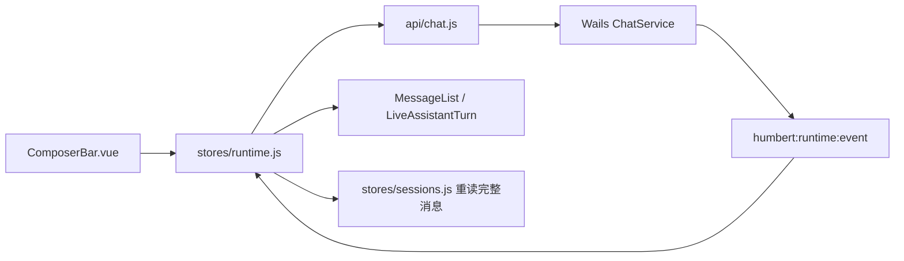

# 前端：Vue、Pinia 与 Wails 桥接

[架构手册](../../docs/architecture/README.md) · [Services](../../internal/services/README.md)

`main.js` 初始化应用；`layouts/AppShell.vue` 组织导航、聊天和右侧文件面板。`api/*.js` 封装 Wails `Call.ByName`；`stores/*.js` 管界面选择、数据加载与实时状态；`components/chat/`、`components/workspace/` 展示会话、审批、工具轨迹和工作区。后端 `services` 暴露稳定 DTO，前端不能自行重建权限与持久化规则。

发送消息时，`ChatService.StartTurn` 返回启动收据，不等待模型回复。`stores/runtime.js` 订阅 Wails 事件并按 Session/Request 关联 delta、审批和终态；终态从 Session API 重读完整消息，避免把事件流当数据库。`stores/sessions.js` 管会话列表和分页；`stores/agents.js` 管当前 Agent；`stores/workspace.js` 跟随 Agent 更新文件树与预览。

| 目录 | 阅读入口 |
| --- | --- |
| `api/` | 后端服务名称、参数和错误映射。 |
| `stores/runtime.js` | 异步 Turn、事件竞态、取消与审批。 |
| `stores/sessions.js` | 会话加载、消息页和搜索跳转。 |
| `components/chat/` | 输入、Markdown、附件、工具轨迹与审批卡。 |
| `components/workspace/` | 文件目录树与内容预览。 |
| `utils/toolProtocol.js`、`utils/toolTrace.js`、`utils/toolEffects.js` | 将持久化工具事务投影成界面展示。 |

调试 UI 与磁盘不一致时，先确认 `api` 返回与 Wails 事件，再确认 Session API 返回的完整消息；不要直接从当前组件 DOM 推断后端事实。
