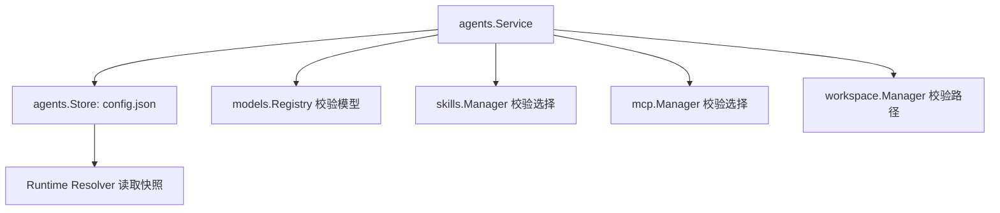

# Agents：个人助理配置聚合

[总目录](../../docs/architecture/README.md) · [Model](../models/README.md) · [Sessions](../sessions/README.md)

Agent Profile 是顶层配置聚合，保存名称、指令、模型角色、工具/Skill/MCP 选择、Sandbox 覆盖和 Workspace 模式。`Store` 写 `agents/<agent-id>/config.json`；`Service` 校验引用并提供窄更新命令。Session 创建时冻结当时的 Workspace CWD；更换 Agent 工作区只影响之后的 Session/Turn。

`UpdateProfile`、`SetModel`、`SetModelRoles`、`SetSkills`、`UpdateSecurity` 分别处理一个配置面，避免旧页面快照覆盖无关字段。`normalizeInput` 校验名称/指令、模型、工具、Skill、MCP 与 Sandbox。Agent 删除使用 `active → deleting → removed` 的持久化状态：开始删除后从列表隐藏，启动时 `RecoverDeletions` 继续清理未完成状态。Managed Workspace 由应用拥有并可随 Agent 删除；Custom Workspace 是用户目录，只解除引用。

| 文件 | 代码入口 |
| --- | --- |
| `types.go` | Agent/Profile/ModelRoles/DeletionState。 |
| `service.go` | `Create`、窄更新命令、`Delete`、`RecoverDeletions`、能力选择校验。 |
| `store.go` | 配置持久化、删除标记、目录安全校验。 |

调试配置为何未进入当前 Turn：先看 `AgentInfo`，再看 `Resolver.resolveContextBase` 生成的 Snapshot/Manifest。已启动的 Turn 不会重新读取配置。删除问题需检查持久化删除标记和关联 Session/Task/Managed Workspace 清理阶段。
