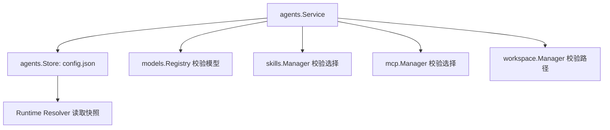

# Agents：个人助理配置聚合

[总目录](../../docs/项目源码详解.md) · [Model](../models/README.md) · [Sessions](../sessions/README.md)

Agent Profile 是顶层配置聚合，保存名称、指令、模型角色、工具/Skill/MCP 选择、Sandbox 覆盖和 Workspace 模式。`Store` 写 `agents/<agent-id>/config.json`；`Service` 校验引用并提供窄更新命令。Session 创建时冻结当时的 Workspace CWD；更换 Agent 工作区只影响之后的 Session/Turn。

```mermaid
flowchart TD
  A[agents.Service] --> S[agents.Store: config.json]
  A --> M[models.Registry 校验模型]
  A --> K[skills.Manager 校验选择]
  A --> C[mcp.Manager 校验选择]
  A --> W[workspace.Manager 校验路径]
  S --> R[Runtime Resolver 读取快照]
```

`UpdateProfile`、`SetModel`、`SetModelRoles`、`SetSkills`、`UpdateSecurity` 分别处理一个配置面，避免旧页面快照覆盖无关字段。完整表单的 `Update` 仍保留协议中的可选字段：未提交的字段在 `Store.Mutate` 锁内读取并保留最新值，不能从调用前的旧快照复制回来。

`validation.go` 集中保存规则：`normalizeProfile` 供创建、完整更新和身份局部更新共用，名称去除首尾空白后最多 100 个 Unicode 字符，指令最多 64 KiB，头像交给 `avatar.NormalizeDataURL` 校验真实图片。`normalizeInput` 只处理字段，不访问工作区；模型、Skill/MCP 引用和 Sandbox 路径分别由对应校验函数处理。指定模型必须存在且启用，未指定模型可以保存，Utility 留空由 Runtime 回退 Chat。

内置工具的 `nil` 表示继承默认选择，非 nil 的空集合表示明确禁用全部普通工具；校验与复制都保留这个区别。Sandbox 的空策略字段也保留继承语义，不在保存时固化应用默认值。额外写目录先做真实路径规范化，再按平台去重；内置工具只在本领域检查名称格式，工具是否存在由桥接服务使用 Runtime Registry 检查。

创建流程先做字段与引用校验，再通过调用方 Context 执行 `Workspace.Validate`，保存 Profile 后执行 `Workspace.Resolve` 准备目录。两次目录操作分别用于保存前检查和保存后准备，归一化阶段没有额外的后台目录访问。准备失败使用独立的三秒 Context 补偿删除，避免原请求已经取消而留下半成品。更新先准备新目录，再在锁内提交新引用，不移动或删除旧工作区文件。`logProfileChange` 统一完整保存的审计字段，不记录指令、头像或凭证正文。

Agent 删除使用 `active → deleting → removed` 的持久化状态：开始删除后从列表隐藏，启动时 `RecoverDeletions` 继续清理未完成状态。Managed Workspace 由应用拥有并可随 Agent 删除；Custom Workspace 是用户目录，只解除引用。`WithActiveAgent` 在读取与创建依赖资源的整个回调期间持有生命周期读锁，删除持有写锁，防止删除快照之后又创建孤儿 Session。

| 文件 | 代码入口 |
| --- | --- |
| `types.go` | Agent/Profile/ModelRoles/DeletionState。 |
| `service.go` | 配置读写流程、窄更新命令、生命周期互斥、删除恢复与审计日志。 |
| `validation.go` | 身份/指令、工作区字段、模型角色、能力选择及 Sandbox 的共同保存规则。 |
| `store.go` | 配置持久化、删除标记、目录安全校验。 |

调试配置为何未进入当前 Turn：先看 `AgentInfo`，再看 `Resolver.resolveContextBase` 生成的 Snapshot/Manifest。已启动的 Turn 不会重新读取配置。删除问题需检查持久化删除标记和关联 Session/Task/Managed Workspace 清理阶段。

回归测试见 [service_contract_test.go](service_contract_test.go)：验证所有身份写入入口使用一致限制、失败不改变已有配置、窄命令保留无关字段，以及并发局部更新不会被完整更新的旧快照覆盖。
