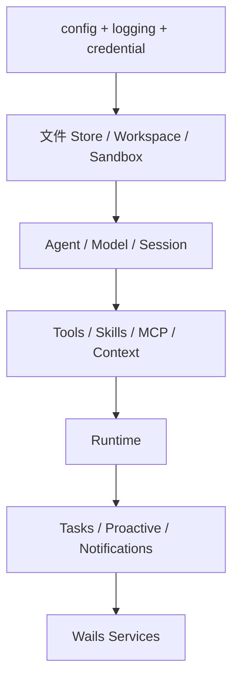

# App：依赖组装与生命周期

[总目录](../../docs/architecture/README.md) · [桌面服务](../services/README.md)

`cmd/desktop/main.go` 在离线备份/恢复后调用 `Bootstrap`。`application.go` 按依赖顺序创建配置、日志、凭据、Transcript、Workspace、Sandbox、Permission、模型、Agent、Session、Context、Runtime、Task、Proactive、搜索等组件；`tools.go` 统一注册内置与协作工具；`runtime_event_reporter.go` 把运行事件发布到 EventBus。`Application` 的 getter 供 Wails Service 使用，`Shutdown` 负责反向收敛。

Bootstrap 中先恢复 Agent 删除、隔离损坏 Session，然后再启动会发起运行的管理器，避免后台任务在基础数据未就绪时启动。初始化失败的资源由延迟清理关闭，成功后归 Application 所有。更改依赖时需要同时检查启动顺序、错误回滚和 `Shutdown`；不要在 `services` 里私建第二套 Runtime。

阅读顺序：`cmd/desktop/main.go` → `application.go:Bootstrap` → `tools.go:buildToolRegistry` → `application.go:Shutdown`。断点用组件构造失败处定位启动问题，运行时问题应进入对应领域包。
