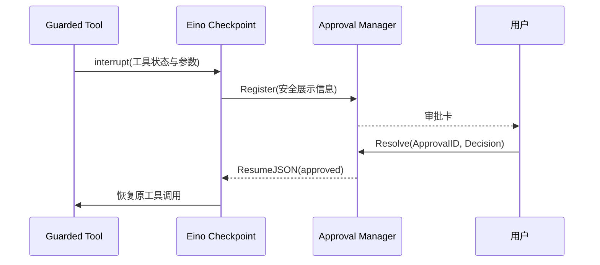

# Approval：人类审批与 Eino 中断恢复

[总目录](../../docs/architecture/README.md) · [Permission](../permission/README.md) · [Runtime](../runtime/README.md)

## 一次 Ask 的生命周期

工具包装器在 Permission 返回 Ask 时生成 Eino interrupt；`Manager.Register` 保存待处理请求，Runtime 持有本轮 checkpoint 和 Session 占用。界面提交 ApprovalID 与 Decision；`Resolve` 校验并为一次允许或规则授权产生恢复数据。`Executor.Resume` 用原来的 checkpoint、interruptID 与 `ResumeJSON` 继续。若超时，`Expire` 走拒绝分支；完成/取消后 `Complete`、`Cancel`、`Forget` 清理状态。

`checkpoint_store.go` 是进程内的 Eino CheckPointStore。应用重启后不会自动重放未完成工具调用，以免重复外部副作用。`codec.go` 把中断信息、工具状态和批准布尔值转换成 Eino 可恢复的数据；前端不重新传原始参数。审批等待期间 Runtime 的活动运行不能释放。

| 文件 | 阅读入口 |
| --- | --- |
| `manager.go` | `Register`、`Resolve`、`Expire` 和状态清理。 |
| `types.go` | `Request`、`Decision`、`Resolution`。 |
| `codec.go` | `EncodeInterrupt`、`EncodeResumeData`，查看恢复协议。 |
| `checkpoint_store.go` | checkpoint 的获取、保存与删除。 |

排查审批卡卡住时同时检查 `approval.Request.ID`、Eino `interruptID`、Runtime `RequestID` 与 Session reservation；四者用途不同。
