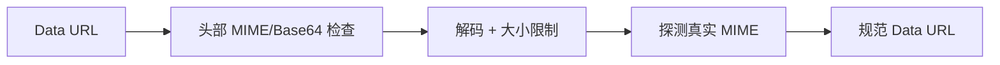

# Avatar：头像 Data URL 校验

[总目录](../../docs/architecture/README.md) · [Preferences](../preferences/README.md) · [Agents](../agents/README.md)

`NormalizeDataURL` 接受空值（清除头像）或 Base64 Data URL，仅允许 PNG、JPEG、GIF、WebP；解码后限制 2 MiB，使用 `http.DetectContentType` 验证真实内容类型，再重新编码为规范 Data URL。SVG 被排除，因为头像会进入有权限的桌面 WebView，主动标记不可作为安全图片渲染。

本包仅 `avatar.go`。修改头像支持格式时，同时考虑前端渲染、真实 MIME 检测与体积上限；不能只改扩展名白名单。
