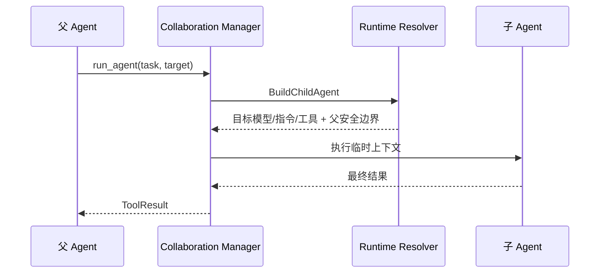

# Collaboration：把 Agent 作为工具调用

[总目录](../../docs/architecture/README.md) · [Agents](../agents/README.md) · [Runtime](../runtime/README.md)

`list_agents` 只列出允许被调用的 Agent；`run_agent` 把一个自包含任务交给目标 Agent，在父 Turn 内同步等待。`Manager.RunAgent` 校验目标，调用 `AgentBuilder`（由 Runtime Resolver 实现）构建子运行，并把最终文本结果作为父工具结果返回。子运行不创建侧栏 Session，也不是后台 Task；父 Session 自然保留这次 ToolCall 与 ToolResult。

目标使用自己的模型、指令和允许工具，但工作区、Sandbox、网络与审批继承父运行；子工具集合排除递归 `run_agent` 及读取父会话等高权限内部工具。`stableRunID` 从父 RequestID 和 ToolCallID 生成稳定身份；`Store` 在父 Session 的 `subagents/` 写轻量审计。父 Turn 结束由 `ParentRunFinished` 收敛未完成子运行。审计不是新的消息事实来源。

读 `types.go` 的 Builder/Input 契约，再读 `manager.go` 的 `RunAgent`，最后到 `runtime/resolver.go` 的 `BuildChildAgent` 看实际模型和安全边界。调试需要同时记录父 ToolCallID 与子 RunID。
