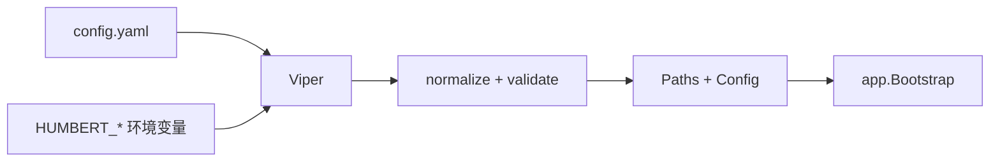

# Config：启动配置、路径与热更新写入

[总目录](../../docs/architecture/README.md) · [App](../app/README.md)

`Load` 用 Viper 读取 `~/.humbert-agent/config.yaml`，设置默认值并解析受控数据目录；缺失时生成默认配置和目录。`HUMBERT_*` 环境变量可覆盖启动选项。`Config` 包含 Runtime、Context、MCP、Skills、Logging、Security 与工具参数；Provider/Model、Agent、Task 等动态状态各在对应 Store，不要全部塞进 YAML。

`configwrite.go` 将权限和 Sandbox 相关设置的修改写回配置；`permission.go`、`sandbox.go`、`tools.go` 提供各域校验与默认值。`resolvePaths` 与 `ensureLayout` 将所有核心数据集中在受控根目录，并设置私有目录权限。配置写入要保持用户文件可解析；更改字段后要考虑旧版默认值和配置迁移。

阅读 `config.go:Load` → `loadFromHome` → `resolvePaths` → `normalize/validate`，再按设置类型看 `SavePermissionConfig` 或 `SaveSandboxAndShellConfig`。UI 上的动态 Provider 设置请去 `models` 包追踪。
