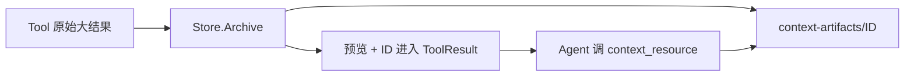

# ContextArtifact：大工具结果按需回查

[总目录](../../docs/architecture/README.md) · [工具](../tools/README.md) · [会话](../sessions/README.md)

工具结果过大时，`GuardInvokableTool` 可以把全文交给 `Store.Archive`，在 `session/context-artifacts/` 保存带 ID 的原件，返回较短预览及回查提示。`context_resource` 工具通过 `ReadContextArtifact` 受控读取，再按 offset/limit 分段返回。这样模型上下文不被一次大结果占满，也不丢失完整内容。

`Store` 通过 SessionDirectoryResolver 找目录，不接受模型任意指定绝对路径；`Read` 校验 Artifact ID 和归属。这个 sidecar 是工具结果的辅助原件，Session JSONL 保留可见事务和回查引用。读 `store.go` 的 `Archive`、`Read`、`path` 与 `ReadContextArtifact`；排查缺失内容时先从 ToolResult 中取 ID，再在同一 Session 下查 sidecar。
