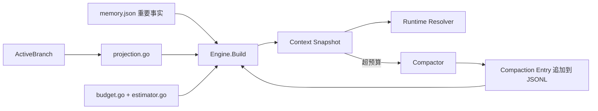
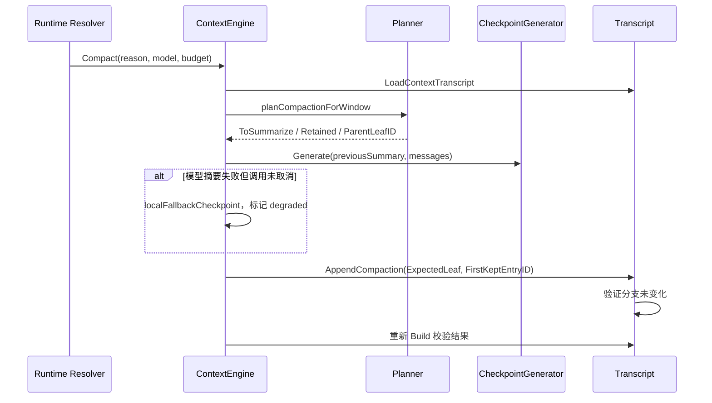

# ContextEngine：模型窗口、消息投影与压缩

[总目录](../../docs/architecture/README.md) · [Transcript](../transcript/README.md) · [Memory](../memory/README.md) · [Runtime](../runtime/README.md)

## 为什么单独有这个包

Transcript 保存完整事实；模型只能接收预算内的当前上下文。`Engine.Build` 读取当前 ActiveBranch，计算固定开销与历史预算，产生本轮可发送的 Eino 消息和 Usage。它不改写原始消息。`Engine.Compact` 在达到阈值或用户手动要求时追加一个检查点，旧历史仍在 JSONL，可用 `session_history` 回查。



## Build 的精确顺序

1. `CalculateBudget` 以模型 `ContextWindow`、最大输出 Token 和配置安全阈值计算上限。
2. `LoadContextTranscript` 读取当前分支；大文件正常只解码最新压缩窗口。`projectActiveBranch` 找当前分支最后一个有效 Compaction Entry，把摘要变成带来源提示的参考消息，再从 `firstKeptEntryId` 恢复原始消息。
3. 历史 thinking 的 Auto 策略只保留当前用户轮次后的推理；已完成旧轮次的 thinking 不重复发给模型。工具调用和结果保留事务关系。超长的旧工具结果会替换成带 `entry_id` 的回查提示，原文仍在 JSONL；中断但没有结果的调用被标记为未知，不伪造成功。
4. `Memory.ContextFacts` 只提供经过 lineage 校验的“重要事实”；`Engine` 估算 System、Tool Schema、Memory、Checkpoint、Recent Messages 等用量。固定开销先从预算扣除，再决定最近历史可保留多少。
5. `Resolver` 根据 Usage 决定是否在首次模型调用前压缩；MidRun middleware 在 Eino 多轮工具循环中继续守住窗口。

## 压缩是 Prepare → Generate → Commit



`planner.go` 按 Token 预算选择切点，并避免把 ToolCall 与 ToolResult 拆开；`checkpoint_generator.go` 分段处理长来源并压缩摘要长度；`serializer.go` 限制工具参数和不可信内容；`compactor.go` 统一超时、模型失败兜底和提交。若摘要期间分支变动，Store 返回 stale 错误，不能把旧摘要提交到新分支。应急检查点标记 degraded，之后可从原始历史修复。只摘要近期文本无法解决 System/Tool/Memory 本身过大的问题，所以有固定上下文预算错误。

## 关键文件与读法

| 文件 | 从哪里看 |
| --- | --- |
| `types.go`、`budget.go` | `BuildRequest`、`Snapshot`、`Budget`、阈值。 |
| `engine.go` | `Build`、`buildFromDocument`，看预算项如何进入最终消息。 |
| `projection.go` | `projectActiveBranch`，看压缩切点、thinking、工具结果的模型可见形式。 |
| `planner.go`、`compactor.go` | `planCompactionForWindow`、`Compact`，看规划与提交分离。 |
| `checkpoint_generator.go`、`serializer.go` | 摘要模型输入如何分段、限制和清洗。 |
| `middleware.go`、`retained_state.go` | 本轮多次模型调用时的上下文保护与保留状态。 |

建议用同一个 Session 比较 `session.jsonl` 原始 Entry、`LoadContextTranscript` 的分支、`Engine.Build().Messages` 的最终序列。日志 `operation=context.build` 给出缓存命中、读取字节数和估算 Token；不要按 JSONL 最末尾几行猜测模型实际输入。

## 具体消息序列示例

假设当前分支已经有检查点 `C`，它的 `firstKeptEntryId` 指向用户消息 `U8`，后面还有助手回复 `A8` 与最新问题 `U9`。本轮模型输入大致是：

```text
SystemInstruction
+ 本轮 Skill / MCP 使用说明
+ 会话 Memory 的“重要事实”（游标属于当前分支时）
+ C 的摘要参考消息
+ U8, A8, U9 的投影
```

更早的 `U1..U7` 依然在 JSONL，但不会再次直接发给模型。若 `A8` 有工具调用与结果，它们仍作为同一事务进入投影；如果只有调用没有结果，投影会显式标注未知结果。`U8` 之前的 thinking 在 Auto 模式被省略。界面可以展示完整持久化历史，所以“界面可见”与“模型输入”必须区分。

`Engine.Build` 返回的 Usage 不只是历史 Token：System、工具定义、Memory、参考消息、Checkpoint 和最近消息分别计数。调试超限时先看哪个固定项变大；若固定项已经贴近硬线，`Compact` 会返回 `FixedContextBudgetError`，继续摘要旧消息无法解决。自动压缩的切点由 Planner 根据可保留 Token 和工具事务边界决定，不是简单取最近 N 条。

### 常见修改点

- 改 thinking 回放：看 `reasoningPolicyForIndex`，并同时检查压缩序列化是否仍排除历史 thinking。
- 改工具结果长度：看 `limitWindowToolResults`、`ToolResultWindowChars` 和工具端 `ResultBudget`，避免只改其中一侧。
- 改压缩阈值：看 `CalculateBudget` 与 `ResolveBudgetForFixedContext`；用现有 Budget/Compaction 测试覆盖小窗口和大窗口。
- 改摘要提示词：看 `checkpoint_generator.go`、`serializer.go`，确保网页/文件/工具内容始终作为待摘要资料，而不是可执行指令。
