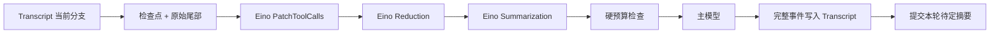

# ContextEngine：模型窗口与 Eino 摘要适配

[总目录](../../docs/architecture/README.md) · [本次重构](../../docs/architecture/eino-integration.md) · [Runtime](../runtime/README.md)

`Transcript` 保存原始消息事实，`Engine.Build` 只构造模型可见窗口和预算。自动压缩与手动压缩共用 Eino `summarization.TypedMiddleware.Summarize`，不再维护独立 Planner、分块摘要、应急摘要、摘要修复或自动 Session Memory。

```mermaid
flowchart LR
  T[Transcript 当前分支] --> P[检查点 + 原始尾部]
  P --> PATCH[Eino PatchToolCalls]
  PATCH --> R[Eino Reduction]
  R --> S[Eino Summarization]
  S --> G[硬预算检查]
  G --> M[主模型]
  M --> RAW[完整事件写入 Transcript]
  RAW --> COMMIT[提交本轮待定摘要]
```

## 模型调用前

1. `projection.go` 恢复最近检查点与原始消息尾部，应用 Provider 的 reasoning 回放策略。中断后缺少的工具结果由 Eino PatchToolCalls 标记为“未知”，不当成成功，也不自动重放副作用。
2. `budget.go` 扣除系统指令、工具定义与输出预留，计算历史窗口、摘要预算和软硬阈值。运行中使用实际 `ToolInfos`，包含 Skill 和 MCP。
3. `tools/reduction.go` 优先将较旧的工具结果归档，保留最近两个工具调用轮次；归档资源通过 `context_resource` 回查。
4. `middleware.go` 在软阈值触发原生 Summarization。切点保持完整 ToolCall/ToolResult 事务；长工具循环中被跨过的当前用户请求保留原文，已加载的 Skill 主定义独立保留。同名 Skill 的参考文件不能覆盖主定义。
5. 摘要失败保留原窗口；如果仍超过硬阈值则明确停止，不发送已知超限的请求。摘要输入超出辅助模型窗口也明确拒绝，不递归生成多个摘要。Utility 应选用足够的上下文窗口，未配置时回退 Chat。

## 提交与恢复

摘要回调只保存待提交内容，不立即操作历史文件。`Runtime.MaintainAfterTurn` 在事件消费者写完原始消息后调用 `Commit`，不再次请求模型。`compactor.go` 通过 EntryID 或唯一 ToolCallID 定位保留边界，使用 `ExpectedLeafID` 防止写入提交时发生变化的分支。

手动压缩在会话 reservation 内读取稳定窗口，再调用相同的 `Summarize + Commit`。取消或失败时原始历史仍在；尚未提交的摘要可以在下一轮重新生成。个人偏好仍由用户显式保存到 `preferences`，不属于自动会话摘要。

| 文件 | 职责 |
| --- | --- |
| `engine.go` | 读取分支、估算预算、创建摘要适配器 |
| `projection.go` | 检查点投影、reasoning 策略、缺失工具结果修补 |
| `middleware.go` | Eino Summarization、事务切点、当前请求和 Skill 保留、硬阈值 |
| `compactor.go` | 手动入口、摘要提交、分支一致性 |
| `summary_input.go`、`serializer.go` | 摘要模型的纯文本输入与工具参数脱敏 |
| `estimator.go`、`budget.go` | Token 估算、真实 usage 校准、固定开销预算 |

Usage 是本地估算。校准使用中间件处理后的首次模型输入，不再拿压缩前的估算与压缩后的 Provider usage 比较。
