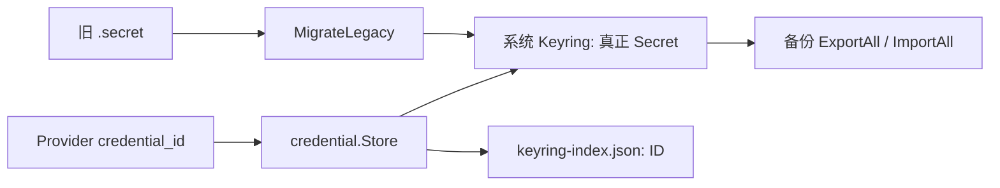

# Credential：模型和备份密钥的存取边界

[总目录](../../docs/architecture/README.md) · [Models](../models/README.md) · [备份](../databackup/README.md)

桌面生产入口 `NewSystem` 使用系统凭据库，Provider JSON 仅保存 `credential_id`。`secrets/keyring-index.json` 保存可枚举 ID，供加密备份导出；API Key 值不进入普通配置。`New` 保留旧文件存储以兼容迁移和测试，不能在系统凭据库不可用时悄悄回退明文。

`Store.Put/Get/Delete` 验证 ID 和受控路径；`system.go` 的 `putSystem/getSystem` 保持 Keyring 与索引一致，失败时回滚；初始化会迁移旧 `.secret`。`vault.go` 为待执行加密备份的口令提供独立保管接口。密钥值绝不能写日志，备份归档必须加密。

读 `NewSystem`、`MigrateLegacy`、`putSystem`、`ExportAll`。排查连接失败时先确认 Provider 的 CredentialID，再看 Keyring 是否能读取；不要通过打印 Secret 来诊断。
