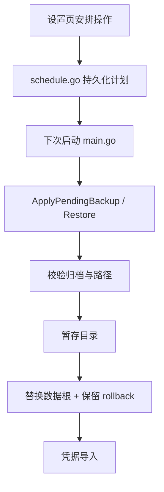

# DataBackup：离线归档、验证与恢复

[总目录](../../docs/architecture/README.md) · [Credential](../credential/README.md)

`cmd/data` 是离线 CLI。`archive.go` 生成带清单的 ZIP、验证文件与路径、分阶段恢复并保留原目录回退副本；`encrypted.go` 以口令加密归档，备份时可纳入从系统凭据库导出的密钥，恢复后通过 Importer 回写。`schedule.go` 让桌面 UI 先记录“待备份/待恢复计划”，应用下次完整启动前执行，避免对正在运行的 Store 热替换。

`safeArchivePath` 与 `within` 防止归档路径逃逸；恢复先验证、再切换根目录，失败时按阶段清理或回滚。用户自定义 Workspace 在数据根目录之外，不能假设备份包含它。备份口令必须来自安全 Vault，不放在普通配置或日志中。

从 `cmd/data/main.go` 的命令分派或 `cmd/desktop/main.go` 的启动前计划进入，再读 `CreateEncrypted`/`RestoreEncryptedAndImport`、`inspectReader` 与 `ApplyPendingRestore`。测试要覆盖错误口令、损坏归档、路径穿越和恢复中断。
