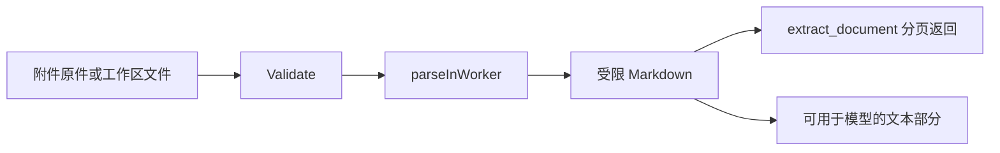

# DocumentText：文档到 Markdown 的受限解析

[总目录](../../docs/architecture/README.md) · [会话附件](../sessions/README.md) · [内置工具](../tools/builtin/README.md)

`MIMEForName` 根据扩展名判定可支持类型；`Validate` 在写入附件前做格式/大小检查；`Extract` 把 PDF、DOCX、XLSX、PPTX 的可提取内容变成 Markdown。解析在受控 Worker 中进行，`boundedWriter` 截断过大的输出；Office ZIP 先经 `preflightOffice` 检查。不能解析的扫描 PDF 不会凭空产生 OCR 文本。

`Extract` 返回 Markdown 和识别后的 MIME；具体调用者决定如何分段。会话输入由 `sessions/attachments.go` 调它提取文本；Agent 按需读取走 `tools/builtin/extract_document.go`，按附件 ID 或允许路径检索并用 offset/limit 返回。整个附件不应在每个 Turn 重复塞入模型。

本包只有 `extract.go`，从 `Validate` → `Extract` → `parseInWorker` 阅读。测试 `extract_test.go` 覆盖正常 DOCX 和无效 PDF；调整解析器时还需验证限额、嵌套 ZIP 与损坏文档不会挂住应用。
