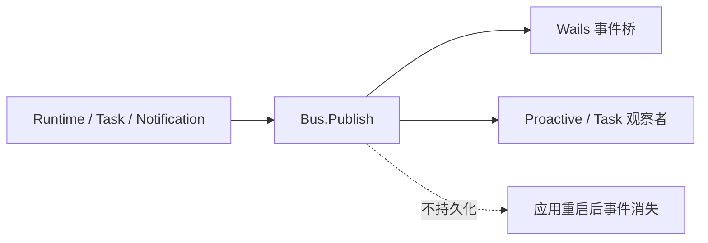

# EventBus：进程内同步事件分发

[总目录](../../docs/architecture/README.md) · [Runtime](../runtime/README.md)

`Bus.Subscribe(topic, handler)` 注册处理器并返回可重复调用的取消函数；`Publish` 同步调用当前订阅者；`Close` 停止后续订阅/发布。Bus 本身不创建 goroutine，也不保存事件。Runtime delta、Task 状态和通知都可通过它到达 Wails Service，但 UI 重启后必须从 Store 重读事实。

`handlers` 受 RWMutex 保护，订阅 ID 用原子计数；`Subscribe` 返回的取消函数使用 `sync.Once`。如果业务需要异步处理，必须由领域 Service 创建受 Context 管理的 Worker，不能把无限制 goroutine 藏在 EventBus。读 `bus.go` 的 `Subscribe`、`Publish`、`Close`，排查事件丢失时先确认订阅建立时间与持久化终态。
