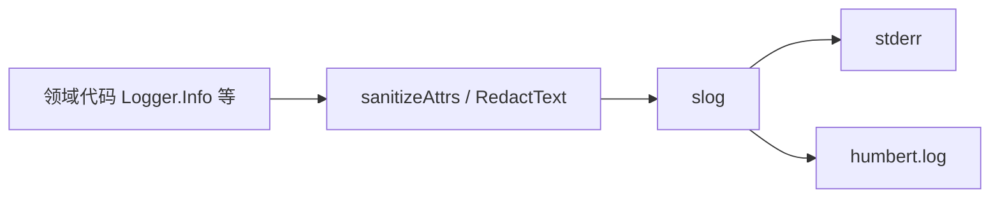

# Logging：结构化日志与脱敏

[总目录](../../docs/architecture/README.md) · [App](../app/README.md)

`NewBootstrap` 在配置加载前向 stderr 记启动错误；`New` 建立正式 `slog`，同时写 stderr 和 `logs/humbert.log`。`Debug/Info/Warn/Error` 附带操作名、SessionID、RequestID、TaskID 等结构化字段。字符串与 error 在进入 handler 前经 `RedactText` 处理，`SafeErrorText` 为界面和日志提供限长的错误摘要。

日志不是消息事实来源；完整工具参数、API Key、文档正文不应写入日志。`Close` 用 `sync.Once` 关闭文件。排查一次 Turn 时以相同 RequestID/SessionID 搜索操作事件，再到 JSONL 看最终事实。读 `logger.go` 的 `New`、`sanitizeAttrs`、`RedactText` 与 `Close`。
