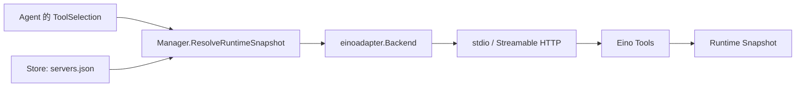
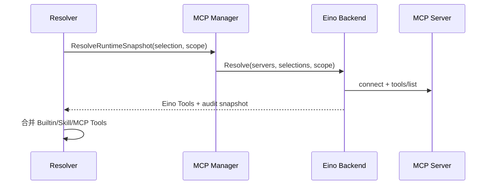

# MCP：外部工具的配置与运行快照

[总目录](../../docs/architecture/README.md) · [Eino 适配](einoadapter/README.md) · [工具](../tools/README.md)

## 控制面与运行面

`Store` 把 Server 配置保存在 `mcp/servers.json`，包括 stdio/Streamable HTTP 传输、启用状态、工具风险覆盖等；敏感凭据由凭据库提供。`Manager` 负责 CRUD、工具发现、选择校验、缓存和修订号。`einoadapter.Backend` 才负责真实连接与 Eino Tool 构造。Agent Profile 保存选中的 Server/Tool；本轮 `Resolver` 将其解析成 `RuntimeSnapshot`。

`DiscoverToolsFresh` 可以绕过 Catalog TTL 真正执行 `tools/list`；普通发现可根据 `ServerFingerprint` 和时间复用缓存。`NormalizeAndValidateSelection` 确认所选工具仍存在并可用。`NameExposedTool` 给模型稳定、避免冲突的工具名，原始远端工具名仍用于真正调用。`ToolRisk` 结合默认值和用户覆盖值；最终执行还要经过 Permission 和 Sandbox。

运行快照有严格与可用性投影等路径，见 `ResolveRuntimeSnapshot`、`ResolveRuntimeSnapshotAvailable`、`ResolveRuntimeSnapshotBestEffort`。连接失败不能伪装成工具已执行；快照保留可展示的 Server 状态，Runtime 可提示当前不可用的连接。修改 Server 配置会增加 revision、清理对应 Catalog/运行连接，之后的 Turn 才看到新选择。

## 一次调用怎么追

| 文件 | 代码要点 |
| --- | --- |
| `types.go` | Server、Transport、ToolSelection、RuntimeSnapshot 验证。 |
| `store.go` | 严格加载/保存服务器配置。 |
| `manager.go` | 发现缓存、选择校验、Revision、快照生成与失效。 |
| `naming.go`、`fingerprint.go`、`catalog.go` | 工具名、配置身份与工具目录。 |
| `einoadapter/` | 连接池、传输安全、凭据与工具适配。 |

排查“设置页能看到工具但模型不能调用”时，依次看 Agent 的选择、Server Enabled、Catalog、Snapshot 的 `ToolNames`、模型工具能力、Permission 和真实连接状态。

## 配置、发现和调用为何分开

`Server` 配置是低频控制面。设置页的 `DiscoverToolsFresh` 可以临时连接并读取目录，但这不代表某个 Agent 本轮已选择该工具。Agent 的 `ToolSelection` 经 `NormalizeAndValidateSelection` 约束后，Runtime 才调用 `ResolveRuntimeSnapshot`。后端通过 Fingerprint 检测 URL、命令、环境/凭据等配置变化，并使旧目录和连接失效。

例如远程 Server 暴露 `search`，模型可见名由 `NameExposedTool` 生成；调用时 Adapter 仍使用原始 `search`。如果另一 Server 也暴露 `search`，模型可见名必须保持唯一。工具的风险可以在 Server 上逐项覆盖，调用仍由 `GuardInvokableTool` 审批。Streamable HTTP 禁止网络时，快照解析阶段就拒绝或明确记录不可用状态，不能等工具调用时才隐式连接。

排查顺序建议为：`Store.Get(ServerID)` → `DiscoverToolsFresh` → Agent Profile 选择 → `ResolveRuntimeSnapshot` → `Backend.Resolve` → `Adapter.BuildTools` → Guard/Permission → 远端响应。断开连接或改配置后，先确认 Revision/Fingerprint 变化，再看 SessionPool 是否使用新会话。
