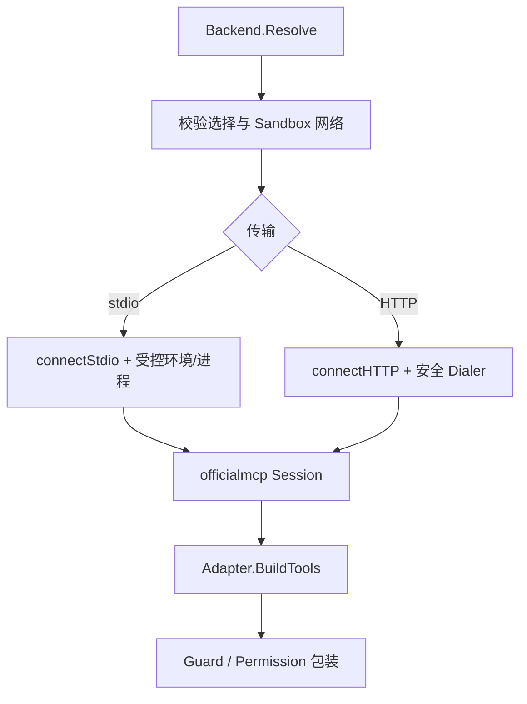

# MCP Eino Adapter：连接池与传输安全

[总目录](../../../docs/architecture/README.md) · [MCP 管理](../README.md)

## 运行链路

`Backend.Resolve` 接收本轮 Server/Tool 选择和工具 Scope，按 Server 配置与 Sandbox Policy 取得会话，再由 `Adapter.BuildTools` 调 Eino-Ext officialmcp 将远端 schema 转为 Eino Tool。`Backend` 持有 SessionPool，缓存键包括 Server Fingerprint 和策略身份；配置或策略改变必须建立新会话。`connectionAttempt` 合并并发连接，失败记录退避与运行状态，避免每个 Turn 同时重连。

stdio 连接由 `stdio_environment.go` 构造受限环境，并通过 Sandbox 准备外部命令；不能直接继承整个用户 shell 环境。HTTP 连接由 `http_transport.go` 校验 endpoint、DNS/IP、重定向和请求头注入范围，网络是否允许先看有效 Sandbox Policy。凭据头由 CredentialReader 读取并只用于对应连接。连接错误使 Session 失效；普通工具业务错误不会无条件销毁连接。

| 文件 | 关键函数 |
| --- | --- |
| `backend.go` | `Resolve`、`sessionWithPolicy`、`connectStdio`、`connectHTTP`、`invalidateSession`。 |
| `adapter.go` | `BuildTools`、`DiscoverTools`，转 Eino schema 并包装调用。 |
| `http_transport.go` | 目标地址、实际拨号 IP 和凭据头的边界。 |
| `stdio_environment.go` | 环境变量白名单、命令路径与隔离默认值。 |
| `stdio_diagnostics.go` | stdio 启动失败诊断。 |

调试连接问题时用 `Server.ID`、Fingerprint、PolicyKey 对齐 SessionPool；先 `TestConnection` 观察 `tools/list`，再看具体 Tool 调用。外部 Server 的内容和描述属于不可信数据，不能把它当应用指令。
