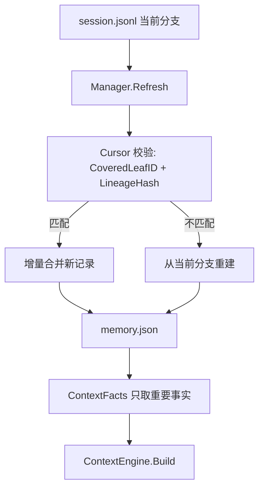
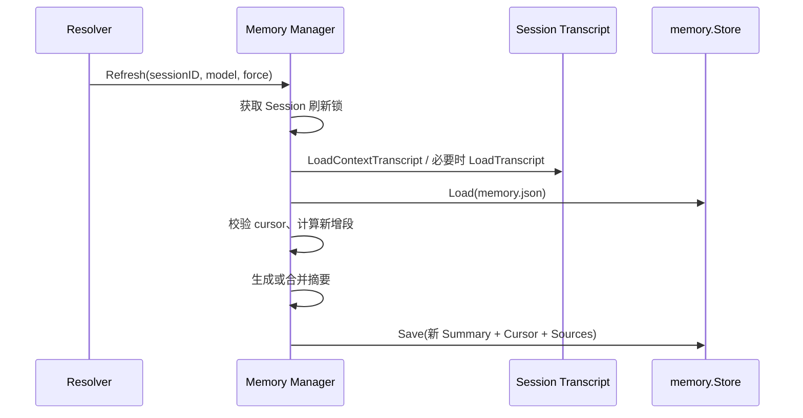

# Memory：可重建的会话记忆

[总目录](../../docs/architecture/README.md) · [Context](../contextengine/README.md) · [Transcript](../transcript/README.md)

## 数据与用途

`memory.json` 是每个 Session 的派生参考状态，消息事实仍在 `session.jsonl`。`Document.Summary` 固定分成“重要事实”和“事情经过”：普通聊天 Context 只注入前者，后者留在 sidecar 供以后增量合并。`Artifacts` 确定性记录读过/修改过的文件路径，不保存文件正文或密钥。跨会话且经用户确认的个人记忆保存在 `config/personal-memory.json`，由 `preferences` 管；不要与这里的自动 Session Memory 混淆。

## 更新与读取

`Refresh` 为同一 Session 持有覆盖模型调用全过程的锁，防止两个刷新都从相同旧 cursor 出发并互相覆盖。它优先读取 Context 窗口；若 cursor 已落在窗口之外，需要完整历史才能正确增量处理。非强制刷新只在新增 User Turn 或 Token 达阈值时调用模型；强制刷新用于“压缩并更新”等操作。

`Cursor.CoveredLeafID` 记录已经覆盖的节点，`LineageHash` 核对整个前缀。Retry/Fork 后旧 Memory 可能仍在磁盘，但不能注入已放弃分支的事实；`ContextFacts` 先校验 cursor，失败时暂时返回空事实。旧版本或损坏的 sidecar 可重建，不能阻止聊天。序列化新历史时过滤 thinking、限制 Tool 参数/结果并保存来源范围，防止把工具输出当成新的用户指令。

## 代码索引

| 文件 | 关键内容 |
| --- | --- |
| `types.go` | `Cursor`、`Document`、`Artifacts`、`SourceRange`。 |
| `manager.go` | `ContextFacts`、`Refresh`、`prepareAndGenerate`、历史段序列化与重建。 |
| `format.go` | 两段摘要格式校验与清洗。 |
| `store.go` | 经 Session 目录解析器定位、原子保存 `memory.json`。 |

排查“模型记错旧分支”时按 `SessionID` 查看 `memory.json` cursor，和当前 `ActiveBranch` 比较，再看 `ContextFacts` 是否注入。只删除 `memory.json` 可以重建记忆，但会暂时失去该会话的派生事实。

## 为什么必须有 Cursor 与 LineageHash

只记录“已经总结到第 100 条”不足以识别 Retry/Fork：用户重试后也可能有 100 条，但其中一段已换成另一分支。`cursorMatches` 用 `CoveredLeafID` 定位覆盖节点，再用 `LineageHash` 验证从根到该节点的身份链。匹配则只处理 Cursor 之后的新段；不匹配则基于当前分支重建。模型生成的摘要只是一份辅助参考，不能代替这项确定性校验。

`ContextFacts` 不等待刷新成功才让用户聊天：sidecar 缺失、损坏或旧 Cursor 时返回空事实。`Refresh` 则在安全时重建 sidecar。`prepareAndGenerate` 把新段序列化、调用 Memory 模型、规范化“重要事实/事情经过”两节，再保存新 Cursor、SourceRange 与 Artifacts。只有“重要事实”进入普通 Context，SourceRange 给模型提供 `session_history` 回查路径。

调试时不要只比较摘要文字；还要比较 `memory.json.cursor`、`sources`、当前 `Document.Lineage` 和压缩切点。Memory 与 Compaction 都可能提炼旧历史，但用途不同：Memory 提供稳定事实，Compaction 负责窗口压缩。
