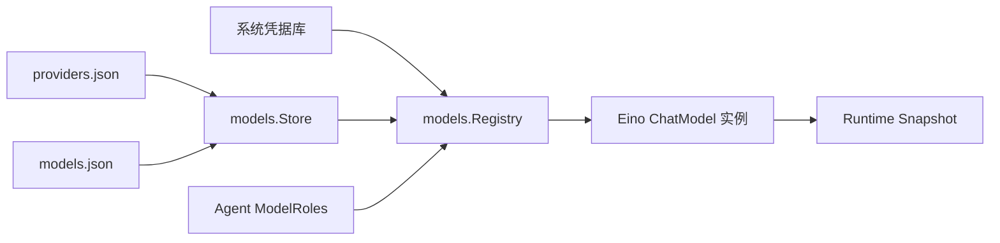

# Models：Provider、模型能力与实例解析

[总目录](../../docs/architecture/README.md) · [Agent](../agents/README.md) · [Runtime](../runtime/README.md)

`Store` 在 `config/providers.json`、`config/models.json` 保存非密钥 Provider/Model 配置；系统凭据由 `credential.Store` 管理。模型记录包含上下文窗口、输出上限和工具/视觉等能力配置。`Registry.Resolve` 根据模型 ID、Provider 配置与凭据构造本轮可用实例；`TestModel` 是显式连接测试。模型角色由 Agent 指定，图片辅助模型由全局 MultimediaConfig 指定。

Registry 在创建/更新/删除时校验引用和能力，避免删掉仍被 Agent 使用的模型；凭据写入失败会回滚相关配置操作。配置变化增加 revision，Resolver 下一个 Turn 才解析新实例。`MultimediaConfig.ImageModelID` 只允许引用具备视觉能力的有效模型；主聊天模型已有视觉能力时不需辅助路由。

| 文件 | 阅读重点 |
| --- | --- |
| `types.go` | Provider、Model、Capabilities、角色/配置的字段与校验。 |
| `store.go` | JSON 控制面、默认值与读写。 |
| `registry.go` | `Resolve`、`TestModel`、引用校验、凭据生命周期。 |
| `factory.go`、`runtime.go` | OpenAI、兼容接口、Ollama 的实际实例构造。 |

排查“模型能连接但不能调用工具”：先核对 Model Capability 与 Agent 角色，再看 Resolver 的 `validateToolCapability`，最后查供应商响应。连接测试只验证对应测试路径，不等于所有能力都可用。
