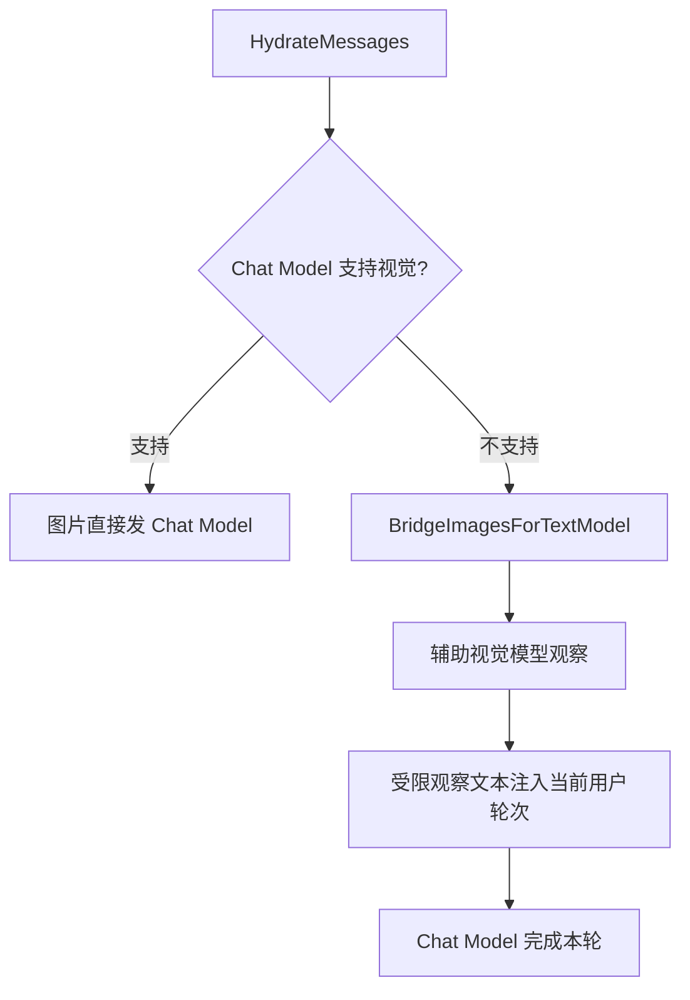

# Multimodal：图片回放与视觉辅助路由

[总目录](../../docs/architecture/README.md) · [会话附件](../sessions/README.md) · [模型](../models/README.md)

会话 JSONL 保存附件引用，Provider 调用前由 Sessions 恢复近期图片。`ImageReplayMask`/`FileReplayMask` 决定哪些历史附件还要传二进制；更老的附件由 `HistoricalImagePlaceholder`/`HistoricalFilePlaceholder` 保留名称与 ID，而不是每轮重复上传。

`BridgeImagesForTextModel` 在主模型不支持图像时调用配置的图片模型，限制观察长度和剩余 Context 预算，移除主模型无法处理的图片二进制，再让主模型继续工具与回答。观察来自模型推断，应作为不可信内容使用。辅助模型调用也计入任务模型调用上限。没有当前需处理图片时不额外调用视觉模型。

读 `replay.go` 看历史附件窗口；读 `vision_bridge.go` 的 `BridgeImagesForTextModel`、`buildVisionRequestParts` 和 `appendTextToUserMessage` 看降级路径；最后在 `runtime/resolver.go` 找调用点。
