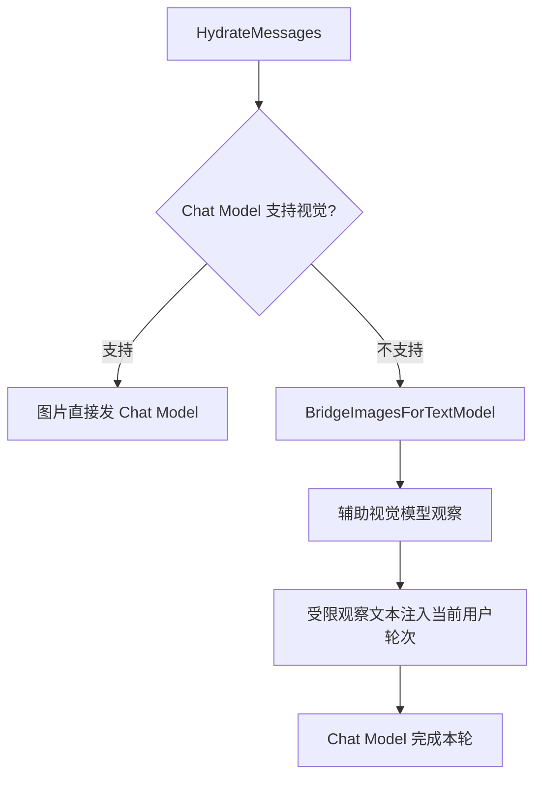

# Multimodal：图片回放与视觉辅助路由

[总目录](../../docs/项目源码详解.md) · [会话附件](../sessions/README.md) · [模型](../models/README.md)

会话 JSONL 保存附件引用，Provider 调用前由 Sessions 恢复近期图片和文本。`AttachmentReplayMask` 统一决定图片二进制、文本附件正文是否仍需完整回放；更老的附件由 `HistoricalImagePlaceholder`/`HistoricalFilePlaceholder` 保留名称与 ID，而不是每轮重复上传。

窗口从后向前按 User Message 计数，保留最新用户输入和紧邻的一次用户输入。纯文本追问也推进窗口；Assistant、Tool 和 nil 不计数。Sessions 水合、ContextEstimator 估算和 Runtime 模型能力判断使用同一个函数，避免三处各自定义“近期”。PDF/Office 仍只带按需提取标记，由 `extract_document` 读取，未改成每轮加载全文。

```mermaid
flowchart TD
  H[HydrateMessages] --> M{Chat Model 支持视觉?}
  M -->|支持| C[图片直接发 Chat Model]
  M -->|不支持| V[BridgeImagesForTextModel]
  V --> I[辅助视觉模型观察]
  I --> T[受限观察文本注入当前用户轮次]
  T --> C2[Chat Model 完成本轮]
```

`BridgeImagesForTextModel` 在主模型不支持图像时调用配置的图片模型，限制观察长度和剩余 Context 预算，移除主模型无法处理的图片二进制，再让主模型继续工具与回答。观察来自模型推断，应作为不可信内容使用。辅助模型调用也计入任务模型调用上限。没有当前需处理图片时不额外调用视觉模型。

读 `replay.go` 看历史附件窗口；读 `vision_bridge.go` 的 `BridgeImagesForTextModel`、`buildVisionRequestParts` 和 `appendTextToUserMessage` 看降级路径；最后在 `runtime/resolver.go` 找调用点。
