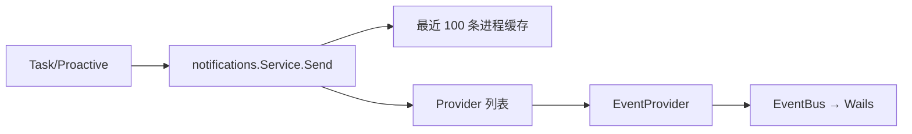

# Notifications：统一通知协议

[总目录](../../docs/architecture/README.md) · [Tasks](../tasks/README.md) · [Proactive](../proactive/README.md)

`Notification` 保存等级、标题、正文和可跳转的 Agent/Session/Task/Run ID。`Service.Send` 规范化内容、分配 ID/时间，将最近 100 条放进进程内缓存，再发给已注册 Provider。`EventProvider` 把通知发布到 EventBus；桌面 Service 再投影为 Wails 事件、系统通知或 Toast。Core 不直接绑定某个操作系统 SDK。

`Recent` 供桌面适配器启动较晚时补齐启动阶段通知，由通知 ID 在前端去重。Provider 错误通过 `errors.Join` 汇总；通知是用户展示通道，不是任务完成的唯一事实，任务仍以 Run JSON 为准。本包只有 `service.go`，从 `Notification`、`Send`、`Recent`、`EventProvider` 顺序阅读。
