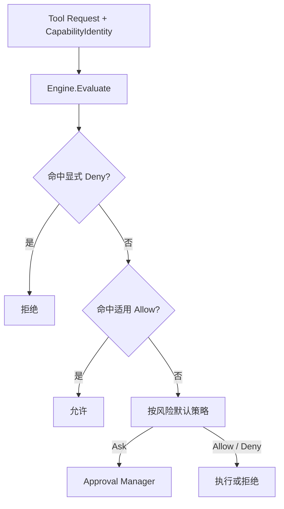

# Permission：能力授权规则

[总目录](../../docs/architecture/README.md) · [审批](../approval/README.md) · [沙箱](../sandbox/README.md)

## 决策不是执行边界的全部

`Engine.Evaluate` 对一个具体 `Request` 返回 allow、deny 或 ask。Request 包含工具、风险、Session/Agent 和 `CapabilityIdentity`；`presentation` 把本次操作安全地投影为审批卡。持久化 Agent 规则在 `config/permissions.json`，Session 规则在内存中。Allow 只跳过再次询问，不能绕过工具自己的工作区 Path Guard、命令白名单或 Sandbox。

优先级是显式 Deny 高于 Allow；Session Allow 再先于 Agent Allow。`install_skill` 与 `schedule_task` 的旧 Allow 不能直接放行，启用权限系统时要求逐次确认。若权限系统整体关闭，`schedule_task` 仍必须询问。`Grant` 将 allow_session/allow_agent 转成规则；allow_once 不落规则。Identity 带有能力目标与相关配置指纹，工具、工作区、Skill 或 MCP 安全身份变化时需重新评估。

## 代码地图

| 文件 | 实现 |
| --- | --- |
| `types.go`、`identity.go` | 风险、动作、Request、Rule、Identity 及校验。 |
| `engine.go` | `Evaluate` 的优先级、`Grant`/`DenyAgent` 的规则创建和匹配。 |
| `store.go` | 持久化规则的严格读取、迁移、增删。 |
| `presenter.go` | 按工具参数构造对用户可理解的操作描述。 |

调试工具为什么要求确认：先记录 Tool Descriptor 的风险与 Identity，再看 `Evaluate` 命中的 RuleID 或默认策略，最后看 Approval 决策。单纯隐藏 UI 按钮不会改变后端权限。

## 逐步看一次 Evaluate

1. `Request.Validate` 核对工具、风险与作用域；`BuildPresentation` 生成用户能检查的操作说明。
2. 先取当前 Session 的临时规则和 Store 的长期规则，并按 `CapabilityIdentity` 匹配目标。
3. 命中显式 Deny 立即拒绝；否则尝试适用的 Session Allow、Agent Allow；特殊工具不能套用旧的宽泛 Allow。
4. 都没有命中时按风险默认策略决定；Ask 生成 ApprovalID，由 Approval Manager 等待人类决策。
5. allow_once 只恢复本次中断；allow_session/allow_agent 通过 `Grant` 写入相应范围。规则匹配到的 Identity 变化后必须重新问。

这里返回的 `Decision.Action=allow` 只代表这一层同意执行。文件工具依然要通过 Sandbox 路径校验，命令工具依然要通过白名单和 Runner，MCP HTTP 依然要通过网络边界。新增风险等级或规则范围时同时修改 `types.go`、`engine.go`、`presenter.go` 和 Wails DTO。
