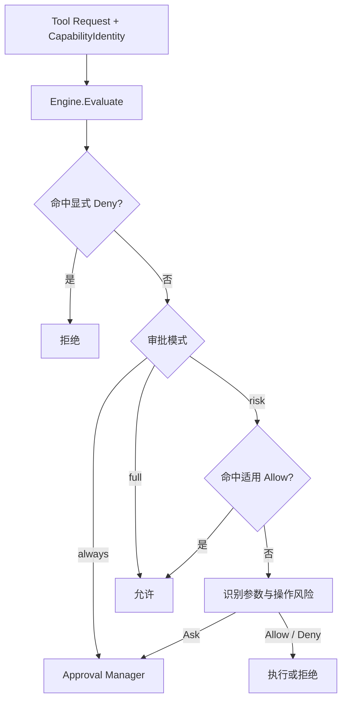

# Permission：能力授权规则

[总目录](../../docs/项目源码详解.md) · [审批](../approval/README.md) · [沙箱](../sandbox/README.md)

## 决策不是执行边界的全部

`Engine.Evaluate` 对一个具体 `Request` 返回 allow、deny 或 ask。Request 包含工具、风险、Session/Agent 和 `CapabilityIdentity`；`presentation` 把本次操作安全地投影为审批卡。持久化 Agent 规则在 `config/permissions.json`，Session 规则在内存中。Allow 只跳过再次询问，不能绕过工具自己的工作区 Path Guard、命令沙箱。

产品使用三种审批模式，默认 `risk`。`risk` 自动执行内置只读查询、工作区内常规编辑和可识别的开发检查；删除、未知脚本及其他越界操作等请求确认。`glob_files`、`grep_files`、`list_files`、`read_file` 查询工作区外的已授权目录也无需审批，目录权限仍由 Sandbox 强制校验。`always` 每次工具调用都询问，忽略历史 Allow；`full` 无需审批，并由应用在下一轮使用全目录文件权限。显式 Deny 在三种模式下均保留。聊天区和设置页共享同一已保存的全局模式。

`run_command` 的可复用授权绑定程序、可执行路径、Sandbox 与本次调用的参数指纹。指纹覆盖完整 `args`、实际工作目录和超时值，规则中不保存可能含密钥的原始参数。风险审批下，相同调用可以选择本会话允许或 Agent 始终允许；参数变化后重新评估。旧版只绑定程序的 Allow 不再命中，Deny 仍生效。

```mermaid
flowchart TD
  Q[Tool Request + CapabilityIdentity] --> E[Engine.Evaluate]
  E --> D{命中显式 Deny?}
  D -->|是| N[拒绝]
  D -->|否| M{审批模式}
  M -->|always| H[Approval Manager]
  M -->|full| Y[允许]
  M -->|risk| A{命中适用 Allow?}
  A -->|是| Y[允许]
  A -->|否| P[识别参数与操作风险]
  P -->|Ask| H
  P -->|Allow / Deny| Z[执行或拒绝]
```

风险审批下，显式 Deny 高于 Allow；Session Allow 再先于 Agent Allow。`install_skill` 与 `schedule_task` 的旧 Allow 不能直接放行，需要逐次确认。`Grant` 将 allow_session/allow_agent 转成规则；allow_once 不落规则。Identity 带有能力目标与相关配置指纹，工具、工作区、Skill 或 MCP 安全身份变化时需重新评估。

## 代码地图

| 文件 | 实现 |
| --- | --- |
| `types.go`、`identity.go` | 风险、动作、Request、Rule、Identity 及校验。 |
| `engine.go` | `Evaluate` 的优先级、`Grant`/`DenyAgent` 的规则创建和匹配。 |
| `risk.go` | 常规操作判定、路径与符号链接检查、原生隔离下的命令分类。 |
| `store.go` | 持久化规则的严格读取、迁移、增删。 |
| `presenter.go` | 按工具参数构造对用户可理解的操作描述。 |

调试工具为什么要求确认：先记录 Tool Descriptor 的风险与 Identity，再看 `Evaluate` 命中的 RuleID 或默认策略，最后看 Approval 决策。单纯隐藏 UI 按钮不会改变后端权限。

## 逐步看一次 Evaluate

1. `Request.Validate` 核对工具、风险与作用域；`BuildPresentation` 生成用户能检查的操作说明。
2. 先取当前 Session 的临时规则和 Store 的长期规则，并按 `CapabilityIdentity` 匹配目标。
3. 命中显式 Deny 立即拒绝；随后处理 always/full 模式。risk 再尝试适用的 Session Allow、Agent Allow；特殊工具不能套用旧的宽泛 Allow。
4. risk 没有命中规则时先放行内置只读工具，再检查其他工具参数：工作区内常规操作自动允许，其余 Ask；Ask 生成 ApprovalID，由 Approval Manager 等待人类决策。外部 MCP 不套用内置只读工具的目录豁免。
5. allow_once 只恢复本次中断；allow_session/allow_agent 通过 `Grant` 写入相应范围。规则匹配到的 Identity 变化后必须重新问。

这里返回的 `Decision.Action=allow` 只代表这一层同意执行。文件工具依然要通过 Sandbox 路径校验，命令工具依然要通过 Runner 的进程隔离，MCP HTTP 依然要通过网络边界。风险分类不是任意程序的安全证明：未知命令不自动放行，常规测试代码的副作用由原生沙箱限制在获准范围内。
