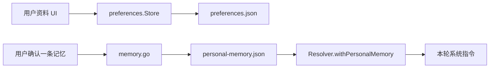

# Preferences：用户资料与确认过的个人记忆

[总目录](../../docs/architecture/README.md) · [Session Memory](../memory/README.md)

`store.go` 保存用户显示名与头像到 `config/preferences.json`；`avatar.NormalizeDataURL` 验证头像格式和大小。`memory.go` 另存 `config/personal-memory.json`：只有用户明确保存的短事实才进入这份跨会话记忆，支持添加、修改、删除和从指定消息保存时记录来源。`runtime.Resolver.withPersonalMemory` 每轮读取并冻结在基础指令中。

个人记忆与 `internal/memory` 的自动 Session Memory 不同：前者可由用户管理、跨会话注入；后者可从某 Session 的 JSONL 重建。`AddMemoryWithSource` 可校验并保存来源 Session/Entry；写入有数量和字数限制。头像用 Data URL 但不接受可执行 SVG。

读 `store.go:Get/Update` 与 `memory.go:ListMemories/AddMemoryWithSource/UpdateMemory`；若记忆未生效，确认 `personal-memory.json` 和 `Resolver.withPersonalMemory` 生成的 Snapshot 指令。
