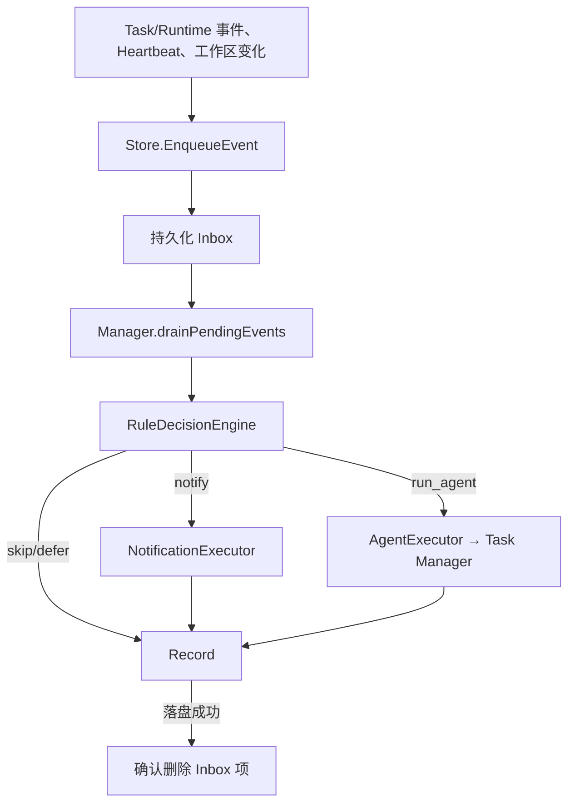

# Proactive：主动事件收件箱与决策

[总目录](../../docs/architecture/README.md) · [Tasks](../tasks/README.md) · [通知](../notifications/README.md)

`Store` 把设置、待处理 Inbox、处理记录、工作区快照和 Heartbeat 状态保存在 `config/proactive.json`。`Manager` 订阅 Task/Runtime 事件、周期检查工作区变化，把事件先写 Inbox 再唤醒消费者。`RuleDecisionEngine` 根据设置、事件种类、Quiet Hours 与近期记录决定忽略、通知或运行 Agent。Agent 路径通过 `Task Manager.RunAutomation`，不另建弱化的执行器。

`EventKey` 用来去重；处理记录先于 Inbox 确认落盘，避免崩溃时无从判断事件是否处理。内部自动 Task 使用 Origin/OriginRef 做幂等关联，恢复时不会盲目重放可能已有副作用的运行。`WorkspaceMonitor` 遍历受控工作区并比较文件时间/大小快照，只产生变化事件，不把整个文件正文塞进主动提示。Quiet Hours 在决策阶段生效。

| 文件 | 重点 |
| --- | --- |
| `types.go`、`decision.go` | Event、Decision、Action 与静音/规则判断。 |
| `store.go` | Inbox、Record、Settings 和快照的原子持久化。 |
| `manager.go` | 订阅、入队、处理、恢复、Heartbeat。 |
| `executors.go` | 通知执行器与 Agent Task 执行器。 |
| `workspace_monitor.go` | 工作区变化检测。 |

追踪主动事件时用 `EventKey → Record.ID → AutomationRunID → SessionID`；如果“没有运行”，先看 Settings/Quiet Hours、Inbox 和 Decision，再看 Task 状态。主动助手只有应用运行时才消费事件。
