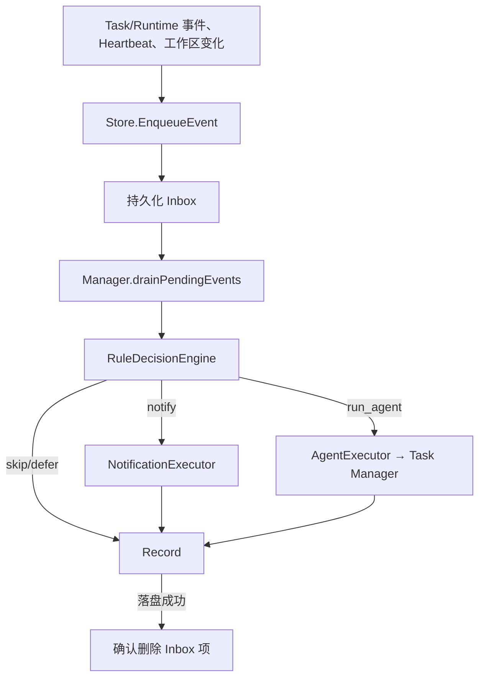

# Proactive：主动事件收件箱与决策

[总目录](../../docs/architecture/README.md) · [Tasks](../tasks/README.md) · [通知](../notifications/README.md)

`Store` 把设置、待处理 Inbox、处理记录、工作区快照和 Heartbeat 状态保存在 `config/proactive.json`。`Manager` 订阅 Task/Runtime 事件、周期检查工作区变化，把事件先写 Inbox 再唤醒消费者。`RuleDecisionEngine` 根据设置、事件种类与近期记录决定忽略、通知或运行 Agent；`Manager.executeRecord` 在执行时重新按当前规则决策，并按 Quiet Hours 延后需执行的动作。Agent 路径通过 `Task Manager.RunAutomation`，不另建弱化的执行器。

```mermaid
flowchart TD
  E[Task/Runtime 事件、Heartbeat、工作区变化] --> I[Store.EnqueueEvent]
  I --> Q[持久化 Inbox]
  Q --> M[Manager.drainPendingEvents]
  M --> D[RuleDecisionEngine]
  D -->|notify| N[NotificationExecutor]
  D -->|run_agent| A[AgentExecutor → Task Manager]
  D -->|skip/defer| R[Record]
  N --> R
  A --> R
  R -->|落盘成功| C[确认删除 Inbox 项]
```

`EventKey` 用来去重；处理记录先于 Inbox 确认落盘，避免崩溃时无从判断事件是否处理。内部自动 Task 使用 Origin/OriginRef 做幂等关联，恢复时不会盲目重放可能已有副作用的运行。`WorkspaceMonitor` 遍历受控工作区并比较文件时间/大小快照，只产生变化事件，不把整个文件正文塞进主动提示。Quiet Hours 在决策阶段生效。

内部自动任务的终态事件只唤醒现有 `Manager.loop`。后台循环通过 `finalizeCompletedAutomations` 读取执行中 Record 关联的 TaskRun，确认真实终态后更新结果并归档内部任务；同步事件回调不得调用 `Task Manager.Archive`，否则会重入发布方持有的调度锁。Run ID 回填后也会唤醒一次，覆盖任务提前结束的窗口。重复唤醒合并，收尾不受主动规则关闭或免打扰时段影响；定时检查可重试结果落盘失败，应用重启复用 `reconcileRecords`。相关回归测试见 [automation_finalize_test.go](automation_finalize_test.go)。

审批提醒通过 `ApprovalReader.Get` 查询审批模块的真实状态。聊天和计划任务都携带 `ApprovalID`；审批终结事件调用 `Store.DismissApproval`，在一次持久化中移除匹配的 Inbox 项，并将延迟提醒标为忽略。执行前还会核对审批存在、仍在等待且未超时，因此漏掉终结事件、延迟事件乱序或应用重启后，旧提醒也不会重新执行。这个检查不撤回已经进入执行器的动作。

工作区快照最多记录 3000 个文件。达到上限或部分路径读取失败时，快照标为不完整，变化摘要只报告能确认的变化：旧快照完整才能确认新增，新快照完整才能确认删除，两个快照都包含的文件可以确认修改。未扫描部分的变化无法判断，摘要会明确提示。

| 文件 | 重点 |
| --- | --- |
| `types.go`、`decision.go` | Event、Decision、Action 与静音/规则判断。 |
| `store.go` | Inbox、Record、Settings 和快照的原子持久化。 |
| `manager.go` | 订阅、入队、处理、恢复、Heartbeat。 |
| `executors.go` | 通知执行器与 Agent Task 执行器。 |
| `workspace_monitor.go` | 工作区变化检测。 |

追踪主动事件时用 `EventKey → Record.ID → AutomationRunID → SessionID`；如果“没有运行”，先看 Settings/Quiet Hours、Inbox 和 Decision，再看 Task 状态。主动助手只有应用运行时才消费事件。
