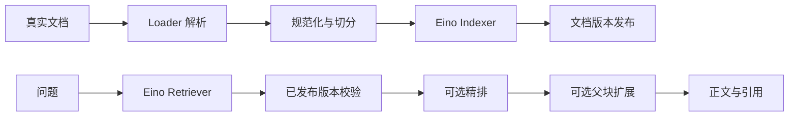

# RAG 模块

对业务调用方提供已经组合好的 `rag.Service`，包含文档导入、检索、分块读取、取消和删除。组件开发者可以直接组合 Eino Indexer、Retriever 和 Transformer。本模块仍独立运行，尚未接入 Agent 或 Wails。

## 包的职责

| 位置 | 职责 |
| --- | --- |
| `rag.go`、`service.go` | 唯一业务入口、组件注入及默认流程 |
| `indexing.go`、`persistence.go`、`validation.go` | 文档批次、版本、原文及父子块的业务契约 |
| `published.go` | 外部索引命中的版本校验与正文回查 |
| `indexer/`、`retriever/` | 实现或组合 Eino 原生组件 |
| `chunker/`、`transformer/chunker/` | 切分算法与 Eino Transformer |
| `loader/`、`provider/` | 文档解析、Embedding 和精排实现 |
| `examples/5-rag/main.go` | 当前 PostgreSQL、Tabula 和模型的具体组装 |

核心包不导入 PostgreSQL、Tabula 或具体模型 Provider。没有 `rag.NewPostgres`、`rag.RAG` 或第二层 `application.Service`。增加新后端时，在调用方替换 Eino 组件；只有确实缺少组件时，才添加相应适配器。

## 默认执行流程



- 普通模式索引普通块；父子模式只索引子块，父块留在文档库供上下文扩展。
- 完整 Markdown 来自 Loader，不能拼接重叠分块重建原文。
- `IndexDocuments` 将标题、面包屑和正文组成统一检索文本，`rag_raw_content` 保留原始子块正文。
- 版本号在解析前通过显式 `Lifecycle` 预留。分块 ID 包含版本，失败的新索引不会覆盖旧版。
- 外部索引全部成功后，由 `Publisher` 发布原文和父子块；`PublishedChunks` 过滤旧版、未发布及已删除命中。
- PostgreSQL 原子 Indexer 通过 `WithIngestionBatch` 在同一事务内保存原文、父子块及两路索引，`Publisher` 留空。
- Hybrid 按 Eino 返回顺序做 RRF，默认向量/关键词权重为 0.7/0.3，K 为 60。无分数的原生组件也可以参与融合。
- 返回的 `Content` 保留命中子块，`ContextContent` 是扩展上下文；父块扩展不改变人工标注的分块身份。
- 当前 `Service.Search` 不执行问题改写或 MMR。MMR 算法保留在独立 `Engine.Rerank` 中，统一流程使用 `RerankCandidates` 保留候选池，后续接入须由最终选择阶段协调父块去重与数量。

## 共享实现与阅读顺序

分块的普通调用与诊断调用共用 `chunker/strategy.go` 中的一条策略循环，算法通过直接调用选择。`SplitterConfig.Clone()` 统一复制可变配置，`retrieval/documents.go` 统一定义元数据键并提供顶层复制。索引文本和精排文本共用 `searchcontent.BuildText()`，精排模型不可用或返回异常时使用同一套回退处理。

建议先阅读 `rag.go` 的组件依赖，再看 `service.go` 的 `Ingest` 和 `Search`。需要调整分块时进入 `chunker/strategy.go`，调整混合召回时进入 `retriever/hybrid.go`，数据库实现集中在对应的 `postgres` 子包。代码注释说明当前行为和关键约定，不再保留阶段性实现计划。

## 业务调用

调用方初始化一次服务，此后使用业务参数调用：

```go
// engine 已由启动代码注入 Loader、Indexer、Retriever 和所需文档能力。
ingested, err := engine.Ingest(ctx, rag.IngestRequest{
    CollectionID: "example",
    DocumentID:   "uploaded-document", // 重导入时保持相同 ID。
    Source:       document.Source{URI: "/绝对路径/你的文档.pdf"},
    Splitter:     chunker.DefaultConfig(),
})

response, err := engine.Search(ctx, rag.SearchRequest{
    CollectionID: "example",
    Query:        "文档中的问题",
    Mode:         "hybrid", // semantic / keyword 查看单路效果。
    Limit:        5,
})
```

业务 API 不接受任意 Eino Option，也不允许临时替换 Embedding、索引范围或过滤语法。模型、召回阈值、候选数量和融合策略在组装阶段配置。原生组件的 `Store`、`Retrieve` 仍保留 Eino Option，供内部开发和实验使用。空正文导入返回错误。

可选的文档操作：

```go
chunks, err := engine.ListChunks(ctx, "example", "uploaded-document")
err = engine.CancelDocument(ctx, "example", "uploaded-document")
err = engine.DeleteDocument(ctx, "example", "uploaded-document")
engine.Close() // 多次调用也只释放一次资源。
```

取消只作废尚未发布的版本，上一版仍可检索。删除使权威文档失效；外部索引残留由版本回查隐藏，物理清理由所选后端承担。具体组件组合见 [BACKENDS.md](BACKENDS.md)。

## 真实文件 example

完整示例见 [examples/5-rag/README.md](../../examples/5-rag/README.md)。它导入真实文件、打印分块，先输入问题并人工标注相关子块，再对比 hybrid、semantic、keyword 的 Recall 和 Precision。

```bash
export OPENAI_API_KEY='你的密钥'
export OPEN_BASE_URL='你的 OpenAI 兼容 API 地址'
export RAG_EMBEDDING_MODEL='服务实际支持且输出 1024 维的模型名'
go run ./examples/5-rag /绝对路径/你的文档.pdf
```

全部示例代码集中在 [examples/5-rag/main.go](../../examples/5-rag/main.go)，调参修改其中的 `exampleConfig`，包括解析、分块、召回、精排和父块扩展的中文说明。数据库地址可通过 `RAG_DATABASE_URL` 设置；数据库需提前创建，示例自动创建扩展和表，连接用户需具备对应权限。运行时分别打印配置开关与实际执行诊断。

当前 PostgreSQL 适配器要求 PostgreSQL 15+、pgvector 0.7+、pg_search 0.25+，schema 使用 `halfvec(1024)`。模型实际输出必须是 1024 维；`Dimensions=0` 仅省略请求参数。通用 Service 没有维度限制。

| 示例参数 | 含义 |
| --- | --- |
| `cfg.Search.FinalTopK` | 最终返回条数 |
| `cfg.Hybrid.ChannelTopK` | 每路召回候选数 |
| `cfg.Hybrid.TopK` | 融合候选数，同时设置 Service 的 RecallTopK |
| `cfg.Vector.ScoreThreshold` / `cfg.Keyword.ScoreThreshold` | 两路原始召回阈值 |
| `cfg.Hybrid.RRF` | 融合权重和 K |
| `IngestRequest.Splitter` | 切分策略、大小和重叠等 |

评测必须先标注再检索，并按最终结果中去重后的子块证据计算：

- `Recall = 找回的相关子块数 / 全部标注的相关子块数`
- `Precision = 找回的相关子块数 / 实际返回的子块证据数`

这里的“准确率”指检索 Precision，示例一次评估一个问题。同父块合并后的 `Evidence` 也参与评测，父块正文中未经召回的其他子块不自动算命中；最终上下文条数可能少于子块证据数。调整切分参数后分块边界会改变，需要重新标注。回答生成、异步任务和用户知识库管理属于后续业务层。

## 验证

```bash
go test ./...
go test -race ./internal/rag/...
```

数据库集成测试仅在设置 `HUMBERT_RAG_TEST_DATABASE_URL` 时运行，该地址应指向安装好扩展的专用测试数据库；测试创建并清理随机 schema。未配置时跳过。纯 Go 回归测试覆盖原生组件、独立索引发布失败、版本过滤、父子块引用、超时及降级诊断。

组件边界采用 [Eino Indexer](https://github.com/cloudwego/eino/blob/main/components/indexer/interface.go) 和 [Eino Retriever](https://github.com/cloudwego/eino/blob/main/components/retriever/interface.go)。切分参考 [WeKnora](https://github.com/Tencent/WeKnora/blob/main/internal/infrastructure/chunker/strategy.go) 的结构判断、校验回退和父子块处理，没有引入后端注册器。
