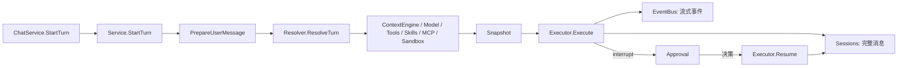

# Runtime：一次 Turn 的完整执行

[总目录](../../docs/architecture/README.md) · [Context](../contextengine/README.md) · [工具](../tools/README.md)

## 三个核心角色

`Service` 管 Turn 的占用、取消、审批暂停/恢复、终态与事件；`Resolver` 从当前配置和 Session 构造不可变 `Snapshot`；`Executor` 用 Snapshot 创建 Eino Agent/Runner，消费流事件并把完整消息交给 SessionWriter。`types.go` 的 `RuntimeManifest` 描述“本轮实际上加载了什么”。`prompt.go` 拼接基础指令及可用工具提示；提示词只在有对应能力时加入。



`StartTurn` 的顺序固定：校验输入 → 取得 Session/Agent → 占用 Session → 持久化或安全复用 UserMessage → 解析 Snapshot → 登记 `activeRun` → 异步执行。若解析失败，收据保留已经保存的 `UserMessageID`，避免前端重试重复追加。`executeTurn` 和 `resumeTurn` 最终都进入 `handleExecutionOutcome`：失败、再次审批中断、正常完成三种出口。`completeTurn` 做维护与终态事件；`cleanupRun` 释放占用。

## 并发与审批

`activeBySession` 保证一个 Session 同时只有一个 Turn；压缩、删除也走相同 reservation 边界。`activeByRequest` 支持 Cancel。等待审批时没有 Executor worker，但 `activeRun` 与 Session reservation 保留，否则另一个 Turn 会破坏 checkpoint 所属分支。`ResolveApproval` 用已有 Eino checkpoint 和 interruptID 恢复，不能从前端拿一份新的工具参数执行。Tool 结果和完整 Assistant 步骤写 JSONL；delta 只经 EventBus 发给 UI。

任务执行仍调用相同的 `StartTurn`，只是附加最长时长、模型/工具次数与 Token 限额。子 Agent 通过 `Resolver.BuildChildAgent` 获取自己的模型和能力，但沿用父运行的工作区、安全和审批边界。

## 代码阅读与断点

| 文件 | 关键函数 |
| --- | --- |
| `service.go` | `StartTurn`、`registerInterruptedRun`、`ResolveApproval`、`completeTurn`、`cleanupRun`。 |
| `resolver.go` | `resolveContextBase`、`ResolveTurn`、`compactUntilSafe`、`MaintainAfterTurn`。 |
| `executor.go` | `buildRunner`、`consumeEvents`、`persistAssistantMessage`、`persistCompletedTool`。 |
| `types.go` | `Snapshot`、`ExecutionLimits`、`Event`、`RuntimeManifest`。 |
| `prompt.go` | `buildRuntimeInstruction`，跟踪最终系统指令。 |

从 `RequestID` 追运行事件，从 `SessionID` 追 JSONL，从 `RunID` 追 checkpoint。断点优先放在 `StartTurn`、`ResolveTurn`、`consumeEvents`、`handleExecutionOutcome`；UI 与持久化不一致时先确认 `persist*` 是否成功，再看事件桥。

## 阅读一个真实 Turn 的状态变化

```text
StartTurn: reserve → append user → ResolveTurn → activeRun
executeTurn: EventTurnStarted → Eino events → persist completed steps
  ├─ completed: MaintainAfterTurn → EventTurnCompleted → cleanupRun
  ├─ failed/cancelled: EventTurnFailed/Cancelled → cleanupRun
  └─ interrupt: register approval → 保留 activeRun 和 reservation
ResolveApproval: permission decision → Resume(checkpoint) → 同样三种出口
```

`Snapshot` 的模型、工具、消息与安全配置在 `ResolveTurn` 结束后不应就地修改；只允许运行计数等受控状态随着调用变化。`Executor.consumeEvents` 可能收到多个消息片段，只有合成完整的 Assistant Step 后才调用 `persistAssistantMessage`。ToolCall 与 ToolResult 使用稳定 ID 对齐；失败时要检查是否已有部分终态消息写入，不能在重试时盲目再追加用户输入。

`Service.Close` 取消活动运行并等待 worker，审批等待者也要收敛。Task 的运行上限属于 `ExecutionLimits`，普通聊天没有任务上限。任何在 Service 外直接调用 `Executor` 的新入口都可能绕过 Session reservation 和快照冻结，应优先通过 Runtime Service 扩展。
