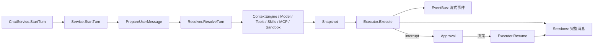

# Runtime：一次 Turn 的完整执行

[总目录](../../docs/项目源码详解.md) · [Context](../contextengine/README.md) · [工具](../tools/README.md)

## 三个核心角色

`Service` 管 Turn 的占用、取消、审批暂停/恢复、终态与事件；`Resolver` 从当前配置和 Session 构造不可变 `Snapshot`；`Executor` 消费 Eino Runner 的流事件并把完整消息交给 SessionWriter。`eino_builder.go` 集中构造主/子 Agent 并安装工具中间件。`types.go` 的 `RuntimeManifest` 描述“本轮实际上加载了什么”。`prompt.go` 拼接基础指令、可用工具提示和用户偏好；提示词只在有对应能力时加入。


```mermaid
flowchart LR
  UI[ChatService.StartTurn] --> S[Service.StartTurn]
  S --> U[PrepareUserMessage]
  U --> R[Resolver.ResolveTurn]
  R --> C[ContextEngine / Model / Tools / Skills / MCP / Sandbox]
  C --> X[Snapshot]
  X --> E[Executor.Execute]
  E --> W[Sessions: 完整消息]
  E --> B[EventBus: 流式事件]
  E -->|interrupt| A[Approval]
  A -->|决策| E2[Executor.Resume]
  E2 --> W
```

`StartTurn` 的顺序固定：校验输入 → 取得 Session/Agent → 占用 Session → 持久化或安全复用 UserMessage → 解析 Snapshot → 登记 `activeRun` → 异步执行。若解析失败，收据保留已经保存的 `UserMessageID`，避免前端重试重复追加。`executeTurn` 和 `resumeTurn` 最终都进入 `handleExecutionOutcome`：失败、再次审批中断、正常完成三种出口。`completeTurn` 做维护；所有成功、失败和审批取消进入 `finishRun`，完成清理后只发布一次终态。

## 并发与审批

`activeBySession` 保证一个 Session 同时只有一个 Turn；压缩、删除也走相同 reservation 边界。`activeByRequest` 支持 Cancel。等待审批时没有 Executor worker，但 `activeRun` 与 Session reservation 保留，否则另一个 Turn 会破坏 checkpoint 所属分支。`ResolveApproval` 用已有 Eino checkpoint 和 interruptID 恢复，不能从前端拿一份新的工具参数执行。Tool 结果和完整 Assistant 步骤写 JSONL；delta 只经 EventBus 发给 UI。

`activeRun` 嵌入本轮冻结的 `Snapshot`，RequestID、RunID、SessionID 只由快照持有；活动运行仅额外维护 Context、取消函数、阶段、checkpoint、审批等待通知及唯一收尾控制。`events.go` 的 `publishApprovalEvent` 共用审批事件投影：外层 Event 指向父 Turn，内层 Request 可以指向实际触发审批的子 Agent，二者身份不能混用。超时拒绝继续恢复原 checkpoint，取消则执行终态清理，不能合并为同一种结果。

任务执行仍调用相同的 `StartTurn`，只是附加最长时长、模型/工具次数与 Token 限额。子 Agent 通过 `Resolver.BuildChildAgent` 获取自己的模型和能力，但沿用父运行的工作区、安全和审批边界。

## 代码阅读与断点

| 文件 | 关键函数 |
| --- | --- |
| `service.go` | `StartTurn`、Context 查询与手动压缩入口。 |
| `operations.go` | Session reservation 与 Agent/会话删除门闩。 |
| `approvals.go` | 审批等待、checkpoint 恢复与取消收敛。 |
| `runs.go` / `events.go` | 执行清理、关闭、事件与安全投影。 |
| `capabilities.go` / `extensions.go` | 主/子 Agent 共用能力装配及新增模块接入。 |
| `eino_builder.go` | 共用 ChatModelAgent 构造、`BuildChildAgent`、中间件顺序与工具生命周期。 |
| `resolver.go` | `resolveContextBase`、`ResolveTurn`、`MaintainAfterTurn`。 |
| `executor.go` | `buildRunner`、`consumeEvents`、`persistAssistantMessage`、`persistCompletedTool`。 |
| `types.go` | `Snapshot`、`ExecutionLimits`、`Event`、`RuntimeManifest`。 |
| `model_roles.go` | 模型角色、附件能力要求与 Provider 的 reasoning 回放策略。 |
| `prompt.go` | `buildRuntimeInstruction`、`withUserPreferences`，跟踪最终系统指令。 |

从 `RequestID` 追运行事件，从 `SessionID` 追 JSONL，从 `RunID` 追 checkpoint。断点优先放在 `StartTurn`、`ResolveTurn`、`consumeEvents`、`handleExecutionOutcome`；UI 与持久化不一致时先确认 `persist*` 是否成功，再看事件桥。

## 阅读一个真实 Turn 的状态变化

```text
StartTurn: reserve → append user → ResolveTurn → activeRun
executeTurn: EventTurnStarted → Eino events → persist completed steps
  ├─ completed: MaintainAfterTurn → finishRun(cleanupRun → EventTurnCompleted)
  ├─ failed/cancelled: finishRun(cleanupRun → EventTurnFailed/Cancelled)
  └─ interrupt: register approval → 保留 activeRun 和 reservation
ResolveApproval: permission decision → Resume(checkpoint) → 同样三种出口
```

`Snapshot` 的模型、工具、消息与安全配置在 `ResolveTurn` 结束后不应就地修改；只允许运行计数等受控状态随着调用变化。`Executor.consumeEvents` 可能收到多个消息片段，只有合成完整的 Assistant Step 后才调用 `persistAssistantMessage`。ToolCall 与 ToolResult 使用稳定 ID 对齐；失败时要检查是否已有部分终态消息写入，不能在重试时盲目再追加用户输入。

`resolvedContextBase` 嵌入唯一的 `capabilitySet`，工具、Skills、MCP 与授权 Scope 不再复制成平行字段。模型可见名称由最终描述符统一生成，主 Agent Manifest 和子 Agent 校验共用该投影。`materializeOutput` 统一流读取、合并与关闭；Assistant 入口保留失败前的文本供上层恢复，普通消息入口在失败时丢弃半截 ToolResult。取消、审核拦截与持久化仍由 `consumeEvents` 明确判断。

`Service.Close` 取消活动运行并等待 worker，审批等待者也要收敛。Task 的运行上限属于 `ExecutionLimits`，普通聊天没有任务上限。任何在 Service 外直接调用 `Executor` 的新入口都可能绕过 Session reservation 和快照冻结，应优先通过 Runtime Service 扩展。

中间件固定顺序为 Skill → Reduction → Summarization/硬预算。`MaintainAfterTurn` 仅校准实际 usage 并提交待定摘要，不发起第二次摘要模型调用。详见 [Context](../contextengine/README.md)。

模型/工具次数与上下文窗口大小是两类限制。`model_accounting.go` 在真实模型调用入口统一统计主模型、摘要、视觉辅助和子 Agent；`limits.go` 原子预留次数，达到已报告 Token 阈值后停止后续调用。工具上下文携带共享预算，浏览器截图分析也通过 `TrackAuxiliaryModel` 接入。流式 Usage 按累计差值记账，Executor 不再重复计数。

## 新模块能力

`component.Provider` 只贡献 Agent 显式选择的 Eino 工具。Describe 用于本地预览和预算，Resolve 用于真实 Turn；两者返回相同工具名称及内容版本。模块工具与 Builtin/Skills/MCP 一起做名称冲突检查、Schema Token 估算和 Reduction，并复用统一 Permission Guard。

子 Agent 使用自己的模块绑定，授权 Scope 仍继承父运行。宿主复制模块请求中的可变集合；Manifest 只公开模块 ID、版本和工具名称。Allow 精确绑定版本，Deny 绑定稳定模块与工具。实现或配置变化必须更新版本，当前 Turn 使用已经捕获的配置与连接，审批恢复不重新装配。

终态事件发布前已完成必要持久化、取消旧上下文、通知生命周期观察者并同时释放运行索引和 Session reservation。同步订阅者可立即预约下一轮；旧清理按 RequestID 校验，不能删除新运行占用。初始化失败也通知观察者，回收解析阶段已持有的 MCP 连接。

Provider 的短小 reasoning 策略已并入 `model_roles.go`，原 `reasoning_policy.go` 只保留 package 声明，可手动删除。没有增加第二套执行器或状态机。
