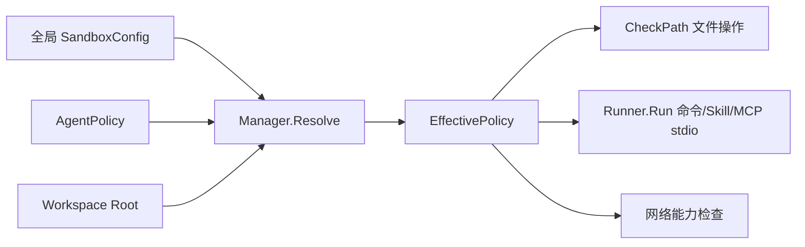

# Sandbox：路径、网络与外部进程边界

[总目录](../../docs/architecture/README.md) · [Workspace](../workspace/README.md) · [Permission](../permission/README.md)

## 从请求策略到有效策略

`Manager.Resolve` 把应用默认配置、Agent 覆盖和当前 Workspace Root 合成为 `EffectivePolicy`。它规范化 Profile、NetworkMode、NativeMode，加入受保护目录、工作区和额外写入目录规则；与受保护目录冲突的配置直接报错。`EffectivePolicy.CheckPath` 对具体读写操作做路径判断。`Runner.Run` 负责外部进程环境、超时、临时目录和平台级隔离；`PrepareExternalCommand` 决定可用的本机后端。

Profile 决定基本访问范围；Standard 可按规则读取 Home 下普通文件，受保护目录仍是 Blocked；额外写目录必须规范化并检查冲突。网络模式独立于文件路径规则。平台原生隔离能力由 Capability 表示，不能因为配置写着 sandbox 就假定某个平台一定提供完全相同的进程隔离。Permission 的 Allow 只决定是否询问，不会扩大 `EffectivePolicy`。

## 代码地图与边界测试

| 文件 | 入口 | 说明 |
| --- | --- | --- |
| `manager.go` | `Resolve`、`PrepareExternalCommand` | 合成策略、受保护路径和原生命令准备。 |
| `types.go`、`access.go`、`pathguard.go` | `EffectivePolicy`、`CheckPath` | 路径操作、优先规则及规范化。 |
| `runner.go` | `Run` | 启动进程、控制工作目录/环境/生命周期。 |
| 平台实现文件 | native capability | 不同系统的真实隔离能力。 |

新增文件工具要在实际读写前使用 `CheckPath` 或受控 Workspace Handle；新增外部进程工具要经 Runner。重点测试符号链接、相对路径逃逸、受保护目录与命令取消。

## Policy 与实际进程隔离的区别

`EffectivePolicy` 是一份规范化的规则快照，描述路径、网络与 NativeMode；`Capability` 告诉调用方当前平台实际可提供什么。文件工具通过 `CheckPath` 与受控句柄守住路径；外部命令还须经 `Runner.Run` 和平台实现施加操作系统级约束。某平台不支持某种隔离时，不能把纯路径检查说成完整进程隔离。

以写入 `workspace/report.md` 为例：先经 Workspace 相对路径规范化，再由 Sandbox 规则决定目标路径是否可写，最后由文件工具以安全句柄执行。以 `run_command` 为例：Permission 先决定是否要人批准，Sandbox Runner 再检查工作目录、网络/原生隔离、环境和超时。批准命令不等于批准任意路径或网络访问。

读 `manager.Resolve` 时关注受保护规则和 Agent 额外写目录的合并顺序；读 `pathguard.go` 时关注符号链接和缺失目标；读 `platform_*.go` 时确认某系统实际执行的限制。
