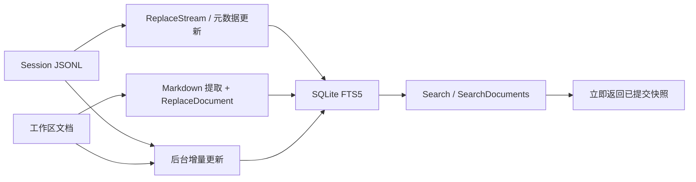

# SearchIndex：可重建的 SQLite 搜索投影

[总目录](../../docs/architecture/README.md) · [Sessions](../sessions/README.md) · [文档解析](../documenttext/README.md)

`Open` 创建 SQLite、启用 WAL，为每条连接设置 5 秒锁等待，最多使用两个连接，并建立 Session 元数据、消息 FTS5 trigram、工作区文档和文档行索引。会话和文件的事实仍在 JSONL/文件系统；SQLite 只为搜索加速，可按事实来源重新生成。默认数据目录使用 `cache/conversation-search.sqlite` 与 `cache/document-search.sqlite` 两份实例。

`ReplaceStream` 在事务中流式写消息，避免为索引一次性加载所有正文；`CachedSession` 用 revision 判断是否需要重建，`Prune` 清理不存在的 Session。文档索引以 AgentID、root、path、size、mtime 判断新旧；提取格式版本通过 `PRAGMA user_version` 触发重建。`SearchDocuments` 返回路径与行号，UI 可以跳到对应文件。`Open` 收紧目录和数据库文件权限。

| 文件 | 阅读重点 |
| --- | --- |
| `index.go` | `Open`、`ReplaceStream`、`Search`、Session metadata。 |
| `documents.go` | `DocumentCurrent`、`ReplaceDocument`、`SearchDocuments`。 |

`SessionService.Search` 与 `WorkspaceService.SearchDocuments` 返回 `results / updating / error`。UI 在 `updating` 为真时轮询；后台只对版本变化的会话或文件重建正文。更新期间读连接仍可查询上一次提交的完整快照。应用关闭时取消并等待索引任务，之后关闭 SQLite。

索引损坏时先确认原始 Session/文件还在，再重建索引；不要把搜索结果当唯一消息来源。两个连接配合 WAL 允许一个写事务和一个前台读查询并行。
