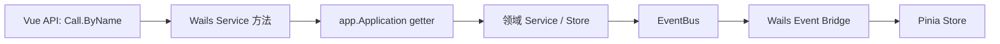

# Services：Wails 桌面 API 适配层

[总目录](../../docs/architecture/README.md) · [App](../app/README.md)

`enter.go:All` 注册所有桌面 Service。`AgentService`、`ModelService`、`SessionService`、`ChatService`、`TaskService`、`MCPService`、`SkillService`、`PermissionService`、`PreferenceService`、`ProactiveService`、`WorkspaceService` 与 `AppService` 将 UI DTO 转为 Core 调用，并把 Core 结果投影成适合前端展示的 DTO。业务事实由领域包拥有；Service 不保存另一套会话或任务状态。

`chatservice.go:StartTurn` 只等 Runtime 初始化并返回收据；终态由 Runtime EventBus 桥接为 `humbert:runtime:event`。已落盘用户消息发生后续错误时，收据会携 `UserMessageID`，便于前端安全重试。`sessionservice.go` 负责消息 DTO、分页与搜索入口；`taskservice.go` 负责 Task/Run DTO 与任务事件桥；设置类 Service 负责输入验证和明确的错误映射。

新增 API 时先在领域包实现规则，再写 Service DTO，最后同步 `frontend/src/api/` 调用名与参数。前端使用 `Call.ByName`，普通构建不依赖生成 JS bindings。调试顺序是 UI API → Service 方法 → `Application` getter → 对应领域实现；异步结果另查 EventBus 订阅。
