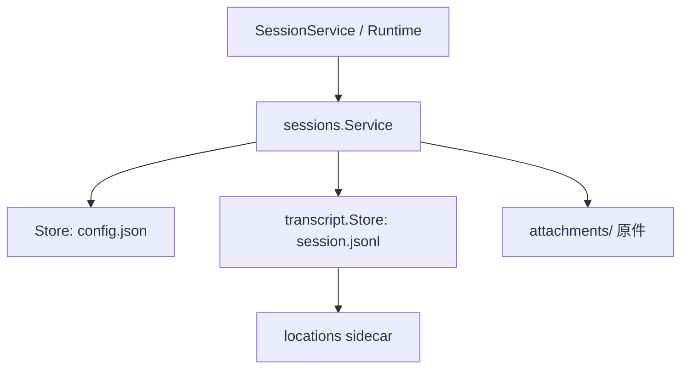
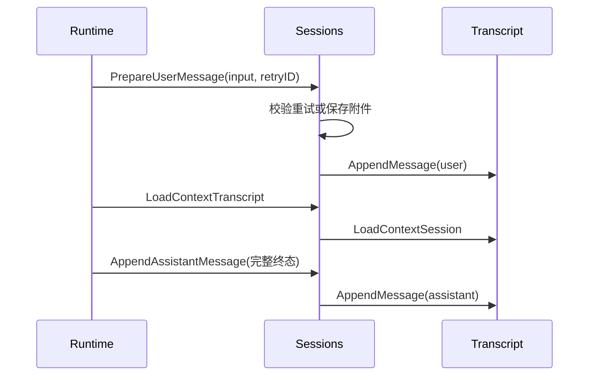

# Sessions：会话控制面与附件

[总目录](../../docs/architecture/README.md) · [Transcript](../transcript/README.md) · [Runtime](../runtime/README.md)

## 领域边界

`Store` 管 `agents/<agent-id>/sessions/<session-id>/config.json` 的标题、归属、归档等低频元数据，并借 Transcript 定位物理会话。`Service` 提供以 Session ID 为入口的业务 API。真正的消息、thinking、toolCall、toolResult 与压缩检查点在 `session.jsonl`，不能把 `config.json` 当聊天历史。

## 一条用户输入如何保存

`PrepareUserMessage` 是 Runtime 持有会话占用后调用的入口：普通发送转给 `AppendUserInput`；重试时只复用当前分支最后一条尚无回复、内容相同的 UserMessage。这个约束避免 Wails 请求失败后再次追加同一输入，也阻止跨会话复用旧消息。`attachments.go` 解码与验证附件，把原件写入 sidecar；JSONL 只保留稳定引用、元数据和可提取文本。`AppendAssistantMessage` 只接受完整的 Assistant 消息；流式 delta 不能调用它。工具结果由 `AppendToolResult` 持久化。

## 读取与附件进入模型

`Messages`、`MessagePage` 供界面读取；`LoadContextTranscript` 供 ContextEngine 使用；`VisitActiveBranchReverse` 和 `ReadActiveBranchRange` 供历史回查。`HydrateMessages` 在 Provider 请求前把近期图片引用恢复成多模态内容；更早的图片只保留文字身份，避免每轮读取/上传同一二进制。普通文本与文档提取内容按受限格式提供给模型。`documenttext` 负责 PDF、Office 文档的解析；`extract_document` 工具允许按需取得 Markdown 分段。

`Session.Create` 冻结当时解析的工作区路径到 Session CWD。Agent 后来更换工作区，不会移动旧 Session 的数据。删除会话时应通过 Runtime 的互斥入口，使活动 Turn/压缩不能与删除并发；`sessions.Service.Delete` 本身只处理存储层动作。

## 阅读地图

| 文件 | 关键函数 | 为什么读 |
| --- | --- | --- |
| `service.go` | `Create`、`PrepareUserMessage`、`AppendAssistantMessage`、`LoadContextTranscript` | 看会话业务 API 和 Transcript 边界。 |
| `store.go` | `NewStore`、`Get`、`ListMessages` | 看 Session ID 到 Agent 目录的定位与配置恢复。 |
| `attachments.go` | `appendUserInput`、`HydrateMessages`、`ReadAttachment` | 看附件入库和模型调用前恢复。 |
| `types.go` | `Session`、`UserInput`、`Message` | 区分控制面 DTO、附件和持久化消息。 |

调试时先确认 Session `config.json` 的 AgentID，再查 JSONL Entry ID；附件问题继续看 `attachments/` 和 `HydrateMessages`。不要把 Base64 写进 JSONL 或 Memory。
