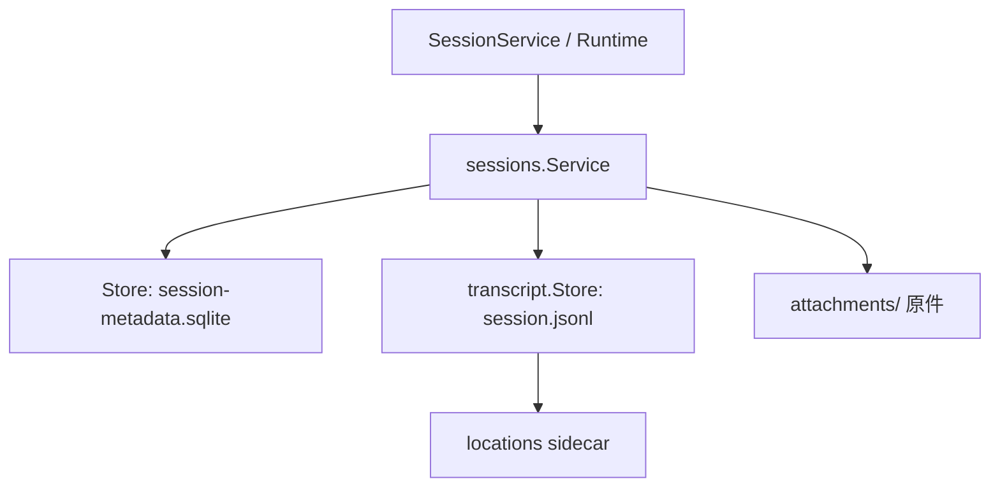
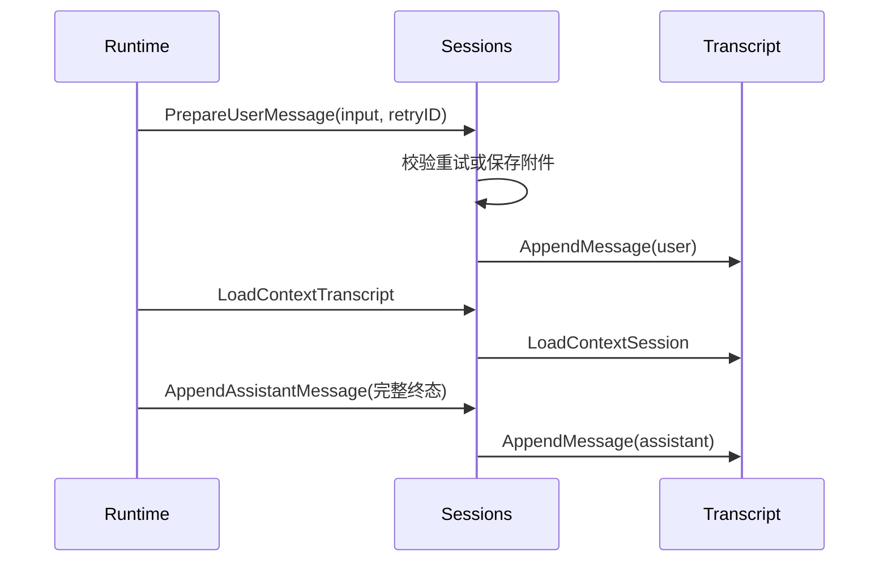

# Sessions：会话控制面与附件

[总目录](../../docs/项目源码详解.md) · [Transcript](../transcript/README.md) · [Runtime](../runtime/README.md)

## 领域边界

`Store` 把标题、归属、归档、创建与最近活动时间保存在 `agents/session-metadata.sqlite`，会话列表直接按 `agent_id, updated_at` 索引查询。会话目录里的旧 `config.json` 不再读取或写入。`Service` 提供以 Session ID 为入口的业务 API。消息、thinking、toolCall、toolResult 与压缩检查点仍只在 `session.jsonl`。

如果数据库没有某个已有 JSONL 的记录，启动时只读取 JSONL 第一行恢复 ID、CWD 与创建时间，标题设为“恢复的会话”、归档状态设为未归档。旧 `config.json` 不参与恢复，因此旧标题与归档状态无法从该文件带入。

```mermaid
flowchart TD
  UI[SessionService / Runtime] --> S[sessions.Service]
  S --> M[Store: session-metadata.sqlite]
  S --> T[transcript.Store: session.jsonl]
  S --> A[attachments/ 原件]
  T --> I[locations sidecar]
```

## 一条用户输入如何保存

`PrepareUserMessage` 是 Runtime 持有会话占用后调用的入口：普通发送转给 `AppendUserInput`；重试时只复用当前分支最后一条尚无回复、内容相同的 UserMessage。这个约束避免 Wails 请求失败后再次追加同一输入，也阻止跨会话复用旧消息。`attachments.go` 解码与验证附件，把原件写入 sidecar；浏览器工具生成的截图也通过 `SaveToolImage` 保存在同一会话附件目录。JSONL 只保留稳定引用、元数据和可提取文本，不写入图片二进制。`AppendAssistantMessage` 只接受完整的 Assistant 消息；流式 delta 不能调用它。工具结果由 `AppendToolResult` 持久化。

```mermaid
sequenceDiagram
  participant R as Runtime
  participant S as Sessions
  participant T as Transcript
  R->>S: PrepareUserMessage(input, retryID)
  S->>S: 校验重试或保存附件
  S->>T: AppendMessage(user)
  R->>S: LoadContextTranscript
  S->>T: LoadContextSession
  R->>S: AppendAssistantMessage(完整终态)
  S->>T: AppendMessage(assistant)
```

## 读取与附件进入模型

`Messages`、`MessagePage` 供界面读取；`LoadContextTranscript` 供 ContextEngine 使用；`VisitActiveBranchReverse` 和 `ReadActiveBranchRange` 供历史回查。`HydrateMessages` 在 Provider 请求前把近期图片引用恢复成多模态内容；更早的图片只保留文字身份，避免每轮读取/上传同一二进制。普通文本与文档提取内容按受限格式提供给模型。`documenttext` 负责 PDF、Office 文档的解析；`extract_document` 工具允许按需取得 Markdown 分段。

每次 `HydrateMessages` 只计算一次 `multimodal.AttachmentReplayMask`，图片和文本附件共用同一用户轮次窗口；单条附件预览直接启用完整回放。内部只传一个 replayAttachments 标志，仍按附件类型分别校验、读取或生成占位，保留整次请求 32MiB 水合预算、会话归属和受控 ID 检查。上传持久化直接使用零值 `transcript.EncodeOptions{}`，不再保留无额外行为的包装函数。

`Session.Create` 冻结当时解析的工作区路径到 Session CWD。Agent 后来更换工作区，不会移动旧 Session 的数据。删除会话时应通过 Runtime 的互斥入口，使活动 Turn/压缩不能与删除并发；`sessions.Service.Delete` 本身只处理存储层动作。

归档只修改 SQLite 的 `archived` 字段，JSONL 与附件保持原样。前端可在侧边栏显示归档会话；“设置 → 归档会话”集中提供查看、解除归档和删除。删除走 `SessionService.Delete`，若会话属于任务，还会清理对应运行记录。

## 阅读地图

| 文件 | 关键函数 | 为什么读 |
| --- | --- | --- |
| `service.go` | `Create`、`PrepareUserMessage`、`AppendAssistantMessage`、`LoadContextTranscript` | 看会话业务 API 和 Transcript 边界。 |
| `store.go`、`catalog.go` | `NewStore`、`GetSession`、`ListSessions` | 看 SQLite 元数据、JSONL Header 恢复和消息边界。 |
| `attachments.go` | `appendUserInput`、`HydrateMessages`、`ReadAttachment` | 看附件入库和模型调用前恢复。 |
| `artifacts.go` | `Archive`、`ReadContextArtifact`、`contextArtifactPath` | 看完整工具结果的会话私有归档与身份校验。 |
| `types.go` | `Session`、`UserInput`、`Message` | 区分控制面 DTO、附件和持久化消息。 |

调试时先查 `session-metadata.sqlite` 中的 Session AgentID，再查 JSONL Entry ID；附件问题继续看 `attachments/` 和 `HydrateMessages`。SQLite 元数据库必须随用户数据备份，不能像搜索缓存一样删除。不要把 Base64 写进 JSONL 或摘要。

## 大工具结果也由会话拥有

原 `contextartifact` 的实现已并入本包。`Service.Archive` 实现 Tools 的 ResultArchiver 接口，`ReadContextArtifact` 实现资源工具的最小读取接口；同一个 Service 同时提供历史、附件和结果归档，不再构造独立 Store 或通过 SessionDirectoryResolver 绕回会话服务。

每次归档创建独立 `artifact_<uuid>.json`，保留版本 1、SessionID、ToolName、全文、Unicode 字符数和 UTC 时间；路径仍为会话内 `context-artifacts/`。读取验证版本、ID、会话归属以及真实目录/文件，格式和已有资源引用保持兼容。文档写入后不再修改，独立 UUID 与 atomicfile 原子落盘足以隔离并发写入，因此移除跨会话全局写锁；没有增加缓存或第二份会话索引。

JSONL 仍记录可见工具事务与引用，归档保存完整结果，两者不是同一份协议。归档随 Session 目录删除；已删除会话不能再创建归档。后端测试使用真实 SessionStore 验证归档读写、身份拒绝、删除与并发首次创建目录。
