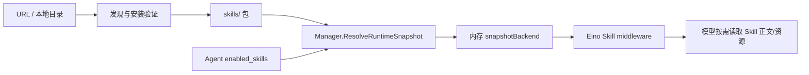
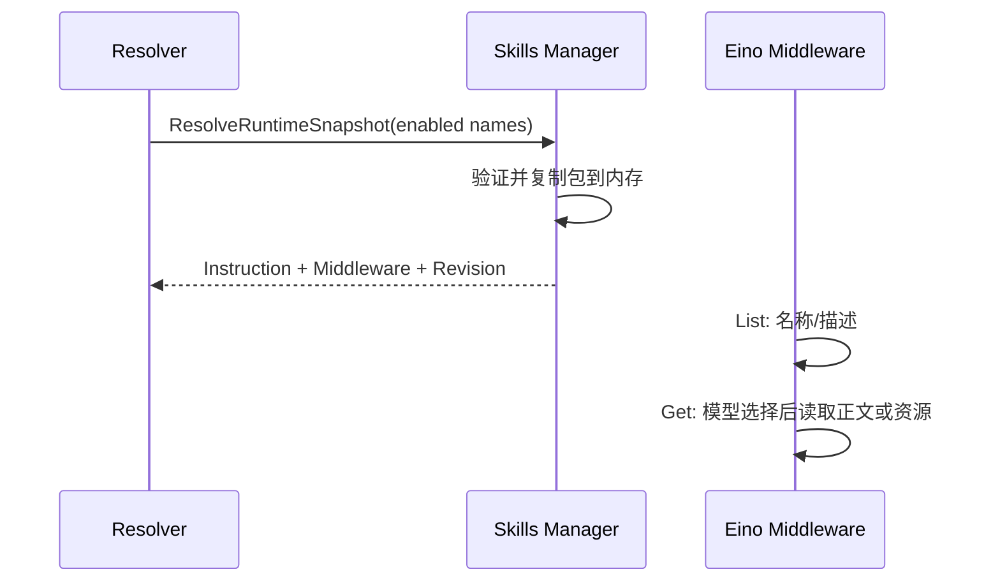

# Skills：安装、验证与按需注入

[总目录](../../docs/architecture/README.md) · [工具](../tools/README.md) · [Runtime](../runtime/README.md)

## 本地包与运行快照

一个 Skill 是受控目录中的 `SKILL.md` 加可选资源文件。`Manager` 扫描/验证、安装、更新、删除包，Agent Profile 只保存启用的 Skill 名称。`ResolveRuntimeSnapshot` 在 Turn 开始时读取已启用包，冻结正文、元数据和 revision。Eino Skill middleware 的 Backend 随后只读这份内存快照，因此运行中的磁盘更改不会悄悄改变当前 Turn。



`snapshotBackend.List` 只提供 name/description；模型真正调用 Skill 工具时，`Get` 才返回完整正文，实现按需披露并节约初始 Token。Skill 使用规则在 Runtime 基础指令中计算一次，middleware 不重复注入系统提示。资源读取校验相对路径；脚本不会因为安装 Skill 就自动执行。`run_skill_script` 是单独的 Builtin，会把当前快照包 Stage 到工作区，再经过 Permission、Workspace 和 Sandbox 执行。

## 来源与更新

`parser.go` 解析 Frontmatter 和正文；`browser.go`/`discovery.go` 扫描候选；`installer.go` 复制已验证包；`remote_installer.go`、`remote_source.go`、`source_providers.go` 处理远程来源和下载边界；`update.go` 检测身份变化并原子替换。坏包在列表中以 `Valid=false` 呈现，不让其它 Skill 完全不可见。第三方来源 Resolver 只规范化 URL，不能绕开最终下载和包验证。



| 文件 | 从哪里读 |
| --- | --- |
| `manager.go`、`types.go` | `List`、`Get`、`NormalizeAndValidateSelection` 与包元数据。 |
| `snapshot.go` | 本轮冻结、渐进披露、资源路径验证。 |
| `installer.go`、`remote_installer.go` | 本地/远程安装和 Stage。 |
| `update.go`、`sources.go` | 更新身份与来源记录。 |

调试 Skill 未出现：先看包 `Valid` 与 Agent enabled_skills，再看本轮 `RuntimeSnapshot.Names`、模型工具能力和 Skill middleware 的 List/Get。安装 Skill 不等于授予脚本执行权限。

## 一个 Skill 在三处的不同形态

```text
磁盘：skills/<name>/SKILL.md + references/ + scripts/
Agent Profile：enabled_skills = [name]
本轮 Snapshot：复制后的正文/元数据/资源 + Revision + Eino middleware
```

设置页 `Get` 展示磁盘包，运行时却读取 Snapshot 的内存副本。模型最初只看名称与描述；调用 Skill 工具后才读取正文，需要某个 `references/*.md` 时再指定相对资源路径。这个分层既减少无关 Skill 的 Token，也让运行期间的安装或删除不会改变当前 Turn。`snapshot.go` 的 `readAsset` 和 `normalizeAssetPath` 不能接受穿越包根的路径。

安装与更新比“复制目录”多一道安全流程：先发现候选、验证 Frontmatter/文件树/来源，再 Stage 和提交。`remote_installer.go` 限制远程请求及归档内容；`update.go` 在提交前复核已安装包身份，避免更新准备期间另一操作的修改被覆盖。脚本执行由 `run_skill_script` 另行触发，需同时满足 Agent 工具选择、审批和 Sandbox；普通 Skill 加载不会自动运行 `scripts/`。
