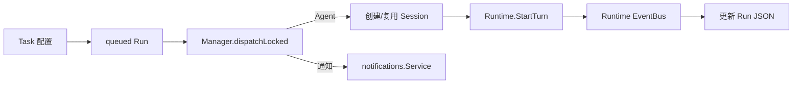
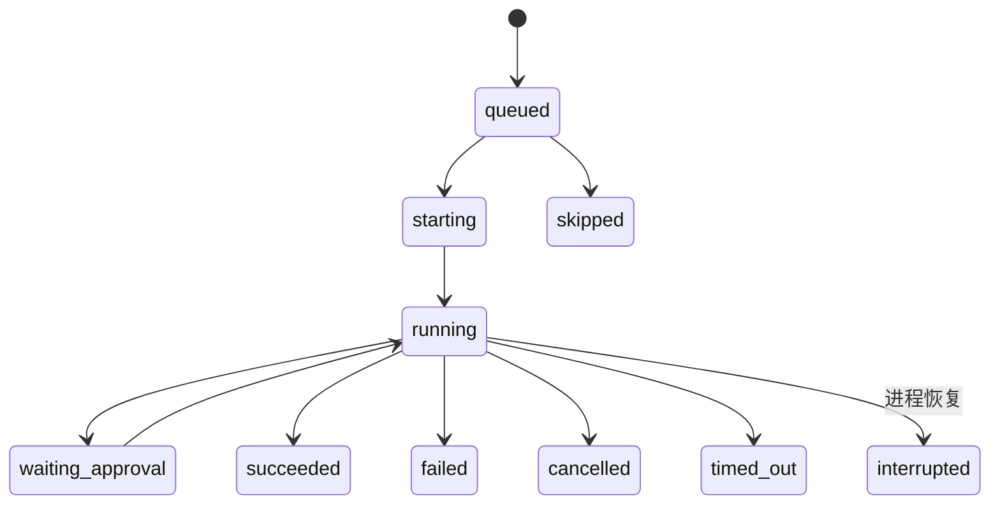

# Tasks：计划任务、运行状态与普通 Runtime 复用

[总目录](../../docs/architecture/README.md) · [Runtime](../runtime/README.md) · [主动助手](../proactive/README.md)

## 两个聚合与存储

`Task` 保存名称、提示词、Schedule、Limits、启用状态和执行方式；`Run` 保存某次触发的状态、SessionID、RequestID、用量、审批投影和短结果。路径是 `agents/<agent-id>/tasks/<task-id>/config.json` 与 `runs/<run-id>.json`。完整执行消息不复制到 Run JSON，而在普通 Session 的 `session.jsonl`。连续模式多个 Run 可复用 `PersistentSessionID`；独立模式每次创建 Session。

## 计划与运行状态

`Schedule` 支持 manual、once、interval、daily、weekly，`schedule.go` 处理时区和下一次触发。`schedulerLoop` 只在应用进程运行时扫描；`enqueueDue` 按 misfire/overlap 规则入队并更新下次时间；`dispatchLocked` 再次核对任务是否暂停和 Agent 是否可用，按全局及单 Agent 并发上限启动。手动 `RunNow` 和内部 `RunAutomation` 复用队列/Run Store。

`startRun` 冻结 Session 与 deadline，附加模型次数、工具次数、Token 和时间上限后调用 Runtime。`handleRuntimePayload` 订阅事件，把审批、模型/工具调用次数及终态写回 Run；失败可创建带 `ParentRunID` 的重试。启动时 `ReconcileInterrupted` 不重放未知工具副作用，`recoverRetries` 修复“失败已落盘而重试未入队”的崩溃窗口。Task 与 Session 删除要检查持续会话的共享引用，不能删一条 Run 就删除其他 Run 正在使用的 Session。

| 文件 | 职责 |
| --- | --- |
| `types.go`、`schedule.go` | 任务状态、限制、时区与下一次触发。 |
| `store.go` | Task/Run JSON、幂等创建、恢复扫描与引用查询。 |
| `manager.go` | 依赖、启动/关闭、Agent 删除期间的并发边界。 |
| `manager_task.go` | 创建/更新/暂停/删除及 Session 引用清理。 |
| `manager_schedule.go` | 入队、调度、Session 选择与启动。 |
| `manager_events.go` | Runtime Event → Run 状态、通知、重试。 |

调试时用 `TaskID → RunID → SessionID → Runtime RequestID` 跟踪，区分调度失败和模型执行失败。`Run` 只是控制面与摘要，详情到对应 Session JSONL 查。

## 一次到期任务如何落地

1. `enqueueDue` 读取 Task 的 `NextRunAt`，按 Misfire/Overlap 规则创建或跳过 Run，并提交下次运行时间。
2. `dispatchLocked` 取可分派 Run，重新读取 Task：暂停后的自动 Run 被取消；通知型 Run 发送通知；Agent 型 Run 要检查并发和 Agent 删除状态。
3. `resolveRunSession` 按 isolated/continuous 决定新建或复用 Session。连续引用失效时创建新 Session；真实读取损坏不能当“会话不存在”。
4. `startRun` 保存 SessionID/Deadline，调用 `Runtime.StartTurn`；`handleRuntimePayload` 根据 Request/Session 关联后续事件，更新调用次数、审批和终态。
5. 失败且允许重试时 `maybeRetry` 创建子 Run；启动恢复 `recoverRetries` 依靠 ParentRunID 去重。

暂停 Task 与调度周期共用 `cycleMu`，防止调度器拿着旧的 active 快照在暂停后继续入队。`DeleteRun` 与 `ClearRuns` 会计算剩余 Run 和 `PersistentSessionID` 的引用，只删无人引用的专用 Session。计划任务不在应用退出后后台继续运行；应用重新启动才执行错过任务策略。
